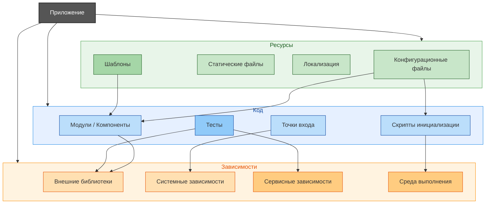

# Оптимизация размера и производительности приложений

  ОБЯЗАТЕЛЬНО
  ДЛЯ НОВИЧКОВ

Разработчику
Аналитику
Тестировщику  
Архитектору
Инженеру

---

## Почему программы стали весить больше

### Системный анализ роста объёма программного обеспечения  

> **Тезис для размышлений:**  
> *Современное программное обеспечение не растёт в объёме потому, что "добавляются новые функции" — оно растёт, потому что изменилась сама модель его создания: экономическая, технологическая и социальная.*

Если провести мысленный эксперимент и вернуться в начало 2000-х, можно с изумлением зафиксировать, что тогдашний *полноценный* текстовый редактор, электронная таблица и система управления базами данных комплектовались в одном установочном пакете размером **~30 МБ** — и работали без сетевого подключения, без регистрации, без предзагрузки модулей. Сегодня *одно* мобильное приложение, реализующее лишь часть функций того же редактора — *скажем, только просмотр и редактирование документов* — может весить **600 МБ–1,2 ГБ**. При этом интерфейс не стал сложнее, вычислительная логика — пользовательский сценарий — не расширился в десятки раз. Более того, в некоторых случаях *фактический исполняемый код*, непосредственно реализующий бизнес-логику, остаётся неизменным, а его объём — измеряется единицами мегабайт.

Вопрос, который ставит в тупик: **почему?**  
Не "как" — это можно обойти перечислением "растёт разрешение экранов", "добавляют аналитику", "используют фреймворки".  
А *почему* эти факторы стали доминирующими? Почему они перестали быть второстепенными? Почему их рост не привёл к компенсаторной оптимизации, а, напротив, к систематическому игнорированию эффективности?

Ответ на этот вопрос — в *системе*, в которой этот код создаётся.

---

### 1. Что вообще "весит" в приложении?

Прежде чем говорить о причинах роста размера, необходимо понять его структуру — то, из чего формируется конечный установочный или развёртываемый артефакт.  

Современное приложение — даже если внешне оно реализует простую задачу (например, "калькулятор" или "чек-лист") — состоит из множества независимых и частично пересекающихся компонентов:

---

#### 1.1. Исполняемый код (binary / bytecode)  

Это — непосредственно программная логика — функции, классы, алгоритмы, обработчики событий. В "идеальном мире" — это единственное, что должно весить *что-то*. Уже в 1990-х профессиональные программисты стремились ужать исполняемый код до минимума — например, игра *DOOM* (1993) содержала полностью отрендеренный 3D-мир, физику и сетевой код в **~2 МБ**.  

Сегодня же исполняемый код, даже на современных языках (Rust, Swift, Kotlin), при разумной архитектуре и минимизации зависимостей, может умещаться в **~15–50 МБ** — для приложений средней сложности (онлайн-торговля, соцсеть, банк).  

Однако в реальности он составляет, как правило, **менее 10%** объёма финального пакета.

---

#### 1.2. Статические ресурсы (assets)  

К этой категории относятся:  
- изображения (иконки, иллюстрации, аватары, скриншоты, баннеры);  
- аудио- и видеоклипы (анимации, обучающие ролики, звуковые эффекты);  
- векторная графика (SVG, PDF, шрифты, Lottie-анимации);  
- локализации (строки интерфейса для десятков языков);  
- предварительно сгенерированные данные (картография, каталоги, оффлайн-кэши).

С появлением экранов высокой плотности пикселей (Retina, 4K, AMOLED с поддержкой HDR) требование к разрешению и битовой глубине изображений выросло кратно. Если в 2010 году иконка 64×64 в 8-битной PNG-палитре весила ~1 КБ, то сейчас — одна и та же иконка, представленная в 6 вариантах (1×, 2×, 3×, Light/Dark mode, для iOS/Android) — может занимать `>`**200 КБ**.  

Масштабируется размер отдельного ассета и его *разнообразие*:  
- в мобильном приложении банка можно встретить `>`2 000 уникальных изображений, включая анимированные сценарии ошибок, загрузок, подтверждений;  
- в играх — 4K-текстуры для 3D-моделей: одна карта нормалей при разрешении 8192×8192 в формате BC7 может занимать `>`**32 МБ**.  

При этом, даже если устройство использует изображения только в 2× разрешении, сборка по умолчанию часто включает *все* варианты — для совместимости и упрощения CI/CD-процесса.

---

#### 1.3. Третьесторонние зависимости (библиотеки, SDK, фреймворки)  

Здесь — ключевой сдвиг парадигмы.  

В эпоху *"напиши сам"* (1970–1990-е), разработчик писал всё: от драйвера клавиатуры до компилятора шрифтов. В эпоху *"собери из кубиков"* (2010–н.в.), он *включает* готовые блоки:  
- для работы с сетью — OkHttp, Alamofire, Axios;  
- для UI — React Native, Flutter, Jetpack Compose, SwiftUI/UIKit;  
- для аналитики — Firebase Analytics, AppMetrica, Yandex.Metrica;  
- для авторизации — Google Sign-In, OAuth2 SDK, VK SDK;  
- для уведомлений — OneSignal, Firebase Cloud Messaging;  
- для кэширования — Glide, Picasso, Coil, SDWebImage;  
- для криптографии — Bouncy Castle, libsodium, OpenSSL (встраиваемая версия);  
- для отладки — Flipper, Sentry, Crashlytics.

Каждая такая зависимость влечёт за собой:  
- **статический код** (нативные `.so`, `.dll`, `.dylib`, `.framework`, `.aar`, `.jar`);  
- **метаданные** (манифесты, ProGuard-правила, ресурсы локализации);  
- **транзитивные зависимости** (если вы добавляете `A`, а `A` требует `B`, `C`, `D`, — они подтягиваются автоматически);  
- **мёртвый код** (функционал, который используется *в библиотеке*, но не вызывается *в вашем приложении*).

Давайте рассмотрим эти понятия.

**Исполняемый код** — последовательность инструкций, представленная в форме, пригодной для непосредственного выполнения целевой вычислительной системой (процессором или виртуальной машиной). Включает скомпилированный машинный код (например, `.exe`, `.elf`), байт-код JVM (`.class`, `.jar`), или интерпретируемый исходный код, загружаемый и выполняемый средой выполнения (например, Python-скрипты в контексте CLI-утилит). Да, тот самый основной код приложения, включая все его внутренние модули.

**Статический код** — код, не содержащий динамических конструкций, поведение которого полностью определяется на этапе компиляции и не меняется в ходе выполнения. Включает:
- код без динамической загрузки классов/модулей;
- без рефлексии (кроме статически разрешимых случаев);
- без генерации кода во время выполнения (`eval`, `Function()`, `Reflection.Emit`);
- без внешних модификаций (например, monkey-patching).

Используется, например, в анализе потока данных, проверке типов, оптимизации компиляторами.

**Мёртвый код** (*dead code*) — участки исходного кода, недостижимые в ходе выполнения приложения при любых допустимых входных данных. Включает:
- непосредственно недостижимые инструкции (`return; unreachable();`);
- методы/классы, на которые отсутствуют ссылки из "живого" кода (включая отсутствие ссылок через рефлексию, сериализацию, DI-контейнеры);
- неиспользуемые переменные, импорты, объявления.

Выявление мёртвого кода проводится статическими анализаторами (например, `ReSharper`, `SonarQube`, `detekt`, `ESLint no-unused-*`), а также инструментами tree-shaking (Webpack, Rollup) и оптимизаторами (R8, Terser) на этапе сборки.

**Статические ресурсы** — файлы, не подвергающиеся обработке или интерпретации непосредственно процессом выполнения, а используемые приложением в "готовом" виде: изображения (`.png`, `.svg`), стили (`.css`), клиентские скрипты (`.js`, `.mjs`), звук, шрифты и т.п. Характеризуются тем, что их содержимое не генерируется динамически при запросе (в отличие от динамически формируемых HTTP-ответов).

**Динамический ресурс** — ресурс, содержание или форма которого формируется в момент запроса (во время выполнения), а не заранее. В отличие от статических ресурсов, его формирование может зависеть от:
- контекста запроса (пользователь, роль, параметры URL);
- состояния сервера или внешних систем (БД, API);
- логики приложения (рендеринг шаблонов, генерация изображений, SSR-HTML).

Примеры: HTML, сгенерированный через Razor/Thymeleaf/Jinja; изображение, нарезанное под размер экрана; JSON, составленный на основе запроса к БД.

**Ассет** (*asset*, от англ. *asset* — актив) — обобщённое понятие, обозначающее любой ресурс, управляемый в рамках жизненного цикла приложения и используемый в его работе. Включает как статические ресурсы (изображения, шрифты), так и мета-компоненты (конфигурационные файлы, схемы, локализованные строки, скомпилированные шаблоны). В системах сборки (например, Gradle, Webpack, Unity) ассеты проходят этапы сборки, оптимизации, кэширования.

**Мета-компоненты** — компоненты, описывающие или управляющие другими компонентами, но не реализующие непосредственную предметную логику. Включают:
- схемы данных (JSON Schema, Protobuf `.proto`, XSD);
- декларативные конфигурации (BPMN-диаграммы, DSL-описания в ELMA365/BPMSoft);
- атрибуты/аннотации, влияющие на поведение фреймворков (например, `[BpProcess]`, `@RestController`);
- манифесты, конфигурации DI-контейнеров, правила маршрутизации.

Мета-компоненты позволяют отделить декларацию от реализации и обеспечивают инверсию управления.

**Третьесторонние зависимости** (*third-party dependencies*) — компоненты (библиотеки, фреймворки, утилиты), разрабатываемые и распространяемые сторонними организациями или сообществами, а не командой проекта. Используются через системы управления зависимостями (Maven, npm, NuGet и др.) и подключаются в виде артефактов, как правило, по публичным координатам (group/artifact/version, `package@version` и т.п.).

**Транзитивные зависимости** — зависимости, подключаемые неявно, как зависимости зависимостей. При указании прямой зависимости A→B, если B декларирует зависимость от C, то C может быть автоматически включена в сборку как транзитивная зависимость A→C. Управление транзитивными зависимостями требует контроля версионности и совместимости (например, через *dependency constraints* в Gradle или `resolutions` в Yarn).

**Публичные координаты** — уникальный идентификатор артефакта в системе управления зависимостями, позволяющий однозначно его локализовать и версионировать. Структура зависит от экосистемы:
- Maven/Gradle: `groupId:artifactId:version` (например, `org.springframework:spring-core:5.3.21`);
- npm: `name@version` или `@scope/name@version` (например, `lodash@4.17.21`);
- NuGet: `Id` + `Version` (например, `Newtonsoft.Json 13.0.3`);
- PyPI: `name==version` (например, `requests==2.31.0`).

Координаты публикуются в центральных или корпоративных репозиториях (Maven Central, npmjs.com, NuGet Gallery).

**Метаданные** — данные, описывающие структуру, свойства, контекст или поведение других данных или программных сущностей. Примеры:
- атрибуты/аннотации в C# (`[Serializable]`), Java (`@Entity`);
- `package.json`, `pom.xml`, `.csproj`;
- описания API (OpenAPI/Swagger);
- схемы БД (DDL), XSD/DTD-описания XML;
- теги в контейнерных образах (Docker labels);
- информация о версии, лицензии, авторе.

Метаданные не участвуют в исполняемой логике напрямую, но влияют на поведение инструментов сборки, развёртывания, анализа и среды выполнения.

**Атрибуты / Аннотации** — языковые конструкции, добавляющие метаданные к элементам кода (классам, методам, параметрам, сборкам). Не влияют на исполняемую логику напрямую, но используются:
- компиляторами (например, `[Obsolete]`);
- средой выполнения через рефлексию (например, `@Autowired`, `[HttpGet]`);
- инструментами анализа и генерации кода (например, `[ProtoContract]`, `@Entity`).

В C# — *attributes*, в Java/Kotlin — *annotations*, в TypeScript/JavaScript (через декораторы с ограничениями) — *decorators* (стадия *stage 3 proposal*).

**Описание API** — формализованная спецификация интерфейсов взаимодействия между компонентами, в первую очередь внешних (публичных) API. Стандарты:
- OpenAPI (ранее Swagger) — для REST/HTTP;
- AsyncAPI — для событийных (message-driven) систем;
- gRPC + Protobuf — для RPC;
- GraphQL SDL — для схем GraphQL.

Содержит — пути, методы, параметры, тела запросов/ответов, статус-коды, схемы типов, примеры, аутентификацию. Используется для генерации клиентов, серверных заглушек, документации и валидации.

**Теги** — вспомогательные метки, применяемые для классификации, группировки или аннотирования сущностей. Контексты:
- контейнеризация: `Dockerfile` → `LABEL` или теги образов (`myapp:v1.2.0`);
- документирование: `@param`, `@returns` в JSDoc/DocFX;
- CI/CD: теги Git-репозиториев для релизов;
- логирование и мониторинг: теги в OpenTelemetry (например, `service.name`, `http.status_code`);
- API: теги в OpenAPI для группировки эндпоинтов (например, `tag: "users"`).

Несут семантическую нагрузку, но не определяют поведение напрямую.

**Манифесты** — структурированные файлы, содержащие декларативные метаданные, критически важные для идентификации, разрешения, сборки или запуска программных компонентов. Примеры:
- `AndroidManifest.xml` (описывает компоненты приложения, разрешения, точки входа);
- `MANIFEST.MF` в JAR-архивах (определяет точку входа, версии зависимостей);
- `Cargo.toml`, `package.json`, `pyproject.toml`;
- Kubernetes-манифесты (описание состояния желаемой конфигурации кластера);
- `.appxmanifest` в Windows-приложениях.

Манифесты являются формализованными контрактами между компонентами и средой.

**Декларативные метаданные** — данные, описывающие *что должно быть*, а не *как это достигается*. Противопоставляются императивным инструкциям. Примеры:
- `@Controller` (Spring) — объявляет класс контроллером, без указания способа регистрации;
- `android:layout_width="match_parent"` — задаёт поведение, но не алгоритм измерения;
- BPMN-диаграммы — декларируют последовательность шагов, без кода их реализации;
- Kubernetes-манифесты — описывают желаемое состояние, reconciler приводит реальное состояние в соответствие.

Используются для повышения выразительности, абстракции и автоматизации.

**Формализованные контракты** — строго определённые соглашения между компонентами, обеспечивающие предсказуемое взаимодействие. Включают:
- интерфейсы (в языковом смысле: `interface`, `abstract class`);
- сигнатуры API (в OpenAPI — схемы и статус-коды);
- протоколы обмена (HTTP-методы + семантика, gRPC-сервисы);
- соглашения о формате данных (JSON Schema, Avro schema);
- контракты событий (Event Schema Registry в Kafka/Pulsar).

Контракты могут валидироваться статически (на этапе сборки) или динамически (runtime schema validation).

**ProGuard-правила** — директивы конфигурации для утилиты ProGuard (либо аналогов — R8, DexGuard), управляющие поведением обфускации, минификации и оптимизации Java/Kotlin-кода (в первую очередь для Android). Правила задают:
- какие классы/методы/поля должны быть сохранены (например, используемые через рефлексию или сериализацию: `-keep class com.example.DataModel`);
- какие сигнатуры не должны быть переименованы;
- какие оптимизации разрешены/запрещены.

Используются для предотвращения некорректного удаления или переименования "живого" кода.

**Директивы конфигурации** — управляющие инструкции, задающие поведение инструментов (компиляторов, сборщиков, анализаторов) без изменения исходной логики приложения. Примеры:
- `#pragma warning disable CS0618` (C#);
- `/* eslint-disable no-console */` (JavaScript);
- `-keep class ...` в ProGuard/R8;
- `optimization = "speed"` в `tsconfig.json`.

Являются мета-уровнем управления и часто интерпретируются на этапе сборки или статического анализа.

**Обфускация** — преобразование исполняемого кода с целью затруднения его анализа и обратной инженерии, без изменения функциональности. Методы:
- переименование идентификаторов (классов, методов — в короткие/случайные имена);
- удаление отладочной информации (имён переменных, строк исходного кода);
- встраивание ложных ветвлений, control-flow flattening.

Применяется в мобильной (Android/R8), десктопной (Dotfuscator) и веб-разработке (частично — через минификацию и encoding строк). Может нарушать работу кода, использующего рефлексию или сериализацию, если не сопровождается исключениями.

**Минификация** — процесс сокращения объёма кода (размера передачи и загрузки) за счёт удаления несущественных элементов:
- пробелов, переносов, комментариев;
- сокращения имён переменных и параметров (в пределах области видимости);
- оптимизации литералов (например, `true` → `!0`).

Отличается от обфускации: минификация *не ставит целью* затруднение понимания (хотя эффект может быть побочным), а ориентирована на производительность. Инструменты — Terser (JS), cssnano (CSS), ProGuard/R8 (Java/Kotlin bytecode).

**Оптимизация** — преобразование кода или данных с целью улучшения его характеристик (производительность, размер, энергопотребление, читаемость при определённых условиях), без изменения наблюдаемого поведения. Уровни:
- на этапе компиляции (inlining, dead code elimination, constant folding);
- на этапе сборки (tree-shaking, code splitting, DCE);
- на этапе выполнения (JIT-компиляция в JVM/V8, speculative execution);
- на уровне инфраструктуры (сжатие Gzip/Brotli, кэширование).

Оптимизация может быть *функционально нейтральной* (code size) или *поведенчески нейтральной* (time/space complexity preserved).

**Ресурсы локализации** — файлы, содержащие текстовые (и иногда медиа-) компоненты, адаптированные под конкретные языки, регионы или культуры. Реализуются через:
- `.resx` (C#), `strings.xml` (Android), `.properties` (Java), `.arb` (Flutter), `*.po`/`*.mo` (gettext);
- структурированные по коду локали (например, `ru`, `en-US`, `zh-Hans`);
- с поддержкой fallback-механизмов (если `en-GB` отсутствует — использовать `en`).

Обеспечивают интернационализацию (i18n) и локализацию (l10n) интерфейсов.

**Интернационализация** (*internationalization*, **i18n**) — проектирование и разработка приложения таким образом, чтобы его можно было адаптировать к различным языкам и регионам без инженерных переделок. Включает:
- вынос текстов во внешние ресурсы;
- поддержку Unicode и bidirectional text (BiDi);
- параметризованные форматы даты/времени/чисел/валют (через `Intl`, `java.time.format`, `CultureInfo`);
- адаптивные макеты (избегание фиксированных размеров, поддержка языков с разной длиной слов).

i18n — предварительная работа; локализация — последующая адаптация под конкретную локаль.

**Локализация** (*localization*, **l10n**) — процесс адаптации интернационализированного приложения под конкретную локаль (язык, регион, культуру). Включает:
- перевод текстовых ресурсов;
- адаптацию форматов (даты: `DD.MM.YYYY` → `MM/DD/YYYY`);
- корректировку изображений, цветов, иконок (культурные символы);
- соответствие юридическим требованиям (уведомления, политики).

Требует управления переводами (CAT-инструменты, платформы типа Crowdin/Lokalise), версионирования строк и контроля качества.

**fallback-механизм** — стратегия разрешения отсутствующих локализованных или конфигурационных ресурсов за счёт использования резервного варианта. Примеры:
- при отсутствии `ru-RU/strings.json` → использовать `ru/strings.json`, затем `en/strings.json`, затем `default/strings.json`;
- в .NET: `new CultureInfo("ru-RU")` → fallback chain: `ru-RU` → `ru` → `InvariantCulture`;
- в Android: `res/values-РRU/` → `res/values-ru/` → `res/values/`;
- в HTTP: `Accept-Language: fr-CH, fr;q=0.9, en;q=0.8` → сервер выбирает `fr`, если `fr-CH` недоступен.

Реализуется на уровне фреймворков или явно в коде (через `try…catch`, `??`, `Optional.orElse()`).

Например, добавление Firebase Analytics в Android-приложение увеличивает размер APK на **~20–35 МБ** — несмотря на то, что API вызова `logEvent()` состоит из нескольких строк. Причина — в архитектуре SDK — оно включает полный стек обработки событий, оффлайн-буфер, синхронизацию, валидацию, сжатие, криптографию, и даже собственный HTTP-клиент — *на случай, если системный сломается*.

Согласно исследованиям Google, в типичном коммерческом Android-приложении (100+ зависимостей) **до 60% исполняемого кода — не вызывается никогда**.  

Это не "лень" — это *архитектурный компромисс*:  
- скорость разработки ↑  
- кроссплатформенность ↑  
- надёжность (на уровне SDK) ↑  
- контроль над поведением ↓  
- размер ↓ — **нет**

---

#### 1.4. Платформенные требования (Apple, Google, Microsoft, Sony, Nintendo)  

Производители платформ активно диктуют условия развёртывания приложений — и эти условия прямо влияют на объём.

| Платформа | Пример требования | Влияние на размер |
|-----------|-------------------|-------------------|
| **iOS** | Поддержка всех разрешений иконок (iPhone 4–16 Pro Max, iPad mini–Pro, Apple Watch) | +2–5 МБ только иконок в Asset Catalog |
| **iOS** | Bitcode (включён по умолчанию до iOS 14) | +15–30% к размеру бинарника (intermediate representation) |
| **iOS** | App Thinning / Slicing | Уменьшает *установочный* размер на устройстве, но *архив* (IPA) в App Store — хранит все варианты |
| **Android** | Поддержка ABI (armeabi-v7a, arm64-v8a, x86, x86_64) | Если не фильтровать, один нативный модуль ×4 версии = ×4 размер |
| **Android** | Множественные DPI-ресурсы (mdpi, hdpi, xhdpi, xxhdpi, xxxhdpi) | Без `resConfigs` в Gradle — все включаются |
| **Web** | Поддержка старых браузеров (IE11, Safari `<`14) | Babel-polyfills, regenerator-runtime, core-js: +300–800 КБ минифицированного JS |
| **Windows** | MSIX-упаковка с зависимостями от WinUI 3, .NET 6+ | +150–400 МБ к установочному пакету (runtime included) |
| **Steam** | Требование к DRM, античиту, обновляемому лаунчеру | +50–200 МБ даже для 2D-игры |

Эти требования обеспечивают стабильность, безопасность, совместимость. Но они *необратимо* увеличивают минимальный порог размера — даже для "Hello World".

---

#### 1.5. Механизмы динамического поведения в статической упаковке  

Самая тонкая причина роста — *закладка вариативности*.

Современное приложение — это *множество потенциальных состояний*, из которых активируется лишь часть. Например:  

- **A/B-тестирование фич и UI** — код для 3 альтернативных экранов загружается сразу, хотя пользователь увидит только один;  
- **Feature flags** — логика новой функции присутствует в релизе за месяц до включения, закомментированная через `if (FeatureFlags.isNewCheckoutEnabled())`;  
- **Географическая сегментация** — модули для Китая (Alipay, WeChat SDK), для ЕС (GDPR-консент, DSGVO), для США (адвокаты, compliance) — включены во все сборки;  
- **Обратная совместимость** — поддержка API v1, v2, v3 в одном клиенте, чтобы не разрывать связь со старыми серверами;  
- **Debug-инструменты** — Flipper, Stetho, LeakCanary, даже в релизных сборках (по ошибке или "на всякий случай").

Эти элементы не отражаются в пользовательском интерфейсе, но они *исполняемы*, *загружаются в память*, *занимают место на диске* — и их удаление требует *ручного, осознанного* вмешательства, а не автоматизированной оптимизации.

---

### 2. Экономика разработки — почему "тяжело" стало выгоднее "лёгкого"

Технические факторы (ассеты, SDK, требования платформ) — лишь *инструменты*. Они не определяют направление эволюции ПО. Направление задаёт **экономика** — отношения затрат, прибыли, рисков и сроков. Чтобы понять, почему объём приложений растёт *быстрее*, чем их полезность, — надо перейти от уровня кода к уровню организации труда и рыночных стимулов.

---

#### 2.1. Стоимость разработчика и стоимость железа  

На заре вычислительной индустрии (1970–1990-е) лимитирующим ресурсом была *память устройства*. ОЗУ стоила **$1 000 за мегабайт** в 1980 году (в ценах того времени). Процессоры выполняли сотни тысяч операций в секунду. При этом программистов было мало, но они — *единственные*, кто мог реализовать функционал. В таких условиях **оптимизация была экономически обязательна**: ошибка в алгоритме могла сделать приложение просто невыполнимым.

Сегодня ситуация диаметрально противоположна:
- Стоимость ОЗУ в смартфоне: **менее $0.01 за МБ**;
- Стоимость SSD: **менее $0.005 за МБ**;
- Стоимость разработчика (senior, средняя по РФ): `>`**₽100 000 за человеко-месяц**, т.е. **~₽500–700 за МБ кода/ассетов**, если он *лишь удаляет* мёртвый код.

**Рациональное решение** для бизнеса:  
> *"Потратить $2 на дополнительную память в устройстве — дешевле, чем $200 на инженерное время для сокращения приложения на 2 МБ".*

Это *рациональный экономический выбор* в условиях избыточных ресурсов на клиентских устройствах, дефицита квалифицированных кадров, высокой конкуренции за время выхода на рынок (time-to-market).

---

#### 2.2. Time-to-market и технический долг  

В современной разработке доминирует модель *feature-driven delivery* — поставки управляются не качеством, а *списком функций*, которые должны появиться к дедлайну.

Технический долг (technical debt) здесь — *бухгалтерская категория*. Он позволяет:
- сократить сроки первого релиза на **30–50%** за счёт использования готовых решений без адаптации;
- делегировать задачи менее опытным разработчикам, используя высокоуровневые фреймворки;
- избежать рисков, связанных с "изобретением велосипеда" (например, написанием собственного HTTP-клиента).

Но, как и финансовый долг, технический долг **начисляет проценты**:
- каждое новое изменение требует больше времени из-за хрупкой архитектуры;
- тестирование усложняется — больше путей выполнения, больше условий;
- размер и потребление памяти монотонно растут, даже при отсутствии новых фич.

Ключевой момент: *проценты платит пользователь*.  
Компания "60 имён" или "Озон" не несут прямых издержек от того, что приложение весит 700 МБ. Пользователь теряет время, трафик, заряд аккумулятора. Но он не может точно связать это с конкретной фичей — он лишь *ощущает ухудшение UX*. И если альтернативы нет — он терпит.

---

#### 2.3. Модель монетизации как источник раздувания  

Бесплатные приложения — не альтруизм. Это *модель конверсии внимания в денежный поток*. В ней объём приложения напрямую связан с количеством возможных точек монетизации.

| Компонент | Пример | Прирост веса | Экономическое обоснование |
|----------|--------|--------------|---------------------------|
| Аналитика (AppMetrica, Firebase) | Сбор событий, A/B-тесты, funnel-анализ | +20–40 МБ | Повышение конверсии на 0.5% = +₽10 млн/год при 1 млн DAU |
| Рекламные SDK (AppLovin, Yandex Mobile Ads) | Pre-roll, interstitial, rewarded video | +15–30 МБ | CPM от — до $15 — окупаемость даже при 0.1% кликов |
| Внутренние маркетинговые движки | Push-кампании, dynamic feature flags, personalization engine | +10–25 МБ | Удержание +2% = отсрочка оттока на 1.5 мес ≈ +₽5 млн LTV |
| Интеграции партнёров | Страховки, кредиты, cashback-сервисы | +5–15 МБ на интеграцию | Комиссия от 5% до 25% с каждой транзакции |

Суммарно — одно банковское приложение, поддерживающее 3 банковских партнёра, 2 страховщиков, 1 кредитный сервис и 1 cashback-платформу — легко накапливает **+120–180 МБ** "инфраструктурного жира", не связанного с основной логикой.

И здесь возникает *парадокс оптимизации*:  
> Если вы уберёте рекламный модуль, приложение станет легче и быстрее — но вы потеряете $200 000 в месяц выручки.  
> Если вы уберёте аналитику, вы потеряете возможность A/B-тестировать — и ваша conversion rate упадёт на 3–7%.  
> Если вы замените React Native на нативную реализацию — вы сократите размер на 150 МБ, но потеряете 6 месяцев разработки и единый кодбейз.

**Оптимизация не является свободной**. Она требует *осознанного отказа от монетизационного потенциала*.

---

#### 2.4. Эффект супераппа и "защищённого контекста"  

Apple и Google поощряют "замкнутые экосистемы" — приложения, которые максимизируют время пользователя *внутри себя*. Это выгодно платформам (больше in-app purchases → 30% комиссии), и это выгодно разработчикам (выше LTV, ниже CAC).

Отсюда — тренд на **"супераппы"**: одно приложение вместо трёх.  
Пример: "СберБанк Онлайн" — это не только переводы и карты. Это:
- новостная лента (аналог Яндекс.Дзен);
- маркетплейс (аналог Ozon);
- ТВ-плеер (аналог ivi);
- мессенджер (аналог WhatsApp);
- инвестиционная платформа (аналог Tinkoff Invest);
- автоплатёж за ЖКХ (аналог Портала Госуслуг);
- кредитный калькулятор (аналог Credit.Club);
- ИИ-ассистент (аналог Алисы).

Каждая из этих подсистем — отдельный продуктовый блок, со своей командой, своим стеком, своими зависимостями. Они *не интегрируются в один код*, они *объединяются в один установочный пакет*. Возникает **структурная избыточность**:
- 3 разных JSON-парсера (из-за разных SDK);
- 2 реализации HTTP-клиента (OkHttp + Retrofit + Alamofire в гибридных модулях);
- дублирование иконок для одинаковых действий ("оплата", "пополнение", "перевод");
- 5 разных систем кэширования (для новостей, транзакций, акций, видео, профиля).

Это не архитектурная ошибка — это *естественное следствие организационной автономии команд*.  
И пока "суперапп" приносит больше прибыли, чем три отдельных — он будет расти.

---

### 3. Платформенные и инфраструктурные ловушки — как "стандарты" раздувают приложения

Даже если разработчик стремится к минимализму, он сталкивается с *системными требованиями*, которые делают лёгкость невозможной без жертвования совместимостью или функциональностью.

---

#### 3.1. Поддержка множества конфигураций  

Современное мобильное приложение должно работать на:
- 2 ОС (iOS, Android) + 3–5 крупных кастомных прошивок (MIUI, EMUI, ColorOS);
- 5 архитектурах (arm64-v8a, armeabi-v7a, x86_64, x86, arm64-v8a + Apple Silicon);
- 6 DPI-уровнях (mdpi–xxxhdpi) + 2 режимах темы (Light/Dark);
- 50+ локализациях (включая rtl-языки: арабский, иврит).

Если не использовать *динамическую доставку* (Google Play Feature Delivery, Apple On-Demand Resources), — все эти артефакты *пакуются в один APK/IPA*.  

Пример: приложение с 50 иконками.  
- Для Android: 5 DPI × 50 = **250 файлов**;  
- Для iOS: 3 scale × 2 устройства (iPhone/iPad) × 50 = **300 файлов**;  
- Итого: **550 изображений**, хотя реально используется **50**.

Даже при сжатии WebP/LZ4 суммарный объём: **15–25 МБ**.  
При этом *App Thinning* и *Play Asset Delivery* позволяют сократить это до **2–3 МБ на устройство** — но требуют:
- настройки CI/CD (Gradle flavors, Xcode schemes);
- тестирования на 10+ конфигурациях;
- мониторинга ошибок доставки.

Многие команды отказываются — проще "закинуть и забыть".

---

#### 3.2. Обязательные SDK как условие существования  

Некоторые зависимости — не опциональны. Они *требуются* для публикации или базовой функциональности:

| SDK | Почему обязателен | Размер |
|-----|-------------------|--------|
| Google Play Services (Android) | Авторизация, Location, SafetyNet (anti-bot), Play Billing | 30–50 МБ (в APK) |
| Firebase Crashlytics | Требование инвесторов/страховщиков — мониторинг крашей | +5–8 МБ |
| Google Maps SDK | Отображение точек на карте (банкоматы, отделения) | +12–20 МБ |
| Яндекс.Метрика | Юридическое требование — сбор статистики для отчётов РКН | +7–10 МБ |
| VK SDK / Sber ID / Госуслуги | Единая авторизация по федеральному указу | +3–6 МБ каждая |

Это **непрерывная нагрузка**, не зависящая от желания разработчика. Особенно критично для *государственных и финансовых приложений*: там требования регуляторов — жёстче, чем здравый смысл.

---

#### 3.3. "Защита от дурака" и defensive programming  

Современные языки (Swift, Kotlin, TypeScript) поощряют *defensive coding* — проверки, валидации, fallback-пути. Это повышает надёжность, но:

- Swift: generic specialization → дублирование кода для разных типов;
- Kotlin: inline-функции с лямбдами → раздутие bytecode;
- TypeScript — sourcemaps, enum metadata, decorator polyfills → +20–40% к JS-bundle;
- Java: ProGuard/R8 не удаляют всё — особенно если есть reflection или dynamic classloading.

Пример: функция `validateEmail(String email)` в Java + Retrofit + Gson + OkHttp + Room:
- Исходный код: 12 строк;
- Скомпилированный байткод: ~1.2 КБ;
- С учётом зависимостей (Gson TypeAdapter, Retrofit Converter, Room Entity): +8 КБ;
- С учётом строковых ресурсов локализации (ошибки): +4 КБ;
- Итого: **13.2 КБ на 12 строк**.

Это не "непрофессионализм". Это *цена безопасности и сопровождаемости*.

---

### 4. Почему рефакторинг не происходит (и когда он возможен)

Рефакторинг — не "чистка кода". Это *проект по снижению стоимости владения*. Но он требует *временных и финансовых инвестиций* без немедленного ROI.

---

#### 4.1. Условия, при которых рефакторинг окупается  

Рефакторинг целесообразен, если:
- приложение стабильно приносит прибыль `>`**₽5 млн/мес**;
- поддержка текущей версии требует `>`**30% инженерного времени**;
- ожидается рост аудитории **в 2–3 раза** (нагрузка на инфраструктуру растёт нелинейно);
- планируется выход на новые платформы (TV, Auto, Wear) — общий кодбейз упрощает масштабирование.

В остальных случаях — экономически выгоднее *переписать с нуля*, когда старая кодовая база становится "якорем".

---

#### 4.2. Практические стратегии сдерживания роста  

Даже в условиях feature-driven delivery возможны *микроинвестиции* в оптимизацию:

| Тактика | Эффект | Сложность |
|--------|--------|-----------|
| **Tree shaking + code splitting** | Удаление мёртвого кода на этапе сборки | Высокая (требует strict dependency graph) |
| **Asset deduplication** (например, `res-optimizer`) | -5–15% размера APK/IPA | Низкая |
| **Dynamic feature modules** (Android), **On-Demand Resources** (iOS) | Загрузка модулей по запросу (кредиты, инвестиции) | Средняя |
| **MicroG / open-source замены SDK** | Замена Google Play Services на 3 МБ реализацию | Высокая (риск некомплаенса) |
| **WebP/AVIF + crunch compression** | -30–50% размера графики без потерь | Низкая |
| **ProGuard/R8 aggressive shrinking** | -10–25% bytecode | Средняя (требует тестирования) |

Ключевой принцип: **автоматизация**.  
Оптимизация должна быть частью CI/CD — как unit-тесты. Если её нельзя включить в pipeline, — она не будет выполняться.

---

### 5. Роль менеджмента — как организационные решения формируют техническую реальность

Если рассматривать увеличение размера приложений исключительно через призму "некомпетентности разработчиков" или "жадности бизнеса", можно прийти к упрощённому и неверному выводу: *нужно нанять лучших инженеров и поставить им "правильные KPI"*. На практике же архитектура ПО — это отражение **организационной структуры**, **моделей принятия решений** и **системы ценностей**, заложенной в компанию на уровне стратегии.

---

#### 5.1. Продуктовый менеджмент как генератор технического долга  

Продуктовый менеджер (PM) отвечает за *ценность для пользователя*. Его ключевые метрики — DAU/MAU, retention, LTV, conversion rate. Он не измеряет "размер APK" и не несёт ответственности за время компиляции. Его задача — найти гипотезу, проверить её, масштабировать успех.

Результат — *feature creep*: постепенное расширение функционала далеко за пределы первоначального назначения продукта.  
Классический паттерн:
1. Приложение решает одну задачу (калькулятор).  
2. Данные показывают, что 12% пользователей вводят суммы, кратные 10 000 ₽ → гипотеза: "Пользователи считают кредиты".  
3. Эксперимент: добавить кредитный калькулятор.  
4. Он даёт +0.8% retention → решение: оставить как постоянную фичу.  
5. Партнёрский отдел заключает договор с банком: "Если покажем ставки — они дадут нам 3 ₽ за лид".  
6. Интеграция → +5 МБ (новый клиент API, валидатор, UI-модалка).  
7. Аналитика: "15% пользователей кредитного калькулятора *не завершают* расчёт" → гипотеза: "Им не хватает данных о страховке".  
8. → интеграция со страховой компанией.  
9. → новая SDK.  
10. → ещё +3 МБ.

И так 20 итераций.  
Из 50 МБ приложения:
- 5 МБ — ядро (калькуляция);
- 12 МБ — UI-фреймворк и базовые сервисы;
- 33 МБ — "ценность" — 7 интеграций, 3 A/B-эксперимента, 2 системы аналитики, 1 рекламный агрегатор.

**Это не плохой PM. Это *успешный* PM.**  
Он растит метрики. Он закрывает OKR. Он получает премию.  
Технические последствия его решений *невидимы* в его системе отчётности.

---

#### 5.2. Организационная автономия и архитектурная целостность  

Крупные продукты (СберБанк, Wildberries, Ozon) разрабатываются **десятью и более командами**:
- Core Platform — фреймворк, авторизация, глобальный кэш;
- Loans — кредиты;
- Insurance — страховки;
- Marketplace — товары;
- Ads — реклама;
- Analytics — метрики;
- Notifications — пуш-система;
- и т.д.

Каждая команда:
- имеет свой бэклог;
- работает в своём ритме (2-недельные спринты);
- отвечает за свои KPI;
- использует *свои* зависимости ("нам нужен Apollo Client v3.8, вы — v2.6, но мы не можем ждать");
- хранит *свои* ассеты (логотип банка партнёра — в трёх местах папки `res/drawable`).

Попытка централизовать:
- унификацию библиотек → требует синхронизации релизов → замедляет feature delivery;
- единый asset pipeline → требует CI/CD-революции → требует инженерного времени;
- shared code ownership → требует культуры инженерной ответственности → требует HR-политики.

Без сильного архитектурного лидера на уровне CTO — такие инициативы гасятся на этапе "это не входит в наш спринт".

---

#### 5.3. Отсутствие метрик качества на уровне бизнеса  

В отличие от DAU или revenue, **техническое качество не имеет прямого финансового измерителя** — до тех пор, пока оно не превращается в кризис.

Вот что *не отслеживается* в большинстве компаний:
| Показатель | Почему не измеряется | Последствия |
|-----------|------------------------|-------------|
| **APK/IPA size delta per release** | "Маркетинг не видит в этом ценности" | Рост на 10–15% за квартал → через 2 года ×4 |
| **Dead code ratio** | Требует инструментов (R8, ProGuard stats, code coverage) | До 60% неиспользуемого кода — по данным Google |
| **Asset duplication ratio** | Нет автоматического аудита | +5–15% размера "бесплатно" |
| **Dependency tree depth & breadth** | Визуализация сложна (BOM, SBOM) | 200+ транзитивных зависимостей — норма для enterprise-app |

Технический долг — это *невидимый актив*, пока он не обрушивает CI, не ломает релиз или не вызывает регуляторную проверку (например, из-за устаревшей криптобиблиотеки).

---

#### 5.4. "Эффективные менеджеры" и иллюзия контроля  

В условиях высокой конкуренции и неопределённости менеджмент стремится к *предсказуемости*. Отсюда — давление на:
- **стандартизацию стека** ("все на React Native") — даже если натив был бы эффективнее;
- **повторное использование** ("возьмите UI-кит из библиотеки") — даже если он тащит 80% ненужного функционала;
- **отчётность по задачам** ("сколько тикетов закрыто") — а не по результату.

Это создаёт *локальную эффективность* при *глобальной неэффективности*:
- Команда быстрее закрывает задачи → но каждая задача добавляет 2–3 МБ;
- Унификация ускоряет onboarding → но общий кодбейз раздувается;
- CI проходит за 10 минут → но половина тестов — ложноположительные, потому что mock-и перегружены.

---

### 6. Инженерная этика и ответственность — можно ли остановить "инфляцию"?

На фоне описанной системы возникает закономерный вопрос: **имеет ли индивидуальный разработчик право (и возможность) сопротивляться?**

Да — но только если он осознаёт свою роль как *стейкхолдера архитектуры*.

---

#### 6.1. Право на "нет"  

В профессиональной инженерной практике (например, в гражданском строительстве) существует понятие **профессиональной ответственности**. Инженер может и должен отказаться от выполнения работ, если они угрожают безопасности, даже под давлением заказчика.

В IT такой нормы *нет*.  
Но её можно ввести — начиная с малого:
- "Я не добавлю этот SDK, пока мы не оценим его impact на размер и безопасность";
- "Я не приму PR, где дублируются ассеты без оправдания";
- "Я внесу в Definition of Done: проверка размера APK/IPA и сравнение с baseline".

Это не "саботаж". Это *профессиональное суждение*.

---

#### 6.2. Микрооптимизации как акт сопротивления  

Даже в условиях feature-driven delivery возможны действия, не требующие "разрешения":
- Использовать `shrinkResources true` и `minifyEnabled true` в Gradle — даже если в проекте "так не делают";
- Предлагать замену `Glide` → `Coil` (на 5 МБ легче);
- Переводить PNG → WebP → AVIF (экономия до 50%);
- Отказываться от `implementation` в пользу `api` только при необходимости;
- Проверять, используется ли `android:allowBackup="true"` — и отключать, если не требуется;
- Удалять `debugImplementation` из релизных сборок.

Эти действия:
- не нарушают сроков;
- не требуют согласования с PM;
- снижают технический долг *накопительно*.

---

#### 6.3. Архитектурная гигиена как культура  

Компании, где техническое качество — часть культуры (например, *Basecamp*, *Linear*, *Figma* на ранних этапах), придерживаются нескольких принципов:
1. **Минимализм как default**: "Если нельзя доказать необходимость — не добавляй".
2. **Оценка стоимости владения**: каждая фича → TCO (Total Cost of Ownership): разработка + поддержка + инфраструктурная нагрузка + риски.
3. **Бюджет на "невидимое"** — 10–20% спринта — на рефакторинг, документацию, тесты.
4. **Открытая метрика качества** — размер APK, время cold start, crash-free % — на дашборде рядом с DAU.

Такие компании не "оптимизируют ради оптимизации". Они *защищают margin*, который даёт им гибкость:  
— возможность быстро реагировать на регуляторные изменения;  
— масштабироваться на новые платформы (TV, Auto) без переписывания;  
— сохранять контроль над производительностью при росте аудитории.

---

### 7. Будущее — сценарии развития

#### 7.1. Пессимистичный сценарий — "инфляция" как норма  
- Средний размер мобильного приложения к 2030 году — **1.5–2 ГБ**;
- Базовые модели смартфонов — от 256 ГБ флэш-памяти;
- "Лёгкие" альтернативы (Progressive Web Apps, Instant Apps) — маргинальны, так как не дают доступа к монетизации;
- Рынок делится:  
  - *Enterprise-grade apps* — тяжёлые, feature-rich, с полной аналитикой;  
  - *Gov/edu apps* — субсидируемые, оптимизированные, но устаревающие за 2 года;  
  - *PWA-lite* — для развивающихся рынков, но без push, offline, deep linking.

---

#### 7.2. Оптимистичный сценарий — "возрождение эффективности"  
- Регуляторы вводят требования к *энергоэффективности ПО* (как в ЕС для устройств);
- Потребители начинают выбирать приложения по "eco score" (размер, фоновая активность, трафик);
- Платформы (Apple/Google) вводят *лимиты на размер обновления* для App Store / Play Market;
- Появляются новые архитектуры:  
  - **Edge-first apps** — большая часть логики на edge-нодах, клиент — thin shell;  
  - **Modular app stores** — пользователь сам выбирает, какие модули установить ("только переводы", "без рекламы", "только оффлайн-карты");  
  - **WebAssembly-based runtimes** — один бинарник для всех платформ, без нативных зависимостей.

---

#### 7.3. Реалистичный сценарий — дифференциация  

Качество и эффективность станут **премиальными характеристиками**, как:
- шумоизоляция в автомобилях;
- энергопотребление в технике;
- состав в продуктах питания.

Люди будут платить за:
- приложения с гарантией "`<`100 МБ";
- подписки "без аналитики и трекинга";
- open-source-альтернативы с прозрачной архитектурой.

Именно здесь откроются возможности для:
- нишевых разработчиков;
- государственных инициатив (например, "Госуслуги Лайт");
- образовательных проектов (как ваша *"Вселенная IT"*), объясняющих:  
  > *"ПО не должно быть тяжёлым. Оно *становится* тяжёлым — потому что мы позволяем этому происходить. И мы можем это изменить".*

---

{/* http-basics-link  */}

  
Основа по протоколу

  

  Базовый разбор HTTP и HTTPS находится в отдельной статье — [HTTP как основа веб-интеграций](/encyclopedia/2-system-network/2-09-osnovy-integratsionnogo-vzaimodeystviya/118).

  

{/* sidebar-collections */}

---

## В подборках

Статья входит в [тематические подборки](/about/collections) и блок "С чего начать?" на [главной](/). Соседние шаги того же маршрута:

**Системное программирование** — [Выполнение кода — о разделе](/encyclopedia/4-code-dev/4-03-vypolnenie-koda/intro), [Системное программирование на C++](/encyclopedia/5-languages/5-06-cpp/21), [Системное администрирование — о разделе](/encyclopedia/2-system-network/2-06-sistemnoe-administrirovanie/intro), [C++ — о разделе](/encyclopedia/5-languages/5-06-cpp/intro), [Терминал — о разделе](/encyclopedia/2-system-network/2-05-terminal/intro), [Rust — о разделе](/encyclopedia/5-languages/5-13-rust/intro).

{/* /sidebar-collections */}

---
