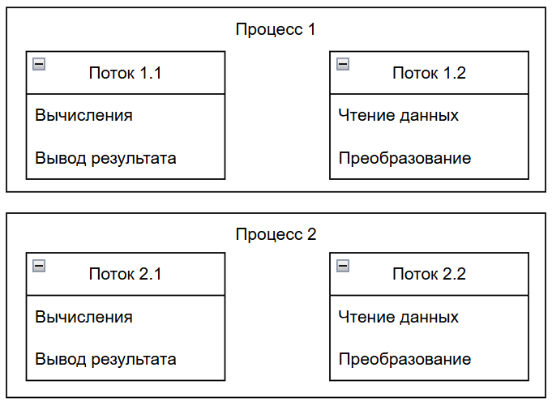

---
title: Процессы и потоки выполнения
tags: [beginner, advanced, required, all, analytic, engineer, developer, architector]
description: Параллельное выполнение задач. Концепции параллелизма.
---

import ProcessThreadVisualizer from '@site/src/components/ProcessThreadVisualizer.jsx';

# Процессы и потоки выполнения

<div class="article-tags">
  <span class="tag tag-required">ОБЯЗАТЕЛЬНО</span>
  <span class="tag tag-beginner">ДЛЯ НОВИЧКОВ</span>
  <span class="tag tag-advanced">НЕ ДЛЯ НОВИЧКОВ</span>
  <span class="tag tag-inprogress">В РАЗРАБОТКЕ</span>
</div>
<span class="complexity-badge">Разработчику</span>
<span class="complexity-badge">Архитектору</span>
<span class="complexity-badge">Инженеру</span>

## Процессы и потоки

### Что такое процесс и что такое поток?

Ранее мы рассмотрели, что такое процессы и потоки. Сейчас немного углубимся в их управление. Это важно!

---

★ **Процесс** – это экземпляр запущенной программы. У каждого процесса есть собственное адресное пространство (память), файловые дескрипторы и системные ресурсы.

---

★ **Поток** – это единица выполнения внутри процесса. Все потоки одного процесса разделяют общее адресное пространство.

---

Программа, работающая в одном потоке, выполняется последовательно, без параллелизма. То есть, программа выполняет одно действие за другим. Представим, что у нас есть задача обработать большой массив данных: прочитать данные, преобразовать их, выполнить вычисления, снова преобразовать и вывести результат. Однопоточная программа выполнит это так:

```
Единый поток: 
Прочитать - преобразовать - вычислить - преобразовать - вывести на экран.
```

---

Многопоточные же программы могут выполнять несколько задач одновременно:
```
Поток 1 : Читает данные из файла.
```
```
Поток 2 : Преобразует данные, которые уже прочитаны Потоком 1.
```
```
Поток 3 : Выполняет вычисления на основе преобразованных данных.
```
```
Поток 4 : Преобразует результаты вычислений в конечный формат.
```
```
Поток 5 : Выводит результаты на экран или записывает их в файл.
```

---

Потоки работают одновременно, но координируют свои действия через общую память. Например, Поток 2 начинает преобразование только после того, как Поток 1 завершил чтение очередной порции данных. Если один поток ждёт (например, Поток 1 ждёт чтения данных с диска), другие потоки продолжают работу.

Многопроцессорные программы создают несколько процессов, каждый из которых работает независимо. Они не разделяют память, что делает их более безопасными, но усложняет обмен данными. Здесь каждый процесс выполняется независимо.

---

Та же задача - обработка большого массива данных, но теперь каждый процесс выполняет свою часть работы независимо:

```
Процесс 1 : Читает данные из файла и передает их в очередь или файл.
```
```
Процесс 2 : Преобразует данные, полученные от Процесса 1, и сохраняет результат в другую очередь или файл.
```
```
Процесс 3 : Выполняет вычисления на основе преобразованных данных.
```
```
Процесс 4 : Преобразует результаты вычислений в конечный формат.
```
```
Процесс 5 : Выводит результаты на экран или записывает их в файл.
```

---

Каждый процесс работает независимо и не разделяет память с другими процессами. Для обмена данными между процессами используются механизмы, такие как очереди, файлы или сокеты. Например, Процесс 1 записывает данные в файл, а Процесс 2 читает их оттуда.



---

Разница между процессом и потоком:

| Аспект | Процесс | Поток |
| :--- | :---: | ---: |
|Адресное пространство	|У каждого процесса свое адресное пространство (память).	|Все потоки одного процесса разделяют общее адресное пространство.
|Обмен данными	|Обмен данными между процессами сложнее (через файлы, сокеты, очереди).	|Обмен данными между потоками проще (через общую память).
|Безопасность	|Более безопасны, так как процессы изолированы друг от друга.	|Менее безопасны, так как общая память может привести к гонкам данных.
|Создание/уничтожение	|Создание и уничтожение процессов дороже (затраты на ресурсы).	|Создание и уничтожение потоков дешевле.
|Параллелизм	|Может выполняться на разных процессорах (истинный параллелизм).	|Может выполняться параллельно на одном процессоре (через переключение).

<ProcessThreadVisualizer />

Потоки – это легковесные единицы выполнения внутри процесса. Они разделяют общую память, что позволяет им быстро обмениваться данными. Операционная система управляет потоками, переключая их между задачами (контекстное переключение).

---

## Разделение выполнения на процессы и потоки в коде

Программисты разделяют выполнение задачи на несколько единиц обработки, чтобы ускорить работу программы или сделать её более отзывчивой.

### Создание потоков внутри одного процесса

Потоки создаются для задач, требующих высокой скорости обмена данными и минимальных накладных расходов. Основная идея заключается в том, что все потоки работают в рамках одного адресного пространства программы.

Создание потока обычно происходит через вызов специальной функции или использование встроенной библиотеки языка. Операционная система выделяет ресурсы для нового потока: стек, регистры процессора и идентификатор. После создания поток начинает выполняться параллельно с основным потоком программы.

Типичные задачи для многопоточности включают:
- Интерфейс пользователя должен оставаться отзывчивым во время тяжелых вычислений.
- Параллельный ввод данных из сети или диска без блокировки основного кода.
- Одновременная обработка нескольких запросов от пользователей в серверном приложении.
- Фоновая загрузка ресурсов (картинок, видео) пока пользователь читает текст.

Пример логики работы с потоками выглядит так: программа создает новый поток, передает ему задачу, и основной код продолжает работать. Когда задача завершается, поток уведомляет программу о результате. Если потоки обращаются к общим данным, они используют механизмы синхронизации, такие как мьютексы или семафоры, чтобы избежать конфликтов.

---

### Создание отдельных процессов

Процессы создают, когда требуется полная изоляция друг от друга. Каждый процесс получает собственное адресное пространство, файлы и системные ресурсы. Это гарантирует, что ошибка в одном процессе не сломает другие процессы или основную программу.

Операционная система запускает новый процесс, копируя состояние родительского процесса или загружая новую программу. Процесс имеет независимый набор переменных, указателей и стека. Обмен данными между процессами требует использования специальных механизмов межпроцессного взаимодействия.

Типичные задачи для многопроцессности включают:
- Запуск тяжелых вычислений, которые могут привести к зависанию системы.
- Выполнение недоверенного кода или плагинов в безопасной среде.
- Масштабирование приложения на многоядерные системы с использованием истинного параллелизма.
- Изоляция критических компонентов системы для повышения надежности.

Пример логики работы с процессами: основная программа запускает дочерний процесс, который выполняет свою задачу. Дочерний процесс может читать данные из общего файла или получать их через каналы связи. После завершения работы родительский процесс забирает результат и завершает дочерний процесс.

---

### Механизмы межпроцессного взаимодействия

Когда процессы не имеют общей памяти, им необходимо использовать внешние каналы для передачи информации. Эти механизмы обеспечивают обмен данными между изолированными средами.

Каналы ввода-вывода позволяют одному процессу писать данные, а другому — читать их. Это работает как труба, где данные текут в одном направлении. Программисты часто используют этот метод для передачи больших объемов данных между этапами обработки.

Файлы служат долговременным хранилищем для обмена данными. Один процесс записывает результат в файл, другой считывает его позже. Этот метод прост в реализации, но требует управления доступом к файлам и очистки временных данных.

Очереди сообщений предоставляют структурированный способ передачи данных. Процессы отправляют сообщения в очередь, и получатель забирает их по мере готовности. Этот подход позволяет развязать скорость отправки и получения данных.

Сокеты обеспечивают сетевое взаимодействие даже между процессами на одной машине. Они работают как виртуальные провода, соединяющие два приложения. Этот метод универсален и используется для распределенных систем.

---

### Сравнение подходов к реализации

Выбор метода зависит от требований к производительности, безопасности и сложности разработки. Потоки требуют меньше ресурсов и обеспечивают быстрый обмен данными, но усложняют управление состоянием общих переменных. Процессы сложнее в настройке, но гарантируют стабильность и безопасность.

В современных системах часто комбинируют оба подхода. Программа может создавать несколько процессов для изоляции критических задач, а внутри каждого процесса использовать потоки для оптимизации вычислений. Такая гибридная архитектура позволяет достичь максимальной эффективности.

Разработчики должны учитывать ограничения операционной системы и аппаратного обеспечения. Некоторые системы лучше справляются с большим количеством потоков, другие — с процессами. Правильный выбор архитектуры влияет на скорость работы программы и её устойчивость к ошибкам.

---

## Инструменты языков программирования для работы с процессами и потоками

Каждый язык программирования предоставляет свои средства для создания и управления процессами и потоками. Эти инструменты абстрагируют сложность работы с операционной системой и позволяют разработчикам сосредоточиться на логике приложения.

---

### Python

Язык Python предлагает модуль `threading` для работы с потоками. Он позволяет создавать легковесные единицы выполнения внутри одного процесса. Модуль предоставляет класс `Thread`, который принимает функцию и аргументы для запуска. Для синхронизации используются объекты `Lock`, `Event` и `Condition`.

Для процессов в Python существует модуль `multiprocessing`. Он создает отдельные процессы, каждый со своим интерпретатором Python. Модуль автоматически управляет передачей данных между процессами через очереди и каналы. Класс `Process` аналогичен `Thread`, но работает в изолированной среде.

Библиотека `concurrent.futures` объединяет возможности потоков и процессов в единый интерфейс. Она позволяет запускать задачи асинхронно и получать результаты через объект `Future`. Этот инструмент упрощает написание конкурентного кода.

---

### Java

Язык Java использует класс `Thread` для создания потоков. Разработчик может наследовать этот класс или реализовать интерфейс `Runnable`. Поток выполняется методом `run()`. Для управления потоками применяется пакет `java.util.concurrent`.

Модуль `ExecutorService` представляет собой пул потоков, который управляет созданием и уничтожением потоков автоматически. Разработчик передает задачи в виде функциональных интерфейсов `Callable` или `Runnable`. Система сама распределяет нагрузку между потоками.

Для процессов в Java используется механизм `ProcessBuilder` или `Runtime.exec()`. Они запускают внешние программы и предоставляют доступ к их стандартному вводу и выводу. Данные между процессами передаются через потоки ввода-вывода.

---

### C# (.NET)

В экосистеме .NET для потоков предназначен класс `Система.Threading.Thread`. Он создает потоки с помощью конструктора, принимающего делегат. Для управления состоянием потоков используются структуры `Mutex`, `Semaphore` и `AutoResetEvent`.

Асинхронное программирование в C# реализуется через ключевые слова `async` и `await`. Они позволяют выполнять операции ввода-вывода без блокировки потока. Библиотека `Task Parallel Library` (TPL) предоставляет класс `Task` для работы с асинхронными операциями.

Для процессов используется класс `Система.Diagnostics.Process`. Он запускает внешние приложения и позволяет управлять их жизненным циклом. Обмен данными осуществляется через потоки `StandardOutput` и `StandardInput`.

---

### JavaScript (Node.js)

JavaScript в браузере работает в одном потоке, но Node.js поддерживает многопоточность через модуль `worker_threads`. Он создает отдельные рабочие потоки, которые выполняют тяжелые вычисления параллельно с основным потоком.

Для процессов в Node.js доступен модуль `child_process`. Он запускает дочерние процессы и предоставляет методы `spawn`, `fork` и `exec`. Подход `fork` создает новый экземпляр Node.js, что позволяет использовать IPC для обмена сообщениями.

Библиотека `cluster` позволяет создавать кластеры процессов, использующих все ядра процессора. Главный процесс распределяет входящие соединения между дочерними процессами.

---

### Go

Язык Go имеет встроенную поддержку потоков через концепцию горутин. Горутина — это легкий поток, управляемый самим компилятором. Ключевое слово `go` запускает функцию в новой горутина.

Для коммуникации между горутинами используется канал (`channel`). Каналы позволяют безопасно передавать данные между потоками без явной синхронизации. Библиотека `sync` предоставляет примитивы для управления доступом к общим ресурсам.

Процессы в Go создаются через пакет `os/exec`. Он запускает внешние команды и возвращает объект процесса. Обмен данными происходит через стандартные потоки ввода-вывода.

---

### C++

В C++ для потоков используется библиотека `<thread>`. Она позволяет создавать потоки, передавая функцию и аргументы в конструктор. Для синхронизации применяются классы `std::mutex`, `std::lock_guard` и `std::condition_variable`.

Процессы в C++ создаются через системные вызовы `fork()` и `exec()` в Unix-системах или функции `CreateProcess` в Windows. Эти методы запускают новые экземпляры программы.

Библиотека Boost предоставляет расширенные возможности для работы с потоками и процессами, включая асинхронное выполнение и пулы потоков.

---

### Rust

Язык Rust использует библиотеку `std::thread` для создания потоков. Она обеспечивает безопасность памяти при работе с общими данными. Для синхронизации применяются типы `Arc` и `Mutex`.

Процессы в Rust создаются через модуль `std::process`. Функция `Command` позволяет запускать внешние программы и управлять их выводами.

Библиотека `tokio` предоставляет асинхронную модель выполнения, которая эффективно использует потоки для высоконагруженных приложений.

---