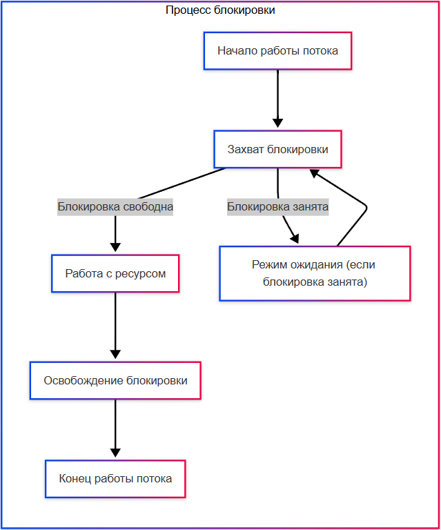
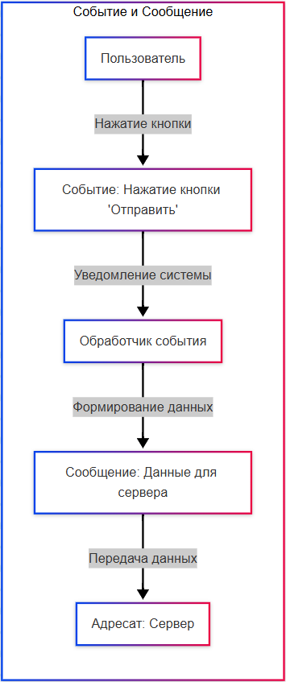

import RaceConditionDemo from '@site/src/components/RaceConditionDemo.jsx';

# Управление потоками в многозадачных системах

<div class="article-tags">
  <span class="tag tag-required">ОБЯЗАТЕЛЬНО</span>
  <span class="tag tag-beginner">ДЛЯ НОВИЧКОВ</span>
</div>

<span class="complexity-badge">Разработчику</span>
<span class="complexity-badge">Архитектору</span>
<span class="complexity-badge">Инженеру</span>


## Управление потоками

### Как узнать, какие потоки у приложения?

Разработчикам важно определять использование ресурсов. Да, сейчас, с современным «железом» и мощностями, уже не так актуально грамотно их распределять, но всё же, во время отладки, важно уметь использовать инструменты (к примеру, окно Threads (Потоки) в IDE - Visual Studio), которые показывают список всех потоков, их состояние (работающий, ожидающий) и стек вызовов. 

При отладке можно приостановить выполнение программы и проверить, какой код выполняется в каждом потоке. 

При работе же с JavaScript, работает браузер, и используются инструменты разработчика в этом браузере (DevTools), где на вкладке «Производительность» (Perfomance) показано использование потоков и их активность. В JS, WebWorkers - отдельные потоки, которые можно там отслеживать. Так можно видеть, какие потоки активны, какие ожидают, и какие ресурсы они используют. Разработчики анализируют стек вызовов каждого потока, чтобы выявить конфликты доступа к данным. 

Сложно? А вот так - разработчики - не просто те, кто пишут код. Им важно ещё и отслеживать потребление ресурсов и стабильность. Именно поэтому можно встретить «тормозящие», «зависающие» и «вылетающие» программы - когда есть куча ошибок, неграмотное потребление ресурсов. Но особенности работы языков мы лучше отложим, сейчас достаточно лишь этих примеров.

Каждая операционная система предоставляет собственные средства для просмотра информации о потоках запущенных процессов. Эти инструменты работают на уровне ядра и показывают реальные данные о состоянии системы.

#### Windows

В среде Windows основным инструментом является **Диспетчер задач**. Он отображает список всех активных процессов и количество потоков для каждого из них. Для получения детальной информации необходимо открыть вкладку «Подробности», выбрать нужный процесс и нажать кнопку «Выбрать процессы» или использовать команду «Открыть расположение файла».

Более продвинутым решением служит PowerShell с командлетом `Get-Process`. Эта команда выводит таблицу, содержащую идентификатор процесса, имя, количество потоков и дескрипторов. Команда `Get-Process -Name <имя_процесса>` покажет конкретный процесс.

```powershell
Get-Process -Name chrome | Select-Object Id, Name, Threads
```

Для глубокого анализа состояния потоков используется утилита Process Explorer от Microsoft Sysinternals. Она показывает дерево процессов, список всех потоков, их приоритеты, состояние (выполняется, ожидает, спит) и стек вызовов. Стек вызовов позволяет увидеть последовательность функций, через которые прошел поток перед остановкой.

#### Linux

В системах Linux работа с потоками осуществляется через терминал. Команда `top` отображает сводную информацию о процессах, включая столбец с количеством потоков. Параметр `-H` переключает режим отображения на уровень потоков.

```bash
top -H -p <pid>
```

Команда `ps` позволяет получить статический снимок текущего состояния системы. Опция `-eLf` выводит подробную информацию обо всех процессах и их потоках, включая идентификатор потока (LWP), состояние и время использования процессора.

```bash
ps -eLf | grep <имя_процесса>
```

Утилита `htop` представляет собой интерактивную альтернативу `top`. Она позволяет фильтровать вывод по имени процесса и отображать каждый поток как отдельную строку с возможностью сортировки.

Для анализа стека вызовов конкретного потока используется утилита `gdb` (GNU Debugger). Запуск gdb с процессом позволяет выполнить команду `info threads`, которая перечислит все потоки и их статус. Команда `thread apply all bt` покажет полный стек вызовов для каждого потока.

#### macOS

Система macOS базируется на архитектуре Unix и предоставляет аналогичные инструменты. Команда `top` работает так же, как в Linux. Параметр `-l` включает детальное отображение информации о потоках.

```bash
top -l 1 -s 0 | grep <имя_процесса>
```

Утилита `ps` также поддерживает флага `-o` для выбора колонок вывода. Можно вывести идентификатор потока (TID) и его состояние.

```bash
ps -eo pid,tid,state,command | grep <имя_процесса>
```

Инструмент Activity Monitor (Монитор активности) предоставляет графический интерфейс. Во вкладке «Процессы» можно включить отображение столбца «Поток» через меню «Вид» -> «Показать столбцы». Это позволяет визуально оценить распределение нагрузки между потоками.

Для анализа стека вызовов используется утилита `lldb` или `gdb`. Команда `thread list` выводит список всех потоков, а `thread backtrace` показывает стек для выбранного потока.

Разработчики часто используют возможности самого языка программирования для исследования потоков своего приложения. Это позволяет получить информацию непосредственно из кода без необходимости подключения внешних утилит.

#### Python

Библиотека `threading` предоставляет класс `Thread`, который содержит метод `enumerate()`. Этот метод возвращает список всех активных потоков. Для каждого потока доступны атрибуты `name` (имя), `is_alive()` (флаг живого состояния) и `daemon` (флаг демонического режима).

```python

import threading

for thread in threading.enumerate():
    print(f"Поток: {thread.name}, Жив: {thread.is_alive()}")
```

Для получения стека вызовов используется модуль `sys` и функция `getframe()`. Однако стандартный способ получения полного стека для всех потоков требует использования библиотеки `traceback`.

```python

import traceback
import sys

for thread_id, frame in sys._current_frames().items():
    print(f"\n=== Поток ID: {thread_id} ===")
    traceback.print_stack(frame)
```

#### Java

В экосистеме Java используется пакет `java.lang.Thread`. Метод `Thread.getAllStackTraces()` возвращает карту, где ключом является объект потока, а значением — массив объектов `StackTraceElement`, представляющих стек вызовов.

```java

import java.lang.Thread;
import java.util.Map;

Map<Thread, StackTraceElement[]> stacks = Thread.getAllStackTraces();
for (Map.Entry<Thread, StackTraceElement[]> entry : stacks.entrySet()) {
    System.out.println("Поток: " + entry.getKey().getName());
    for (StackTraceElement element : entry.getValue()) {
        System.out.println("  " + element);
    }
}
```

Для получения списка всех потоков применяется метод `Thread.enumerate()`. Он заполняет переданный массив объектами потоков.

```java

import java.lang.Thread;

Thread[] threads = new Thread[100];
int count = Thread.enumerate(threads);
for (int i = 0; i < count; i++) {
    System.out.println(threads[i].getName());
}
```

#### C# (.NET)

В платформе .NET класс `System.Threading.Thread` содержит свойство `Threads`, которое возвращает коллекцию всех потоков текущего домена приложений. Каждый объект потока содержит свойства `Name`, `IsAlive`, `Priority` и метод `GetStackTrace()`.

```csharp
using System;
using System.Threading;

foreach (Thread thread in Thread.CurrentThread.Thread.GetDomain().GetThreads())
{
    Console.WriteLine($"Поток: {thread.Name}, Статус: {thread.ThreadState}");
    // Получение стека вызовов доступно через Reflection или профилировщики
}
```

Для более детального анализа часто используются профилировщики, такие как Visual Studio Profiler или dotnet-trace. Они позволяют видеть имена потоков, их активность и использование ресурсов в реальном времени.

#### Go

Язык Go управляет горутинами через runtime. Функция `runtime.NumGoroutine()` возвращает текущее количество активных горутин. Для получения информации о каждой гортине используется функция `runtime.Stack()`, которая записывает стек вызовов в буфер.

```go

import (

    "fmt"
    "runtime"
)

func main() {
    fmt.Printf("Количество горутин: %d\n", runtime.NumGoroutine())
    
    buf := make([]byte, 65536)
    n := runtime.Stack(buf, true)
    fmt.Printf("%s\n", buf[:n])
}
```

Флаг `true` во втором аргументе указывает на необходимость сбора стеков всех горутин, а не только текущей.

---

### Гонки данных и механизмы синхронизации

★ Потоки разделяют память, что упрощает обмен данными между ними, но также увеличивает риск **гонок данных** (race conditions).

Гонки данных возникают, когда несколько потоков обращаются к одним и тем же данным одновременно, и хотя бы один из них изменяет эти данные. Это может привести к непредсказуемым результатам. К примеру, если два потока выполняют функцию, и гоняются за доступом к переменной - результат вычисления одной из функций может быть не соответствующим ожиданиям, потому что потоки могут читать и записывать значение одновременно. Состояние гонки будет означать ситуацию, когда результат зависит от непредсказуемого порядка выполнения потоков. Решением такой проблемы являются механизмы синхронизации, такие как:

	- ★ **Мьютексы (Mutex)**, блокирующие доступ к данным для других потоков;
	- ★ **Семафоры**, ограничивающие количество потоков, которые могут одновременно выполнять определенную операцию;
	- ★ **Атомарные операции**, гарантирующие, что операция будет выполнена целиком, без прерывания.

В контексте механизмов синхронизации, ключевое понятие - блокировка. Она используется для предотвращения одновременного доступа к общим ресурсам из нескольких потоков или процессов.

<RaceConditionDemo />

---

#### Блокировка

**Блокировка** временно запрещает доступ к ресурсу (например, переменной, файлу или устройству) для одного или нескольких процессов, чтобы избежать конфликтов при одновременном доступе. Потоки или процессы, которые пытаются получить доступ к заблокированному ресурсу, переходят в состояние ожидания, пока блокировка не будет снята.

★ **Как работает блокировка?**

1. Захват блокировки - поток или процесс пытаются захватить блокировку на ресурс. Если блокировка свободна, он её захватывает и получает доступ к ресурсу. Если блокировка занята, поток переходит в режим ожидания.
2. Работа с ресурсом - поток выполняет операции с ресурсом, зная, что другие потоки не могут вмешаться.
3. Освобождение блокировки - после завершения работы с ресурсом, поток освобождает блокировку. Один из ожидающих потоков может захватить блокировку и продолжить работу.



Простейший тип блокировки – это мьютекс.

---

#### Мьютекс

★ **Мьютекс** – это механизм, который позволяет только одному потоку за раз получить доступ к общему ресурсу. Если один поток «захватил» мьютекс, другие потоки должны ждать, пока он освободился.

1. Поток 1 пытается выполнить операцию, которая требует доступа к общим данным.
2. Перед началом работы поток «захватывает» мьютекс (например, поднимает флаг).
3. Все остальные потоки, которые хотят получить доступ к тем же данным, видят, что мьютекс занят (флаг поднят), и переходят в режим ожидания.
4. Когда поток 1 завершает работу с данными, он «освобождает» мьютекс (опускает флаг).
5. Один из ожидающих потоков получает доступ к данным, захватывая мьютекс.


Пример на алгоритмическом языке.

У нас есть общий ресурс - банковский счёт. Два потока одновременно пытаются изменить баланс счёта:
	- Поток 1 хочет добавить 100 рублей;
	- Поток 2 хочет снять 50 рублей.

Без мьютекса может возникнуть гонка данных, и баланс будет неправильным.

С мьютексом:
	- Поток 1 захватывает мьютекс, добавляет 100 рублей и освобождает мьютекс.
	- Поток 2 захватывает мьютекс, снимает 50 рублей и освобождает мьютекс.

Или другой пример - в офисе общий принтер, и когда один сотрудник начинает печатать документ, принтер блокируется, а другие должны ждать, пока первый не закончит печать и не освободит принтер. Такая блокировка и есть мьютекс.

Таким образом, мьютекс это некий «флаг», показатель того, что ресурс занят. Ресурсом может быть переменная, некий объект с данными. Мьютекс применим для защиты критических секций кода (например, работа с общими переменными).

---

#### Семафор

★ **Семафор** – это механизм, который ограничивает количество потоков, которые могут одновременно выполнять определённую операцию. В отличие от мьютекса, семафор может позволить нескольким потокам работать параллельно, но в пределах заданного лимита.

1. Семафор имеет счётчик (например, 3), который показывает, сколько потоков могут одновременно получить доступ к ресурсу.
2. Когда поток хочет выполнить операцию, он проверяет счётчик:
	- Если счётчик больше 0, поток уменьшает его на 1 и начинает работу;
	- Если счётчик равен 0, поток переходит в режим ожидания.
3. Когда поток завершает работу, он увеличивает счётчик на 1, освобождая место для других потоков.

Пример на алгоритмическом языке.

У нас есть ограниченное количество мест в очереди к банкомату (3 места). Несколько человек (потоки) хотят воспользоваться банкоматом.

Семафор:
	- первые три человека занимают места и начинают использовать банкомат;
	- остальные люди ждут, пока кто-то из первых троих не закончит;
	- когда один челвоек освобождает место, следующий в очереди занимает его.

Таким образом, семафор – это счётчик максимального количества одновременных потоков.

Семафор применим для управления доступом к ресурсам с ограниченной пропускной способностью (например, база данных).

Ридер-райтер блокировка (Reader-Writer Lock) – это тип блокировки, который позволяет нескольким читателям одновременно работать с ресурсом, но только одному писателю. Простой пример - общая электронная таблица. Несколько одновременно могут читать данные, но, если один хочет изменить данные (писатель), все остальные пользователи (читатели) должны подождать, пока он закончит.

**Спинлок (Spinlock)** – это блокировка, при которой поток активно ожидает освобождения ресурса, постоянно проверяя его состояние. Пример - у нас есть дверь в комнату. Если дверь закрыта, человек стоит перед ней и периодически пытается открыть её, пока она не станет доступной. Это полезно, когда ожидание длится недолго, но может быть расточительно, если ресурс занят надолго.

---

#### Атомарные операции

★ **Атомарные операции** – это операции, которые выполняются целиком, без прерывания другими потоками. Она гарантирует, что даже если несколько потоков выполняют одну и ту же операцию одновременно, результат будет корректным.

1. Операция выполняется как единое действие, которое нельзя разделить.
2. Операционная система или процессор обеспечивают, чтобы никакой другой поток не мог вмешаться в середине выполнения атомарной операции.

Пример на алгоритмическом языке.

У нас есть счётчик, который увеличивается на 1 каждый раз, когда поток выполняет операцию. Без атомарности:
	- Поток 1 читает значение счётчика (например, 5);
	- Поток 2 читает значение счётчика (тоже 5);
	- Оба потока увеличивают значение на 1 и записывают его обратно;
	- в результате счётчик становится 6, хотя по идее должен быть 7.

С атомарностью:
	- Поток 1 выполняет операцию «увеличить на 1» как одно действие: значение меняется с 5 на 6.
	- Поток 2 выполняет ту же операцию - значение меняется с 6 на 7.
	- Результат - 7, корректен.

Таким образом, атомарная операция гарантирует, что операция выполнится целиком, без прерывания. Она применима как инкремент или декремент счётчиков, простые операции с общими данными. Это не вид блокировки, но механизм работы с синхронизацией потоков.

Хотя блокировки и помогают решить проблемы параллельного доступа, они также могут привести к новым проблемам.

---

#### Deadlock

**Deadlock (взаимная блокировка)** - возникает, когда два или более потока блокируют друг друга, ожидая освобождения ресурсов.

Пример:
	- Поток 1 захватил ресурс А и ждёт ресурс Б.
	- Поток 2 захватил ресурс Б и ждёт ресурс А.
	- Оба потока бесконечно ждут друг друга.

Это и есть дэдлок - они заблокированы намертво, навсегда.

---

#### Starvation

**Starvation (голодание)** - происходит, когда некоторые потоки никогда не получают доступ к ресурсу, потому что другие потоки постоянно захватывают его.

Пример - в очереди к банкомату всегда первыми обслуживаются VIP-клиенты. И если их будет много, и они будут обслуживаться часто - обычные клиенты могут никогда не получить доступ к банкомату. Так и работает голодание - поток не получает ресурс.

---

#### Live-lock

**Live-lock** возникает, когда потоки активно пытаются разрешить конфликт, но их действия мешают друг другу, и задача так и не завершается.

Пример - два человека встречаются в коридоре и одновременно уступают друг другу дорогу. Они продолжают уступать, и никто так и не может пройти.

В отличие от Deadlock, где ресурс никто не получает, Live-lock - ресурс никем не захвачен, потому что все уступают друг другу в силу своих активных действий.

Разработчики, работая с блокировками, используют инструменты и профилировщики, чтобы отслеживать использование блокировок и выявлять deadlock-и. Оптимизация этих процессов включает в себя минимизацию времени удержания блокировок, чтобы уменьшить задержки, и использовании более эффективных механизмов (например, атомарные операции вместо мьютексов, если возможно). А при тестировании выполняются стресс-тесты, которые проверяют поведение программы при высокой нагрузке и выявляют потенциальные проблемы с блокировками.

---

### Конкурентность и параллельность

Конкурентность и параллельность — это разные, хотя и связанные понятия:

**Конкурентность** — это способность системы управлять несколькими задачами одновременно, то есть они могут переключаться друг с другом, но не обязательно выполняются в один момент времени. Например, одна задача может приостанавливаться, чтобы дать ресурсы другой, и так поочерёдно.

**Параллельность** — это одновременное выполнение нескольких задач в один и тот же момент времени, например, когда есть несколько процессорных ядер, и каждое ядро выполняет свою задачу одновременно.

---

## Очереди, сообщения и события

### Очереди

Задачи, сообщения, выполняемые в потоках и процессах, должны быть каким-то образом структурированы, в каком-то определённом порядке. И если люди на инстинктивном уровне понимают, как работет очередь, то в части задач нужно определить порядок.

★ **Очередь** – это структура данных, которая организует задачи или сообщения в порядке их поступления. Этот порядок - FIFO (First In, First Out), самый распространённый - первый вошёл в очередь, первым вышел. В контексте асинхронности очереди используются для управления задачами, которые должны быть выполнены последовательно или параллельно.

---

★ **Как работает очередь?**

1. Задачи добавляются в очередь (enqueue).
2. Задачи извлекаются из очереди (dequeue) и выполняются.
3. Если задач много, они обрабатываются по порядку или распределяются между потоками/процессами.

Давайте разберём очереди на алгоритмическом языке.

У нас есть система обработки заказов в интернет-магазине:
	- Пользователь 1 делает заказ на товар А.
	- Пользователь 2 делает заказ на товар Б.
	- Пользователь 3 делает заказ на товар В.

Заказы добавляются в очередь, и она выглядит как некий массив:

Очередь: `[Заказ А, Заказ Б, Заказ В]`.

Система приступает к обработке заказов по порядку:
	- заказ А обрабатывается первым;
	- после завершения заказ А удаляется из очереди;
	- заказ Б становится следующим.

Так происходит управление задачами в многопоточных системах, обработка запросов в веб-серверах, распределение задач между процессами (например, в очередях RabbitMQ или Kafka).

---

### Сообщения

В нашем понимании, **сообщения** – это информация, используемая в общении, предоставление сведений в каком-то виде. В информатике это так и есть - форма представления информации, имеющая признаки начала и конца и предназначенная для передачи через среду связи. Но в программировании, особенно в объектно-ориентированном программировании, это средство взаимодействия объектов, где передача сообщения объекту – это процесс вызова метода этого объекта с содержимым сообщения или без такового, при условии, что он готов его принять.

Сложно звучит? Это просто процесс обмена какими-то данными - запрос, вопрос, ответ, команда, уведомление. Мы ранее уже изучили, что такое сигнал, и поняли, что сигналами общаются устройства. Так вот, сигнал – это материальное воплощение сообщения при передаче, переработе и хранении информации. Сообщение - сама информация в определённой форме, а сигнал - физическая часть нашего материального мира. Для понимания, можно их называть техническими сообщениями, чтобы не путать их с сообщениями из мессенджеров и почты.

★ **Сообщения** – это абстрактная единица данных, которая передаётся между компонентами системы (например, между потоками, процессами или серверами). В асинхронных системах сообщения используются для координации задач.

Все мы в жизни сталкивались с коммуникацией и сообщениями - в мессенджерах, электронных и почтовых письмах - и понимаем, что всегда есть основные компоненты - отправитель, содержимое сообщения и адресат-получатель.

Как работают сообщения? А так же, как и в жизни.
1. Отправитель создаёт сообщение и отправляет его получателю.
2. Получатель получает сообщение и обрабатывает его.
3. Если нужно, получатель может отправить ответное сообщение.

Пример на алгоритмическом языке.

У нас есть чат-приложение. 

Пользователь 1 отправляет сообщение «Привет!» Пользователю 2. 

Сообщение помещается в очередь обработки, а сервер доставляет сообщение Пользователю 2. 

Пользователь 2 получает сообщение и отвечает «Привет!» - ответное сообщение отправляется обратно в очередь и доставляется Пользователю 1.


Сообщения - не только переписка, они применяются в качестве обмена данными, к примеру, между микросервисами, являются реализацией шаблона «производитель-потребитель» (Producer-Concumer, но об этом поговорим позже), и являются ключевым элементом работы брокеров сообщений (RabbiMQ, Kafka).

---

### Событие

★ **Событие (Event)** – это сигнал о том, что что-то произошло в системе. Оно может быть вызвано пользователем, системой или внешними факторами.

Чем событие отличается от сообщения?

Событие описывает факт того, что что-то произошло, например, пользователь нажал на кнопку «Отправить». Событие может быть обработано несколькими компонентами системы.

Сообщение же передаёт конкретные данные от одного компонента к другому и является более направленным, на конкретного адресата. Система может отправить данные на сервер с определённым адресом.

И сообщение с событием связано будет именно том, что сообщение может быть отправлено как результат наступления события - когда пользователь нажал на кнопку «отправить», сообщение будет отправлено конкретному адресату.



---

#### Событийно-ориентированная архитектура

Здесь важно подчеркнуть, что на таком принципе есть целый подход.
★ **Событийно-ориентированная архитектура (Event-Driven Architecture, EDA)** - подход к проектированию систем, где компоненты взаимодействуют через события.

Происходит событие - событие публикуется в системе - все заинтересованные компоненты (подписчики) получают уведомление и реагируют на событие.

Пример - интернет-магазин:
	- Событие - «Пользователь создал заказ»;
	- Подписчики:
		- Модуль оплаты - проверяет платёжные данные;
		- Модуль доставки - готовит данные для отправки;
		- Модуль аналитики - записывает статистику.

Итого - мы получаем одно событие, и кучу компонентов, которые могут добавляться, изменяться, и система легко расширяется - масштабируется, без изменения всей системы.

★ Событийно-ориентированное программирование – это стиль программирования, где программа реагирует на события, происходящие во время её выполнения.

Программа регистрирует обработчики событий, а когда событие происходит - вызывается соответствующий обработчик.

Это может быть в разных проектах. Простой пример - в графическом интерфейсе, когда добавляется кнопка «Закрыть», ей присваивается обработчик - логика работы после нажатия на кнопку. Итого, когда пользователь нажимает кнопку «Закрыть» - обработчик выполняет команду - закрыть окно.

---
