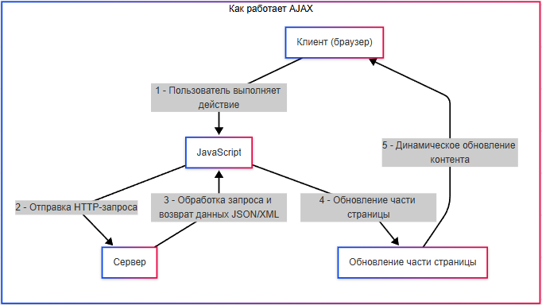

# Асинхронное и синхронное выполнение

<div class="article-tags">
  <span class="tag tag-required">ОБЯЗАТЕЛЬНО</span>
  <span class="tag tag-beginner">ДЛЯ НОВИЧКОВ</span>
</div>

<span class="complexity-badge">Разработчику</span>
<span class="complexity-badge">Архитектору</span>
<span class="complexity-badge">Инженеру</span>


## Асинхронность и синхронность

### Понятие асинхронного выполнения

★ **Задачи** – это части программы, могут быть как методами, функциями, так и частями-этапами этих функций/методов. Каждая задача не запускается сама по себе, она либо автоматически запускается обработчиком (по событию), либо вызывается кем-то. Причём обработчик как раз вызывает выполнение задачи.

★ **Вызов** – это действие, при котором одна часть программы (например, функция или метод) запрашивает выполнение другой части программы.

Вызов может быть синхронным, или асинхронным. Давайте разберёмся.

---

★ **Синхронность и асинхронность**. Синхронное выполнение задач – выполнение инструкций строго по порядку, ожидая завершения каждой операции перед переходом к следующей. К примеру, официант ждёт, пока повар приготовит блюдо, ждёт, пока клиент поест, и лишь потом убирает тарелку. И новый заказ он не принимает, пока не уберёт тарелку:

1. Задача 1 начата.
2. Задача 1 завершена.
3. Задача 2 начата.
4. Задача 2 завершена.

---

★ **Асинхронное выполнение** – программа не блокируется на операциях, и пока одна задача ждёт результата, процессор сразу переключается на вторую задачу. По аналогии с предыдущим примером, официант примет заказ, даст задачу поварам, и тут же пойдёт принимать следующий заказ, не ожидая готовности приготовления блюд.

1. Задача 1 начата.
2. Задача 2 начата.
3. Задача 2 завершена.
4. Задача 1 завершена.

То есть, асинхронное выполнение превращает один поэтапный алгоритм в несколько параллельных алгоритмов, таким образом значительно ускоряя работу.

---

Асинхронность представляет собой способ выполнения задач, при котором программа не блокируется (не ожидает завершения длительной операции), а продолжает выполнять другие действия. Когда результат становится доступен, программа обрабатывает его. Так, ключевыми характеристиками асинхронности является неблокирующий характер и уведомления.

---

### Применение асинхронности

Где применяется асинхронность? Конечно, это IO-bound задачи.

★ **IO-bound задачи (Input/Output)** – это задачи, ограниченные скоростью ввода-вывода (чтение/запись на диск, сетевые запросы). В таких задачах процессор часто простаивает, ожидая завершения операций. И именно IO-bound задачи особенно нуждаются в асинхронности, так как это позволяет программе продолжать выполнение других задач, пока одна операция ожидает завершения.

Пример - задачи - загрузить файлы А, Б, В - асинхронное выполнение будет в загрузке всех трёх файлов одновременно. Такие подходы особенно актуальны, когда важно не «замораживать» интерфейс пользователя.


★ **Асинхронный ввод-вывод** – это способ выполнения операций чтения-записи, при котором программа не блокируется, ожидая завершения операции. Именно так и решается проблема IO-bound задач.

Каналы ввода-вывода – это абстракции, которые позволяют программам взаимодействовать с устройствами (например, файлами, сетью). Они бывают блокирующими и неблокирующими.

**Блокирующий режим** - программа, которая останавливается и ждёт завершения операции.

**Неблокирующий режим** - программа продолжает работу, пока операция выполняется в фоне.

**Порты завершения** – это механизм операционной системы (например, Windows IOCP), который используется для эффективного управления асинхронными операциями ввода-вывода.

1. Операция ввода-вывода запускается асинхронно.
2. Когда операция завершается, результат помещается в порт завершения.
3. Программа проверяет порт завершения и обрабатывает результат.

Порты завершения и каналы ввода-вывода обеспечивают низкоуровневую поддержку асинхронности. Но нас интересует больше высокоуровневая часть.

★ **Асинхронный способ доставки данных** – это метод передачи данных, при котором отправитель не ждёт подтверждения получения данных от получателя. Пример - уведомления в мобильных приложениях, когда приложение отправляет уведомление на сервер, а сервер доставляет уведомление устройству пользователя, когда оно становится доступным.

Асинхронным может быть сетевой вызов (HTTP-запросы, взаимодействие с API), работа с диском (чтение и запись файлов), таймеры (задержки, периодические задачи), работа с данными (запросы к SQL или NoSQL базам).

★ **Асинхронные запросы и ответы** – это механизм, при котором клиент отправляет запрос серверу и продолжает работу, не дожидаясь ответа - когда ответ приходит, клиент обрабатывает его. Веб-приложение отправляет запрос на сервер для получения данных, а пока данные грузятся, приложение показывает индикатор загрузки. Когда данные приходят, приложение обновляет интерфейс.

Важно: не путайте асинхронность и асинхронизм. Асинхронизм - более широкое философское понятие, отсутствие жёсткой сихронизации, применяется в физике, биологии, социологии и других областях, допустим, когда люди в команде выполняют задачи независимо друг от друга. Асинхронность - конкретная реализация, и нас интересует именно её айти-часть.

---

## Как работает асинхронность под капотом?

### Event Loop

★ **Event Loop (Цикл событий)** – происходит бесконечный цикл проверки готовности задач, словно официант регулярно проверяет, закончили ли повара готовить блюдо.

Это механизм, который проверяет, какие задачи готовы к выполнению, и запускает их по мере готовности.

1. Задачи добавляются в очередь (например, сетевой запрос или таймер).
2. Проверка готовности (проверка, готовы ли задачи к выполнению).
3. Выполнение задачи (если задача готова, например, ответ от сервера получен - она выполняется).
4. Переключение (после выполнения задачи продолжается проверка других задач).


Пример - у нас есть веб-сервер. Пользователь отправляет запрос на загрузку файла, Event Loop добавляет задачу в очередь и продолжает обрабатывать другие запросы. Когда файл загружен, Event Loop выполняет функцию обратного вызова для обработки результата.

---

### Callback

★ **Callback (функция обратного вызова)** – выполняется после завершения операции, то есть, ответ на вопрос, «а что делать, как Задача 1 завершится?», специально добавляется, если повара сами должны будут уведомить, что закончили готовить блюдо.

Коллбэк – это функция, которая передаётся как аргумент в другую функцию и вызывается после завершения операции. Она определяет, что делать, когда задача завершена.

1. Вызывается асинхронная функция (например, чтение файла).
2. Передача Callback, который будет выполнен после завершения операции.
3. Когда операция завершена, Callback вызывается с результатом.

Пример на JavaScript:
```JavaScript
setTimeout(() => {
    console.log("Прошло 2 секунды");
}, 2000);
```
Здесь у нас есть функция setTimeout, которая запускает таймер на 2 секунды (2000), и когда таймер завершается, вызывается Callback, который выводит сообщение «Прошло 2 секунды». Callback здесь будет действие - console.log(). Но к JavaScript и другим языкам мы ещё вернёмся, так что, пока обойдёмся таким примером.

Как вы, наверное, заметили - прочесть даже такую простую функцию не так просто - а если таких коллбэков будет очень много, код вовсе становится сложным для чтения, из-за чего возникает Callback Hell - «ад коллбэков». Да и в целом, в цепочке таких коллбэков обрабатывать ошибки сложно.


---

### Корутины

★ **Corouines (Корутины)** – специальные функции, которые могут приостанавливаться – повар сам ведет список заказов, проверяет, готова ли, допустим, пицца в печи, отдавая по готовности, благодаря чему может переключиться на другую задачу. На практике это переключение между задачами, пока ждём результата. Допустим, отправили запрос и не ждём ответ.

Корутина может приостанавливаться и возобновляться. Она позволяет выполнять несколько задач одновременно, переключаясь между ними.

1. Корутина начинает выполнение.
2. При встрече оператора await она приостанавливается и освобождает поток управления.
3. Когда задача, связанная с await завершается, корутина возобновляется.


---

### Async/await

Что такое async/await?

★ **Async/await** – это синтаксический сахар над корутинами, который делает код более читаемым. Async объявляет асинхронную функцию, а await приостанавливает её выполнение до завершения задачи.

1. Объявляется асинхронная функция с помощью ключевого слова async;
2. Тело функции выполняется как обычно.
3. Однако для обозначения момента, когда нужно ждать завершения задачи, используется ключевое слово await.
4. Когда задача, помеченная await, завершается, выполнение функции возобновляется.

Пример:
```JavaScript
async function() {
    действие1;
    действие2;
    await действие3;
    действие4;
}
```

Мы ещё не раз затронем асинхронность в разных языках, но этот подход, в основном, един для всех.

---

### Фоновый обмен данными

★ **Фоновый обмен данными** – это процесс, при котором браузер взаимодействует с веб-сервером для получения или отправки данных без необходимости полной перезагрузки страницы. Это позволяет создавать более отзывчивые и динамические веб-приложения.

К примеру, пользователь заполняет данные на сайте, браузер отправляет данные на сервер в фоновом режиме - сервер обрабатывает запрос и получает результат. Браузер при этом обновляет часть страницы - показывает сообщение об успехе.

Сначала рассмотрим устаревшие технологии, затем перейдём к актуальным.

★ **Adobe Flash** - устаревшая мультимедийная платформа для создания анимаций, насыщенных интернет-приложений, прикладного ПО, мобильных приложений и мобильных игр, встроенных в браузер проигрывателей видео, пользовательского интерфейса. Flash показывает текст, векторную графику и растровую графику, компилируя flash-файлы в форматы SWF, FLV, F4v. Эти технологии интерактивной веб-анимации были разработаны компанией Macromedia и были довольно популярны. Flash Player представляет собой виртуальную машину, которая выыполняет загруженный код программы Flash.

Летом 2020 года компания Adobe объявила, что прекращает обновление и поддержку Adobe Flash Player. Теперь используются другие технологии - HTML5, WebGL, WebAssembly. Браузеры интегрировали более современные решения и отказались от большинства подобных плагинов, содержимое Flash было заблокировано, а пользователи получили уведомление с предложением удалить устаревшую платформу с устройства. Flash-приложения очень сильно нагружают процессор - виртуальная машина неэффективно распределяет ресурсы.

★ **Java-апплеты** – это небольшие программы, написанные на языке Java, которые выполняются в браузере. Они позволяли создавать интерактивные элементы на веб-страницах, такие как игры, графики и формы.

1. Апплет загружается в браузер через HTML-тег `<applet>` или `<object>`.
2. Апплет выполняется в виртуальной машине Java (JVM), встроенной в браузер.
3. Апплет может взаимодействовать с сервером через сокеты или HTTP-запросы.

Однако, апплеты могли быть уязвимы, и зависимы от JVM на клиентской машине, поэтому современные браузеры больше не поддерживают Java-апплеты.

★ **Silverlight** - фреймворк от Microsoft, который позволяет создавать мультимедийные и интерактивные веб-приложения. Он был прямым конкурентом и альтернативой Adobe Flash.

1. Приложение загружается в браузер через плагин.
2. Silverlight использует XAML (язык разметки) для создания пользовательского интерфейса.
3. Приложение может взаимодействовать с сервером через HTTP или WebSocket.

И эта технология тоже устарела. Microsoft прекратила поддержку в 2021 году.

Какие же технологии актуальны сейчас?

**Важно**: все перечисленные далее технологии успешно реализуются с помощью JavaScript. Именно JS отвечает за логику использования этих технологий, вызывая соответствующие функции, используя модули. Этот язык программирования мы обязательно изучим позднее, но сейчас мы акцентируемся на общей часвти этих технологий.

★ **HTML5** - последняя версия языка разметки HTML (мы отдельно будем рассматривать особенности этого языка), которая предоставляет множество новых возможностей для создания современных веб-приложений. 

HTML5 получило асинхронные особенности:
	- локальное хранилище (LocalStorage, SessionStorage), которое позволяет хранить данные на стороне клиента, что снижает количество запросов к серверу. Пример - сохранение состояния формы, чтобы пользователь мог продолжить заполнение после перезагрузки страницы. Именно так используется кэширование данных.
	- Web Workers - позволяют выполнять тяжелые вычисления в фоновом потоке, не блокируя основной поток. Пример - обработка больших массивов данных или выполнение сложных математических расчётов. Так выполняются ресурсоёмкие задачи.
	- File API - работа с файлами на стороне клиента (чтение содержимого файла перед отправкой на сервер). Пример - предварительный просмотр изображений перед загрузкой.
	- Offline Applications - использование манифеста для работы приложения оффлайн.
	
HTML5 настолько «прокачался», особенно в комбинации с JavaScript, что возможности Flash просто не выдержали конкуренции. Именно поэтому новые сайты стали такими функциональными и производительными.

★ **AJAX (Асинхронный JavaScript и XML)** – это технология, которая позволяет браузеру обмениваться данными с сервером в фоновом режиме, без перезагрузки страницы.

1. JavaScript отправляет HTTP-запрос на сервер.
2. Сервер обрабатывает запрос и возвращает данные (например, JSON или XML).
3. JavaScript обновляет часть страницы, используя полученные данные.

При таком подходе, происходит динамическое обновление контента и снижение нагрузки на сервер (только необходимые данные передаются). 

JavaScript, к примеру, добавляет новый комментарий, обновляет список товаров, загружает новые сообщения в чате.



Однако это подходит лишь для работы с обновлением контента разово - для реального времени, когда обновление происходит очень часто и постоянно - используется WebSocket или SSE.

★ **WebSocket** - протокол, который обеспечивает двустороннюю связь между браузером и сервером в реальном времени. В отличие от HTTP, WebSocket сохраняет соединение открытым, что позволяет серверу отправлять данные клиенту в любое время.

1. Клиент устанавливает соединение с сервером через WebSocket.
2. Сервер и клиент могут обмениваться сообщениями в реальном времени.
3. Соединение остаётся открытым до тех пор, пока одна из сторон его не закроет.

Этот подход отличается от принципов работы с сообщениями. В такой ситуации выполняется первичное «рукопожатие» и устанавливается постоянное соединение.

Мы уже ранее затрагивали это понятие, и повторяем здесь, так как это один из способов обеспечения фонового обмена данными в реальном времени, который подходит для чатов, онлайн-игр, трансляций.


★ **WebGL** – это JavaScript API для рендеринга 2D и 3D графики в браузере без использования плагинов. Он основан на OpenGL ES и работает через HTML5 (`<canvas>`). Асинхронные возможности WebGL:

Загрузка ресурсов - текстуры, модели, шейдеры загружаются асинхронно. Пример - загрузка текстур для игры, пока пользователь видит индикатор загрузки.

Анимация - WebGL использует цикл рендеринга, который постоянно обновляет сцену. Пример - игра, где объекты движутся в реальном времени.
WebGL позволяет обрабатывать пользовательский ввод (например, клики, движение мыши) асинхронно, что используется для взаимодействия с объектами.

Как можно было понять, это используется в играх и 3D-приложениях, а также в визуализации данных (графики, карты, модели). Да, браузеры прокачались так, что даже игры и полноценная трёхмерная графика с текстурами и моделями уже используется прямо онлайн.

**OpenGL** (Open Graphics Library) - кроссплатформенный API для рендеринга 2D и 3D графики. Он используется в десктопных приложениях и играх, поэтому мы его и не затронули. А OpenGL ES (OpenGL for Embedded Systems) — это подмножество OpenGL, оптимизированное для мобильных устройств и встраиваемых систем.

WebGL работает в браузере, в отличие от OpenGL, и использеут JavaScript для взаимодействиях.

★ **WebAssembly (Wasm)** – это бинарный формат для выполнения кода в браузере. Он позволяет запускать программы, написанные на языках (C, C++, Rust) с высокой производительностью.

WebAssembly поддерживает загрузку модулей асинхронно (пример - загрузка игрового движка в браузер) и выполнение ресурсоёмких задач параллельно с JavaScript. Это позволяет создавать гибридные приложения, где часть логики выполняется в Wasm, а часть - в JS.

Опять же, применение - игры, а также видеообработка и научные вычисления. Можно запускать игровые движки в браузере, выполнять кодирование и декодирование видео, моделировать и работать с машинным обучением.

★ **SSE (Server-Sent Events)** - односторонний поток данных от сервера к клиенту. Используется для обновления контента в реальном времени.

1. Клиент устанавливает соединение с сервером через HTTP.
2. Сервер отправляет события (сообщения) клиенту по мере их возникновения.
3. Соединение остаётся открытым до тех пор, пока клиент его не закроет.

Применяется в уведомлениях, лентах новостей, обновлении статистики. Но здесь, в отличие от WebSocket, соединение только одностороннее (сервер → клиент). И нет поддержки двунаправленного обмена данными.


★ **GraphQL Subscriptions** - расширение GraphQL для подписки на события в реальном времени. Это часто используется с WebSocket для обновления данных.

GraphQL – это язык запросов для API, который позволяет запрашивать клиентам только те данные, которые им нужны. Но про API мы ещё поговорим позже.

Сейчас важно понять, что GraphQL используется для запросов (и мутаций, но об этом позже), для однократного запроса к серверу. А GraphQL Subscriptions используется для подписки на события, в комбинации с длительным соединением (WebSocket) для получения данных в реальном времени.

1. Клиент подписывается на событие (например, «новое сообщение»).
2. Сервер отправляет данные клиенту, когда событие происходит.
3. Подписка остается активной до тех пор, пока клиент её не отменит.

Применяется в чатах, уведомлениях, обновлении данных в реальном времени.

★ **gRPC** - современный протокол для обмена данными между сервисами, поддерживает асинхронные вызовы и стриминг данных.

gRPC поддерживает однонаправленный и двунаправленный стриминг, а также асинхронные вызовы (когда клиент может отправлять запросы и получать ответы асинхронно).

Однонаправленный стриминг - сервер отправляет данные клиенту по мере их возникновения.

Двунаправленный стриминг - клиент и сервер могут одновременно отправлять данные друг другу.

gRPC применяется в микросервисах, стриминге данных и реальном времени.

Всё, что мы изучили – это мощные технологии, которые позволяют реализовать асинхронный обмен данными в приложениях. Но теперь пришло время углубиться в конкретные языки.

---