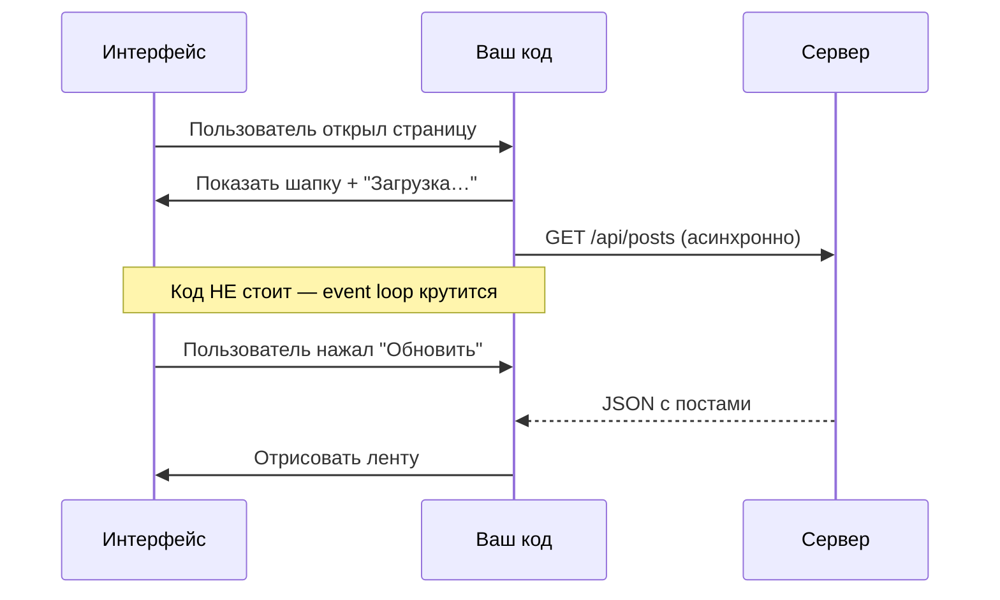

import ExternalCodeEmbed from '@site/src/components/ExternalCodeEmbed';


import ExternalPlayEmbed from '@site/src/components/ExternalPlayEmbed';


# Асинхронность простым языком — живые примеры

<div class="article-tags">
  <span class="tag tag-required">ОБЯЗАТЕЛЬНО</span>
  <span class="tag tag-beginner">ДЛЯ НОВИЧКОВ</span>
</div>

<span class="complexity-badge">Разработчику</span>
<span class="complexity-badge">Архитектору</span>

---

Если вы прочитали [процессы и потоки](./1) и [асинхронное выполнение](./12), но всё равно не понимаете **зачем это в коде** — начните отсюда. Ниже — **ситуации из реальных программ** — что ломается без асинхронности, что именно "делится" на потоки, и какой будет результат.

<div class="callout callout--tip">
  <div class="callout-title">Маршрут по разделу</div>

  <div class="callout-body">
  <strong>1.</strong> Эта статья — карта местности.<br/>
  <strong>2.</strong> <a href="./3">Практикум — код на разных языках</a> — sequential, threads, async.<br/>
  <strong>3.</strong> <a href="./1">Процессы и потоки</a> — как устроено в ОС.<br/>
  <strong>4.</strong> <a href="./12">Асинхронное выполнение</a> — event loop, async/await, колбэки.<br/>
  <strong>5.</strong> <a href="./11">Управление потоками</a> — мьютексы, гонки, deadlock.<br/>
  <strong>6.</strong> <a href="./13">IPC</a> — когда программы общаются как отдельные процессы.
  </div>
</div>

---

## Главная путаница в том, что это не одно и то же

В разговорах "асинхронность", "потоки" и "параллельность" часто смешивают. На практике это **три разных инструмента** — и путаница начинается, когда сравнивают их только по аналогии с официантом, без кода.

| Что | Простыми словами | Когда брать | Аналогия |
|-----|------------------|-------------|----------|
| **Синхронный код** | Шаг 1 → ждёшь → шаг 2 | Прототип, 3 строки, скрипт "раз в день" | Официант стоит у кухни, пока не принесут блюдо |
| **Асинхронность** | Запустил ожидание → делаешь другое → вернулся по callback/await | Сеть, диск, БД, тысячи клиентов на одном сервере | Официант принял заказ и пошёл к другому столу |
| **Потоки** | Несколько цепочек команд в **одном процессе**, общая память | UI + тяжёлый расчёт, пул worker'ов, CPU на ядрах | Несколько официантов в одном зале |
| **Процессы** | Отдельные программы, **разная память**, обмен через IPC | Плагины, вкладки, изоляция сбоев | Кухня ресторана и курьерская служба — разные фирмы |

**Хороший пример сразу:** пользователь нажал "Загрузить отчёт" в браузере.

```text
Синхронно (плохо):  кнопка → ждём сервер 2 сек → экран мёртвый
Async (хорошо):     кнопка → fetch() → спиннер → клики работают → пришёл JSON → таблица
Поток (если CPU):   кнопка → worker считает 10 сек → UI живой
Процесс (изоляция): редактор → child-процесс для плагина → упал плагин, редактор жив
```

**Важно:** асинхронность **не обязана** означать "много потоков". В Node.js и в браузере основной JavaScript-код часто крутится **в одном потоке**, а "параллельность" — это пока ждём сеть или диск, event loop выполняет другие задачи в том же потоке.

Ниже — три интерактивных демо на **реальном коде**. Запустите "Пошагово" и смотрите, что делает ОС или runtime на каждой строке.

### Поток — создание, start, join, общая память

<ExternalPlayEmbed example="code-dev/thread-lifecycle-demo" title="Жизненный цикл потока" minHeight={420} />

Python `threading` — один процесс, переменная `balance` общая, `Lock` защищает от гонки. Обратите внимание: `Thread(...)` ещё не поток ОС — поток появляется только на `start()`.

### Процесс — изоляция и очередь сообщений

<ExternalPlayEmbed example="code-dev/process-lifecycle-demo" title="Жизненный цикл процесса" minHeight={420} />

Python `multiprocessing`: у child **своя** память, результат — только через `Queue`. Так устроены вкладки Chrome и worker-процессы на сервере.

### Асинхронность — Promise и fetch без новых потоков

<ExternalPlayEmbed example="code-dev/promise-async-demo" title="Promise и async/await" minHeight={420} />

Тот же сценарий "загрузить ленту", но в JavaScript: `fetch` уходит в Web API, `console.log('B')` выполняется **до** ответа сервера. Подробнее про Promise — в [асинхронности JavaScript](/encyclopedia/5-languages/5-01-javascript/21#promise).

---

## Зачем это нужно — одна формула

> **Не давай программе простаивать, пока она ждёт что-то медленное.**

Медленное — это почти всегда **не процессор**, а **внешний мир**:

- ответ сервера по сети (50–500 мс и больше);
- чтение файла с диска;
- запрос к базе данных;
- ожидание нажатия кнопки пользователем;
- таймер "подождать 3 секунды".

Процессор за это время **свободен**. Асинхронность и многопоточность — способы **заполнить это время полезной работой** или **не морозить интерфейс**.

---

## Живой пример 1 — сайт грузит ленту новостей

**Сценарий:** пользователь открыл страницу. Нужно: показать шапку → запросить посты с сервера → отрисовать список.

### Плохо (синхронно, в лоб)

```text
1. Нарисовать шапку
2. Отправить HTTP-запрос на сервер
3. СТОЯТЬ И ЖДАТЬ ответ 2 секунды — экран белый, ничего не кликается
4. Нарисовать посты
```

Пользователь думает, что сайт завис.

### Хорошо (асинхронно)

```text
1. Нарисовать шапку и спиннер "Загрузка…"
2. Отправить HTTP-запрос (не ждём в том же месте кода)
3. Пока ждём — обрабатываем клики, анимацию, другие запросы
4. Пришёл ответ → убрать спиннер → нарисовать посты
```



**Что "разделили"?** Не потоки — **моменты времени**. Запрос ушёл в фон (ОС + сетевая подсистема), а **логика UI** продолжила жить. В JavaScript это `fetch(...).then(...)` или `await fetch(...)`.

**Когда нужны потоки здесь?** Обычно **нет**. Достаточно async I/O. Поток понадобится, если на клиенте нужно **тяжело считать** миллион записей (сжатие, ML) — тогда [Web Worker](./12#корутины) или worker thread.

---

## Живой пример 2 — кнопка : Экспорт в Excel в десктоп-программе

**Сценарий:** бухгалтер нажал кнопку. Программа формирует отчёт на 100 000 строк — **10 секунд CPU**.

### Плохо

Вся обработка в **UI-потоке** (главном потоке окна):

```text
Нажали кнопку → считаем 10 секунд → окно не двигается, "Не отвечает"
```

Windows/macOS помечают программу как зависшую.

### Хорошо

```text
UI-поток: нажали кнопку → показали прогресс-бар → создали фоновый поток/worker
Фоновый поток: считаем 10 секунд
UI-поток: по готовности — обновить таблицу (через безопасный вызов в UI)
```

```mermaid
flowchart TB
    subgraph ui [UI-поток]
        A[Клик "Экспорт"]
        B[Прогресс-бар]
        C[Показать файл]
    end
    subgraph bg [Фоновый поток]
        D[Сформировать Excel]
    end
    A --> B
    B -->|запуск задачи| D
    D -->|готово| C
```

**Что "разделили"?** **Два потока** в одном процессе: один рисует окно, второй считает. Память общая — поэтому результат передают через очередь или `Invoke`/`Dispatcher`, а не просто "записали в переменную из двух мест" (иначе [гонка данных](./11)).

**Это не "асинхронность ради сети"** — это **вынос CPU-работы с UI-потока**. Инструменты: `Task.Run` в C#, `threading.Thread` в Python, `worker_threads` в Node.js.

---

## Живой пример 3 — веб-сервер и 1000 пользователей

**Сценарий:** API-сервер. Каждый запрос: проверить токен → сходить в БД → вернуть JSON. Запрос к БД — **20 мс ожидания**.

### Плохо — поток на каждый запрос

```text
Пришёл запрос 1 → создали поток → ждём БД
Пришёл запрос 2 → создали поток → ждём БД
...
Пришёл запрос 5000 → "too many threads", сервер падает
```

Потоки **дорогие** (память на стек, переключение контекста).

### Хорошо — async I/O + ограниченный пул

```text
Один поток (или небольшой пул) принимает запросы
На каждый запрос: await database.query() — поток освобождается для других
Пока 1000 запросов ждут БД, сервер обслуживает новые
```

**Результат:** 1000 "висящих" запросов к БД — нормально; 1000 **OS-потоков** — катастрофа.

| Подход | Когда уместен |
|--------|----------------|
| **async/await, event loop** | Много **одновременных** сетевых/БД-ожиданий, мало CPU на запрос |
| **Пул из N потоков** | Есть **блокирующие** библиотеки без async API |
| **Отдельный процесс на сервис** | Изоляция, падение одного не валит всё (микросервисы) |

---

## Живой пример 4 — обработка 10 000 фотографий

**Сценарий:** уменьшить размер каждого JPEG. Это **CPU-bound** — процессор занят, диск почти не ждём.

### Async тут почти не поможет

Один поток с `async` всё равно **последовательно** жжёт CPU на каждой картинке. "Пока одна картинка считается" — некому переключиться на другую **в том же потоке**, если работа чисто вычислительная.

### Нужна параллельность по ядрам

```text
4 ядра CPU → 4 потока/worker'а
Каждый берёт следующую фото из очереди → ресайз → кладёт результат
```

```text
Очередь: [фото1, фото2, фото3, … фото10000]

Поток 1: фото1 → фото5 → фото9 …
Поток 2: фото2 → фото6 → …
Поток 3: фото3 → …
Поток 4: фото4 → …
```

**Что "разделили"?** **Задачи** (файлы), а не "этапы одного запроса". Общая очередь + [пул потоков](./1#создание-потоков-внутри-одного-процесса) или `multiprocessing` в Python (обход GIL для CPU).

Подробнее про ускорение расчётов — [Параллельные вычисления](/encyclopedia/4-code-dev/4-16-parallelnye-vychisleniya/intro).

---

## Живой пример 5 — Chrome и : убить вкладку

**Сценарий:** одна вкладка зависла на бесконечном цикле JavaScript.

**Почему остальные вкладки живы?** Каждая вкладка (упрощённо) — **отдельный процесс** с изолированной памятью. Зависла одна — диспетчер задач показывает "Chrome (вкладка X)", можно убить только её.

**Что "разделили"?** **Процессы**, не потоки. Обмен между ними — через IPC ([сокеты, каналы](./13)), а не через общие переменные.

| Задача | Процессы | Потоки | Async в одном потоке |
|--------|:--------:|:------:|:--------------------:|
| Не дать упасть всему из-за одного модуля | ✅ | ❌ | ❌ |
| Быстро делить данные внутри одной программы | ❌ | ✅ | частично |
| Тысячи одновременных HTTP-запросов | избыточно | ❌ | ✅ |
| Ресайз 10k фото на 8 ядрах | можно | ✅ | ❌ |

---

## Как это выглядит в коде — один сценарий, три способа

Задача: **скачать два файла** с интернета и показать "Готово".

### Синхронно (медленно, но понятно)

```python
# Псевдокод — так НЕ делают в UI и на сервере с нагрузкой
data_a = download("https://example.com/a.zip")  # ждём 3 сек
data_b = download("https://example.com/b.zip")  # ещё 3 сек
# Итого ~6 сек, всё время программа "стоит"
show("Готово")
```

### Асинхронно (I/O-bound, один поток)


<ExternalCodeEmbed example="python/code-405-2-001" title="Асинхронно (I/O-bound, один поток)" minHeight={192} />


**Что произошло:** оба запроса **отправились**, пока сеть думала — event loop не спал. Потоков OS могло быть **один**.

### Два потока (тоже ~3 сек, но другая модель)


<ExternalCodeEmbed example="python/code-405-2-002" title="Два потока (тоже ~3 сек, но другая модель)" minHeight={228} />


**Результат по времени** похож, но **модель другая**: два системных потока, нужно следить за `results` ([мьютекс](./11), если пишем в общую структуру).

---

## Практикум — : что выбрать? — 6 ситуаций

Ответьте себе на два вопроса:

1. **Программа в основном ждёт** (сеть, диск, БД) или **считает** (циклы, картинки, ML)?
2. **Нужно ли** не блокировать окно / обслуживать ещё 500 клиентов?

| № | Ситуция | Ждём или считаем? | Что делать | Почему |
|---|---------|-------------------|------------|--------|
| 1 | Форма логина, запрос к API | Ждём сеть | `async/await`, спиннер | UI не должен зависать |
| 2 | Чат в браузере, новые сообщения | Ждём сеть | WebSocket + event loop | Постоянный канал, не polling в цикле |
| 3 | Генерация PDF на 50 страниц в WinForms | Считаем CPU | Фоновый `Task`/поток + прогресс | Async не ускорит чистый CPU в одном потоке |
| 4 | Парсинг 1 млн строк CSV | Считаем + диск | Потоки или процессы + очередь порций | Параллелим **порции** данных |
| 5 | Плагин от сторонней команды в редакторе | Изоляция | **Отдельный процесс** | Краш плагина не убивает редактор |
| 6 | "Отправить email после оплаты" | Ждём внешний сервис | Очередь сообщений (RabbitMQ, SQS) | Пользователю не ждать SMTP; [IPC](./13) |

---

## Практикум пошагово — : интернет-магазин, кнопка Оформить заказ

Разберём, **что где выполняется**, без магии.

```mermaid
flowchart LR
    subgraph browser [Браузер — 1 процесс, UI-поток + workers]
        B1[Клик "Оформить"]
        B2[POST /order async]
        B3[Показать "Оформляем…"]
    end
    subgraph api [Сервер API — процесс Node/Go]
        S1[Принять запрос]
        S2[await INSERT в БД]
        S3[Положить задачу в очередь]
        S4[Ответ 202 Accepted]
    end
    subgraph worker [Worker — другой процесс]
        W1[Взять задачу из очереди]
        W2[Списать со склада]
        W3[Отправить email]
    end
    B1 --> B2 --> B3
    B2 --> S1 --> S2 --> S3 --> S4
    S3 -.->|сообщение| W1 --> W2 --> W3
```

**По шагам:**

1. **Браузер:** `await fetch('/order')` — не блокирует отрисовку; пользователь может скроллить.
2. **API:** `await db.insert()` — поток сервера не простаивает, принимает другие запросы.
3. **API не шлёт email сам 30 секунд** — кладёт задачу в очередь и сразу отвечает "принято".
4. **Worker-процесс** в фоне делает склад и почту. Упал worker — API жив; сообщения лежат в очереди.

**Где "разделили":**

- UI и сеть в браузере — **async**;
- тяжёлая фоновая работа — **отдельный процесс** (worker);
- согласование — **очередь сообщений**, не общая переменная.

---

## Когда НЕ надо плодить потоки и процессы

- CRUD-сайт на 50 пользователей — хватит **одного сервера и async**.
- Скрипт "раз в день выгрузить отчёт" — **один поток**, проще отладить.
- "Сделаю 100 потоков для скорости" на задаче с **общей переменной без lock** — получите [гонки и баги раз в десять запусков](./11).

**Правило:** сначала **измерь**, где тормоз (сеть? диск? CPU?). Потом выбирай инструмент из таблицы выше.

---

## Частые ошибки понимания

| Миф | Как на самом деле |
|-----|-------------------|
| "Асинхронность = всегда быстрее" | Быстрее **отклик** и **пропускная способность** при ожидании I/O; чистый CPU одним async не ускоришь |
| "Async значит второй поток пошёл работать" | Часто **нет** — один поток, другая **задача** в очереди event loop |
| "Многопоточность = асинхронность" | Потоки — про **параллельное выполнение**; async — про **не блокировать** текущую цепочку |
| "Разделил на процессы — данные общие" | **Нет.** Нужен pipe, файл, очередь, HTTP — [IPC](./13) |
| "Поставлю mutex везде — будет безопасно" | Можно словить [deadlock](./11) и падение производительности |

---

## Мини-шпаргалка — симптом → решение

| Симптом | Вероятная причина | Куда копать |
|---------|-------------------|-------------|
| Окно "Не отвечает" при нажатии кнопки | Долгая работа в UI-потоке | Фоновый поток / `Task.Run` / worker |
| Сервер тупит при 100+ клиентах | Блокирующий I/O или поток на запрос | async API, connection pool |
| Счётчик "теряет" единицы | Гонка данных | mutex, atomic, immutable данные |
| Вкладка/плагин валит всё приложение | Нет изоляции | отдельный **процесс** |
| Два заказа на один товар | Параллельные запросы без транзакции | БД + lock, не только async UI |

Больше разборов ошибок — [FAQ раздела](./998).

---

## Что читать дальше

| Вопрос | Статья |
|--------|--------|
| Сравнение sequential / threads / async / processes на коде | [Практикум](./3) |
| Как устроены процесс, поток, планировщик | [Процессы и потоки](./1) |
| Event loop, Promise, async/await | [Асинхронное выполнение](./12) |
| Сравнение sequential / threads / async на коде | [Практикум](./3) |
| Мьютекс, deadlock, очереди задач | [Управление потоками](./11) |
| Очереди, RabbitMQ, WebSocket между сервисами | [IPC](./13) |
| Ускорение расчётов на многих ядрах | [Параллельные вычисления](/encyclopedia/4-code-dev/4-16-parallelnye-vychisleniya/intro) |

---

**Итог в одном абзаце:** асинхронность нужна, когда программа **ждёт** сеть, диск или пользователя — чтобы не стоять столбом. Потоки нужны, когда есть **несколько независимых цепочек работы** (UI + расчёт, несколько ядер CPU). Процессы нужны, когда нужна **изоляция и отказоустойчивость**. В реальных проектах это **комбинируют** — async в API, worker-процесс для фона, потоки для UI — и это нормально.
