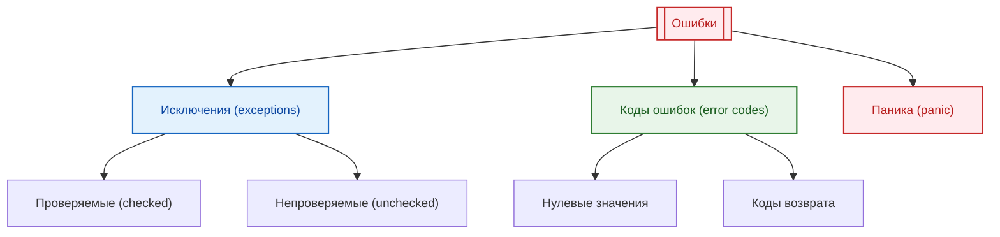

import ExceptionHandlingDemo from '@site/src/components/ExceptionHandlingDemo.jsx';

# Ошибки, исключения и отказоустойчивость

<div class="article-tags">
  <span class="tag tag-required">ОБЯЗАТЕЛЬНО</span>
  <span class="tag tag-beginner">ДЛЯ НОВИЧКОВ</span>
</div>

<span class="complexity-badge">Разработчику</span>
<span class="complexity-badge">Архитектору</span>
<span class="complexity-badge">Инженеру</span>

---

## Ошибки, исключения и отказоустойчивость

Эта тема становится особенно полезной, когда система уже "живая" и работает под нагрузкой. В учебном коде ошибка часто очевидна, а в реальном сервисе один сбой может проходить через несколько слоёв — API, бизнес-логику, интеграции и очередь задач. Поэтому важно не только перехватить исключение, но и сохранить диагностический контекст.

---

## Словарь сбоев — как различать термины

В быту слова «ошибка», «баг», «вылет» и «зависание» часто смешивают. В инженерной практике у каждого термина свой смысл — от этого зависят диагностика, приоритет исправления и то, что писать пользователю в интерфейсе.

| Термин | Суть | Типичное проявление |
|--------|------|---------------------|
| **Программная ошибка (баг)** | Дефект в исходном коде или дизайне, дающий **неожиданное** поведение или неверный результат | Неверная сумма, падение только на одном клиенте, «плавающий» сбой |
| **Ошибка времени выполнения** | Нарушение условий при работе уже запущенной программы | `деление на ноль`, обращение к `null`, ошибка сегментации |
| **Исключение** | Механизм языка: объект-сигнал о сбое и **передача** обработки вверх по стеку | `try` / `catch`, `raise`, `throw` |
| **Аварийный отказ (крэш, crash)** | **Аварийное завершение** процесса или ОС | Диалог «программа прекратила работу», дамп памяти |
| **Зависание** | Нет реакции на действия пользователя или бесконечный цикл без прогресса | «Не отвечает», застывший экран |
| **Подвисание** | Краткая пауза, после которой работа **возобновляется** без перезапуска | Долгий запрос к сети, тяжёлый расчёт |

**Программная ошибка** (англ. *bug*, «жучок») — ошибка в программе или в её проектировании, из‑за которой система ведёт себя иначе, чем задумано. Термин обычно относят к дефектам, видимым **на этапе работы** программы, в отличие от ошибок проектирования на бумаге и от **синтаксических** ошибок, которые транслятор не пропускает. Отчёт о проблеме в эксплуатации называют **отчётом об ошибке** (*error report*); если процесс оборвался аварийно — **крэш-репортом** (*crash report*).

Источники дефектов — ошибки разработчика в коде и дизайне, сбои инструментов (компилятор, среда), аппаратура, драйверы, внешние сервисы. Локализуют и устраняют их в **тестировании** и **отладке**; часть доходит до пользователей и попадает в телеметрию (Windows Error Reporting, Breakpad, CrashRpt и аналоги).

### Классификация по этапу разработки

| Этап | Пример | Кто обнаруживает |
|------|--------|------------------|
| **Синтаксическая** | Пропущена `}`, несогласованные скобки | Компилятор, IDE — сборка невозможна |
| **Предупреждение (warning)** | Неинициализированная переменная | Компилятор предупреждает; решение за автором кода |
| **Семантическая / времени выполнения** | Сложили строку с числом вместо умножения, выход за границы массива | Тесты, пользователь, мониторинг |

По **важности** для релиза часто выделяют блокирующие, критические (*showstopper*), серьёзные, незначительные и косметические дефекты. По **повторяемости** — постоянные, «плавающие» и проявляющиеся только у части клиентов (другая ОС, настройки, нагрузка).

В жаргоне разработчиков встречаются ироничные имена «капризных» багов — **гейзенбаг** (исчезает при отладке), **борбаг** (стабильно воспроизводится), **шрёдинбаг** (долго не проявлялся, пока кто-то не увидел ошибку в коде). Для обучения достаточно помнить: редкий баг требует логов, воспроизведения и фиксации окружения, а не только повторного запуска «у себя».

### Аварийный отказ и зависание

**Аварийный отказ** — процесс или ОС **прекращают нормальную работу**. Частая цепочка: недопустимая машинная инструкция (неверный адрес, переполнение буфера) → сигнал или исключение на уровне процессора → необработанное исключение → завершение. **Исходная** ошибка в коде часто далека от места падения в стеке — это усложняет отладку.

Типичные причины краша приложения:

- чтение или запись **чужой** памяти (ошибка сегментации, access violation);
- привилегированная или недопустимая инструкция;
- неверные аргументы **системного вызова**;
- деление на ноль, `NaN` в арифметике с плавающей точкой (зависит от архитектуры).

**Зависание** — отсутствие реакции на пользователя или бесконечное выполнение одной операции; картинка на экране может **застыть** (в отличие от диалога с текстом ошибки). **Подвисание** — временная задержка с последующим продолжением без перезагрузки.

В системах с **вытесняющей** многозадачностью (современные Windows, Linux, macOS) зависший поток одного приложения не всегда останавливает всю ОС: планировщик переключается на другие задачи, но «залипший» поток всё ещё может съедать CPU или держать блокировку (файл, мьютекс) и **подвешивать** соседние части системы. В **кооперативной** многозадачности один поток без отдачи управления блокирует всех.

Причины зависания со стороны **программы** — бесконечный цикл, взаимная блокировка (*deadlock*), ожидание сети или диска без таймаута, нехватка памяти. Со стороны **железа** — перегрев, сбой RAM, повреждённый диск. Иногда кажется, что «всё зависло», хотя идёт очень долгая операция — стоит подождать или смотреть индикатор нагрузки, прежде чем убивать процесс.

---

### Что такое ошибка в коде

**Ошибка** в узком инженерном смысле — нарушение ожидаемых условий: программа не может продолжить **задуманный** алгоритм или выдаёт неверный результат. Это шире, чем «программа выключилась»: форма с неверной валидацией, тихая потеря данных и неверный отчёт тоже ошибки, хотя процесс формально «жив».

Пользователь часто называет ошибкой любое неожиданное окно или тормоз; разработчику нужно уточнить — это крах, зависание, ожидаемое сообщение валидации или сбой сети.

Ошибки возникают по разным причинам:
- нарушение бизнес-логики
- недоступность внешних ресурсов
- неверные входные данные
- сбои в работе оборудования
- ограничения системы

Способы реагирования в коде можно свести к трём семействам:



Катастрофический сценарий — пользователь ввёл мусор в поле телефона, а сервер **упал для всех**. Так быть не должно: штатная реакция — сообщение об ошибке ввода и отказ только для этого запроса. Значит, дефект в обработке граничного случая, а не «норма».

Для ожидаемых сбоев (битый ввод, нет файла, таймаут API) используют **проверки** (`if`, коды возврата, `Result`) или **исключения** — заранее описанный «план Б», который перехватывают в `catch` / `except` / `rescue`. Исключительная ситуация — когда дальнейшие вычисления по основному алгоритму **бессмысленны** (нет файла — нельзя читать строки; деление на ноль — нет результата). Игнорировать такой сбой опасно: программа продолжит с **чужими** данными и даст непредсказуемый результат.

### Исключительные ситуации — синхронные и асинхронные

| Тип | Когда возникает | Примеры |
|-----|-----------------|--------|
| **Синхронные** | В известных точках кода, при выполнении конкретной операции | `read`, `malloc`, деление на ноль |
| **Асинхронные** | В любой момент, не привязаны к текущей строке | сигнал ОС, обрыв питания, приход данных по прерыванию |

**Структурная** обработка — блок `try` с ветками `catch` и (часто) `finally` / `ensure`: язык сам связывает обработчик с участком кода. **Неструктурная** — регистрация обработчика на тип события (как в старых диалектах BASIC с `ON ERROR GOTO`); для асинхронных сигналов она ещё встречается, для обычного прикладного кода неудобна.

Два режима после обработчика:

- **С возвратом** — проблема устранена, выполнение продолжается в той же точке (типично для асинхронных событий);
- **Без возврата** — после `catch` управление переходит в заранее заданное место; команда, вызвавшая сбой, фактически заменяется переходом (обычный случай для `try` / `catch` в Java, C#, Python).

Блок **с гарантированным завершением** (`finally`, `ensure`, деструкторы в C++ через RAII) не «лечит» исключение, а **обязательно** выполняет очистку (закрыть файл, откатить транзакцию) перед дальнейшей раскруткой стека.

Без перехвата в приложении срабатывает **системный** обработчик — сообщение пользователю, запись **отчёта об ошибке** (тип сбоя, стек, версия программы и ОС, иногда минидамп) и отправка разработчику или в централизованную базу (как Windows Error Reporting, Breakpad в Firefox, Apport в Ubuntu).

Ожидаемый сбой оформляют так:

```
попробовать:
    вывод("Привет! Это нормальное выполнение программы.")
исключение:
    вывод("Ой! Что-то пошло не так...)
```

---

### Исключения — как они работают под капотом

**Исключение** — это объект, который передаёт информацию об ошибке через стек вызовов до тех пор, пока не будет обработан.

Механизм работы исключений основан на **раскрутке стека** (stack unwinding):

1. При возникновении ошибки создаётся объект исключения
2. Стек вызовов разматывается в обратном порядке
3. На каждом уровне проверяется наличие блока `catch`
4. При нахождении подходящего обработчика выполнение передаётся в него
5. После обработки программа продолжает работу

<ExceptionHandlingDemo />

```text
АЛГОРИТМ ОБРАБОТАТЬ_ФАЙЛ(путь)
  файл := пусто
  попробовать
    файл := открыть(путь)
    // работа с файлом
  поймать ОшибкаФайлНеНайден как ошибка
    вывести("Файл не найден:", ошибка.сообщение)
  в_любом_случае
    если файл ≠ пусто то
      закрыть(файл)    // выполнится даже при исключении
    конец
  конец
КОНЕЦ

АЛГОРИТМ РАСКРУТКА_СТЕКА(исключение)
  пока стек_вызовов не пуст
    фрейм := снять_верхний_фрейм(стек_вызовов)
    если в фрейме есть обработчик для типа исключение то
      выполнить(обработчик)
      вернуть
    иначе
      выполнить_блоки_очистки_фрейма(фрейм)   // finally / деструкторы
    конец
  конец
  аварийно_завершить_программу(исключение)
КОНЕЦ
```

| Шаг | Смысл |
|-----|--------|
| `в_любом_случае` | Аналог `finally` — ресурс закрывается при любом исходе `попробовать` |
| `РАСКРУТКА_СТЕКА` | Поиск `catch` снизу вверх; без обработчика — падение программы |

Раскрутка стека гарантирует корректное освобождение ресурсов.

**Справочно на C#**

```csharp
public void ProcessFile(string path)
{
    FileStream file = null;
    try
    {
        file = new FileStream(path, FileMode.Open);
        // Работа с файлом
    }
    catch (FileNotFoundException ex)
    {
        Console.WriteLine($"Файл не найден: {ex.Message}");
    }
    finally
    {
        file?.Close(); // Выполнится всегда, даже при исключении
    }
}
```

В этом примере:
- `FileStream` — объект для работы с файлом
- `try` — блок кода, где может возникнуть исключение
- `catch` — обработчик конкретного типа исключения
- `finally` — блок, выполняющийся в любом случае

**Справочно на Python**

```python
def process_file(path):
    file = None
    try:
        file = open(path, 'r')
        # Работа с файлом
    except FileNotFoundError as ex:
        print(f"Файл не найден: {ex}")
    finally:
        if file:
            file.close()  # Выполнится всегда
```

---

### Когда использовать исключения, а когда — коды ошибок

Выбор механизма обработки ошибок зависит от контекста и языка программирования.

Короткая практическая эвристика:
- ошибка ожидаема и регулярно встречается в бизнес-потоке — удобнее вернуть результат с кодом/статусом;
- ошибка редкая, нарушает инвариант или ломает контракт — логичнее исключение с контекстом;
- на границах сервиса (HTTP, gRPC, очередь) полезно стандартизировать формат ошибки, чтобы клиент получал предсказуемый ответ.

**Исключения подходят для:**
- критических ошибок, требующих немедленного внимания
- ситуаций, которые не должны происходить в нормальной работе
- разделения бизнес-логики от обработки ошибок
- языков с поддержкой исключений (C#, Java, Python, C++)

**Коды ошибок предпочтительны для:**
- ожидаемых ситуаций, являющихся частью нормального потока
- системного программирования и низкоуровневых операций
- языков без исключений (C, Go, Rust)
- случаев, где важна производительность

Тот же подход без исключений — функция возвращает результат и отдельно признак ошибки:

```text
АЛГОРИТМ ПрочитатьФайл(путь)
  попробовать
    содержимое := прочитать_байты(путь)
    вернуть (содержимое, нет_ошибки)
  поймать любая_ошибка как e
    вернуть (пусто, e)
  конец
КОНЕЦ

(данные, ошибка) := ПрочитатьФайл("config.txt")
если ошибка ≠ нет_ошибки то
  записать_в_лог(ошибка)
  вернуть
конец
// основная логика с данными
```

**Справочно на Go**

```go
func readFile(path string) ([]byte, error) {
    Данные, err := os.ReadFile(path)
    if err != nil {
        return nil, err  // Возвращаем ошибку явно
    }
    return Данные, nil
}

// Использование
content, err := readFile("config.txt")
if err != nil {
    log.Printf("Ошибка чтения: %v", err)
    return
}
// Продолжаем работу
```

Пример с исключениями в C#:

```csharp
public string ReadFile(string path)
{
    try
    {
        return File.ReadAllText(path);
    }
    catch (FileNotFoundException)
    {
        // Обработка конкретной ошибки
        return "Файл не найден";
    }
    catch (IOException ex)
    {
        // Обработка других ошибок ввода-вывода
        throw new ApplicationException("Ошибка чтения файла", ex);
    }
}
```

---

### Неуправляемые исключения и их последствия

**Неуправляемое исключение** — это исключение, которое не было перехвачено ни одним блоком `catch` в стеке вызовов.

Последствия неуправляемых исключений:
- аварийное завершение программы
- потеря несохранённых данных
- повреждение состояния системы
- плохой пользовательский опыт

В разных средах выполнения неуправляемые исключения ведут себя по-разному:

```csharp
// C# - приложение завершается
AppDomain.CurrentDomain.UnhandledException += (sender, e) =>
{
    Console.WriteLine($"Необработанное исключение: {e.ExceptionObject}");
    // Логирование перед завершением
};
```

```python
# Python - выводится трассировка и завершение

import sys

def handle_exception(exc_type, exc_value, exc_traceback):
    print(f"Критическая ошибка: {exc_value}")
    # Логирование

sys.excepthook = handle_exception
```

```javascript
// JavaScript в браузере - ошибка в консоли, скрипт останавливается
window.addEventListener('error', (event) => {
    console.error('Глобальная ошибка:', event.error);
    event.preventDefault(); // Предотвращаем стандартное поведение
});
```

<div class="callout callout--tip">
<div class="callout-title">Рекомендация</div>

  <div class="callout-body">
Всегда обрабатывайте исключения на границах компонентов и на верхнем уровне приложения. Это позволяет избежать неожиданного завершения и предоставить пользователю осмысленное сообщение.
</div>
  </div>


---

### Логирование ошибок — что, когда и зачем записывать

**Логирование** — это запись информации о событиях, происходящих в программе, для последующего анализа.

Полезная практика для продакшена — корреляция логов:
- добавляйте `traceId` и `requestId` в каждый лог;
- фиксируйте ключевые параметры операции (например, `orderId`, `userId`, `tenantId`);
- храните причину и тип ошибки отдельно от пользовательского сообщения.

Так инженер поддержки быстрее собирает цепочку событий без ручного поиска по разным сервисам.

Что нужно логировать:

| Уровень | Когда использовать | Пример |
|---------|-------------------|--------|
| `TRACE` | Подробная отладочная информация | Вход и выход из методов |
| `DEBUG` | Информация для разработчиков | Значения переменных, SQL-запросы |
| `INFO` | Стандартные операции | Запуск приложения, успешная обработка |
| `WARN` | Потенциальные проблемы | Устаревшие методы, медленные операции |
| `ERROR` | Ошибки, требующие внимания | Исключения, сбои операций |
| `FATAL` | Критические ошибки | Неуправляемые исключения, аварийное завершение |

Пример структурированного логирования:

```csharp
using Microsoft.Extensions.Logging;

public class OrderService
{
    private readonly ILogger<OrderService> _logger;
    
    public OrderService(ILogger<OrderService> logger)
    {
        _logger = logger;
    }
    
    public async Task ProcessOrder(Order order)
    {
        _logger.LogInformation("Начало обработки заказа {OrderId}", order.Id);
        
        try
        {
            // Логируем входные данные
            _logger.LogDebug("Данные заказа: {@Order}", order);
            
            await ValidateOrder(order);
            await SaveOrder(order);
            
            _logger.LogInformation("Заказ {OrderId} успешно обработан", order.Id);
        }
        catch (ValidationException ex)
        {
            _logger.LogWarning(ex, "Ошибка валидации заказа {OrderId}", order.Id);
            throw;
        }
        catch (Exception ex)
        {
            _logger.LogError(ex, "Критическая ошибка при обработке заказа {OrderId}", order.Id);
            throw;
        }
    }
}
```

```python

import logging

logging.basicConfig(
    level=logging.INFO,
    format='%(asctime)s - %(name)s - %(levelname)s - %(message)s'
)

logger = logging.getLogger(__name__)

def process_order(order):
    logger.info(f"Начало обработки заказа {order.id}")
    
    try:
        logger.debug(f"Данные заказа: {order}")
        validate_order(order)
        save_order(order)
        logger.info(f"Заказ {order.id} успешно обработан")
    except ValidationError as ex:
        logger.warning(f"Ошибка валидации заказа {order.id}: {ex}")
        raise
    except Exception as ex:
        logger.error(f"Критическая ошибка при обработке заказа {order.id}", exc_info=True)
        raise
```

<div class="callout callout--tip">
<div class="callout-title">Структурированное логирование</div>

  <div class="callout-body">
Используйте структурированные логи с контекстными данными (например, `@Order` в C#). Это позволяет эффективно искать и анализировать логи с помощью инструментов вроде Elasticsearch, Splunk или Seq.
</div>
  </div>


---

### Игнорирование ошибок

**Игнорирование ошибок** — это практика, при которой возникшие ошибки не обрабатываются и не логируются.

В командной разработке "тихий" `catch` быстро превращается в технический долг. Проблема не исчезает, а накапливается в виде редких инцидентов, которые трудно воспроизвести. Поэтому минимальный стандарт выглядит так: либо обработать, либо залогировать, либо явно пробросить выше.

Последствия игнорирования ошибок:
- скрытые проблемы в коде
- непредсказуемое поведение программы
- сложность диагностики проблем
- деградация качества системы со временем

Примеры плохой практики:

```csharp
// Плохо: пустой catch
try
{
    ProcessData();
}
catch
{
    // Ничего не делаем
}

// Плохо: игнорирование результата
int.TryParse("invalid", out int result); // result = 0, но мы не знаем об ошибке
```

```python
# Плохо: подавление всех исключений
try:
    process_data()
except:
    pass  # Молча игнорируем любую ошибку

# Плохо: игнорирование возвращаемого значения
result = some_function()  # Результат не используется
```

```go
// Плохо: игнорирование ошибки
Данные, _ := readFile("config.txt")  // Ошибка проигнорирована
```

Правильный подход — всегда обрабатывать ошибки осмысленно:

```csharp
try
{
    ProcessData();
}
catch (SpecificException ex)
{
    logger.LogWarning("Не критичная ошибка, продолжаем работу: {Message}", ex.Message);
    // Продолжаем работу с дефолтными значениями
}
```

<details>
<summary>
<b>Когда можно игнорировать ошибки</b>
</summary>
Иногда игнорирование ошибок допустимо, но только в обоснованных случаях:
- попытка удаления несуществующего файла
- проверка существования ресурса перед созданием
- обработка временных сетевых сбоев с повторными попытками
- graceful degradation при недоступности не критичных компонентов
</details>

---

### Принудительные действия — форсинг вызовов, игнорирование валидаций

**Принудительные действия** — это операции, которые обходят стандартные механизмы проверки и валидации.

---

## Справочник и первоисточники

Краткие формулировки в этой статье согласованы с разделами русскоязычной Википедии (можно использовать как внешний словарь терминов):

- [Программная ошибка](https://ru.wikipedia.org/wiki/%D0%9F%D1%80%D0%BE%D0%B3%D1%80%D0%B0%D0%BC%D0%BC%D0%BD%D0%B0%D1%8F_%D0%BE%D1%88%D0%B8%D0%B1%D0%BA%D0%B0)
- [Аварийный отказ (программирование)](https://ru.wikipedia.org/wiki/%D0%90%D0%B2%D0%B0%D1%80%D0%B8%D0%B9%D0%BD%D1%8B%D0%B9_%D0%BE%D1%82%D0%BA%D0%B0%D0%B7_(%D0%BF%D1%80%D0%BE%D0%B3%D1%80%D0%B0%D0%BC%D0%BC%D0%B8%D1%80%D0%BE%D0%B2%D0%B0%D0%BD%D0%B8%D0%B5))
- [Зависание](https://ru.wikipedia.org/wiki/%D0%97%D0%B0%D0%B2%D0%B8%D1%81%D0%B0%D0%BD%D0%B8%D0%B5)
- [Отчёт об ошибке (программирование)](https://ru.wikipedia.org/wiki/%D0%9E%D1%82%D1%87%D1%91%D1%82_%D0%BE%D0%B1_%D0%BE%D1%88%D0%B8%D0%B1%D0%BA%D0%B5_(%D0%BF%D1%80%D0%BE%D0%B3%D1%80%D0%B0%D0%BC%D0%BC%D0%B8%D1%80%D0%BE%D0%B2%D0%B0%D0%BD%D0%B8%D0%B5))
- [Обработка исключений](https://ru.wikipedia.org/wiki/%D0%9E%D0%B1%D1%80%D0%B0%D0%B1%D0%BE%D1%82%D0%BA%D0%B0_%D0%B8%D1%81%D0%BA%D0%BB%D1%8E%D1%87%D0%B5%D0%BD%D0%B8%D0%B9)

Для школьного уровня — [Ошибки и сбои в программах](/encyclopedia/1-basics/1-035-bazovaya-informatika/4#oshibki-i-sboi) в курсе «Базовая информатика».

---

## Связанные материалы энциклопедии

- Для практики диагностики состояния программы — [Отладка и видимость состояния](/encyclopedia/4-code-dev/4-06-arhitektura-vypolneniya/112)
- Для понимания влияния стека вызовов на исключения — [Вызовы и иерархия](/encyclopedia/4-code-dev/4-06-arhitektura-vypolneniya/113)
- Для мониторинга отказов через метрики и телеметрию — [Ресурсопотребление и метрики](/encyclopedia/4-code-dev/4-06-arhitektura-vypolneniya/114)
- Для проектного уровня тестирования сценариев ошибок — [Тестирование](/encyclopedia/7-project/7-05-testirovanie/intro)

---

## Что запомнить

- **Баг**, **крэш**, **зависание** и **исключение** — разные слова; путаница мешает приоритизации и тексту для пользователя.
- Ошибка без контекста бесполезна для диагностики; крэш-репорт и стек вызовов — опора для исправления бага.
- Исключения хорошо подходят для редких и критичных сбоев; ожидаемые сценарии — через коды, статусы или `if`.
- Синхронные сбои ловят у операции; `finally` / RAII / `defer` закрывают ресурсы при любом исходе.
- Игнорирование исключений накапливает технический долг и риск инцидентов.

---

## Типичные ошибки

- Пустой `catch` без логирования и без решения.
- Потеря исходного исключения при пробросе.
- Отсутствие корреляционных идентификаторов в логах.
- Смешивание пользовательского сообщения и технической причины в одном поле.

---

## Мини-практика

1. Возьмите один endpoint и выпишите все возможные ошибки.
2. Разделите их на ожидаемые и критичные.
3. Для каждой ошибки задайте код ответа, уровень логирования и действие клиента.
4. Проверьте, что в лог попадают `traceId`, ключевые параметры и исходное исключение.

Типичные сценарии принудительных действий:
- обход валидации данных
- принудительное выполнение операций
- отключение проверок безопасности
- форсированные обновления

Примеры реализации:

```csharp
public class OrderService
{
    public void CreateOrder(Order order, bool force = false)
    {
        if (!force)
        {
            ValidateOrder(order);
        }
        // Принудительное создание без валидации
        SaveOrder(order);
    }
    
    private void ValidateOrder(Order order)
    {
        if (order.Amount <= 0)
            throw new ValidationException("Сумма заказа должна быть положительной");
        if (string.IsNullOrWhiteSpace(order.CustomerName))
            throw new ValidationException("Имя клиента обязательно");
    }
}
```

```python
def create_order(order, force=False):
    if not force:
        validate_order(order)
    # Принудительное создание
    save_order(order)

def validate_order(order):
    if order.amount <= 0:
        raise ValueError("Сумма заказа должна быть положительной")
    if not order.customer_name:
        raise ValueError("Имя клиента обязательно")
```

**Риски принудительных действий:**
- нарушение целостности данных
- обход бизнес-правил
- сложность отладки
- потенциальные уязвимости безопасности

<details>
<summary>
<b>Рекомендации по использованию</b>
</summary>
Принудительные действия должны:
- быть явно обозначены в коде и документации
- логироваться с указанием причины
- использоваться только в крайних случаях
- иметь ограничения по правам доступа
- сопровождаться комментариями с обоснованием
</details>

---
