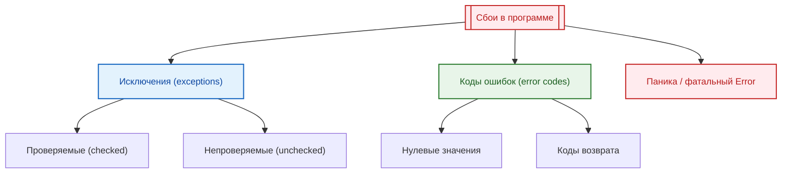

import ExternalCodeEmbed from '@site/src/components/ExternalCodeEmbed';


import ExternalPlayEmbed from '@site/src/components/ExternalPlayEmbed';


# Ошибки, исключения и отказоустойчивость

<div class="article-tags">
  <span class="tag tag-required">ОБЯЗАТЕЛЬНО</span>
  <span class="tag tag-beginner">ДЛЯ НОВИЧКОВ</span>
</div>

<span class="complexity-badge">Разработчику</span>
<span class="complexity-badge">Архитектору</span>
<span class="complexity-badge">Инженеру</span>

---

## Ошибки, исключения и отказоустойчивость

Эта тема становится особенно полезной, когда система уже "живая" и работает под нагрузкой. В учебном коде сбой часто очевиден, а в реальном сервисе один инцидент проходит через API, бизнес-логику, интеграции и очередь задач. Поэтому важно не только перехватить исключение, но и сохранить диагностический контекст.

<div class="callout callout--tip">
  <div class="callout-title">Маршрут по статье</div>

  <div class="callout-body">
  <strong>Сначала</strong> — определения: <a href="#chto-takoe-oshibka">что такое ошибка</a>, <a href="#pochemu-voznikayut">почему она возникает</a>, <a href="#oshibka-i-isklyuchenie">чем ошибка отличается от исключения</a>.<br />
  <strong>Затем</strong> — механизмы в коде (стек, <code>try/catch</code>, коды возврата, логи).<br />
  <strong>Для сервисов под нагрузкой</strong> — <a href="#otkazoustojchivost">отказоустойчивость</a> (retry, circuit breaker, DLQ) в отдельных главах по архитектуре.<br />
  Языковые статьи (Java, Python, JS…) предполагают, что эта база уже прочитана — см. <a href="#yazykovye-glavy">перекрёстные ссылки</a>.
</div>
</div>

---

<span id="chto-takoe-oshibka"></span>

## Что такое ошибка

В разговорной речи под **ошибкой** часто понимают всё подряд: опечатку в форме, падение браузера, таймаут API. В инженерной практике полезно разделить уровни.

**Ошибка** (в узком смысле для прикладного разработчика) — **критический, фатальный сбой** на уровне системного окружения, инфраструктуры или среды исполнения (виртуальной машины, процесса ОС), после которого **программа не может безопасно продолжать работу** в текущем процессе. Примеры: исчерпание памяти на уровне JVM (`OutOfMemoryError`), внутренний сбой VM, аварийное завершение процесса из‑за сегментации, необработанный фатальный сигнал.

Шире — **любое нарушение ожидаемого поведения**: неверный результат, тихая потерь данных, сообщение валидации в UI. Процесс при этом может оставаться «живым». Такую широкую ошибку часто называют **дефектом (багом)** или **сбоем сценария**, а не «фатальной ошибкой».

| Уровень | Пример | Процесс после сбоя |
|--------|--------|-------------------|
| **Фатальная ошибка среды** | `OutOfMemoryError`, crash, SIGSEGV | Обычно завершение или перезапуск |
| **Ошибка сценария / бизнеса** | «Корзина пуста», неверный ИНН | Продолжает работу, ответ клиенту |
| **Ошибка интеграции** | HTTP 503, таймаут БД | Зависит от политики (retry, fallback) |

Пользователь называет «ошибкой» любое неожиданное окно; разработчику нужно уточнить: это **крах**, **зависание**, **ожидаемая валидация** или **сбой сети**.

---

<span id="pochemu-voznikayut"></span>

## Почему ошибки возникают

Сбои не сводятся к «плохому коду». Источники пересекаются:

| Источник | Примеры |
|----------|---------|
| **Логика и дизайн** | Неверная формула, гонка данных, отсутствие проверки границ |
| **Ввод и контракт** | Битый JSON, устаревший клиент, нарушение API |
| **Внешние ресурсы** | Файл не найден, DNS, недоступность партнёрского API |
| **Инфраструктура** | Перегрузка CPU/RAM, диск, сеть, лимиты облака |
| **Среда исполнения** | JVM, GC, драйверы, несовместимая версия ОС |
| **Инструменты** | Дефект компилятора, битая сборка (реже) |

На этапе **разработки** часть проблем отсекают компилятор (синтаксис) и статический анализ (warnings). На этапе **выполнения** остаются семантические сбои, интеграции и редкие «плавающие» баги — их ловят тестами, мониторингом и логами.

Источники дефектов локализуют в **тестировании** и **отладке**; часть доходит до пользователей и попадает в телеметрию (Windows Error Reporting, Breakpad, аналоги).

---

<span id="oshibka-i-isklyuchenie"></span>

## Чем отличается ошибка от исключения

Два термина часто путают, потому что в одном предложении звучат как синонимы. В учебниках и в API языков у них **разные роли**.

**Исключение** — это **предсказуемое, ожидаемое отклонение** от нормального сценария работы, которое программа **может и должна обработать**, чтобы **продолжить выполнение** (или корректно завершить один запрос, не роняя весь сервис). Технически в языках с `try/catch` это объект (или значение), который **передаётся вверх по стеку** до подходящего обработчика: файл не найден, неверный аргумент, таймаут одной операции.

**Ошибка** (в паре «ошибка / исключение» на уровне JVM и родственных моделей) — **критический, фатальный сбой** среды или инфраструктуры, после которого **продолжать работу в том же процессе нельзя** или нецелесообразно: нехватка памяти, внутренний сбой VM, повреждение состояния рантайма. Такие события обычно **не предполагают** обычного бизнес-`catch` — их лечат перезапуском, масштабированием, алертами.

```text
Ожидаемый сбой сценария     →  исключение / Result / код возврата  →  обработали → продолжили
Фатальный сбой среды        →  Error / crash / panic (критич.)     →  процесс/сервис останавливают
```

| | **Исключение** | **Ошибка** (фатальная) |
|---|----------------|------------------------|
| **Смысл** | Отклонение, заложенное в контракт | Сбой среды, ломающий процесс |
| **Обработка** | `try/catch`, `except`, `rescue`, `Result` | Лог, алерт, рестарт, масштабирование |
| **Пример (Java)** | `FileNotFoundException`, `IllegalArgumentException` | `OutOfMemoryError`, `StackOverflowError` |
| **Пример (Go)** | Нет исключений; `error` как значение | `panic` при нарушении инварианта (редко) |

В **Java** иерархия `Throwable` формально делит: `Exception` (обычно обрабатываемые) и `Error` (фатальные для VM). В **Python** есть `Exception` и `BaseException` (включая `SystemExit`, `KeyboardInterrupt`). В **JavaScript** нет класса `Error` vs `Exception` на уровне языка — все встроенные типы наследуют `Error`; фатальность определяется контекстом (неперехваченное исключение, `unhandledrejection`). Подробнее по языкам — в [таблице ниже](#yazykovye-glavy).

> Термины в [глоссарии](/glossary/И#исключение) и [«Обработка исключений»](/glossary/О#обработка-исключений) согласованы с этой статьёй.

Способы реагирования в коде можно свести к трём семействам:



Катастрофический сценарий — пользователь ввёл мусор в поле телефона, а сервер **упал для всех**. Штатная реакция — сообщение об ошибке ввода и отказ только для этого запроса. Значит, дефект в обработке граничного случая, а не «норма».

Для ожидаемых сбоев (битый ввод, нет файла, таймаут API) используют **проверки** (`if`, коды возврата, `Result`) или **исключения** — заранее описанный «план Б» в `catch` / `except` / `rescue`. Исключительная ситуация — когда дальнейшие вычисления по основному алгоритму **бессмысленны** (нет файла — нельзя читать строки). Игнорировать такой сбой опасно: программа продолжит с **чужими** данными.

Стиль кода — [Исключения в читаемом коде](/encyclopedia/7-project/7-10-kultura-koda/12).

---

## Словарь сбоев — как различать термины

В быту слова «ошибка», «баг», «вылет» и «зависание» часто смешивают. В инженерной практике у каждого термина свой смысл — от этого зависят диагностика, приоритет исправления и то, что писать пользователю в интерфейсе.

| Термин | Суть | Типичное проявление |
|--------|------|---------------------|
| **Программная ошибка (баг)** | Дефект в исходном коде или дизайне, дающий **неожиданное** поведение или неверный результат | Неверная сумма, падение только на одном клиенте, «плавающий» сбой |
| **Ошибка времени выполнения** | Нарушение условий при работе уже запущенной программы | `деление на ноль`, обращение к `null`, ошибка сегментации |
| **Исключение** | Ожидаемое отклонение; механизм языка передаёт сигнал **вверх по стеку** | `try` / `catch`, `raise`, `throw` |
| **Ошибка (фатальная)** | Сбой среды/VM, процесс обычно не продолжает работу | `OutOfMemoryError`, crash, `panic` (критич.) |
| **Аварийный отказ (крэш, crash)** | **Аварийное завершение** процесса или ОС | Диалог «программа прекратила работу», дамп памяти |
| **Зависание** | Нет реакции на действия пользователя или бесконечный цикл без прогресса | «Не отвечает», застывший экран |
| **Подвисание** | Краткая пауза, после которой работа **возобновляется** без перезапуска | Долгий запрос к сети, тяжёлый расчёт |

**Программная ошибка** (англ. *bug*, «жучок») — ошибка в программе или в её проектировании, из‑за которой система ведёт себя иначе, чем задумано. Термин обычно относят к дефектам, видимым **на этапе работы** программы, в отличие от ошибок проектирования на бумаге и от **синтаксических** ошибок, которые транслятор не пропускает. Отчёт о проблеме в эксплуатации называют **отчётом об ошибке** (*error report*); если процесс оборвался аварийно — **крэш-репортом** (*crash report*).

Источники дефектов — ошибки разработчика в коде и дизайне, сбои инструментов (компилятор, среда), аппаратура, драйверы, внешние сервисы. Локализуют и устраняют их в **тестировании** и **отладке**; часть доходит до пользователей и попадает в телеметрию (Windows Error Reporting, Breakpad, CrashRpt и аналоги).

### Классификация по этапу разработки

| Этап | Пример | Кто обнаруживает |
|------|--------|------------------|
| **Синтаксическая** | Пропущена `}`, несогласованные скобки | Компилятор, IDE — сборка невозможна |
| **Предупреждение (warning)** | Неинициализированная переменная | Компилятор предупреждает; решение за автором кода |
| **Семантическая / времени выполнения** | Сложили строку с числом вместо умножения, выход за границы массива | Тесты, пользователь, мониторинг |

По **важности** для релиза часто выделяют блокирующие, критические (*showstopper*), серьёзные, незначительные и косметические дефекты. По **повторяемости** — постоянные, «плавающие» и проявляющиеся только у части клиентов (другая ОС, настройки, нагрузка).

В жаргоне разработчиков встречаются ироничные имена «капризных» багов — **гейзенбаг** (исчезает при отладке), **борбаг** (стабильно воспроизводится), **шрёдинбаг** (долго не проявлялся, пока кто-то не увидел ошибку в коде). Для обучения достаточно помнить: редкий баг требует логов, воспроизведения и фиксации окружения, а не только повторного запуска «у себя».

### Аварийный отказ и зависание

**Аварийный отказ** — процесс или ОС **прекращают нормальную работу**. Частая цепочка: недопустимая машинная инструкция (неверный адрес, переполнение буфера) → сигнал или исключение на уровне процессора → необработанное исключение → завершение. **Исходная** ошибка в коде часто далека от места падения в стеке — это усложняет отладку.

Типичные причины краша приложения:

- чтение или запись **чужой** памяти (ошибка сегментации, access violation);
- привилегированная или недопустимая инструкция;
- неверные аргументы **системного вызова**;
- деление на ноль, `NaN` в арифметике с плавающей точкой (зависит от архитектуры).

**Зависание** — отсутствие реакции на пользователя или бесконечное выполнение одной операции; картинка на экране может **застыть** (в отличие от диалога с текстом ошибки). **Подвисание** — временная задержка с последующим продолжением без перезагрузки.

В системах с **вытесняющей** многозадачностью (современные Windows, Linux, macOS) зависший поток одного приложения не всегда останавливает всю ОС: планировщик переключается на другие задачи, но «залипший» поток всё ещё может съедать CPU или держать блокировку (файл, мьютекс) и **подвешивать** соседние части системы. В **кооперативной** многозадачности один поток без отдачи управления блокирует всех.

Причины зависания со стороны **программы** — бесконечный цикл, взаимная блокировка (*deadlock*), ожидание сети или диска без таймаута, нехватка памяти. Со стороны **железа** — перегрев, сбой RAM, повреждённый диск. Иногда кажется, что «всё зависло», хотя идёт очень долгая операция — стоит подождать или смотреть индикатор нагрузки, прежде чем убивать процесс.

---

### Исключительные ситуации — синхронные и асинхронные

| Тип | Когда возникает | Примеры |
|-----|-----------------|--------|
| **Синхронные** | В известных точках кода, при выполнении конкретной операции | `read`, `malloc`, деление на ноль |
| **Асинхронные** | В любой момент, не привязаны к текущей строке | сигнал ОС, обрыв питания, приход данных по прерыванию |

**Структурная** обработка — блок `try` с ветками `catch` и (часто) `finally` / `ensure`: язык сам связывает обработчик с участком кода. **Неструктурная** — регистрация обработчика на тип события (как в старых диалектах BASIC с `ON ERROR GOTO`); для асинхронных сигналов она ещё встречается, для обычного прикладного кода неудобна.

Два режима после обработчика:

- **С возвратом** — проблема устранена, выполнение продолжается в той же точке (типично для асинхронных событий);
- **Без возврата** — после `catch` управление переходит в заранее заданное место; команда, вызвавшая сбой, фактически заменяется переходом (обычный случай для `try` / `catch` в Java, C#, Python).

Блок **с гарантированным завершением** (`finally`, `ensure`, деструкторы в C++ через RAII) не «лечит» исключение, а **обязательно** выполняет очистку (закрыть файл, откатить транзакцию) перед дальнейшей раскруткой стека.

Без перехвата в приложении срабатывает **системный** обработчик — сообщение пользователю, запись **отчёта об ошибке** (тип сбоя, стек, версия программы и ОС, иногда минидамп) и отправка разработчику или в централизованную базу (как Windows Error Reporting, Breakpad в Firefox, Apport в Ubuntu).

Ожидаемый сбой оформляют так:

```
попробовать:
    вывод("Привет! Это нормальное выполнение программы.")
исключение:
    вывод("Ой! Что-то пошло не так...)
```

---

<span id="isklyucheniya-i-stek"></span>

### Исключения — как они работают под капотом

**Исключение** — это объект, который передаёт информацию об ошибке через стек вызовов до тех пор, пока не будет обработан.

Механизм работы исключений основан на **раскрутке стека** (stack unwinding):

1. При возникновении ошибки создаётся объект исключения
2. Стек вызовов разматывается в обратном порядке
3. На каждом уровне проверяется наличие блока `catch`
4. При нахождении подходящего обработчика выполнение передаётся в него
5. После обработки программа продолжает работу

<ExternalPlayEmbed example="code-dev/exception-handling-demo" title="Обработка исключений" minHeight={420} />

```text
АЛГОРИТМ ОБРАБОТАТЬ_ФАЙЛ(путь)
  файл := пусто
  попробовать
    файл := открыть(путь)
    // работа с файлом
  поймать ОшибкаФайлНеНайден как ошибка
    вывести("Файл не найден:", ошибка.сообщение)
  в_любом_случае
    если файл ≠ пусто то
      закрыть(файл)    // выполнится даже при исключении
    конец
  конец
КОНЕЦ

АЛГОРИТМ РАСКРУТКА_СТЕКА(исключение)
  пока стек_вызовов не пуст
    фрейм := снять_верхний_фрейм(стек_вызовов)
    если в фрейме есть обработчик для типа исключение то
      выполнить(обработчик)
      вернуть
    иначе
      выполнить_блоки_очистки_фрейма(фрейм)   // finally / деструкторы
    конец
  конец
  аварийно_завершить_программу(исключение)
КОНЕЦ
```

| Шаг | Смысл |
|-----|--------|
| `в_любом_случае` | Аналог `finally` — ресурс закрывается при любом исходе `попробовать` |
| `РАСКРУТКА_СТЕКА` | Поиск `catch` снизу вверх; без обработчика — падение программы |

Раскрутка стека гарантирует корректное освобождение ресурсов.

**Справочно на C#**


<ExternalCodeEmbed example="csharp/code-406-111-001" title="Исключения — как они работают под капотом" minHeight={372} />


В этом примере:
- `FileStream` — объект для работы с файлом
- `try` — блок кода, где может возникнуть исключение
- `catch` — обработчик конкретного типа исключения
- `finally` — блок, выполняющийся в любом случае

**Справочно на Python**


<ExternalCodeEmbed example="python/code-406-111-002" title="Исключения — как они работают под капотом" minHeight={246} />


---

### Когда использовать исключения, а когда — коды ошибок

Выбор механизма обработки ошибок зависит от контекста и языка программирования.

Короткая практическая эвристика:
- ошибка ожидаема и регулярно встречается в бизнес-потоке — удобнее вернуть результат с кодом/статусом;
- ошибка редкая, нарушает инвариант или ломает контракт — логичнее исключение с контекстом;
- на границах сервиса (HTTP, gRPC, очередь) полезно стандартизировать формат ошибки, чтобы клиент получал предсказуемый ответ.

**Исключения подходят для:**
- критических ошибок, требующих немедленного внимания
- ситуаций, которые не должны происходить в нормальной работе
- разделения бизнес-логики от обработки ошибок
- языков с поддержкой исключений (C#, Java, Python, C++)

**Коды ошибок предпочтительны для:**
- ожидаемых ситуаций, являющихся частью нормального потока
- системного программирования и низкоуровневых операций
- языков без исключений (C, Go, Rust)
- случаев, где важна производительность

Тот же подход без исключений — функция возвращает результат и отдельно признак ошибки:

```text
АЛГОРИТМ ПрочитатьФайл(путь)
  попробовать
    содержимое := прочитать_байты(путь)
    вернуть (содержимое, нет_ошибки)
  поймать любая_ошибка как e
    вернуть (пусто, e)
  конец
КОНЕЦ

(данные, ошибка) := ПрочитатьФайл("config.txt")
если ошибка ≠ нет_ошибки то
  записать_в_лог(ошибка)
  вернуть
конец
// основная логика с данными
```

**Справочно на Go**


<ExternalCodeEmbed example="go/code-406-111-003" title="Когда использовать исключения, а когда — коды ошибок" minHeight={336} />


### Цепочка причин и повторный проброс

При обёртке низкоуровневого сбоя в доменное исключение **сохраняйте исходную причину** — иначе в логах и в отладчике пропадёт корень проблемы.

| Язык | Сохранить cause | Пробросить дальше |
|------|-----------------|-------------------|
| Java | `new ServiceException("…", e)` | `throw` без catch или после логирования |
| C# | `throw new AppException("…", ex)` | `throw;` в catch (не `throw ex`) |
| Python | `raise DomainError("…") from e` | `raise` без аргументов в except |
| JavaScript | `new Error("…", { cause: e })` | `throw` после логирования |

Антипаттерн: пустой `catch` или новое исключение **без** ссылки на предыдущее — см. [типичные ошибки](#tipichnye-oshibki-razrabotchika) ниже.

Пример с исключениями в C#:


<ExternalCodeEmbed example="csharp/code-406-111-004" title="Цепочка причин и повторный проброс" minHeight={372} />


---

### Неуправляемые исключения и их последствия

**Неуправляемое исключение** — это исключение, которое не было перехвачено ни одним блоком `catch` в стеке вызовов.

Последствия неуправляемых исключений:
- аварийное завершение программы
- потеря несохранённых данных
- повреждение состояния системы
- плохой пользовательский опыт

В разных средах выполнения неуправляемые исключения ведут себя по-разному:

```csharp
// C# - приложение завершается
AppDomain.CurrentDomain.UnhandledException += (sender, e) =>
{
    Console.WriteLine($"Необработанное исключение: {e.ExceptionObject}");
    // Логирование перед завершением
};
```


<ExternalCodeEmbed example="python/code-406-111-005" title="Неуправляемые исключения и их последствия" minHeight={228} />


<ExternalCodeEmbed example="javascript/code-406-111-006" title="Неуправляемые исключения и их последствия" minHeight={228} />


Подробнее по JS и Node — [Обработка исключений в JavaScript](/encyclopedia/5-languages/5-01-javascript/242), [асинхронность и rejection](/encyclopedia/4-code-dev/4-05-asinhronnost/998).

<div class="callout callout--tip">
<div class="callout-title">Рекомендация</div>

  <div class="callout-body">
Всегда обрабатывайте исключения на границах компонентов и на верхнем уровне приложения. Это позволяет избежать неожиданного завершения и предоставить пользователю осмысленное сообщение.
</div>
  </div>


---

### Логирование ошибок — что, когда и зачем записывать

**Логирование** — это запись информации о событиях, происходящих в программе, для последующего анализа.

Полезная практика для продакшена — корреляция логов:
- добавляйте `traceId` и `requestId` в каждый лог;
- фиксируйте ключевые параметры операции (например, `orderId`, `userId`, `tenantId`);
- храните причину и тип ошибки отдельно от пользовательского сообщения.

Так инженер поддержки быстрее собирает цепочку событий без ручного поиска по разным сервисам.

Что нужно логировать:

| Уровень | Когда использовать | Пример |
|---------|-------------------|--------|
| `TRACE` | Подробная отладочная информация | Вход и выход из методов |
| `DEBUG` | Информация для разработчиков | Значения переменных, SQL-запросы |
| `INFO` | Стандартные операции | Запуск приложения, успешная обработка |
| `WARN` | Потенциальные проблемы | Устаревшие методы, медленные операции |
| `ERROR` | Ошибки, требующие внимания | Исключения, сбои операций |
| `FATAL` | Критические ошибки | Неуправляемые исключения, аварийное завершение |

Пример структурированного логирования:


<ExternalCodeEmbed example="csharp/code-406-111-007" title="Логирование ошибок — что, когда и зачем записывать" minHeight={720} />


<ExternalCodeEmbed example="python/code-406-111-008" title="Логирование ошибок — что, когда и зачем записывать" minHeight={498} />


<div class="callout callout--tip">
<div class="callout-title">Структурированное логирование</div>

  <div class="callout-body">
Используйте структурированные логи с контекстными данными (например, `@Order` в C#). Это позволяет эффективно искать и анализировать логи с помощью инструментов вроде Elasticsearch, Splunk или Seq.
</div>
  </div>


---

### Игнорирование ошибок

**Игнорирование ошибок** — это практика, при которой возникшие ошибки не обрабатываются и не логируются.

В командной разработке "тихий" `catch` быстро превращается в технический долг. Проблема не исчезает, а накапливается в виде редких инцидентов, которые трудно воспроизвести. Поэтому минимальный стандарт выглядит так: либо обработать, либо залогировать, либо явно пробросить выше.

Последствия игнорирования ошибок:
- скрытые проблемы в коде
- непредсказуемое поведение программы
- сложность диагностики проблем
- деградация качества системы со временем

Примеры плохой практики:


<ExternalCodeEmbed example="csharp/code-406-111-009" title="Игнорирование ошибок" minHeight={282} />


<ExternalCodeEmbed example="python/code-406-111-010" title="Игнорирование ошибок" minHeight={210} />


```go
// Плохо: игнорирование ошибки
Данные, _ := readFile("config.txt")  // Ошибка проигнорирована
```

Правильный подход — всегда обрабатывать ошибки осмысленно:


<ExternalCodeEmbed example="csharp/code-406-111-011" title="Игнорирование ошибок" minHeight={228} />


<details>
<summary>
<b>Когда можно игнорировать ошибки</b>
</summary>
Иногда игнорирование ошибок допустимо, но только в обоснованных случаях:
- попытка удаления несуществующего файла
- проверка существования ресурса перед созданием
- обработка временных сетевых сбоев с повторными попытками
- graceful degradation при недоступности не критичных компонентов
</details>

---

### Принудительные действия — форсинг вызовов, игнорирование валидаций

**Принудительные действия** — это операции, которые обходят стандартные механизмы проверки и валидации.

---

<span id="otkazoustojchivost"></span>

## Отказоустойчивость распределённых систем

В заголовке этой статьи слово **«отказоустойчивость»** относится не к одному `try/catch`, а к тому, как **сервис или кластер** переживает сбои зависимостей: не роняет всех клиентов, изолирует «токсичные» сообщения, даёт предсказуемый ответ.

| Механизм | Зачем |
|----------|--------|
| **Таймауты** | Не держать потоки бесконечно на мёртвой зависимости |
| **Retry с backoff** | Повторить транзиентный сбой, не усугубляя перегрузку |
| **Circuit breaker** | Временно не звонить в падающий сервис |
| **Fallback / graceful degradation** | Урезанный, но рабочий ответ |
| **DLQ** | Убрать сообщение, которое ломает воркер, на ручной разбор |
| **Идемпотентность** | Безопасные повторы при доставке «как минимум один раз» |

Углубление:

- [Инженерия устойчивости](/encyclopedia/7-project/7-06-proektirovanie-i-arhitektura/design/2136) — circuit breaker, retry, хаос-тестирование
- [Очереди: retry и DLQ](/encyclopedia/2-system-network/2-09-osnovy-integratsionnogo-vzaimodeystviya/121#dlq)
- [Обработка ошибок в HTTP API](/encyclopedia/2-system-network/2-09-osnovy-integratsionnogo-vzaimodeystviya/132)
- [Единый формат ошибок REST](/encyclopedia/7-project/7-06-proektirovanie-i-arhitektura/design/117#error-handling-и-соглашения-об-ошибках)
- [Нагрузочное и отказоустойчивое тестирование](/encyclopedia/7-project/7-05-testirovanie/121)

На границе **одного процесса** по-прежнему действуют исключения, коды `error` и логирование из разделов выше; на границе **сети** — контракт HTTP, коды статуса и политики повторов.

---

## Справочник и первоисточники

Краткие формулировки в этой статье согласованы с разделами русскоязычной Википедии (можно использовать как внешний словарь терминов):

- [Программная ошибка](https://ru.wikipedia.org/wiki/%D0%9F%D1%80%D0%BE%D0%B3%D1%80%D0%B0%D0%BC%D0%BC%D0%BD%D0%B0%D1%8F_%D0%BE%D1%88%D0%B8%D0%B1%D0%BA%D0%B0)
- [Аварийный отказ (программирование)](https://ru.wikipedia.org/wiki/%D0%90%D0%B2%D0%B0%D1%80%D0%B8%D0%B9%D0%BD%D1%8B%D0%B9_%D0%BE%D1%82%D0%BA%D0%B0%D0%B7_(%D0%BF%D1%80%D0%BE%D0%B3%D1%80%D0%B0%D0%BC%D0%BC%D0%B8%D1%80%D0%BE%D0%B2%D0%B0%D0%BD%D0%B8%D0%B5))
- [Зависание](https://ru.wikipedia.org/wiki/%D0%97%D0%B0%D0%B2%D0%B8%D1%81%D0%B0%D0%BD%D0%B8%D0%B5)
- [Отчёт об ошибке (программирование)](https://ru.wikipedia.org/wiki/%D0%9E%D1%82%D1%87%D1%91%D1%82_%D0%BE%D0%B1_%D0%BE%D1%88%D0%B8%D0%B1%D0%BA%D0%B5_(%D0%BF%D1%80%D0%BE%D0%B3%D1%80%D0%B0%D0%BC%D0%BC%D0%B8%D1%80%D0%BE%D0%B2%D0%B0%D0%BD%D0%B8%D0%B5))
- [Обработка исключений](https://ru.wikipedia.org/wiki/%D0%9E%D0%B1%D1%80%D0%B0%D0%B1%D0%BE%D1%82%D0%BA%D0%B0_%D0%B8%D1%81%D0%BA%D0%BB%D1%8E%D1%87%D0%B5%D0%BD%D0%B8%D0%B9)

Для школьного уровня — [Ошибки и сбои в программах](/encyclopedia/1-basics/1-035-bazovaya-informatika/4#oshibki-i-sboi) в курсе «Базовая информатика».

---

## Связанные материалы энциклопедии

- [Отладка и видимость состояния](/encyclopedia/4-code-dev/4-06-arhitektura-vypolneniya/112)
- [Вызовы и иерархия](/encyclopedia/4-code-dev/4-06-arhitektura-vypolneniya/113) — стек и исключения
- [Ресурсопотребление и метрики](/encyclopedia/4-code-dev/4-06-arhitektura-vypolneniya/114)
- [Тестирование](/encyclopedia/7-project/7-05-testirovanie/intro)
- [Исключения в читаемом коде](/encyclopedia/7-project/7-10-kultura-koda/12)

**Проектирование и архитектура (раздел 7):**

- [Проектирование API — Error Handling](/encyclopedia/7-project/7-06-proektirovanie-i-arhitektura/design/117#error-handling-api)
- [Микросервисы — надёжность](/encyclopedia/7-project/7-06-proektirovanie-i-arhitektura/design/118#nadezhnost-msa)
- [Инженерия устойчивости](/encyclopedia/7-project/7-06-proektirovanie-i-arhitektura/design/2136)
- [NFR — отказоустойчивость](/encyclopedia/7-project/7-06-proektirovanie-i-arhitektura/design/1116#3-отказоустойчивость)
- [Идемпотентность и retry](/encyclopedia/7-project/7-06-proektirovanie-i-arhitektura/design/213#idempotentnost-i-retry)
- [System Design — надёжность](/encyclopedia/7-project/7-06-proektirovanie-i-arhitektura/143)

<span id="yazykovye-glavy"></span>

### Языковые главы (после этой теории)

Перед разделами «Обработка исключений» в курсах языков имеет смысл пройти определения выше ([ошибка vs исключение](#oshibka-i-isklyuchenie)).

| Язык | Обработка | Иерархия / типы | Без исключений |
|------|-----------|-----------------|----------------|
| Java | [Обработка исключений в Java](/encyclopedia/5-languages/5-03-java/21) | [Иерархия классов исключений в Java](/encyclopedia/5-languages/5-03-java/211) | — |
| Python | [Обработка исключений в Python](/encyclopedia/5-languages/5-02-python/28) | [Распространённые типы исключений](/encyclopedia/5-languages/5-02-python/281) | — |
| C# | [Обработка исключений в C#](/encyclopedia/5-languages/5-05-csharp/15) | [Иерархия классов исключений в C#](/encyclopedia/5-languages/5-05-csharp/151) | — |
| JavaScript | [Обработка исключений в JavaScript](/encyclopedia/5-languages/5-01-javascript/242) | [Встроенные типы ошибок и их обработка](/encyclopedia/5-languages/5-01-javascript/241) | — |
| TypeScript | [Обработка ошибок в TypeScript](/encyclopedia/5-languages/5-10-typescript/27) | [Справочник по TypeScript](/encyclopedia/5-languages/5-01-javascript/301) | Result / union |
| C++ | [Обработка исключений в C++](/encyclopedia/5-languages/5-06-cpp/192) | [Иерархия исключений в стандартной библиотеке C++](/encyclopedia/5-languages/5-06-cpp/191) | коды + RAII |
| PHP | [Обработка исключений в прикладном коде PHP](/encyclopedia/5-languages/5-07-php/159) | [Иерархия исключений в PHP](/encyclopedia/5-languages/5-07-php/181) | — |
| Kotlin (JVM) | [21 Java](/encyclopedia/5-languages/5-03-java/21) | [Иерархия исключений в Kotlin](/encyclopedia/5-languages/5-09-kotlin/171) | `Result` в API |
| Ruby | [Иерархия исключений в Ruby](/encyclopedia/5-languages/5-11-ruby/171) | там же | — |
| Go | [Обработка ошибок в Go](/encyclopedia/5-languages/5-10-go/191) | — | `error`, `panic` |
| Rust | [Обработка ошибок в Rust](/encyclopedia/5-languages/5-13-rust/171) | — | `Result`, `panic!` |
| Swift | [Обработка ошибок в Swift](/encyclopedia/5-languages/5-14-swift/171) | — | `throws` / `Result` |

---

## Что запомнить

- **Исключение** — ожидаемое отклонение, которое обрабатывают, чтобы продолжить сценарий (или корректно завершить один запрос).
- **Ошибка (фатальная)** — сбой среды/VM/процесса, после которого обычно нужен рестарт или эскалация, а не «тихий» `catch`.
- **Баг**, **крэш**, **зависание** — не синонимы; путаница мешает приоритетам и тексту для пользователя.
- Ожидаемые бизнес-сбои — коды, `Result`, валидация; редкие нарушения инварианта — исключения.
- Сохраняйте **cause** при пробросе; `finally` / `defer` / RAII закрывают ресурсы при любом исходе.
- **Отказоустойчивость сервиса** — таймауты, retry, breaker, DLQ — [отдельный блок](#otkazoustojchivost).

---

<span id="tipichnye-oshibki-razrabotchika"></span>

## Типичные ошибки

- Пустой `catch` без логирования и без решения.
- Потеря исходного исключения при пробросе.
- Отсутствие корреляционных идентификаторов в логах.
- Смешивание пользовательского сообщения и технической причины в одном поле.

---

## Мини-практика

1. Возьмите один endpoint и выпишите все возможные ошибки.
2. Разделите их на ожидаемые и критичные.
3. Для каждой ошибки задайте код ответа, уровень логирования и действие клиента.
4. Проверьте, что в лог попадают `traceId`, ключевые параметры и исходное исключение.

Типичные сценарии принудительных действий:
- обход валидации данных
- принудительное выполнение операций
- отключение проверок безопасности
- форсированные обновления

Примеры реализации:


<ExternalCodeEmbed example="csharp/code-406-111-012" title="Мини-практика" minHeight={426} />


<ExternalCodeEmbed example="python/code-406-111-013" title="Мини-практика" minHeight={264} />


**Риски принудительных действий:**
- нарушение целостности данных
- обход бизнес-правил
- сложность отладки
- потенциальные уязвимости безопасности

<details>
<summary>
<b>Рекомендации по использованию</b>
</summary>
Принудительные действия должны:
- быть явно обозначены в коде и документации
- логироваться с указанием причины
- использоваться только в крайних случаях
- иметь ограничения по правам доступа
- сопровождаться комментариями с обоснованием
</details>

---
