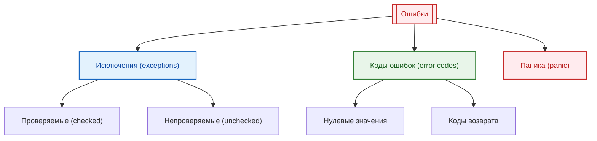

# Ошибки, исключения и отказоустойчивость

<div class="article-tags">
  <span class="tag tag-required">ОБЯЗАТЕЛЬНО</span>
  <span class="tag tag-beginner">ДЛЯ НОВИЧКОВ</span>
</div>

<span class="complexity-badge">Разработчику</span>
<span class="complexity-badge">Архитектору</span>
<span class="complexity-badge">Инженеру</span>

## Ошибки, исключения и отказоустойчивость

### Что такое ошибка

**Ошибка** — это состояние программы, при котором выполнение не может продолжаться в штатном режиме из-за нарушения ожидаемых условий.

Наверняка вы сталкивались с ситуацией, когда получали всплывающее окно о прекращении работы программы? Обычные пользователи почти всегда называют практически любое окно и неожиданное поведение программы как "ошибка", "завис", "тормозит", "вылетело". Программисту же придётся именно разбираться в природе этих проблем.

Ошибки возникают по разным причинам:
- нарушение бизнес-логики
- недоступность внешних ресурсов
- неверные входные данные
- сбои в работе оборудования
- ограничения системы

Все ошибки можно разделить на категории:



Ошибкой является именно та ситуация, когда программа прекращает свою работу. Представьте ситуацию, когда пользователь при входе на сайт, вводит вместо номера телефона случайные символы, жмёт "Продолжить", и программа перестаёт работать у всех пользователей. Просто выключается, потому что вылетела ошибка, и выполнение кода остановилось.

Но ведь реальные программы в таких ситуациях не останавливают свою работу, а выводят сообщения, не так ли?

Здесь используется два подхода - либо добавлять обычные штатные проверки операторами `if`, к примеру, "если пользователь ввёл НЕ число, то тогда вывести сообщение"; либо использовать обработку исключений.

Ошибки считаются состоянием, которые не предусмотрены, а исключения подразумевают ожидаемые состояния, предусмотренные программистом, как "план Б". Вся суть заключается в том, что код оборачивается в попытку, и при неудачной попытке запускается другой блок кода.

```
попробовать:
    вывод("Привет! Это нормальное выполнение программы.")
исключение:
    вывод("Ой! Что-то пошло не так...)
```

---

### Исключения — как они работают под капотом

**Исключение** — это объект, который передаёт информацию об ошибке через стек вызовов до тех пор, пока не будет обработан.

Механизм работы исключений основан на **раскрутке стека** (stack unwinding):

1. При возникновении ошибки создаётся объект исключения
2. Стек вызовов разматывается в обратном порядке
3. На каждом уровне проверяется наличие блока `catch`
4. При нахождении подходящего обработчика выполнение передаётся в него
5. После обработки программа продолжает работу

Раскрутка стека гарантирует корректное освобождение ресурсов:

```csharp
public void ProcessFile(string path)
{
    FileStream file = null;
    try
    {
        file = new FileStream(path, FileMode.Open);
        // Работа с файлом
    }
    catch (FileNotFoundException ex)
    {
        Console.WriteLine($"Файл не найден: {ex.Message}");
    }
    finally
    {
        file?.Close(); // Выполнится всегда, даже при исключении
    }
}
```

В этом примере:
- `FileStream` — объект для работы с файлом
- `try` — блок кода, где может возникнуть исключение
- `catch` — обработчик конкретного типа исключения
- `finally` — блок, выполняющийся в любом случае

```python
def process_file(path):
    file = None
    try:
        file = open(path, 'r')
        # Работа с файлом
    except FileNotFoundError as ex:
        print(f"Файл не найден: {ex}")
    finally:
        if file:
            file.close()  # Выполнится всегда
```

---

### Когда использовать исключения, а когда — коды ошибок

Выбор механизма обработки ошибок зависит от контекста и языка программирования.

**Исключения подходят для:**
- критических ошибок, требующих немедленного внимания
- ситуаций, которые не должны происходить в нормальной работе
- разделения бизнес-логики от обработки ошибок
- языков с поддержкой исключений (C#, Java, Python, C++)

**Коды ошибок предпочтительны для:**
- ожидаемых ситуаций, являющихся частью нормального потока
- системного программирования и низкоуровневых операций
- языков без исключений (C, Go, Rust)
- случаев, где важна производительность

Пример использования кодов ошибок в Go:

```go
func readFile(path string) ([]byte, error) {
    Данные, err := os.ReadFile(path)
    if err != nil {
        return nil, err  // Возвращаем ошибку явно
    }
    return Данные, nil
}

// Использование
content, err := readFile("config.txt")
if err != nil {
    log.Printf("Ошибка чтения: %v", err)
    return
}
// Продолжаем работу
```

Пример с исключениями в C#:

```csharp
public string ReadFile(string path)
{
    try
    {
        return File.ReadAllText(path);
    }
    catch (FileNotFoundException)
    {
        // Обработка конкретной ошибки
        return "Файл не найден";
    }
    catch (IOException ex)
    {
        // Обработка других ошибок ввода-вывода
        throw new ApplicationException("Ошибка чтения файла", ex);
    }
}
```

---

### Неуправляемые исключения и их последствия

**Неуправляемое исключение** — это исключение, которое не было перехвачено ни одним блоком `catch` в стеке вызовов.

Последствия неуправляемых исключений:
- аварийное завершение программы
- потеря несохранённых данных
- повреждение состояния системы
- плохой пользовательский опыт

В разных средах выполнения неуправляемые исключения ведут себя по-разному:

```csharp
// C# - приложение завершается
AppDomain.CurrentDomain.UnhandledException += (sender, e) =>
{
    Console.WriteLine($"Необработанное исключение: {e.ExceptionObject}");
    // Логирование перед завершением
};
```

```python
# Python - выводится трассировка и завершение
import sys

def handle_exception(exc_type, exc_value, exc_traceback):
    print(f"Критическая ошибка: {exc_value}")
    # Логирование

sys.excepthook = handle_exception
```

```javascript
// JavaScript в браузере - ошибка в консоли, скрипт останавливается
window.addEventListener('error', (event) => {
    console.error('Глобальная ошибка:', event.error);
    event.preventDefault(); // Предотвращаем стандартное поведение
});
```

<div class="callout callout--tip">
<div class="callout-title">Рекомендация</div>
Всегда обрабатывайте исключения на границах компонентов и на верхнем уровне приложения. Это позволяет избежать неожиданного завершения и предоставить пользователю осмысленное сообщение.
</div>

---

### Логирование ошибок — что, когда и зачем записывать

**Логирование** — это запись информации о событиях, происходящих в программе, для последующего анализа.

Что нужно логировать:

| Уровень | Когда использовать | Пример |
|---------|-------------------|--------|
| `TRACE` | Подробная отладочная информация | Вход и выход из методов |
| `DEBUG` | Информация для разработчиков | Значения переменных, SQL-запросы |
| `INFO` | Стандартные операции | Запуск приложения, успешная обработка |
| `WARN` | Потенциальные проблемы | Устаревшие методы, медленные операции |
| `ERROR` | Ошибки, требующие внимания | Исключения, сбои операций |
| `FATAL` | Критические ошибки | Неуправляемые исключения, аварийное завершение |

Пример структурированного логирования:

```csharp
using Microsoft.Extensions.Logging;

public class OrderService
{
    private readonly ILogger<OrderService> _logger;
    
    public OrderService(ILogger<OrderService> logger)
    {
        _logger = logger;
    }
    
    public async Task ProcessOrder(Order order)
    {
        _logger.LogInformation("Начало обработки заказа {OrderId}", order.Id);
        
        try
        {
            // Логируем входные данные
            _logger.LogDebug("Данные заказа: {@Order}", order);
            
            await ValidateOrder(order);
            await SaveOrder(order);
            
            _logger.LogInformation("Заказ {OrderId} успешно обработан", order.Id);
        }
        catch (ValidationException ex)
        {
            _logger.LogWarning(ex, "Ошибка валидации заказа {OrderId}", order.Id);
            throw;
        }
        catch (Exception ex)
        {
            _logger.LogError(ex, "Критическая ошибка при обработке заказа {OrderId}", order.Id);
            throw;
        }
    }
}
```

```python
import logging

logging.basicConfig(
    level=logging.INFO,
    format='%(asctime)s - %(name)s - %(levelname)s - %(message)s'
)

logger = logging.getLogger(__name__)

def process_order(order):
    logger.info(f"Начало обработки заказа {order.id}")
    
    try:
        logger.debug(f"Данные заказа: {order}")
        validate_order(order)
        save_order(order)
        logger.info(f"Заказ {order.id} успешно обработан")
    except ValidationError as ex:
        logger.warning(f"Ошибка валидации заказа {order.id}: {ex}")
        raise
    except Exception as ex:
        logger.error(f"Критическая ошибка при обработке заказа {order.id}", exc_info=True)
        raise
```

<div class="callout callout--tip">
<div class="callout-title">Структурированное логирование</div>
Используйте структурированные логи с контекстными данными (например, `@Order` в C#). Это позволяет эффективно искать и анализировать логи с помощью инструментов вроде Elasticsearch, Splunk или Seq.
</div>

---

### Игнорирование ошибок

**Игнорирование ошибок** — это практика, при которой возникшие ошибки не обрабатываются и не логируются.

Последствия игнорирования ошибок:
- скрытые проблемы в коде
- непредсказуемое поведение программы
- сложность диагностики проблем
- деградация качества системы со временем

Примеры плохой практики:

```csharp
// Плохо: пустой catch
try
{
    ProcessData();
}
catch
{
    // Ничего не делаем
}

// Плохо: игнорирование результата
int.TryParse("invalid", out int result); // result = 0, но мы не знаем об ошибке
```

```python
# Плохо: подавление всех исключений
try:
    process_data()
except:
    pass  # Молча игнорируем любую ошибку

# Плохо: игнорирование возвращаемого значения
result = some_function()  # Результат не используется
```

```go
// Плохо: игнорирование ошибки
Данные, _ := readFile("config.txt")  // Ошибка проигнорирована
```

Правильный подход — всегда обрабатывать ошибки осмысленно:

```csharp
try
{
    ProcessData();
}
catch (SpecificException ex)
{
    logger.LogWarning("Не критичная ошибка, продолжаем работу: {Message}", ex.Message);
    // Продолжаем работу с дефолтными значениями
}
```

<details>
<summary>
<b>Когда можно игнорировать ошибки</b>
</summary>
Иногда игнорирование ошибок допустимо, но только в обоснованных случаях:
- попытка удаления несуществующего файла
- проверка существования ресурса перед созданием
- обработка временных сетевых сбоев с повторными попытками
- graceful degradation при недоступности не критичных компонентов
</details>

---

### Принудительные действия — форсинг вызовов, игнорирование валидаций

**Принудительные действия** — это операции, которые обходят стандартные механизмы проверки и валидации.

Типичные сценарии принудительных действий:
- обход валидации данных
- принудительное выполнение операций
- отключение проверок безопасности
- форсированные обновления

Примеры реализации:

```csharp
public class OrderService
{
    public void CreateOrder(Order order, bool force = false)
    {
        if (!force)
        {
            ValidateOrder(order);
        }
        // Принудительное создание без валидации
        SaveOrder(order);
    }
    
    private void ValidateOrder(Order order)
    {
        if (order.Amount <= 0)
            throw new ValidationException("Сумма заказа должна быть положительной");
        if (string.IsNullOrWhiteSpace(order.CustomerName))
            throw new ValidationException("Имя клиента обязательно");
    }
}
```

```python
def create_order(order, force=False):
    if not force:
        validate_order(order)
    # Принудительное создание
    save_order(order)

def validate_order(order):
    if order.amount <= 0:
        raise ValueError("Сумма заказа должна быть положительной")
    if not order.customer_name:
        raise ValueError("Имя клиента обязательно")
```

**Риски принудительных действий:**
- нарушение целостности данных
- обход бизнес-правил
- сложность отладки
- потенциальные уязвимости безопасности

<details>
<summary>
<b>Рекомендации по использованию</b>
</summary>
Принудительные действия должны:
- быть явно обозначены в коде и документации
- логироваться с указанием причины
- использоваться только в крайних случаях
- иметь ограничения по правам доступа
- сопровождаться комментариями с обоснованием
</details>

---