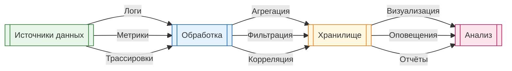

import DebuggerEmulator from '@site/src/components/DebuggerEmulator.jsx';

# Отладка и видимость состояния

<div class="article-tags">
  <span class="tag tag-required">ОБЯЗАТЕЛЬНО</span>
  <span class="tag tag-beginner">ДЛЯ НОВИЧКОВ</span>
</div>

<span class="complexity-badge">Разработчику</span>
<span class="complexity-badge">Архитектору</span>
<span class="complexity-badge">Инженеру</span>

## Отладка и видимость состояния

<DebuggerEmulator />

### Значения переменных

**Переменная** — это именованная область памяти, которая хранит данные определённого типа.

Типы значений переменных:
- **примитивные** — числа, строки, булевы значения
- **ссылочные** — объекты, массивы, коллекции
- **сложные** — структуры, классы, пользовательские типы

Примеры значений в разных языках:

```csharp
// Примитивные типы
int age = 25;                    // Целое число
double price = 19.99;            // Число с плавающей точкой
bool isActive = true;            // Булево значение
char grade = 'A';                // Символ
string name = "Alice";           // Строка

// Ссылочные типы
List<int> numbers = new List<int> { 1, 2, 3 };
Dictionary<string, int> scores = new Dictionary<string, int>
{
    { "Alice", 95 },
    { "Bob", 87 }
};

// Null-значения
string nullable = null;
int? nullableInt = null;
```

```python
# Динамическая типизация
age = 25                         # int
price = 19.99                    # float
is_active = True                 # bool
name = "Alice"                   # str
grades = ['A', 'B', 'C']         # list
scores = {'Alice': 95, 'Bob': 87}  # dict
nullable = None                  # NoneType
```

```javascript
// JavaScript
let age = 25;                    // number
const price = 19.99;             // number
var isActive = true;             // boolean
let name = "Alice";              // string
const numbers = [1, 2, 3];       // array
let scores = { Alice: 95, Bob: 87 };  // object
let nullable = null;             // null
let undefinedVar;                // undefined
```

---

### Как меняются значения переменных

Значения переменных изменяются в результате:
- присваивания новых значений
- вызова методов, изменяющих состояние
- побочных эффектов операций
- работы алгоритмов

Пример изменения значений (сначала — без привязки к языку):

```text
счётчик := 0              // счётчик = 0
счётчик := 5              // счётчик = 5
счётчик := счётчик + 3    // счётчик = 8
счётчик := счётчик + 1    // счётчик = 9

список := пустой_список
добавить в список "Яблоко"     // список = ["Яблоко"]
добавить в список "Банан"      // список = ["Яблоко", "Банан"]
удалить из список "Яблоко"     // список = ["Банан"]
```

**Справочно на C#**

```csharp
int counter = 0;        // counter = 0
counter = 5;            // counter = 5
counter += 3;           // counter = 8
counter++;              // counter = 9

List<string> items = new List<string>();
items.Add("Apple");     // items = ["Apple"]
items.Add("Banana");    // items = ["Apple", "Banana"]
items.Remove("Apple");  // items = ["Banana"]
```

```python
counter = 0        # counter = 0
counter = 5        # counter = 5
counter += 3       # counter = 8
counter += 1       # counter = 9

items = []
items.append("Apple")     # items = ["Apple"]
items.append("Banana")    # items = ["Apple", "Banana"]
items.remove("Apple")     # items = ["Banana"]
```

```javascript
let counter = 0;        // counter = 0
counter = 5;            // counter = 5
counter += 3;           // counter = 8
counter++;              // counter = 9

let items = [];
items.push("Apple");     // items = ["Apple"]
items.push("Banana");    // items = ["Apple", "Banana"]
items.splice(0, 1);      // items = ["Banana"]
```

---

### Как смотреть значения переменных

Существует несколько способов просмотра значений переменных:

#### 1. Отладочная печать

```csharp
Console.WriteLine($"counter = {counter}");
Console.WriteLine($"items = {string.Join(", ", items)}");
```

```python
print(f"counter = {counter}")
print(f"items = {items}")
```

```javascript
console.log(`counter = ${counter}`);
console.log(`items = ${items}`);
```

#### 2. Точки останова (breakpoints)

Установка точек останова в отладчике позволяет приостановить выполнение и осмотреть состояние программы.

#### 3. Watch-выражения

Многие отладчики поддерживают отслеживание значений переменных в реальном времени.

#### 4. Интерактивные сессии

```python
# Python REPL
>>> x = 10
>>> x
10
>>> x + 5
15
```

```csharp
// C# Interactive в Visual Studio
> int x = 10;
> x
10
> x + 5
15
```

---

### Логирование — отладочные выводы, трассировка

**Трассировка** — это запись последовательности выполнения программы для анализа потока управления.

Примеры трассировки:

```csharp
public void ProcessOrder(Order order)
{
    _logger.LogTrace("Вход в ProcessOrder, OrderId: {OrderId}", order.Id);
    
    try
    {
        _logger.LogDebug("Валидация заказа");
        ValidateOrder(order);
        
        _logger.LogDebug("Сохранение заказа в БД");
        SaveToDatabase(order);
        
        _logger.LogDebug("Отправка уведомления");
        SendNotification(order);
        
        _logger.LogTrace("Выход из ProcessOrder, OrderId: {OrderId}", order.Id);
    }
    catch (Exception ex)
    {
        _logger.LogError(ex, "Ошибка в ProcessOrder, OrderId: {OrderId}", order.Id);
        throw;
    }
}
```

```python
def process_order(order):
    logger.debug(f"Вход в process_order, order_id: {order.id}")
    
    try:
        logger.debug("Валидация заказа")
        validate_order(order)
        
        logger.debug("Сохранение заказа в БД")
        save_to_database(order)
        
        logger.debug("Отправка уведомления")
        send_notification(order)
        
        logger.debug(f"Выход из process_order, order_id: {order.id}")
    except Exception as ex:
        logger.error(f"Ошибка в process_order, order_id: {order.id}", exc_info=True)
        raise
```

<div class="callout callout--tip">
<div class="callout-title">Уровни детализации</div>
Используйте разные уровни логирования:
- `TRACE` для детальной трассировки вызовов
- `DEBUG` для отладочной информации
- `INFO` для стандартных операций
В продакшене обычно отключают `TRACE` и `DEBUG` для повышения производительности.
</div>

---

### Отладчики — брейкпоинты, watch, call stack inspection

**Отладчик** — это инструмент, который позволяет пошагово выполнять программу и анализировать её состояние.

Основные функции отладчика:

| Функция | Описание | Пример использования |
|---------|----------|---------------------|
| **Точка останова** | Приостанавливает выполнение в указанной строке | Клик по номеру строки в IDE |
| **Пошаговое выполнение** | Выполняет код по одной инструкции | F10 (Step Over), F11 (Step Into) |
| **Watch** | Отслеживает значения переменных | Добавление переменной в окно Watch |
| **Call Stack** | Показывает цепочку вызовов | Окно Call Stack в отладчике |
| **Условные точки** | Остановка при выполнении условия | `counter > 100` |
| **Точки трассировки** | Логирование без остановки | Логирование значения переменной |

Пример использования отладчика в разных средах:

**Visual Studio (C#):**
```
1. Установить точку останова (F9)
2. Запустить отладку (F5)
3. Использовать:
   - F10: Step Over (перешагнуть)
   - F11: Step Into (войти в метод)
   - Shift+F11: Step Out (выйти из метода)
   - F5: Continue (продолжить)
```

**PyCharm (Python):**
```
1. Установить точку останова (клик слева от номера строки)
2. Запустить отладку (правая кнопка → Debug)
3. Использовать панель отладки для навигации
```

**Chrome DevTools (JavaScript):**
```
1. Открыть Sources панель (F12)
2. Установить точку останова (клик по номеру строки)
3. Использовать кнопки управления выполнением
```

---

### Инспекция состояния в продакшене — телеметрия, метрики, логи

**Телеметрия** — это сбор данных о работе приложения в реальном времени.

Компоненты телеметрии:



**Типы данных телеметрии:**

1. **Логи** — события с временной меткой
```json
{
  "timestamp": "2026-03-05T10:30:00Z",
  "level": "ERROR",
  "service": "order-service",
  "message": "Ошибка обработки заказа",
  "orderId": "ORD-12345",
  "exception": "TimeoutException"
}
```

2. **Метрики** — числовые показатели
```
http_requests_total{method="POST", endpoint="/orders", status="200"} 1234
memory_usage_bytes{service="order-service"} 524288000
cpu_usage_percent{service="order-service"} 45.2
```

3. **Трассировки** — цепочки вызовов
```
TraceId: abc123
├─ Span: ProcessOrder (100ms)
│  ├─ Span: ValidateOrder (10ms)
│  ├─ Span: SaveToDatabase (50ms)
│  └─ Span: SendNotification (40ms)
```

Пример интеграции телеметрии:

```csharp
using OpenTelemetry;
using OpenTelemetry.Metrics;
using OpenTelemetry.Trace;

public class Program
{
    public static void Main()
    {
        var tracerProvider = Sdk.CreateTracerProviderBuilder()
            .AddSource("MyApp")
            .AddAspNetCoreInstrumentation()
            .AddHttpClientInstrumentation()
            .AddOtlpExporter()
            .Build();
        
        var meterProvider = Sdk.CreateMeterProviderBuilder()
            .AddMeter("MyApp")
            .AddAspNetCoreInstrumentation()
            .AddOtlpExporter()
            .Build();
    }
}
```

---

### "Не отвечает" — что это значит?

**Зависание приложения** — это состояние, при котором программа перестаёт реагировать на пользовательский ввод или внешние события.

Причины зависаний:

#### 1. Бесконечные циклы

```csharp
// Бесконечный цикл
while (true)
{
    // Нет условия выхода
}

// Цикл с ошибочным условием
int i = 0;
while (i != 10)
{
    i += 3;  // i никогда не станет равно 10 (0, 3, 6, 9, 12...)
}
```

```python
# Бесконечная рекурсия
def recurse():
    recurse()  # Нет условия выхода

# Бесконечный цикл
while True:
    pass  # Нет условия выхода
```

#### 2. Блокировки и взаимоблокировки (deadlock)

```csharp
public class DeadlockExample
{
    private readonly object _lock1 = new object();
    private readonly object _lock2 = new object();
    
    public void Method1()
    {
        lock (_lock1)
        {
            Thread.Sleep(100);  // Имитация работы
            lock (_lock2)       // Ожидание _lock2
            {
                Console.WriteLine("Method1 completed");
            }
        }
    }
    
    public void Method2()
    {
        lock (_lock2)
        {
            Thread.Sleep(100);  // Имитация работы
            lock (_lock1)       // Ожидание _lock1
            {
                Console.WriteLine("Method2 completed");
            }
        }
    }
    
    // Если вызвать оба метода в разных потоках одновременно,
    // произойдёт взаимоблокировка
}
```

#### 3. Ожидание внешних ресурсов

```csharp
public async Task<string> FetchDataAsync()
{
    using var client = new HttpClient();
    // Без таймаута запрос может висеть бесконечно
    var response = await client.GetAsync("https://slow-api.com/Данные");
    return await response.Content.ReadAsStringAsync();
}

// Правильный вариант с таймаутом
public async Task<string> FetchDataWithTimeoutAsync()
{
    using var client = new HttpClient();
    using var cts = new CancellationTokenSource(TimeSpan.FromSeconds(30));
    
    var response = await client.GetAsync(
        "https://slow-api.com/Данные", 
        cts.Token
    );
    return await response.Content.ReadAsStringAsync();
}
```

#### 4. Проблемы с памятью

```csharp
// Утечка памяти
public class MemoryLeak
{
    private static List<byte[]> _cache = new List<byte[]>();
    
    public void AddToCache()
    {
        // Добавляем данные, но никогда не удаляем
        _cache.Add(new byte[1024 * 1024]);  // 1MB
    }
}
```

---

### Как читать ошибки?

Структура сообщения об ошибке обычно включает:

1. **Тип исключения** — класс ошибки
2. **Сообщение** — описание проблемы
3. **Стек вызовов** — цепочка методов, приведших к ошибке
4. **Дополнительные данные** — контекст ошибки

Пример чтения ошибки в C#:

```
System.IO.FileNotFoundException: 
  Could not find file 'C:\config.txt'.
  
  at System.IO.FileStream.ValidateFileHandle(SafeFileHandle fileHandle)
  at System.IO.FileStream.CreateFileOpenHandle(FileMode mode, FileShare share)
  at System.IO.FileStream..ctor(String path, FileMode mode, FileAccess access)
  at Program.ReadFile(String path) in C:\Program.cs:line 15
  at Program.Main(String[] args) in C:\Program.cs:line 8
```

Анализ:
- **Тип:** `FileNotFoundException` — файл не найден
- **Сообщение:** `Could not find file 'C:\config.txt'` — какой файл
- **Стек вызовов:** показывает путь от `Main` до `FileStream`
- **Место в коде:** `Program.cs:line 15` — где произошла ошибка

Пример чтения ошибки в Python:

```
Traceback (most recent call last):
  File "app.py", line 10, in <module>
    result = divide(10, 0)
  File "app.py", line 6, in divide
    return a / b
ZeroDivisionError: division by zero
```

Анализ:
- **Тип:** `ZeroDivisionError` — деление на ноль
- **Сообщение:** `division by zero` — описание ошибки
- **Стек вызовов:** от `divide` в строке 6 до `<module>` в строке 10

---