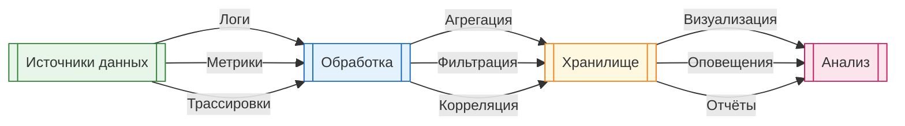

import ExternalCodeEmbed from '@site/src/components/ExternalCodeEmbed';


import ExternalPlayEmbed from '@site/src/components/ExternalPlayEmbed';


# Отладка и видимость состояния

<div class="article-tags">
  <span class="tag tag-required">ОБЯЗАТЕЛЬНО</span>
  <span class="tag tag-beginner">ДЛЯ НОВИЧКОВ</span>
</div>

<span class="complexity-badge">Разработчику</span>
<span class="complexity-badge">Архитектору</span>
<span class="complexity-badge">Инженеру</span>

---

## Отладка и видимость состояния

Отладка даёт ответ на ключевой инженерный вопрос — что именно происходит с программой в конкретный момент выполнения. Чем сложнее система, тем важнее видеть состояние пошагово — значения переменных, порядок вызовов, точки блокировки и переходы между потоками.

<ExternalPlayEmbed example="tools-development/debugger-emulator" title="Debugger Emulator" />

---

### Значения переменных

**Переменная** — это именованная область памяти, которая хранит данные определённого типа.

Типы значений переменных:
- **примитивные** — числа, строки, булевы значения
- **ссылочные** — объекты, массивы, коллекции
- **сложные** — структуры, классы, пользовательские типы

Примеры значений в разных языках:


<ExternalCodeEmbed example="csharp/code-406-112-001" title="Значения переменных" minHeight={390} />


<ExternalCodeEmbed example="python/code-406-112-002" title="Значения переменных" minHeight={210} />


<ExternalCodeEmbed example="javascript/code-406-112-003" title="Значения переменных" minHeight={228} />


---

### Как меняются значения переменных

Значения переменных изменяются в результате:
- присваивания новых значений
- вызова методов, изменяющих состояние
- побочных эффектов операций
- работы алгоритмов

Пример изменения значений (сначала — без привязки к языку):

```text
счётчик := 0              // счётчик = 0
счётчик := 5              // счётчик = 5
счётчик := счётчик + 3    // счётчик = 8
счётчик := счётчик + 1    // счётчик = 9

список := пустой_список
добавить в список "Яблоко"     // список = ["Яблоко"]
добавить в список "Банан"      // список = ["Яблоко", "Банан"]
удалить из список "Яблоко"     // список = ["Банан"]
```

**Справочно на C#**


<ExternalCodeEmbed example="csharp/code-406-112-004" title="Как меняются значения переменных" minHeight={228} />


<ExternalCodeEmbed example="python/code-406-112-005" title="Как меняются значения переменных" minHeight={228} />


<ExternalCodeEmbed example="javascript/code-406-112-006" title="Как меняются значения переменных" minHeight={228} />


---

### Как смотреть значения переменных

Существует несколько способов просмотра значений переменных:

В реальной работе эти способы комбинируют. Отладчик удобен для локального анализа, логи помогают в интеграционных сценариях, а телеметрия нужна для продакшена, где прямой `breakpoint` недоступен.

---

#### 1. Отладочная печать

```csharp
Console.WriteLine($"counter = {counter}");
Console.WriteLine($"items = {string.Join(", ", items)}");
```

```python
print(f"counter = {counter}")
print(f"items = {items}")
```

```javascript
console.log(`counter = ${counter}`);
console.log(`items = ${items}`);
```

---

#### 2. Точки останова (breakpoints)

Установка точек останова в отладчике позволяет приостановить выполнение и осмотреть состояние программы.

Дополнительно полезны условные точки останова. Они останавливают выполнение только при выполнении правила, например `order.Total > 100000` или `retryCount == 3`. Это ускоряет анализ "редких" ошибок без ручного шага по тысячам итераций.

---

#### 3. Watch-выражения

Многие отладчики поддерживают отслеживание значений переменных в реальном времени.

---

#### 4. Интерактивные сессии

```python
# Python REPL
>>> x = 10
>>> x
10
>>> x + 5
15
```

```csharp
// C# Interactive в Visual Studio
> int x = 10;
> x
10
> x + 5
15
```

---

### Логирование — отладочные выводы, трассировка

**Трассировка** — это запись последовательности выполнения программы для анализа потока управления.

Примеры трассировки:


<ExternalCodeEmbed example="csharp/code-406-112-007" title="Логирование — отладочные выводы, трассировка" minHeight={480} />


<ExternalCodeEmbed example="python/code-406-112-008" title="Логирование — отладочные выводы, трассировка" minHeight={372} />


<div class="callout callout--tip">
<div class="callout-title">Уровни детализации</div>

  <div class="callout-body">
Используйте разные уровни логирования:
- `TRACE` для детальной трассировки вызовов
- `DEBUG` для отладочной информации
- `INFO` для стандартных операций
В продакшене обычно отключают `TRACE` и `DEBUG` для повышения производительности.
</div>
  </div>


---

### Отладчики — брейкпоинты, watch, call stack inspection

**Отладчик** — это инструмент, который позволяет пошагово выполнять программу и анализировать её состояние.

Практический маршрут диагностики обычно выглядит так:
1. Повторить проблему в контролируемом сценарии;
2. Поставить точки останова на границе входа и в подозрительном методе;
3. Проверить `call stack` и значения входных параметров;
4. Сравнить фактическое состояние с ожидаемым контрактом;
5. Подтвердить исправление повторным прогоном.

Основные функции отладчика:

| Функция | Описание | Пример использования |
|---------|----------|---------------------|
| **Точка останова** | Приостанавливает выполнение в указанной строке | Клик по номеру строки в IDE |
| **Пошаговое выполнение** | Выполняет код по одной инструкции | F10 (Step Over), F11 (Step Into) |
| **Watch** | Отслеживает значения переменных | Добавление переменной в окно Watch |
| **Call Stack** | Показывает цепочку вызовов | Окно Call Stack в отладчике |
| **Условные точки** | Остановка при выполнении условия | `counter > 100` |
| **Точки трассировки** | Логирование без остановки | Логирование значения переменной |

Пример использования отладчика в разных средах:

**Visual Studio (C#):**
```
1. Установить точку останова (F9)
2. Запустить отладку (F5)
3. Использовать:
   - F10: Step Over (перешагнуть)
   - F11: Step Into (войти в метод)
   - Shift+F11: Step Out (выйти из метода)
   - F5: Continue (продолжить)
```

**PyCharm (Python):**
```
1. Установить точку останова (клик слева от номера строки)
2. Запустить отладку (правая кнопка → Debug)
3. Использовать панель отладки для навигации
```

**Chrome DevTools (JavaScript):**
```
1. Открыть Sources панель (F12)
2. Установить точку останова (клик по номеру строки)
3. Использовать кнопки управления выполнением
```

---

### Инспекция состояния в продакшене — телеметрия, метрики, логи

**Телеметрия** — это сбор данных о работе приложения в реальном времени.

Компоненты телеметрии:



**Типы данных телеметрии:**

1. **Логи** — события с временной меткой


<ExternalCodeEmbed example="json/code-406-112-009" title="Инспекция состояния в продакшене — телеметрия, метрики, логи" minHeight={210} />


2. **Метрики** — числовые показатели
```
http_requests_total{method="POST", endpoint="/orders", status="200"} 1234
memory_usage_bytes{service="order-service"} 524288000
cpu_usage_percent{service="order-service"} 45.2
```

3. **Трассировки** — цепочки вызовов
```
TraceId: abc123
├─ Span: ProcessOrder (100ms)
│  ├─ Span: ValidateOrder (10ms)
│  ├─ Span: SaveToDatabase (50ms)
│  └─ Span: SendNotification (40ms)
```

Пример интеграции телеметрии:


<ExternalCodeEmbed example="csharp/code-406-112-010" title="Инспекция состояния в продакшене — телеметрия, метрики, логи" minHeight={462} />


---

### "Не отвечает" — что это значит?

**Зависание приложения** — это состояние, при котором программа перестаёт реагировать на пользовательский ввод или внешние события.

Причины зависаний:

---

#### 1. Бесконечные циклы


<ExternalCodeEmbed example="csharp/code-406-112-011" title="1. Бесконечные циклы" minHeight={282} />


<ExternalCodeEmbed example="python/code-406-112-012" title="1. Бесконечные циклы" minHeight={192} />


---

#### 2. Блокировки и взаимоблокировки (deadlock)


<ExternalCodeEmbed example="csharp/code-406-112-013" title="2. Блокировки и взаимоблокировки (deadlock)" minHeight={642} />


---

#### 3. Ожидание внешних ресурсов


<ExternalCodeEmbed example="csharp/code-406-112-014" title="3. Ожидание внешних ресурсов" minHeight={426} />


---

#### 4. Проблемы с памятью


<ExternalCodeEmbed example="csharp/code-406-112-015" title="4. Проблемы с памятью" minHeight={264} />


---

### Как читать ошибки?

Структура сообщения об ошибке обычно включает:

1. **Тип исключения** — класс ошибки
2. **Сообщение** — описание проблемы
3. **Стек вызовов** — цепочка методов, приведших к ошибке
4. **Дополнительные данные** — контекст ошибки

Пример чтения ошибки в C#:

```
System.IO.FileNotFoundException: 
  Could not find file 'C:\config.txt'.
  
  at System.IO.FileStream.ValidateFileHandle(SafeFileHandle fileHandle)
  at System.IO.FileStream.CreateFileOpenHandle(FileMode mode, FileShare share)
  at System.IO.FileStream..ctor(String path, FileMode mode, FileAccess access)
  at Program.ReadFile(String path) in C:\Program.cs:line 15
  at Program.Main(String[] args) in C:\Program.cs:line 8
```

Анализ:
- **Тип:** `FileNotFoundException` — файл не найден
- **Сообщение:** `Could not find file 'C:\config.txt'` — какой файл
- **Стек вызовов:** показывает путь от `Main` до `FileStream`
- **Место в коде:** `Program.cs:line 15` — где произошла ошибка

Пример чтения ошибки в Python:

```
Traceback (most recent call last):
  File "app.py", line 10, in <module>
    result = divide(10, 0)
  File "app.py", line 6, in divide
    return a / b
ZeroDivisionError: division by zero
```

Анализ:
- **Тип:** `ZeroDivisionError` — деление на ноль
- **Сообщение:** `division by zero` — описание ошибки
- **Стек вызовов:** от `divide` в строке 6 до `<module>` в строке 10

---

## Куда идти дальше

- Для углубления в обработку сбоев и стратегии перехвата — [Ошибки, исключения и отказоустойчивость](/encyclopedia/4-code-dev/4-06-arhitektura-vypolneniya/111)
- Для понимания стеков и иерархий вызовов в отладчике — [Вызовы и иерархия](/encyclopedia/4-code-dev/4-06-arhitektura-vypolneniya/113)
- Для раздела разработки и отладки с практиками процесса — [Разработка и отладка](/encyclopedia/4-code-dev/4-14-razrabotka-i-otladka/1)

---

## Что запомнить

- Отладка строится вокруг фактов о состоянии, а не вокруг предположений.
- Значения переменных, стек вызовов и точки останова дают основу диагностики.
- Логи и телеметрия продолжают работу отладчика в продакшене.
- Чем раньше видна некорректная переменная, тем дешевле исправление.

---

## Типичные ошибки

- Слишком много `print` без структуры и контекста.
- Пошаговая отладка без гипотезы и критерия проверки.
- Игнорирование `call stack` при анализе исключения.
- Отсутствие таймаутов и отмены в коде, который ждёт внешние ресурсы.

---

## Мини-практика

1. Выберите дефект, который периодически повторяется.
2. Сформулируйте гипотезу, какие две переменные важнее всего.
3. Поставьте условный breakpoint по этим переменным.
4. Подтвердите или опровергните гипотезу и зафиксируйте реальную причину.

---
