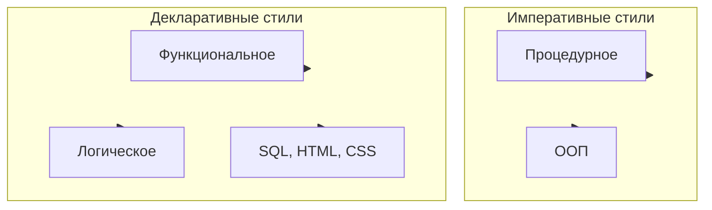

import ProgrammingParadigmPlay from '@site/src/components/ProgrammingParadigmPlay.jsx';

# Программные парадигмы

<div class="article-tags">
  <span class="tag tag-required">ОБЯЗАТЕЛЬНО</span>
  <span class="tag tag-beginner">ДЛЯ НОВИЧКОВ</span>
</div>

<span class="complexity-badge">Разработчику</span>
<span class="complexity-badge">Архитектору</span>
<span class="complexity-badge">Инженеру</span>

---

## Парадигмы

### Что такое парадигма?

**Парадигма** — это философия написания кода. Как мы видим задачу - как набор команд, вычисления, объекты, потоки событий.

Словом, здесь речь о логике и структуре, о том, как организуется мысль.

Соответственно, парадигмы это *инструменты восприятия*.

Почему так важно именно мышление? Потому что мы можем выучить ключевые слова, возможности языка и различные варианты решения проблем, но фундаментально важно именно то, как мы их применим, какие комбинации, алгоритмы и хитрости используем.

У разных команд, разных разработчиков и разных специалистов свои взгляды на одно и то же - это порождает споры и рассуждения о "великом", о том, как лучше.

К примеру, что делать сначала и в каком порядке, что и как мы хотим получать.

**Парадигма не совпадает с языком.** На C можно писать в духе объектов; на Python и JavaScript сочетают императивные циклы, ООП и функциональные `map`/`filter`. Разные авторы называют похожие приёмы разными словами (модули и классы, процедуры и методы) — полезно смотреть на суть, а не только на ярлык.

<div class="callout callout--info">
  <div class="callout-title">Парадигмы сочетаются</div>

  <div class="callout-body">
  Термин «парадигма программирования» закрепил <strong>Роберт Флойд</strong> (лекция лауреата премии Тьюринга, 1978). Он подчёркивал: стили программирования <strong>дополняют</strong> друг друга — разумно расширять свой набор подходов, а не выбирать один навсегда. Подробная «карта» парадигм для самостоятельного углубления — у <a href="http://www.info.ucl.ac.be/~pvr/paradigms.html">Peter Van Roy</a> (Principal programming paradigms).
</div>
  </div>

<div class="callout callout--tip">
  <div class="callout-title">Как читать эту статью</div>

  <div class="callout-body">
  Сначала зафиксируйте общую идею парадигм и схему «императивное — декларативное» в блоке «Как связаны парадигмы», затем пройдите разделы по стилям и сравните один кейс в интерактиве. После этого удобно перейти к [принципам SOLID](/encyclopedia/4-code-dev/4-07-paradigmy-i-urovni-abstraktsii/113) и [метапрограммированию](/encyclopedia/4-code-dev/4-07-paradigmy-i-urovni-abstraktsii/112), чтобы закрепить архитектурное применение.
</div>
  </div>


---

## Основные парадигмы

Часто у новичка может возникнуть сложность при изучении ООП. Но мы постараемся разобраться, одновременно нагружая теорией и закрепляя пониманием.

Так, мы поняли, что такое код, блоки кода, функции, программы, компиляция и интерпретация. Мы понимаем, что есть набор кода – ключевых слов, операций, операндов и условных операторов. Мы изучили в JavaScript и SQL основы функций – когда выполняется какая-то операция, возвращающая результат. 

Мы определили, что процесс написания кода (программы) называется программированием. Но оно не ограничено только выбором языка. Важную роль играет то, как взаимодействуют элементы, формулируется логика, как описываются и выполняются задачи. Программирование осуществляется с соблюдением правил, установленных парадигмами программирования. Один язык может позволять писать с использованием разных парадигм. Ключевое для программиста - знание ООП, но мы вкратце посмотрим и на другие виды.

### Как связаны парадигмы

Удобно держать в голове **две оси**:

- **Императивная** — описываем шаги и изменение состояния (переменные, присваивания, циклы).
- **Декларативная** — описываем желаемый результат или отношения; исполнитель сам выбирает порядок вычислений (СУБД, движок разметки, решатель правил).

Внутри императивной оси чаще всего выделяют **процедурный** стиль (подпрограммы на C, Pascal) и **объектный** (классы и объекты в Java, C#, Python). **Процедурное** — подвид императивного, а не синоним всего императивного кода.

Внутри декларативной — **функционное** (вычисление через функции и выражения), **логическое** (факты и правила, вывод ответа) и узкоспециализированные языки **запросов и разметки** (SQL, HTML, CSS).



На практике приложение почти всегда **смешивает** стили: императивное ядро, декларативный SQL, функционные преобразования коллекций, событийный UI.

---

### Один и тот же кейс в разных парадигмах

Чтобы почувствовать разницу не на терминах, а на практике, полезно брать один и тот же кейс и прогонять его через разные подходы.

Кейс: "Нужно посчитать итог заказа, применить скидку и отправить уведомление".

- Императивный стиль — пишем последовательность шагов и явно управляем состоянием переменных.
- ООП-стиль — собираем поведение в объектах (`Order`, `DiscountPolicy`, `Notifier`), разделяем ответственности.
- Функциональный стиль — описываем цепочку преобразований входных данных в результат.
- Декларативный стиль — описываем правила расчёта и фильтрации, а детали выполнения делегируем платформе.
- Событийный стиль — реагируем на событие "OrderPlaced" и связываем обработчики.

Такой способ сравнения помогает выбрать стиль под задачу, а не под привычку команды.

<ProgrammingParadigmPlay />

---

### Императивное программирование

**Императивное программирование** — парадигма, в которой программа задаёт **последовательность команд** и явно управляет **состоянием** (память, переменные). Название связано с повелительным наклонением в естественных языках: код читается как указания исполнителю — «сложи», «запиши», «повтори».

Типичные элементы: именованные переменные, **присваивание**, составные выражения, подпрограммы. Языки: C, Pascal, Fortran, Go (процедурный стиль), ассемблер. Присваивание делает модель вычислений зависимой от момента выполнения: тот же фрагмент кода может вести себя по-разному, если между вызовами изменилось глобальное состояние ([функции и побочные эффекты](/encyclopedia/1-basics/1-19-programma/113)).

Пример:
```
начало
    a = 5
    b = 10
    c = a + b
    вывод(c)
конец
```

---

### Процедурное программирование

**Процедурное программирование** — подвид императивного стиля: операторы собирают в **подпрограммы** (процедуры, функции) — более крупные единицы кода, которые язык позволяет вызывать по имени. Модель близка **архитектуре фон Неймана**: есть программа и память; выполнение последовательно преобразует исходные данные в результат. Теоретическая опора — **машина Тьюринга**.

Классические процедурные языки: Fortran, COBOL, Algol, BASIC, C, Pascal, PL/I. Развитие **структурного** программирования (отказ от произвольного `goto`, теорема **Бёма–Якопини**) сделало поток управления предсказуемее без потери выразительности.

**Smalltalk, C++, Java** группируют код через объекты и классы — это уровень **ООП**, а не процедурный стиль в узком смысле. В **Tcl, Perl, Lua** и командных оболочках процедурный подход снова заметен, хотя эти языки обычно **мультипарадигменные**.

Пример:
```
процедура привет():
    вывод("Привет, мир!")

начало
    привет()
конец
```

---

### Декларативное программирование

**Декларативное программирование** — парадигма, в которой задаётся **спецификация** решения: описывается ожидаемый результат или правило, а **способ** получения (порядок шагов, индексы циклов) отдаётся платформе — СУБД, браузеру, планировщику, компилятору.

На императивной оси программист пишет **как** менять состояние; в декларативной формулировке — **что** должно получиться. Яркие примеры: **SQL** (какие строки выбрать), **HTML/CSS** (какой документ и оформление), фрагменты **Kubernetes/Terraform** (желаемое состояние кластера).

В «чистом» декларативном коде стремятся к **ссылочной прозрачности**: значение выражения зависит только от входов, без скрытого состояния. Часто нет переменных с присваиванием — как в запросе `SELECT … WHERE …` или в разметке страницы.

К декларативному относят **функционное** и **логическое** программирование: даже если внутри работает поиск или свёртка, программист задаёт **отношения и правила**, а не пошаговый план «увеличить счётчик, пока …».

Полностью декларативные языки иногда **неполны по Тьюрингу** — не любую вычислимую задачу можно выразить одной спецификацией без императивных расширений. На практике говорят о **декларативном описании задачи** в домене (запрос, макет, политика), а приложение целиком всё равно сочетает стили. **DSL** и языково-ориентированное программирование часто повышают долю декларативности в предметной области.

Пример:
```
запрос:
    выбрать имя, возраст из пользователи где возраст > 18
```

См. также краткий образ декларативности в [программе и Excel](/encyclopedia/1-basics/1-19-programma/114).

---

### Функциональное программирование

**Функциональное программирование** — декларативный стиль, в котором вычисление трактуется как применение **функций в математическом смысле**: результат зависит от аргументов, а не от скрытого состояния. Языки: Haskell, Lisp, F#, Erlang/Elixir, Scala; в Python, JavaScript, C# и Java 8+ тот же стиль доступен через функции высшего порядка и лямбды.

Слово «функция» в императивном коде часто означает **подпрограмму**, которая может читать глобальные переменные и менять память. В ФП **чистая** функция при одних и тех же аргументах всегда даёт один результат — это упрощает тесты, кэширование (**мемоизацию**) и **распараллеливание** без гонок. Теоретическая база — [лямбда-исчисление](/encyclopedia/9-spinoff/9-01-velikie-lyudi/1); углубление — [Haskell](/encyclopedia/5-languages/5-17-haskell/2), [Lisp](/encyclopedia/5-languages/5-16-starye-yazyki/Lisp/8).

Пример (рекурсия вместо цикла с мутацией):
```
функция сумма(список):
    если список пустой:
        вернуть 0
    иначе:
        вернуть первый элемент + сумма(остальные элементы)

начало
    числа = [1, 2, 3, 4]
    результат = сумма(числа)
    вывод(результат)
конец
```

**Порядок вычисления аргументов.** В **строгом** (аппликативном) порядке сначала вычисляют все аргументы, потом функцию — при `печать(длина([2+1, 3*2, 1/0, 5-4]))` будет ошибка деления на ноль. В **ленивом** (нормальном) порядке аргумент считают только когда он нужен — для `длина` списка элементы могут остаться невычисленными, и результатом станет `4`. Ленивость по умолчанию в Haskell ([архитектура выполнения](/encyclopedia/5-languages/5-17-haskell/3)); в большинстве императивных языков — строгость.

**Ступени функционального стиля** (от большей роли данных к большей роли композиции функций):

1. структура программы повторяет структуру данных;
2. **аппликативный** — явные аргументы и вызовы;
3. **комбинаторный** — выражения из комбинаторов без именованных параметров;
4. **бесточечный** (*point-free*) — цепочки вроде `filter even . map square`.

**Компромиссы.** Отказ от мутаций ведёт к частому созданию новых структур — нужен эффективный **сборщик мусора**. Ввод-вывод и сеть требуют эффектов: в Haskell их изолируют **монадами** ([основы Haskell](/encyclopedia/5-languages/5-17-haskell/2)); в Lisp и OCaml допускают императивные фрагменты рядом с чистым ядром. В «нефункциональных» языках ФП-стиль всё равно применяют локально — `map`/`filter`, лямбды, неизменяемые коллекции.

---

### Логическое программирование

**Логическое программирование** — декларативная парадигма на основе **математической логики**: программа задаётся **утверждениями** (фактами) и **правилами вывода**, а исполнитель ищет, при каких подстановках переменных запрос выполняется. Программист описывает **отношения** («кто чей предок»), а порядок перебора вариантов оставляет **движку** (часто с **поиском с возвратом**).

Языки: **Prolog** (самый известный), **Datalog** (ограниченный Prolog, удобен для аналитики и графов), **Mercury**, **Visual Prolog**, **Oz**, **Fril**. В промышленности логические идеи встречаются в экспертных системах и задачах ИИ; в повседневной разработке ближе всего **Datalog** в анализе данных и правилах вывода в конфигурациях.

**Как это выполняется (упрощённо).** База знаний хранит факты и правила. **Запрос** (goal) — вопрос «существует ли такая подстановка?». Движок **сопоставляет** (unification) шаблоны запроса с фактами и правилами; если ветка не срабатывает, откатывается к предыдущему выбору (**backtracking**). Явного цикла «for по всем людям» в коде обычно нет — его заменяет поиск по дереву вариантов.

Пример:
```
факт: родитель(джон, джим)
факт: родитель(джим, энн)

правило: предок(X, Y) если родитель(X, Y)
правило: предок(X, Y) если родитель(X, Z) и предок(Z, Y)

запрос: предок(джон, энн)
```

Ответ: да, с подстановкой `X = джон`, `Y = энн` (движок вывел цепочку через правила).

**История (кратко).** Первым языком логического стиля был **Planner** (план перебора вариантов и вывод фактов без тяжёлого стека). **Prolog** упростил модель: отдельный «план» перебора не нужен — правила и факты сами задают пространство поиска. Позже появились линии **QA-4**, **Conniver**, **QLISP** и др.; современные языки чаще наследуют именно Prolog. Идея выражать программы через логику пересекается с [лямбда-исчислением](/encyclopedia/9-spinoff/9-01-velikie-lyudi/1) (Чёрч, 1930‑е), но для прикладного логического кода ключевой формой стали **клаузы Хорна** (факты и правила «если …, то …»).

Логическое программирование относится к **декларативной** ветке (см. блок выше): схема программы — часть исполняемого кода, отдельной «архитектуры шагов» в императивном смысле нет.

---

### Аспектно-ориентированное программирование

**Аспектно-ориентированное программирование (АОП)** фокусируется на разделении "поперечных" (cross-cutting) аспектов программы (например, логирование, обработка ошибок) от основной бизнес-логики. Тут имеет место уменьшение дублирования кода и разделение кода на модули, которые можно комбинировать. Языки - AspectJ, Spring AOP (Java), PostSharp (.NET). Пример:
```
аспект логирование:
    перед выполнением метода:
        записать в журнал("Метод вызван")

класс пример:
    метод действие():
        вывод("Действие выполнено")
```
AOP подразумевает, что сквозная логика отделяется от основной бизнес-логики. 

Сквозная логика — это функционал, который повторяется во многих местах приложения. Вместо того чтобы дублировать такой код в каждом методе, AOP позволяет вынести его в отдельные модули — аспекты — и применять их автоматически с помощью pointcuts, которые определяют, где именно аспект должен сработать.

---

### Событийно-ориентированное программирование

**Событийно-ориентированное программирование** - программа реагирует на события, такие как действия пользователя, сигналы системы или сообщения от других программ. Широко используется в графических интерфейса. Языки - JavaScript ([React — компоненты в Lab](/lab/Примеры/1146), [DOM](/encyclopedia/5-languages/5-01-javascript/102)), C# ([WinForms/WPF в Lab](/lab/Примеры/1138), [раздел десктопа](/encyclopedia/4-code-dev/4-11-desktopnye-prilozheniya/intro)), Qt (C++), Python ([Tkinter](/encyclopedia/5-languages/5-02-python/311), [примеры GUI](/lab/Примеры/1124)), Java ([Swing в Lab](/lab/Примеры/1143), [JavaFX](/encyclopedia/5-languages/5-03-java/311)). Пример:
```
событие нажатие_кнопки:
    вывод("Кнопка нажата!")

начало
    добавить_обработчик(кнопка, нажатие_кнопки)
конец
```

---

### Параллельное и конкурентное программирование

**Параллельное и конкурентное программирование** - фокус на выполнении нескольких задач одновременно (параллельно) или с переключением контекста (конкурентно). Это нужно при управлении синхронизацией и общими ресурсами. Языки - Erlang, Go, Python (модуль threading), Java (в части многопоточности). Пример:
```
поток A:
    повторять:
        вывод("Поток A")

поток B:
    повторять:
        вывод("Поток B")

начало
    запустить(A)
    запустить(B)
конец
```

---

### Метапрограммирование

**Метапрограммирование** - написание программ, которые могут создавать или модифицировать другие программы (включая самих себя). Здесь имеет место генерация кода во время выполнения. Языки - Ruby, Python, Lisp, C++. Пример:
```
функция создать_функцию(n):
    вернуть функция(x):
        вернуть x + n

начало
    f = создать_функцию(5)
    вывод(f(10))  // Вывод: 15
конец
```

---

### Реактивное программирование

**Реактивное программирование** ориентировано на работу с потоками данных и автоматическое распространение изменений. Данные представляются в виде потоков (Данные streams, например, события UI, HTTP-запросы, сообщения чата), и могут быть бесконечными (курс валют) или конечными (один запрос-ответ). При изменении данных система автоматически обновляет зависимые вычисления (без явного управления состоянием) — это и есть реактивность. Программист описывает, что должно происходить, а не как, так что это близко к декларативному программированию. Используется для упрощения асинхронного кода, чистой обработки событий, эффективного управления состоянием.

Мини-пример реакции на поток:

```text
поток_цен := Подписаться("USD/RUB")
поток_цен
  .фильтр(цена > 70)
  .карта(цена => "Курс высокий: " + цена)
  .подписка(сообщение => УведомитьПользователя(сообщение))
```

---

### ООП — объектно-ориентированное программирование

**Объектно-ориентированное программирование (ООП)** — методология на **императивной** оси (см. схему выше): программа описывает **типы и модели предметной области** и их **взаимодействие** через **объекты** — экземпляры **классов** или порождения из **прототипов**, часто объединённых в **иерархию наследования**. Цель — структурировать сложную систему так, чтобы код отражал сущности задачи (заказ, пользователь, платёж) и оставался управляемым при росте проекта.

ООП развивает идеи **структурного** программирования: данные и процедуры их обработки связываются в одной абстракции. В узком смысле **процедурное** — подпрограммы без единой объектной модели; **ООП** — классы/объекты, контракты и иерархии. Подробный разбор классов, наследования и примеров — в [разделе ООП](/encyclopedia/4-code-dev/4-08-oop/intro).

**Столпы модели.**

| Принцип | Смысл |
|--------|--------|
| **Абстрагирование** | Выделить значимые свойства сущности и отбросить детали реализации для наблюдателя |
| **Инкапсуляция** | Объединить данные и методы; отделить **контракт** (что можно вызывать) от **реализации** (как устроено внутри). В C++/Java часто добавляют **сокрытие** (`private`); в Smalltalk акцент на сообщениях, а не на жёстком скрытии |
| **Наследование** | Новый класс расширяет или уточняет родительский (отношение «является разновидностью») |
| **Модульность** | Слабая связность между частями системы, сильная — внутри объекта |

Полноценные преимущества ООП в языке проявляются, когда есть **полиморфизм подтипов**: переменная типа «родитель» может ссылаться на объект **потомка**, а вызов метода выбирает реализацию по фактическому типу (**позднее связывание**). Инкапсуляция и наследование сами по себе делают язык «объектным», но **полиморфизм** завершает картину для промышленного ООП.

**Сообщения и объекты.** В духе **Алана Кэя** (Smalltalk): вычисление — обмен **сообщениями** между объектами; объект хранит состояние (другие объекты), принадлежит **классу** и стоит в **иерархии наследования**. В Java/C#/Python то же часто выражают вызовом `объект.метод()`, но идея та же — запрос действия у получателя.

**Две линии языков.**

- **Simula** (1967) — классы, виртуальные методы; потомки: **C++**, **Java**, **C#**, **Delphi** — «Алгол с классами», сильная номинальная типизация и иерархии.
- **Smalltalk** — класс как примитив языка; линия **Objective-C**, **Ruby**, прототипы в **JavaScript** — ближе к динамической отправке сообщений.

**Классовая и прототипная модель.** В классовых языках объект создаётся из описания класса (`new`, конструктор). В **прототипных** (JavaScript) объект может наследовать поля и методы напрямую от другого объекта-прототипа без отдельного объявления класса (хотя в современном JS есть и `class` как синтаксический сахар).

```text
КЛАСС Заказ
  поля: список_товаров, сумма
  метод РассчитатьСумму()
    сумма := 0
    для каждого товар в список_товаров
      сумма := сумма + товар.цена
    конец
  конец
КОНЕЦ

заказ := новый Заказ(...)
заказ.РассчитатьСумму()
```

| Идея ООП | В примере |
|----------|-----------|
| Класс | Шаблон «заказ» с данными и поведением |
| Объект | Конкретный `заказ` в памяти |
| Метод | `РассчитатьСумму` меняет состояние объекта |
| Инкапсуляция | Поля и расчёт сгруппированы в одной сущности |

<div class="callout callout--info">
  <div class="callout-title">Термин без магии</div>

  <div class="callout-body">
  Слово «объектно-ориентированный» с 1980‑х часто вешали на любую новую технологию ради моды — как раньше «структурный». Полезный критерий: есть ли в коде <strong>объекты с инкапсуляцией, наследованием и полиморфизмом подтипов</strong>, а не только ключевое слово <code>class</code> в названии файла.
</div>
  </div>

---

## Смешанные стили

Стиль программирования — это совокупность приёмов, подходов и шаблонов, применяемых при разработке программного обеспечения. Каждый стиль соответствует определённой парадигме: императивной, объектно-ориентированной, функциональной, логической, событийной, реактивной, метапрограммной и другим. В практике разработки редко встречается использование единой парадигмы в чистом виде. Современные языки программирования проектируются с учётом необходимости решения разнородных задач, поэтому поддерживают сочетание нескольких стилей. Такое сочетание называется *смешанным стилем программирования*.

Смешанный стиль возникает естественным образом при переходе от концептуального проектирования к реализации: одни подзадачи удобно моделировать в терминах состояний и изменений, другие — в терминах преобразований данных, третьи — в терминах реакций на внешние воздействия. Язык программирования, допускающий гибкое применение различных идиом, способствует адекватному отражению предметной области в коде.

---

### Исторические предпосылки смешения стилей

Исторически первые языки программирования были строго императивными: программа представляла собой последовательность команд, изменяющих состояние машины. Пример — язык FORTRAN, ориентированный на численные вычисления, или язык C, обеспечивающий близкий контроль над памятью и выполнением. Такие языки хорошо подходили для задач, где важна предсказуемость и производительность, но требовали от программиста постоянного управления состоянием вручную.

Появление объектно-ориентированного подхода в 1970–1980-х годах (Smalltalk, позже C++, Java) добавило новый способ организации кода: данные и поведение объединялись в единую сущность — объект. Это повысило модульность и устойчивость к изменениям. Однако даже в чисто объектно-ориентированных языках внутренняя реализация часто сохраняла императивную природу: методы объектов продолжали модифицировать состояние через последовательные операторы присваивания и циклы.

Функциональное программирование, развивавшееся параллельно (Lisp, ML, Haskell), предложило иную модель: вычисление как применение функций к аргументам без побочных эффектов. Такой подход упрощает рассуждение о корректности кода, повышает композируемость и открывает возможности для параллелизма. Тем не менее, функциональные языки также начали включать императивные черты (например, мутабельные переменные в OCaml или "монадический" ввод-вывод в Haskell), чтобы облегчить взаимодействие с внешней средой.

С течением времени стало очевидно: разные стили служат разным целям. Императивное программирование эффективно управляет потоком выполнения, объектно-ориентированное — структурирует сложные доменные модели, функциональное — обрабатывает потоки данных, событийное — реагирует на внешние стимулы, реактивное — поддерживает динамическое согласование состояний. Язык, допускающий параллельное использование этих стилей, даёт разработчику инструментарий для выбора наиболее подходящего способа выражения логики.

---

### Мультипарадигменность как архитектурный принцип

Мультипарадигменность — это свойство языка программирования поддерживать более одной парадигмы в рамках единой системы типов и синтаксиса. Современные языки, такие как Python, JavaScript, Scala, Kotlin, Rust или C#, реализуют этот принцип не как побочный эффект, а как осознанный проектный выбор.

В Python объектно-ориентированная модель является основной структурой: всё — объект, включая функции и классы. В то же время Python предоставляет обширные средства функционального программирования: функции высших порядков (`map`, `filter`, `reduce`), генераторы, лямбда-выражения, неизменяемые структуры данных (кортежи, frozenset). Императивный стиль остаётся доступным и часто используется в основных вычислительных циклах. Кроме того, Python поддерживает метапрограммирование через дескрипторы, декораторы, динамическое создание классов (`type`) и интроспекцию.

JavaScript изначально создавался как скриптовый язык для управления поведением веб-страниц, что предопределило его событийную природу. Позже в него добавили прототипное наследование (объектно-ориентированный стиль), замыкания и функции высших порядков (функциональный стиль), асинхронные и промис-ориентированные конструкции (реактивный и событийный стили). Современный JavaScript в сочетании с библиотеками типа RxJS или Solid.js допускает выражение логики в декларативной реактивной манере, при сохранении возможности переключаться на императивные управляющие конструкции при необходимости детального контроля.

Java традиционно считается объектно-ориентированным языком с сильной статической типизацией. Введённые в Java 8 лямбда-выражения и стримы открыли путь к функциональному стилю: операции над коллекциями стали выражаться как цепочки преобразований, а не как циклы с побочными эффектами. Аспектно-ориентированное программирование (АОП), реализуемое во фреймворках вроде Spring AOP или AspectJ, добавляет возможность выделения сквозной логики (логирование, транзакции, безопасность) в отдельные модули, которые "примешиваются" к основному коду без его изменения. Это не замена объектно-ориентированному подходу, а его расширение.

---

### Практические способы смешения стилей

Смешение стилей происходит на нескольких уровнях: синтаксическом, семантическом и архитектурном.

**На уровне отдельного модуля или функции** разработчик может комбинировать стили в рамках одной задачи. Пример: класс, реализующий бизнес-сущность (объектно-ориентированный подход), содержит метод, который обрабатывает список зависимостей с помощью функциональных операторов `map` и `filter`. Здесь объект отвечает за инкапсуляцию состояния, а функциональные конструкции обеспечивают компактное и выразительное преобразование данных без явного управления индексами или временными переменными.

**На уровне взаимодействия компонентов** стили могут распределяться по слоям приложения. Например, в веб-приложении фронтенд может быть реализован в декларативном реактивном стиле (React с хуками, Svelte), где UI описывается как функция состояния — см. [галерею компонентов React (Lab)](/lab/Примеры/1146). В то же время обработчики событий (клик, ввод текста, получение данных от сервера) написаны в императивной манере: они изменяют локальное состояние компонента, вызывают побочные эффекты, управляют жизненным циклом. Это не противоречие: декларативность отвечает за *что* должно отображаться, императивность — за *как* и *когда* происходит изменение состояния.

**На уровне системы в целом** смешение стилей обеспечивает согласованность между разнородными подсистемами. В распределённом сервисе на Go основная логика может быть организована вокруг горутин и каналов (стиль передачи сообщений, разновидность параллелизма "акторов"). При этом логика маршрутизации событий (например, "если пришёл запрос X — отправить сообщение в канал Y") выражается в событийной манере: обработчики регистрируются для определённых типов сообщений, а центральный диспетчер перенаправляет их на основе контента. Такое сочетание упрощает масштабирование и отказоустойчивость.

---

### Концептуальная целесообразность смешения

Смешанный стиль не является компромиссом, а отражает многоуровневую природу программного обеспечения. С одной стороны, программа — это алгоритм, последовательность действий, реализуемых на аппаратном уровне. С другой стороны, программа — это модель реального мира, включающая сущности, отношения, процессы и события. Третья грань — программа как среда исполнения, взаимодействующая с другими системами через интерфейсы и протоколы.

Ни одна парадигма в отдельности не охватывает все три грани в равной мере. Императивный стиль эффективно описывает детали выполнения, но плохо масштабируется на сложные доменные модели. Объектно-ориентированный стиль хорошо выражает структуру предметной области, но затрудняет анализ поведения как потока данных. Функциональный стиль упрощает рассуждение о преобразованиях, но требует дополнительных механизмов для работы с состоянием и внешними эффектами.

Смешанный стиль позволяет использовать сильные стороны каждой парадигмы в соответствующем контексте. Объект служит контейнером для связанных данных и операций над ними. Функция высшего порядка выражает общую стратегию обработки, независимо от конкретного типа данных. Событие фиксирует факт внешнего воздействия, не привязывая его к конкретному получателю. Реакция объединяет состояние, событие и действие в единый цикл обратной связи.

Такой подход повышает адаптивность кодовой базы. При изменении требований разработчик может переключить стиль выражения логики в конкретной области, не перестраивая всю систему. Например, перенос части вычислений с императивных циклов на функциональные стримы не требует изменения интерфейсов классов или архитектуры приложения в целом.

---

### Риски и ограничения

Смешанный стиль требует от разработчика осознанного выбора. Не любое сочетание стилей оказывается продуктивным. Например, чрезмерное использование метапрограммирования в простом скрипте затрудняет чтение и отладку. Жёсткое разделение слоёв с разными стилями (например, "чисто функциональный" ядро и "чисто императивный" внешний слой) может привести к избыточному преобразованию данных на границах.

Ключевой фактор успешного смешения — согласованность контекста. Если в кодовой базе принято использовать функциональные преобразования для коллекций, то отклонение от этого правила (например, возврат к `for`-циклам без веской причины) снижает предсказуемость. Стиль должен быть документирован как часть соглашений о кодировании, а инструменты статического анализа могут помочь поддерживать единообразие.

Тем не менее, гибкость остаётся преимуществом. Отсутствие догматизма в выборе стиля позволяет адекватно отвечать на разнообразие задач: от низкоуровневой обработки байтов до высокоуровневого моделирования бизнес-процессов.

---

## Практический выбор парадигмы

В реальной разработке вопрос обычно звучит так: "Как быстрее и надёжнее решить текущую задачу командой, которая будет поддерживать код через год".

Рабочая эвристика:

- Если важен контроль над шагами, производительностью и состоянием — начинайте с императивного/процедурного ядра.
- Если проект строится вокруг доменных сущностей и длительно живущей модели — опирайтесь на ООП.
- Если задача состоит из преобразований коллекций, пайплайнов и чистых вычислений — усиливайте функциональными приёмами.
- Если система событийная (UI, брокеры сообщений, интеграции) — используйте событийный и реактивный подходы.
- Если много повторяемой инфраструктурной рутины — добавляйте метапрограммирование и генерацию.

<div class="callout callout--info">
  <div class="callout-title">Связанные статьи энциклопедии</div>

  <div class="callout-body">
  [Метапрограммирование — генерация и модификация кода](/encyclopedia/4-code-dev/4-07-paradigmy-i-urovni-abstraktsii/112) · [Принципы SOLID](/encyclopedia/4-code-dev/4-07-paradigmy-i-urovni-abstraktsii/113) · [Операторы и выражения](/encyclopedia/4-code-dev/4-02-chto-takoe-kod-i-kak-on-rabotaet/33) · [Паттерны проектирования](/encyclopedia/7-project/7-06-proektirovanie-i-arhitektura/design-patterns/intro)
</div>
  </div>


---

## Антипаттерны при выборе парадигмы

- Смешивание стилей без договорённостей команды, когда один модуль резко меняет стиль от функции к функции.
- Перегрузка ООП-иерархий ради формальной "чистоты", хотя задачу быстрее решает композиция.
- Агрессивная реактивность в простом CRUD-сценарии, где последовательная логика читается лучше.
- Преждевременное метапрограммирование без измеримой пользы для сопровождения.
- Копирование шаблонов "как в статье" без привязки к предметной области проекта.

---

## Продакшн-кейс

Интернет-магазин обрабатывает корзину, скидки, оплату и уведомления.

- Доменная модель заказа и скидок описана в ООП.
- Расчёт итогов и налогов реализован функциональными преобразованиями коллекций.
- Интеграции оплаты и доставки запускаются событиями `OrderCreated` и `PaymentConfirmed`.
- Логи и ретраи вынесены как сквозная инфраструктурная логика.

Такое сочетание снижает связанность, ускоряет внедрение новых правил скидок и упрощает тестирование сценариев.

---

## Контрольные вопросы

1. Какой стиль лучше выражает текущую задачу проекта и почему?
2. Где в коде уже есть устоявшиеся соглашения по стилю?
3. Какие риски появятся у сопровождения через 6–12 месяцев?
4. Какие модули требуют гибкости расширения, а какие — предсказуемости исполнения?

---

## Мини-упражнения

1. Возьмите существующий use-case и опишите его в императивном и функциональном стиле.
2. Вынесите сквозное логирование из бизнес-кода в отдельный слой.
3. Перепишите участок с длинной цепочкой `if/else` через стратегию или таблицу правил.
4. Сравните читаемость и тестируемость до и после рефакторинга.

---

{/* http-basics-link  */}
<div class="callout callout--tip">
  <div class="callout-title">Основа по протоколу</div>

  <div class="callout-body">
  Базовый разбор HTTP и HTTPS находится в отдельной статье — [HTTP как основа веб-интеграций](/encyclopedia/2-system-network/2-09-osnovy-integratsionnogo-vzaimodeystviya/118).
</div>
  </div>


