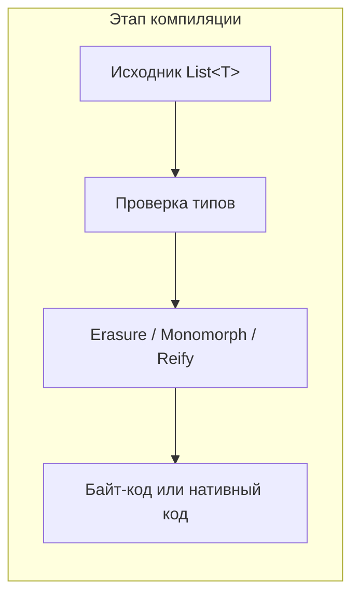

# Обобщения и обобщённое программирование

<div class="article-tags">
  <span class="tag tag-required">ОБЯЗАТЕЛЬНО</span>
  <span class="tag tag-beginner">ДЛЯ НОВИЧКОВ</span>
</div>

<span class="complexity-badge">Разработчику</span>
<span class="complexity-badge">Архитектору</span>
<span class="complexity-badge">Инженеру</span>

**Связано**

- [Полиморфизм](/encyclopedia/4-code-dev/4-08-oop/5) — параметрический вид среди других
- [Коллекции в ООП](/encyclopedia/4-code-dev/4-08-oop/61) — списки и словари с типом элемента
- [Уровни абстракции](./111.md) — обобщённые модели вместо конкретных деталей
- [Типы данных](/encyclopedia/1-basics/1-09-dannye-i-informatsiya/3) · [Типизация](/encyclopedia/1-basics/1-09-dannye-i-informatsiya/4)
- [DRY и принципы проектирования](/encyclopedia/7-project/7-06-proektirovanie-i-arhitektura/design/1112)
- [Программные парадигмы](./1.md) · [Метапрограммирование](./112.md)
- [Алгоритмы](/encyclopedia/4-code-dev/4-01-algoritmy/intro) · [Компиляция](/encyclopedia/4-code-dev/4-02-chto-takoe-kod-i-kak-on-rabotaet/4)

**Маршрут по статье**

1. [Определение](#определение) и [словарь терминов](#словарь-терминов)
2. [Зачем нужны обобщения](#зачем-нужны-обобщения) — три практические причины
3. [Базовые понятия](#базовые-понятия-подробнее) — параметры, ограничения, variance
4. [Классы и методы](#обобщённый-класс-и-обобщённый-метод) — синтаксис и различия
5. [Полиморфизм](#полиморфизм-и-обобщения) и [STL-стиль](#обобщённое-программирование-в-стиле-stl)
6. [Примеры](#примеры-на-практике) — коллекции, алгоритмы, репозитории, async
7. [Реализация в языках](#как-языки-реализуют-обобщения) — erasure, reification, мономорфизация
8. [Язык за языком](#подробнее-по-языкам) — Java, C#, TypeScript, Go, Python, C++, Rust, Swift
9. [Углублённый разбор](#углублённый-разбор-java) по каждому языку
10. [Паттерны, API, тесты](#паттерны-проектирования-и-обобщения) · [FAQ](#частые-вопросы)

---

## Обобщения и обобщённое программирование

### Определение

**Дженерики** (обобщения, **обобщённое программирование**, *generic programming*) — способ описать класс, интерфейс, функцию или метод **один раз**, а затем применять его к **разным типам данных**. Компилятор или статический анализатор проверяет совместимость типов **до запуска** программы.

Представьте коробку, в которую можно положить только то, что вы заранее обозначили на этикетке. Коробка для чисел не примет строку — ошибка всплывёт при сборке проекта, до запуска у пользователя.

```text
КЛАСС Коробка<T>
  поле значение: T
  метод Получить(): T
    вернуть значение
  КОНЕЦ
КОНЕЦ

коробка_чисел := новый Коробка<Число>(42)
коробка_строк := новый Коробка<Строка>("привет")
```

Буква `T` здесь — **параметр типа** (заглушка). При создании `Коробка<Число>` заглушка заменяется на `Число`. Этот шаг называют **инстанцированием** — подстановкой конкретного типа вместо параметра.

Обобщения появились как ответ на практическую боль: библиотеки коллекций и алгоритмов писали заново под каждый тип или опускались до универсального `Object` / `void*`, теряя проверку на этапе компиляции. В [Java 5 (2004)](/encyclopedia/5-languages/5-03-java/11#71-дженерики-generics) синтаксис `<T>` сделал `List<String>` стандартом. В C++ идея шире — [шаблоны](/encyclopedia/5-languages/5-06-cpp/1) с конца 1980-х легли в основу STL. В Go дженерики пришли только в [1.18 (2022)](/encyclopedia/5-languages/5-10-go/31).

<div class="callout callout--info">
  <div class="callout-title">Два разных смысла слова "обобщить"</div>

  <div class="callout-body">
  В ООП "обобщить" иногда значит вынести общие поля в базовый класс — иерархия <code>Animal</code> → <code>Dog</code>. В этой статье речь о <strong>параметризации типа</strong> — запись <code>List&lt;T&gt;</code>, где <code>T</code> подставляется при использовании. Связь с ООП идёт через <a href="/encyclopedia/4-code-dev/4-08-oop/5">полиморфизм</a>, но это отдельный его вид — параметрический.
  </div>
</div>

### Словарь терминов

| Термин | Объяснение |
|--------|------------|
| **Параметр типа** | Имя-заглушка в объявлении (`T`, `K`, `V`, `E`). Буквы условны — `T` от *type*, `K` от *key*, `V` от *value*, `E` от *element* |
| **Аргумент типа** | Конкретный тип при использовании. В `List<int>` аргумент — `int` |
| **Инстанцирование** | Момент, когда `T` становится `int`, `String` или вашим классом `Order` |
| **Безопасность типов** (*type safety*) | Гарантия, что операции выполняются только над совместимыми типами. Подробнее — [типобезопасность](/encyclopedia/1-basics/1-09-dannye-i-informatsiya/4) |
| **Приведение типа** (*casting*) | Явное преобразование `((String) obj)`. Обобщения уменьшают необходимость в нём — см. [преобразование типов в C#](/encyclopedia/5-languages/5-05-csharp/20) |
| **Сырой тип** (*raw type*) | Объявление без аргумента типа — `List` вместо `List<String>`. Остаток кода до Java 5 |
| **Ограничение** (*constraint*, *bound*) | Условие на параметр — `T` должен реализовать интерфейс `Comparable` |
| **Верхняя граница** (*upper bound*) | `T extends Animal` — `T` может быть `Animal` или любым наследником |
| **Нижняя граница** (*lower bound*) | `? super Integer` — подходит `Integer`, `Number`, `Object` |
| **Вывод типов** (*type inference*) | Компилятор сам определяет `T` из контекста — `var list = new ArrayList<>()` |
| **Wildcard** | `?` в Java — "неизвестный" аргумент типа в сигнатуре, часто с `extends` / `super` |
| **Стирание типов** (*type erasure*) | После компиляции информация о `T` исчезает из байт-кода (Java на JVM) |
| **Реификация** (*reification*) | Тип-параметр сохраняется в runtime (C# в CLR) |
| **Мономорфизация** | Компилятор генерирует отдельную версию кода для каждого аргумента типа (Rust, Go, C++) |
| **Bridge method** | Синтетический метод в байт-коде Java для совместимости erasure с переопределением |
| **Reified type** | Тип, доступный в runtime (Kotlin `reified T` в `inline`-функции) |
| **Variance** | Правила подстановки `List<Dog>` там, где ожидают `List<Animal>` |
| **Инвариантность** | Подстановка запрещена — `List<Dog>` нельзя присвоить `List<Animal>` |
| **Ковариантность** | Можно читать как более общий тип (`out` / `? extends`) |
| **Контравариантность** | Можно писать в более общий приёмник (`in` / `? super`) |
| **Trait / концепт** | Набор требований к операциям над `T` (Rust, C++20 concepts, Go constraints) |
| **TypeVar** | В Python — переменная для аннотаций `T = TypeVar("T")` |
| **Utility type** | В TypeScript — преобразование типов `Partial<T>`, `Pick<T, K>` |

### Как называют в разных языках и дисциплинах

- **Дженерики / generics** — Java, C#, Kotlin, Go, TypeScript, Swift
- **Обобщения** — русскоязычные учебники и документация .NET
- **Шаблоны** (*templates*) — C++; механизм богаче по выразительности, сложнее в отладке
- **Параметрический полиморфизм** — термин из [теории типов](https://ru.wikipedia.org/wiki/Полиморфизм_(информатика))
- **Обобщённое программирование** — широкий термин про алгоритмы и структуры, параметризованные типами ([Википедия](https://ru.wikipedia.org/wiki/%D0%9E%D0%B1%D0%BE%D0%B1%D1%89%D1%91%D0%BD%D0%BD%D0%BE%D0%B5_%D0%BF%D1%80%D0%BE%D0%B3%D1%80%D0%B0%D0%BC%D0%BC%D0%B8%D1%80%D0%BE%D0%B2%D0%B0%D0%BD%D0%B8%D0%B5))

---

### Зачем нужны обобщения

#### Безопасность типов

[Статически типизированные](/encyclopedia/1-basics/1-09-dannye-i-informatsiya/4) языки проверяют совместимость типов при компиляции. Обобщения переносят эту проверку на контейнеры и алгоритмы.

Без параметра типа контейнер принимает любой объект. Ошибка "положили строку в список чисел" проявится только при извлечении — в Java это `ClassCastException`, в C# — `InvalidCastException`.

```text
// Сырой контейнер — тип не указан
список := новый Список()
список.добавить(42)
список.добавить("ошибка")         // компилятор пропускает
число := (Число) список.получить(1)  // падение при запуске

// Обобщённый контейнер
список := новый Список<Число>()
список.добавить(42)
список.добавить("ошибка")         // ошибка компиляции
```

Ошибка смещается **ближе к автору** — в IDE и при сборке, а не в логах продакшена. Для команды это означает дешевле ревью и меньше регрессий при рефакторинге.

#### Один алгоритм вместо копий

Принцип [DRY](/encyclopedia/7-project/7-06-proektirovanie-i-arhitektura/design/1112) ("не повторяйся") здесь работает буквально. Сортировка, поиск, кэш, очередь, репозиторий данных описываются один раз и работают с

- целыми числами;
- строками;
- датами;
- вашими моделями `User`, `Order`, `Product`.

Без обобщений остаются два неудобных пути

- копировать функцию под каждый тип (`sortInt`, `sortString`, `sortOrder`);
- опуститься до универсального `object` / `void*` и потерять проверку типов.

Пример дублирования, которое обобщения убирают:

```text
функция НайтиПервыйЧисло(список: Список<Число>): Число?
  // ... 15 строк логики ...
КОНЕЦ

функция НайтиПервуюСтроку(список: Список<Строка>): Строка?
  // ... те же 15 строк, другой тип ...
КОНЕЦ

// С обобщением — одна реализация
функция НайтиПервый<T>(список: Список<T>, предикат: (T) -> Логический): T?
  // ... 15 строк ...
КОНЕЦ
```

#### Меньше приведений типов

Из `List<String>` элемент приходит уже как `String`. Ручные `(String)`, `as string`, `@SuppressWarnings("unchecked")` остаются редким исключением.

Каждое приведение — точка, где программист **обещает** компилятору знать больше, чем тот может проверить. Обобщения переносят это обещание в объявление типа: `List<String>` уже говорит "здесь только строки".

#### Документирование намерений

Сигнатура `Map<UserId, Order>` читается как спецификация

- ключи — идентификаторы пользователей;
- значения — заказы;
- попытка положить `Product` в значение — ошибка компиляции.

Даже без чтения тела функции видно контракт API. Это особенно ценно в [микросервисах](/encyclopedia/8-infra-security/8-05-mikroservisy-i-integratsiya/intro) и публичных библиотеках.

---

### Базовые понятия подробнее

#### Параметр и аргумент типа

**Параметр** объявляется в угловых скобках при описании типа или функции. **Аргумент** подставляется при вызове или создании экземпляра.

```text
// объявление — параметр T
функция Первый<T>(список: Список<T>): T

// использование — аргумент Заказ
результат := Первый<Заказ>(список_заказов)

// вывод типа — аргумент можно опустить
результат := Первый(список_заказов)   // T выводится как Заказ
```

В Java и C# допустим **diamond operator** — `new ArrayList<>()` без повторения типа справа. Компилятор выводит аргумент из левой части присваивания:

```text
список: Список<Строка> = новый МассивСписок<>()
//                              ^^^^^^^^^^^^^^
//                              diamond — тип Строка взят слева
```

**Важно для новичка:** угловые скобки `<>` в современных языках означают именно **типы**, а не сравнение "меньше". В [статье про знаки в коде](/encyclopedia/4-code-dev/4-02-chto-takoe-kod-i-kak-on-rabotaet/6) это разобрано отдельно.

#### Ограничения (constraints)

Параметр `T` без ограничений означает "любой тип". Внутри функции вы не сможете вызвать методы, которых у произвольного типа нет. Ограничение сужает множество допустимых типов и открывает доступ к методам интерфейса.

```text
функция Максимум<T где T : Сравнимый>(a: T, b: T): T
  если a > b
    вернуть a
  иначе
    вернуть b
  конец
КОНЕЦ

функция Вывести<T где T : Выводимый>(значение: T)
  значение.Вывести()
КОНЕЦ

функция Создать<T где T : Сущность, T имеет конструктор()>(ид: Ид): T
  вернуть новый T()
КОНЕЦ
```

Синтаксис ограничений по языкам

| Язык | Пример |
|------|--------|
| C# | `where T : IComparable<T>` · `where T : class, new()` |
| Java | `<T extends Comparable<? super T>>` |
| Rust | `fn f<T: Ord + Clone>(x: T)` |
| Go | `func Min[T cmp.Ordered](a, b T) T` |
| TypeScript | `<T extends { id: string }>` |
| Kotlin | `<T : Comparable<T>>` · `where T : Entity` |

Несколько ограничений можно комбинировать — `T` должен одновременно быть сущностью и поддерживать сравнение.

#### Ковариантность и контравариантность

Если `Dog` наследует `Animal`, логично ожидать, что `List<Dog>` подойдёт туда, где ждут `List<Animal>`. На практике **обобщённые коллекции в Java инвариантны** — такая подстановка запрещена. Иначе в список собак можно было бы незаметно добавить кота через ссылку на `List<Animal>`.

```text
собаки: Список<Dog> = ...
животные: Список<Animal> = собаки   // ОШИБКА в Java

// Если бы компилятор разрешил:
животные.добавить(new Cat())   // в списке собак появился бы кот
```

Три режима variance

| Режим | Смысл | Ключевые слова |
|-------|--------|----------------|
| **Инвариантность** | `List<Dog>` и `List<Animal>` несовместимы | обычный `List<T>` в Java |
| **Ковариантность** | Можно читать как базовый тип, писать нельзя | Kotlin `out`, Java `? extends` |
| **Контравариантность** | Можно принимать базовый тип, отдавать узкий | Kotlin `in`, Java `? super` |

**PECS** (Producer Extends, Consumer Super) — мнемоника для Java

- **Producer** (источник элементов) — `? extends T`
- **Consumer** (приёмник элементов) — `? super T`

```text
// читаем из списка — producer
функция Суммировать(числа: Список<? extends Число>): Число

// пишем в список — consumer
функция ЗаполнитьНулями(список: Список<? super Целое>)
```

Подробности по Kotlin — [generics и variance](/encyclopedia/5-languages/5-09-kotlin/12#обобщённые-типы-generics).

#### Несколько параметров типа

```text
КЛАСС Словарь<K, V>
  метод Получить(ключ: K): V
  метод Записать(ключ: K, значение: V)
КОНЕЦ

функция СоздатьПару<A, B>(первый: A, второй: B): Пара<A, B>
  вернуть новый Пара(первый, второй)
КОНЕЦ

функция Преобразовать<T, R>(список: Список<T>, f: (T) -> R): Список<R>
  результат := новый Список<R>()
  для каждого x в список
    результат.добавить(f(x))
  конец
  вернуть результат
КОНЕЦ
```

`K` и `V` в словаре часто разные. `A` и `B` в паре связывают тип результата с типами аргументов. `T` и `R` в `Преобразовать` связывают тип входного элемента с типом выходного — классический `map` из функционального стиля.

#### Вложенные обобщения

```text
матрица: Список<Список<Число>>   // таблица чисел
кэш: Словарь<Строка, Список<Заказ>>   // ключ → список заказов
опционально: Опционально<Список<T>>   // может не быть списка
```

Читается **изнутри наружу**: `Список<Число>` — список чисел; внешний `Список<...>` — список таких списков.

В TypeScript вложенные generic особенно выразительны — [связанные типы и `infer`](/encyclopedia/5-languages/5-10-typescript/24).

---

### Обобщённый класс и обобщённый метод

Обобщать можно **тип целиком** или **отдельный метод** внутри обычного класса.

#### Обобщённый класс

```text
КЛАСС Стек<T>
  поле элементы: Список<T>

  метод Положить(значение: T)
    элементы.добавить(значение)
  КОНЕЦ

  метод Снять(): T
    вернуть элементы.удалитьПоследний()
  КОНЕЦ
КОНЕЦ

стек_чисел := новый Стек<Число>()
стек_строк := новый Стек<Строка>()
```

Параметр `T` один на весь класс — все методы работают с одним и тем же типом элемента.

#### Обобщённый метод

```text
КЛАСС Утилиты
  // статический обобщённый метод — свой T, независимый от класса
  статический метод ПоменятьМестами<T>(a: Указатель<T>, b: Указатель<T>)
    временный := a.*
    a.* := b.*
    b.* := временный
  КОНЕЦ
КОНЕЦ

x := 1
y := 2
Утилиты.ПоменятьМестами<Число>(ссылка(x), ссылка(y))
```

В Java `Collections.sort(list)` — обобщённый статический метод в классе, который сам не параметризован.

| | Обобщённый класс | Обобщённый метод |
|---|------------------|------------------|
| Где объявлен `T` | В заголовке класса | В заголовке метода |
| Область `T` | Все поля и методы класса | Только этот метод |
| Пример | `ArrayList<E>` | `Collections.sort<T>(list)` |
| Типичная задача | Контейнер с одним типом элемента | Утилита, работающая с любым `T` |

#### Обобщённый интерфейс

```text
ИНТЕРФЕЙС Сравнимый<T>
  метод СравнитьС(другой: T): Целое
КОНЕЦ

ИНТЕРФЕЙС Репозиторий<T где T : Сущность>
  метод Найти(ид: Ид): T?
  метод Сохранить(сущность: T)
КОНЕЦ
```

`Сравнимый<T>` в Java означает "этот объект сравнивается с другими **того же типа** T". `Репозиторий<T>` — контракт доступа к сущностям одного вида.

#### Наследование и обобщения

```text
КЛАСС Животное
  поле кличка: Строка
КОНЕЦ

КЛАСС Питомник<T где T : Животное>
  поле жители: Список<T>

  метод Добавить(животное: T)
    жители.добавить(животное)
  КОНЕЦ
КОНЕЦ

КЛАСС ПитомникСобак РАСШИРЯЕТ Питомник<Dog>
  // T зафиксирован как Dog
КОНЕЦ
```

Подкласс может **зафиксировать** параметр типа (`Питомник<Dog>`) или оставить его свободным.

---

### Полиморфизм и обобщения

[Полиморфизм](https://ru.wikipedia.org/wiki/Полиморфизм_(информатика)) — способность одного интерфейса работать с разными реализациями. В информатике выделяют три часто встречающихся вида.

| Вид | Идея | Пример |
|-----|------|--------|
| **Параметрический** | Код один, тип передаётся параметром | `List<T>`, `fn identity<T>(x: T)` |
| **Подтипы** | Общий базовый тип, разные классы-наследники | `Фигура f = new Круг()` |
| **Ad hoc** | Одно имя, разные наборы параметров (перегрузка) | `сложить(int,int)` и `сложить(String,String)` |

В разговорах про ООП слово "полиморфизм" обычно относится к **подтипам** и переопределению методов ([статья 4.08.05](/encyclopedia/4-code-dev/4-08-oop/5)). Дженерики относятся к **параметрическому** полиморфизму — конкретный тип передаётся в алгоритм параметром, без иерархии наследования.

Три вида **дополняют** друг друга в одном приложении

- `List<Animal>` хранит элементы одного заданного типа (параметрический);
- метод `draw()` вызывается у каждого `Animal`, реализация зависит от `Dog` / `Cat` (подтипы);
- перегрузка `format(Date)` и `format(int)` (ad hoc).

---

### Обобщённое программирование в стиле STL

**Обобщённое программирование как стиль** (библиотека STL в C++, заголовок `<algorithm>`) шире синтаксиса `List<T>` в Java. Алгоритм описывают относительно **возможностей типа**, а не конкретного класса.

Строительные блоки

- **Итератор** — способ обхода элементов без знания внутренней структуры контейнера
- **Компаратор** — правило сравнения двух элементов
- **Trait / концепт** — набор операций, которые тип обязан поддерживать
- **Алгоритм** — `sort`, `find`, `accumulate`, параметризованный итераторами

```text
// Псевдокод в духе STL
функция Сортировать<Итератор где Итератор : Проходимый>(начало, конец: Итератор)
  // сортировка на месте, не зная — vector это или list
КОНЕЦ

функция Накопить<Итератор, T>(начало, конец: Итератор, начальное: T, операция): T
  аккумулятор := начальное
  для каждого x от начало до конец
    аккумулятор := операция(аккумулятор, x)
  конец
  вернуть аккумулятор
КОНЕЦ
```

Тот же принцип в других экосистемах

- C++ — [шаблоны и STL](/encyclopedia/5-languages/5-06-cpp/1)
- Rust — [generics + traits](/encyclopedia/5-languages/5-13-rust/3#13-обобщения-generics), итераторы в `std::iter`
- Java — Streams API поверх `Stream<T>`
- C# — LINQ поверх `IEnumerable<T>`
- Go — пакеты `slices`, `maps` с type parameters ([дженерики в Go](/encyclopedia/5-languages/5-10-go/31))

Связь с [функциональной парадигмой](./1.md#функциональное-программирование) — `map`, `filter`, `reduce` естественно выражаются через `Преобразовать<T, R>` и подобные сигнатуры.

---

### Примеры на практике

#### Коллекции

Первое знакомство с дженериками — типобезопасные контейнеры.

```text
числа := новый Список<Число>()
числа.добавить(1)
числа.добавить(2)

имена := новый Словарь<Строка, Пользователь>()
имена.записать("alice", пользователь)

уникальные_теги := новое Множество<Строка>()
уникальные_теги.добавить("java")
```

Типичные интерфейсы коллекций

| Интерфейс | Роль | Пример аргумента |
|-----------|------|------------------|
| `List<T>` | Упорядоченный список с индексами | `List<Order>` |
| `Set<T>` | Множество без дубликатов | `Set<String>` |
| `Map<K,V>` | Пары ключ-значение | `Map<UserId, User>` |
| `Queue<T>` | Очередь FIFO | `Queue<Task>` |
| `Deque<T>` | Двусторонняя очередь | `Deque<Event>` |

Теория структур

- [Структуры данных — раздел 3.02](/encyclopedia/3-data-markup/3-02-struktury-dannyh/intro)
- [Коллекции в контексте ООП](/encyclopedia/4-code-dev/4-08-oop/61)
- [Коллекции в Java](/encyclopedia/5-languages/5-03-java/24) · [в C#](/encyclopedia/5-languages/5-05-csharp/28)

#### Универсальные алгоритмы

```text
функция Найти<T>(список: Список<T>, предикат: (T) -> Логический): T?
  для каждого элемента в список
    если предикат(элемент)
      вернуть элемент
    конец
  конец
  вернуть пусто
КОНЕЦ

функция Сгруппировать<T, K>(список: Список<T>, ключ: (T) -> K): Словарь<K, Список<T>>
  результат := новый Словарь<K, Список<T>>()
  для каждого элемента в список
    k := ключ(элемент)
    если не результат.содержит(k)
      результат.записать(k, новый Список<T>())
    конец
    результат.получить(k).добавить(элемент)
  конец
  вернуть результат
КОНЕЦ

результат := Найти(заказы, λ o → o.сумма > 1000)
по_статусу := Сгруппировать(заказы, λ o → o.статус)
```

`T` может быть заказом, пользователем или строкой. `K` в группировке — тип ключа (строка статуса, дата, идентификатор). Аналоги в стандартных библиотеках

- Java — `Stream.filter`, `Collectors.groupingBy`
- C# — LINQ `Where`, `GroupBy`
- Python — `filter`, `itertools.groupby` (типы через аннотации)
- Go — `slices.ContainsFunc`, generics-функции в stdlib

См. [алгоритмы — раздел 4.01](/encyclopedia/4-code-dev/4-01-algoritmy/intro).

#### Репозитории и сервисы

```text
ИНТЕРФЕЙС Репозиторий<T где T : Сущность>
  метод НайтиПоИд(ид: Ид): T?
  метод Сохранить(сущность: T)
  метод Удалить(сущность: T)
  метод Все(): Список<T>
КОНЕЦ

КЛАСС РепозиторийЗаказов РЕАЛИЗУЕТ Репозиторий<Заказ>
  // SQL или ORM под капотом
КОНЕЦ

КЛАСС СервисЗаказов
  поле репозиторий: Репозиторий<Заказ>

  метод Оформить(заказ: Заказ)
    репозиторий.Сохранить(заказ)
  КОНЕЦ
КОНЕЦ
```

Паттерн `IRepository<T>` распространён в enterprise-коде на C# и Java. Ограничение `T : Сущность` гарантирует наличие идентификатора и метаданных persistence. Связанные темы — [ORM](/encyclopedia/4-code-dev/4-10-orm-i-rabota-s-dannymi/intro), [зависимости](/encyclopedia/4-code-dev/4-09-zavisimosti/intro).

#### Optional, Result и обёртки

```text
Опционально<T>     // значение может отсутствовать
Результат<T, E>    // успех T или ошибка E
Обещание<T>        // асинхронный результат типа T
```

`Optional<T>`, `Result<T, E>`, `Promise<T>` описывают **форму ответа**, не привязываясь к конкретному содержимому.

```text
функция НайтиПользователя(ид: Ид): Опционально<Пользователь>
  // ...
КОНЕЦ

асинхронная функция ЗагрузитьЗаказы(): Обещание<Список<Заказ>>
  // ...
КОНЕЦ
```

В TypeScript `Promise<User>` связывает async-функцию с типом результата ([async в TS](/encyclopedia/5-languages/5-10-typescript/17)). В Rust — `Option<T>` и `Result<T, E>` встроены в язык ([справочник Rust](/encyclopedia/5-languages/5-13-rust/3)).

#### Фабрики и построители

```text
ИНТЕРФЕЙС Фабрика<T>
  метод Создать(): T
КОНЕЦ

КЛАСС ФабрикаЗаказов РЕАЛИЗУЕТ Фабрика<Заказ>
  метод Создать(): Заказ
    вернуть новый Заказ()
  КОНЕЦ
КОНЕЦ

КЛАСС Построитель<T>
  метод Сбросить(): Построитель<T>
  метод Установить(поле, значение): Построитель<T>
  метод Собрать(): T
КОНЕЦ
```

Generic-фабрики входят в [паттерны GoF](/encyclopedia/7-project/7-06-proektirovanie-i-arhitektura/design-patterns/141) (Factory Method, Builder) и в [DI-контейнеры](/encyclopedia/4-code-dev/4-09-zavisimosti/intro).

#### Кэши и пулы

```text
КЛАСС Кэш<K, V>
  поле хранилище: Словарь<K, V>
  поле максимум: Целое

  метод ПолучитьИлиВычислить(ключ: K, вычислить: () -> V): V
    если хранилище.содержит(ключ)
      вернуть хранилище.получить(ключ)
    конец
    значение := вычислить()
    хранилище.записать(ключ, значение)
    вернуть значение
  КОНЕЦ
КОНЕЦ
```

`K` — тип ключа (строка URL, UUID), `V` — тип значения (объект, JSON-дерево, байты).

#### События и сообщения

```text
ИНТЕРФЕЙС ОбработчикСобытия<T>
  метод Обработать(событие: T)
КОНЕЦ

КЛАСС ШинаСобытий
  поле подписчики: Словарь<Тип, Список<Обработчик>>

  метод Подписать<T>(обработчик: ОбработчикСобытия<T>)
  метод Опубликовать<T>(событие: T)
КОНЕЦ
```

Type-safe event bus в TypeScript разобран в [паттернах TS](/encyclopedia/5-languages/5-10-typescript/28#type-safe-event-bus).

---

### Как языки реализуют обобщения

Все перечисленные языки решают одну задачу — параметризацию типов. Различаются компромиссы между совместимостью со старым кодом, размером бинарника, скоростью и доступом к типу в runtime.

| Язык | Механизм | Что важно знать |
|------|----------|-----------------|
| **Java** | стирание типов | В байт-коде `List<String>` превращается в `List`. Старые JAR без generics продолжают работать. [Типы в Java](/encyclopedia/5-languages/5-03-java/15#обобщения-generics-и-примитивы) |
| **C#** | реификация в CLR | `List<int>` существует в runtime. `where T : IComparable`, рефлексия по `T`. [Обобщения в C#](/encyclopedia/5-languages/5-05-csharp/26) |
| **Kotlin** | erasure на JVM + `reified` | Variance на объявлении (`out`/`in`). [Kotlin generics](/encyclopedia/5-languages/5-09-kotlin/12#обобщённые-типы-generics) |
| **TypeScript** | только compile-time | После компиляции в JS типы исчезают. [Дженерики в TS](/encyclopedia/5-languages/5-10-typescript/24) |
| **Go** | мономорфизация с 1.18 | Отдельные функции под каждый тип при сборке. [Дженерики в Go](/encyclopedia/5-languages/5-10-go/31) |
| **Python** | `typing`, проверка снаружи | `list[int]`, `Generic[T]` — для IDE, mypy, pyright. [Типы](/encyclopedia/5-languages/5-02-python/19) |
| **C++** | шаблоны при компиляции | Максимальная гибкость, длинные ошибки. Concepts с C++20. [О C++](/encyclopedia/5-languages/5-06-cpp/1) |
| **Rust** | generics + traits | Мономорфизация, нулевая стоимость в runtime. [Справочник §13](/encyclopedia/5-languages/5-13-rust/3#13-обобщения-generics) |
| **Swift** | generics + протоколы | Associated types, `where`. [Протоколы](/encyclopedia/5-languages/5-14-swift/13) |

#### Стирание типов

После компиляции информация о `T` **исчезает** из исполняемого кода. Проверки уже выполнены, в runtime остаётся совместимость со старым байт-кодом.

```text
// Исходник
List<String> names = new ArrayList<>();
names.add("Alice");
String s = names.get(0);

// После erasure (логически)
List names = new ArrayList();
names.add("Alice");          // проверка вставлена компилятором
String s = (String) names.get(0);  // скрытое приведение
```

Следствия для Java

- нельзя `new T()`
- нельзя `instanceof List<String>`
- нельзя создать `new T[]`
- примитивы только через обёртки — `List<Integer>`, не `List<int>`
- [bridge methods](https://ru.wikipedia.org/wiki/Generics_in_Java) при переопределении generic-методов

Плюсы — бинарная совместимость с кодом 2003 года. Минусы — ограниченная рефлексия по `T`.

#### Реификация

Тип-параметр **сохраняется** в runtime. CLR знает, что перед вами `List<string>`, а не просто `List`.

```text
List<String>  ──компиляция──►  List`1[[System.String]]
```

Возможности C#

- `typeof(List<int>)` отличается от `typeof(List<string>)`
- `where T : new()` — вызов `new T()`
- `default(T)` для значений по умолчанию
- рефлексия по открытым generic-типам

[Платформа .NET](/encyclopedia/5-languages/5-04-platforma-dotnet/intro) спроектирована с учётом reification с самого начала.

#### Мономорфизация

Компилятор **разворачивает** отдельную специализацию под каждый использованный аргумент типа.

```text
sort<int>     ──компиляция──►  машинный код сравнения int
sort<string>  ──компиляция──►  машинный код сравнения string
```

Плюсы

- нулевая стоимость абстракции в runtime (идеал Rust);
- не нужны boxing-приёмы для примитивов.

Минусы

- дольше сборка;
- больше размер бинарника при многих `T`;
- длинные ошибки в C++ при ошибке в шаблоне.

Связанные темы

- [Компиляция и байт-код](/encyclopedia/4-code-dev/4-02-chto-takoe-kod-i-kak-on-rabotaet/4)
- [Архитектура выполнения](/encyclopedia/4-code-dev/4-06-arhitektura-vypolneniya/intro)
- [История Java 5](/encyclopedia/5-languages/5-03-java/11#71-дженерики-generics)

---

### Подробнее по языкам

#### Java

Синтаксис с [Java 5](/encyclopedia/5-languages/5-03-java/11#71-дженерики-generics). Erasure на JVM — главное ограничение.

```java
List<String> list = new ArrayList<>();
Map<Integer, User> byId = new HashMap<>();
```

Ключевые темы

- wildcards `? extends` / `? super` — [типы в Java](/encyclopedia/5-languages/5-03-java/15#обобщения-generics-и-примитивы)
- примитивы через обёртки `Integer`, `Long`
- `var` и diamond `<>` с Java 10+
- Stream API — `Stream<T>`, `Collectors`

Типичный вопрос на собеседовании — почему `List<Object>` не принимает `List<String>` (инвариантность).

#### C#

Reified generics в CLR — один из самых удобных для прикладного кода вариантов.

```csharp
List<int> numbers = new();
Dictionary<string, Order> orders = new();
```

Возможности

- ограничения `where T : class`, `struct`, `new()`, интерфейсы
- `nullable reference types` вместе с `T?`
- generic-делегаты `Func<T, R>`, `Action<T>`
- LINQ — цепочки над `IEnumerable<T>`

Подробно — [обобщения в C#](/encyclopedia/5-languages/5-05-csharp/26), [коллекции](/encyclopedia/5-languages/5-05-csharp/28).

#### Kotlin

Совместимость с Java erasure, но синтаксис и variance удобнее.

```kotlin
val list: List<String> = listOf("a", "b")
interface Repository<out T>  // ковариантный producer
```

Особенности

- declaration-site variance `out` / `in`
- `reified T` в `inline fun` — тип в runtime внутри inline-тела
- star projection `List<*>` — аналог Java raw с безопасностью
- [reified generics](/encyclopedia/5-languages/5-09-kotlin/17)

#### TypeScript

Generics существуют **только при проверке типов**. В JavaScript после компиляции типов нет.

```typescript
function identity<T>(x: T): T { return x; }
type ApiResponse<T> = { data: T; error?: string };
```

Сильные стороны

- constraints `<T extends HasId>`
- связанные generic — тип поля зависит от ключа
- utility types `Partial<T>`, `Pick<T, K>`, `Record<K, V>`
- conditional types и `infer`

[Дженерики в TypeScript](/encyclopedia/5-languages/5-10-typescript/24) · [утилитарные типы](/encyclopedia/5-languages/5-01-javascript/301#7-утилитарные-типы)

#### Go

До 1.18 — интерфейсы и `interface{}` / `any`. С 1.18 — type parameters.

```go
func Min[T cmp.Ordered](a, b T) T { ... }
type Stack[T any] struct { items []T }
```

Философия — generics для библиотечных алгоритмов, доменная модель на интерфейсах. [Дженерики в Go](/encyclopedia/5-languages/5-10-go/31).

#### Python

Динамическая типизация в runtime. Аннотации — для людей и анализаторов.

```python
from typing import TypeVar, Generic, List

T = TypeVar("T")

class Box(Generic[T]):
    def __init__(self, value: T) -> None:
        self.value = value
```

Инструменты

- `mypy`, `pyright`, `pyre`
- `list[int]` с Python 3.9+
- `Protocol` — структурные ограничения без наследования

[Типы в Python](/encyclopedia/5-languages/5-02-python/19) · [typing](/encyclopedia/5-languages/5-02-python/122#модуль-typing) · [mypy](/encyclopedia/5-languages/5-02-python/21)

#### C++

Шаблоны — основа STL, мощнее и сложнее классических generics.

```cpp
template<typename T>
T max(T a, T b) { return a < b ? b : a; }

template<typename It, typename Cmp>
void sort(It first, It last, Cmp cmp);
```

С C++20 — **concepts** ограничивают `T` декларативно. Ошибки компиляции всё ещё могут быть многостраничными — выносите сложные выражения в именованные alias.

[О C++](/encyclopedia/5-languages/5-06-cpp/1) · [type traits](/encyclopedia/5-languages/5-06-cpp/23)

#### Rust

Generics + traits, мономорфизация, без GC.

```rust
fn largest<T: PartialOrd>(list: &[T]) -> &T { ... }
struct Vec<T> { ... }
```

`Option<T>`, `Result<T, E>`, итераторы `Iterator<Item = T>` — везде generics. [Справочник §13](/encyclopedia/5-languages/5-13-rust/3#13-обобщения-generics).

#### Swift

Протокол-ориентированный стиль + generics.

```swift
func swap<T>(_ a: inout T, _ b: inout T) { ... }
struct Stack<Element> { ... }
```

Associated types в протоколах, `where Element: Comparable`. [Протоколы и generics](/encyclopedia/5-languages/5-14-swift/13).

---

### Производительность и размер кода

| Стратегия | Runtime | Размер бинарника | Время компиляции |
|-----------|---------|------------------|------------------|
| Erasure | Накладные расходы на boxing примитивов | Один класс `List` | Быстрее |
| Reification | Нативные специализации value types в .NET | Отдельные generic-инстансы | Средне |
| Мономорфизация | Оптимальный код под каждый `T` | Рост при многих `T` | Дольше |

Для "горячих" циклов с примитивами в Java иногда используют специализированные библиотеки (`IntArrayList` и т.п.) или массивы `int[]`. В Rust и C++ мономорфизация даёт тот же эффект автоматически.

Связано — [сборка мусора и boxing](/encyclopedia/4-code-dev/4-15-sborka-musora/intro).

---

### Практические правила

- **Параметризуйте алгоритм**, когда его логика одинакова для разных типов — сортировка, поиск, маппинг, очередь, кэш `Кэш<K, V>`.
- **Добавляйте ограничение**, если внутри вызываются методы интерфейса — укажите `T : Comparable`, `T : Entity` или `T : Display` вместо голого `T` без требований.
- **Откладывайте абстракцию**, пока в проекте один конкретный тип. Лишний `Repository<T>` усложняет чтение без выгоды.
- **Указывайте аргумент типа** у коллекций — пишите `List<Order>` вместо сырого `List` в Java или legacy C#.
- **Проверяйте variance**, прежде чем присваивать `List<Dog>` в `List<Animal>`. В Java списки инвариантны; для чтения в Kotlin — `List<out Animal>`.
- **В Python запускайте mypy или pyright** в CI — аннотации сами по себе runtime не защищают.
- **В TypeScript не полагайтесь на типы в runtime** — валидация входа через zod/io-ts при границе API.
- **В C++ выносите сложные шаблоны** в именованные alias и type traits — проще читать ошибки компилятора.

#### Когда обобщение уместно

- один и тот же алгоритм для нескольких типов;
- библиотечный код с публичным API;
- контейнеры и инфраструктурные типы (`Result`, `Page<T>`);
- тестовые фабрики и builders.

#### Когда лучше конкретный тип

- единственный тип в проекте и в обозримом будущем;
- доменная логика, где абстракция скрывает бизнес-правила;
- производительность критична, а специализация проще ручного кода (редко).

<div class="callout callout--tip">
  <div class="callout-title">Первое упражнение</div>

  <div class="callout-body">
  Возьмите задачу "список заказов" или "найти элемент по условию". Перепишите её с параметром типа вместо <code>object</code> или дублирования под <code>int</code> и <code>string</code>. Затем откройте стандартную библиотеку своего языка — <code>java.util.Collections</code>, <code>System.Collections.Generic</code>, <code>std::vector</code>, пакет <code>slices</code> в Go — и найдите объявления generic-типов.
  </div>
</div>

#### Цепочка упражнений

1. `Стек<T>` с `положить` / `снять` на псевдокоде
2. `Найти<T>` с предикатом
3. `Словарь<K,V>` с методом `получитьИлиВычислить`
4. `Репозиторий<T extends Entity>` с заглушкой in-memory
5. Переписать (4) на своём языке по ссылке из [таблицы материалов](#материалы-по-языкам)

---

### История появления обобщений

Идея параметризации типов зрела параллельно с ростом библиотек коллекций и алгоритмов.

| Период | Событие |
|--------|---------|
| 1970-е | ML — параметрический полиморфизм в функциональных языках |
| 1980-е | Ada generics, CLU parameterized clusters |
| 1989–1991 | C++ templates, затем STL (Stepanov) — обобщённые алгоритмы и итераторы |
| До 2004 | Java 1.4 — `Vector`, `Hashtable` хранят `Object`, приведения вручную |
| 2004 | Java 5 — синтаксис `<T>`, erasure ради совместимости байт-кода |
| 2002 | C# 2.0 — generics с reification в CLR |
| 2010-е | Kotlin, Swift — variance и протоколы поверх JVM/LLVM |
| 2015+ | TypeScript — generics для статической проверки JS-кода |
| 2022 | Go 1.18 — generics после долгого периода с интерфейсами и `go generate` |

В Java выбор **erasure** объясняется требованием: старые `.class` без generics должны работать с новым кодом без перекомпиляции ([история Java 5](/encyclopedia/5-languages/5-03-java/11#71-дженерики-generics)). В C# платформа проектировалась заново с reification. В Rust и Go упор на **мономорфизацию** и предсказуемую производительность.

---

### Пошаговый разбор для новичка

Задача: хранить список заказов интернет-магазина и найти заказы дороже 1000.

#### Шаг 1. Без типизации

```text
список := новый Список()           // что угодно
список.добавить(заказ1)
список.добавить("случайная строка")   // компилятор молчит

для i от 0 до список.длина() - 1
  элемент := (Заказ) список.получить(i)   // ClassCastException на строке
  если элемент.сумма > 1000
    // ...
  конец
конец
```

#### Шаг 2. С обобщением

```text
список: Список<Заказ> = новый МассивСписок<>()
список.добавить(заказ1)
список.добавить("случайная строка")   // ошибка компиляции

для каждого заказ в список
  если заказ.сумма > 1000
    // заказ уже типа Заказ, без приведения
  конец
конец
```

#### Шаг 3. Вынос алгоритма

```text
функция Дороже<T где T имеет поле сумма: Число>(список: Список<T>, порог: Число): Список<T>
  результат := новый Список<T>()
  для каждого элемент в список
    если элемент.сумма > порог
      результат.добавить(элемент)
    конец
  конец
  вернуть результат
КОНЕЦ

дорогие := Дороже(список_заказов, 1000)
```

Тот же `Дороже` сработает для `Список<Продукт>` с полем `цена`, если constraint описывает интерфейс `ИмеетЦену`.

Связанные материалы — [перебор коллекций](/encyclopedia/4-code-dev/4-08-oop/61#перебор-элементов), [Lab — коллекции](/lab/Примеры/1131#2-коллекции-и-частоты).

---

### Решения упражнений (псевдокод)

#### Упражнение 1 — `Стек<T>`

```text
КЛАСС Стек<T>
  поле элементы: Список<T> = новый МассивСписок<>()

  метод Положить(значение: T)
    элементы.добавить(значение)
  КОНЕЦ

  метод Снять(): T
    если элементы.пусто()
      бросить ИсключениеПустогоСтека
    конец
    вернуть элементы.удалитьПоследний()
  КОНЕЦ

  метод Верх(): T
    вернуть элементы.получить(элементы.длина() - 1)
  КОНЕЦ

  метод Пусто(): Логический
    вернуть элементы.пусто()
  КОНЕЦ
КОНЕЦ
```

#### Упражнение 2 — `Найти<T>`

```text
функция Найти<T>(список: Список<T>, предикат: (T) -> Логический): Опционально<T>
  для каждого x в список
    если предикат(x)
      вернуть Опционально.из(x)
    конец
  конец
  вернуть Опционально.пусто()
КОНЕЦ
```

#### Упражнение 3 — `получитьИлиВычислить`

```text
КЛАСС Словарь<K, V>
  поле данные: ХешТаблица<K, V>

  метод ПолучитьИлиВычислить(ключ: K, вычислить: (K) -> V): V
    если данные.содержит(ключ)
      вернуть данные.получить(ключ)
    конец
    значение := вычислить(ключ)
    данные.записать(ключ, значение)
    вернуть значение
  КОНЕЦ
КОНЕЦ
```

#### Упражнение 4 — in-memory репозиторий

```text
ИНТЕРФЕЙС Сущность
  свойство Ид: Ид
КОНЕЦ

КЛАСС ПамятьРепозиторий<T где T : Сущность> РЕАЛИЗУЕТ Репозиторий<T>
  поле хранилище: Словарь<Ид, T> = новый ХешТаблица<>()

  метод НайтиПоИд(ид: Ид): T?
    вернуть хранилище.получить(ид)
  КОНЕЦ

  метод Сохранить(сущность: T)
    хранилище.записать(сущность.Ид, сущность)
  КОНЕЦ
КОНЕЦ
```

---

### Паттерны проектирования и обобщения

Обобщения часто встречаются в [паттернах GoF](/encyclopedia/7-project/7-06-proektirovanie-i-arhitektura/design-patterns/141).

#### Strategy

```text
ИНТЕРФЕЙС СтратегияСкидки
  метод Применить(заказ: Заказ): Деньги
КОНЕЦ

КЛАСС КонтекстРасчёта<T где T : Заказ>
  поле стратегия: СтратегияСкидки

  метод Итог(заказ: T): Деньги
    вернуть стратегия.Применить(заказ)
  КОНЕЦ
КОНЕЦ
```

#### Adapter

```text
КЛАСС АдаптерРепозитория<T, DTO>
  поле внутренний: Репозиторий<T>
  поле в_dto: (T) -> DTO
  поле из_dto: (DTO) -> T

  метод Найти(ид: Ид): DTO?
    сущность := внутренний.НайтиПоИд(ид)
    если сущность = пусто
      вернуть пусто
    конец
    вернуть в_dto(сущность)
  КОНЕЦ
КОНЕЦ
```

#### Factory Method

```text
ИНТЕРФЕЙС ФабрикаДокументов<T>
  метод Создать(): T
КОНЕЦ
```

Параметр `T` фиксирует тип продукта фабрики без дублирования иерархий под каждый документ.

---

### REST API и обобщённые ответы

Типичные обёртки HTTP API параметризуют полезную нагрузку.

```text
СТРУКТУРА Ответ<T>
  поле данные: T
  поле ошибка: Опционально<Строка>
  поле мета: Опционально<Мета>
КОНЕЦ

СТРУКТУРА Страница<T>
  поле элементы: Список<T>
  поле всего: Целое
  поле страница: Целое
  поле размер: Целое
КОНЕЦ
```

Клиент TypeScript знает, что `GET /users` возвращает `Ответ<Список<Пользователь>>`, а `GET /users/:id` — `Ответ<Пользователь>`. См. [как работают сайты](/encyclopedia/2-system-network/2-04-kak-rabotayut-sayty-i-veb-sayty/1), [интеграции](/encyclopedia/2-system-network/2-09-osnovy-integratsionnogo-vzaimodeystviya/intro).

---

### Сериализация и JSON

При преобразовании объектов в JSON тип `T` может теряться, если библиотека не знает о generics.

Проблемы

- Java erasure — `List<User>` десериализуется как `List` с `LinkedHashMap` внутри
- TypeScript — типы не существуют в runtime, нужна валидация схемы
- C# — `JsonSerializer.Deserialize<List<User>>` работает благодаря reification

Обходные пути в Java

- передавать `TypeReference<List<User>>` (Jackson)
- `TypeToken<List<User>>` (Gson)
- явный `Class<T>` в фабрике

```text
функция Десериализовать<T>(json: Строка, тип: Класс<T>): T
  // библиотека использует тип в runtime через Class
КОНЕЦ
```

См. [конфигурации и данные](/encyclopedia/3-data-markup/3-04-konfiguratsii-i-dannye/intro).

---

### Зависимости и внедрение (DI)

DI-контейнеры регистрируют открытые generic-типы.

```text
// Псевдокод регистрации
контейнер.зарегистрироватьОткрытый(typeof(Репозиторий<>), typeof(РепозиторийEf<>))
контейнер.зарегистрировать(typeof(СервисЗаказов))
```

При запросе `Репозиторий<Заказ>` контейнер подставляет `РепозиторийEf<Заказ>`. В C# это стандарт ASP.NET Core; в Java — Spring `Repository<T>`. Подробнее — [зависимости](/encyclopedia/4-code-dev/4-09-zavisimosti/intro).

---

### Тестирование обобщённого кода

Принципы

- тестируйте **конкретный инстанс** generic — `Стек<Число>`, `Стек<Строка>`;
- для алгоритмов используйте **property-based** подход — один тест с разными `T`;
- моки интерфейсов `Репозиторий<T>` создаются с тем же `T`, что и продакшен.

```text
тест "Стек возвращает LIFO"
  стек := новый Стек<Целое>()
  стек.положить(1)
  стек.положить(2)
  утвердить стек.снять() == 2
  утвердить стек.снять() == 1
конец

тест "Найти работает для строк и чисел"
  для каждого типа в [Целое, Строка]
    // параметризованный тест фреймворка
  конец
конец
```

См. [тестирование](/encyclopedia/8-infra-security/8-10-testirovanie-na-proniknovenie/intro) (общие принципы качества).

---

### Рефлексия и обобщения

| Язык | Доступ к `T` в runtime |
|------|------------------------|
| Java | Ограничен erasure; `ParameterizedType`, `TypeVariable` |
| C# | Полный — `typeof(T)`, `MakeGenericType` |
| Kotlin | `reified` только в inline; иначе как Java |
| TypeScript | Нет в JS; `typeof` для значений |
| Python | `typing.get_args`, `get_origin` |
| Rust | `TypeId` для конкретных типов, не для параметра |
| Go | `reflect.Type`, generics не расширяют reflect полностью |

Пример Java — узнать аргументы у поля

```java
Field field = ...;
Type type = field.getGenericType();
if (type instanceof ParameterizedType pt) {
    Type[] args = pt.getActualTypeArguments();
}
```

В прикладном коде рефлексия по generics — крайняя мера; предпочтительны явные фабрики и API библиотек сериализации.

---

### Антипаттерны

#### Generic hell

Слишком много параметров `T, U, V, K, R` в одной сигнатуре. Читатель теряет связь между типами.

**Признак** — сигнатура не помещается в одну строку без прокрутки.

**Лечение** — именованные типы-обёртки, промежуточные `record` / `struct`.

#### Object everywhere

```text
функция Обработать(данные: Object): Object   // потеряны generics
```

Возврат к эпохе до Java 5. Замените на `<T> T обработать(T данные)` или конкретный тип.

#### Преждевременный `Repository<T>`

Один тип сущности в микросервисе — `OrderRepository` без параметра читается проще, чем `Repository<Order>` без второго использования `T`.

#### Подавление предупреждений

`@SuppressWarnings("unchecked")` на каждом методе — сигнал, что типы обошли систему. Локализуйте участок и документируйте, почему безопасно.

---

### Справочник ограничений C#

| Ограничение | Смысл |
|-------------|--------|
| `where T : struct` | Только value type |
| `where T : class` | Только ссылочный тип |
| `where T : class?` | Ссылочный, допускает null |
| `where T : notnull` | Не nullable value |
| `where T : new()` | Публичный конструктор без параметров |
| `where T : BaseClass` | Наследник BaseClass |
| `where T : IInterface` | Реализует интерфейс |
| `where T : U` | T наследует другой параметр U |

Комбинации — `where T : class, IDisposable, new()`.

Полный разбор — [обобщения в C#](/encyclopedia/5-languages/5-05-csharp/26).

---

### Справочник wildcards Java

| Запись | Чтение | Запись в коллекцию |
|--------|--------|-------------------|
| `List<?>` | элементы неизвестного типа | только `null` |
| `List<? extends Number>` | числа и подтипы | запрещена (кроме null) |
| `List<? super Integer>` | Integer и любые супертипы | можно add Integer |
| `List<T>` | инвариантно | add T |

Мнемоника **PECS** — [раздел variance](#ковариантность-и-контравариантность) выше.

---

### Обобщения и функциональный стиль

В [функциональной парадигме](./1.md) generic-функции естественно сочетаются с чистыми преобразованиями.

```text
функция Карта<T, R>(список: Список<T>, f: (T) -> R): Список<R>
функция Фильтр<T>(список: Список<T>, p: (T) -> Логический): Список<T>
функция Свернуть<T, R>(список: Список<T>, начало: R, f: (R, T) -> R): R
```

| Операция | Типы | Результат |
|----------|------|-----------|
| `Карта` | `T` → `R` | `Список<R>` |
| `Фильтр` | `T` → Логический | `Список<T>` |
| `Свернуть` | `R` + `T` → `R` | `R` |

В Haskell и ML параметрический полиморфизм — основа языка. В JavaScript без статических типов те же идеи в `array.map` / `filter` / `reduce`; TypeScript добавляет `<T>` к ним ([JS-курс](/encyclopedia/5-languages/5-01-javascript/30)).

---

### Обобщения в стандартных библиотеках

Где искать живые примеры в документации

| Платформа | Типы для изучения |
|-----------|-------------------|
| Java | `java.util.List`, `Optional`, `Stream`, `CompletableFuture` |
| .NET | `List<T>`, `Dictionary<K,V>`, `Task<T>`, `IEnumerable<T>` |
| TypeScript | `Array<T>`, `Promise<T>`, `Record<K,V>` |
| Rust | `Vec<T>`, `Option<T>`, `Result<T,E>`, `Iterator` |
| Go | `slices`, `maps`, `sync.Map` (не generic), generic `min`/`max` |
| C++ | `std::vector<T>`, `std::optional<T>`, `std::variant<T...>` |

Откройте исходник или документацию одного типа и проследите, как объявлен параметр `T` и какие ограничения наложены.

---

### Связь с метапрограммированием

[Метапрограммирование](./112.md) и обобщения пересекаются, но не совпадают.

- **Generics** — параметризация на уровне типов в исходном коде
- **Шаблоны C++** — могут вычислять типы на этапе компиляции (SFINAE, `constexpr`)
- **Макросы Rust** — генерируют код, иногда дублируя роль generics
- **Source Generators C#** — генерируют типобезопасный код из `T` в compile-time

Обобщения — самый безопасный и читаемый уровень; метапрограммирование подключают, когда generics не хватает (генерация бойлерплейта, ORM-маппинг).

---

### Дополнительные вопросы

<div class="faq-item">
  <p class="faq-q"><span class="faq-label">Вопрос.</span> Можно ли использовать примитивы в Java generics?</p>
  <p class="faq-a"><span class="faq-label">Ответ.</span> Только через обёртки — <code>List&lt;Integer&gt;</code>, не <code>List&lt;int&gt;</code>. Boxing добавляет накладные расходы. Для hot-path — массивы <code>int[]</code> или специализированные коллекции — <a href="/encyclopedia/5-languages/5-03-java/15#обобщения-generics-и-примитивы">типы в Java</a>.</p>
</div>

<div class="faq-item">
  <p class="faq-q"><span class="faq-label">Вопрос.</span> Что такое F-bounded polymorphism?</p>
  <p class="faq-a"><span class="faq-label">Ответ.</span> Ограничение вида <code>T extends Comparable&lt;T&gt;</code> — тип сравнивается сам с собой. Встречается в Java для корректного <code>compareTo</code>.</p>
</div>

<div class="faq-item">
  <p class="faq-q"><span class="faq-label">Вопрос.</span> Есть ли generics в JavaScript?</p>
  <p class="faq-a"><span class="faq-label">Ответ.</span> В рантайме JS их нет. TypeScript добавляет синтаксис при компиляции — <a href="/encyclopedia/5-languages/5-10-typescript/intro">TypeScript</a>, <a href="/encyclopedia/5-languages/5-01-javascript/30">JS-курс</a>.</p>
</div>

<div class="faq-item">
  <p class="faq-q"><span class="faq-label">Вопрос.</span> Как generics связаны с null-safety?</p>
  <p class="faq-a"><span class="faq-label">Ответ.</span> В C# 8+ <code>T?</code> для unconstrained T означает nullable reference type. В Kotlin <code>T</code> по умолчанию non-null, если не указан <code>T?</code>. В Java все ссылочные типы в generics допускают null, если не используются аннотации @NonNull.</p>
</div>

<div class="faq-item">
  <p class="faq-q"><span class="faq-label">Вопрос.</span> Влияют ли generics на производительность?</p>
  <p class="faq-a"><span class="faq-label">Ответ.</span> После компиляции — обычно нет (erasure, мономорфизация). Исключение — boxing примитивов в Java и размер бинарника при многих <code>T</code> в Rust/C++. См. <a href="#производительность-и-размер-кода">производительность</a>.</p>
</div>

<div class="faq-item">
  <p class="faq-q"><span class="faq-label">Вопрос.</span> Что читать после этой статьи?</p>
  <p class="faq-a"><span class="faq-label">Ответ.</span> Статью по своему языку из <a href="#материалы-по-языкам">таблицы</a>, затем <a href="/encyclopedia/4-code-dev/4-08-oop/61">коллекции</a> и <a href="/encyclopedia/4-code-dev/4-08-oop/5">полиморфизм</a>.</p>
</div>

---

### Частые ошибки

| Ошибка | Последствие | Решение |
|--------|-------------|---------|
| Сырой `List` без `<T>` | Потеря проверки типов | Всегда указывать аргумент типа |
| `object` / `any` вместо `T` | Те же runtime-ошибки, что у сырого контейнера | Параметр типа и constraint |
| Слишком широкий `T` | Нельзя вызвать нужный метод внутри | `where T : IComparable` и аналоги |
| Игнорирование erasure в Java | `instanceof List<String>` не компилируется | `Class<T>`, фабрики, TypeToken (Gson) |
| Глубокая вложенность шаблонов C++ | Страницы текста в ошибке компилятора | Упростить выражение, concepts, явные типы |
| Аннотации Python без линтера | Ошибки типов только в голове автора | mypy/pyright в CI |
| `List<Animal> animals = dogs` | Логическая дыра в типах | PECS, ковариантные типы только для чтения |
| Generic array `new T[n]` в Java | Ошибка компиляции | `ArrayList`, `(T[]) new Object[n]` с осторожностью |

---

### Частые вопросы

<div class="faq-item">
  <p class="faq-q"><span class="faq-label">Вопрос.</span> Чем дженерики отличаются от наследования?</p>
  <p class="faq-a"><span class="faq-label">Ответ.</span> Наследование связывает <strong>классы</strong> в иерархию — <code>Dog extends Animal</code>. Дженерики параметризуют <strong>тип</strong> внутри одного объявления — <code>List&lt;T&gt;</code>. Подтипы — полиморфизм через переопределение методов; обобщения — через подстановку типа. См. <a href="/encyclopedia/4-code-dev/4-08-oop/5">полиморфизм</a> и <a href="/encyclopedia/4-code-dev/4-08-oop/4">наследование</a>.</p>
</div>

<div class="faq-item">
  <p class="faq-q"><span class="faq-label">Вопрос.</span> Почему нельзя создать массив generic-типа в Java?</p>
  <p class="faq-a"><span class="faq-label">Ответ.</span> Из-за erasure массив в runtime помнит только <code>Object[]</code>, а компилятор думал бы, что это <code>String[]</code> — нарушение типобезопасности. Используйте <code>ArrayList&lt;T&gt;</code> или массивы с осторожным приведением.</p>
</div>

<div class="faq-item">
  <p class="faq-q"><span class="faq-label">Вопрос.</span> Нужны ли дженерики в динамическом Python?</p>
  <p class="faq-a"><span class="faq-label">Ответ.</span> Интерпретатор их игнорирует, но аннотации и <code>Generic[T]</code> помогают IDE, ревью и mypy ловить ошибки до деплоя. В больших кодовых базах это стандарт практики — см. <a href="/encyclopedia/5-languages/5-02-python/101">стиль Python</a>.</p>
</div>

<div class="faq-item">
  <p class="faq-q"><span class="faq-label">Вопрос.</span> Generics в Go — замена интерфейсам?</p>
  <p class="faq-a"><span class="faq-label">Ответ.</span> Нет. Интерфейсы описывают поведение (<code>io.Reader</code>). Generics — алгоритмы над разными типами данных (<code>slices.Contains</code>). В Go оба механизма сосуществуют — <a href="/encyclopedia/5-languages/5-10-go/31">дженерики в Go</a>.</p>
</div>

<div class="faq-item">
  <p class="faq-q"><span class="faq-label">Вопрос.</span> Что такое reified type в Kotlin?</p>
  <p class="faq-a"><span class="faq-label">Ответ.</span> В обычной JVM-функции <code>T</code> стёрт. В <code>inline fun &lt;reified T&gt;</code> компилятор подставляет реальный класс в место вызова, и <code>T::class</code> работает — <a href="/encyclopedia/5-languages/5-09-kotlin/17">reified generics</a>.</p>
</div>

<div class="faq-item">
  <p class="faq-q"><span class="faq-label">Вопрос.</span> Зачем TypeScript generics, если типы всё равно исчезают?</p>
  <p class="faq-a"><span class="faq-label">Ответ.</span> Они защищают на этапе разработки и в CI (<code>tsc</code>). Связь <code>Promise&lt;User&gt;</code> с телом async-функции, type-safe API и автодополнение в IDE — основная ценность — <a href="/encyclopedia/5-languages/5-10-typescript/24">дженерики в TS</a>.</p>
</div>

---

### Материалы по языкам

| Язык | Статья |
|------|--------|
| C# | [Обобщения (generics)](/encyclopedia/5-languages/5-05-csharp/26) |
| Java | [Типы и generics](/encyclopedia/5-languages/5-03-java/15#обобщения-generics-и-примитивы) · [Java 5](/encyclopedia/5-languages/5-03-java/11#71-дженерики-generics) |
| TypeScript | [Дженерики](/encyclopedia/5-languages/5-10-typescript/24) |
| Go | [Дженерики в Go](/encyclopedia/5-languages/5-10-go/31) |
| Python | [Типы](/encyclopedia/5-languages/5-02-python/19) · [модуль typing](/encyclopedia/5-languages/5-02-python/122#модуль-typing) |
| Kotlin | [Обобщённые типы](/encyclopedia/5-languages/5-09-kotlin/12#обобщённые-типы-generics) · [reified](/encyclopedia/5-languages/5-09-kotlin/17) |
| C++ | [Язык C++](/encyclopedia/5-languages/5-06-cpp/1) |
| Rust | [Справочник — generics](/encyclopedia/5-languages/5-13-rust/3#13-обобщения-generics) |
| Swift | [Протоколы и generics](/encyclopedia/5-languages/5-14-swift/13) |

---

### Углублённый разбор Java

#### Type erasure по шагам

Компилятор Java выполняет примерно следующее.

1. Проверяет типы в исходнике (`list.add("x")` в `List<Integer>` — ошибка).
2. Заменяет `T` на границу (обычно `Object` или первый `extends`).
3. Вставляет cast при чтении из generic-контейнера.
4. Генерирует bridge methods, если сигнатура после erasure конфликтует с override.

```text
// Исходник
class StringBox extends Box<String> {
  String get() { ... }
}

// После erasure логически
class StringBox extends Box {
  Object get() { ... }      // bridge
  String get() { ... }      // синтетический мост
}
```

#### Почему нельзя `new T()`

В runtime `T` не существует. Компилятор не знает, какой конструктор вызвать. Обходные пути

- передать `Supplier<T>` / `Factory<T>`;
- передать `Class<T>` и `clazz.getDeclaredConstructor().newInstance()`;
- в Kotlin — `reified T` в inline.

#### Wildcards на практике

```text
// Копировать числа из любого списка числовых типов
функция СкопироватьЧисла(источник: Список<? extends Число>, приёмник: Список<? super Число>)
  для каждого n в источник
    приёмник.добавить(n)
  конец
КОНЕЦ
```

`источник` — producer (`extends`), `приёмник` — consumer (`super`).

#### Совместимость со старым кодом

```text
// Код 2003 года
Список список = новый МассивСписок()
список.добавить("legacy")

// Код 2024 года
Список<Строка> современный = список   // предупреждение unchecked
```

Raw type совместим с любым инстансом — источник предупреждений при смешении эпох.

Материалы — [коллекции Java](/encyclopedia/5-languages/5-03-java/24), [рефлексия](/encyclopedia/5-languages/5-03-java/299).

---

### Углублённый разбор C#

#### Открытые и закрытые constructed types

| Вид | Пример | В runtime |
|-----|--------|-----------|
| Открытый | `List<>` | Описание с параметром |
| Закрытый | `List<int>` | Конкретный тип |
| Открытый generic-метод | `void M<T>(T x)` | Метод с placeholder |

#### Covariance и contravariance в C#

Только для **делегатов и интерфейсов**, не для классов.

```csharp
IEnumerable<string> strings = ...;
IEnumerable<object> objects = strings;   // covariant out

Action<object> actObj = ...;
Action<string> actStr = actObj;          // contravariant in
```

`List<string>` нельзя присвоить `List<object>` — классы инвариантны, как в Java.

#### `default(T)`

Для value type — нули, для reference type — `null`. Удобно в generic-фабриках.

```csharp
T? GetOrDefault<T>(T? value) => value ?? default;
```

#### Generic constraints и nullability

C# 8+ различает `T` (non-null по умолчанию для unconstrained) и `T?`. См. [nullable reference types](/encyclopedia/5-languages/5-05-csharp/intro).

---

### Углублённый разбор TypeScript

#### Связанные generic

```typescript
function getProperty<T, K extends keyof T>(obj: T, key: K): T[K] {
  return obj[key];
}

const name = getProperty(user, "name");   // string
const wrong = getProperty(user, "foo"); // ошибка компиляции
```

Тип `K` сужает допустимые ключи. Тип результата **связан** с ключом.

#### Utility types (краткий обзор)

| Тип | Действие |
|-----|----------|
| `Partial<T>` | Все поля опциональны |
| `Required<T>` | Все поля обязательны |
| `Pick<T, K>` | Подмножество полей |
| `Omit<T, K>` | Исключить поля |
| `Record<K, V>` | Словарь ключ → значение |
| `ReturnType<F>` | Тип возврата функции |

Полный список — [справочник utility types](/encyclopedia/5-languages/5-01-javascript/301#7-утилитарные-типы).

#### Conditional types

```typescript
type IsString<T> = T extends string ? true : false;
```

Используются в библиотечных типах для ветвления по форме `T`. Продвинутый уровень — [дженерики TS](/encyclopedia/5-languages/5-10-typescript/24).

---

### Углублённый разбор Go

#### Constraint interfaces

```go
type Ordered interface {
    ~int | ~float64 | ~string
}
```

`~int` означает "int и именованные типы на базе int".

#### Когда интерфейс, когда generic

| Задача | Механизм |
|--------|----------|
| Разные типы с методом `Read()` | `io.Reader` |
| Минимум двух `Ordered` | `func Min[T Ordered](a, b T) T` |
| Хранение `any` в map | `map[string]any` + type assertion |

#### Пакеты stdlib

- `slices` — `Contains`, `Sort`, `Clone` с type parameters
- `maps` — `Keys`, `Values`, `Clone`
- `cmp` — `Compare`, `Less` для ordered types

[Дженерики в Go](/encyclopedia/5-languages/5-10-go/31) · [интерфейсы](/encyclopedia/5-languages/5-10-go/23).

---

### Углублённый разбор Python

#### TypeVar с ограничениями

```python
from typing import TypeVar

T = TypeVar("T")
Numeric = TypeVar("Numeric", int, float)

def double(x: Numeric) -> Numeric:
    return x * 2
```

#### Protocol — structural subtyping

```python
from typing import Protocol

class Drawable(Protocol):
    def draw(self) -> None: ...

def render(shape: Drawable) -> None:
    shape.draw()
```

Любой класс с методом `draw` подходит, без явного наследования — аналог constraints.

#### Generic классы

```python
from typing import Generic, TypeVar

T = TypeVar("T")

class Stack(Generic[T]):
    def __init__(self) -> None:
        self._items: list[T] = []
```

Проверка — `mypy stack.py`. См. [typing](/encyclopedia/5-languages/5-02-python/122#модуль-typing), [стиль кода](/encyclopedia/5-languages/5-02-python/101).

---

### Углублённый разбор C++

#### Шаблон функции

```cpp
template<typename T>
const T& max(const T& a, const T& b) {
    return a < b ? b : a;
}
```

Каждый вызов с новым `T` — новая функция в объектном файле (мономорфизация).

#### Concepts (C++20)

```cpp
template<std::totally_ordered T>
const T& clamp(const T& v, const T& lo, const T& hi);
```

Ошибка "T не satisfies totally_ordered" понятнее, чем страница SFINAE.

#### Зависимые типы имён

Внутри шаблона `typename T::iterator` может быть типом или значением — ключевое слово `typename` уточняет. Источник путаницы у новичков в шаблонном коде.

[О C++](/encyclopedia/5-languages/5-06-cpp/1) · [type traits](/encyclopedia/5-languages/5-06-cpp/23).

---

### Углублённый разбор Rust

#### Trait bounds

```rust
fn print_debug<T: std::fmt::Debug>(x: T) {
    println!("{:?}", x);
}
```

Несколько bounds — `T: Clone + Send + Sync`.

#### Trait objects и generics

| | `fn f<T: Trait>(x: T)` | `fn f(x: &dyn Trait)` |
|---|------------------------|----------------------|
| Диспетчеризация | Статическая | Динамическая |
| Размер | Известен на compile-time | Указатель + vtable |
| Когда | Hot path, generic код | Heterogeneous коллекции |

#### `impl Trait` в возврате

Скрывает конкретный тип, сохраняя статическую диспетчеризацию.

[Справочник Rust](/encyclopedia/5-languages/5-13-rust/3) · [trait objects](/encyclopedia/5-languages/5-13-rust/11).

---

### Кейс — каталог интернет-магазина

Доменные типы

```text
СТРУКТУРА Товар
  поле ид: Ид
  поле название: Строка
  поле цена: Деньги
КОНЕЦ

СТРУКТУРА Заказ
  поле ид: Ид
  поле позиции: Список<ПозицияЗаказа>
КОНЕЦ
```

Инфраструктура

```text
ИНТЕРФЕЙС Репозиторий<T где T : Сущность>
  метод Все(): Список<T>
  метод Найти(ид: Ид): T?
КОНЕЦ

КЛАСС СервисКаталога
  поле товары: Репозиторий<Товар>

  метод Дорогие(порог: Деньги): Список<Товар>
    вернуть Фильтр(товары.Все(), λ t → t.цена > порог)
  КОНЕЦ
КОНЕЦ

СТРУКТУРА СтраницаТоваров
  поле элементы: Список<Товар>
  поле страница: Целое
  поле всегоСтраниц: Целое
КОНЕЦ
```

API-слой возвращает `Ответ<СтраницаТоваров>`. Слой persistence работает с `Репозиторий<Товар>`. Тесты подменяют `Репозиторий<Товар>` на in-memory реализацию.

Связанные темы — [ORM](/encyclopedia/4-code-dev/4-10-orm-i-rabota-s-dannymi/intro), [веб-разработка](/encyclopedia/4-code-dev/4-17-veb-razrabotka/intro).

---

### Как читать ошибки компилятора

#### Java

`incompatible types: String cannot be converted to Integer` — неверный аргумент в generic-метод.

`type argument X is not within bounds of type-variable T` — нарушено `extends`.

#### C#

`The type 'X' cannot be used as type parameter 'T' in the generic type or method` — constraint не выполнен.

`Cannot convert List<Dog> to List<Animal>` — инвариантность.

#### C++

Ошибка на 50-й строке шаблона часто вызвана проблемой на 10-й. Стратегия

- упростить вызов до минимального примера;
- явно указать `T` вместо вывода;
- вынести сложный тип в `using Alias = ...`.

#### Rust

`the trait bound X: Y is not satisfied` — добавьте trait bound или impl.

`size for values of type dyn Trait cannot be known at compilation time` — нужен `Box<dyn Trait>` или generic.

---

### Сравнение подходов к коллекциям

| Критерий | Java `ArrayList<E>` | C# `List<T>` | Python `list` | Go slice | Rust `Vec<T>` |
|----------|---------------------|--------------|---------------|----------|---------------|
| Тип элемента | generic | generic | аннотация | generic func | generic |
| Примитивы | через обёртки | напрямую | нативно | нативно | нативно |
| Runtime тип | erasure | reified | нет | мономорфизация | мономорфизация |
| Null в элементе | допустим | зависит от T | допустим | zero value | нет null без Option |

---

### Термины теории типов (расширение)

| Термин | Кратко |
|--------|--------|
| **Параметрический полиморфизм** | Один код, тип — параметр |
| **Ad hoc полиморфизм** | Перегрузка по сигнатуре |
| **Полиморфизм подтипов** | Замена подтипом вместо базового |
| **Инвариантность** | Generic-контейнеры не ковариантны по умолчанию |
| **Верхняя граница** | `T extends U` — T — подтип U |
| **Нижняя граница** | `? super T` — принимает супертипы T |
| **Kind** | "Тип типов" — в продвинутых системах (Haskell `* -> *`) |
| **Higher-kinded type** | `F[_]` — контейнер как параметр (Scala, Haskell) |

Для прикладной разработки достаточно первых шести строк; остальное — при изучении [Scala](/encyclopedia/5-languages/5-18-scala/intro) или [Haskell](/encyclopedia/5-languages/5-17-haskell/intro).

---

### Углублённый разбор Kotlin

#### Declaration-site variance

```kotlin
interface Producer<out T> {
    fun produce(): T
}

interface Consumer<in T> {
    fun consume(value: T)
}
```

`out` — ковариантный producer (только отдаёт `T`). `in` — контравариантный consumer (только принимает `T`).

#### Star projection

```kotlin
fun printSizes(list: List<*>) {
    // элементы — неизвестный тип, но list.size доступен
}
```

`List<*>` — "список элементов неизвестного типа", безопаснее Java raw `List`.

#### Reified generics

```kotlin
inline fun <reified T> Gson.fromJson(json: String): T =
    gson.fromJson(json, T::class.java)
```

Компилятор подставляет реальный класс в каждое место вызова inline-функции. Без `inline` + `reified` на JVM — только erasure.

[Обобщённые типы](/encyclopedia/5-languages/5-09-kotlin/12#обобщённые-типы-generics) · [конструкции Kotlin](/encyclopedia/5-languages/5-09-kotlin/17).

---

### Углублённый разбор Swift

#### Generic struct и class

```swift
struct Stack<Element> {
    private var items: [Element] = []
    mutating func push(_ item: Element) { items.append(item) }
    mutating func pop() -> Element { items.removeLast() }
}
```

#### Where clauses

```swift
func sorted<C: Collection>(_ collection: C) -> [C.Element]
    where C.Element: Comparable {
    return collection.sorted()
}
```

#### Associated types в протоколах

```swift
protocol Container {
    associatedtype Item
    mutating func append(_ item: Item)
    var count: Int { get }
}
```

`Item` — тип, который определяет конкретная реализация. Связь с generics — протокол параметризует логику, associated type фиксирует элемент.

[Протоколы Swift](/encyclopedia/5-languages/5-14-swift/13) · [ООП в Swift](/encyclopedia/5-languages/5-14-swift/102).

---

### Схема проверки типов



На этапе **CHECK** компилятор отклоняет `list.add("строка")` для `List<Integer>`. На этапе **ERASE** выбирается стратегия языка — стирание, реификация или копии под каждый `T`.

---

### Чек-лист перед code review

- [ ] У всех коллекций указан аргумент типа
- [ ] Нет лишних `@SuppressWarnings("unchecked")` / `as any`
- [ ] Ограничения `T` соответствуют вызываемым методам
- [ ] Wildcards / variance применены по PECS там, где передаём коллекции
- [ ] Python — типы проверяются в CI (mypy/pyright)
- [ ] TypeScript — границы API валидируются, не только типы
- [ ] Публичный generic API документирован — что такое `T`, `K`, `V`
- [ ] Тесты покрывают как минимум два разных аргумента типа для универсальных алгоритмов

---

### Дополнительные материалы

**Книги и стандарты**

- Java Generics and Collections (Bloch, Goetz) — erasure и коллекции
- Effective C++ (Meyers) — шаблоны и STL
- Rust Book — chapter on generics and traits

**Википедия**

- [Обобщённое программирование](https://ru.wikipedia.org/wiki/%D0%9E%D0%B1%D0%BE%D0%B1%D1%89%D1%91%D0%BD%D0%BD%D0%BE%D0%B5_%D0%BF%D1%80%D0%BE%D0%B3%D1%80%D0%B0%D0%BC%D0%BC%D0%B8%D1%80%D0%BE%D0%B2%D0%B0%D0%BD%D0%B8%D0%B5)
- [Полиморфизм в информатике](https://ru.wikipedia.org/wiki/Полиморфизм_(информатика))

**В энциклопедии**

- [Инкапсуляция](/encyclopedia/4-code-dev/4-08-oop/3) — границы типов в API класса
- [Абстракция](/encyclopedia/4-code-dev/4-08-oop/2) — скрытие деталей реализации
- [Рефакторинг](/encyclopedia/4-code-dev/4-02-chto-takoe-kod-i-kak-on-rabotaet/612) — выделение generic-методов
- [Выбор языка](/encyclopedia/5-languages/kak-vybrat-yazyk-programmirovaniya) — где generics важнее

---

### Миграция с legacy-кода на обобщения

Типичный путь в Java-проектах, написанных до 2004 года или с унаследованными API.

#### Этап 1. Сырые коллекции

```text
Список заказы = новый МассивСписок()
заказы.добавить(получитьЗаказ())
Заказ z = (Заказ) заказы.получить(0)
```

Риск — `ClassCastException`, нет подсказок IDE.

#### Этап 2. Добавление generic без изменения логики

```text
Список<Заказ> заказы = новый МассивСписок<>()
заказы.добавить(получитьЗаказ())
Заказ z = заказы.получить(0)
```

Минимальное изменение — указать тип в объявлении и убрать cast.

#### Этап 3. Обобщение методов

```text
// Было
функция НайтиЗаказ(список: Список, ид: Ид): Заказ
  для каждого o в список
    если ((Заказ)o).ид = ид
      вернуть (Заказ)o
    конец
  конец
КОНЕЦ

// Стало
функция НайтиПоИд<T где T : Сущность>(список: Список<T>, ид: Ид): T?
  для каждого o в список
    если o.ид = ид
      вернуть o
    конец
  конец
  вернуть пусто
КОНЕЦ
```

#### Этап 4. Обобщение интерфейсов

```text
// Было — отдельный репозиторий под каждую сущность
ИНТЕРФЕЙС РепозиторийЗаказов
  метод Найти(ид: Ид): Заказ
КОНЕЦ

ИНТЕРФЕЙС РепозиторийПользователей
  метод Найти(ид: Ид): Пользователь
КОНЕЦ

// Стало
ИНТЕРФЕЙС Репозиторий<T где T : Сущность>
  метод Найти(ид: Ид): T?
КОНЕЦ
```

#### Совместимость при миграции

Старый байт-код вызывает новый generic API через bridge methods и raw types. Новый код не должен принимать raw types в публичном API. Стратегия

- включить предупреждения компилятора об unchecked;
- мигрировать модуль за модулем;
- покрыть тестами критичные пути до замены cast.

См. [основы Git](/encyclopedia/4-code-dev/4-13-osnovy-raboty-s-git/intro) для поэтапных коммитов рефакторинга.

---

### Scala и Haskell (кратко)

В языках с сильной теорией типов generics — норма, а не дополнение.

**Scala** — JVM, erasure как в Java, но богатый синтаксис

- `class Box[A]`
- higher-kinded types `F[_]` в библиотеках (Cats, ZIO)
- implicits / given для type classes

[Scala — intro](/encyclopedia/5-languages/5-18-scala/intro)

**Haskell** — параметрический полиморфизм в основе

```haskell
map :: (a -> b) -> [a] -> [b]
```

Тип `a` и `b` — параметры на уровне функции. Ошибки несовместимости — на этапе компиляции GHC.

[Haskell](/encyclopedia/5-languages/5-17-haskell/intro)

Для большинства прикладных задач на JVM, .NET или в веб-стеке достаточно материалов по Java, C#, TypeScript выше. Scala и Haskell полезны как **расширение кругозора** после освоения базовой статьи.

---

### Обобщения в контрактах и микросервисах

В распределённых системах тип `T` часто живёт только в коде клиента и сервера, а по сети идёт JSON.

```text
// Клиент (TypeScript)
тип ОтветПользователя = Ответ<Пользователь>
запрос(): Обещание<ОтветПользователя>

// Сервер (C#)
Task<ActionResult<UserDto>> GetUser(Guid id)

// Проверка на границе
валидатор.проверить(json, СхемаПользователя)
```

Роли generic-слоёв

- **внутри процесса** — `Repository<T>`, `List<T>`, type-safe шина событий;
- **на границе HTTP** — DTO + схема (OpenAPI, JSON Schema);
- **между сервисами** — контракт версионируется отдельно от `T` в коде.

OpenAPI Generator создаёт `List<User>` на клиенте из описания API. Generic в исходниках и контракт API — связанные, но не идентичные уровни.

См. [микросервисы](/encyclopedia/8-infra-security/8-05-mikroservisy-i-integratsiya/intro), [интеграции](/encyclopedia/2-system-network/2-09-osnovy-integratsionnogo-vzaimodeystviya/intro).

---

### Таблица «когда что применять»

| Ситуация | Рекомендация |
|----------|--------------|
| Список однотипных объектов | `List<T>` / `Vec<T>` / `[]T` |
| Кэш по строковому ключу | `Map<string, T>` / `Dict<K,V>` |
| Универсальная сортировка | generic-функция + `Comparable` / `Ordered` |
| Разные типы с общим интерфейсом | интерфейс + подтипы (ООП) |
| Разные типы, общий алгоритм без иерархии | generic + constraint |
| Тип заранее неизвестен, рефлексия | `any` / `interface{}` — последний resort |
| Десериализация JSON в `List<T>` | `TypeToken` / `TypeReference` / валидация схемы |
| Публичная библиотека | generics + документированные bounds |
| Внутренний скрипт на 50 строк | конкретные типы допустимы |

---

### Повторение и закрепление

**Параметр типа** — заглушка `T` в объявлении. **Аргумент типа** — конкретный тип при использовании (`Order` в `List<Order>`).

**Три причины использовать обобщения**

- безопасность типов на этапе компиляции;
- один алгоритм для многих типов (DRY);
- меньше ручных приведений.

**Три вида полиморфизма** — параметрический (generics), подтипы (наследование), ad hoc (перегрузка).

**Три стратегии runtime**

- стирание (Java);
- реификация (C#);
- мономорфизация (Rust, Go, C++).

**Variance**

- инвариантность — `List<Dog>` нельзя в `List<Animal>`;
- ковариантность — чтение (`extends` / `out`);
- контравариантность — запись (`super` / `in`);
- PECS в Java — producer extends, consumer super.

**Ограничения** — сужают `T` и дают вызывать методы интерфейса внутри generic-кода.

**Сырой тип** — `List` без `<T>`; избегать в новом коде.

**Reified** — тип в runtime (C# всегда, Kotlin в `inline reified`).

**Практика**

- начните со `Стек<T>` и `List<T>`;
- откройте stdlib своего языка;
- прочитайте статью по языку из [таблицы](#материалы-по-языкам);
- пройдите [коллекции в ООП](/encyclopedia/4-code-dev/4-08-oop/61) и [полиморфизм](/encyclopedia/4-code-dev/4-08-oop/5).

---

### Шпаргалка синтаксиса

| Конструкция | Java | C# | TypeScript | Go | Rust | Kotlin | Python |
|-------------|------|-----|------------|-----|------|--------|--------|
| Класс | `class Box<T>` | `class Box<T>` | `class Box<T>` | `type Box[T any] struct` | `struct Box<T>` | `class Box<T>` | `class Box(Generic[T])` |
| Метод | `<T> T id(T x)` | `T Id<T>(T x)` | `function id<T>(x: T)` | `func Id[T any](x T) T` | `fn id<T>(x: T) -> T` | `fun <T> id(x: T): T` | `def id(x: T) -> T` |
| Ограничение | `<T extends Comparable<T>>` | `where T : IComparable<T>` | `<T extends { id: string }>` | `[T cmp.Ordered]` | `T: Ord + Clone` | `<T : Comparable<T>>` | `T = TypeVar("T", bound=...)` |
| Wildcard / variance | `? extends T` | `out T` в интерфейсе | — | — | trait bounds | `out T` / `in T` | `Covariant` (редко) |
| Создание | `new ArrayList<>()` | `new List<int>()` | `new Array<T>()` | `Stack[int]{}` | `Vec::<T>::new()` | `mutableListOf<T>()` | `list[T]()` |
| Reified / runtime T | `Class<T>` | `typeof(T)` | нет в JS | reflect | `TypeId` | `reified T` inline | `get_args` |

---

### Итог

Обобщения дают один типобезопасный шаблон вместо множества копий под каждый тип. Ошибки несовместимости ловятся при компиляции или статическом анализе. Это **параметрический полиморфизм** — рядом с полиморфизмом подтипов и перегрузкой, но отдельный инструмент. Синтаксис и поведение в runtime зависят от языка; детали — в разделах [по языкам](#подробнее-по-языкам) и [таблице материалов](#материалы-по-языкам).
