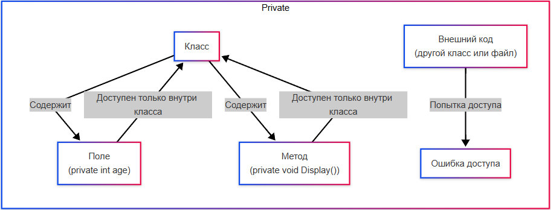
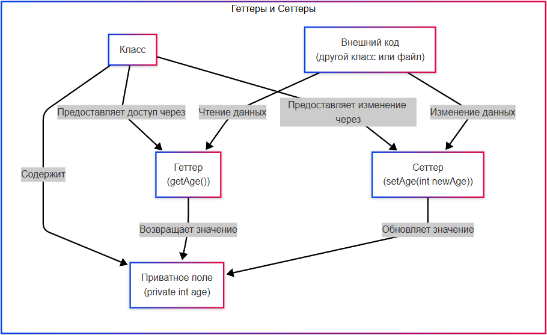

# Инкапсуляция - защита внутреннего состояния объекта

<div class="article-tags">
  <span class="tag tag-required">ОБЯЗАТЕЛЬНО</span>
  <span class="tag tag-beginner">ДЛЯ НОВИЧКОВ</span>
</div>

<span class="complexity-badge">Разработчику</span>
<span class="complexity-badge">Аналитику</span>
<span class="complexity-badge">Тестировщику</span>  
<span class="complexity-badge">Архитектору</span>
<span class="complexity-badge">Инженеру</span>

## Инкапсуляция

### Что такое инкапсуляция?

★ **Инкапсуляция** – скрытие данных объекта от внешнего доступа и управление доступом к ним через методы. Скрывает внутреннюю реализацию объекта, предоставляя контролируемый доступ к его данным через публичные методы (геттеры/сеттеры). Это предотвращает прямое изменение данных и обеспечивает их целостность. Можно выделить класс в отдельный файл, и при помощи средств инкапсуляции обратиться к нему из другого файла, структурировав код.

Классы могут быть как в одном файле, так и в разных файлах. Представим, что у нас есть два класса:
	- Класс1.cs (Класс1.java или Класс1.py - зависит от языка);
	- Класс2.cs.
	
В каждом классе находится свой класс. Например, вот так выглядит Класс1.cs:
```java
public class Класс1 {
    public string публичноеПоле = "Привет!";
    private string приватноеПоле = "Это секрет!";

    public void публичныйМетод() {
        вывод("Это публичный метод.");
    }

    private void приватныйМетод() {
        вывод("Это приватный метод.");
    }
}
```

Получается, класс содержит два поля и два метода.

Из второго файла, Класс2.cs, мы можем обращаться к элементам Класс1.cs, обращаясь по имени, словно по адресу. Чтобы обратиться к элементу (полю, методу и свойству) другого класса, мы используем точку (.) — это универсальный способ во всех языках.
```
Класс1 объект = new Класс1();
вывод(объект.публичноеПоле); // Обращение к полю
объект.публичныйМетод();     // Вызов метода
```
Здесь мы создаём экземпляр объекта (чтобы выделить память), обращаемся к полю и вызываем метод. 

И вот так выглядит файл Класс2.cs:
```java
public class Класс2 {
    public void использоватьКласс1() {
        Класс1 объект = new Класс1();

        // Попробуем обратиться к элементам Класс1
        вывод(объект.публичноеПоле); // Работает
        объект.публичныйМетод();     // Работает

        // Попробуем обратиться к приватным элементам
        вывод(объект.приватноеПоле); // Ошибка: недоступно
        объект.приватныйМетод();     // Ошибка: недоступно
    }
}
```

В нашем случае, если мы обращаемся к публичному свойству, полю или методу - мы получаем значение (или выполняем логику метода), но если обращаемся к приватному - получаем ошибку - доступа к элементу нет.

Такой доступ определён модификатором. Именно он определяет, можно ли использовать из других файлов соответствующий элемент.

---

## Модификаторы доступа


★ **Модификаторы доступа** - ключевой механизм инкапсуляции. Они определяют уровень видимости атрибутов и методов класса. Они позволяют контролировать, кто может обращаться к этим элементам. Пишутся они в начале объявления элемента (класса, метода, свойства, поля) по шаблону:
`<модификатор>` `<тип>` `<название>`
Пример:
```java
public int age; // Модификатор доступа: public, тип: int, название: age
```

Если модификатор не указан, используется стандартный по умолчанию (private для полей в C#, default в Java). В C++ модификаторы доступа указываются внутри класса в виде блоков, а не перед каждым элементом. В большинстве языков программирования рекомендуется явно указывать модификатор доступа для всех элементов, чтобы избежать путаницы с модификаторами по умолчанию.


---

Количество модификаторов зависит от языка программирования. Например, в C# и Java их четыре.

### public

**public** - доступен всем - внутри класса, вне класса, в других пакетах и сборках.
```java
public class Класс1 {
    public string имя = "Анна";
}

public class Класс2 {
    public void использоватьКласс1() {
        Класс1 объект = new Класс1();
        вывод(объект.имя); // Выведет: Анна
    }
}
```
Схематично работу модификатора Public можно представить так:


---

### private


**private** - доступен только внутри класса.
```java
public class Класс1 {
    private string пароль = "12345";

    public string получитьПароль() {
        return пароль; // Доступ внутри класса
    }
}

public class Класс2 {
    public void использоватьКласс1() {
        Класс1 объект = new Класс1();
        вывод(объект.пароль); // Ошибка: недоступно
        вывод(объект.получитьПароль()); // Выведет: 12345
    }
}
```

Схематично работу защищённых элементов можно представить так:



---

### protected

**protected** - доступен внутри класса и его наследников.

```java
public class Класс1 {
    protected string секрет = "Только для наследников";
}

public class Класс2 : Класс1 { // Наследник Класс1
    public void показатьСекрет() {
        вывод(секрет); // Выведет: Только для наследников
    }
}

public class Класс3 {
    public void использоватьКласс1() {
        Класс1 объект = new Класс1();
        вывод(объект.секрет); // Ошибка: недоступно
    }
}
```
Кто такие наследники - поговорим отдельно.

---

### internal и default

**internal** (C#) или **default** (Java) - доступен внутри текущей сборки/пакета.

```csharp
internal class Класс1 { // C#
    public string имя = "Анна";
}

public class Класс2 { // В другой сборке
    public void использоватьКласс1() {
        Класс1 объект = new Класс1(); // Ошибка: недоступно
    }
}
```

---

## Доступ

### Приватные поля

★ **Приватные поля** — это атрибуты класса, доступные только внутри самого класса. 

Пример:
```java
class User {
    private string password; // Приватное поле

    public void setPassword(string newPassword) {
        if (newPassword.Length >= 8) {
            password = newPassword;
        } else {
            throw new Exception("Пароль слишком короткий!");
        }
    }
}
```

Здесь поле password защищено от прямого доступа, и его можно изменить только через метод setPassword, который будет являться сеттером.


---

### Контролируемый доступ

Публичные методы предоставляют контролируемый доступ к приватным полям:
	- **Геттер (getter)** - метод для чтения значения;
	- **Сеттер (setter)** - метод для установки значения.

Таким образом, само поле защищается от доступа через User.password, но доступно при вызове метода setPassword.


---

Приватные поля нельзя напрямую изменять извне класса - только через геттеры и сеттеры.

```java
public class Класс1 {
    private string имя;

    public string получитьИмя() { // Геттер
        return имя;
    }

    public void установитьИмя(string новоеИмя) { // Сеттер
        если (новоеИмя != "") {
            имя = новоеИмя;
        } иначе {
            вывод("Имя не может быть пустым!");
        }
    }
}

public class Класс2 {
    public void использоватьКласс1() {
        Класс1 объект = new Класс1();
        объект.установитьИмя("Анна");
        вывод(объект.получитьИмя()); // Выведет: Анна
    }
}
```

---

Пример сеттеров и геттеров:

```csharp
class User {
    private string name;

    public string getName() { // Геттер
        return name;
    }

    public void setName(string newName) { // Сеттер
        if (!string.IsNullOrEmpty(newName)) {
            name = newName;
        } else {
            throw new Exception("Имя не может быть пустым!");
        }
    }
}

```

Тут name является private и недоступно для изменения, однако можно получить его значение, вызвав геттер-метод getName(), а для установки значения - вызвав сеттер setName.

---

Схематично геттеры и сеттеры работают так:



Свойства как раз представляют собой механизм управления доступом к полям, который объединяет геттеры и сеттеры в одно целое, что и упрощает работу с данными. Свойство пишется по формату:
 
---

Пример:
```java
class User {
    private string name;

    public string Name { // Свойство
        get { return name; }
        set {
            if (!string.IsNullOrEmpty(value)) {
                name = value;
            } else {
                throw new Exception("Имя не может быть пустым!");
            }
        }
    }
}
```
Есть механизм автоматических свойств, который упрощает написание кода, когда логика доступа простая, в таком случае компилятор автоматически создаёт приватное поле и реализует геттер и сеттер:
```java
class User {
    public string Name { get; set; } // Автоматическое свойство
}
```

---

### Иммутабельность

Объекты могут быть **иммутабельными (неизменяемыми)** - их состояние нельзя изменить после создания. Это достигается за счёт использования только приватных полей и отсутствия сеттеров (ведь сеттер используется для изменения). Пример:

```csharp
class ImmutableUser {
    public string Name { get; } // Только для чтения
    public int Age { get; }

    public ImmutableUser(string name, int age) {
        Name = name;
        Age = age;
    }
}
```

---

Здесь Name имеет только геттер get, что не позволит установить ему значения - сеттера просто нет.

---

## Применение инкапсуляции

**Где можно применять такие инструменты?**
	- Безопасность данных - защита паролей, личных данных пользователей. К примеру, в банковском приложении можно сделать доступным баланс пользователя только через методы.
	- Управление состоянием объекта — это гарантирует, что данные всегда находятся в допустимом состоянии, допустим путём установки запрета на установку отрицательного возраста.
	- Сокрытие реализации - пользователь класса не должен знать, как работает внутренняя логика. 

---

**Важно**: инкапсуляция и сокрытие - не одно и то же. Сокрытие данных — это механизм, который делает данные недоступными для внешнего кода за счёт использования модификаторов доступа private или protected - для обеспечения безопасности данных, подразумевая невозможность доступа (фокус на безопасности). Инкапсуляция же подразумевает обеспечение целостности объекта за счёт объединения данных (атрибутов) и методов работы с ними в единый объект (фокус на контролируемом доступе и целостности). То есть, сокрытие - более узкое понятие.

Может возникнуть вопрос - а зачем инкапсуляция нужна, если программист может делать все элементы публичными, а приватными просто закрывает их?

---

Давайте закрепим практическим применением инкапсуляции.

1. Инкапсуляция защищает от ошибок внутри команды. Программисты — это люди, и они могут допускать ошибки. Инкапсуляция помогает избежать случайных изменений данных, которые могут привести к непредсказуемым последствиям. Допустим, другой программист не сможет установить некорректное значение для баланса, если он не может быть отрицательным - IDE предупредит и выдаст ошибку.
2. Инкапсуляция помогает поддерживать целостность системы. Когда данные защищены (private), их можно изменять только через определённые методы. Это позволяет добавлять проверки, логику и обработку ошибок. К примеру, можно добавить проверку, что возраст пользователя всегда положителен - и никто не сможет установить его в отрицательном значении и не нарушит логику работы команды.
3. Инкапсуляция делает код более безопасным для будущих изменений. Если сделать все поля public, то любое изменение внутренней реализации класса потребует изменения всего кода, который использует этот класс. Инкапсуляция скрывает детали реализации, позволяя изменять их без влияния на внешний код. К примеру, мы храним баланс в виде числа. И если позже мы решим хранить баланс в виде строки (например, для форматирования), внешний код не заметит изменений, потому что интерфейс остался неизменным - мы как вызывали «получитьБаланс()», так и будем вызывать, а что за тип у поля - не узнаем, так как метод публичный, а поле - приватное:
```csharp
класс БанковскийСчёт {
    private double баланс;

    public double получитьБаланс() {
        return баланс;
    }
}
```
4. Инкапсуляция помогает предотвратить злоупотребления, задавая правила игры «не трогай эти данные напрямую, используй интерфейс». Если видим, что поле private, значит автор класса не хочет, чтобы вы изменяли эти данные напрямую — это сигнал - «используй геттеры и сеттеры, потому что здесь может быть дополнительная логика».
5. Инкапсуляция упрощает тестирование и отладку. Когда данные защищены, мы точно знаем, какие методы могут изменять состояние объекта, что упрощает поиск ошибок и тестирование. К примеру, если поле баланс публичное, мы не сможем отследить, кто и когда его изменил. Если же доступ к нему только через методы, можно добавить логирование:
```java
public void установитьБаланс(double новыйБаланс) {
    если (новыйБаланс >= 0) {
        вывод("Баланс изменён с " + баланс + " на " + новыйБаланс);
        баланс = новыйБаланс;
    } иначе {
        вывод("Ошибка: попытка установить отрицательный баланс.");
    }
}
```
6. Инкапсуляция помогает создавать переиспользуемые компоненты. Можно создать какую-то сложную логику сохранения файла, но спрятать её в класс, оставив публичным метод, что спрячет её «под капотом», и другие смогут использовать этот класс, не зная, как именно реализованы методы.

---
