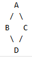

---
title: Наследование - повторное использование и иерархия типов
tags: [beginner, advanced, required, engineer, developer, architector]
description: Процесс создания нового типа данных на основе существующего.
---

# Наследование - повторное использование и иерархия типов

<div class="article-tags">
  <span class="tag tag-required">ОБЯЗАТЕЛЬНО</span>
  <span class="tag tag-beginner">ДЛЯ НОВИЧКОВ</span>
  <span class="tag tag-advanced">НЕ ДЛЯ НОВИЧКОВ</span>
  <span class="tag tag-inprogress">В РАЗРАБОТКЕ</span>
</div>
<span class="complexity-badge">Разработчику</span>
<span class="complexity-badge">Аналитику</span>
<span class="complexity-badge">Тестировщику</span>  
<span class="complexity-badge">Архитектору</span>
<span class="complexity-badge">Инженеру</span>

## Наследование

### Что такое наследование?

★ **Наследование** – создание новых классов (типов объектов) на основе существующих, наследуя их свойства и методы. Позволяет создавать новый класс (подкласс) на основе существующего (родительского), перенимая его свойства и методы. Это уменьшает дублирование кода и упрощает его поддержку.

К примеру, у нас есть несколько классов, которые имеют общие атрибуты или методы - можно не дублировать их в каждом. а вынести в базовый класс. Подклассы будут наследовать эти общие элементы. И вместо того, чтобы писать одинаковый код для разных классов - используется наследование.


---

### Базовый класс


★ Базовый класс (суперкласс) — это класс, который предоставляет свои свойства или методы для наследования. Он описывает общие характеристики и поведение, которые могут быть полезны для подклассов.

---

Пример:

```java
класс Транспорт {
    строка модель;
    целое год;

    метод запустить() {
        вывод("Транспорт запущен.");
    }
}
```
Здесь класс Транспорт является базовым классом. Он содержит общие атрибуты (модель, год) и метод (запустить()).

---

### Подкласс

**Производный класс (или подкласс)** — это класс, который наследует свойства и методы базового класса. Подкласс может использовать унаследованные элементы «как есть», добавлять новые элементы или переопределять унаследованные методы.


Пример:

```java
класс Автомобиль : Транспорт { // Наследование от Транспорт
    целое количество_колёс;

    метод ехать() {
        вывод("Автомобиль едет.");
    }

    метод запустить() { // Переопределение метода
        вывод("Автомобиль запущен!");
    }
}
```

Здесь класс Автомобиль наследует модель, год и метод запустить() от класса Транспорт. Также он добавляет поле количество_колёс и метод ехать(), и кроме этого - переопределяет метод запустить().

---

### Интерфейс

★ **Интерфейс** — это набор методов, которые должны быть реализованы в классах, использующих этот интерфейс, и интерфейсы не содержат реализации методов. Они используются для определения «контракта», которому должны следовать классы.

Пример:

```java
интерфейс Запускаемый {
    метод запустить();
}

класс Автомобиль : Запускаемый {
    метод запустить() {
        вывод("Автомобиль запущен.");
    }
}
```

Здесь класс Автомобиль реализует интерфейс Запускаемый и обязан реализовать метод запустить().

Абстрактный класс может содержать как реализованные методы, так и абстрактные методы (без реализации). От абстрактного класса нельзя создавать объекты напрямую. Он используется для создания базовых классов, которые будут наследоваться.

Пример:

```Java
абстрактный класс Транспорт {
    метод запустить() {
        вывод("Транспорт запущен.");
    }

    абстрактный метод ехать(); // Без реализации
}

класс Автомобиль : Транспорт {
    метод ехать() {
        вывод("Автомобиль едет.");
    }
}
```

Здесь класс Автомобиль наследует абстрактный класс Транспорт и обязан реализовать метод ехать().

---

### Множественное наследование

★ **Множественное наследование** — это возможность наследовать свойства и методы сразу нескольких классов. Это мощный механизм, но он может вызывать проблемы, такие как «конфликт имён» (если два родительских класса имеют методы с одинаковыми именами).

Пример:

```Java
класс Двигатель {
    метод завести() {
        вывод("Двигатель заведён.");
    }
}

класс Колёса {
    метод повернуть() {
        вывод("Колёса повернуты.");
    }
}

класс Автомобиль : Двигатель, Колёса { // Наследование от двух классов
    метод ехать() {
        завести();
        повернуть();
        вывод("Автомобиль едет.");
    }
}

```

Здесь класс Автомобиль наследует методы от классов Двигатель и Колёса.

Важно: не все языки программирования поддерживают множественное наследование (например, Java не поддерживает, но позволяет использовать интерфейсы для достижения похожего эффекта).

Представим, что класс D наследуется от B и С. Оба класса B и C наследуются от общего предка - класса A. Если в классе A есть какой-то метод или поле, то возникает неоднозначность: когда мы обращаемся к этому методу или полю через объект D, какой именно экземпляр использовать — от B или от C? Компилятор не знает, вызывать ли B или C. У нас могут получиться два разных метода в классе D.



Это называется Diamond Problem (ромбическая проблема) - ситуация в ООП, когда класс наследуется от двух или более классов, которые имеют общий предок, что приводит к неясности - чей метод использовать в дочернем классе. Именно поэтому многие современные языки не поддерживают множественное наследование, а если два интерфейса содержат метод с одинаковой сигнатурой, то класс обязан явно переопределить его.

Python поддерживает множественное наследование и использует MRO (Method Resolution Order) — порядок разрешения методов, где Python сначала будет искать метод в B, потом в C и затем в A.

Иногда класс не должен быть наследуемым, чтобы предотвратить изменение его поведения. Это особенно важно для классов, реализующих важную логику. В некоторых языках есть ключевое слово, например final (Java), которое делает класс ненаследуемым - финальным:
```java
final класс Утилиты {
    метод выполнить() {
        вывод("Выполняется...");
    }
}

класс НовыйКласс : Утилиты { // Ошибка: нельзя наследовать final-класс
}
```

Здесь класс Утилиты защищён от наследования.

