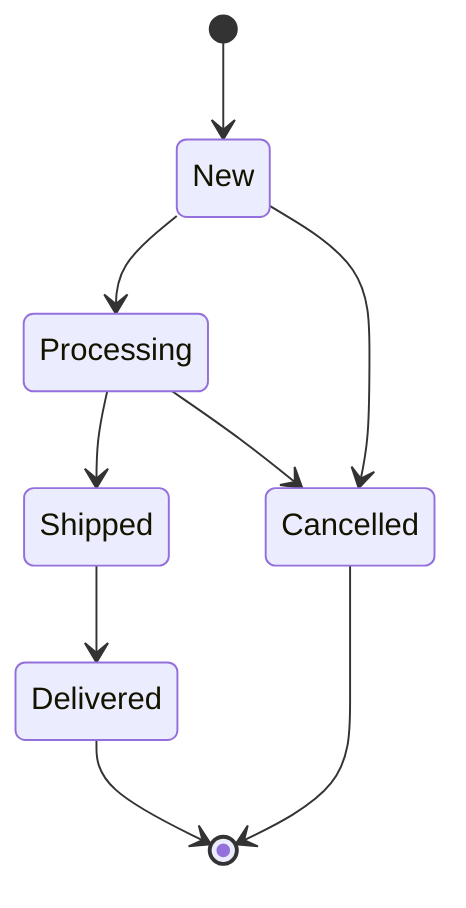
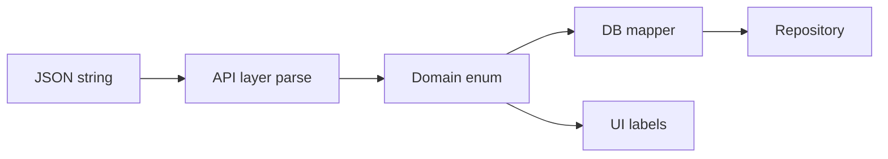

import ExternalCodeEmbed from '@site/src/components/ExternalCodeEmbed';


# Перечисления

<div class="article-tags">
  <span class="tag tag-required">ОБЯЗАТЕЛЬНО</span>
  <span class="tag tag-beginner">ДЛЯ НОВИЧКОВ</span>
</div>

<span class="complexity-badge">Разработчику</span>
<span class="complexity-badge">Аналитику</span>
<span class="complexity-badge">Тестировщику</span>  
<span class="complexity-badge">Архитектору</span>
<span class="complexity-badge">Инженеру</span>

**Дальше:** [Коллекции](./61.md) · [Итоги раздела](./98.md)

---

## Перечисления

**Перечисление (enum)** — способ описать в коде **закрытый набор именованных значений**. Переменная такого типа хранит только одну из заранее объявленных констант, например `New`, `Processing` или `Delivered` для статуса заказа.

Конструкция относится к [абстракции данных](./2.md). Вместе с [коллекциями](./61.md) и модулями она поддерживает [модульность](./7.md) программы, хотя формально не входит в четвёрку столпов ООП — абстракция, инкапсуляция, наследование, полиморфизм ([определение парадигмы](./1.md#определение-парадигмы)).

| Инструмент | Роль в программе |
|------------|------------------|
| **enum** | фиксированный набор состояний, ролей, режимов |
| **Коллекция** | хранение многих элементов, см. [Коллекции](./61.md) |
| **Модуль / пакет** | группа классов с общим публичным интерфейсом |

Теория — [перечисление в программировании](https://ru.wikipedia.org/wiki/Перечисление_(программирование)).

---

### Что такое enum

★ **enum** — именованный набор **констант**, образующих отдельный **тип данных**.

- **Константа** — значение, которое не меняется во время выполнения программы. В enum каждая константа имеет имя (`Processing`) и часто внутренний код (число `1`).
- **Закрытый тип** — список допустимых значений задаётся один раз при объявлении enum. Вне этого списка положить нечего.
- **АДТ (абстрактный тип данных)** — тип, у которого видны операции (сравнить, вывести в строку), а внутреннее представление (число за именем) скрыто. Подробнее — [Абстракция](./2.md).
- **Литерал** — запись конкретного значения в коде, например `OrderStatus.New` или `Color.Red`.

Типичные наборы для enum:

- дни недели (`Monday`, `Tuesday`, …);
- статусы заказа, заявки, платежа;
- роли пользователя (`Guest`, `User`, `Admin`);
- режимы интерфейса (`View`, `Edit`, `Admin`);
- коды ответа HTTP (`Ok`, `NotFound`, `InternalServerError`);
- направления на сетке (`North`, `South`, `East`, `West`).

---

### Магические числа и строки

Без enum статус часто кодируют числом или строкой:

```
status = 2
role = "admin"
paymentState = "PAID"
```

Такой стиль называют **магическими числами** и **магическими строками**. По коду непонятно, что означает `2`. Опечатка `"admn"` всплывёт только при запуске. Строка `"PAID"` и `"paid"` для программы — разные значения.

| Проблема | Что происходит |
|----------|----------------|
| Неочевидный смысл | `status == 2` требует комментария или внешнего справочника |
| Нет ограничения типа | в `status` можно записать `99` или `"hello"` |
| Разные написания | `"Processing"` и `"processing"` считаются разными строками |
| Сложный рефакторинг | переименование статуса — поиск по всему проекту вручную |
| Ошибки в условиях | `if (status == 3)` вместо `2` компилятор не заметит |

**Enum** собирает допустимые значения в одном месте. В [Java](/encyclopedia/5-languages/5-03-java/18), [C#](/encyclopedia/5-languages/5-05-csharp/25) и [Kotlin](/encyclopedia/5-languages/5-09-kotlin/15) компилятор не примет чужое значение. В [Python](/encyclopedia/5-languages/5-02-python/23) модуль `enum` выбрасывает ошибку при попытке создать недопустимый экземпляр.

---

### Пример на псевдокоде

```
Определить enum OrderStatus:
    New = 0
    Processing = 1
    Shipped = 2
    Delivered = 3

Функция getDescription(status):
    если status == OrderStatus.New:
        вернуть "Заказ создан"
    если status == OrderStatus.Processing:
        вернуть "Заказ в обработке"
    если status == OrderStatus.Shipped:
        вернуть "Заказ отправлен"
    если status == OrderStatus.Delivered:
        вернуть "Заказ доставлен"
    вернуть "Неизвестный статус"

status = OrderStatus.Processing
вывести getDescription(status)
```

Разбор по шагам:

- `OrderStatus` объявляет четыре именованные константы.
- `getDescription` принимает только значения типа `OrderStatus`.
- Снаружи используются имена `OrderStatus.New`, а не голое число `0`.
- Новый статус добавляется одной строкой в enum и одной веткой в [ветвлении](#switch-и-сопоставление-с-образцом).

---

### Сравнение значений enum

Константы enum сравнивают через `==` или `equals` (в Java для enum безопаснее `==`, потому что каждая константа существует в единственном экземпляре).

```
если status == OrderStatus.Delivered:
    отправитьОпросКлиенту()

если role != UserRole.Admin:
    запретитьДоступ()
```

Проверка «входит ли значение в набор»:

```
разрешённые = { OrderStatus.New, OrderStatus.Processing }
если status в разрешённых:
    разрешитьОтмену()
```

В [коллекциях](./61.md) набор допустимых статусов иногда хранят в `Set<Enum>` или `EnumSet` (Java).

---

### switch и сопоставление с образцом

**Switch** (C#, Java, Kotlin) и **match** (Python 3.10+, Rust, Swift) выбирают действие по значению enum:

```
переключить (status):
    случай OrderStatus.New:
        обработатьНовый()
    случай OrderStatus.Processing:
        обработатьВРаботе()
    случай OrderStatus.Shipped:
        обработатьОтправленный()
    случай OrderStatus.Delivered:
        обработатьДоставленный()
```

В статически типизированных языках компилятор предупреждает о **неполном switch**. Если в enum появился `Cancelled`, а ветки для него нет, сборка не пройдёт или IDE подсветит пропуск.

**Сопоставление с образцом (pattern matching)** в современных языках позволяет сочетать проверку типа и извлечение данных. В Rust и Swift enum может нести связанные поля — это уже ближе к алгебраическим типам, см. [Rust](/encyclopedia/5-languages/5-13-rust/13), [Swift](/encyclopedia/5-languages/5-14-swift/16).

Циклы и ветвления — [Управляющие конструкции](/encyclopedia/4-code-dev/4-02-chto-takoe-kod-i-kak-on-rabotaet/4).

---

### Enum в классах

Перечисление может быть **полем**, **параметром метода** или **результатом функции**:

```
Класс Order:
    свойство id: целое
    свойство status: OrderStatus
    свойство createdAt: дата

    метод setStatus(новый: OrderStatus):
        если можноПерейти(status, новый):
            status = новый
        иначе
            выбросить ОшибкаСостояния()

    метод canCancel(): логическое
        вернуть status == OrderStatus.New
            или status == OrderStatus.Processing

    метод isFinished(): логическое
        вернуть status == OrderStatus.Delivered
```

Статус заказа входит в [инкапсулированное](./3.md) состояние объекта. Метод `setStatus` может проверять **допустимые переходы** между состояниями, а не принимать любое значение снаружи.

---

### Автомат состояний

Многие enum описывают **конечный автомат** — объект может переходить из одного состояния в другое только по разрешённым правилам.



```
Функция можноПерейти(из, в):
    если из == OrderStatus.New и в в { Processing, Cancelled }:
        вернуть истина
    если из == OrderStatus.Processing и в в { Shipped, Cancelled }:
        вернуть истина
    если из == OrderStatus.Shipped и в == OrderStatus.Delivered:
        вернуть истина
    вернуть ложь
```

Такой подход часто встречается в бизнес-логике заказов, тикетов поддержки, платежей. Ошибочный переход ловят до записи в базу.

---

### Сценарий — светофор

```
Определить enum LightColor:
    Red
    Yellow
    Green

Функция следующийЦвет(текущий):
    переключить (текущий):
        случай LightColor.Red:    вернуть LightColor.Green
        случай LightColor.Green:  вернуть LightColor.Yellow
        случай LightColor.Yellow: вернуть LightColor.Red

Функция можноИдти(цвет):
    вернуть цвет == LightColor.Green
```

Три константы, понятные имена, никаких `0`, `1`, `2` в условиях. Добавить режим `Blinking` — одна константа и ветки в `switch`.

---

### Сценарий — роли пользователя

```
Определить enum UserRole:
    Guest
    User
    Moderator
    Admin

Функция можетРедактироватьЧужойПост(роль):
    вернуть роль == UserRole.Moderator
        или роль == UserRole.Admin

Функция можетУдалитьПользователя(роль):
    вернуть роль == UserRole.Admin
```

Роль хранят в [сессии](/encyclopedia/2-system-network/2-08-osnovy-informatsionnoy-bezopasnosti/1) или в токене. Проверки прав читаются как бизнес-правила, а не как сравнение с `"admin"`.

---

### Сценарий — дни недели

```
Определить enum Weekday:
    Monday
    Tuesday
    Wednesday
    Thursday
    Friday
    Saturday
    Sunday

Функция isWeekend(day):
    вернуть day == Weekday.Saturday
        или day == Weekday.Sunday
```

В Java у `DayOfWeek` есть методы `getValue()` и `plus(long)`. В C# — `DayOfWeek` в пространстве имён `System`. Смысл один — календарный день как именованная константа.

---

### Добавление нового значения

Допустим, нужен статус `Cancelled`:

1. добавить константу в объявление enum;
2. дописать ветку в `switch` / `match` и в `getDescription`;
3. обновить правила переходов в `можноПерейти`;
4. пройти по подсказкам IDE и предупреждениям компилятора;
5. обновить тесты и документацию API, если статус уходит наружу.

При строковых константах компилятор не покажет пропущенные места. При enum — покажет.

---

### Преобразование в строку и обратно

Для логов и UI enum превращают в читаемый текст:

```
Функция toDisplayName(status):
    переключить (status):
        случай OrderStatus.New:        вернуть "Новый"
        случай OrderStatus.Processing: вернуть "В обработке"
        ...
```

Из внешнего JSON приходит строка `"Processing"`. Её **парсят** в enum:

```
Функция parseStatus(текст):
    для каждого значение в OrderStatus:
        если значение.имя == текст:
            вернуть значение
    выбросить ОшибкаПарсинга()
```

В C# — `Enum.Parse` и `Enum.TryParse`. В Java — `OrderStatus.valueOf`. В Python — `OrderStatus["Processing"]` или перебор членов. Неверная строка должна давать явную ошибку, а не молча попадать в `null`.

Сериализация — [Продвинутые операции с данными](/encyclopedia/3-data-markup/3-01-prodvinutye-operatsii-s-dannymi/intro), [JSON](/encyclopedia/3-data-markup/3-04-konfiguratsii-i-dannye/5).

---

### Enum в JSON и REST API

Типичный ответ API:

```json
{
  "orderId": 42,
  "status": "Processing"
}
```

На стороне сервера поле `status` имеет тип `OrderStatus`. При отдаче JSON enum сериализуют в строку. При приёме строку валидируют и превращают обратно в enum.

Правила:

- договориться о регистре (`Processing`, не `processing`);
- документировать полный список значений в OpenAPI / Swagger;
- при неизвестном значении возвращать `400 Bad Request`, а не подставлять значение по умолчанию без логирования.

HTTP-коды и методы — [REST](/encyclopedia/2-system-network/2-09-osnovy-integratsionnogo-vzaimodeystviya/118).

---

### Enum в базе данных

В таблице статус часто хранят как:

- **целое число** (код enum, компактно);
- **строку** (читаемо в SQL-клиенте);
- **отдельный справочник** (таблица `order_status` с id и name).

При чтении строки из БД приложение маппит её в enum. При записи — обратно. Миграция схемы нужна, если добавили новую константу и старые строки её не знают.

ORM (Entity Framework, Hibernate) умеют хранить enum как число или строку — [ORM и работа с данными](/encyclopedia/4-code-dev/4-10-orm-i-rabota-s-dannymi/intro).

---

### Флаги и наборы констант

Иногда одним enum задают **несколько независимых флагов** (права доступа, рабочие дни). Каждой константе сопоставляют степень двойки, комбинируют побитовым ИЛИ.

```
Определить enum FileAccess:
    None = 0
    Read = 1
    Write = 2
    Execute = 4

права = FileAccess.Read или FileAccess.Write
имеетЧтение = (права и FileAccess.Read) != None
```

- C# — атрибут `[Flags]`, см. [ООП в C#](/encyclopedia/5-languages/5-05-csharp/25).
- Java — `EnumSet`, см. [Коллекции в Java](/encyclopedia/5-languages/5-03-java/24#enumset).

---

### Enum с полями и методами (Java, C#)

В Java enum — полноценный класс:

```java
enum Planet {
    MERCURY(3.303e+23, 2.4397e6),
    EARTH(5.976e+24, 6.37814e6);

    private final double mass;
    private final double radius;

    Planet(double mass, double radius) {
        this.mass = mass;
        this.radius = radius;
    }

    double surfaceGravity() { /* ... */ }
}
```

Константа может нести **данные** и **поведение**. Это мощнее простого списка имён.

---

### Пример на C#

<ExternalCodeEmbed example="csharp/code-408-6-001" title="Перечисления в C#" minHeight={192} />

---

### Синтаксис в языках

#### C#

```csharp
enum OrderStatus { New, Processing, Shipped, Delivered }
OrderStatus s = OrderStatus.New;
```

Подробнее — [ООП в C#](/encyclopedia/5-languages/5-05-csharp/25).

#### Java

```java
enum OrderStatus { NEW, PROCESSING, SHIPPED, DELIVERED }
OrderStatus s = OrderStatus.NEW;
```

Подробнее — [ООП в Java](/encyclopedia/5-languages/5-03-java/18).

#### Python

```python
from enum import Enum

class OrderStatus(Enum):
    NEW = 1
    PROCESSING = 2
    SHIPPED = 3
    DELIVERED = 4
```

Подробнее — [Модули и пакеты](/encyclopedia/5-languages/5-02-python/23).

#### TypeScript

```typescript
enum OrderStatus {
  New,
  Processing,
  Shipped,
  Delivered,
}
```

Строковые enum и union-типы — [Типы](/encyclopedia/5-languages/5-10-typescript/10).

#### Kotlin

```kotlin
enum class OrderStatus { NEW, PROCESSING, SHIPPED, DELIVERED }
```

Подробнее — [ООП в Kotlin](/encyclopedia/5-languages/5-09-kotlin/15).

#### Go (идиома без enum)

```go
type OrderStatus int
const (
    StatusNew OrderStatus = iota
    StatusProcessing
    StatusShipped
)
```

`iota` автоматически увеличивает константу — [Go](/encyclopedia/5-languages/5-10-go/16).

#### Rust (суммарный тип)

```rust
enum Message {
    Quit,
    Move { x: i32, y: i32 },
    Write(String),
}
```

Здесь enum — способ описать **варианты с данными** — [Rust](/encyclopedia/5-languages/5-13-rust/13).

#### C++

```cpp
enum class Color { Red, Green, Blue };
Color c = Color::Red;
```

`enum class` не преобразуется в `int` неявно — [ООП в C++](/encyclopedia/5-languages/5-06-cpp/14).

---

### Перечисления в языках — сводная таблица

| Язык | Статья | Что запомнить |
|------|--------|---------------|
| C# | [ООП в C#](/encyclopedia/5-languages/5-05-csharp/25) | `enum`, `[Flags]` |
| Java | [ООП в Java](/encyclopedia/5-languages/5-03-java/18) | поля, методы, `EnumSet` |
| Python | [Модули и пакеты](/encyclopedia/5-languages/5-02-python/23) | `enum.Enum`, `IntEnum` |
| TypeScript | [Типы](/encyclopedia/5-languages/5-10-typescript/10) | числовые и строковые enum |
| Kotlin | [ООП в Kotlin](/encyclopedia/5-languages/5-09-kotlin/15) | `enum class` |
| Swift | [Данные и коллекции](/encyclopedia/5-languages/5-14-swift/16) | associated values |
| C++ | [ООП в C++](/encyclopedia/5-languages/5-06-cpp/14) | `enum`, `enum class` |
| Rust | [Типы и коллекции](/encyclopedia/5-languages/5-13-rust/13) | алгебраические enum |
| Go | [Типы, slice и map](/encyclopedia/5-languages/5-10-go/16) | `const` + `iota` |
| PHP | [ООП в PHP](/encyclopedia/5-languages/5-07-php/18) | `enum` с PHP 8.1 |
| Dart | [Классы и ООП](/encyclopedia/5-languages/5-22-dart/10) | `enum` |
| Zig | [Типы](/encyclopedia/5-languages/5-20-zig/4) | `enum`, tagged union |

---

### Когда enum, когда строка

| Критерий | enum | строка |
|----------|------|--------|
| Набор значений | зафиксирован в коде | любой текст |
| Проверка | компилятор или `enum` в рантайме | вручную |
| Внешний API (JSON, БД) | преобразуют в строку или число | уже строка |
| Переименование | через IDE по всем ссылкам | поиск по проекту |
| Отображение пользователю | нужен отдельный `toString` / словарь подписей | строка уже читаема |

**Enum** — для внутренней модели. **Строка** — в контрактах REST, конфигах, логах; при чтении строку проверяют и маппят в enum.

---

### Коллекции enum

Набор допустимых статусов для фильтрации:

```
активные = { OrderStatus.New, OrderStatus.Processing }
для каждого заказа в заказы:
    если заказ.status в активные:
        обработать(заказ)
```

В Java — `EnumSet.of(...)`. В C# — `HashSet<OrderStatus>`. Подробнее о контейнерах — [Коллекции](./61.md).

---

### Nullable enum

Поле «статус может отсутствовать» оформляют так:

- C# — `OrderStatus?`;
- Java — `Optional<OrderStatus>`;
- Kotlin — `OrderStatus?`;
- TypeScript — `OrderStatus | null`.

Перед `switch` проверяют на `null`, иначе получат `NullPointerException` или аналог.

---

### Тестирование

В unit-тестах перебирают **все** константы enum:

```
для каждого status в OrderStatus:
    описание = getDescription(status)
    утвердить что описание не пустое
```

Так проверяют, что для каждого значения есть подпись в UI. При добавлении константы тест напомнит дописать `getDescription`.

Тестирование — [раздел про качество](/encyclopedia/7-project/7-04-testirovanie/intro).

---

### Антипаттерны

| Антипаттерн | Почему плохо | Что делать |
|-------------|--------------|------------|
| `int status` по всему проекту | магические числа | ввести enum |
| Строка статуса в 50 файлах | опечатки, разный регистр | enum + парсинг на границе |
| Enum с сотней значений | сложно сопровождать | разбить на категории или справочник в БД |
| Сериализовать enum как число без документации | клиенты ломаются при смене кодов | строка в API или версионирование |
| `default` в switch глотает новые значения | новый статус молча попадает в ветку по умолчанию | явные ветки или запрет `default` |

---

### Мини-практикум

1. Объявите enum `TicketPriority` (`Low`, `Medium`, `High`, `Critical`). Напишите функцию `slaHours(priority)`, возвращающую срок реакции в часах.
2. Добавьте enum `TicketStatus` и правила переходов `Open → InProgress → Resolved → Closed`.
3. Напишите `parsePriority(text)` для строк из JSON.
4. Оформите класс `Ticket` с полями `priority` и `status`.
5. Перечислите все пары `(status, priority)` в тесте и убедитесь, что `toString` не пустой.

Задачи на коллекции и частоты — [Lab / коллекции](/lab/Примеры/1131#2-коллекции-и-частоты).

---

### Перебор всех констант enum

Чтобы получить список всех значений перечисления:

```
для каждого status в OrderStatus.values():
    вывести status
```

В Java — `OrderStatus.values()`. В C# — `Enum.GetValues<OrderStatus>()`. В Python — `list(OrderStatus)`.

Это удобно для:

- построения выпадающего списка в UI;
- проверки полноты `switch` в тестах;
- сериализации справочника в документацию API.

---

### Порядок и числовой код (ordinal)

В Java у enum есть метод `ordinal()` — порядковый номер константы при объявлении (`0`, `1`, `2`…). **Не стоит** сохранять `ordinal()` в базу или сравнивать бизнес-логику через него: при перестановке констант в исходнике номера сдвинутся.

Надёжнее:

- явные поля `code` в enum;
- хранение имени строки;
- отдельная таблица справочника в БД.

---

### Миграция с чисел на enum

Типичный путь в старом проекте:

1. Найти все `int status` и константы `STATUS_NEW = 0`.
2. Объявить `enum OrderStatus`.
3. Заменить поля и параметры на `OrderStatus`.
4. На границе с БД оставить маппинг `int ↔ enum` один раз в репозитории.
5. Удалить магические константы.

Поэтапно: сначала enum + маппинг, потом чистка `int` по модулю.

---

### Enum для HTTP-методов и кодов ответа

```
Определить enum HttpMethod:
    GET
    POST
    PUT
    PATCH
    DELETE

Определить enum HttpStatus:
    Ok = 200
    Created = 201
    BadRequest = 400
    NotFound = 404
    InternalServerError = 500
```

Роутер сопоставляет путь и `HttpMethod`. Клиент проверяет `HttpStatus` вместо голого `404`. Подробнее — [REST](/encyclopedia/2-system-network/2-09-osnovy-integratsionnogo-vzaimodeystviya/118).

---

### Enum в конфигурационных файлах

В YAML или JSON конфиг может содержать:

```yaml
logLevel: Warning
defaultRole: User
```

При загрузке строку парсят в enum `LogLevel` / `UserRole`. Неверное значение — ошибка запуска с понятным текстом, а не тихий сбой. Конфиги — [форматы данных](/encyclopedia/3-data-markup/3-04-konfiguratsii-i-dannye/intro).

---

### Связь с логическим типом

`bool` — частный случай двух значений. Enum из двух констант (`Enabled`, `Disabled`) оправдан, если позже появится третье (`Unknown`, `Pending`). Пока вариантов ровно два и не планируется расширение — достаточно `bool`.

---

### Enum в UI

Выпадающий список на форме заполняют из `OrderStatus.values()`. Пользователь видит подпись из `toDisplayName`, в модель пишут enum. Так UI и сервер говорят на одном языке типов.

---

### Дополнительные примеры по доменам

| Предметная область | Enum | Зачем |
|--------------------|------|-------|
| Платёж | `PaymentStatus` | `Pending`, `Paid`, `Failed`, `Refunded` |
| Доставка | `DeliveryType` | `Courier`, `Pickup`, `Post` |
| Файл | `FileType` | `Image`, `Pdf`, `Archive` |
| Игра | `Direction` | `Up`, `Down`, `Left`, `Right` |
| Цвет UI | `Theme` | `Light`, `Dark`, `System` |

В каждом случае набор конечен и известен разработчикам заранее.

---

### Swift — enum с associated values

В Swift одна константа enum может нести разные данные:

```swift
enum Result {
    case success(String)
    case failure(Int, String)
}
```

Это пересекается с алгебраическими типами в Rust и `sealed class` в Kotlin. Подробнее — [Swift](/encyclopedia/5-languages/5-14-swift/16).

---

### Sealed class как альтернатива (Kotlin)

```
sealed class Result
class Success(val data: String) : Result()
class Error(val code: Int) : Result()
```

Когда вариантов мало и к каждому привязаны разные поля, `sealed class` иногда гибче классического enum. Сравнение подходов — [ООП в Kotlin](/encyclopedia/5-languages/5-09-kotlin/15).

---

### Чек-лист перед коммитом

- [ ] Все новые константы обработаны в `switch` / `match`.
- [ ] Есть `toDisplayName` или аналог для UI.
- [ ] Парсинг из JSON/БД выбрасывает понятную ошибку.
- [ ] Тест перебирает все значения enum.
- [ ] В API задокументирован список допустимых строк.

---

### Частые вопросы

**Можно ли хранить enum в [коллекции](./61.md)?**

Да. `List<OrderStatus>`, `Set<UserRole>`, словарь `Map<OrderStatus, String>` для подписей.

**Чем enum отличается от набора констант `public static final int`?**

Enum — отдельный тип. Метод принимает `OrderStatus`, а не любой `int`. Плюс единственный экземпляр каждой константы (Java).

**Нужен ли enum для двух значений (`Yes` / `No`)?**

Иногда достаточно `bool`. Enum оправдан, если позже появятся `Maybe`, `Unknown` или нужны методы на значениях.

**Как enum связан с [полиморфизмом](./5.md)?**

Слабо напрямую. Enum описывает фиксированный набор; полиморфизм — иерархию классов с переопределением методов. В Rust enum с данными совмещает оба подхода.

**Что если набор значений приходит из админки и меняется каждый день?**

Справочник в БД, а не enum. Enum — для стабильного набора на этапе разработки.

**Можно ли сериализовать enum в XML?**

Да, как строку или число. Правила те же, что для JSON — явный контракт и валидация при чтении.

**Есть ли enum в SQL?**

В PostgreSQL — тип `CREATE TYPE ... AS ENUM`. В других СУБД часто хранят `VARCHAR` с check-constraint или справочник.

---

### Справочник операций с enum

| Операция | Псевдокод | Пример использования |
|----------|-----------|----------------------|
| Сравнение | `a == b` | проверка статуса |
| Перебор | `for v in Values` | заполнение UI |
| В строку | `toString(v)` | лог, экспорт |
| Из строки | `parse(text)` | импорт JSON |
| В число | `toInt(v)` | legacy БД |
| Из числа | `fromInt(n)` | чтение старых записей |
| Набор флагов | `a \| b` | права доступа |

---

### Пример — платёжный статус end-to-end

```
Определить enum PaymentStatus:
    Pending
    Authorized
    Captured
    Failed
    Refunded

Класс Payment:
    свойство id: UUID
    свойство status: PaymentStatus
    свойство amount: Decimal

    метод authorize():
        если status != PaymentStatus.Pending:
            выбросить InvalidTransition()
        status = PaymentStatus.Authorized

    метод capture():
        если status != PaymentStatus.Authorized:
            выбросить InvalidTransition()
        status = PaymentStatus.Captured
```

Так бизнес-правила сосредоточены в методах класса, а не в разбросанных `if (code == 3)`.

---

### Пример — уровень логирования

```
Определить enum LogLevel:
    Trace
    Debug
    Info
    Warning
    Error

Функция shouldLog(configLevel, messageLevel):
    вернуть messageLevel >= configLevel
```

Конфиг читает строку `"Warning"`, парсит в `LogLevel.Warning`, сравнения идут через enum.

---

### Пример — направление в игре

```
Определить enum Direction:
    North
    East
    South
    West

Функция turnRight(dir):
    переключить (dir):
        случай North: вернуть East
        случай East:  вернуть South
        случай South: вернуть West
        случай West:  вернуть North
```

Четыре константы вместо `0`, `1`, `2`, `3` в поворотах персонажа.

---

### TypeScript — union type как альтернатива

```typescript
type OrderStatus = "new" | "processing" | "shipped" | "delivered";
```

Строковый union даёт проверку типов без runtime-объекта enum. Подробнее — [Типы](/encyclopedia/5-languages/5-10-typescript/10).

---

### Python — IntEnum и StrEnum

```python
from enum import IntEnum, StrEnum

class Priority(IntEnum):
    LOW = 1
    HIGH = 2

class Color(StrEnum):
    RED = "red"
    GREEN = "green"
```

`IntEnum` сравнивается с числом осторожно. `StrEnum` (Python 3.11+) удобен для JSON-строк.

---

### Java — values() и valueOf()

```java
for (OrderStatus s : OrderStatus.values()) {
    System.out.println(s.name());
}
OrderStatus parsed = OrderStatus.valueOf("PROCESSING");
```

`valueOf` бросает исключение при неверном имени — это желаемое поведение на границе системы.

---

### C# — Enum.TryParse

```csharp
if (Enum.TryParse<OrderStatus>(text, ignoreCase: true, out var status))
    Apply(status);
else
    throw new ArgumentException("Unknown status");
```

Безопасный разбор строки из запроса или конфига.

---

### Диаграмма — enum в слоях приложения



На границах — строка или число. Внутри домена — enum.

---

### Расширенный практикум

6. Добавьте `Refunded` в `PaymentStatus` и обновите все `switch`.
7. Напишите тест, что `parse("UNKNOWN")` бросает исключение.
8. Создайте `Map<OrderStatus, String>` для подписей на русском.
9. Реализуйте `[Flags]` enum `Permission { Read, Write, Execute }` в C#.
10. Сравните размер JSON при сериализации enum как строки и как числа.

---

### Enum в тестах и документации

Документируйте допустимые значения в OpenAPI:

```yaml
status:
  type: string
  enum: [New, Processing, Shipped, Delivered]
```

В тестах параметризованный прогон по всем константам:

```
@ParameterizedTest
@EnumSource(OrderStatus.class)
void everyStatusHasLabel(OrderStatus status) {
    assertNotNull(labels.get(status));
}
```

Так регрессия при новой константе видна сразу.

---

### Enum в legacy-коде (Cobol, Pascal)

В [Cobol](/encyclopedia/5-languages/5-16-starye-yazyki/Cobol/5) и [Pascal](/encyclopedia/5-languages/5-16-starye-yazyki/Pascal/4) перечислимые типы задают именованные целые. Идея та же, что у современного enum, синтаксис иной. Миграция legacy часто начинается с таблицы соответствия `старый код → новый enum`.

---

### Enum и булева логика

Три и более состояний (`Unknown`, `Yes`, `No`) лучше enum, чем `bool?` или два bool-поля. Один тип — одно поле в модели.

---

### Сводка — когда вводить enum в проект

| Ситуация | Решение |
|----------|---------|
| 3–15 фиксированных состояний | enum |
| Значения меняет админка ежедневно | таблица в БД |
| Два варианта навсегда | `bool` |
| Строка из внешнего API | parse → enum внутри |
| Флаги прав | `[Flags]` enum или `EnumSet` |
| Варианты с разными полями | sealed class / Rust enum |

---

### Полный пример — заявка в поддержку

```
Определить enum TicketStatus:
    Open
    InProgress
    WaitingCustomer
    Resolved
    Closed

Определить enum TicketPriority:
    Low
    Medium
    High
    Critical

Класс Ticket:
    свойство id: long
    свойство title: String
    свойство status: TicketStatus
    свойство priority: TicketPriority
    свойство assigneeId: long?

    метод startWork():
        если status != TicketStatus.Open:
            выбросить Ошибка()
        status = TicketStatus.InProgress

    метод resolve():
        если status != TicketStatus.InProgress:
            выбросить Ошибка()
        status = TicketStatus.Resolved

    метод close():
        если status != TicketStatus.Resolved:
            выбросить Ошибка()
        status = TicketStatus.Closed

    метод slaDeadline(): дата
        часы = переключить (priority):
            случай Low:      72
            случай Medium:   24
            случай High:      8
            случай Critical:  2
        вернуть createdAt + часы
```

Один класс, два enum, явные переходы, SLA из priority.

---

### Связь с [коллекциями](./61.md)

```
списокСтатусов = новый List<OrderStatus>()
списокСтатусов.добавить(OrderStatus.New)
списокСтатусов.добавить(OrderStatus.Processing)

подписи = новый Map<OrderStatus, String>()
подписи[OrderStatus.New] = "Новый"
подписи[OrderStatus.Processing] = "В работе"
```

---

### PHP, Dart, Scala

**PHP** — `enum` с 8.1, ранее константы класса. [ООП в PHP](/encyclopedia/5-languages/5-07-php/18).

**Dart** — `enum` с enhanced enums. [Классы и ООП](/encyclopedia/5-languages/5-22-dart/10).

**Scala** — `enum` (Scala 3) и `sealed trait`. [Scala](/encyclopedia/5-languages/5-18-scala/1).

---

### Zig и низкоуровневые enum

```zig
const Color = enum { red, green, blue };
const Status = enum(u8) { ok = 200, not_found = 404 };
```

Явный базовый тип для совместимости с C API — [Zig](/encyclopedia/5-languages/5-20-zig/4).

---

### Аннотации и метаданные на enum (Java)

```java
public enum HttpMethod {
    GET, POST, PUT, DELETE;

    public boolean allowsBody() {
        return this == POST || this == PUT;
    }
}
```

Методы на enum держат поведение рядом с константами.

---

### Запись в лог

```
лог.info("Order {} changed to {}", order.id, order.status)
```

`toString()` enum даёт имя константы. Для пользовательских логов лучше `toDisplayName(status)`.

---

### Обратная совместимость API

При добавлении `Cancelled` старые клиенты могут не знать новое значение. Стратегии:

- версионирование API (`/v2/orders`);
- неизвестное значение маппить в `Unknown` внутри клиента;
- документировать changelog.

---

### Сравнение подходов к ограниченному набору

| Подход | Плюсы | Минусы |
|--------|-------|--------|
| enum | тип, switch, IDE | жёсткий набор |
| string + validate | гибкий ввод | ошибки в рантайме |
| int + constants | компактно | магические числа |
| таблица БД | меняется без деплоя | сложнее код |
| sealed class | варианты с данными | тяжелее enum |

---

### Упражнения для закрепления (дополнительно)

11. Реализуйте `Color` enum и функцию `contrast(background)` для текста ч/б.
12. Сделайте `parseDirection("N")` → `Direction.North` с ошибкой на `"X"`.
13. Храните `List<Permission>` как набор флагов из enum.
14. Напишите JSON-схему с `enum` для статуса заказа.
15. Переведите legacy `if (type == 1)` на `switch` по enum.

---

### Итоговая шпаргалка

- Enum = **именованный закрытый тип**.
- Заменяет **магические числа и строки** в доменной модели.
- Работает с **switch/match** и проверкой полноты веток.
- На границе системы **парсится** из строки/числа.
- Внутри — **типобезопасность** и поддержка IDE.
- С [коллекциями](./61.md) — списки и словари enum-значений.

---

### Каталог доменных enum (ориентир)

| Домен | Enum | Константы (пример) |
|-------|------|-------------------|
| E-commerce | `OrderStatus` | New, Paid, Shipped, Delivered, Returned |
| Платежи | `PaymentMethod` | Card, Cash, Wallet, BankTransfer |
| Пользователи | `AccountState` | Active, Suspended, Deleted |
| Контент | `PublishState` | Draft, Review, Published, Archived |
| Файлы | `UploadStatus` | Pending, Uploading, Done, Failed |
| Уведомления | `Channel` | Email, Sms, Push, InApp |
| Геолокация | `CompassPoint` | N, NE, E, SE, S, SW, W, NW |
| Медиа | `MediaType` | Image, Video, Audio, Document |
| Безопасность | `AccessLevel` | Public, Internal, Confidential, Secret |
| Время | `DayOfWeek` | Monday … Sunday |

Каждый ряд — кандидат на отдельный enum в вашем проекте, если набор стабилен.

---

### Пошаговый рефакторинг int → enum

**Шаг 1.** Найти все `static final int STATUS_*` и `if (x == 3)`.

**Шаг 2.** Создать `enum Status` с теми же смыслами.

**Шаг 3.** Заменить поля `int status` на `Status status`.

**Шаг 4.** В DAO/репозитории один метод `int toDb(Status)` и `Status fromDb(int)`.

**Шаг 5.** Удалить старые константы. Прогнать тесты.

**Шаг 6.** В API оставить строки для внешних клиентов, внутри — enum.

---

### Ошибки при работе с enum

| Ошибка | Симптом | Решение |
|--------|---------|---------|
| `NullPointerException` в switch | поле enum null | проверка до switch |
| `IllegalArgumentException` в valueOf | неверная строка из API | TryParse / try-catch |
| Пропущен case | новая константа не обработана | включить warnings компилятора |
| ordinal в БД | сдвиг при перестановке enum | хранить name или явный code |
| default глотает всё | новые значения в default | убрать default или бросать exception |

---

### Разбор по строкам — статус заказа

```
строка 1:  Определить enum OrderStatus: ...
           ↑ объявляем тип и все допустимые значения один раз

строка 8:  status = OrderStatus.Processing
           ↑ переменная типа OrderStatus, не int

строка 11: если status == OrderStatus.New:
           ↑ сравнение только с константами enum

строка 20: переключить (status):
           ↑ компилятор проверит все ветки
```

Такой разбор помогает новичку связать синтаксис с идеей закрытого типа.

---

### Связь с типизацией

[Статическая типизация](/encyclopedia/1-basics/1-09-dannye-i-informatsiya/4) ловит присвоение чужого типа на этапе компиляции. Enum — частный случай: тип с **конечным** набором значений. [Динамические языки](/encyclopedia/1-basics/1-09-dannye-i-informatsiya/4) полагаются на `enum.Enum` или соглашения в рантайме.

---

### Глоссарий

| Термин | Кратко |
|--------|--------|
| **Константа** | неизменяемое именованное значение |
| **Литерал** | запись значения в коде (`OrderStatus.New`) |
| **Закрытый тип** | только объявленные значения |
| **Ordinal** | порядковый номер константы (осторожно в БД) |
| **Flags** | enum как битовая маска |
| **Parse** | строка → enum |
| **Serialize** | enum → строка/число для API |

---

## Куда дальше

| Тема | Статья |
|------|--------|
| Списки, словари, множества | [Коллекции](./61.md) |
| Итоги раздела ООП | [Итоги](./98.md) |
| Абстракция данных | [Абстракция](./2.md) |
| Полиморфизм и `List<Тип>` | [Полиморфизм](./5.md) |
| Типы и типизация | [Типизация](/encyclopedia/1-basics/1-09-dannye-i-informatsiya/4) |

---
