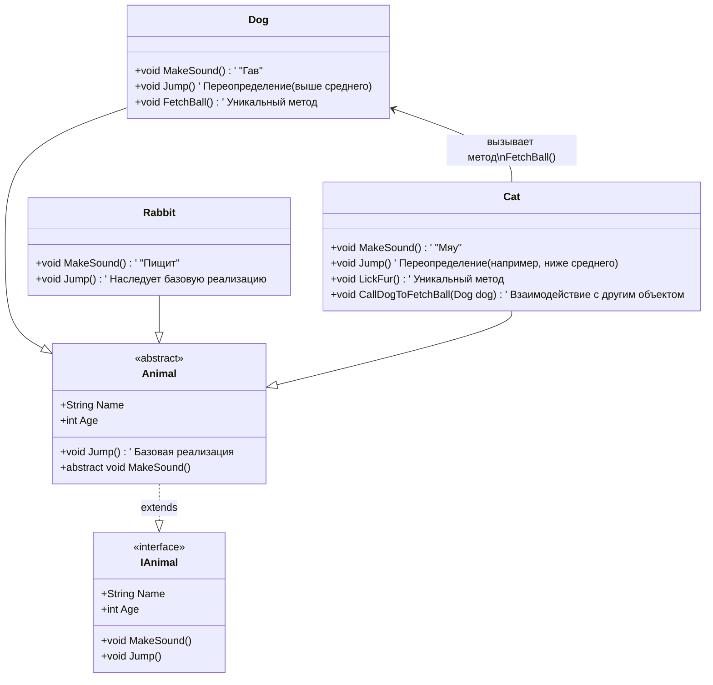

# Инструменты объектно-ориентированной разработки

<div class="article-tags">
  <span class="tag tag-required">ОБЯЗАТЕЛЬНО</span>
  <span class="tag tag-beginner">ДЛЯ НОВИЧКОВ</span>
</div>

<span class="complexity-badge">Разработчику</span>
<span class="complexity-badge">Аналитику</span>
<span class="complexity-badge">Тестировщику</span>  
<span class="complexity-badge">Архитектору</span>
<span class="complexity-badge">Инженеру</span>

## Инструменты объектно-ориентированной разработки

Некоторые инструменты не являются строго привязанными к одному из вышеуказанных четырёх основных принципов ООП, но связаны с организацией данных и их управлением. Мы рассмотрим enum и коллекции.

---

### Перечисления

**enum (перечисление)** — это специальный тип данных, который позволяет определить набор именованных констант. 

---

**Константа** — это фиксированное значение, и это полезно, когда у вас есть постоянный набор таких значений, например, дни недели, статусы заказа или цвета. 

Пример:

```
Определить enum OrderStatus:
    New = 0
    Processing = 1
    Shipped = 2
    Delivered = 3

Функция getDescription(status):
    если status == OrderStatus.New:
        вернуть "Заказ создан"
    если status == OrderStatus.Processing:
        вернуть "Заказ в обработке"
    если status == OrderStatus.Shipped:
        вернуть "Заказ отправлен"
    если status == OrderStatus.Delivered:
        вернуть "Заказ доставлен"

status = OrderStatus.Processing
вывести getDescription(status)
```

Здесь мы создаём программу, которая определяет текущий статус заказа (например, «Новый», «В обработке», «Доставлен») и выводит его описание.

Реализация такова:
	- мы создали перечисление OrderStatus, где каждому статусу присвоено числовое значение;
	- функция getDescription принимает статус как аргумент и возвращает соответствующее описание;
	- в программе мы задали статус Processing и вывели его описание.

Перечисления гарантируют, что переменная может принимать только допустимые значения из заранее определённого набора, а также скрывают детали реализации (например, числовые значения) за удобными именами. Перечисления могут быть частью классов и интерфейсов. Например, метод класса может принимать перечисление как параметр и работать с ним.

Если потребуется добавить новое состояние (например, новый вид статуса), достаточно просто добавить новую константу в перечисление.

Такой инструмент есть во всех языках, включая C#, Java, Python, C++, TypeScript, Swift, Kotlin и используется через ключевое слово enum, к примеру в C#:

```csharp
public enum OrderStatus
{
    New,
    Processing,
    Shipped,
    Delivered
}
```

---

### Коллекции

**Коллекции** — это структуры данных, которые позволяют хранить и управлять группами объектов. Они более гибкие, чем массивы, так как могут динамически изменять размер.


Коллекция содержит несколько элементов, предоставляет методы для добавления, удаления, поиска и других операций, а также коллекции могут хранить объекты разных типов, если они реализуют общий интерфейс или наследуются от базового класса. Коллекции скрывают детали реализации - вы работаете с коллекцией через единый интерфейс, не заботясь о том, как она устроена внутри.

К примеру, нам нужно создать список товаров и вывести их названия:
```
Создать коллекцию products:
    Добавить "Яблоко"
    Добавить "Банан"
    Добавить "Груша"

для каждого product в products:
    вывести product
```
Здесь мы создали коллекцию products и добавили в неё несколько элементов. Затем мы прошлись по всем элементам коллекции с помощью цикла и вывели их.

Коллекции позволяют инкапсулировать группу объектов в одном месте. Например, класс может содержать коллекцию своих элементов, скрывая детали их хранения и управления. Пример: Класс Library может содержать коллекцию книг (`List<Book>`), предоставляя методы для добавления, удаления и поиска книг, но скрывая внутреннюю реализацию коллекции.
```
Класс Library:
    свойство books: List<Book>
    метод addBook(book):
        books.Add(book)
    метод findBookByTitle(title):
        вернуть books.Find(b -> b.title == title)
```
Коллекции поддерживают работу с объектами разных типов (например, через интерфейсы или базовые классы). Это позволяет использовать полиморфизм. Коллекции предоставляют абстрактный способ работы с группами объектов, скрывая детали их хранения (например, массив, связанный список и т.д.). Вы можете работать с коллекцией, не заботясь о том, как именно она реализована внутри (динамический массив, хеш-таблица и т.д.).
```
books = новый List<Book>()  // Не важно, как именно устроена коллекция
books.Add(новый Book("Война и мир"))
books.Add(новый Book("Преступление и наказание"))
```

Коллекции позволяют легко расширять функциональность программы, добавляя новые элементы или изменяя их поведение.
Кстати, подробнее про ООП можно почитать почти в каждом учебнике по программированию, в том числе документации по каждому языку. Из интересных примеров можно привести https://metanit.com/, там много интересной информации, в том числе и про ООП.


---

## Зачем всё это?

Так, мы разобрались, что есть абстракция, инкапсуляция, наследование, полиморфизм. Как всё это работает на практике и зачем всё это нужно? Новичок может вообще не понять сути, ибо…а почему бы просто тупо не писать всё в одном классе?
Давайте по порядку.



---

1. *Если будем писать всё в одном коде* - будут одинаковые названия методов, переменных и других элементов (или они станут слишком длинными и сложными для чтения), поэтому **придётся всё группировать** в какие-то логические блоки кода.

---

2. *Если мы будем их все писать в одном файле*, то когда код вырастет до тысяч строк, нам придётся мучаться.

Поэтому, чтобы решить проблемы из пунктов 1 и 2 - давайте всё сгруппируем в блоки кода - **классы**. Чтобы всё не хранить в одном файле, каждый класс можно положить в отдельный одноимённый файл.

---

3. *Чтобы код из одного файла мог работать с кодом из другого файла* (читать свойства, вызывать методы), мы должны сделать их **публичными**, чтобы они были *видимы* и *доступны* другим.

---

4. Но *если какой-то элемент класса не используется никем, кроме самого класса*, то «публиковать» его и делать видимым - излишнее. Поэтому мы делаем их **приватными** или даже **защищёнными**.

---

5. *А если нужно, чтобы кому-то понадобился приватный элемент*, мы используем **геттеры** и **сеттеры** - заготовленные методы. Сеттер для изменения данных, геттер для получения. Если не хотим изменять, то убираем сеттер, оставляем геттер.

---

6. Представим, что *нам нужна логика издавания звуков животными*. Ок, сделали **кошку** и **собаку**. Потом добавили ещё и **кролика**. Теперь у нас есть три «зверька» - кошка, собака, кролик. Они все могут издавать какие-то звуки - кошка *мяукает*, собака *гавкает*, кролик *пищит*.


Но что *если мы решим добавить к логике мяукания ещё и* **логику прыгания**? 

Да, мы добавим кошке, добавим собаке. 

**А кролику логику прыгания добавить забыли**. 

Программа успешно скомпилировалась, всё работает, собака и кошка прыгают, но лишь на тестировании заметили - *а почему кролик не прыгает?* А потому что мы вручную писали каждому животному новую логику, и когда кого-то пропустили, забыли. И никто нам не показал на ошибку.

---
7. **Поэтому мы переделаем всё**. 

Мы сделаем **интерфейс IAnimal**, который не содержит никакой логики, а просто описывает, что все его животные должны иметь определённые *свойства* (имя, возраст) и определённые *методы* (издавать звук и прыгать).

Потом мы сделаем **абстрактный класс Animal**, который в отличие от интерфейса, может содержать логику - да, звуки издают все по-разному, мы не будем описывать здесь логику, но вот прыгают все примерно одинаково, поэтому мы реализуем базовый метод Jump(), который будет содержать реализацию.

**Cat, Dog и Rabbit** - три конкретных класса-наследника Animal, которые обязаны в себе реализовать свойства и методы родительского класса. Наследование позволяет создавать иерархическую структуру (древо) всех элементов и моделей.

И если Cat и Dog получат реализацию прыжка, а в Rabbit забудем - **программа выдаст ошибку компиляции**! Ведь система типов (компилятор) гарантирует, что все классы, которые наследуются от родительского класса или реализуют интерфейс, соблюдают определённые правила и методы. И мы увидим ошибку ещё до того как она возникнет, ведь IDE нам подскажет, что Rabbit должен будет реализовать требования.

**Эти требования и есть контракт**.

---

8. Чтобы *переопределить* прыжок для собаки (ведь она прыгает выше других), мы должны будем реализовать метод, но во внутренней логике метода прыжка мы укажем, что высота больше — это будет переопределённый метод. Аналогично можно скорректировать логику прыжка и для кошки.

---

9. Собака может *приносить мяч*, а кошка *вылизываться*. Это новые методы, которые уникальны для конкретных классов, поэтому они, кроме базовых наследуемых элементов, могут иметь свои, уникальные.

---

10. Но это лишь классы. Это не реальные животные, а лишь их проекты - чертежи, теоретический базис. Чтобы они стали конкретными, нужно создать объекты. Поэтому в каждый класс мы создадим специальный метод-конструктор, который можно будет вызывать для создания нового экземпляра класса, указав его свойства.

---

11. Кошка может *позвать собаку, чтобы она принесла мячик*. Тогда кошка внутри своего класса может вызвать метод собаки, чтобы выполнить соответствующее действие. Однако обращаться придётся не к классу, а к объекту, поэтому мы сначала при помощи конструктора должны будем создать новый объект - собаку по имени Шарик, и выполнить команду «Шарик.ПринестиМяч()», и если «ПринестиМяч()» у собаки — это публичный метод, то Шарик отзовётся и выполнит ПринестиМяч().


---

Так всё это и работает. Теперь мы можем создавать новые виды животных, а компилятор нам подскажет, что любое животное должно как минимум иметь имя, возраст, уметь издавать звуки и прыгать.

Можно выполнять любую логику и разделять всё между элементами. Правильность распределения — это отдельная наука, которая как раз и совершенствуется с развитием навыков программирования, и силами лучших программистов мира были изобретены различные принципы, подходы и паттерны. Как правильно распределять классы, как правильно проектировать такую систему — это всё мы изучим позже.

---