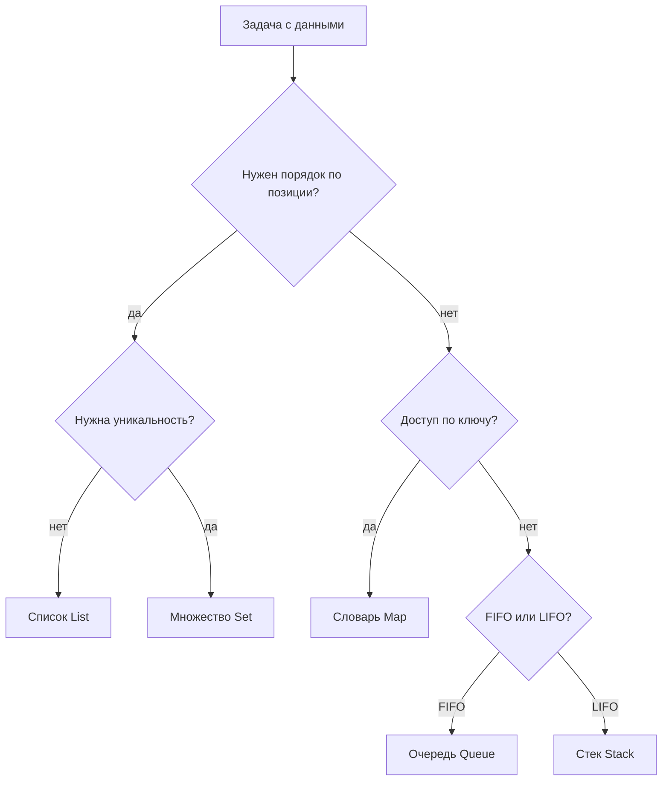

import ExternalPlayEmbed from '@site/src/components/ExternalPlayEmbed';


# Коллекции

<div class="article-tags">
  <span class="tag tag-required">ОБЯЗАТЕЛЬНО</span>
  <span class="tag tag-beginner">ДЛЯ НОВИЧКОВ</span>
</div>

<span class="complexity-badge">Разработчику</span>
<span class="complexity-badge">Аналитику</span>
<span class="complexity-badge">Тестировщику</span>  
<span class="complexity-badge">Архитектору</span>
<span class="complexity-badge">Инженеру</span>

**Ранее:** [Перечисления](./6.md) · **Дальше:** [Итоги раздела](./98.md)

Связанные материалы — [Структуры данных](/encyclopedia/3-data-markup/3-02-struktury-dannyh/intro), [реализация на псевдокоде](/encyclopedia/3-data-markup/3-02-struktury-dannyh/2#алгоритмический-справочник-псевдокод), [индексация](https://ru.wikipedia.org/wiki/Индексация_(программирование)), [итератор](https://ru.wikipedia.org/wiki/Итератор), [коллекция (программирование)](https://ru.wikipedia.org/wiki/Коллекция_(программирование)).

---

## Коллекции

★ **Коллекция** — объект в программе, который хранит **много элементов** и даёт готовые способы их добавлять, искать, удалять и перебирать.

Элементом может быть:

- **примитив** — `int`, `double`, `bool` ([типы данных](/encyclopedia/1-basics/1-09-dannye-i-informatsiya/3));
- **строка** — имя, заголовок, ключ;
- **объект** — экземпляр класса `Book`, `User`, `Order` ([класс и объект](./1.md));
- **другая коллекция** — список списков, словарь списков.

Коллекция меняет размер во время работы. После `добавить` элементов больше, после `удалить` — меньше. Перераспределение памяти выполняет библиотека языка.

С точки зрения [абстракции данных](./2.md) коллекция — **контейнер** с операциями `добавить`, `удалить`, `найти`, `перебрать`. Внутри может быть [динамический массив](/encyclopedia/3-data-markup/3-02-struktury-dannyh/1#линейные-структуры), [связный список](/encyclopedia/3-data-markup/3-02-struktury-dannyh/2) или [хеш-таблица](/encyclopedia/3-data-markup/3-02-struktury-dannyh/1#хеш-таблицы). Код обращается к интерфейсу `List`, `Map`, `Set`.




---

### Массив и динамический список

**Массив** — упорядоченный набор ячеек фиксированной или заданной при создании длины.

**Список (List)** — коллекция с доступом по индексу и изменяемым размером.

| Свойство | Массив | Список |
|----------|--------|--------|
| Размер | часто фиксирован | меняется в рантайме |
| Вставка в середину | сдвиг вручную | `add`, `insert` |
| Память | один блок | буфер с перевыделением |
| Типичные задачи | матрица, буфер, сокеты | каталог, корзина, лента |

По языкам:

- [JavaScript](/encyclopedia/5-languages/5-01-javascript/211) — `Array` с `push`, `pop`, `splice`;
- [Java](/encyclopedia/5-languages/5-03-java/24) — `int[]` и `ArrayList`;
- [C#](/encyclopedia/5-languages/5-05-csharp/28) — `T[]` и `List<T>`;
- [Python](/encyclopedia/5-languages/5-02-python/22) — `list`;
- [Go](/encyclopedia/5-languages/5-10-go/16) — массив `[n]T` и срез `[]T`.

<ExternalPlayEmbed example="data-markup/data-structure-linear" title="Линейные структуры данных" minHeight={420} playProps={{ defaultLang: 'general' }} />

---

### Индексация

**Индексация** — доступ к элементу упорядоченной коллекции по номеру позиции. Подробная практика — ниже; теория адреса в памяти — [линейные структуры](/encyclopedia/3-data-markup/3-02-struktury-dannyh/1#линейные-структуры).

```
элемент := список[индекс]
список[индекс] := значение
```

#### Индекс и ключ

| | Список | Словарь |
|---|--------|---------|
| Обращение | `list[2]` | `map["id"]` |
| Позиция задаётся | порядком вставки | уникальным ключом |
| Когда уместен | обход по порядку, UI-списки | поиск по id, кэш |

#### Нумерация с нуля

| Схема | Первый элемент | Языки |
|-------|----------------|-------|
| С нуля | `0` | C, Java, C#, JS, Python, Go, Rust |
| С единицы | `1` | Pascal, MATLAB |
| Произвольный базис | `n` | Fortran |

Третья книга на полке — `books[2]`. **Ошибка на единицу (off-by-one)** — цикл до `<= size` вместо `< size`.

#### Отрицательные индексы

```python
items = ["a", "b", "c", "d"]
items[-1]   # "d"
items[-2]   # "c"
```

В Java и C# отрицательный индекс — исключение.

#### Выход за границы

Допустимые индексы при нумерации с нуля: `0` … `размер − 1`.

| Язык | Исключение |
|------|------------|
| Java | `IndexOutOfBoundsException` |
| Python | `IndexError` |
| C# | `ArgumentOutOfRangeException` |

#### Срезы

```python
nums = [10, 20, 30, 40, 50]
nums[1:4]    # [20, 30, 40]
nums[:2]      # [10, 20]
nums[2:]      # [30, 40, 50]
```

Срез создаёт новую коллекцию, исходная не меняется.

#### Многомерные массивы

```
grid[строка][столбец]
```

См. [Матрицы](/encyclopedia/3-data-markup/3-02-struktury-dannyh/1#матрицы).

#### Слово "индекс" в SQL

В СУБД **индекс** ускоряет поиск по столбцу — [индексы СУБД](/encyclopedia/3-data-markup/3-05-osnovy-baz-dannyh/3#pyat-osnovnyh-struktur-indeksov). Это не номер строки в результате `SELECT`.

---

### Список (List)

**Список** — упорядоченная коллекция с индексами `0` … `n−1`, дубликаты разрешены.

Основные операции:

| Операция | Псевдокод | Заметка |
|----------|-----------|---------|
| Добавить в конец | `список.добавить(x)` | амортизированно O(1) |
| Вставить по индексу | `список.вставить(i, x)` | O(n) из-за сдвига |
| Получить | `список[i]` | O(1) для динамического массива |
| Удалить по индексу | `список.удалить(i)` | O(n) |
| Найти индекс | `список.индекс(x)` | O(n) |
| Размер | `список.размер()` | O(1) |
| Подсписок | `список.срез(a, b)` | новая коллекция |

Пример — корзина покупок:

```
корзина = новый Список()
корзина.добавить("Хлеб")
корзина.добавить("Молоко")
корзина.добавить("Яйца")

суммаПозиций = корзина.размер()
первыйТовар = корзина[0]
```

Список подходит, когда важен **порядок отображения** и обход от начала к концу. Плохой выбор для поиска по `id` среди десятков тысяч записей — лучше [словарь](#словарь-map).

Реализации — `ArrayList` (Java), `List<T>` (C#), `list` (Python), `Array` (JS). Сложность — [таблицы O(·)](/encyclopedia/3-data-markup/3-02-struktury-dannyh/2).

---

### Словарь (Map)

**Словарь** — коллекция пар **ключ → значение**. Ключи уникальны.

| Операция | Псевдокод |
|----------|-----------|
| Записать | `словарь[ключ] := значение` |
| Прочитать | `значение := словарь[ключ]` |
| Удалить | `словарь.удалить(ключ)` |
| Есть ключ? | `словарь.содержитКлюч(ключ)` |
| Все ключи | `словарь.ключи()` |

Пример — каталог товаров по артикулу:

```
товары = новый Словарь()
товары["SKU-001"] = новый Product("Хлеб", 45)
товары["SKU-002"] = новый Product("Молоко", 89)

хлеб = товары["SKU-001"]
```

Поиск по ключу в [хеш-таблице](/encyclopedia/3-data-markup/3-02-struktury-dannyh/1#хеш-таблицы) в среднем за O(1). Порядок ключей в `HashMap` не гарантирован; для порядка вставки — `LinkedHashMap` (Java), для сортировки по ключу — `TreeMap`.

<ExternalPlayEmbed example="data-markup/data-structure-key-value" title="Key-Value структуры" minHeight={420} playProps={{ defaultLang: 'general' }} />

Безопасное чтение:

```
если словарь.содержитКлюч(id):
    вернуть словарь[id]
иначе
    вернуть значениеПоУмолчанию
```

В C# — `TryGetValue`. В Java — `getOrDefault`. В Python — `dict.get(key, default)`.

Подробнее — [ключ-значение](/encyclopedia/3-data-markup/3-02-struktury-dannyh/1#ключ-значение), [Коллекции в Java](/encyclopedia/5-languages/5-03-java/24), [Коллекции в C#](/encyclopedia/5-languages/5-05-csharp/28).

---

### Множество (Set)

**Множество** хранит **уникальные** элементы. Повторный `add` того же значения игнорируется.

| Операция | Назначение |
|----------|------------|
| `добавить(x)` | вставить, если ещё нет |
| `содержит(x)` | проверка за O(1) в среднем |
| `удалить(x)` | убрать элемент |
| `объединение(a, b)` | все из обоих |
| `пересечение(a, b)` | только общие |
| `разность(a, b)` | из a без b |

Пример — уникальные теги статьи:

```
теги = новый Множество()
теги.добавить("java")
теги.добавить("oop")
теги.добавить("java")   // второй раз не добавится

если теги.содержит("oop"):
    вывести "есть тег oop"
```

Множество удобно для:

- удаления дубликатов из списка;
- быстрой проверки "уже видели этот id?";
- операций теории множеств.

Порядок обхода в `HashSet` не фиксирован. Нужна сортировка — `TreeSet` (Java), `sorted(set)` (Python).

---

### Очередь (Queue)

**Очередь** — **FIFO** (First In, First Out). Первым пришёл — первым вышел.

| Операция | Смысл |
|----------|-------|
| `enqueue(x)` | встать в хвост |
| `dequeue()` | взять из головы |
| `peek()` | посмотреть голову без извлечения |

Пример — очередь печати:

```
очередь = новый Queue()
очередь.enqueue("doc1.pdf")
очередь.enqueue("doc2.pdf")

следующий = очередь.dequeue()   // "doc1.pdf"
```

Очереди задач в фоне, обработка сообщений, BFS в [графах](/encyclopedia/3-data-markup/3-02-struktury-dannyh/1#графовые-структуры) — типичные применения.

<ExternalPlayEmbed example="system-network/data-structure-queue" title="Очередь (структура данных)" minHeight={420} playProps={{ defaultLang: 'general' }} />

**Приоритетная очередь** (`PriorityQueue`) отдаёт элемент с наивысшим приоритетом, а не строго первый по времени.

---

### Стек (Stack)

**Стек** — **LIFO** (Last In, First Out). Последним пришёл — первым вышел.

| Операция | Смысл |
|----------|-------|
| `push(x)` | положить сверху |
| `pop()` | снять сверху |
| `peek()` | посмотреть верхний |

Примеры:

- стек вызовов функций ([выполнение кода](/encyclopedia/4-code-dev/4-03-vypolnenie-koda/intro));
- undo/redo в редакторе;
- разбор вложенных скобок `(( ))`.

```
стек = новый Stack()
стек.push("шаг1")
стек.push("шаг2")
отмена = стек.pop()   // "шаг2"
```

Стек и очередь — [структуры данных](/encyclopedia/3-data-markup/3-02-struktury-dannyh/1#стек), [очередь](/encyclopedia/3-data-markup/3-02-struktury-dannyh/1#очередь).

---

### Кортеж и неизменяемые коллекции

**Кортеж (tuple)** — упорядоченный набор фиксированной длины, который после создания не меняют.

- Python — `point = (10, 20)`;
- C# — `ValueTuple<int, int>`;
- Kotlin — `Pair`, `Triple`.

**Неизменяемый список** — `List.of(...)` (Java), кортеж из элементов. Изменение создаёт **новую** коллекцию (`+` в Kotlin, spread в Python). Это снижает риск случайной порчи данных из другого места кода.

Подробнее — [кортежи](/encyclopedia/3-data-markup/3-02-struktury-dannyh/1#кортежи).

---

### Сводная таблица видов

| Тип | Порядок | Дубликаты | Доступ |
|-----|---------|-----------|--------|
| Список | по индексу | да | `list[i]` |
| Множество | обычно нет | нет | `contains` |
| Словарь | по ключам | ключи уникальны | `map[key]` |
| Очередь | FIFO | зависит от типа | `dequeue` |
| Стек | LIFO | — | `pop` |
| Deque | с обоих концов | — | `addFirst` |

#### Как выбрать тип

- порядок и позиция — **список**;
- уникальность — **множество**;
- поиск по id — **словарь**;
- задачи по очереди — **очередь**;
- откат действий — **стек**.

---

### Сценарий — интернет-магазин

```
// Список — порядок отображения в каталоге
каталог = новый Список()
каталог.добавить(товар1)
каталог.добавить(товар2)

// Словарь — быстрый поиск по артикулу
поАртикулу = новый Словарь()
поАртикулу[товар1.sku] = товар1

// Множество — уникальные категории для фильтра
категории = новый Множество()
для каждого т в каталог:
    категории.добавить(т.category)

// Очередь — заказы на обработку
очередьЗаказов = новый Queue()
очередьЗаказов.enqueue(заказ42)
```

Три разных коллекции решают три разные задачи в одном модуле.

---

### Сценарий — библиотека

```
Класс Library:
    свойство books: List<Book>
    свойство byIsbn: Map<String, Book>

    метод addBook(book):
        books.Add(book)
        byIsbn[book.isbn] = book

    метод findByIsbn(isbn):
        вернуть byIsbn[isbn]

    метод listByAuthor(author):
        результат = новый Список()
        для каждого b в books:
            если b.author == author:
                результат.добавить(b)
        вернуть результат
```

`List` хранит порядок поступления. `Map` даёт O(1) по ISBN. Фильтр по автору — линейный проход по списку или [Stream](/encyclopedia/5-languages/5-03-java/24) / [LINQ](/encyclopedia/5-languages/5-05-csharp/29).

---

### Сценарий — фоновые задачи

```
очередь = новый Queue()
очередь.enqueue(задачаОтправитьEmail)
очередь.enqueue(задачаСжатьФайл)

пока не очередь.пуста():
    задача = очередь.dequeue()
    выполнить(задача)
```

Воркер забирает задачи строго по порядку постановки. Для параллельных воркеров смотрят [асинхронность](/encyclopedia/4-code-dev/4-05-asinhronnost/intro).

---

### Создание и наполнение

```
products = новый Список()
products.добавить("Яблоко")
products.добавить("Банан")

colors = новый Список("красный", "зелёный", "синий")
usersById = новый Словарь()
```

Пустая коллекция — старт для данных из API, файла, формы. Размер заранее неизвестен.

Чтение файла построчно:

```
строки = новый Список()
пока естьСледующаяСтрока(файл):
    строки.добавить(прочитатьСтроку(файл))
```

---

### Где хранят коллекции

| Место | Пример |
|-------|--------|
| Локальная переменная | `items = новый Список()` |
| Поле класса | `books: Список<Book>` |
| Параметр функции | `обработать(orders: Список<Order>)` |
| Возврат функции | `getAllUsers(): Список<User>` |
| Вложенность | `Map<String, List<Integer>>` |

---

### Ссылка и копия

Переменная коллекции часто хранит **ссылку** на один и тот же объект:

```
a = новый Список(1, 2, 3)
b = a
b.добавить(4)
// a тоже содержит 1, 2, 3, 4
```

Чтобы изменить `b` и не трогать `a`, нужна **копия**:

```
b = a.копия()          // поверхностная
b = глубокаяКопия(a)   // если элементы — изменяемые объекты
```

В Python — `list(a)` или `a.copy()`. В Java — `new ArrayList<>(a)`. Путаница ссылок — частая причина "неожиданных" изменений в другом модуле.

---

### Перебор элементов

**Итерация** — обработка каждого элемента по очереди.

```
для каждого product в products:
    вывести product
```

С индексом:

```
для i от 0 до products.размер() - 1:
    вывести i, products[i]
```

Через итератор:

```
итератор = products.получитьИтератор()
пока итератор.естьСледующий():
    обработать(итератор.следующий())
```

`foreach` (C#, Java), `for…of` (JS) скрывают итератор. Циклы — [Управляющие конструкции](/encyclopedia/4-code-dev/4-02-chto-takoe-kod-i-kak-on-rabotaet/4).

:::caution Изменение коллекции во время обхода
Удаление внутри `foreach` ломает перебор. Используйте `removeIf`, отдельный список на удаление или `iterator.remove()`.
:::

---

### Основные операции обработки

**Фильтрация** — оставить элементы по условию.

**Преобразование (map)** — применить функцию к каждому элементу.

**Свёртка (reduce)** — свести коллекцию к одному значению.

```
чётные = numbers.фильтровать(n -> n % 2 == 0)
квадраты = numbers.преобразовать(n -> n * n)
сумма = numbers.свернуть(0, (acc, n) -> acc + n)
```

| Язык | Инструмент |
|------|------------|
| Python | `filter`, list comprehension — [22](/encyclopedia/5-languages/5-02-python/22) |
| Java | Stream API — [24](/encyclopedia/5-languages/5-03-java/24) |
| C# | LINQ — [29](/encyclopedia/5-languages/5-05-csharp/29) |
| JavaScript | `filter`, `map`, `reduce` — [211](/encyclopedia/5-languages/5-01-javascript/211) |

<ExternalPlayEmbed example="data-markup/collection-methods-play" title="Методы коллекции" minHeight={520} playProps={{ defaultLang: 'general' }} />

---

### Подсчёт частот

Сколько раз встретилось каждое слово:

```
частоты = новый Словарь()
для каждого слова в слова:
    если частоты.содержитКлюч(слово):
        частоты[слово] = частоты[слово] + 1
    иначе
        частоты[слово] = 1
```

В Python — `collections.Counter`. В Java — `Collectors.groupingBy`. Задачи — [Lab / частоты](/lab/Примеры/1131#2-коллекции-и-частоты).

---

### Группировка

Разбить заказы по статусу:

```
поСтатусу = новый Словарь()
для каждого заказа в заказы:
    статус = заказ.status
    если не поСтатусу.содержитКлюч(статус):
        поСтатусу[статус] = новый Список()
    поСтатусу[статус].добавить(заказ)
```

В C# — `GroupBy`, в Java — `Collectors.groupingBy`, в Python — `itertools.groupby` (после сортировки) или цикл.

---

### Сортировка и поиск

**Сортировка** — упорядочить элементы (`sort`, `sorted`). Для объектов задают правило сравнения — [компаратор](/encyclopedia/4-code-dev/4-01-algoritmy/2), `Comparator` (Java), `IComparer` (C#).

```
список.сортировать((a, b) -> a.price - b.price)
```

**Линейный поиск** — перебор до нахождения, O(n).

**Бинарный поиск** — в отсортированной коллекции, O(log n). В Java — `Collections.binarySearch`.

**Поиск в словаре** — O(1) в среднем по ключу.

Алгоритмы — [поиск и сортировка](/encyclopedia/4-code-dev/4-01-algoritmy/2). Big-O — [Lab / 1128](/lab/Примеры/1128).

---

### Чтение JSON

JSON-массив → список:

```json
["apple", "banana", "pear"]
```

```python
fruits = json.loads(text)   # list в Python
```

JSON-объект → словарь:

```json
{"id": 1, "name": "Alice"}
```

Согласуйте типы полей с моделью класса. Парсинг — [JSON](/encyclopedia/3-data-markup/3-04-konfiguratsii-i-dannye/5), [Продвинутые операции с данными](/encyclopedia/3-data-markup/3-01-prodvinutye-operatsii-s-dannymi/intro).

---

### Чтение CSV и SQL

**CSV** — строка разбивается на поля, строки складывают в список словарей или список списков.

**SQL** — каждая строка результата `SELECT` становится объектом или словарём, все строки — `List<Row>`.

Дальше — [SQL](/encyclopedia/3-data-markup/3-07-sql/intro), [ORM](/encyclopedia/4-code-dev/4-10-orm-i-rabota-s-dannymi/intro).

---

### Коллекции и полиморфизм

[Полиморфизм подтипов](./5.md) — список базового типа хранит объекты разных подклассов:

```
figures = новый List<Фигура>()
figures.Add(новый Круг())
figures.Add(новый Прямоугольник())

для каждой f в figures:
    f.Нарисовать()
```

**Обобщения (generics)** — `List<Order>`, не `List` «чего угодно». Теория — [Обобщения](/encyclopedia/4-code-dev/4-07-paradigmy-i-urovni-abstraktsii/114). Синтаксис — [Java](/encyclopedia/5-languages/5-03-java/15), [C#](/encyclopedia/5-languages/5-05-csharp/26).

---

### Коллекции и [перечисления](./6.md)

Список статусов для фильтра:

```
активные = новый Множество()
активные.добавить(OrderStatus.New)
активные.добавить(OrderStatus.Processing)

для каждого заказа в заказы:
    если активные.содержит(заказ.status):
        обработать(заказ)
```

В Java — `EnumSet`. Словарь подписей для UI: `Map<OrderStatus, String>`.

---

### Ленивая итерация

**Генератор** выдаёт элементы по одному без полной материализации:

- C# — `yield return` — [30](/encyclopedia/5-languages/5-05-csharp/30);
- Kotlin — `Sequence` — [225](/encyclopedia/5-languages/5-09-kotlin/225);
- Python — `yield` в функции-генераторе — [22](/encyclopedia/5-languages/5-02-python/22).

Полезно при чтении больших файлов построчно.

---

### Пустая коллекция и null

Возвращать **пустой список** `[]` предпочтительнее, чем `null`:

```
Функция findByTag(tag):
    результат = новый Список()
    ...
    вернуть результат   // даже если ничего не нашли
```

Вызывающий код пишет `for (x : result)` без проверки на null. Идиома — [Effective Java](https://ru.wikipedia.org/wiki/Java) / стиль проекта.

---

### Библиотеки по языкам

| Язык | Типы и пакеты | Статья |
|------|---------------|--------|
| Java | `java.util` | [24](/encyclopedia/5-languages/5-03-java/24) |
| Python | `list`, `dict`, `set`, `collections` | [22](/encyclopedia/5-languages/5-02-python/22) |
| C# | `System.Collections.Generic` | [28](/encyclopedia/5-languages/5-05-csharp/28) |
| JavaScript | `Array`, `Map`, `Set` | [211](/encyclopedia/5-languages/5-01-javascript/211) |
| TypeScript | типизированные коллекции | [19](/encyclopedia/5-languages/5-10-typescript/19) |
| Kotlin | `listOf`, `mutableListOf` | [225](/encyclopedia/5-languages/5-09-kotlin/225) |
| Go | `slice`, `map` | [16](/encyclopedia/5-languages/5-10-go/16) |
| C++ | STL | [24](/encyclopedia/5-languages/5-06-cpp/24) |
| Rust | `Vec`, `HashMap` | [13](/encyclopedia/5-languages/5-13-rust/13) |
| Swift | `Array`, `Dictionary` | [16](/encyclopedia/5-languages/5-14-swift/16) |
| PHP | `array` | [15](/encyclopedia/5-languages/5-07-php/15) |
| Ruby | `Array`, `Hash` | [13](/encyclopedia/5-languages/5-11-ruby/13) |

Полный список — [коллекции в языках](/encyclopedia/3-data-markup/3-02-struktury-dannyh/intro#коллекции-в-разделах-языков).

---

### Мини-практикум

1. Создайте `List<String>` из пяти городов. Выведите второй и последний (с учётом нумерации с нуля).
2. Постройте `Map<id, User>` из списка пользователей. Найдите пользователя по `id` за одно обращение.
3. Удалите дубликаты из списка чисел через `Set`.
4. Смоделируйте undo — три `push` и два `pop` на стеке.
5. Посчитайте частоту букв в строке через словарь.
6. Отсортируйте список товаров по цене.
7. Сгруппируйте заказы по [статусу enum](./6.md).
8. Распарсьте JSON-массив имён в список.
9. Объясните, почему поиск по `id` в `List` из 100 000 элементов медленнее, чем в `Map`.
10. Верните пустой список вместо `null` из функции поиска.

---

### Частые вопросы

**Чем список отличается от массива?**

Список в Java/C# динамически растёт. Классический массив C фиксирован. В JS и Python граница размыта.

**Когда `Set`, когда `List`?**

`List` — порядок и дубликаты. `Set` — только уникальность и быстрая проверка вхождения.

**Почему `map[key]` падает с ошибкой?**

Ключа нет. Используйте `get` с значением по умолчанию или `containsKey`.

**Можно ли сортировать словарь?**

Сортируют список ключей или пар `(key, value)`, либо используют `TreeMap`.

**Что такое `Iterable`?**

Интерфейс «по мне можно итерироваться». `List`, `Set` в Java его реализуют.

**Зачем `LinkedList`, если есть `ArrayList`?**

`LinkedList` лучше при частых вставках в середину (на практике реже, чем кажется). Чаще берут `ArrayList` за кэш-локальность.

**Как хранить список списков?**

`List<List<Integer>>` — матрица смежности, таблица ячеек.

**Коллекции потокобезопасны?**

Обычные `ArrayList`, `HashMap` — нет. Для многопоточности — `ConcurrentHashMap`, `CopyOnWriteArrayList` (Java) или синхронизация снаружи.

---

### Частые ошибки

- линейный поиск по `id` в длинном списке;
- удаление в `foreach`;
- путаница ссылки и копии;
- `null` вместо пустой коллекции;
- изменение коллекции, переданной в другой модуль, без явного контракта;
- хранение всего в одном `List<Object>` без [generics](/encyclopedia/4-code-dev/4-07-paradigmy-i-urovni-abstraktsii/114).

---

### Справочник методов списка

| Метод | Действие | Java | Python | C# | JavaScript |
|-------|----------|------|--------|-----|------------|
| Добавить в конец | +1 элемент | `add` | `append` | `Add` | `push` |
| Вставить | по индексу | `add(i, x)` | `insert` | `Insert` | `splice` |
| Удалить | по индексу/значению | `remove` | `pop`/`remove` | `Remove` | `splice` |
| Размер | количество | `size()` | `len` | `Count` | `length` |
| Подсписок | срез | `subList` | `[a:b]` | `GetRange` | `slice` |
| Содержит? | поиск | `contains` | `in` | `Contains` | `includes` |
| Очистить | удалить все | `clear` | `clear` | `Clear` | `length=0` |

---

### Справочник методов словаря

| Метод | Java | Python | C# | JavaScript |
|-------|------|--------|-----|------------|
| Запись | `put` | `[k]=` | `[key]=` | `set` |
| Чтение | `get` | `[k]` / `get` | `[key]` | `get` |
| Удаление | `remove` | `del` / `pop` | `Remove` | `delete` |
| Ключи | `keySet` | `.keys()` | `Keys` | `keys()` |
| Значения | `values` | `.values()` | `Values` | `values()` |
| Пары | `entrySet` | `.items()` | перебор | `entries()` |

---

### Справочник методов множества

| Метод | Java | Python | C# |
|-------|------|--------|-----|
| Добавить | `add` | `add` | `Add` |
| Удалить | `remove` | `remove` | `Remove` |
| Содержит | `contains` | `in` | `Contains` |
| Объединение | `addAll` | `\|` | `UnionWith` |
| Пересечение | `retainAll` | `&` | `IntersectWith` |

---

### Вложенные коллекции

**Список списков** — матрица, таблица:

```
матрица = новый Список()
строка0 = новый Список(1, 2, 3)
строка1 = новый Список(4, 5, 6)
матрица.добавить(строка0)
матрица.добавить(строка1)
ячейка = матрица[1][2]   // 6
```

**Словарь списков** — группировка:

```
поАвтору = новый Словарь()
поАвтору["Толстой"] = новый Список("Война и мир", "Анна Каренина")
```

**Словарь словарей** — двухуровневый кэш `region → userId → User`.

---

### Сценарий — подсчёт слов в тексте

```
текст = прочитатьФайл("article.txt")
слова = разбить(текст, поПробелам)
частоты = новый Словарь()

для каждого слова в слова:
    норма = слово.вНижнийРегистр()
    если частоты.содержитКлюч(норма):
        частоты[норма] = частоты[норма] + 1
    иначе
        частоты[норма] = 1

топ10 = отсортировать(частоты.пары(), поЗначению).взять(10)
```

Словарь даёт O(1) обновление счётчика на слово. Список пар сортируют для вывода топа.

---

### Сценарий — история посещений (deque)

```
история = новый Deque()
история.addLast("/home")
история.addLast("/catalog")
история.addLast("/product/5")

назад = история.removeLast()    // /product/5
текущая = история.peekLast()    // /catalog
```

Двусторонняя очередь — навигация "назад" и "вперёд" в браузере.

---

### Сценарий — проверка скобок (стек)

```
Функция скобкиСбалансированы(текст):
    стек = новый Stack()
    для каждого символ c в текст:
        если c == "(" или c == "[":
            стек.push(c)
        если c == ")":
            если стек пуст или стек.pop() != "(":
                вернуть ложь
        если c == "]":
            если стек пуст или стек.pop() != "[":
                вернуть ложь
    вернуть стек.пуст()
```

Классическая задача на стек — [алгоритмы](/encyclopedia/4-code-dev/4-01-algoritmy/2).

---

### Сравнение List и Map для поиска

| Операция | List из n элементов | Map по ключу |
|----------|---------------------|--------------|
| Найти по id | O(n) перебор | O(1) в среднем |
| Добавить в конец | O(1) амортиз. | O(1) |
| Обход по порядку | естественный | ключи не по порядку в HashMap |
| Память | компактнее | накладные расходы на хеш |

На 10 элементах разницы нет. На 100 000 — словарь критичен.

---

### List comprehension (Python-стиль)

Идея, переносимая на другие языки через `map`/`filter`:

```python
squares = [x * x for x in range(10) if x % 2 == 0]
```

Читается как "список квадратов x для чётных x". Аналог — LINQ `where` + `select`, Java Stream `filter` + `map`.

---

### Сортировка объектов

```
Класс Product:
    свойство name: String
    свойство price: int

продукты.сортировать((a, b) -> a.price - b.price)
```

Для строк — лексикографическое сравнение. Для дат — по timestamp. Нестабильная сортировка может поменять порядок равных элементов — [алгоритмы сортировки](/encyclopedia/4-code-dev/4-01-algoritmy/2).

---

### Обход словаря

```
для каждой пары (ключ, значение) в словарь.пары():
    вывести ключ, значение

для каждого ключа в словарь.ключи():
    обработать(ключ, словарь[ключ])
```

В Java — `entrySet()`. В Python — `.items()`. В JS — `for (const [k,v] of map)`.

---

### Иммутабельность и защитная копия

Публичный геттер не должен отдавать внутренний изменяемый список:

```
Класс Team:
    свойство _members: List<Player>

    метод getMembers():
        вернуть неизменяемыйСписок(_members)
        // или return new ArrayList<>(_members)
```

Иначе вызывающий код вызовет `_members.clear()` в обход API класса — нарушение [инкапсуляции](./3.md).

---

### Коллекции в параметрах функций

```
Функция printAll(items: List<String>):
    для каждого item в items:
        вывести item
```

Принимают любой размер. Не перегружайте сигнатуру десятком параметров `a, b, c, d` — передайте список.

Возврат нескольких значений без кортежа — через `List` или `Map` (осторожно с типизацией).

---

### Потокобезопасность (кратко)

Обычные коллекции не рассчитаны на одновременную запись из нескольких потоков. Варианты:

- обёртка `Collections.synchronizedList` (Java);
- `ConcurrentHashMap` для общих кэшей;
- передача копии коллекции в другой поток;
- однопоточная модель без разделяемого состояния.

Подробнее — [многопоточность](/encyclopedia/4-code-dev/4-05-asinhronnost/intro), [Java Collections](/encyclopedia/5-languages/5-03-java/24).

---

### Связь со структурами данных

| Коллекция в языке | Структура под капотом (часто) |
|-------------------|-------------------------------|
| `ArrayList` | [динамический массив](/encyclopedia/3-data-markup/3-02-struktury-dannyh/1#линейные-структуры) |
| `LinkedList` | [связный список](/encyclopedia/3-data-markup/3-02-struktury-dannyh/2) |
| `HashMap` | [хеш-таблица](/encyclopedia/3-data-markup/3-02-struktury-dannyh/1#хеш-таблицы) |
| `TreeMap` | [красно-чёрное дерево](/encyclopedia/3-data-markup/3-02-struktury-dannyh/2) |
| `PriorityQueue` | [куча](/encyclopedia/3-data-markup/3-02-struktury-dannyh/2) |
| `ArrayDeque` | [кольцевой буфер](/encyclopedia/3-data-markup/3-02-struktury-dannyh/1#очередь) |

---

### Расширенный практикум

11. Реализуйте `invert(map)` — словарь `{a:1, b:2}` → `{1:a, 2:b}` (значения уникальны).
12. Найдите пересечение двух `Set<String>` тегов.
13. Реализуйте очередь из двух стеков.
14. Постройте `Map<Character, Integer>` частот букв и выведите три самых частых.
15. Отфильтруйте список пользователей старше 18 через `filter`.
16. Преобразуйте `List<Order>` в `Map<orderId, Order>`.
17. Объясните, зачем `LinkedHashMap` для LRU-кэша.
18. Прочитайте JSON-массив объектов и постройте словарь по полю `id`.

---

### Расширенные вопросы

**Чем `Vector` отличается от `ArrayList`?**

`Vector` синхронизирован, legacy. Новый код — `ArrayList` или concurrent-коллекции.

**Зачем `Collections.unmodifiableList`?**

Вернуть read-only вид коллекции вызывающему коду.

**Можно ли использовать список как ключ словаря?**

В Python — да, если список hashable нет; списки не hashable. Ключ должен быть неизменяемым (`tuple`).

**Что такое `WeakHashMap`?**

Карта со слабыми ссылками на ключи — для кэшей, GC может собрать ключ. Java-специфика.

**Как отсортировать `Map` по значению?**

Собрать `entrySet`, отсортировать список записей по `getValue()`, собрать `LinkedHashMap`.

---

### Путеводитель — Java

```java
List<String> fruits = new ArrayList<>();
fruits.add("apple");
fruits.add("banana");

Map<String, Integer> ages = new HashMap<>();
ages.put("Alice", 30);

Set<String> tags = new HashSet<>();
tags.add("java");

for (String f : fruits) {
    System.out.println(f);
}

fruits.stream()
    .filter(s -> s.startsWith("a"))
    .map(String::toUpperCase)
    .forEach(System.out::println);
```

- `ArrayList` — список по умолчанию.
- `HashMap` — словарь по умолчанию.
- `HashSet` — множество по умолчанию.
- Stream API — декларативная фильтрация и преобразование.

Статья — [Коллекции в Java](/encyclopedia/5-languages/5-03-java/24).

---

### Путеводитель — Python

```python
fruits = ["apple", "banana"]
fruits.append("pear")

ages = {"Alice": 30, "Bob": 25}
ages["Charlie"] = 35

tags = {"java", "oop"}

for f in fruits:
    print(f)

squares = [x * x for x in range(10) if x % 2 == 0]

from collections import Counter
counts = Counter(words)
```

- `list` — динамический массив.
- `dict` — хеш-словарь.
- `set` — множество.
- `tuple` — неизменяемая последовательность.
- `Counter` — частоты из коробки.

Статья — [Коллекции в Python](/encyclopedia/5-languages/5-02-python/22).

---

### Путеводитель — C#

```csharp
var fruits = new List<string> { "apple", "banana" };
fruits.Add("pear");

var ages = new Dictionary<string, int> {
    ["Alice"] = 30
};

var tags = new HashSet<string> { "csharp" };

foreach (var f in fruits)
    Console.WriteLine(f);

var query = fruits
    .Where(s => s.Length > 5)
    .Select(s => s.ToUpper())
    .ToList();
```

- `List<T>` — основной список.
- `Dictionary<TKey, TValue>` — словарь.
- `HashSet<T>` — множество.
- LINQ — `Where`, `Select`, `OrderBy`, `GroupBy`.

Статьи — [Коллекции в C#](/encyclopedia/5-languages/5-05-csharp/28), [LINQ](/encyclopedia/5-languages/5-05-csharp/29).

---

### Путеводитель — JavaScript

```javascript
const fruits = ["apple", "banana"];
fruits.push("pear");

const ages = new Map();
ages.set("Alice", 30);

const tags = new Set(["js", "web"]);

for (const f of fruits)
  console.log(f);

const long = fruits
  .filter(s => s.length > 5)
  .map(s => s.toUpperCase());
```

- `Array` — список и методы `map`/`filter`/`reduce`.
- `Map` — словарь с любым типом ключа.
- `Set` — уникальные значения.
- Объект `{ key: value }` — часто как словарь, но ключи только строки/Symbol.

Статья — [Массивы в JavaScript](/encyclopedia/5-languages/5-01-javascript/211).

---

### Путеводитель — Kotlin

```kotlin
val fruits = mutableListOf("apple", "banana")
fruits.add("pear")

val ages = mutableMapOf("Alice" to 30)
val tags = setOf("kotlin", "jvm")

for (f in fruits)
    println(f)

val upper = fruits
    .filter { it.length > 5 }
    .map { it.uppercase() }
```

- `listOf` / `mutableListOf` — неизменяемый и изменяемый список.
- `mapOf` / `mutableMapOf` — словарь.
- `Sequence` — ленивая цепочка операций.

Статья — [Коллекции в Kotlin](/encyclopedia/5-languages/5-09-kotlin/225).

---

### Путеводитель — Go

```go
fruits := []string{"apple", "banana"}
fruits = append(fruits, "pear")

ages := map[string]int{"Alice": 30}

for _, f := range fruits {
    fmt.Println(f)
}
```

- **slice** `[]T` — динамический список через `append`.
- **map** `map[K]V` — словарь.
- Отдельного `Set` в стандартной библиотеке нет — `map[T]struct{}` как идиома.

Статья — [Типы, slice и map](/encyclopedia/5-languages/5-10-go/16).

---

### Сценарий — школьный журнал

```
ученики = новый List<Student>()
ученики.добавить(новый Student("Анна", 5))
ученики.добавить(новый Student("Борис", 4))

оценкиПоПредмету = новый Map<String, List<Integer>>()
оценкиПоПредмету["Математика"] = новый List(5, 4, 5)
оценкиПоПредмету["Русский"] = новый List(4, 4)

среднее(оценкиПоПредмету["Математика"])
```

Список учеников — порядок в классе. Словарь предмет → список оценок — вложенная структура.

---

### Сценарий — кэш с ограничением размера

```
кэш = новый LinkedHashMap()   // порядок доступа
лимит = 100

Функция get(key):
    если кэш.содержитКлюч(key):
        значение = кэш[key]
        кэш.удалить(key)
        кэш[key] = значение    // обновить порядок
        вернуть значение
    значение = загрузитьИзБД(key)
    если кэш.размер() >= лимит:
        удалитьСтарейший(кэш)
    кэш[key] = значение
    вернуть значение
```

Идея LRU — [LinkedHashMap](/encyclopedia/5-languages/5-03-java/24) в Java, `OrderedDict` в Python 3.7+.

---

### Итератор — внутренний протокол

```
интерфейс Iterator<T>:
    метод hasNext(): boolean
    метод next(): T
    метод remove(): void   // опционально
```

`foreach` в Java разворачивается примерно так:

```
Iterator<String> it = list.iterator();
while (it.hasNext()) {
    String s = it.next();
    ...
}
```

В Python объект итерируем, если есть `__iter__()` и `__next__()`.

---

### Comparable и Comparator

**Comparable** — объект сравнивает себя с другим (`a.compareTo(b)`).

**Comparator** — внешнее правило сравнения (`Comparator.comparing(Product::getPrice)`).

Сортировка `List<Product>` требует одного из них. Без правила сравнения компилятор не знает порядок.

---

### Таблица сложности (кратко)

| Структура | get по индексу/ключу | add | contains | remove |
|-----------|----------------------|-----|----------|--------|
| ArrayList | O(1) | O(1)* | O(n) | O(n) |
| LinkedList | O(n) | O(1) | O(n) | O(1)** |
| HashMap | O(1)* | O(1)* | O(1)* | O(1)* |
| HashSet | — | O(1)* | O(1)* | O(1)* |
| TreeMap | O(log n) | O(log n) | O(log n) | O(log n) |

\* в среднем, амортизированно. \*\* при известном узле.

Полные таблицы — [O(·)](/encyclopedia/3-data-markup/3-02-struktury-dannyh/2), [Lab / 1128](/lab/Примеры/1128).

---

### Чек-лист выбора коллекции

- [ ] Нужен ли порядок элементов?
- [ ] Нужна ли уникальность?
- [ ] Как часто ищем по ключу/id?
- [ ] Сколько элементов (десятки vs миллионы)?
- [ ] Меняется ли коллекция после создания?
- [ ] Доступ из нескольких потоков?
- [ ] Нужна ли сортировка по ключу автоматически?

---

### Путеводитель — TypeScript

```typescript
const fruits: string[] = ["apple", "banana"];
fruits.push("pear");

const ages = new Map<string, number>([["Alice", 30]]);

const unique = new Set(fruits);

const adults = users.filter(u => u.age >= 18);
const names = users.map(u => u.name);
```

Типы `string[]`, `Map<K,V>`, `Set<T>`, дженерики — [Коллекции в TypeScript](/encyclopedia/5-languages/5-10-typescript/19).

---

### Путеводитель — Rust

```rust
let mut fruits = vec!["apple", "banana"];
fruits.push("pear");

let mut ages = HashMap::new();
ages.insert("Alice", 30);

for f in &fruits {
    println!("{}", f);
}
```

`Vec<T>` — список. `HashMap<K,V>` — словарь. `HashSet<T>` — множество. Владение и заимствование влияют на API — [Rust](/encyclopedia/5-languages/5-13-rust/13).

---

### Путеводитель — C++ (STL)

```cpp
std::vector<std::string> fruits = {"apple", "banana"};
fruits.push_back("pear");

std::map<std::string, int> ages;
ages["Alice"] = 30;

std::unordered_set<std::string> tags = {"cpp", "stl"};
```

`vector` — динамический массив. `map` — дерево. `unordered_map` — хеш. [Работа с данными](/encyclopedia/5-languages/5-06-cpp/24).

---

### Путеводитель — PHP

```php
$fruits = ["apple", "banana"];
$fruits[] = "pear";

$ages = ["Alice" => 30, "Bob" => 25];

$tags = array_unique(["php", "web", "php"]);

foreach ($fruits as $f) {
    echo $f;
}
```

Массив PHP — и список, и ассоциативный словарь. [Типы данных](/encyclopedia/5-languages/5-07-php/15).

---

### Путеводитель — Ruby

```ruby
fruits = ["apple", "banana"]
fruits << "pear"

ages = { "Alice" => 30 }

tags = Set.new(%w[ruby oop])

fruits.each { |f| puts f }
fruits.select { |f| f.length > 5 }
```

`Array`, `Hash`, `Set` из stdlib. [Типы](/encyclopedia/5-languages/5-11-ruby/13).

---

### Путеводитель — Swift

```swift
var fruits = ["apple", "banana"]
fruits.append("pear")

var ages = ["Alice": 30]

let tags: Set = ["swift", "ios"]

for f in fruits { print(f) }
let upper = fruits.map { $0.uppercased() }
```

`Array`, `Dictionary`, `Set` — [Данные и коллекции](/encyclopedia/5-languages/5-14-swift/16).

---

### Полный цикл — от API до UI

```
1. HTTP GET /products → JSON-массив
2. Парсинг → List<Product>
3. Map<sku, Product> для быстрого поиска
4. Set<String> категорий для фильтра
5. Сортировка List по цене для отображения
6. List<Product> в состоянии UI-компонента
```

Каждый шаг — своя коллекция под задачу.

---

### Денормализация для скорости

Иногда одни и те же данные дублируют в list и map:

```
каталог = новый List<Product>()      // порядок на витрине
индекс = новый Map<sku, Product>()   // поиск в корзине

метод addProduct(p):
    каталог.добавить(p)
    индекс[p.sku] = p
```

Память тратится дважды, зато оба доступа быстрые. Компромисс в высоконагруженных UI.

---

### Удаление дубликатов — три способа

```
// 1. Через множество
уникальные = новый List(новый Set(исходный))

// 2. Через словарь (сохранить последний)
seen = новый Set()
результат = новый List()
для каждого x в исходный с конца:
    если не seen.содержит(x):
        seen.добавить(x)
        результат.добавить(0, x)

// 3. Сортировка + проход
отсортировать(исходный)
результат = убратьСоседниеДубликаты(исходный)
```

---

### Объединение коллекций

```
все = новый List()
все.добавитьВсе(списокA)
все.добавитьВсе(списокB)

// Словари: B перезаписывает ключи A
объединённый = копия(A)
для каждой пары (k, v) в B:
    объединённый[k] = v
```

В Python — `a | b` для dict (3.9+). В Java — `putAll`.

---

### Плоский список из вложенного

```
вложенный = [[1,2], [3,4], [5]]
плоский = новый List()
для каждого внутренний во вложенный:
    для каждого x во внутренний:
        плоский.добавить(x)
// [1,2,3,4,5]
```

В JS — `flat()`. В Python — list comprehension с двойным циклом.

---

### zip — параллельный обход

```
имена = ["Анна", "Борис"]
возрасты = [20, 22]

для каждой пары (имя, возраст) в zip(имена, возрасты):
    вывести имя, возраст
```

Python `zip`, C# `Zip`, Kotlin `zip` — синхронный обход двух списков.

---

### partition — разделить на два списка

```
прошли = новый List()
неПрошли = новый List()
для каждого студента в группа:
    если студент.score >= 60:
        прошли.добавить(студент)
    иначе
        неПрошли.добавить(студент)
```

Аналог `filter` дважды с разными условиями.

---

### min, max, sum

```
мин = numbers[0]
макс = numbers[0]
сумма = 0
для каждого n в numbers:
    если n < мин: мин = n
    если n > макс: макс = n
    сумма = сумма + n
```

Библиотеки предоставляют `Collections.min`, `Math.min` в stream, `min()` в Python.

---

### any и all

```
естьОтрицательные = любой(numbers, n -> n < 0)
всеПоложительные = все(numbers, n -> n > 0)
```

Короткое замыкание — остановка при первом `true` для `any`.

---

### Итоговая шпаргалка коллекций

| Задача | Коллекция |
|--------|-----------|
| Список на экране | List |
| Поиск по id | Map |
| Уникальные теги | Set |
| Очередь задач | Queue |
| Undo | Stack |
| Частоты слов | Map |
| Группировка | Map → List |
| Сортировка | List + sort |
| JSON-массив | List |
| JSON-объект | Map |

---

### Финальный практикум

19. Постройте инвертированный индекс: слово → список id документов.
20. Реализуйте стек команд для undo в текстовом редакторе (3 команды).
21. Сравните время поиска в List и Map на 10 000 элементов (Lab / 1128).
22. Сериализуйте `Map<String, List<Order>>` в JSON вручную.
23. Объясните разницу `Arrays.asList` и `new ArrayList` в Java.

---

### Книга рецептов — список

**Добавить в конец** — `list.add(x)` / `append(x)` / `push(x)`.

**Вставить в середину** — `list.add(i, x)` / `insert(i, x)`.

**Удалить по индексу** — `list.remove(i)` / `pop(i)`.

**Удалить по значению** — `list.remove(x)` (первое вхождение).

**Первый/последний** — `list.get(0)`, `list.get(list.size()-1)`.

**Пуст ли** — `list.isEmpty()` / `len(list)==0`.

**Копия** — `new ArrayList<>(list)` / `list.copy()` / `[...list]`.

**Обратный порядок** — `Collections.reverse` / `list.reverse()` / `reversed()`.

**Перемешать** — `Collections.shuffle`.

**Содержит элемент** — `list.contains(x)` / `x in list`.

---

### Книга рецептов — словарь

**Записать** — `map.put(k,v)` / `map[k]=v` / `map.set(k,v)`.

**Прочитать с default** — `map.getOrDefault(k, d)`.

**Проверить ключ** — `map.containsKey(k)` / `k in map`.

**Удалить ключ** — `map.remove(k)` / `del map[k]`.

**Размер** — `map.size()` / `len(map)`.

**Только ключи** — `map.keySet()` / `map.keys()`.

**Только значения** — `map.values()`.

**Обновить если есть** — `map.merge(k, v, merger)` / `map[k] = map.get(k,0)+1`.

**Инвертировать** — `{v:k for k,v in map.items()}` при уникальных values.

---

### Книга рецептов — множество

**Добавить** — `set.add(x)`.

**Объединение** — `set.addAll(other)` / `a | b` / `a.union(b)`.

**Пересечение** — `retainAll` / `a & b`.

**Разность** — `removeAll` / `a - b`.

**Подмножество?** — `a.containsAll(b)`.

**Из списка убрать дубли** — `new HashSet<>(list)`.

---

### Книга рецептов — очередь и стек

**Очередь: встать в хвост** — `queue.offer(x)` / `enqueue(x)`.

**Очередь: взять из головы** — `queue.poll()` / `dequeue()`.

**Стек: положить** — `stack.push(x)`.

**Стек: снять** — `stack.pop()`.

**Посмотреть верх** — `stack.peek()` / `queue.peek()`.

---

### Книга рецептов — обработка

**Фильтр** — оставить по условию.

**Map** — преобразовать каждый элемент.

**Reduce** — свернуть в одно значение.

**Сортировка** — `sort` с компаратором.

**Группировка** — `groupingBy` / цикл в `Map<K,List>`.

**Подсчёт частот** — `Counter` / `merge` в цикле.

**Первый подходящий** — `find` / `filter().findFirst()`.

**Все подходящие** — `filter` в новый список.

**Любой/все** — `anyMatch` / `allMatch`.

---

### Сценарий — социальная сеть

```
лента = новый List<Post>()           // порядок в ленте
поId = новый Map<long, Post>()       // открыть пост по id
подписчики = новый Map<long, Set<long>>()  // user → set of follower ids
хештеги = новый Map<String, Set<long>>()   // tag → post ids

метод publish(post):
    лента.добавить(0, post)          // в начало
    поId[post.id] = post
    для каждого tag в post.tags:
        если не хештеги.содержитКлюч(tag):
            хештеги[tag] = новый Set()
        хештеги[tag].добавить(post.id)
```

Четыре структуры под четыре типа запросов.

---

### Сценарий — склад

```
остатки = новый Map<sku, int>()      // сколько на складе
зарезервировано = новый Map<sku, int>()
очередьОтгрузки = новый Queue<Order>()

метод reserve(sku, qty):
    если остатки[sku] < qty:
        выбросить НетНаСкладе()
    остатки[sku] -= qty
    зарезервировано[sku] = зарезервировано.get(sku,0) + qty
```

Словари для O(1) обновления остатков. Очередь для FIFO-отгрузки.

---

### Сценарий — учебный курс

```
студенты = новый List<Student>()
оценки = новый Map<Student, List<int>>()   // студент → список оценок

метод addGrade(student, grade):
    если не оценки.содержитКлюч(student):
        оценки[student] = новый List()
    оценки[student].добавить(grade)

метод average(student):
    список = оценки[student]
    вернуть sum(список) / список.размер()
```

Ключом словаря выступает объект. В Java нужны корректные `equals`/`hashCode` у `Student`.

---

### Nullable элементы в коллекции

`List<String?>` в Kotlin/C# — список, где элементы могут быть null. Отличие от пустого списка:

- `null` — ссылки на коллекцию нет;
- `[]` — коллекция есть, элементов ноль;
- `[null, "a"]` — два слота, первый пустой.

---

### Сериализация коллекций

```
JSON.stringify({ items: [1,2,3], meta: { count: 3 } })
```

Список → JSON-массив. Словарь → JSON-объект. Вложенность сохраняется. [JSON](/encyclopedia/3-data-markup/3-04-konfiguratsii-i-dannye/5).

---

### Построчный разбор — загрузка каталога

```
// 1. Пустой список для порядка на витрине
каталог = новый ArrayList<Product>()

// 2. Пустой словарь для поиска по артикулу за O(1)
индекс = новый HashMap<String, Product>()

// 3. Читаем JSON-массив из API
json = http.get("/api/products")
массив = parseJsonArray(json)

// 4. Для каждого объекта JSON создаём Product
для каждого объекта obj в массив:
    товар = новый Product(
        obj["sku"],
        obj["name"],
        obj["price"]
    )
    каталог.добавить(товар)      // сохраняем порядок с сервера
    индекс[товар.sku] = товар    // индексируем для корзины

// 5. Множество категорий для фильтра слева
категории = новый HashSet<String>()
для каждого товар в каталог:
    категории.добавить(товар.category)

// 6. Пользователь кликнул товар в корзине — поиск по sku
выбранный = индекс[skuИзКорзины]   // без перебора всего каталога

// 7. Сортировка по цене для режима "дешевле"
отсортировать(каталог, (a,b) -> a.price - b.price)

// 8. Отображение — обход списка
для каждого товар в каталог:
    ui.renderCard(товар)
```

Один сценарий — четыре коллекции, у каждой своя роль.

---

### Построчный разбор — обработка очереди задач

```
очередь = новый LinkedList<Task>()
стекОтмены = новый Stack<Command>()

метод submit(task):
    очередь.addLast(task)

метод workerLoop():
    пока не очередь.пуста():
        task = очередь.removeFirst()
        cmd = выполнить(task)
        стекОтмены.push(cmd)

метод undo():
    если стекОтмены.пуст():
        вернуть
    cmd = стекОтмены.pop()
    cmd.отменить()
```

Очередь — FIFO для входящих задач. Стек — LIFO для отмены последней команды.

---

### Построчный разбор — частотный анализ логов

```
счётчик = новый HashMap<String, Integer>()

для каждой строки line в файлЛогов:
    уровень = извлечьУровень(line)   // "ERROR", "WARN", ...
    счётчик[уровень] = счётчик.getOrDefault(уровень, 0) + 1

для каждой пары (уровень, count) в счётчик.entrySet():
    если count > порог:
        alert(уровень, count)
```

Один проход по файлу, O(1) обновление счётчика на строку.

---

### Сравнение коллекций Java (шпаргалка)

| Класс | Интерфейс | Когда |
|-------|-----------|-------|
| `ArrayList` | `List` | список по умолчанию |
| `LinkedList` | `List`, `Deque` | очередь/deque |
| `HashMap` | `Map` | словарь по умолчанию |
| `LinkedHashMap` | `Map` | порядок вставки, LRU |
| `TreeMap` | `Map` | сортировка по ключу |
| `HashSet` | `Set` | множество |
| `TreeSet` | `Set` | отсортированное множество |
| `PriorityQueue` | `Queue` | куча по приоритету |
| `ArrayDeque` | `Deque` | стек и очередь |
| `EnumSet` | `Set` | множество [enum](./6.md) |

---

### Сравнение коллекций Python (шпаргалка)

| Тип | Изменяемый | Когда |
|-----|------------|-------|
| `list` | да | основной список |
| `tuple` | нет | фиксированная запись |
| `dict` | да | словарь |
| `set` | да | уникальность |
| `frozenset` | нет | неизменяемое множество |
| `deque` | да | очередь с двух концов |
| `Counter` | да | частоты |
| `defaultdict` | да | словарь с default factory |
| `OrderedDict` | да | порядок (3.7+ dict тоже) |

Модуль `collections` — [Коллекции в Python](/encyclopedia/5-languages/5-02-python/22).

---

### Сравнение коллекций C# (шпаргалка)

| Тип | Когда |
|-----|-------|
| `List<T>` | список |
| `Dictionary<TKey,TValue>` | словарь |
| `HashSet<T>` | множество |
| `SortedDictionary` | сортировка по ключу |
| `SortedSet` | отсортированное множество |
| `Queue<T>` | FIFO |
| `Stack<T>` | LIFO |
| `LinkedList<T>` | вставки в середину |
| `ObservableCollection` | UI с уведомлениями (WPF) |

---

### Матрица «задача → операции»

| Задача | List | Map | Set | Queue | Stack |
|--------|------|-----|-----|-------|-------|
| Показать список UI | ✓ | | | | |
| Найти по id | | ✓ | | | |
| Уникальные теги | | | ✓ | | |
| Фоновые задачи | | | | ✓ | |
| Undo | | | | | ✓ |
| Частоты | | ✓ | | | |
| Сортировка | ✓ | | | | |
| Группировка | ✓ | ✓ | | | |

---

### Дополнительные вопросы FAQ

**Можно ли сортировать Set?**

`HashSet` — нет. `TreeSet` / `sorted(set)` — да.

**List или массив в Java?**

API и бизнес-логика — `List`. `int[]` — численные расчёты, interop.

**Как объединить два списка?**

`addAll`, `+` (Python/Kotlin), spread `[...a, ...b]` (JS).

**Как глубоко копировать List объектов?**

Поверхностная копия списка не клонирует объекты внутри. Нужен цикл `new ArrayList<>(old)` + clone каждого элемента при необходимости.

**Коллекция как поле static?**

Осторожно с mutable static — общее состояние для всех экземпляров, проблемы в многопоточности.

---

### Глоссарий коллекций

| Термин | Кратко |
|--------|--------|
| **Элемент** | одна ячейка данных внутри коллекции |
| **Индекс** | номер позиции в списке (с 0) |
| **Ключ** | идентификатор записи в словаре |
| **Значение** | данные по ключу в словаре |
| **Итератор** | объект для пошагового обхода |
| **Итерация** | цикл по всем элементам |
| **FIFO** | первая вошла — первая вышла |
| **LIFO** | последняя вошла — первая вышла |
| **Хеш** | функция для быстрого поиска в Map/Set |
| **Коллизия** | два ключа с одним бакетом хеша |
| **Срез** | подколлекция по диапазону индексов |
| **Generics** | `List<T>` — тип элементов |
| **Mutable** | коллекцию можно менять после создания |
| **Immutable** | состав фиксирован (`tuple`, `List.of`) |
| **Поверхностная копия** | новый контейнер, те же объекты внутри |
| **Глубокая копия** | копия контейнера и копии элементов |

---

### Приложение — типичные импорты

**Java**

```java
import java.util.*;
import java.util.stream.*;
```

**C#**

```csharp
using System.Collections.Generic;
using System.Linq;
```

**Python**

```python
from collections import Counter, defaultdict, deque
```

---

### Приложение — чтение документации JDK

Иерархия Java Collections:

```
Iterable
  Collection
    List → ArrayList, LinkedList
    Set  → HashSet, TreeSet, EnumSet
  Map  → HashMap, TreeMap, LinkedHashMap
  Queue → PriorityQueue, ArrayDeque
```

Диаграмма в [Коллекции в Java](/encyclopedia/5-languages/5-03-java/24).

---

## Куда дальше

| Тема | Статья |
|------|--------|
| Перечисления | [Перечисления](./6.md) |
| Итоги ООП | [Итоги](./98.md) |
| Реализация и O(·) | [Структуры данных](/encyclopedia/3-data-markup/3-02-struktury-dannyh/2) |
| Алгоритмы | [Алгоритмы](/encyclopedia/4-code-dev/4-01-algoritmy/intro) |
| Big-O | [Lab / 1128](/lab/Примеры/1128) |
| Частоты и группировка | [Lab / 1131](/lab/Примеры/1131#2-коллекции-и-частоты) |

---
