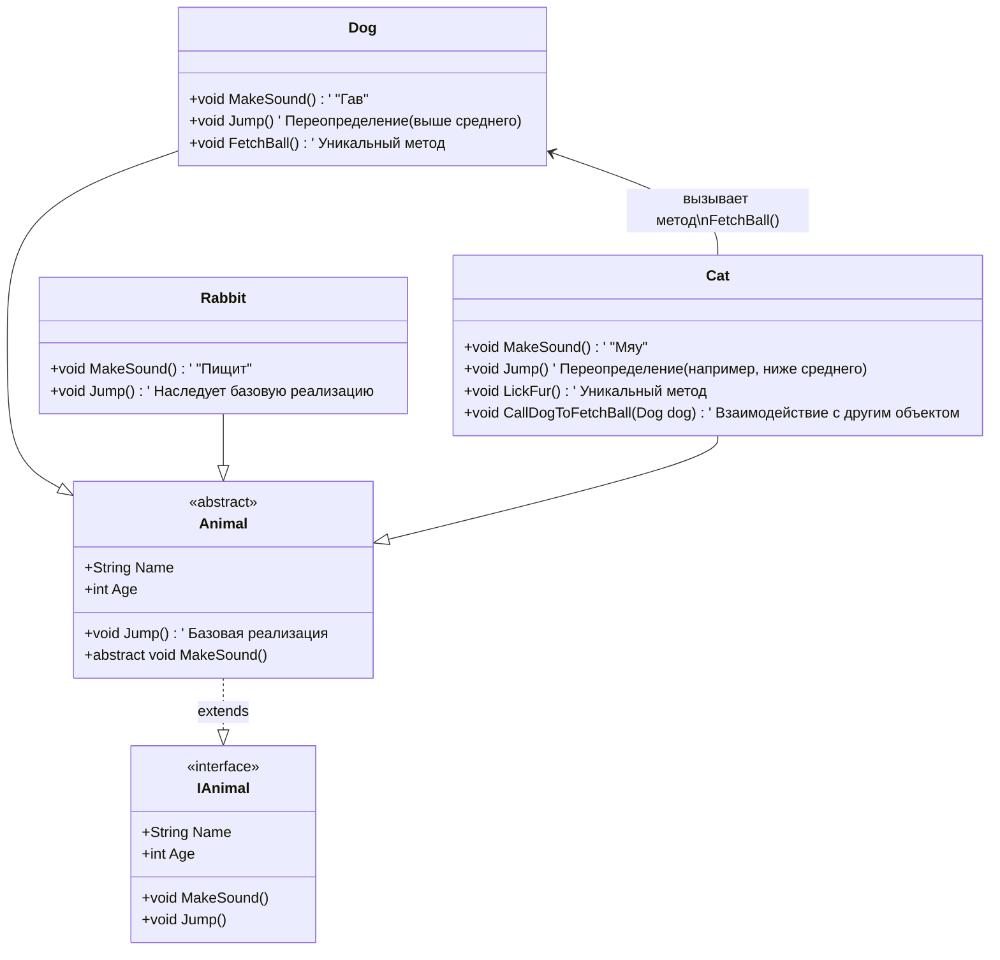

# Объектно-ориентированное программирование — итоги

  НЕ ОБЯЗАТЕЛЬНО
  ДЛЯ НОВИЧКОВ

Разработчику
Аналитику
Тестировщику
Архитектору
Инженеру

Кратко — что стоит унести из раздела **"Объектно-ориентированное программирование"**. Если пункт кажется туманным — откройте указанную главу или [оглавление](./intro).

---

## ООП на практике — одна история

Так, мы разобрались, что есть абстракция, инкапсуляция, наследование, полиморфизм. Как всё это работает на практике и зачем всё это нужно? Новичок может вообще не понять сути, ибо… а почему бы просто тупо не писать всё в одном классе? Давайте по порядку.

1. *Если будем писать всё в одном коде* — будут одинаковые названия методов, переменных и других элементов (или они станут слишком длинными и сложными для чтения), поэтому **придётся всё группировать** в какие-то логические блоки кода.

2. *Если мы будем их все писать в одном файле*, то когда код вырастет до тысяч строк, нам придётся мучаться. Поэтому, чтобы решить проблемы из пунктов 1 и 2 — давайте всё сгруппируем в блоки кода — **классы**. Чтобы всё не хранить в одном файле, каждый класс можно положить в отдельный одноимённый файл.

3. *Чтобы код из одного файла мог работать с кодом из другого файла* (читать свойства, вызывать методы), мы должны сделать их **публичными**, чтобы они были *видимы* и *доступны* другим.

4. Но *если какой-то элемент класса не используется никем, кроме самого класса*, то «публиковать» его и делать видимым — излишнее. Поэтому мы делаем их **приватными** или даже **защищёнными**.

5. *А если нужно, чтобы кому-то понадобился приватный элемент*, мы используем **геттеры** и **сеттеры** — заготовленные методы. Сеттер для изменения данных, геттер для получения. Если не хотим изменять, то убираем сеттер, оставляем геттер.

6. Представим, что *нам нужна логика издавания звуков животными*. Ок, сделали **кошку** и **собаку**. Потом добавили ещё и **кролика**. Теперь у нас есть три «зверька» — кошка, собака, кролик. Они все могут издавать какие-то звуки — кошка *мяукает*, собака *гавкает*, кролик *пищит*. Но что *если мы решим добавить к логике мяукания ещё и* **логику прыгания**? Да, мы добавим кошке, добавим собаке. **А кролику логику прыгания добавить забыли**. Программа успешно скомпилировалась, всё работает, собака и кошка прыгают, но лишь на тестировании заметили — *а почему кролик не прыгает?*

7. **Поэтому мы переделаем всё**. Мы сделаем **интерфейс IAnimal**, который описывает, что все его животные должны иметь определённые *свойства* (имя, возраст) и определённые *методы* (издавать звук и прыгать). Потом мы сделаем **абстрактный класс Animal**, который может содержать логику — звуки издают все по-разному, но прыгают все примерно одинаково, поэтому мы реализуем базовый метод `Jump()`. **Cat, Dog и Rabbit** — три конкретных класса-наследника, которые обязаны реализовать требования родителя. И если в Rabbit забудем прыжок — **программа выдаст ошибку компиляции**! **Эти требования и есть контракт**.

8. Чтобы *переопределить* прыжок для собаки (ведь она прыгает выше других), мы реализуем метод с другой внутренней логикой — это **переопределённый** метод. Аналогично можно скорректировать прыжок и для кошки.

9. Собака может *приносить мяч*, а кошка *вылизываться*. Это уникальные методы конкретных классов — кроме базовых наследуемых элементов, у класса могут быть свои.

10. Но это лишь классы — чертежи. Чтобы они стали конкретными, нужно создать **объекты** через **конструктор**.

11. Кошка может *позвать собаку, чтобы она принесла мячик* — тогда кошка вызывает метод **объекта** собаки: сначала `new Dog("Шарик")`, затем `Шарик.ПринестиМяч()`.

Так всё это и работает. Теперь мы можем создавать новые виды животных, а компилятор подскажет, что любое животное должно как минимум иметь имя, возраст, уметь издавать звуки и прыгать.

---

## FAQ — Часто задаваемые вопросы

Типичные ошибки и путаницы при первом ООП-проекте. Здесь — **практические ответы и ссылки на главы**; формулировки для самопроверки — в [чек-листе](./99.md).

  
Вопрос. Сделал один класс на всё приложение ("God object") — как понять, что пора дробить?

  
Ответ. Признаки — файл на тысячи строк, десятки несвязанных методов, изменение "про заказы" ломает "про отчёты". Делите по <strong>зонам ответственности</strong> предметной области. Подробнее здесь — [Сложность и декомпозиция](/encyclopedia/4-code-dev/4-08-oop/7), [Введение в ООП](/encyclopedia/4-code-dev/4-08-oop/1).

  
Вопрос. Преподаватель требует "всё в классах", а задача — посчитать сумму массива.

  
Ответ. ООП уместен, когда есть <strong>устойчивая модель объектов</strong> и срок жизни кода. Для разового расчёта достаточно функции; навязанный класс-утилита без состояния только мешает. Подробнее здесь — [Введение в ООП](/encyclopedia/4-code-dev/4-08-oop/1), [Парадигмы](/encyclopedia/4-code-dev/4-07-paradigmy-i-urovni-abstraktsii/1).

  
Вопрос. Два объекта с одинаковыми полями — <code>==</code> в Java/C# даёт false. Почему?

  
Ответ. Переменная часто хранит <strong>ссылку</strong>, а не копию объекта: сравниваются адреса, а не содержимое. Для значений по полям переопределяйте <code>equals</code>/<code>Equals</code> или сравнивайте нужные поля явно. Подробнее здесь — [Введение в ООП](/encyclopedia/4-code-dev/4-08-oop/1).

  
Вопрос. Изменил объект через одну переменную — "сломалось" в другой части программы.

  
Ответ. Обе переменные указывают на <strong>один экземпляр</strong>. Нужны копии (клон, конструктор копирования) или неизменяемые объекты, если разделять состояние нельзя. Подробнее здесь — [Введение в ООП](/encyclopedia/4-code-dev/4-08-oop/1).

  
Вопрос. На каждое поле написал геттер и сеттер — код раздулся, пользы мало.

  
Ответ. Инкапсуляция — про <strong>инварианты и границы</strong>, а не про пару методов на поле. Скрывайте то, что нельзя менять снаружи; оставляйте осмысленные операции ("забронировать", "отменить"). Подробнее здесь — [Инкапсуляция](/encyclopedia/4-code-dev/4-08-oop/3).

  
Вопрос. <code>public</code> поля "для простоты" — коллега меняет цену в минус.

  
Ответ. Открытое поле не может отклонить неверное значение. Используйте <strong>закрытое поле + свойство/метод</strong> с проверкой или тип, который не допускает некорректное состояние. Подробнее здесь — [Инкапсуляция](/encyclopedia/4-code-dev/4-08-oop/3).

  
Вопрос. Наследовался от класса ради одного метода — иерархия разрослась.

  
Ответ. Наследование связывает типы жёстко. Для переиспользования поведения чаще подходит <strong>композиция</strong> (поле-делегат, стратегия). Подробнее здесь — [Наследование](/encyclopedia/4-code-dev/4-08-oop/4), [Полиморфизм](/encyclopedia/4-code-dev/4-08-oop/5).

  
Вопрос. Вызов метода у родителя, а выполнился код потомка — "магия", не понимаю цепочку.

  
Ответ. Это <strong>динамическое связывание</strong>: реальный тип объекта в runtime выбирает переопределённую версию. Статический тип переменной может быть базовым. Подробнее здесь — [Полиморфизм](/encyclopedia/4-code-dev/4-08-oop/5).

  
Вопрос. Перегрузил метод, компилятор ругается "неоднозначный вызов".

  
Ответ. Несколько перегрузок подходят одновременно — уточните типы аргументов, приведите литералы (<code>1.0</code> vs <code>1</code>) или переименуйте методы с разным смыслом. Подробнее здесь — [Полиморфизм](/encyclopedia/4-code-dev/4-08-oop/5).

  
Вопрос. Путаю переопределение (<code>override</code>) и перегрузку (<code>overload</code>).

  
Ответ. Перегрузка — разные сигнатуры в одном классе, выбор на этапе компиляции. Переопределение — та же сигнатура в иерархии, выбор по <strong>фактическому типу объекта</strong>. Подробнее здесь — [Полиморфизм](/encyclopedia/4-code-dev/4-08-oop/5).

  
Вопрос. Абстрактный класс или интерфейс — что выбрать в Java/C#?

  
Ответ. Интерфейс — <strong>контракт роли</strong> без обязательной общей реализации; абстрактный класс — общая база с полями и частичной реализацией. Множественное наследование типов чаще через интерфейсы. Подробнее здесь — [Абстракция](/encyclopedia/4-code-dev/4-08-oop/2).

  
Вопрос. Забыл вызвать <code>super()</code> в конструкторе потомка — странные нули в полях.

  
Ответ. Сначала должен отработать конструктор <strong>базового класса</strong>, иначе поля родителя не инициализированы. В некоторых языках вызов вставляется автоматически, в других — обязателен явно. Подробнее здесь — [Введение в ООП](/encyclopedia/4-code-dev/4-08-oop/1).

  
Вопрос. <code>null</code> / <code>None</code> при вызове метода — падение, хотя "объект был".

  
Ответ. Ссылка пустая: объект не создан или уже освобождён. Проверяйте до вызова, используйте optional-типы, фабрики, которые не отдают пустоту без договорённости. Подробнее здесь — [Введение в ООП](/encyclopedia/4-code-dev/4-08-oop/1).

  
Вопрос. Строковые константы вместо enum — опечатка в статусе заказа прошла в прод.

  
Ответ. <strong>Enum</strong> ограничивает допустимый набор, ловится компилятором/линтером, удобен в <code>switch</code>. Строки оставляйте для внешних API с явной валидацией. Подробнее здесь — [Перечисления](/encyclopedia/4-code-dev/4-08-oop/6).

  
Вопрос. Храню всё в <code>ArrayList</code> без типа — ClassCastException в runtime.

  
Ответ. Используйте <strong>обобщённые коллекции</strong> (<code>List&lt;Order&gt;</code>), чтобы ошибка типа всплыла при компиляции. Сырые коллекции — наследие старых API. Подробнее здесь — [Коллекции](/encyclopedia/4-code-dev/4-08-oop/61).

  
Вопрос. Удалил объект из списка в цикле foreach — ConcurrentModificationException.

  
Ответ. Менять коллекцию во время обхода итератором нельзя. Соберите элементы на удаление отдельно, используйте <code>removeIf</code> или итерируйте с итератором <code>remove()</code>. Подробнее здесь — [Коллекции](/encyclopedia/4-code-dev/4-08-oop/61).

  
Вопрос. Память растёт, хотя объекты "уже не нужны" — утечка через события?

  
Ответ. Подписчик держит ссылку на издателя (или наоборот). Отписывайтесь при уничтожении формы/контроллера, используйте слабые ссылки там, где это поддерживает платформа. Подробнее здесь — [Введение в ООП](/encyclopedia/4-code-dev/4-08-oop/1), [Сборка мусора](/encyclopedia/4-code-dev/4-15-sborka-musora/1).

  
Вопрос. Финализатор/destructor не вызывается вовремя — файл всё ещё занят.

  
Ответ. Освобождение ресурсов полагайте на <strong><code>using</code>, try-with-resources, <code>dispose</code></strong>, а не на сборщик мусора. GC не гарантирует момент вызова финализатора. Подробнее здесь — [Введение в ООП](/encyclopedia/4-code-dev/4-08-oop/1).

  
Вопрос. "Сокрытие" и "инкапсуляция" в учебнике — одно слово?

  
Ответ. В ряде школ <strong>сокрытие</strong> (<code>private</code>) — способ достичь инкапсуляции (целостность объекта), но инкапсуляция шире: объединение данных и поведения. Подробнее здесь — [Инкапсуляция](/encyclopedia/4-code-dev/4-08-oop/3).

  
Вопрос. Интерфейс с одним методом — зачем не просто функция?

  
Ответ. Контракт позволяет подставлять <strong>разные реализации</strong> в полиморфный код и тестировать через заглушки; в языках с функциональными типами роль близка к типу функции. Подробнее здесь — [Абстракция](/encyclopedia/4-code-dev/4-08-oop/2), [Зависимости](/encyclopedia/4-code-dev/4-09-zavisimosti/11).

  
Вопрос. Go/Rust "без классического ООП" — значит раздел бесполезен?

  
Ответ. Идеи <strong>инкапсуляции, контрактов, композиции</strong> переносятся на структуры, трейты, интерфейсы. Синтаксис другой, вопросы границ модулей те же. Подробнее здесь — [О разделе](/encyclopedia/4-code-dev/4-08-oop/intro).

  
Вопрос. Скопировал объект — изменил копию, оригинал тоже изменился (вложенные списки).

  
Ответ. Поверхностная копия делит <strong>вложенные ссылки</strong>. Нужна глубокая копия или неизменяемые вложенные структуры. Подробнее здесь — [Введение в ООП](/encyclopedia/4-code-dev/4-08-oop/1).

  
Вопрос. Статический метод вызываю как <code>obj.method()</code> — работает, но путает.

  
Ответ. Статика принадлежит <strong>типу</strong>, не экземпляру; вызов через объект вводит в заблуждение. Пишите <code>ClassName.method()</code> для ясности. Подробнее здесь — [Введение в ООП](/encyclopedia/4-code-dev/4-08-oop/1).

  
Вопрос. Паттерн Singleton везде — тесты стали зависимыми друг от друга.

  
Ответ. Глобальное состояние ломает изоляцию тестов. Предпочитайте <strong>внедрение зависимости</strong> с контролируемым жизненным циклом. Подробнее здесь — [Зависимости](/encyclopedia/4-code-dev/4-09-zavisimosti/12), [паттерны](/encyclopedia/7-project/7-06-proektirovanie-i-arhitektura/design-patterns/141).

  
Вопрос. DTO и "настоящая" доменная сущность — в одном классе, логика размазана.

  
Ответ. Объект передачи данных не обязан нести бизнес-правила. Разделяйте <strong>модель экрана/API</strong> и объект предметной области, иначе ORM и UI тянут класс в разные стороны. Подробнее здесь — [Абстракция](/encyclopedia/4-code-dev/4-08-oop/2), [ORM](/encyclopedia/4-code-dev/4-10-orm-i-rabota-s-dannymi/1).

  
Вопрос. Не понимаю, зачем сначала статья про сложность (7), если хочется сразу синтаксис классов.

  
Ответ. ООП решает проблему <strong>роста сложности</strong>; без границ модулей классы превращаются в мелкие процедуры с <code>this</code>. Сначала — зачем объекты, потом — как писать. Подробнее здесь — [Сложность и декомпозиция](/encyclopedia/4-code-dev/4-08-oop/7).

  
Вопрос. JavaScript: объект литерал — это уже "класс"?

  
Ответ. Литерал — экземпляр с полями; <strong>класс/es6 class</strong> задаёт шаблон и прототипную цепочку. Для переиспользования и полиморфизма нужен общий прототип или class. Подробнее здесь — [Объекты в JavaScript](/encyclopedia/5-languages/5-01-javascript/22).

  
Вопрос. После курса ООП боюсь процедурного кода в утилитах — это откат?

  
Ответ. Нет. Зрелый код <strong>смешает стили по задаче</strong>: скрипт импорта — процедура, ядро заказов — объекты. Подробнее здесь — [Парадигмы](/encyclopedia/4-code-dev/4-07-paradigmy-i-urovni-abstraktsii/1).

### Частые поисковые запросы

  
Вопрос. Что такое ООП простыми словами?

  
Ответ. Моделирование программы через <strong>объекты</strong> с данными и поведением, объединёнными в типы (классы). Подробнее здесь — [Введение в ООП](/encyclopedia/4-code-dev/4-08-oop/1).

  
Вопрос. Чем класс отличается от объекта?

  
Ответ. Класс — <strong>шаблон</strong>; объект — конкретный экземпляр в памяти. Подробнее здесь — [Введение в ООП](/encyclopedia/4-code-dev/4-08-oop/1).

  
Вопрос. Четыре столпа ООП — какие это принципы?

  
Ответ. Абстракция, инкапсуляция, наследование, полиморфизм (в учебниках формулировки слегка различаются). Подробнее здесь — [Абстракция](/encyclopedia/4-code-dev/4-08-oop/2), [Инкапсуляция](/encyclopedia/4-code-dev/4-08-oop/3), [Наследование](/encyclopedia/4-code-dev/4-08-oop/4), [Полиморфизм](/encyclopedia/4-code-dev/4-08-oop/5).

  
Вопрос. Инкапсуляция, наследование, полиморфизм, абстракция — кратко.

  
Ответ. Сокрытие и целостность объекта; повторное использование через иерархию; один интерфейс — разные реализации; выделение существенного. Подробнее здесь — [о разделе](/encyclopedia/4-code-dev/4-08-oop/intro).

  
Вопрос. Абстрактный класс и интерфейс — в чём разница?

  
Ответ. Абстрактный класс может хранить состояние и частичную реализацию; интерфейс задаёт <strong>контракт роли</strong>, часто без полей. Подробнее здесь — [Абстракция](/encyclopedia/4-code-dev/4-08-oop/2).

  
Вопрос. Множественное наследование в Java и C# — можно ли?

  
Ответ. Java — несколько интерфейсов, один класс. C# — то же; от классов множественное наследование запрещено. Подробнее здесь — [Наследование](/encyclopedia/4-code-dev/4-08-oop/4).

  
Вопрос. Diamond problem (ромбовидная проблема) — что это?

  
Ответ. Конфликт при наследовании от двух веток с общим предком — неясно, чей метод вызывать. Решают через интерфейсы и явное разрешение. Подробнее здесь — [Наследование](/encyclopedia/4-code-dev/4-08-oop/4).

  
Вопрос. Виды полиморфизма в программировании.

  
Ответ. Подтипы (динамический), перегрузка (ad hoc), обобщения (generics). Подробнее здесь — [Полиморфизм](/encyclopedia/4-code-dev/4-08-oop/5).

  
Вопрос. Перегрузка и переопределение методов — разница.

  
Ответ. Перегрузка — разные параметры в одном классе; переопределение — та же сигнатура в наследнике, выбор по типу объекта. Подробнее здесь — [Полиморфизм](/encyclopedia/4-code-dev/4-08-oop/5).

  
Вопрос. Конструктор класса — что это и зачем?

  
Ответ. Метод, который <strong>инициализирует объект</strong> при создании и задаёт инварианты. Подробнее здесь — [Введение в ООП](/encyclopedia/4-code-dev/4-08-oop/1).

  
Вопрос. Геттеры и сеттеры — зачем нужны?

  
Ответ. Контроль доступа к полям, валидация, возможность менять внутреннее представление без ломки API. Подробнее здесь — [Инкапсуляция](/encyclopedia/4-code-dev/4-08-oop/3).

  
Вопрос. God object — антипаттерн, что делать?

  
Ответ. Разбить на классы по <strong>зонам ответственности</strong>, ввести сервисы и value objects. Подробнее здесь — [Сложность и декомпозиция](/encyclopedia/4-code-dev/4-08-oop/7).

  
Вопрос. Composition over inheritance — что значит?

  
Ответ. Предпочитайте <strong>включение объектов</strong> (has-a) вместо глубоких деревьев наследования (is-a), где поведение комбинируется. Подробнее здесь — [Наследование](/encyclopedia/4-code-dev/4-08-oop/4), [паттерны](/encyclopedia/7-project/7-06-proektirovanie-i-arhitektura/design-patterns/141).

  
Вопрос. Enum в программировании — зачем не строки?

  
Ответ. Закрытый набор констант, проверка на этапе компиляции, удобный <code>switch</code>. Подробнее здесь — [Перечисления](/encyclopedia/4-code-dev/4-08-oop/6).

  
Вопрос. List и Array — чем отличаются коллекции?

  
Ответ. Массив фиксированного размера; список динамический, с операциями вставки/удаления. Оба могут хранить ссылки на объекты. Подробнее здесь — [Коллекции](/encyclopedia/4-code-dev/4-08-oop/61).

  
Вопрос. Garbage collection — как связан с объектами?

  
Ответ. Среда освобождает память, когда на объект <strong>нет достижимых ссылок</strong>. Ресурсы (файлы) всё равно закрывайте явно. Подробнее здесь — [Введение в ООП](/encyclopedia/4-code-dev/4-08-oop/1), [сборка мусора](/encyclopedia/4-code-dev/4-15-sborka-musora/1).

  
Вопрос. ООП в Python для начинающих — с чего начать?

  
Ответ. Сначала класс, <code>__init__</code>, методы, затем наследование. Подробнее здесь — [ООП в Python](/encyclopedia/5-languages/5-02-python/26), [Введение в ООП](/encyclopedia/4-code-dev/4-08-oop/1).

  
Вопрос. ООП или функциональное программирование — что лучше?

  
Ответ. Зависит от задачи: объекты для бизнес-модели, функции для потоков данных. Языки часто совмещают оба подхода. Подробнее здесь — [Парадигмы](/encyclopedia/4-code-dev/4-07-paradigmy-i-urovni-abstraktsii/1), [Полиморфизм](/encyclopedia/4-code-dev/4-08-oop/5).

  
Вопрос. Модификаторы доступа private, public, protected.

  
Ответ. <code>public</code> — всем; <code>private</code> — только класс; <code>protected</code> — класс и наследники. Подробнее здесь — [Инкапсуляция](/encyclopedia/4-code-dev/4-08-oop/3).

  
Вопрос. Immutable object — неизменяемый объект, зачем?

  
Ответ. Безопасность в многопоточности, предсказуемость, удобство как ключа. Пример — строки в Java. Подробнее здесь — [Введение в ООП](/encyclopedia/4-code-dev/4-08-oop/1).

  
Вопрос. Factory method — паттерн, когда применять?

  
Ответ. Когда создание объекта сложное или нужно <strong>скрыть конкретный класс</strong> за интерфейсом. Подробнее здесь — [паттерны GoF](/encyclopedia/7-project/7-06-proektirovanie-i-arhitektura/design-patterns/141), [Абстракция](/encyclopedia/4-code-dev/4-08-oop/2).

  
Вопрос. Когда ООП не нужно и вредно?

  
Ответ. Короткие скрипты, чистые функции над данными, конвейеры ETL без долгоживущей модели. Подробнее здесь — [Сложность и декомпозиция](/encyclopedia/4-code-dev/4-08-oop/7).

  
Вопрос. Ссылочный тип и значение — в чём разница?

  
Ответ. Объекты в куче передаются по <strong>ссылке</strong>; примитивы в Java/C# часто копируются по значению (в C# есть struct). Подробнее здесь — [Введение в ООП](/encyclopedia/4-code-dev/4-08-oop/1).

  
Вопрос. this и super в ООП — зачем?

  
Ответ. <code>this</code> — текущий объект; <code>super</code> — вызов реализации родителя (конструктор или метод). Подробнее здесь — [Наследование](/encyclopedia/4-code-dev/4-08-oop/4).

---

## Что запомнить

**ООП** — методология моделирования предметной области через типы (классы), их экземпляры и иерархию наследования. Программа — совокупность объектов, обменивающихся данными через методы или сообщения. Структурирование опирается на **абстрагирование**, **инкапсуляцию**, **наследование** и **модульность**; для полноценного ООП-языка нужен ещё **полиморфизм подтипов** ([определение](./1.md#определение-парадигмы)).

Каждый объект объединяет состояние (атрибуты) и поведение (методы). **Класс** — абстрактный тип данных (АДТ) и шаблон экземпляров; **объект** — значение этого типа в памяти; переменная обычно хранит **ссылку** на объект.

Класс выступает в роли шаблона или чертежа: он определяет структуру и поведение, но не содержит конкретных данных. Объект — это экземпляр класса, размещённый в памяти, обладающий собственным состоянием и способный выполнять действия. Переменная хранит ссылку на объект, а не сам объект, что позволяет гибко управлять жизненным циклом и передавать объекты между частями программы.

Четыре фундаментальных принципа ООП образуют целостную систему:

**Абстракция** выделяет существенное и отделяет контракт ("что") от реализации ("как"). **Абстракция данных (АДТ)** — тот же принцип на уровне типа: набор операций без раскрытия внутреннего представления. Инструменты — интерфейсы, абстрактные классы, публичные методы ([статья](./2.md)).

**Инкапсуляция** объединяет данные и методы в классе и управляет доступом снаружи. **Сокрытие** (`private`, свойства) — частый способ инкапсуляции, но понятия различают в ряде школ ООП ([статья](./3.md)).

**Наследование** обеспечивает повторное использование кода и построение иерархий типов. Подкласс наследует свойства и методы базового класса, может расширять их новой функциональностью или переопределять существующую. Абстрактные классы и интерфейсы служат основой для полиморфизма, задавая общее поведение для группы связанных классов. Множественное наследование ограничено во многих языках из-за потенциальных конфликтов, но интерфейсы позволяют достичь аналогичной гибкости без рисков.

**Полиморфизм подтипов** — единый интерфейс базового типа, разные реализации у наследников (динамическое связывание). **Перегрузка** — ad hoc-полиморфизм (одно имя, разные параметры). **Обобщения (generics)** — параметрический полиморфизм ([полиморфизм](./5.md), [теория обобщений](/encyclopedia/4-code-dev/4-07-paradigmy-i-urovni-abstraktsii/114)).

**Enum** и **коллекции** — вспомогательные АДТ: закрытый набор констант ([Перечисления](./6.md)) и контейнер с единым интерфейсом к группе объектов ([Коллекции](./61.md)). Они поддерживают типизацию, модульность и полиморфные контейнеры (`List<БазовыйТип>`).

Жизненный цикл объекта — от создания через конструктор до уничтожения сборщиком мусора — управляется средой выполнения, что освобождает разработчика от ручного управления памятью в большинстве современных языков. Конструкторы инициализируют состояние объекта, гарантируя его корректность с момента рождения.

Связь ООП со **сложностью ПО и декомпозицией** — в [отдельной статье](./7.md).

ООП не является единственной парадигмой, но его принципы глубоко пронизывают современную разработку. Даже в мультипарадигменных языках ООП остаётся основным способом организации бизнес-логики и моделирования предметной области. Освоение ООП — это развитие способности мыслить категориями объектов, их взаимодействия и ответственности.

---

## Куда идти дальше

| Тема | Раздел |
|------|--------|
| Частые паттерны GoF (Factory, Observer, Strategy…) | [Частые паттерны GoF в реальных проектах](/encyclopedia/7-project/7-06-proektirovanie-i-arhitektura/design-patterns/141) |
| "Парадигмы и уровни абстракции — о разделе" | ["Парадигмы и уровни абстракции — о разделе"](/encyclopedia/4-code-dev/4-07-paradigmy-i-urovni-abstraktsii/intro) |
| "Зависимости — о разделе" | ["Зависимости — о разделе"](/encyclopedia/4-code-dev/4-09-zavisimosti/intro) |
| "Архитектура выполнения — о разделе" | ["Архитектура выполнения — о разделе"](/encyclopedia/4-code-dev/4-06-arhitektura-vypolneniya/intro) |
| "ORM и работа с данными — о разделе" | ["ORM и работа с данными — о разделе"](/encyclopedia/4-code-dev/4-10-orm-i-rabota-s-dannymi/intro) |

Проверьте себя: [Чек-лист самопроверки](./99.md).

---
