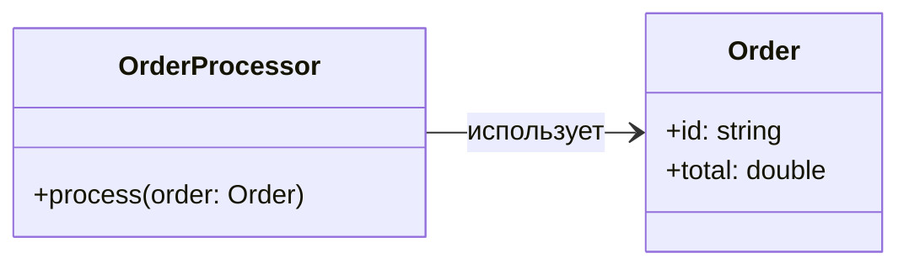
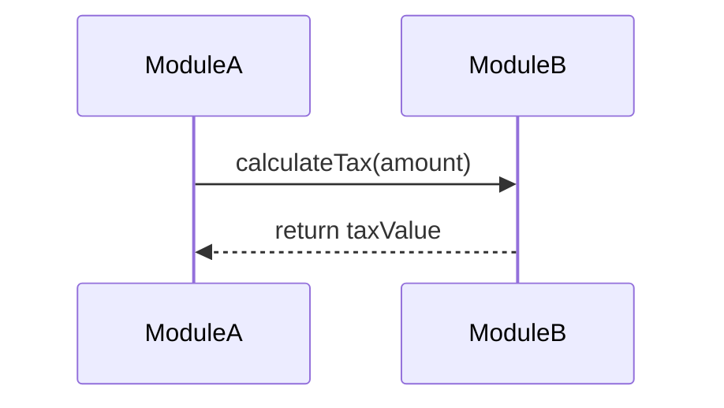
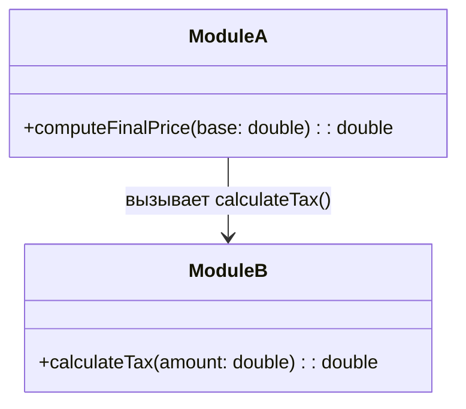
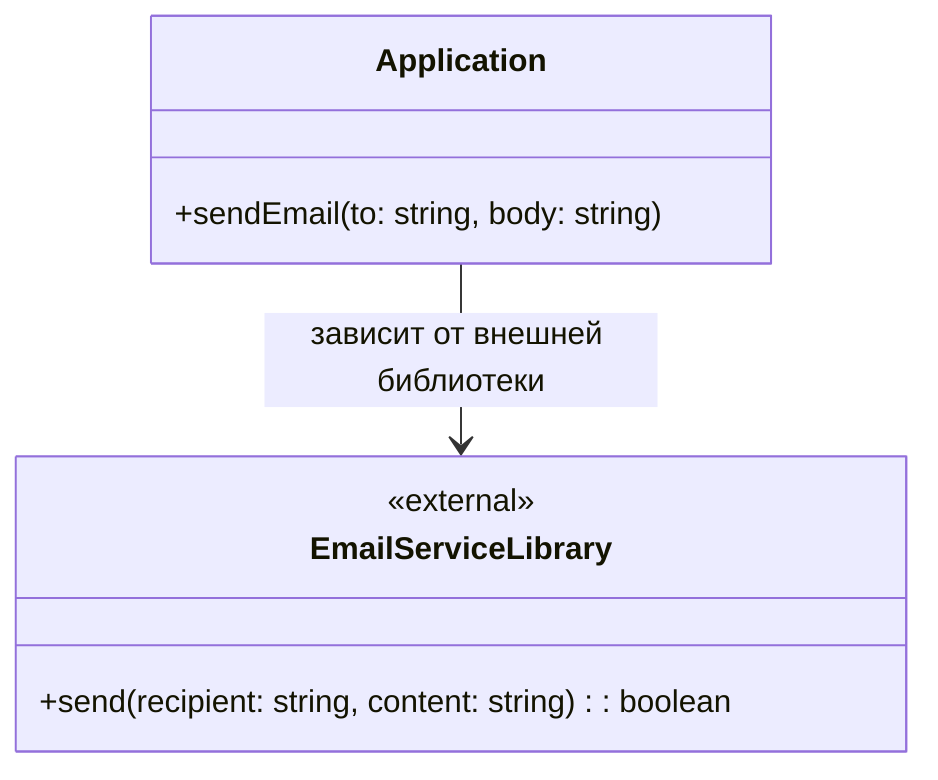
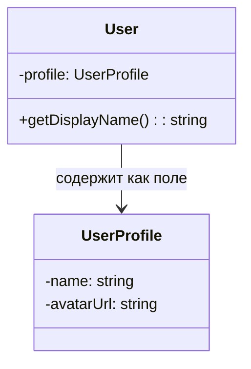
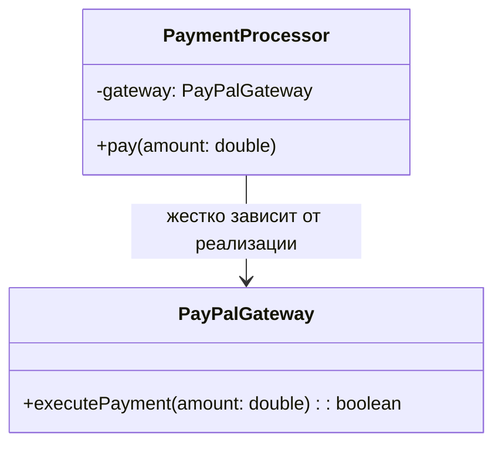
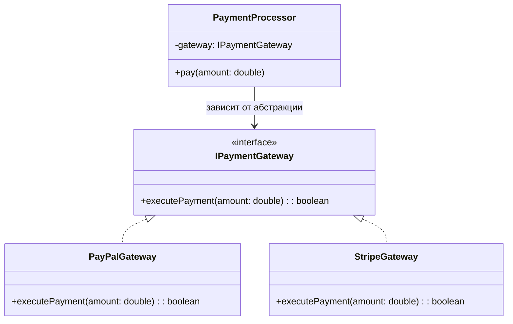

# Управление зависимостями в программных проектах

<div class="article-tags">
  <span class="tag tag-required">ОБЯЗАТЕЛЬНО</span>
  <span class="tag tag-beginner">ДЛЯ НОВИЧКОВ</span>
</div>

<span class="complexity-badge">Разработчику</span>
<span class="complexity-badge">Архитектору</span>
<span class="complexity-badge">Инженеру</span>

## Управление зависимостями в программных проектах

### Понятие зависимости

В программировании часто придётся сталкиваться с термином «зависимости», причем применяемом в разных ситуациях.

**Зависимость** - это ситуация, когда один компонент (класс, модуль, функция) полагается на другой, чтобы выполнять свою работу. Простыми словами, если A использует B, то A зависит от B. И получается, что A будет «зависимым», а B будет «зависимостью».

```text
если модуль_A вызывает модуль_B то
  граф_зависимостей добавить ребро A → B
конец

АЛГОРИТМ МожноЛиСобратьПроект(граф)
  для каждого компонент в граф
    если нет пути к нужным зависимостям компонент то
      вернуть ошибка("не хватает библиотеки или модуля")
    конец
  конец
  вернуть успех
КОНЕЦ
```

| Обозначение | Смысл |
|-------------|--------|
| `A → B` | A не работает без B |
| `МожноЛиСобратьПроект` | Аналог разрешения зависимостей в Maven, npm, NuGet |

Зависимости рождаются из связей - когда класс A связывается с классом B, между ними устанавливается связь, словно невидимая цепь, при разрыве которой функциональность зависимого компонента будет повреждена, ведь связь становится его частью.

Вроде бы логично - ребенок не может уйти от родителей, ведь зависим от них, или работник не может уйти, так как зависит от работодателя, но как только ребенок решит вопрос, став независимым или переключив зависимость (на другого работодателя, к примеру), то лишь тогда зависимость от первичного компонента исчезает. Но в программировании зачастую зависимость убирать будет крайне невыгодно, и нужно как-то всё это упорядочивать.

---

## Примеры зависимостей

### ClassDep

Класс использует другой класс;

OrderProcessor зависит от Order, так как принимает объект Order как параметр в методе process().

---

### FuncCall

Функция вызывает другую функцию из другого модуля;

Функция в ModuleA вызывает функцию calculateTax из ModuleB. Зависимость возникает через вызов.



---

### LibImport

Модуль использует импортируемую библиотеку;


Application зависит от сторонней библиотеки EmailServiceLibrary. Метка `<<external>>` подчеркивает, что это внешний компонент. 

---

### FieldRef

Класс использует поле/свойство другого класса;


Класс User имеет ссылку на UserProfile как на внутреннее поле — это агрегация и прямая зависимость.

---

### TightCoupling

Класс знает конкретную реализацию интерфейса.


PaymentProcessor напрямую зависит от конкретной реализации PayPalGateway, что делает систему менее гибкой. Это пример тугой (tight) зависимости.

```text
КЛАСС ОбработчикПлатежей
  поле шлюз := новый PayPalШлюз()    // нельзя подменить без правки класса
  метод Оплатить(сумма)
    шлюз.Провести(сумма)
  конец
КОНЕЦ
```

А если PaymentProcessor зависит от абстракции IPaymentGateway, а не от конкретной реализации, то это позволит заменять провайдеров:

```text
КЛАСС ОбработчикПлатежей
  поле шлюз: ИнтерфейсПлатёжногоШлюза
  конструктор(шлюз)
  метод Оплатить(сумма) шлюз.Провести(сумма)
КОНЕЦ
```



---


## Типы зависимостей

Можно выделить следующие типы зависимостей:

| Тип зависимости | Описание | Пример |
| --- | --- | --- |
|Модульная	|Один модуль зависит от другого.	|Модуль аутентификации auth зависит от модуля базы данных database. В модуль auth потребуется импортировать модуль database.
|Классовая	|Класс использует другой класс.	|OrderService использует PaymentGateway.
|Библиотечная	|Проект зависит от внешней библиотеки.	|На этапе разработки к проекту подключается внешняя библиотека для поддержки дополнительного функционала.
|Зависимость данных	|Зависимость от структуры данных - если данные будут несоответствующими структуре, они не будут используемыми.	|Парсинг ответа от API с жёсткой структурой JSON/XML.
|Инфраструктурная	|Зависимость от СУБД, файловой системы, сети.	|Модуль записи данных в файл зависит от файловой системы ОС.

---

## Виды связей

### Прямая зависимость (A → B)

Когда компонент A явно использует (вызывает, создаёт, наследует) компонент B, то это явление будет называться прямой зависимостью.
Прямые зависимости делают код жёстко связанным (tightly coupled). Если B изменится, A может сломаться.

Простейший пример - наследник. Тот самый класс Cat, наследник класса Animal. Если «сломать» Animal, то Cat станет непригодным и повлечет за собой ошибки компиляции. Иногда это может быть логичным, если базовый класс наоборот, получает новый метод, который будут обязаны реализовать все наследники.

---

### Обратная зависимость (B ← A, но через абстракцию)

Такой термин используются реже, так как под ним подразумевают инверсию зависимости (Dependency Inversion Principle), один из важнейших принципов SOLID.

Суть заключается в том, что:
	- A зависит не от конкретного B, а от абстракции (интерфейса);
	- Тогда B реализует эту абстракцию, и зависимость становится обратной - B подстраивается под A.

Пример DIP на псевдокоде:

```text
ИНТЕРФЕЙС Сервис
  метод ВыполнитьРаботу()
КОНЕЦ

КЛАСС МодульA
  поле сервис: Сервис
  конструктор(сервис)
  метод Действие()
    сервис.ВыполнитьРаботу()
  конец
КОНЕЦ

КЛАСС МодульB РЕАЛИЗУЕТ Сервис
  метод ВыполнитьРаботу() …
КОНЕЦ

// A и B зависят от абстракции, а не друг от друга напрямую
a := новый МодульA(новый МодульB())
```

**Справочно на Java**

У нас есть абстракция (интерфейс) с названием Service и методом doWork():

```java
interface Service {
    void doWork();
}
```
Также у нас есть класс A и класс B. A зависит от абстракции Service, а не от конкретного B:
```java
class A {
    private Service service;
    
    A(Service service) {  // Зависимость через интерфейс
        this.service = service;
    }
}
```
Класс B, в свою очередь, реализует интерфейс Service (это и есть обратная связь) и переопределяет его метод doWork:
```java
class B implements Service {
    @Override
    public void doWork() {
        System.out.println("B работает");
    }
}
```
И теперь можно подменить B на другую реализацию:
```java
class C implements Service { ... }
```
Но мы ещё углубимся в этот вид отдельно позже. Давайте вернёмся к видам связей.

---

### Двунаправленная зависимость (A ↔ B)

Это когда два класса зависят друг от друга. Думаю, тут очевидно - у обоих классов есть методы, которые ссылаются друг на друга, устанавливая зависимость от изменений обоих классов, в отличие от прямой связи (которая является односторонней), если изменить, «испортить» любую из сторон, поломаются оба.

---

### Косвенная зависимость (A → C → B)

Как можно понять, здесь A зависит от B не напрямую, а через промежуточный компонент C.

```text
КЛАСС B …
КЛАСС C
  метод Работа() вызвать B.метод()
КОНЕЦ
КЛАСС A
  метод Работа() вызвать C.Работа()
КОНЕЦ
```

Пример — у нас есть класс B, класс C и класс A. Класс A использует класс C, а класс C использует класс B. И если класс B повредится, то класс A испортится, хотя прямой связи между A и B нет.

У косвенной зависимости может быть проблема скрытой зависимости - когда неочевидно, что A зависит от B.

---

### Динамическая зависимость (через IoC/DI)

Здесь подразумевается, что зависимость не жёстко вшита в код, а внедряется извне (это называется Dependency Injection).

Жёсткие зависимости часто называют «hard-code», или «хард-код». Их сложно тестировать, сложно менять, а изменения в одном месте ломают другое (как можно заметить из прочих видов зависимостей), и задача программиста - снижать связанность, сделать зависимости гибкими, управляемыми, заменимыми. Для этого и существуют специальная динамическая зависимость.


---
