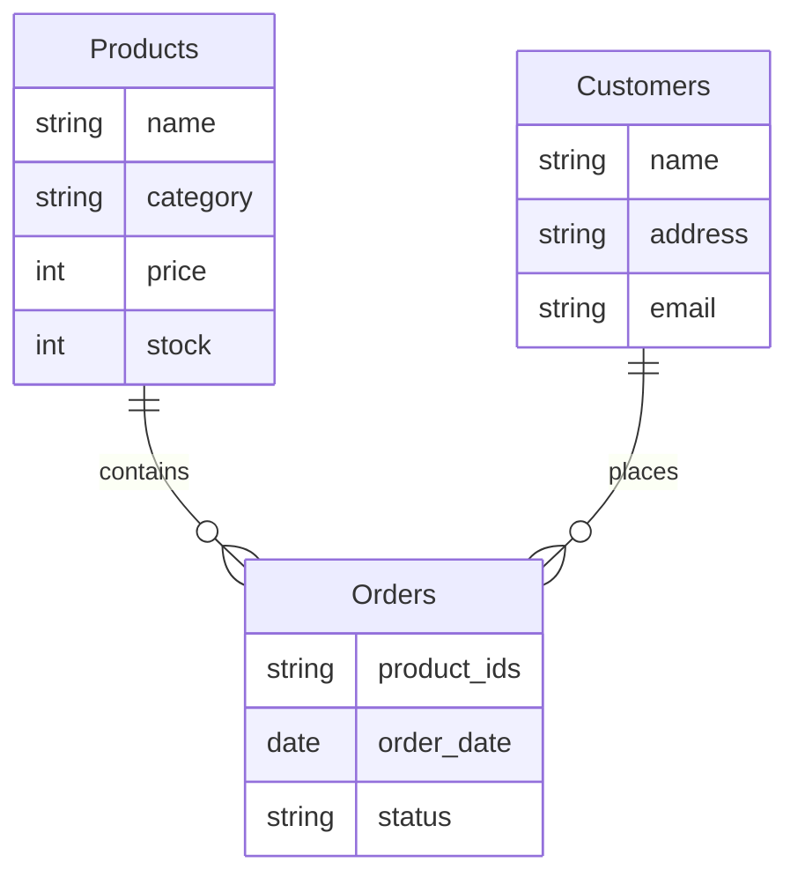
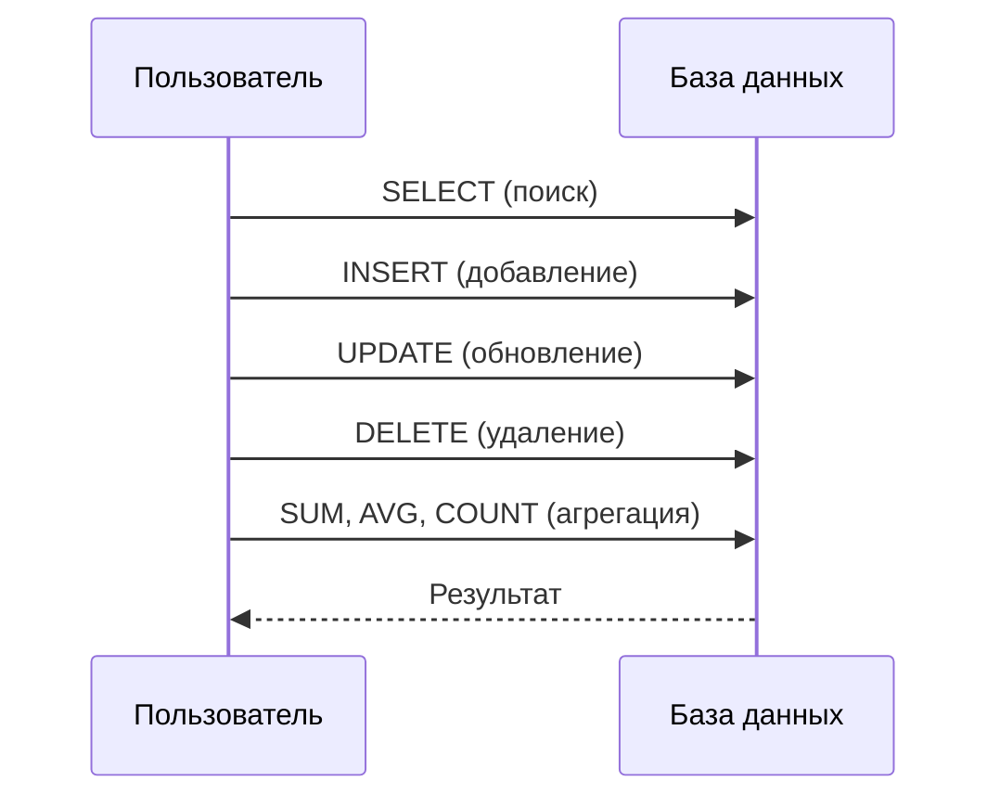
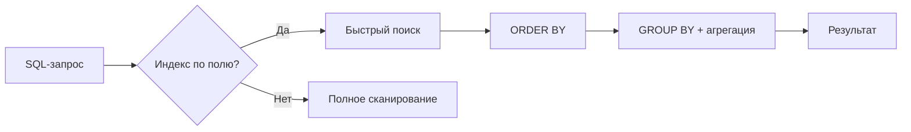

# Работа приложений с базами данных

<div class="article-tags">
  <span class="tag tag-required">ОБЯЗАТЕЛЬНО</span>
  <span class="tag tag-beginner">ДЛЯ НОВИЧКОВ</span>
</div>

<span class="complexity-badge">Разработчику</span>
<span class="complexity-badge">Аналитику</span>
<span class="complexity-badge">Тестировщику</span>  
<span class="complexity-badge">Архитектору</span>
<span class="complexity-badge">Инженеру</span>

## Работа приложений с базами данных

Теперь поговорим о том, как работают с данными в программировании. Так, мы изучили объектно-ориентированное программирование (ООП) и изучили реляционные базы данных (SQL), определили, что есть программирование логики, а есть хранение и обработка данных.

Но как программы взаимодействуют с базами данных?

Прежде, чем мы перейдём к особенностям различных языков программирования, нам нужно изучить универсальный подход по работе с базой данных.

И для этого нужно ещё раз пробежаться по SQL с точки зрения практического применения. Мы изучили функционал. А на практике как? 

---

## Задачи

**★ Какие задачи решает база данных?**
- хранение данных;
- выбор данных;
- добавление данных;
- изменение данных;
- удаление данных.
- подсчёт данных;
- сортировка, группировка и многие другие функции.

Давайте разберём эти задачи.

### Хранение данных

БД предназначены для надёжного хранения информации. Они обеспечивают структурированное представление данных, что позволяет легко находить, изменять и управлять ими.

Пример - интернет-магазин может хранить информацию о товарах, клиентах, заказах и платежах - и всё это будет в разных таблицах, связанных между собой.

---

| Название | Цена | Количество |
| :--- | :--- | :--- |
| Товар1 | 100 | 53 |
| Товар2 | 200 | 96 |
| Товар3 | 300 | 11 |

| Имя | Адрес | EMail |
| :--- | :--- | :--- |
| Иванов | Москва | 1@mail.ru |
| Петров | Казань | 2@mail.ru |
| Сидоров | Уфа | 3@mail.ru |

| Товары | Дата | Статус |
| :--- | :--- | :--- |
| 1, 2, 3 | 25.05.2025 | Готов |
| 1 | 14.02.2024 | Готов |
| 3 | 22.06.2025 | Готов |

---



---

И SQL как раз позволяет выполнять какие-то операции - поиск, добавление, обновление, удаление, агрегация.



Разберём подробнее.

---

### Выбор данных

БД позволяет извлекать нужные данные с помощью запросов. Это может быть поиск конкретной записи или выборка по определённым критериям, что создаёт некий массив, коллекцию.

Пример - пользователь интернет-магазина выполняет поиск ноутбуков стоимостью до 50000 рублей. Запрос в БД выбирает все товары из категории "Ноутбуки" с ценой меньше или равной 50000. В этот момент выполняется SQL-запрос:

```sql
SELECT * FROM Products WHERE category = 'laptops' AND price <= 50000;
```

---

### Добавление данных

Новые данные можно добавлять БД для поддержания актуальности информации.

Пример - владелец магазина добавляет новый товар - смартфон Xiaomi 13 Ultra:
```sql
INSERT INTO Products (name, category, price, stock) 
VALUES ('Xiaomi 13 Ultra', 'smartphones', 79999, 50);
```

---

### Обновление данных 

Данные в БД можно изменять. Это полезно, когда информация становится устаревшей или меняется.

Пример - администратор магазина обновляет цену на iPhone 16 Pro с 150000 до 80000 рублей.
```sql
UPDATE Products 
SET price = 80000 
WHERE name = 'iPhone 16 Pro';
```

---

### Удаление данных 

Устаревшие или ненужные данные можно удалять из БД.

Пример - товар закончился на складе, и его больше не планируют продавать. Например, удаляем старую модель телефона:
```sql
DELETE FROM Products 
WHERE name = 'iPhone 11';
```

---

### Подсчёты и аналитика 

БД позволяют выполнять расчёты и анализировать данные. Это может быть подсчёт количества записей, суммирование значений или вычисление средних значений.

Пример - магазин хочет узнать общую стоимость всех товаров на складе.
```sql
SELECT SUM(price * stock) AS total_stock_value 
FROM Products;
```

---

### Агрегатные функции

Те самые SUM, AVG, COUNT, MIN, MAX - они позволяют выполнять сложные вычисления на основе данных, получая результат сразу в нужном виде.

Пример - магазин хочет узнать среднюю цену всех товаров в категории ноутбуков.
```sql
SELECT AVG(price) AS average_price 
FROM Products 
WHERE category = 'laptops';
```

---

### Индексы

Они ускоряют поиск данных в БД, работая как указатели, которые помогают быстро находить нужные записи.

Пример - в телефонной книге быстрее найти человека по фамилии, если она отсортирована по алфавиту. Аналогично, индекс в БД ускоряет поиск товаров по названию.
```sql
CREATE INDEX idx_product_name ON Products(name);
```

---

### Сортировка данных

Сортировка позволяет упорядочивать данные по определённому критерию (по возрастанию, например).

Пример - клиент хочет увидеть товары, отсортированные по цене - от дешевых к дорогим.

```sql
SELECT * FROM Products 
ORDER BY price ASC;
```

---

### Группировка

БД могут группировать данные и создавать сводные отчеты. Это полезно для анализа больших объемов информации.

Пример - магазин хочет узнать, сколько товаров каждой категории есть на складе.
```sql
SELECT category, SUM(stock) AS total_stock 
FROM Products 
GROUP BY category;
```

---

### Работа с большими данными 

Современные БД способны обрабатывать огромные объемы данных, сохраняя высокую производительность.

Пример - сервис потокового видео (тот же Netflix) хранит данные о миллионах пользователей, их предпочтениях, истории просмотров и рекомендациях. Это - большие данные (BigData) и базы данных здесь играют ключевую роль.

---

### Оптимизация

Конечно, примеров выше достаточно - у нас и индексы, и группировка, и сортировка, но как правило, этим не ограничивается.




И, кстати говоря, ещё один момент - оптимизация проектирования. Например, в примере выше мы используем перечисление товаров в таблице с Заказами, хотя лучше сделать промежуточную таблицу связи - но, это уже проектирование и об этом мы говорим позже.

Зачем мы повторили SQL? Мы должны понять, что БД - важнейший и крайне мощный инструмент, однако достаточно сложный. Теперь мы готовы к следующему важному моменту - особенностям взаимодействия с базой данных.

---
