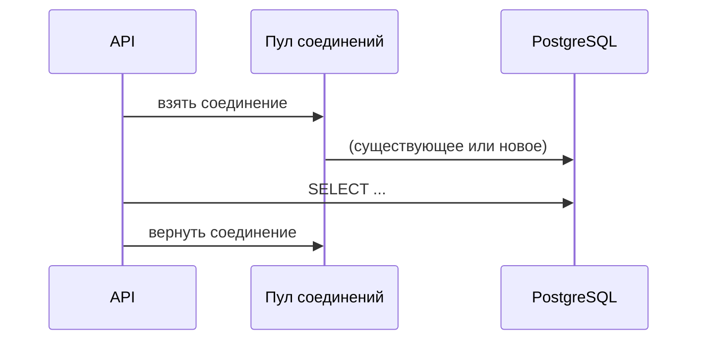

# Взаимодействие программного кода с СУБД

<div class="article-tags">
  <span class="tag tag-required">ОБЯЗАТЕЛЬНО</span>
  <span class="tag tag-beginner">ДЛЯ НОВИЧКОВ</span>
</div>

<span class="complexity-badge">Разработчику</span>
<span class="complexity-badge">Аналитику</span>
<span class="complexity-badge">Тестировщику</span>  
<span class="complexity-badge">Архитектору</span>
<span class="complexity-badge">Инженеру</span>

---
### Общий алгоритм

★ **Алгоритм взаимодействия любой программы с БД** всегда такой:

1. Подключение к СУБД:
	- программа устанавливает соединение с сервером СУБД;
	- указываются параметры подключения — адрес сервера, порт, имя пользователя, пароль;
	- если подключение успешно, программа получает доступ к управлению базой данных.
2. Соединение с конкретной БД:
	- после подключения к СУБД программа выбирает конкретную базу данных для работы;
	- для этого используется указание имени базы данных или выбор из списка доступных.
3. Авторизация и аутентификация:
	- проверяются права доступа пользователя к выбранной базе данных;
	- определяется уровень привилегий - чтение, запись, изменение структуры.
4. Старт транзакции:
	- если операции требуют целосности данных (например, обновление нескольких таблиц), программа начинает транзакцию;
	- транзакция гарантирует, что все изменения будут применены только в случае успешного завершения всех шагов.
5. Выполнение запроса:
	- программа формирует и отправляет запрос к БД;
	- запрос может быть простым (выборка SELECT) или сложным (вычисления, объединения таблиц, агрегатные функции);
	- нужно правильно составить SQL-запрос, учитывая логику программы и структуру базы данных;
	- запрос может возвращать огромное количество строк, которые нужно обработать;
	- часть данных может потребоваться для дальнейших расчётов в программе, что усложняет интеграцию;
	- необходимо обрабатывать ошибки, такие как синтаксические ошибки в запросе, отсутствие данных или нарушение целостности.
6. Чтение результата:
	- программа получает ответ от базы данных;
	- результат может быть представлен в виде набора строк, значений или сообщения об ошибке;
	- данные преобразуются в формат, понятный программе (объекты или массивы).
7. Завершение транзакции:
	- если запрос выполнен успешно, транзакция фиксируется (COMMIT);
	- в случае ошибки транзакция откатывается (ROLLBACK), чтобы сохранить целостность данных.
8. Закрытие соединения с БД:
	- после завершения работы программа закрывает соединение с базой данных;
	- это освобождает ресурсы сервера и предотвращает утечки памяти.

---

Схематично:


---

### Особенности взаимодействия

Самое важное - сложность выполнения запроса. Формирование запроса требует глубокого понимания структуры базы данных и логики программы. Сложные запросы могут включать объединения, подзапросы, временные таблицы, вычисления внутри запроса, а программе может потребоваться выполнять дополнительные действия с данными после получения результата.

Большие объёмы данных могут перегружать как базу данных, так и программу. Необходимо оптимизировать запросы, чтобы минимизировать время выполнения и использование ресурсов. Программа также должна следить за состоянием соединения, транзакций и обработкой ошибок. Неправильное управление состоянием может привести к утечкам данных или блокировкам.

И интеграция с приложением. Данные из базы должны быть преобразованы в формат, удобный для работы в программе. Например, строки таблицы представляют собой набор данных, который можно преобразовать в массивы (списки, словари) или объекты.

---

## Подходы

★ **Какие же подходы используются в приложениях?**
- прямые SQL-запросы;
- использование посредников;
- интеграции через API;
- ORM.

---

### Прямые запросы 

Программа напрямую формирует и отправляет SQL-запросы к базе данных. Здесь имеется полный контроль над запросами, возможность оптимизации, но недостатки данного подхода – это высокая сложность формирования запросов и необходимость ручной обработки данных. Буквально в коде это создание, к примеру, переменной типа String со значением запроса - "`SELECT * FROM table`" и отправка этого значения в базу.


---

### Использование посредников

Программа при этом использует библиотеки или фреймворки для взаимодействия с базой данных. Эти инструменты предоставляют готовые методы для выполнения стандартных операций (CRUD).


---

### Интеграции через API 

Вместо прямого взаимодействия с базой данных, программа может использовать API-сервисы. API предоставляет готовые методы для работы с данными, скрывая детали реализации. Это своего рода многоступенчатость, когда программа саму логику работы с БД не содержит, а вызывает некий сторонний сервис, который уже сам выполняет работу с БД - такой особый вид посредника. Это более безопасное взаимодействие, упрощающее архитектуру приложения, однако порождает зависимость от стороннего сервиса и возможные задержки при работе через сеть.


---

### ORM (Object-Relational Mapping) - объектно-реляционная модель. 

Она автоматически преобразует объекты программы в записи БД и наоборот. Это упрощает работу с базой данных, автоматически генерирует запросы и уменьшает количество ошибок. Потенциально, тут есть потеря производительности, а гибкость для сложных запросов ограничена, но это считается наиболее изящным решением.


---

## Взаимодействие СУБД с программами и приложениями

★ **Как СУБД взаимодействует с программами и приложениями?**

1. **Приём запросов**. СУБД принимает запросы от программ через сетевое соединение или локальный интерфейс. Запросы могут быть отправлены в виде текстовых команд (SQL) или через специализированные протоколы.
2. **Обработка запросов**. СУБД анализирует запрос, проверяет синтаксис и права доступа. Запрос выполняется на основе внутренних алгоритмов СУБД (например, использование индексов, оптимизация планов выполнения).
3. **Возврат результатов**. СУБД формирует ответ на запрос и отправляет его программе. Результат может быть представлен в виде таблицы, скалярного значения или сообщения об ошибке.
4. **Управление ресурсами**. СУБД следит за использованием памяти, процессора и дискового пространства. Она также управляет параллельными запросами, чтобы избежать конфликтов.
5. **Логирование и мониторинг**. СУБД записывает информацию о выполнении запросов, чтобы можно было анализировать производительность и выявлять проблемы. 

---

## Что запомнить

- Любой доступ к данным проходит цикл "подключение, запрос, результат, завершение".
- Без параметризации, пагинации и контроля транзакций быстро появляются ошибки и просадки.
- В реальных проектах часто используют гибрид: ORM для типовых сценариев, SQL для сложных.

---

## Типовые вопросы на собеседовании

1. Чем отличаются соединение с СУБД и выбор конкретной БД?
2. Почему долгие транзакции опасны для конкурентной нагрузки?
3. Зачем проверяют план выполнения запроса?
4. Когда лучше использовать ORM, а когда прямой SQL?

---

## Мини-практикум

1. Опишите для своей системы полный путь одного запроса от API до БД.
2. Найдите один тяжёлый запрос и выпишите его возможные риски (индексы, объем выборки, блокировки).
3. Предложите два улучшения: одно на уровне SQL, одно на уровне приложения.

---

### Драйвер и строка подключения

Программа не обращается к PostgreSQL напрямую. Между ними **драйвер** — библиотека, которая говорит с СУБД на её протоколе (Npgsql, psycopg, JDBC, ODBC). **Строка подключения** задаёт параметры доступа:

```text
Host=db.example.com;Port=5432;Database=shop;Username=app;Password=***;Ssl Mode=Require
```

- хост и порт сервера;
- имя базы;
- логин и пароль;
- режим SSL.

Секреты хранят в переменных окружения или vault, не в Git ([работа с хранилищем](./1111.md), [защита данных](/encyclopedia/8-infra-security/8-03-zabota-o-kode-i-dannyh/117)).

---

### Пул соединений

Открытие TCP-соединения, TLS и авторизация на каждый HTTP-запрос дороги по времени. **Пул соединений** держит готовые подключения к БД и выдаёт их приложению повторно.



Параметры пула:

- `Min Pool Size`, `Max Pool Size`;
- таймаут ожидания свободного соединения.

Для веб-приложения контекст ORM обычно создают **на один HTTP-запрос** (scoped lifetime), а не на всё приложение (singleton). См. [зависимости и время жизни сервисов](/encyclopedia/4-code-dev/4-09-zavisimosti/12).

---

### Параметризованные запросы

**Уязвимо** (конкатенация):

```text
sql = "SELECT * FROM Users WHERE Email = '" + userInput + "'"
```

При `userInput = ' OR '1'='1` — инъекция.

**Безопасно**:

```sql
SELECT * FROM Users WHERE Email = @email
-- параметр @email передаётся отдельно от текста SQL
```

ORM по умолчанию параметризует. Опасность возвращается в `ExecuteSqlRaw($"… {id} …")` без параметров.

---

### Пагинация и лимиты

Плохо:

```sql
SELECT * FROM Products;   -- 2 миллиона строк в память приложения
```

Хорошо:

```sql
SELECT Id, Name, Price FROM Products
WHERE Category = @cat
ORDER BY Id
OFFSET @skip LIMIT @take;
```

Курсорная пагинация (`WHERE Id > @lastId ORDER BY Id LIMIT 50`) стабильнее при частых вставках, чем большой `OFFSET`.

---

### Уровни изоляции транзакций

| Уровень | Эффект | Когда |
| :--- | :--- | :--- |
| Read Uncommitted | грязное чтение | почти никогда |
| Read Committed | дефолт в PostgreSQL | большинство OLTP |
| Repeatable Read | стабильный снимок | отчёты в транзакции |
| Serializable | как будто последовательно | строгая корректность, риск deadlocks |

Долгая транзакция с уровнем Serializable + ORM, держащим объекты — блокировки и таймауты. Держите транзакции короткими.

---

### Пример полного пути HTTP-запроса

Запрос `GET /api/orders/42`:

```text
1. Kestrel принимает HTTP
2. Middleware авторизации
3. Controller вызывает OrderService.GetById(42)
4. OrderRepository: context.Orders.Include(...).First(42)
5. ORM: SELECT ... FROM Orders JOIN ... WHERE Id = 42
6. Драйвер через пул → PostgreSQL
7. Строки → объекты Order, Customer, Lines
8. Маппинг в DTO (не отдавать сущность наружу)
9. JSON-ответ
10. Dispose контекста, соединение в пул
```

Узкое место ищут на шаге 5–6: `EXPLAIN ANALYZE`, индексы, N+1.

---

### Обработка ошибок

| Ошибка | Причина | Действие приложения |
| :--- | :--- | :--- |
| Timeout | тяжёлый запрос / блокировка | retry с лимитом, алерт |
| Unique violation | дубликат email | 409 Conflict пользователю |
| FK violation | удалили родителя | 400 с понятным текстом |
| Connection refused | БД недоступна | 503, health check fail |

Не показывать клиенту сырой текст SQL-сервера — только код и безопасное сообщение.

---

### Прямой SQL и ORM — один кейс

Задача: активные пользователи за 7 дней.

**SQL:**

```sql
SELECT u.Id, u.Email, COUNT(o.Id) AS OrderCount
FROM Users u
LEFT JOIN Orders o ON o.UserId = u.Id AND o.CreatedAt >= NOW() - INTERVAL '7 days'
WHERE u.IsActive = true
GROUP BY u.Id, u.Email
HAVING COUNT(o.Id) > 0;
```

**ORM-стиль (псевдокод):**

```text
users = context.Users
  .Where(u => u.IsActive)
  .Select(u => new {
    u.Id,
    u.Email,
    OrderCount = u.Orders.Count(o => o.CreatedAt >= weekAgo)
  })
  .Where(x => x.OrderCount > 0)
```

Оба должны дать один план; если ORM строит подзапросы — сравнить в логе.

---

### API вместо прямого доступа к БД

Мобильное приложение **не** подключается к PostgreSQL напрямую. Схема:

```text
Мобильный клиент → HTTPS API → сервис → ORM → БД
```

Плюсы: контроль прав, версионирование контракта, смена БД без обновления приложения. Минус: задержка сети, нужен backend.

---

### Мониторинг и health checks

- `SELECT 1` или лёгкий ping в `/health`;
- метрики: время запроса, размер пула, число активных соединений;
- slow query log на стороне PostgreSQL;
- алерт при исчерпании пула.

---

### Чек-лист доступа к данным

1. Параметры, не конкатенация.
2. Пул и scoped-контекст.
3. Пагинация на списках.
4. Транзакции короче секунды там, где возможно.
5. DTO на границе API.
6. Секреты вне репозитория.
7. Лог SQL на dev, маскирование на prod.

---

### ADO.NET / драйвер без ORM (минимальный пример)

Понимание "голого" пути помогает отлаживать ORM:

```text
1. Создать соединение (из пула)
2. Открыть соединение
3. Создать команду с параметрами
4. ExecuteReader / ExecuteNonQuery
5. Прочитать строки в цикл while (reader.Read())
6. Закрыть reader, вернуть соединение в пул
```

ORM делает шаги 3–5 за вас, но таймауты, транзакции и пул — те же.

Подробнее — [ADO.NET и драйверы](/encyclopedia/5-languages/5-04-platforma-dotnet/171), практика PostgreSQL — [888](/encyclopedia/3-data-markup/3-07-sql/888).

---

### Разделение чтения и записи (replication)

При схеме master-replica:

```text
Запись (INSERT, UPDATE) → primary (главный сервер)
Чтение отчётов       → read replica (реплика, с задержкой 100–500 ms)
```

ORM может иметь две строки подключения. После записи заказа нельзя сразу читать его с отстающей реплики — пользователь не увидит только что созданные данные (**read-your-writes**).

---

### Таймауты и повтор при сбоях

| Параметр | Назначение |
| :--- | :--- |
| Connection Timeout | сколько ждать открытия соединения |
| Command Timeout | когда отменить зависший `SELECT` |
| Retry on transient | повтор при кратковременном обрыве сети |

Повторять транзакцию целиком при retry, не половину операции.

---

### Сравнение способов получить список заказов

| Подход | Код | Контроль SQL |
| :--- | :--- | :--- |
| Raw SQL + Dapper | SQL-строка, маппинг | полный |
| ORM + LINQ | `Orders.Where(...).Include(...)` | средний |
| API поверх БД | HTTP GET /orders | нет прямого SQL в клиенте |

Мобильный клиент всегда в третьей строке — не выдавайте connection string приложению.

---

### Диагностика медленного запроса

1. Воспроизвести на stage с тем же объёмом данных.
2. `EXPLAIN (ANALYZE, BUFFERS)` в PostgreSQL.
3. Есть ли индекс по `WHERE` и `JOIN`?
4. Сколько round-trip из приложения (N+1)?
5. Не тянется ли лишний `TEXT` / BLOB?
6. Версия плана после `ANALYZE`?

Исправление на уровне SQL **и** приложения часто вместе: индекс + убрать N+1.

---

### Подготовка к ORM

Рекомендуемый порядок (см. [о разделе](./intro.md)):

1. [SQL](/encyclopedia/3-data-markup/3-07-sql/intro) — `SELECT`, `INSERT`, `JOIN`, транзакции.
2. [PostgreSQL из приложения](/encyclopedia/3-data-markup/3-07-sql/888) — подключение через драйвер.
3. [ORM](./112.md) — маппинг объектов на таблицы.

Без первых двух шагов ошибки вроде "сущность не сохранилась" и `foreign key violation` кажутся непонятной "магией" ORM.

---
