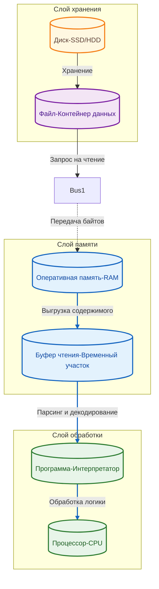
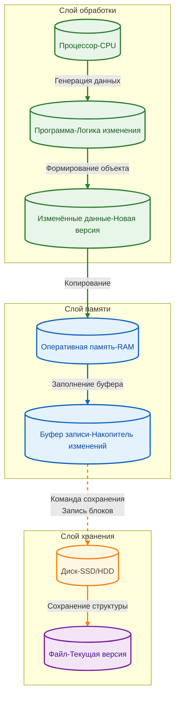

# Работа с хранилищем

  ОБЯЗАТЕЛЬНО
  ДЛЯ НОВИЧКОВ

Разработчику
Аналитику
Тестировщику  
Архитектору
Инженеру

## Работа с хранилищем

### Отличия диска и оперативной памяти

Оперативная память (ОЗУ) и дисковое пространство представляют собой два фундаментально разных слоя хранения данных. Архитектура этих систем определяет их назначение, скорость работы и долговечность.

**Оперативная память (RAM)** — это высокоскоростное устройство, спроектированное для мгновенного доступа к данным в процессе выполнения программ. ОЗУ обеспечивает передачу гигабайтов информации за наносекунды. Энергия требуется для поддержания состояния ячеек памяти: при отключении питания данные исчезают. Это энергозависимое хранилище. Процессор обращается к ОЗУ напрямую через шину памяти без участия контроллеров ввода-вывода, что минимизирует задержки.

**Диск (HDD или SSD)** — это устройство для долгосрочного хранения данных. Скорость доступа к диску значительно ниже скорости доступа к ОЗУ. Разница может достигать нескольких порядков: диск работает медленнее оперативной памяти в тысячи раз. Дисковые накопители сохраняют информацию при отсутствии электропитания. Это энергонезависимое хранилище.

SSD-накопители имеют физический ресурс перезаписи, измеряемый показателем TBW (Total Bytes Written). Этот лимит указывает на количество терабайт данных, которое можно записать в ячейки флеш-памяти до их выхода из строя. Стандартные потребительские SSD имеют лимит от 300 до 600 ТБ. Постоянная интенсивная запись данных быстро расходует этот ресурс. Если накопитель с операционной системой исчерпает свой ресурс, система перестанет работать, и компьютер не включится.

---

### Типы хранилища данных по назначению

Правильное распределение данных между оперативной памятью и диском является основой производительности системы. Смешивание типов хранения приводит к потере скорости или сокращению срока службы оборудования.

Данные делятся на две основные категории:

*   **Временное хранение.** Переменные, состояние интерфейса, текущие вычисления, промежуточные результаты операций живут в оперативной памяти. Эти данные нужны только в момент выполнения программы.
*   **Постоянное хранение.** Архивы, файлы конфигурации, игровые сохранения, видеофайлы, трёхмерные модели, большие объёмы логов хранятся на диске. Эти данные должны сохраняться после завершения работы программы и перезагрузки компьютера.

Если программа пытается хранить временные данные на диске, она теряет производительность. Если программа постоянно записывает временные данные на диск, она сокращает срок службы накопителя.

---

### Файл как контейнер данных

Файл представляет собой контейнер, содержащий набор байтов, закодированных определённым образом. Структура файла определяется его форматом (текст, изображение, база данных, исполняемый код).

Процесс работы программы с файлом включает следующие этапы:

1.  **Поиск.** Операционная система находит файл на диске по указанному пути.
2.  **Открытие.** Программа запрашивает у ОС доступ к файлу.
3.  **Распаковка.** Программа, знающая формат файла, интерпретирует содержимое контейнера. Она понимает, какие байты являются заголовком, а какие — данными.
4.  **Выгрузка.** Программа читает данные из файла и помещает их в оперативную память.

Способ чтения зависит от реализации разработчика. Программа может:
*   Выгрузить весь файл сразу в память.
*   Читать файл порциями (чанками), обрабатывая одну часть и освобождая память перед чтением следующей.
*   Читать данные по мере необходимости (стриминг).

Неправильный выбор стратегии чтения больших файлов приводит к нехватке оперативной памяти или зависанию системы.

---

### Основные операции с файлами

Работа с файлами сводится к трём базовым операциям. Каждая операция имеет свои особенности нагрузки на систему.

**Чтение файла**

Процесс получения данных из файла и переноса их в оперативную память. Чтение является более лёгкой операцией по сравнению с записью. Диск может выполнять множество операций чтения подряд без значительного снижения ресурса. Основная нагрузка при чтении — снижение общей скорости работы программы, так как процессор ожидает данные от диска.

**Добавление данных в файл**

Процесс вставки новой информации в существующий файл. Эта операция требует изменения структуры файла. Система должна найти место для новых данных, сдвинуть существующие блоки или переписать часть файла.

**Запись (перезапись)**

Процесс создания нового файла или полного обновления содержимого существующего. Запись является самой тяжёлой операцией. Контроллеру диска необходимо выделить свободные ячейки, записать данные, обновить таблицу размещения файлов. Для SSD это означает физическую стирание и перезапись ячеек флеш-памяти.

Программа может выводить информацию в консоль или отображать её в интерфейсе. Такие данные находятся только в оперативной памяти. При перезапуске компьютера они исчезают. Чтобы сохранить результат навсегда, программу нужно явно записать данные на диск.

Пример проблемы: Игровая система сохраняет каждый шаг игрока на карте. Один шаг занимает несколько килобайт. За час игры происходит более ста тысяч сохранений. Общий объём записей превышает 100 ГБ. Накопитель получает колоссальную нагрузку, превышающую его ресурс за короткий срок.

---

### Где хранить информацию

Информация в оперативной памяти живёт только в рамках текущего сеанса работы. При выключении питания или перезагрузке компьютера содержимое ОЗУ очищается. Информация на диске сохраняется независимо от состояния питания.

Рассмотрим пример игрового прогресса. Игрок прошёл сложный уровень.
*   Вариант А: Прогресс хранится только в переменной в ОЗУ. При выключении компьютера переменная сбрасывается. Прогресс пропадает.
*   Вариант Б: Прогресс записывается в файл на диске. При следующем запуске игра читает файл и восстанавливает состояние. Прогресс остаётся.

Второй вариант необходим для постоянного хранения, но требует осторожности. Если сохранять каждое действие игрока (движение, атаку, получение предмета) в отдельную запись на диске, система создаёт сотни тысяч мелких записей в минуту. Такой режим работы убивает SSD.

Разработчики часто сталкиваются с ситуацией, когда система сохранений записывает данные слишком часто. В таких случаях рекомендуется внедрять буферизацию: накапливать изменения в памяти и записывать их на диск один раз за определённый промежуток времени или при достижении критического события.

---

### Уважение к диску в разработке

Любая операция записи на диск является медленной и «дорогой» с точки зрения ресурсов. Программист должен осознавать цену каждой записи. Перед выполнением действия стоит задать вопрос: «Нужно ли сохранять это прямо сейчас? Можно ли подождать? Можно ли объединить несколько изменений в одну запись?».

**Группировка записей (Batch Write)**

Вместо множества мелких записей следует использовать пакетную запись. Программа собирает изменения в памяти и отправляет их на диск единым блоком. Это снижает количество физических операций на накопителе.

**Дробление данных (Chunking)**

При работе с большими файлами данные разбиваются на части. Программа читает или пишет одну часть, затем переходит к следующей. Это позволяет обрабатывать файлы размером больше доступной оперативной памяти.

**Асинхронная запись**

Программа инициирует запись и продолжает работу, не дожидаясь её завершения. Когда запись завершится, система уведомит приложение. Это предотвращает зависание интерфейса во время медленных операций ввода-вывода.

**Кэширование**

Часто читаемые данные хранятся в быстрой оперативной памяти, чтобы избежать обращения к диску.

**Flush (сброс буфера)**

Данные могут находиться во внутреннем буфере диска или системы. Команда `flush` принудительно записывает всё содержимое буфера на физические ячейки. Это гарантирует сохранность данных, но замедляет работу.

**Логирование**

Система логирования записывает события в файлы. Режим DEBUG создаёт огромное количество записей. В финальной версии продукта для продакшена логирование уровня DEBUG следует отключить или перевести в режим WARNING/ERROR, чтобы снизить нагрузку на диск.

---

### Работа с базами данных

Реляционные базы данных (SQL) полностью используют дисковое пространство для хранения таблиц. Каждая таблица разбита на страницы. Операции чтения и записи в базу данных означают перемещение страниц между диском и оперативной памятью.

Пример проблемы масштабирования: Веб-приложение содержит базу данных с 100 000 товаров. При открытии страницы каталога выполняется запрос `SELECT * FROM products`. Система считывает все 100 000 записей с диска в память. Процесс занимает длительное время. При высокой нагрузке (высокое количество запросов в секунду) диск не успевает обслуживать запросы, и работа системы замедляется или останавливается.

Решение этой задачи — использование кэширования.

**Своя система кэша**

Приложение хранит результаты частых запросов в оперативной памяти. Например, система запоминает последние 10 запросов пользователей. При повторном запросе данные выдаются из памяти мгновенно, без обращения к базе данных.

**In-memory базы данных**

Использование специализированных систем хранения в оперативной памяти, таких как Redis или Memcached. Эти системы работают как огромные переменные или наборы переменных в памяти. Они обеспечивают микросекундный отклик. База данных используется только для снапшотов или глубокого анализа, когда данные нужно сохранить надолго.

Применение Redis позволяет обрабатывать запросы в сотни раз быстрее. Система взаимодействует с быстрым хранилищем в памяти, а диск задействуется только для периодической синхронизации данных. Это устраняет узкое место, связанное со скоростью дискового ввода-вывода.

---
