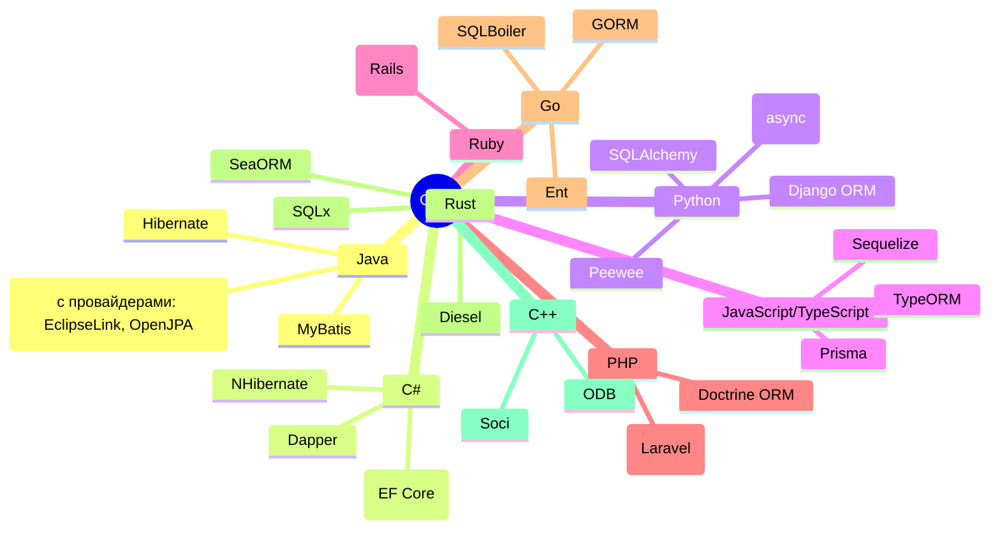
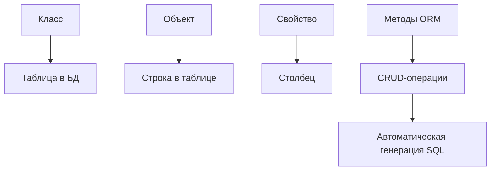
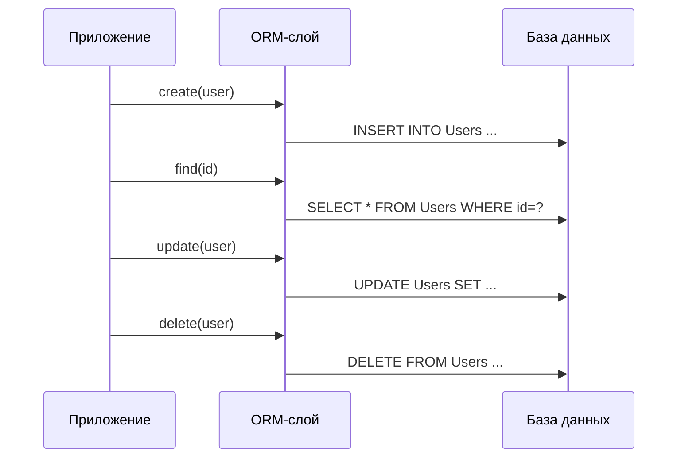

import ExternalCodeEmbed from '@site/src/components/ExternalCodeEmbed';


import ExternalPlayEmbed from '@site/src/components/ExternalPlayEmbed';


# ORM - объектно-реляционное отображение

<div class="article-tags">
  <span class="tag tag-required">ОБЯЗАТЕЛЬНО</span>
  <span class="tag tag-beginner">ДЛЯ НОВИЧКОВ</span>
</div>

<span class="complexity-badge">Разработчику</span>
<span class="complexity-badge">Аналитику</span>
<span class="complexity-badge">Тестировщику</span>  
<span class="complexity-badge">Архитектору</span>
<span class="complexity-badge">Инженеру</span>

---

## ORM

### Как работает ORM?

<ExternalPlayEmbed example="code-dev/orm-demo" title="ORM — объектно-реляционное отображение" minHeight={480} />

---

### Схема ORM



---

### Основные понятия

★ **ORM** – это программный подход или инструмент, который позволяет преобразовывать данные между объектной моделью программы (объекты, классы) и реляционной моделью базы данных (таблицы, строки, столбцы).

★ **Объектная модель** - в ООП данные представлены в виде объектов, которые имеют свойства (атрибуты) и поведение (методы).

★ **Реляционная модель** - в реляционных базах данных, данные хранятся в таблицах, где строки представляют записи, а столбцы - атрибуты.

Задача ORM - вывести формулу:
```
Объектная модель - Реляционная модель.
```

ORM выступает как переводчик между этими двумя парадигмами, позволяя программисту работать с базой данных через объекты, а не напрямую через SQL-запросы.

ORM предоставляет уровень абстракции, который скрывает сложности работы с базой данных. Это означает, что программист может сосредоточиться на логике приложения, а не на деталях взаимодействия с БД.



---

### Абстракция ORM

★ **Как работает абстракция ORM?**

1. Классы как таблицы:
	- каждый класс в программе соответствует таблице в базе данных;
	- свойства класса соответствуют столбцам таблицы.
2. Объекты как строки:
	- экземпляр класса (объект) представляет собой строку в таблице;
	- значения свойств объекта соответствуют значениям в ячейках строки.
3. Методы для операций с данными. ORM предоставляет готовые методы для выполнения CRUD-операций (Create, Read, Update, Delete), которые автоматически преобразуются в SQL-запросы.
4. Отношения между объектами. Базы не просто называются реляционными - важна связь. И ORM поддерживает отношения между объектами (например, один-ко-многим, многие-к-другим), которые отражаются в связях между таблицами в базе данных.

---

Пример абстракции.

Прямой SQL-запрос был бы таким:
```SQL
SELECT * FROM Users WHERE Age > 30
```

Абстракция в C#, через LINQ-синтаксис (позже изучим):
```csharp
var users = (from user in dbContext.Users
             where user.Age > 30
             select user).ToList();

```

А если использовать Entity Framework (прокаченную ORM на C#), то:
```csharp
var users = dbContext.Users.Where(user => user.Age > 30).ToList();
```

Конечно, мы ещё не изучали особенности языка C#, но здесь важно понять следующее при разборе примеров:
	- `dbContext.Users` — это `DbSet<User>`, представляющий таблицу `Users` в БД.
	- `.Where(...)` — метод LINQ, который преобразуется в SQL-условие `WHERE` под капотом.
	- `user => user.Age > 30` — лямбда-выражение, заменяющее условие `WHERE Age > 30` (анонимная функция, которая фильтрует записи);
	- `.ToList()` – материализует запрос (выполняет SQL и возвращает список объектов).

---

Таким образом, если приводить соответствие:

| Абстракция в ORM (C#) | Эквивалент в SQL БД |
|-----|-----|
|Класс `Users`	|Таблица `Users`
|Свойства класса `Users` (Id, Name, Age)	|Столбцы таблицы `Users` (Id, Name, Age)
|`dbContext.Users`	|`SELECT * FROM Users`
|.Where(user => user.Age > 30)	|`WHERE Age > 30`
|`.Select(user => user.Name)`	|`SELECT Name FROM Users`
|`users.ToList()`	|Выполнение запроса (`Execute`)
|Переменная `users`	|Результат запроса SQL
|Методы `Where`, `From`, `Select`	|Ключевые слова `WHERE`, `FROM`, `SELECT`
|Объект user (экземпляр класса)	|Запись (строка) в таблице

---

Следовательно, в базе данных есть таблица Users:

| Id | Name | Address | Email |
|-----|-----|-----|-----|
|1	|Иван Петров	|ул. Ленина, 10	|ivan@mail.ru

Представим, что создавалась она так:


<ExternalCodeEmbed example="sql/code-410-112-001" title="Абстракция ORM" minHeight={192} />


В коде мы бы создали класс User, со следующим содержимым:


<ExternalCodeEmbed example="csharp/code-410-112-002" title="Абстракция ORM" minHeight={426} />


---

По итогу мы получаем сопоставление:
| C# (Класс User) | SQL (Таблица Users) |
|-----|-----|
|`public int Id`	|`Id INT PRIMARY KEY`
|`public string Name`	|`Name NVARCHAR(100)`
|`public string? Address`	|`Address NVARCHAR(200) NULL`
|`public string Email`	|`Email NVARCHAR(100)`

В коде выше, конечно, добавили атрибуты вроде `[Key]`, `[Required]` - они помогают ORM понять структуру БД. Но! Мы ещё не изучили C#, поэтому задача в вышеуказанном примере - на практике показать, что такое ORM.



---

### Логическое представление

Вернёмся к теории.

ORM является логическим представлением, и позволяет работать с базой данных как с коллекцией объектов, а не как с набором таблиц. Как мы помним, это совсем разные структуры данных. ORM при этом скрывает детали реализации, и программисту не нужно знать, как именно организована структура базы данных (например, какие индексы используются или как выполняются запросы). ORM автоматически генерирует SQL-запросы на основе действий с объектами, что автоматизирует процесс.

Поэтому здесь работа идёт с объектами, а ORM сама заботится об SQL-запросах.

Реляционное представление подразумевает хранение данных в таблицах с чётко определённой схемой - строки и столбцы. ORM для реляционных БД преобразует таблицы в классы, строки в объекты, а столбцы в свойства объектов, а также поддерживает отношения между таблицами (например, внешние ключи) через связи между объектами.

Примеры ORM для реляционных БД:
	- Hibernate (Java)
	- Entity Framework (C#)
	- SQLAlchemy (Python)

Но это не значит, что для нереляционных БД отсутствует ORM.

В нереляционном представлении, данные хранятся в более гибком формате (документы JSON, графы, ключ-значение). И для них тоже используется ORM.
ORM адаптируется к специфике нереляционных баз данных, вместо таблиц используются коллекции, а вместо строк - документы.

Примеры ORM для нереляционных БД:
	- Mongoose (для MongoDB)
	- ODM (Object Document Mapping) — аналог ORM для документоориентированных БД.

---

**В чём отличие между реляционным и нереляционным представлением в ORM?**

| Характеристика | Реляционное представление | Нереляционное представление |
|-----|-----|-----|
|Структура данных	|Таблицы, строки, столбцы	|Документы, ключ-значение, графы
|Связи между данными	|Через внешние ключи	|Через ссылки или вложенные структуры
|Гибкость схемы	|Жесткая схема	|Гибкая схема
|Пример ORM	|Hibernate, Entity Framework	|Mongoose, ODM

---

## Что запомнить

- ORM связывает объектную модель и реляционную модель через маппинг и генерацию SQL.
- ORM ускоряет CRUD и повышает поддерживаемость кода, когда команда понимает базовый SQL.
- Для сложной аналитики ORM дополняют ручными запросами и Query Builder.

---

## Типовые вопросы на собеседовании

1. Что такое object-relational mismatch и как ORM его снижает?
2. В чем разница между lazy loading и eager loading?
3. Почему знание SQL обязательно даже при работе через ORM?
4. Какие риски появляются при слепом доверии "магии" ORM?

---

## Мини-практикум

1. Сопоставьте одну таблицу вашей БД с классом сущности и перечислите маппинг полей.
2. Напишите один и тот же запрос в SQL и в ORM-стиле.
3. Объясните, где в вашем примере может возникнуть N+1.

---
