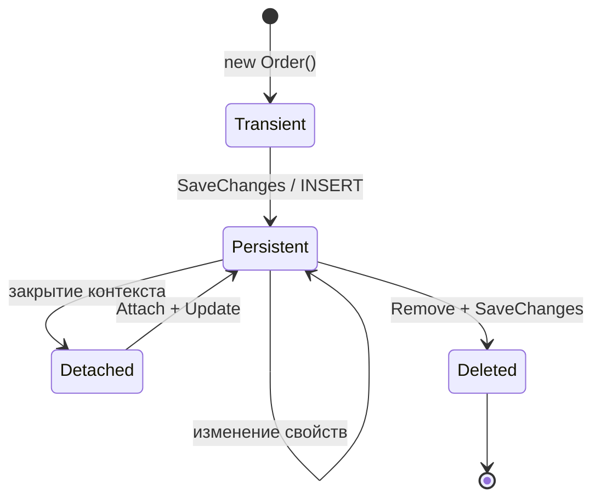
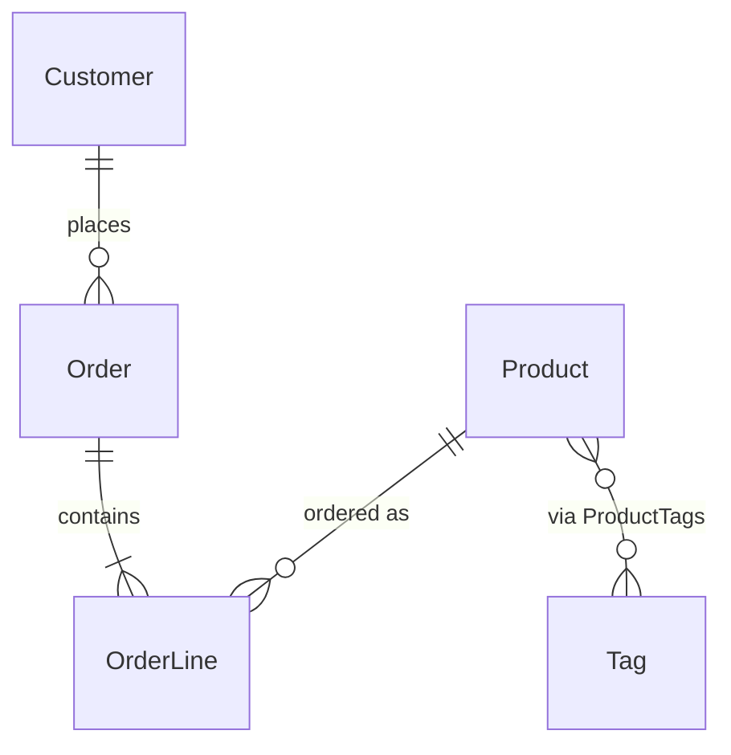

import ExternalPlayEmbed from '@site/src/components/ExternalPlayEmbed';


# Принципы проектирования ORM-систем

<div class="article-tags">
  <span class="tag tag-required">ОБЯЗАТЕЛЬНО</span>
  <span class="tag tag-beginner">ДЛЯ НОВИЧКОВ</span>
</div>

<span class="complexity-badge">Разработчику</span>
<span class="complexity-badge">Аналитику</span>
<span class="complexity-badge">Тестировщику</span>  
<span class="complexity-badge">Архитектору</span>
<span class="complexity-badge">Инженеру</span>

---

## Основные принципы ORM

Перед деталями — короткий словарь терминов раздела:

- **Сущность (entity)** — класс в коде, который ORM связывает с таблицей.
- **Контекст** (`DbContext`, `Session`) — объект, через который идут все запросы к БД в рамках одной операции.
- **Маппинг** — правила соответствия "класс ↔ таблица", "поле ↔ столбец".
- **FK (foreign key, внешний ключ)** — столбец, ссылающийся на строку другой таблицы.
- **Навигационное свойство** — поле в классе со ссылкой на связанную сущность (`order.Customer`).
- **Миграция** — версионируемый скрипт изменения схемы БД ([подробнее](./115.md)).

Теория ORM — в [112](./112.md); здесь — как спроектировать слой данных без типичных ловушек.

<ExternalPlayEmbed example="about/archi-styler-play" title="Слой данных — Entity, Repository, DbContext" minHeight={480} playProps={{ defaultPattern: 'repository-orm', title: 'Слой данных — Entity, Repository, DbContext', subtitle: 'Шаблон Repository + ORM и превью кода под выбранный язык' }} />

---

### Маппинг сущностей (классов) на таблицы

★ **Маппинг** – это процесс связывания объектов программы с таблицами в базе данных. Сам по себе маппинг происходит от слова map - карта, когда берётся одна сущность, и данные из неё преобразуются в другую.

★ **Класс - таблица**. Каждый класс в программе соответствует таблице в базе данных. Имя класса обычно совпадает с именем таблицы, а свойства класса (атрибуты) соответствуют столбцам таблицы.

★ **Объект - строка**. Экземпляр класса (объект) представляет собой строку в таблице. Значения свойств объекта сохраняются в ячейках строки.
В современных ORM часто используются аннотации или декораторы для указания дополнительных параметров маппинга - первичный ключ (id), индексы и ограничения (например, NOT NULL).

---

### CRUD через объекты

**CRUD** — четыре базовые операции с данными:

- **C**reate — создать запись;
- **R**ead — прочитать;
- **U**pdate — изменить;
- **D**elete — удалить.

В SQL те же операции записывают как `INSERT`, `SELECT`, `UPDATE`, `DELETE` ([основы SQL](/encyclopedia/3-data-markup/3-07-sql/intro)). ORM вызывает их методами над объектами, без ручных SQL-строк в прикладном коде.

- создание объекта в программе → `INSERT` в таблицу;
- запрос к коллекции сущностей → `SELECT`;
- изменение свойств отслеживаемого объекта → `UPDATE`;
- удаление из контекста → `DELETE`.

Подробнее о маппинге операций — в статье [ORM — объектно-реляционное отображение](./112.md).

---

### Работа с отношениями (один-к-одному, один-ко-многим, многие-ко-многим)

ORM позволяет работать с отношениями между таблицами через связи между объектами.

Типы отношений:
	- Один-к-одному (One-to-One) - одна запись в таблице связана с одной записью в другой таблице.
	- Один-ко-многим (One-to-Many) - одна запись в таблице связана с несколькими записями в другой таблице.
	- Многие-ко-многим (Many-to-Many) - несколько записей в одной таблице связаны с несколькими записями в другой таблице.

ORM автоматически создаёт промежуточные таблицы для отношений "многие-ко-многим" и управляет внешними ключами для "один-ко-многим".

---

### Транзакции и состояние объектов

**Транзакция** — группа шагов с базой, которые выполняются целиком. При ошибке на любом шаге СУБД откатывает все изменения ([транзакции в SQL](/encyclopedia/3-data-markup/3-07-sql/103)).

ORM запоминает **состояние** каждого объекта в памяти:

- **Transient** — объект есть только в коде, в таблице строки ещё нет;
- **Persistent** — строка в БД есть, контекст ORM отслеживает объект;
- **Detached** — строка в БД есть, но текущий контекст объект не видит;
- **Deleted** — помечен на удаление, после `SaveChanges` строка исчезнет из таблицы.



Пример бизнес-операции "оформить заказ" — три шага в одной транзакции:

```text
НАЧАТЬ ТРАНЗАКЦИЮ
  1. Создать Order (статус = "новый")
  2. Для каждой позиции корзины — OrderLine + уменьшить stock в Product
  3. Списать баланс Customer
  ЕСЛИ ошибка на любом шаге → ОТКАТ
  ИНАЧЕ → ФИКСАЦИЯ (COMMIT)
```

Без транзакции возможны рассинхроны: заказ создан, а строки заказа нет, или склад списан без заказа. Такие сбои относят к нарушению **целостности данных** ([ограничения в SQL](/encyclopedia/3-data-markup/3-07-sql/444)).

---

### Доменная модель и модель хранения

В коде часто встречаются два разных слоя:

| Слой | Назначение | Пример |
| :--- | :--- | :--- |
| **Доменная сущность** | бизнес-правила, инварианты | `Order.Confirm()` проверяет сумму и статус |
| **ORM-сущность** | отображение на таблицы | класс с полями под столбцы БД |

**DTO** (Data Transfer Object) — объект для ответа API без лишних полей БД и без навигационных связей.

В учебном проекте домен и ORM часто совпадают в одном классе. В зрелых системах домен отделяют, а в БД пишут через маппер или DTO. ORM не заменяет [ООП](/encyclopedia/4-code-dev/4-08-oop/intro): вызов `order.AddLine(product, qty)` переносит правило в сущность, а не размазывает его по контроллеру.

**Инвариант** — правило, которое данные не должны нарушать. Примеры:

- сумма заказа равна сумме строк;
- email обязателен;
- количество больше нуля.

Часть инвариантов дублируют ограничения БД (`CHECK`, `NOT NULL`, `UNIQUE`), часть остаётся только в коде.

---

### Маппинг через аннотации, Fluent API и соглашения

**Маппинг** — правила, по которым ORM связывает класс с таблицей и свойства со столбцами.

Три способа задать правила:

1. **Соглашения по умолчанию** — класс `Customer` → таблица `Customers`, свойство `Id` → первичный ключ.
2. **Аннотации / атрибуты** — `[Required]`, `[MaxLength(100)]` на свойствах.
3. **Fluent API** — отдельный класс `CustomerConfiguration` с явными именами столбцов, индексами и каскадами.

Когда таблица в legacy-базе называется `tbl_cust` и столбец `cust_nm`, соглашений недостаточно — нужна явная конфигурация:

```text
СУЩНОСТЬ Customer
  ТАБЛИЦА "tbl_cust"
  СВОЙСТВО Name → СТОЛБЕЦ "cust_nm", NVARCHAR(200), NOT NULL
  СВОЙСТВО Id → СТОЛБЕЦ "cust_id", PRIMARY KEY
```

Смешивать аннотации и Fluent на одном поле не стоит — один источник правды упрощает ревью.

---

### Первичные ключи и стратегии генерации

| Стратегия | Когда уместна | Риск |
| :--- | :--- | :--- |
| **Автоинкремент (IDENTITY)** | типовой OLTP, простые сущности | сложнее распределённая запись без координации |
| **UUID / GUID** | микросервисы, офлайн-клиенты | индексы шире, фрагментация |
| **Натуральный ключ** | справочники (`ISO-код страны`) | хрупкость при смене бизнес-идентификатора |
| **Суррогатный ключ + уникальный бизнес-код** | заказы, счета | лучший компромисс в enterprise |

ORM обычно генерирует суррогатный `Id` при `INSERT`. Натуральный ключ (`Email` как PK) в учебных примерах встречается, в проде — редко: смена email ломает ссылки.

---

### CRUD под капотом ORM

**Create.** Объект добавляют в **контекст** ORM (`Add`, `persist`). **Контекст** (`DbContext` в EF, `Session` в Hibernate) — объект в коде, который знает подключение к БД и список отслеживаемых сущностей. При `SaveChanges` ORM строит `INSERT`:

```sql
INSERT INTO Orders (CustomerId, Status, CreatedAt)
VALUES (@p0, @p1, @p2);
```

**Read.** Запрос к `DbSet` (набор сущностей одного типа) превращается в `SELECT`. Пока не вызван `ToList()`, `First()` или цикл по результату, запрос может оставаться **отложенным** — SQL уйдёт в БД только в момент реального чтения.

**Update.** ORM сравнивает поля с копией на момент загрузки (**снимок**) и в `UPDATE` попадают только изменённые столбцы:

```sql
UPDATE Products SET Price = @p0 WHERE Id = @p1;
```

**Delete.** `Remove(entity)` → `DELETE FROM ... WHERE Id = ...`. Удаление дочерних строк зависит от **внешнего ключа** (FK) в БД и настройки `OnDelete` в ORM.

---

### Отношения на примере интернет-магазина

Схема в SQL:

```sql
CREATE TABLE Customers (
    Id INT PRIMARY KEY,
    Name NVARCHAR(100) NOT NULL
);

CREATE TABLE Orders (
    Id INT PRIMARY KEY,
    CustomerId INT NOT NULL REFERENCES Customers(Id),
    Total DECIMAL(18,2) NOT NULL
);

CREATE TABLE OrderLines (
    Id INT PRIMARY KEY,
    OrderId INT NOT NULL REFERENCES Orders(Id),
    ProductId INT NOT NULL,
    Quantity INT NOT NULL
);

CREATE TABLE Products (
    Id INT PRIMARY KEY,
    Name NVARCHAR(200) NOT NULL
);

CREATE TABLE ProductTags (
    ProductId INT REFERENCES Products(Id),
    TagId INT REFERENCES Tags(Id),
    PRIMARY KEY (ProductId, TagId)
);
```

Соответствие в объектной модели:

| SQL | ORM (навигация) |
| :--- | :--- |
| `Orders.CustomerId` | `Order.Customer` + `Customer.Orders` (один-ко-многим) |
| `OrderLines.OrderId` | `Order.Lines` — коллекция |
| `ProductTags` | `Product.Tags` ↔ `Tag.Products` (многие-ко-многим) |



**Владелец связи** — таблица, в которой лежит столбец FK. У `OrderLine` есть `OrderId`, значит связь с `Order` принадлежит строке заказа. При вставке в неудобном порядке помогают отложенные ограничения ([PostgreSQL и .NET](./119.md)).

---

### Каскады при удалении и обновлении

| Поведение | Смысл | Осторожность |
| :--- | :--- | :--- |
| `Cascade` | удалили заказ — удалились строки | случайная потеря данных |
| `Restrict` / `NoAction` | нельзя удалить родителя с детьми | нужна явная очистка |
| `SetNull` | FK обнуляется | возможны строки без родителя, если бизнес это допускает |

Настройка только в ORM без FK в БД опасна: администратор или скрипт обойдёт приложение. Критичные каскады дублируют на уровне СУБД ([внешние ключи](/encyclopedia/3-data-markup/3-07-sql/444)).

---

### Repository и Unit of Work

**Repository** (репозиторий) — класс с методами `GetById`, `Add`, `ListActive` вместо разбросанных `dbContext.Orders.Where(...)` по контроллерам.

**Unit of Work** — один контекст и одна транзакция на бизнес-операцию; `SaveChanges` вызывают один раз в конце.

```text
КЛАСС OrderService
  ЗАВИСИМОСТЬ orderRepo, productRepo, unitOfWork

  МЕТОД PlaceOrder(customerId, lines)
    НАЧАТЬ транзакцию unitOfWork
    order := новый Order(customerId)
    ДЛЯ КАЖДОЙ line В lines
      product := productRepo.Get(line.productId)
      ЕСЛИ product.Stock < line.qty → ОШИБКА "нет на складе"
      order.AddLine(product, line.qty)
      product.DecreaseStock(line.qty)
    orderRepo.Add(order)
  unitOfWork.Commit()
```

Репозиторий на каждую таблицу без доменного смысла усложняет проект. Один репозиторий на **агрегат** (корень вроде `Order` вместе с `OrderLine`) обычно удобнее. См. также [зависимости и внедрение сервисов](/encyclopedia/4-code-dev/4-09-zavisimosti/12).

---

### Объекты-значения и вложенные типы

Адрес, сумма с валютой, период дат в домене — **объекты-значения** без собственного `Id`. В БД их кладут так:

- вложенные столбцы (`Street`, `City` в `Customers`);
- отдельная таблица, если адрес переиспользуется (реже);
- JSON/JSONB — гибко, но сложнее индексы ([JSONB в PostgreSQL](/encyclopedia/3-data-markup/3-07-sql/66)).

ORM поддерживает owned types / embeddable — один класс `Address` маппится на несколько столбцов.

---

### Индексы и ограничения в модели

Индексы задают в миграциях или Fluent API:

```text
СУЩНОСТЬ Product
  ИНДЕКС по (CategoryId, Price)
  УНИКАЛЬНОСТЬ по Sku
  CHECK Price >= 0
```

ORM создаст DDL при миграции, но **план запроса** всё равно проверяют в СУБД (`EXPLAIN`). Индекс на поле, по которому никто не фильтрует, — мёртвый вес при записи.

---

### Миграции как часть проектирования

Изменение сущности → новая миграция → применение на dev/stage/prod. Подробнее — [Миграции баз данных](./115.md). При проектировании ORM-слоя сразу думают:

- обратима ли миграция (есть ли `Down`);
- нужен ли backfill для нового NOT NULL столбца;
- не заблокирует ли `ALTER` большую таблицу прод.

---

### Типичные анти-паттерны ORM-модели

| Анти-паттерн | Почему плохо | Что делать |
| :--- | :--- | :--- |
| **Anemic domain** — сущность только с геттерами/сеттерами | правила размазаны по сервисам | методы на сущности или доменный сервис |
| **God entity** — 50 полей и 20 навигаций | тяжёлые запросы, циклы сериализации | разбить, DTO для API |
| **Leaky abstraction** — везде `Include` наугад | N+1 или лишние JOIN | явные проекции |
| **Сущность = контракт API** | утечка БД наружу | отдельные DTO |
| **Нет FK в БД** — "ORM сам разберётся" | целостность ломается из консоли SQL | FK + согласованные каскады |

---

### Чек-лист проектирования ORM-слоя

1. Сущности отражают **домен**, а не копируют поля с экрана UI.
2. Связи и FK согласованы между ORM и DDL.
3. Инварианты: в коде + критичные ограничения в БД.
4. Граница транзакции = одна бизнес-операция.
5. API отдаёт DTO, не граф навигационных свойств.
6. Индексы под реальные фильтры и сортировки.
7. Миграции в репозитории, не ручные правки на одном стенде.

---

### Практикум — домен "библиотека"

**Шаг 1. Сущности**

```text
Book: Id, Isbn, Title, PublishedYear
Author: Id, Name
BookAuthor: BookId, AuthorId   // many-to-many
Loan: Id, BookId, MemberId, LoanDate, DueDate, ReturnedAt
Member: Id, CardNumber, FullName, Email
```

**Шаг 2. SQL (фрагмент)**

```sql
CREATE TABLE Authors (
    Id SERIAL PRIMARY KEY,
    Name VARCHAR(200) NOT NULL
);

CREATE TABLE Books (
    Id SERIAL PRIMARY KEY,
    Isbn VARCHAR(13) UNIQUE NOT NULL,
    Title VARCHAR(500) NOT NULL,
    PublishedYear INT CHECK (PublishedYear >= 1000)
);

CREATE TABLE BookAuthors (
    BookId INT REFERENCES Books(Id) ON DELETE CASCADE,
    AuthorId INT REFERENCES Authors(Id) ON DELETE CASCADE,
    PRIMARY KEY (BookId, AuthorId)
);

CREATE TABLE Members (
    Id SERIAL PRIMARY KEY,
    CardNumber VARCHAR(20) UNIQUE NOT NULL,
    FullName VARCHAR(200) NOT NULL,
    Email VARCHAR(256) NOT NULL
);

CREATE TABLE Loans (
    Id SERIAL PRIMARY KEY,
    BookId INT NOT NULL REFERENCES Books(Id),
    MemberId INT NOT NULL REFERENCES Members(Id),
    LoanDate DATE NOT NULL DEFAULT CURRENT_DATE,
    DueDate DATE NOT NULL,
    ReturnedAt DATE NULL,
    CHECK (DueDate >= LoanDate)
);
```

**Шаг 3. Бизнес-правила в коде (псевдокод)**

```text
МЕТОД Loan.Borrow(book, member)
  ЕСЛИ book.HasActiveLoan() → ОШИБКА "книга на руках"
  ЕСЛИ member.HasOverdue() → ОШИБКА "есть просрочка"
  loan := новый Loan(book, member, dueDate = today + 14 дней)
  СОХРАНИТЬ в одной транзакции
```

**Шаг 4. Что проверить в ревью**

- уникальность ISBN и CardNumber и в БД, и при вводе;
- нельзя две активные выдачи одной книги (`ReturnedAt IS NULL`);
- каскад `BookAuthors` при удалении книги — осознанное решение.

---

### Аудит и мягкое удаление (soft delete)

Частые служебные поля:

| Поле | Назначение |
| :--- | :--- |
| `CreatedAt`, `CreatedBy` | кто и когда создал |
| `UpdatedAt`, `UpdatedBy` | последнее изменение |
| `IsDeleted`, `DeletedAt` | мягкое удаление вместо физического `DELETE` |

При **soft delete** строка остаётся в таблице, но помечается удалённой:

```text
Глобальный фильтр: WHERE IsDeleted = false
Метод Delete(user) → user.IsDeleted = true
```

Запросы "включая удалённых" — отдельный метод репозитория. Индекс по `IsDeleted`, если таблица большая.

---

### Оптимистичная блокировка при одновременном редактировании

**Оптимистичная блокировка** — проверка при сохранении, что строку никто не изменил раньше. Столбец `RowVersion` или системное поле вроде `xmin` в PostgreSQL:

```sql
UPDATE Products
SET Price = @price, RowVersion = @newVersion
WHERE Id = @id AND RowVersion = @expectedVersion;
-- 0 строк обновлено → кто-то изменил раньше
```

ORM (EF `[Timestamp]`, Hibernate `@Version`) генерирует такую проверку. Пользователю показывают "данные устарели, обновите страницу".

---

### Разделение команд и запросов (лёгкий CQRS)

**CQRS** (Command Query Responsibility Segregation) — разные пути для записи и для тяжёлого чтения. В простом виде:

```text
OrderCommandHandler → OrderRepository + UnitOfWork
SalesReportQuery → raw SQL / read-only view, без tracking
```

Не обязательно два физических сервера — достаточно не смешивать отчётный SQL с change tracker.

---

### Тестирование ORM-модели

| Уровень | Что проверяем |
| :--- | :--- |
| Unit | инварианты сущности без БД |
| Integration | миграции + реальный PostgreSQL в контейнере |
| Contract | FK и уникальность ловятся при нарушении |

Минимальный интеграционный тест:

```text
1. Применить миграции на пустую test DB
2. Создать Member + Book + Loan
3. Попытка второй активной Loan на ту же Book → ожидаем ошибку
```

См. [ORM на практике](./118.md#тестирование-с-использованием-orm).

---

## Что запомнить

- Проектирование ORM начинается с доменных сущностей и инвариантов, а не со случайного набора таблиц под экран.
- Ограничения в БД и правила в коде дополняют друг друга.
- Качество слоя данных определяют предсказуемые транзакции, согласованные связи и миграции ([115](./115.md)).

---

## Типовые вопросы на собеседовании

1. Как вы проектируете связи "один-ко-многим" и "многие-ко-многим" в ORM?
2. Почему критичные ограничения дублируют на уровне БД?
3. Что означает жизненный цикл сущности (Transient, Persistent, Detached, Deleted)?
4. Какие анти-паттерны чаще всего ломают ORM-архитектуру?

---

## Мини-практикум

1. Возьмите домен из 2-3 сущностей и опишите для него ключи, связи и ограничения.
2. Определите, где нужна транзакция, а где достаточно одиночной операции.
3. Составьте короткий чек-лист ревью ORM-модели для вашей команды.

---
