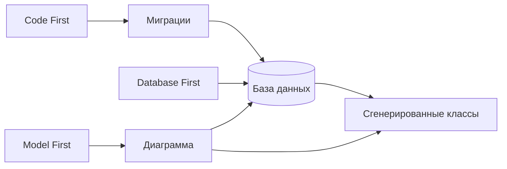

# Подходы к реализации ORM

<div class="article-tags">
  <span class="tag tag-required">ОБЯЗАТЕЛЬНО</span>
  <span class="tag tag-beginner">ДЛЯ НОВИЧКОВ</span>
</div>

<span class="complexity-badge">Разработчику</span>
<span class="complexity-badge">Аналитику</span>
<span class="complexity-badge">Тестировщику</span>  
<span class="complexity-badge">Архитектору</span>
<span class="complexity-badge">Инженеру</span>

---

## Подходы к ORM

При организации работы с ORM, важно понимать ключевые концепции, на основании которых выстраивают взаимодействие между объектной моделью программы и базой данных.

---

### Code First

★ **Code First** – подход, при котором разработчик сначала создаёт классы (объектную модель) в программе, а ORM автоматически генерирует базу данных на основе этих классов.

ORM анализирует структуру классов, их свойства и отношения, чтобы построить соответствующие таблицы, столбцы и связи.

Вот как это работает:
	- разработчик пишет классы, которые представляют сущности (например, User, Product);
	- ORM анализирует эти классы и создаёт миграции (скрипты для изменения структуры базы данных);
	- база данных обновляется в соответствии с изменениями в коде.

Пример:

Представьте себе веб-приложение для управления задачами (to-do list). Разработчик создаёт класс Task, где:
	- свойства — id, title, description, due_date;
	- отношения - Task связан с пользователем через класс User.
	- ORM автоматически создаёт таблицы Задачи и Users с соответствующими столбцами и внешними ключами.

Это удобно для разработчиков, которые предпочитают работать с кодом. Изменения в классах автоматически отражаются в базе данных через миграции. Однако такой подход может быть сложным для крупных проектов с существующей базой данных.

---

### Database First

★ **Database First** – подход, при котором база данных создаётся вручную (через SQL или графические инструменты), а ORM генерирует классы на основе существующей структуры базы данных. Разработчик сначала проектирует базу данных, а затем ORM создаёт объектную модель.

Вот как это работает:
	- разработчик создаёт базу данных, определяя таблицы, столбцы, индексы и связи;
	- ORM анализирует структуру базы данных и генерирует классы, которые отражают эту структуру;
	- программист работает с этими классами в своём коде.

Представим себе систему учёта сотрудников в компании. База данных уже существует - там есть таблица Employees (id, name, position, department_id) и таблица Departments (id, name).

ORM анализирует базу данных и создаёт классы Employees и Department, связанные через отношение "один-ко-многим".

Это подходит для проектов с уже существующей базой данных, и предоставляет полный контроль над структурой базы данных. Но изменения в базе данных могут потребовать повторной генерации классов.

---

### Model First

★ **Model First** – это подход, при котором разработчик сначала создаёт визуальную модель (диаграмму) базы данных, а ORM генерирует как базу данных, так и классы на основе этой модели.

Схема работы:
	- разработчик создаёт диаграмму базы данных с помощью инструментов ORM (например, Entity Framework Designer);
	- ORM генерирует скрипты для создания базы данных и классы для работы с ней;
	- программист использует эти классы в своём коде.

Представим себе систему управления библиотекой.

Разработчик создаёт диаграмму:
	- сущность Book — id, title, author_id;
	- сущность Author: id, name;
	- связь: один автор может иметь много книг.

ORM генерирует базу данных с таблицами Books и Authors, а также классы Book и Author.

Такой подход удобен для начинающих разработчиков, которые предпочитают визуальное проектирование, и обеспечивает лёгкость понимания структуры базы данных благодаря диаграммам.

---

### Сравнение подходов

| Критерий | Code First | Database First | Model First |
| :--- | :--- | :--- | :--- |
| Точка входа | классы в коде | готовая БД | диаграмма |
| Кто владеет схемой | команда разработки | DBA / legacy | совместно |
| Миграции | нативно в ORM | вручную или Flyway | генерация из модели |
| Legacy-база | неудобно | естественно | редко |
| Greenfield | отлично | медленнее старт | хорош для обучения |
| Ревью в Git | да (код + миграции) | SQL-скрипты отдельно | бинарные модели — хуже |



---

### Пошаговый сценарий Code First

Новый API задач (to-do) на PostgreSQL и EF Core ([первая программа EF](/encyclopedia/5-languages/5-05-csharp/441)).

**Шаг 1.** Описать сущности:

```text
КЛАСС User
  Id, Email, DisplayName
  Список Tasks

КЛАСС Task
  Id, Title, Description, DueDate, IsDone
  UserId, User
```

**Шаг 2.** Контекст `AppDbContext` с `DbSet<User>`, `DbSet<Task>`.

**Шаг 3.** Команда CLI: `dotnet ef migrations add InitialCreate`.

**Шаг 4.** ORM сравнивает модель с пустой БД и генерирует:

```sql
CREATE TABLE "Users" (
    "Id" serial PRIMARY KEY,
    "Email" varchar(256) NOT NULL,
    "DisplayName" varchar(100) NOT NULL
);

CREATE TABLE "Tasks" (
    "Id" serial PRIMARY KEY,
    "Title" varchar(200) NOT NULL,
    "UserId" integer NOT NULL REFERENCES "Users"("Id")
);
```

**Шаг 5.** `dotnet ef database update` на dev-машине.

**Шаг 6.** Поле `Priority` в `Task` → миграция `AddTaskPriority` → снова `database update`.

Плюсы подхода:

- быстрые итерации;
- схема хранится в Git рядом с кодом.

Риски без договорённостей с [DBA](https://ru.wikipedia.org/wiki/Администратор_баз_данных):

- неудобные имена таблиц;
- лишние индексы;
- типы столбцов, слабо подходящие для выбранной СУБД.

---

### Database First и существующая схема

Типичная корпоративная база `HR`: сотни таблиц, имена вроде `EMP_MSTR`, `DEPT_CD`. **Scaffold** (обратная генерация) — команда ORM, которая читает метаданные БД и создаёт классы.

1. Подключение к серверу через инструмент (`scaffold`, `edmgen`, `dotnet ef dbcontext scaffold`).
2. Генерация классов `EmpMstr`, `Dept` с атрибутами под реальные столбцы.
3. Разработчик **не правит** сгенерированные файлы вручную — при регенерации правки пропадут.
4. Расширения — partial class или отдельный слой DTO.

```text
# Псевдокоманда scaffold
scaffold-dbcontext \
  --connection "Host=db;Database=HR;..." \
  --provider PostgreSQL \
  --output-dir Generated \
  --context HrContext \
  --no-onconfiguring
```

Когда меняет DBA столбец, команда:

- получает SQL-скрипт от DBA;
- применяет на стендах;
- перегенерирует классы;
- чинит компиляцию там, где сломались имена.

Database First устойчив, когда **источник правды — база данных**, а приложение только читает и пишет через сгенерированные классы.

---

### Model First и визуальная модель

В экосистеме .NET Framework популярен EDMX-дизайнер: перетаскиваете сущности, рисуете связи, нажимаете "Generate Database". В современном EF Core Model First как отдельный дизайнер почти вытеснен Code First + миграции, но идея жива в:

- ER-диаграммах в [проектировании БД](/encyclopedia/7-project/7-06-proektirovanie-i-arhitektura/design/116);
- Prisma Schema (`schema.prisma` — и модель, и миграции);
- JPA с визуальными редакторами в IDE.

Библиотека из примера раздела:

```text
СУЩНОСТЬ Book (id, title, author_id)
СУЩНОСТЬ Author (id, name)
СВЯЗЬ Author 1 — * Book
```

Генератор выдаёт DDL + классы. Удобно на курсах и прототипах; в больших командах диаграмма быстро расходится с кодом, если нет дисциплины.

---

### Гибридные схемы в реальных проектах

Чистый один подход — редкость.

| Зона системы | Частый выбор |
| :--- | :--- |
| Новый микросервис | Code First |
| Интеграция с SAP/1C/старой Oracle | Database First + ручной SQL |
| Общий справочник номенклатуры | Database First, владелец DBA |
| Аналитика / витрины | SQL + ETL, без ORM |
| Поиск / кэш | Redis, Elasticsearch — не ORM |

**Правило владельца схемы** — один из двух вариантов:

- команда приложения ведёт [миграции](./115.md) и согласует их с DBA;
- DBA выкатывает DDL, приложение делает scaffold и не меняет таблицы само.

Смешение без правил даёт конфликт индексов и ситуацию, когда миграция откатывает ручную правку администратора.

---

### Миграции при разных подходах

| Подход | Как эволюционирует схема |
| :--- | :--- |
| Code First | `Add-Migration` / `alembic revision` / `rails g migration` |
| Database First | Flyway, Liquibase, ручные скрипты DBA |
| Model First | регенерация из модели (осторожно с данными) |

EF Core, Django, Alembic, Rails хранят **таблицу истории** (`__EFMigrationsHistory`, `django_migrations`). Flyway — `flyway_schema_history`. Без неё невозможно понять, какие шаги уже применены на prod.

---

### Как выбрать подход

```text
База уже есть и меняется DBA?
  ДА → Database First (+ Flyway/Liquibase при необходимости)
  НЕТ → Проект с нуля?
    ДА → Code First (дефолт для большинства стеков)
    НЕТ → Нужна диаграмма для обучения/прототипа?
      ДА → Model First / Prisma schema
      НЕТ → Code First
```

Дополнительные факторы:

- **Мульти-СУБД** — Code First с абстрактными типами; тесты на той же СУБД, что prod ([FAQ](./998.md)).
- **Строгие аудиты** — Database First, каждый DDL подписан DBA.
- **Стартап / MVP** — Code First, скорость важнее идеальной 3НФ на старте.

---

### Примеры по стекам

| Стек | Code First | Database First |
| :--- | :--- | :--- |
| **.NET / EF Core** | `DbContext` + migrations | `dotnet ef dbcontext scaffold` |
| **Java / Hibernate** | JPA entities + Flyway | `hbm2java`, reverse engineering |
| **Python / SQLAlchemy** | declarative models + Alembic | `sqlacodegen` |
| **Ruby / Rails** | ActiveRecord migrations | rarely — `schema.rb` из БД |
| **Node / Prisma** | `schema.prisma` + `migrate dev` | `db pull` (introspection) |
| **PHP / Laravel** | Eloquent migrations | менее типично |

Prisma `db pull` после изменения БД — по сути Database First в одну команду; дальше снова Code First через `migrate`.

---

### Типичные ошибки при смене подхода

1. **Scaffold + ручные правки в Generated/** — потеряны при регенерации.
2. **Code First на prod без бэкапа** — автоприменение миграций при старте приложения.
3. **Две команды меняют схему** — и через ORM, и через DBA без синхронизации.
4. **SQLite в dev, PostgreSQL в prod** — сюрпризы с `boolean`, `uuid`, `timestamp with time zone`.
5. **Удаление миграции из Git после применения на prod** — история расходится с реальностью.

---

### Практикум — определить подход

Возьмите условный проект "онлайн-запись к врачу":

- новый backend, PostgreSQL, команда 3 разработчика, DBA нет → **Code First**;
- модуль вписывается в больничную MIS с 15-летней Oracle → **Database First** + интеграционный слой;
- учебный курс, студенты рисуют ER в draw.io → **Model First** на первой неделе, затем переход на Code First.

Запишите для своего текущего проекта: кто владеет схемой, где лежат миграции, что произойдёт, если DBA переименует столбец без уведомления.

---

### Code First в Django (иллюстрация)

```text
# models.py
КЛАСС Task(Model):
  title = CharField(max_length=200)
  user = ForeignKey(User, on_delete=CASCADE)
  due_date = DateField(null=True)

# Терминал
python manage.py makemigrations
python manage.py migrate
```

Django создаёт файлы в `app/migrations/0001_initial.py` с операциями `CreateModel`. Это тот же Code First, только синтаксис Python.

---

### Database First в legacy .NET

1. DBA выкатывает `script_v47.sql` на stage.
2. Разработчик: `dotnet ef dbcontext scaffold ... -o Legacy/Generated`.
3. Бизнес-код использует partial class:

```text
// Generated/Employee.cs — не трогать
// Employee.Extensions.cs — методы домена
```

4. При `script_v48` — повтор scaffold, diff в PR, правка сломанных мест.

---

### Model First и Prisma

`schema.prisma` — единый источник:

```text
model User {
  id    Int    @id @default(autoincrement())
  email String @unique
  tasks Task[]
}

model Task {
  id     Int    @id @default(autoincrement())
  title  String
  userId Int
  user   User   @relation(fields: [userId], references: [id])
}
```

Команды:

```text
prisma migrate dev    # dev: Code First
prisma db pull        # introspection: Database First
prisma generate       # клиент для TypeScript
```

Схема в Git, миграции в `prisma/migrations/` — современный аналог Model/Code First.

---

### Смена подхода в живом проекте

| Переход | Сложность | Совет |
| :--- | :--- | :--- |
| Database First → Code First | высокая | зафиксировать baseline-миграцию "как есть" |
| Code First → DBA управляет | средняя | заморозить автогенерацию, Flyway |
| Монолит → микросервис | высокая | каждый сервис — свой Code First и своя БД |

Baseline-миграция: один раз сгенерировать полную схему из существующей БД, пометить как уже применённую (`--fake` в Alembic, ручная вставка в history EF).

---

### Контрольный список перед выбором

1. Есть ли DBA и регламент DDL?
2. Greenfield или интеграция с legacy?
3. Сколько языков/сервисов трогают одну БД?
4. Нужны ли частые изменения схемы в спринте?
5. Требуется ли аудит каждого изменения таблицы?
6. Одна СУБД на все окружения?

Ответы "нет DBA, новый продукт, частые релизы" указывают на Code First. "Oracle 15 лет, жёсткий аудит" — на Database First с Liquibase или Flyway.

---

### Упражнение — три подхода на одной модели

Модель: `Product`, `Category`, связь many-to-one.

| Подход | Действие разработчика |
| :--- | :--- |
| Code First | пишет классы, `migrations add` |
| Database First | DBA создал таблицы, `scaffold` |
| Model First | ER в draw.io → генератор DDL и классов |

Нарисуйте ER и выполните мысленно все три пути — где появляется файл миграции, где сгенерированный код, кто его правит.

---

## Что запомнить

- Code First, Database First и Model First решают одну задачу, но с разной точкой входа.
- Подход выбирают по контексту проекта — greenfield, legacy, требования DBA и скорость изменений.
- В продакшене часто сочетают подходы: CRUD через ORM, отчёты через SQL ([117](./117.md)).

---

## Типовые вопросы на собеседовании

1. В каких случаях вы выбираете Code First и почему?
2. Когда Database First дает более устойчивый результат?
3. Чем Model First полезен на старте проекта?
4. Какие риски возникают при смешении подходов и как вы их контролируете?

---

## Мини-практикум

1. Возьмите текущий проект и определите его фактический подход к ORM.
2. Выпишите 3 аргумента "за" и 3 ограничения этого подхода.
3. Предложите гибридную схему, если в системе есть и CRUD, и сложная аналитика.

---
