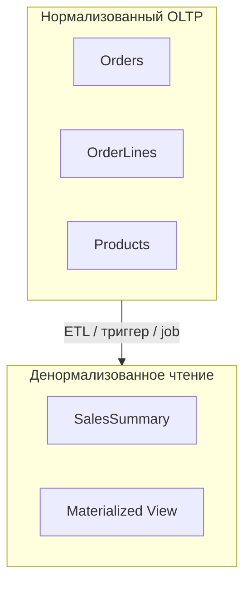

# Нормализация и денормализация данных

<div class="article-tags">
  <span class="tag tag-required">ОБЯЗАТЕЛЬНО</span>
  <span class="tag tag-beginner">ДЛЯ НОВИЧКОВ</span>
</div>

<span class="complexity-badge">Разработчику</span>
<span class="complexity-badge">Аналитику</span>
<span class="complexity-badge">Тестировщику</span>  
<span class="complexity-badge">Архитектору</span>
<span class="complexity-badge">Инженеру</span>


---

## Нормализация

**Нормализация** — разбиение данных по таблицам так, чтобы убрать дублирование и сохранить целостность. **Денормализация** — обратный шаг: дублирование ради ускорения чтения.

★ **Нормализация** — организация данных в БД так, чтобы уменьшить избыточность и обеспечить целостность. Процесс включает разделение данных на несколько связанных таблиц; в ORM каждая сущность обычно соответствует одной нормализованной таблице, связи — через внешние ключи и навигационные свойства.

**Нормальные формы** (1НФ, 2НФ, 3НФ) — ступени этой разбивки. Подробная теория с примерами — [Нормализация данных](/encyclopedia/3-data-markup/3-07-sql/104#normalnye-formy).

Цели нормализации:

- устранение дублирования — одинаковые факты хранятся в одном месте;
- целостность — изменение справочника не требует массовых правок в "широких" таблицах;
- предсказуемые обновления — меньше риска расхождения копий одного поля.

Теория нормальных форм с примерами **1НФ–4НФ** и **НФБК** (заказы, расписание, навыки сотрудника) — в [Нормализация данных](/encyclopedia/3-data-markup/3-07-sql/104.md#normalnye-formy). Кратко для проектирования схемы:

| Форма | Смысл для модели ORM |
| :--- | :--- |
| **1НФ** | Один атрибут — одно значение; списки в JSON или столбцах `item1`, `item2` лучше вынести в дочернюю сущность |
| **2НФ** | Поля заголовка (`Order`) отдельно от строк состава (`OrderLine`) при составном ключе позиции |
| **3НФ** | Справочники (`Customer`, `Department`) отдельно от транзакций (`Order`, `Employee`) |
| **НФБК / 4НФ** | Дополнительное разбиение при редких зависимостях; в типовом CRUD достаточно 3НФ |

При нормализации растёт число сущностей и `JOIN` в запросах. Это ожидаемая плата за согласованность; для отчётов часто добавляют денормализованные представления или отдельные read-модели.

Нормализацию выбирают, когда данные **часто меняются**, важна **целостность** (учёт, платежи, медицина) и схему строят из связанных таблиц с FK вместо одной широкой таблицы.

---

## Денормализация

### Понятие денормализации

★ **Денормализация** — объединение данных из нескольких таблиц в одну или добавление копий полей для ускорения чтения. Часто применяют в отчётах и витринах, где данные читают чаще, чем меняют.

Цели денормализации:

- меньше `JOIN` в тяжёлых отчётах;
- быстрее чтение при редких обновлениях;
- заранее посчитанные агрегаты в сводных таблицах.

### Пример денормализации

★ Пример денормализации.

Представим интернет-магазин. В нормализованной схеме есть `Orders`, `OrderItems`, `Products`. Для ускорения отчётов создают таблицу `SalesSummary` с полями `product_name`, `total_sales`, `average_price` — значения считают заранее ночным job.

Плюсы:

- быстрее чтение отчётов;
- проще SQL без длинных `JOIN`.

Минусы:

- больше места на диске;
- риск расхождения копий при обновлении цены;
- нужны правила синхронизации или триггеры.

---

### Когда уместна денормализация

- данные читают чаще, чем меняют (аналитика, отчётность);
- важна скорость отклика под нагрузкой;
- агрегаты уже посчитаны в ETL или ночном job ([пакетная работа](/encyclopedia/3-data-markup/3-11-analiz-dannyh/433)).


---

### Эволюция схемы от одной таблицы к 3НФ

**0NF — всё в одной широкой таблице:**

| OrderId | CustomerName | CustomerCity | Product1 | Qty1 | Product2 | Qty2 |
| :--- | :--- | :--- | :--- | :--- | :--- | :--- |
| 1 | Иванов | Москва | Ноутбук | 1 | Мышь | 2 |

Пустые `Product2`, лимит двух товаров, дублирование города.

**1НФ — отдельные строки, но клиент в каждой:**

| OrderId | CustomerName | Product | Qty |
| 1 | Иванов | Ноутбук | 1 |
| 1 | Иванов | Мышь | 2 |

**3НФ — справочники вынесены (пример ниже).**

---

### Пример нарушения 3НФ в заказе

Строка заказа хранит имя клиента. Имя относится к клиенту (`CustomerId`), а не к идентификатору строки заказа — это нарушение 3НФ.

| OrderLineId | OrderId | CustomerName | ProductId | Qty |
| :--- | :--- | :--- | :--- | :--- |
| 1 | 100 | Иванов | 5 | 2 |

Смена фамилии клиента требует обновить все его строки во всех заказах.

**Лучше (3НФ)**:

```sql
Customers (Id, Name)
Orders (Id, CustomerId, OrderDate)
OrderLines (Id, OrderId, ProductId, Qty)
```

В ORM:

```text
Customer.Orders → коллекция Order
Order.Lines → коллекция OrderLine
Order.Customer → навигация назад
```

Запрос "все строки заказа с именем клиента":

```sql
SELECT c.Name, p.Name, ol.Qty
FROM OrderLines ol
JOIN Orders o ON o.Id = ol.OrderId
JOIN Customers c ON c.Id = o.CustomerId
JOIN Products p ON p.Id = ol.ProductId
WHERE o.Id = @orderId;
```

Через ORM тот же запрос — с `Include` / join fetch или проекцией в DTO.

---

### Когда нормализация избыточна

Чрезмерное дробление на учебном проекте:

```text
PhoneCountryCode (Id, Code)
PhoneArea (Id, CountryId, Area)
PhoneSubscriber (Id, AreaId, Number)
CustomerPhone (CustomerId, SubscriberId)
```

Практичный ориентир для [OLTP](https://ru.wikipedia.org/wiki/OLTP)-систем (операционная обработка заказов, учёт) — **до 3НФ**. Дальнейшее дробление — только при измеренной проблеме.

---

### Стратегии денормализации

| Стратегия | Описание | Пример |
| :--- | :--- | :--- |
| **Дублирование столбцов** | копия поля из родителя | `Order.CustomerName` |
| **Сводная таблица** | агрегаты заранее | `DailySalesSummary` |
| **Материализованное представление** | периодический refresh | отчёт по регионам |
| **JSON-снимок** | документ в столбце | `Order.ShippingAddressJson` |
| **Read model / CQRS** | отдельная БД под чтение | каталог для витрины |



---

### Согласованность при денормализации

Если в `Orders` дублируете `CustomerName`, при смене имени клиента нужно:

- обновить `Customers.Name`;
- обновить все `Orders` этого клиента **или**
- принять, что исторические заказы показывают имя "на момент заказа" (осознанное решение).

Второй вариант часто **правильнее** для юридических документов: в счёте имя не должно меняться задним числом.

Триггер в БД:

```sql
-- Упрощённо: запретить менять имя, если есть заказы (политика бизнеса)
-- Или наоборот — каскадное обновление денормализованного поля
```

ORM не отменяет выбор политики — её фиксируют в требованиях.

---

### Пример SalesSummary

Нормализованный расчёт (медленно на миллионах строк):

```sql
SELECT p.Category,
       SUM(ol.Qty * ol.UnitPrice) AS Revenue
FROM OrderLines ol
JOIN Products p ON p.Id = ol.ProductId
JOIN Orders o ON o.Id = ol.OrderId
WHERE o.CreatedAt >= '2025-01-01'
GROUP BY p.Category;
```

Денормализованная таблица, обновляемая ночным job:

```sql
CREATE TABLE SalesSummary (
    ReportDate DATE,
    Category VARCHAR(50),
    Revenue DECIMAL(18,2),
    PRIMARY KEY (ReportDate, Category)
);
```

Дневной отчёт читает одну маленькую таблицу. Платите за job, задержку актуальности (данные "на вчера") и код синхронизации.

---

### ORM и денормализованные сущности

Сущность `SalesSummary` в ORM — read-only: без `Add` из UI, обновление только через сервис ETL. Можно пометить как keyless / view mapping:

```text
СУЩНОСТЬ SalesSummary
  ТОЛЬКО_ЧТЕНИЕ
  МАППИНГ на VIEW vw_SalesSummary или таблицу job
```

Смешивать в одном `DbContext` OLTP-сущности и тяжёлые отчётные view — нормально, если не тянуть view в `SaveChanges` по ошибке.

---

### Индексы и денормализация

Медленный `JOIN` иногда лечится **индексом**, без дублирования столбцов:

```sql
CREATE INDEX IX_OrderLines_OrderId ON OrderLines(OrderId);
CREATE INDEX IX_Orders_CustomerId_CreatedAt ON Orders(CustomerId, CreatedAt);
```

Правило: сначала `EXPLAIN`, потом денормализация с измеренным выигрышем.

---

### Нормализация в NoSQL и ORM

В MongoDB документ заказа может вложить строки и клиента — естественная денормализация. Mongoose-ODM маппит JSON на объекты. Для частых изменений цены товара вложенная копия устаревает — нужна политика обновления или ссылка только по `productId`.

Реляция + ORM чаще держат нормализованный OLTP и выносят денормализацию в витрины.

---

### Чек-лист выбора

| Вопрос | Нормализация | Денормализация |
| :--- | :--- | :--- |
| Данные часто меняются? | да | осторожно |
| Нужна строгая целостность? | да | нужны триггеры/job |
| Тяжёлые отчёты каждый день? | медленнее | сводки, MV |
| Команда маленькая, MVP? | 3НФ достаточно | не раньше профилирования |

---

### Денормализация в API без дублирования в БД

Проекция в DTO с JOIN — не денормализация хранения:

```text
orders = context.Orders.Select(o => new OrderListDto {
  Id = o.Id,
  CustomerName = o.Customer.Name,
  Total = o.Lines.Sum(l => l.Qty * l.UnitPrice)
})
```

---

### Снимок цены в строке заказа

`OrderLine.UnitPrice` фиксирует цену на момент покупки — осознанная копия, не ошибка нормализации.

---

## Что запомнить

- Нормализация снижает дублирование и упрощает обновления; в ORM одна сущность ≈ одна таблица в типовом OLTP.
- Денормализация ускоряет чтение ценой избыточности и дисциплины синхронизации.
- Исторические документы часто **намеренно** денормализуют "снимок" на момент операции.
- Сначала индексы и план запроса, потем дублирование столбцов.
- Теория нормальных форм подробно — [Нормализация данных](/encyclopedia/3-data-markup/3-07-sql/104#normalnye-formy).

---

## Типовые вопросы на собеседовании

1. Приведите пример нарушения 3НФ и исправление через вынос справочника.
2. Чем денормализация отличается от материализованного представления?
3. Как хранить адрес доставки в заказе — ссылка или копия полей?
4. Когда денормализация вреднее, чем индекс на FK?
5. Как ORM-запрос с пятью `Include` связан с нормализацией схемы?

---

## Мини-практикум

1. Нарисуйте ER для интернет-магазина в 3НФ (клиент, заказ, строка, товар).
2. Добавьте денормализованную `ProductName` в строку заказа и опишите правило обновления.
3. Напишите SQL отчёта и оцените, нужна ли сводная таблица при 10 тысячах и 10 миллионах строк.

