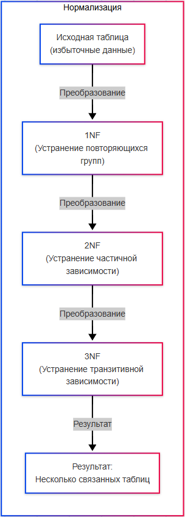
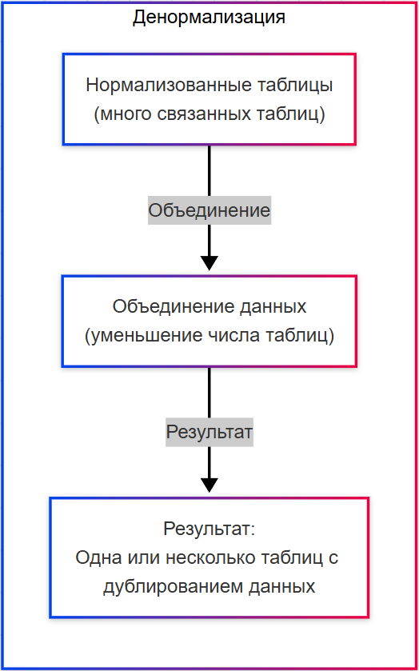

# Нормализация и денормализация данных

  ОБЯЗАТЕЛЬНО
  ДЛЯ НОВИЧКОВ

Разработчику
Аналитику
Тестировщику  
Архитектору
Инженеру

## Нормализация

★ **Нормализация** – это процесс организации данных в БД таким образом, чтобы уменьшить избыточность (дублирование данных) и обеспечить целостность данных. Этот процесс включает разделение данных на несколько связанных таблиц.

Цели нормализации:
	- устранение дублирования данных - одинаковые данные хранятся только один раз;
	- обеспечение целостности данных - изменение данных в одном месте автоматически отражается во всех связанных местах;
	- упрощение обновления данных - уменьшение риска несогласованности данных.

---

## Формы нормализации (нормальные формы)

### Первая нормальная форма (1NF)

**Первая нормальная форма (1NF)** - все значения в столбцах должны быть атомарными (неделимыми). Вместо хранения списка значений в одной ячейке (например, "яблоки, груши") каждое значение должно быть в отдельной строке.

---

### Вторая нормальная форма (2NF)

**Вторая нормальная форма (2NF)**:
	- таблица должна соответствовать 1NF;
	- все неключевые столбцы должны зависеть от полного первичного ключа.

Если есть таблица заказов с колонками order_id, product_id, product_name, то product_name должен быть вынесен в отдельную таблицу Products.

---

### Третья нормальная форма (3NF)

**Третья нормальная форма (3NF)**:
	- таблица должна соответствовать 2NF;
	- все неключевые столбцы должны зависеть только от первичного ключа (а не от других неключевых столбцов).

Если в таблице Employees есть столбец department_name, который зависит от department_id, то department_name должен быть вынесен в отдельную таблицу Departments.

---

### Более высокие формы

**Более высокие формы (4NF, 5NF, форма Бойса-Кодда)** используются реже и применяются для специфических случаев.

При использовании нормализации, уменьшается избыточность данных, обеспечивается их целостность, а обновление упрощается. Минусом является увеличение числа таблиц и связей, что может замедлить выполнение запросов и повысить сложность написания JOIN-операций.

Нормализацию лучше применять:
	- когда данные часто обновляются (например, системы учёта, где важно избежать дублирования и несогласованности);
	- когда важна целостность данных (например, банковские системы, медицинские записи);
	- когда объем данных относительно небольшой (производительность запросов не является критичной.

---

## Денормализация

### Понятие денормализации

★ **Денормализация** – это процесс объединения данных из нескольких таблиц в одну или добавление избыточных данных для повышения производительности чтения. Этот подход часто используется в системах с высокими требованиями к скорости выполнения запросов.

Цели денормализации:
	- ускорение запросов - уменьшение числа JOIN-операций за счёт хранения данных в одной таблице;
	- оптимизация для чтения - часто данные читаются чаще, чем изменяются, поэтому денормализация может быть полезной;
	- упрощение аналитики - хранение предварительно вычисленных данных (например, сводных таблиц) для быстрого анализа.

---

### Пример денормализации

★ Пример денормализации.

Представим интернет-магазин. В нормализованной базе данных есть таблицы Orders, OrderItems, Products. Для ускорения отчётов о продажах можно создать денормализованную таблицу SalesSummary, которая содержит предварительно вычисленные данные: product_name, total_sales, average_price.
При использовании денормализации, повышается производительность чтения, упрощаются запросы (меньше JOIN), а для аналитики это удобно. Минусы - увеличение объема данных (избыточность), риск несогласованности данных при обновлении, и сложность поддержки целостности данных.

### Применение денормализации

Денормализация применима:
	- когда данные читаются чаще, чем изменяются (например, аналитические системы, системы отчётности);
	- когда важна скорость выполнения запросов (высоконагруженные веб-приложения);
	- когда данные предварительно агрегированы (хранилища данных).

---
