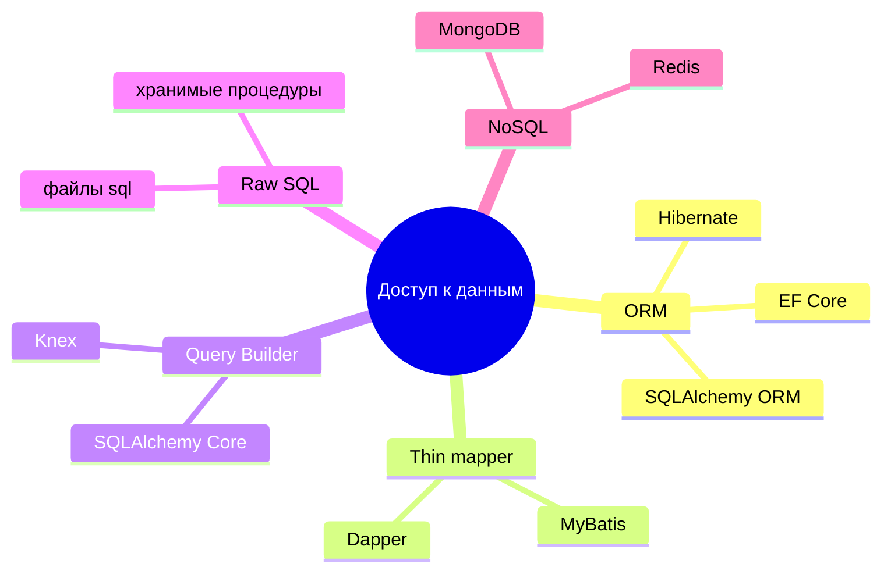

# Ограничения и проблемы ORM

<div class="article-tags">
  <span class="tag tag-required">ОБЯЗАТЕЛЬНО</span>
  <span class="tag tag-beginner">ДЛЯ НОВИЧКОВ</span>
</div>

<span class="complexity-badge">Разработчику</span>
<span class="complexity-badge">Аналитику</span>
<span class="complexity-badge">Тестировщику</span>  
<span class="complexity-badge">Архитектору</span>
<span class="complexity-badge">Инженеру</span>

---

## Проблемы ORM

### Несовпадение объектов и таблиц (impedance mismatch)

**Object-Relational Impedance Mismatch** — систематическое различие между [ООП](/encyclopedia/4-code-dev/4-08-oop/intro) и реляционными таблицами. ORM сглаживает разрыв, но не убирает его полностью.

Проблемные различия:

1. **Структура.** В ООП данные и методы живут в объекте; в SQL — строки и столбцы без поведения.
2. **Связи.** В коде — ссылки между объектами; в БД — FK и `JOIN`.
3. **Идентичность.** В памяти два объекта могут быть разными экземплярами; в БД строка одна, ключ — `Id`.
4. **Наследование.** Иерархии классов плохо ложатся на плоские таблицы (см. раздел ниже про наследование).
5. **Типы.** В коде — свои классы; в SQL — ограниченный набор типов СУБД.

Это порождает фундаментальные отличия. К примеру, в классе User есть метод getFullName(), который объединяет имя и фамилию пользователя. В ООП это просто метод объекта, тогда как в реляционной БД придётся выполнить SQL-запрос SELECT с использованием конкатенации CONCAT.

---

### Преимущества и недостатки

Конечно, преимущества ORM значительнее - упрощение работы с БД, переносимость между разными СУБД, автоматизация, безопасность, ускорение процесса разработки.

Но недостатки ORM тоже существуют:
	- **производительность** - автоматически сгенерированные запросы могут быть менее эффективными, чем ручные;
	- **ограниченная гибкость** - сложные запросы (например, с множеством JOIN-операций) могут быть трудно реализуемы через ORM;
	- **обучение** - необходимо изучить ORM, что может быть непростой задачей для новичка;
	- **риск "магии"** - разработчики могут не понимать, какие именно SQL-запросы генерировать ORM.

К примеру, аналитик, который поставит задачу разработчику, мог руководствоваться знанием SQL, и для себя он мог сделать огромный запрос, который успешно даёт результат. Но учитывая объем запроса и множество подзапросов, объединений и прочего функционала, разработчику может быть довольно сложно реализовать ту же логику через ORM, из-за чего может возникнуть недопонимание, мол, "чего тут такого сложного?".

ORM - мощный инструмент, но не всегда подходит. Он не подойдёт для систем со сложными аналитическими запросами, систем с высокой нагрузкой, необходимостью полного контроля и при использовании нестандартных или специализированных баз данных.

---

### Альтернативы

★ Альтернативами ORM являются:

1. "Сырой" SQL - написание SQL-запросов вручную;
2. Query Builders - инструменты, которые позволяют строить SQL-запросы программно (Knex.js в JavaScript, SQLAlchemy Core в Python);
3. Data Mappers - инструменты, которые разделяют объектную модель и БД (Dapper в C#, MyBatis в Java);
4. NoSQL - использование нереляционных баз данных, например, MongoDB, Redis.

Но в крупных системах подходы могут комбинироваться.

В интернет-магазине часто комбинируют инструменты:

- **ORM** — каталог, заказы, CRUD;
- **Query Builder** — сложные фильтры каталога;
- **сырой SQL** — аналитические отчёты, материализованные представления в PostgreSQL;
- **NoSQL** (Redis, MongoDB) — сессии, корзина, кэш ([раздел NoSQL](/encyclopedia/3-data-markup/3-06-nosql/intro)).

Прямой SQL в коде — нормальная практика для узких задач, если он живёт в отдельном слое запросов ([ORM на практике](./118.md)).

---

### Проблема N+1

**N+1** — лишние запросы к БД: один запрос за списком родительских записей и отдельный запрос на каждую связанную строку.

```text
1. SELECT * FROM Orders LIMIT 100
2. Для каждого order: SELECT * FROM Customers WHERE Id = ?
   ... ещё 100 запросов
```

**Лечение:**

```text
-- Один запрос с JOIN (eager loading)
Загрузить Orders ВКЛЮЧАЯ Customer

-- Или проекция без лишних навигаций
SELECT o.Id, o.Total, c.Name
```

| Подход | Запросов | Память |
| :--- | :--- | :--- |
| Ленивая загрузка без контроля | N+1 | низкая до обхода цикла |
| Жадная загрузка (`Include`, join fetch) | 1–2 | выше |
| DTO-проекция `Select` | 1 | минимальная |

**Жадная загрузка (eager loading)** — связи подтягиваются одним запросом с `JOIN`. Подробнее — [ORM на практике](./118.md#оптимизация-производительности-и-n1-проблема).

---

### Ленивая загрузка (lazy loading)

**Ленивая загрузка** — связанные данные подтягиваются при первом обращении к навигационному свойству, отдельно от основного запроса.

```text
ДЛЯ КАЖДОГО order В orders
  ВЫВЕСТИ order.Customer.Name   // отдельный SELECT
```

Включать ленивую загрузку в веб-API без явных правил рискованно. Альтернатива — **явная загрузка** (`Include`, `ThenInclude`) только для нужных связей ([112](./112.md)).

---

### Отслеживание изменений (change tracking)

ORM **отслеживает изменения** полей загруженных объектов и при `SaveChanges` строит `UPDATE` только по изменённым столбцам.

```text
user = context.Users.Find(1)
user.LastLogin = now()
context.SaveChanges()   // UPDATE Users SET LastLogin = ...
```

Полезно включить лог SQL на dev. На prod — без параметров с ПДн ([защита данных](/encyclopedia/8-infra-security/8-03-zabota-o-kode-i-dannyh/117)).

Отсоединённый объект:

```text
user = GetUserFromApi()   // вне контекста
user.Name = "Новое"
context.SaveChanges()     // ничего не обновит — объект не отслеживается
```

Нужен `Attach`, `Update` или загрузка в том же контексте.

---

### Наследование в ООП и таблицы в БД

Стратегии маппинга иерархии:

| Стратегия | Таблицы | Плюс | Минус |
| :--- | :--- | :--- | :--- |
| **TPH** (single table) | одна + discriminator | простые запросы | много NULL |
| **TPT** (table per type) | таблица на класс | нормализация | тяжёлые JOIN |
| **TPC** (table per concrete) | только листья | чистые листья | сложные полиморфные запросы |

Часто **композиция** (`Employee` + `ManagerProfile`) проще наследования в БД.

---

### Сложные запросы вне зоны ORM

Примеры, где чаще пишут SQL или Query Builder:

- оконные функции `ROW_NUMBER`, `LAG`, `PARTITION BY`;
- рекурсивные CTE (иерархия категорий);
- пивот-отчёты;
- hints и специфика диалекта (`FOR UPDATE SKIP LOCKED`);
- bulk-операции на миллионах строк ([пакетная работа](/encyclopedia/3-data-markup/3-11-analiz-dannyh/433)).

Гибрид в EF: `FromSqlRaw`, `ExecuteSqlRaw`; в SQLAlchemy — `text()`; в Hibernate — `@Query(nativeQuery = true)`.

---

### Сравнение ORM, Query Builder и сырого SQL

| Инструмент | Уровень | Пример |
| :--- | :--- | :--- |
| **ORM** | объекты и связи | `db.Orders.Include(o => o.Lines)` |
| **Query Builder** | построитель SQL в коде | Knex, SQLAlchemy Core |
| **Сырой SQL** | полный контроль | файл `.sql` + Dapper |

**Query Builder** не держит граф объектов в памяти, зато явно видны `JOIN` и `WHERE` ([SQL](/encyclopedia/3-data-markup/3-07-sql/intro)).

---

### Dapper и тонкий маппинг

**Dapper** — библиотека для .NET: выполняет SQL и переносит строки результата в объекты без отслеживания изменений.

```text
sql := "SELECT Id, Name FROM Products WHERE Category = @cat"
products := connection.Query<Product>(sql, { cat: "laptops" })
```

Быстрее на чтении отчётов; миграции и связи — не его задача. Типичный микс: EF для CRUD, Dapper для дашборда.

---

### Типичные ошибки производительности

1. `ToList()` до фильтра — вытянули всю таблицу в память.
2. `SELECT *` через ORM без проекции.
3. Отсутствие пагинации `Skip/Take`.
4. Сравнение строк без индекса по `LOWER(Email)`.
5. Сотни `SaveChanges` в цикле вместо batch.

---

### Переносимость между СУБД

ORM обещает смену одной СУБД на другую. На практике расходятся детали:

- `uuid` в PostgreSQL и `uniqueidentifier` в SQL Server;
- `boolean` и `bit`;
- `LIMIT` и `TOP`;
- последовательности и `IDENTITY`;
- отложенные внешние ключи ([DEFERRABLE в PostgreSQL](./119.md)).

Интеграционные тесты запускают на той же СУБД, что и прод ([FAQ раздела](./998.md)).

---

### Когда использовать ORM

| Сценарий | ORM | Альтернатива |
| :--- | :--- | :--- |
| CRUD API, связи, миграции | да | — |
| OLAP, data warehouse | нет | SQL, Spark, dbt |
| Высокочастотный append-only лог | нет | Kafka, timeseries DB |
| Простой read-only отчёт | частично | SQL + Dapper |
| Граф друзей, глубокие обходы | слабо | графовая БД |
| Кэш сессий | нет | Redis |

---

### Организация гибрида в коде

Правила команды (пример):

```text
1. Доступ к БД только через папки Infrastructure/Repositories
2. Сырой SQL только в *Queries.cs / *.sql с тестом плана
3. Логировать длительность > 200 ms
4. Code review: любой Include > 2 уровней — обоснование
5. Запрет lazy loading в production-конфиге API
```

ORM остаётся основным путём для CRUD. SQL подключают точечно для отчётов и оптимизаций — в отдельных классах запросов, без размазывания по домену.

---

### Сравнение альтернатив



---

### Кейс — отчёт по продажам в регионах

Аналитик просит SQL на 8 JOIN и оконную функцию. ORM-эквивалент нечитаем или не транслируется.

**Решение:**

```text
Reports/SalesByRegion.sql   -- версионируется в Git
SalesReportRepository.Run() -- Dapper, read-only connection
```

ORM остаётся для `PlaceOrder`, SQL — для отчёта. Общие типы — DTO, не entity.

---

### Кейс — импорт 100 000 товаров

```text
// Плохо
ДЛЯ КАЖДОГО row В csv
  context.Products.Add(Map(row))
  context.SaveChanges()
```

```text
// Лучше
БАТЧ 1000 строк
  BulkInsert или COPY
  одна транзакция на батч
```

ORM change tracker на 100k объектов — память и время. См. [пакетная работа](/encyclopedia/3-data-markup/3-11-analiz-dannyh/433).

---

### Кейс — полнотекстовый поиск

`LIKE '%ноут%'` по миллиону строк — full scan. ORM не заменяет:

- PostgreSQL `tsvector` + GIN;
- Elasticsearch / OpenSearch для каталога.

Часто **синхронизация** OLTP (ORM) → поисковый индекс асинхронно.

---

### Признаки узкого места в ORM

- p95 API растёт вместе с числом связанных сущностей;
- в логе > 20 SQL на один HTTP-запрос;
- CPU БД высокий при простом экране списка;
- разработчики добавляют `AsNoTracking` везде "чтобы ускорить";
- отчёты копируют в Excel, потому что через приложение не тянет.

Любой пункт — сигнал к профилированию и гибриду.

---

### Краткая шпаргалка по выбору инструмента

```text
CRUD + связи + миграции          → ORM
Сложный одиночный SELECT         → SQL / Query Builder
Массовая загрузка                → bulk / COPY
Кэш сессии                       → Redis
Граф, лента, рекомендации        → специализированное хранилище
```

---

## Что запомнить

- Ограничения ORM предсказуемы и управляемы при инженерном подходе.
- Производительность и сложная аналитика часто требуют гибридного доступа к данным.
- Устойчивый проект заранее определяет, когда команда переходит от ORM к SQL.

---

## Типовые вопросы на собеседовании

1. В чем суть Object-Relational Impedance Mismatch?
2. Какие признаки показывают, что ORM становится узким местом?
3. Как вы организуете гибридный подход ORM + SQL без хаоса в коде?
4. Какие альтернативы ORM вы использовали и в каких сценариях?

---

## Мини-практикум

1. Найдите в своем проекте один запрос, который лучше оставить в ORM, и один, который лучше вынести в SQL.
2. Опишите правила команды, по которым принимается такое решение.
3. Составьте мини-план внедрения логирования SQL и ревью производительности.

---
