import DesktopWindowPlay from '@site/src/components/DesktopWindowPlay.jsx';

# Архитектура десктопных приложений

<div class="article-tags">
  <span class="tag tag-required">ОБЯЗАТЕЛЬНО</span>
  <span class="tag tag-beginner">ДЛЯ НОВИЧКОВ</span>
</div>

<span class="complexity-badge">Разработчику</span>
<span class="complexity-badge">Архитектору</span>
<span class="complexity-badge">Инженеру</span>

---

## Как устроены десктопные приложения

### Десктопное приложение - окно, события и mainloop

Прежде чем писать код на Tkinter, Qt или Electron, стоит увидеть **общую схему**: окно, очередь событий, UI-поток и граница с ОС через драйверы. Тогда "зависание кнопки" и "почему нужен mainloop" становятся предсказуемыми.

Практика по языкам — в [разделе десктоп](./intro.md); особенности потоков и памяти — [112.md](./112.md).

---

### Что такое десктопное приложение?

**Десктопное приложение** — это программа, которая работает непосредственно на компьютере пользователя, используя ресурсы операционной системы для отображения графического интерфейса и обработки действий человека. В отличие от веб-сайтов, которые работают внутри браузера, десктопные приложения имеют прямой доступ к файловой системе, периферийным устройствам и системным вызовам платформы. 

Основой любого такого приложения является **графический интерфейс пользователя (GUI)**, состоящий из набора визуальных элементов, управляемых кодом.

---

### Драйверы и доступ к устройствам \{#drayvery-i-dostup\}

Приложение редко общается с "железом" напрямую. Когда нужно прочитать данные с принтера, диска, USB-устройства или сетевой карты, код вызывает функции **операционной системы**, а ОС передаёт запрос **драйверу** — программному компоненту, который знает, как говорить с конкретным устройством или его контроллером. Драйвер возвращает результат ядру, ядро — вашему приложению.

По [определению Microsoft](https://learn.microsoft.com/ru-ru/windows-hardware/drivers/gettingstarted/what-is-a-driver-):

- драйвер пишет не только производитель устройства — для стандартного оборудования драйвер может поставлять сама Microsoft;
- запрос часто проходит **стек драйверов** (filter drivers, function driver, bus driver), а не один модуль;
- есть **драйверы программного обеспечения** — компоненты в режиме ядра без привязки к железу (доступ к защищённым структурам ОС).

Для обычного десктоп-разработчика важно понимать границу: UI и бизнес-логика живут в **пользовательском режиме**, а драйверы — в **режиме ядра**; ошибка в драйвере может нарушить стабильность всей системы. Подробнее о платформе Windows, стеках и среде разработки — в статье [Разработка приложений для Windows (Microsoft Learn)](./116.md).

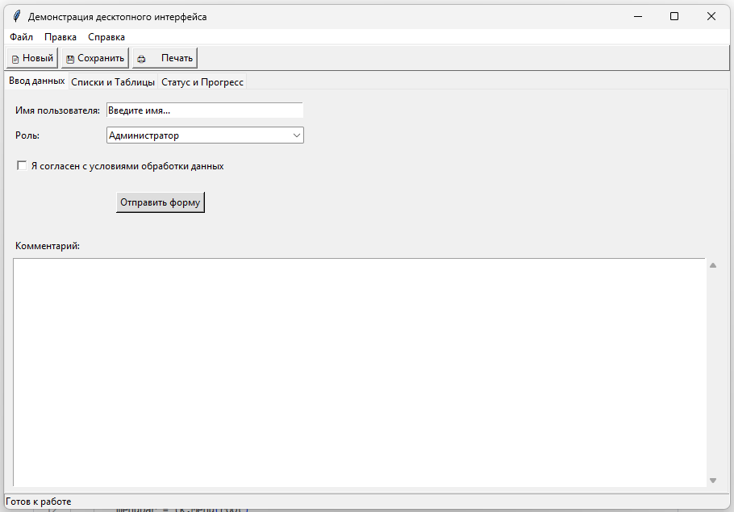

Здесь мы видим пример типичного десктопного приложения, в котором имеется полный набор. Давайте же разберём структуру.

---

<DesktopWindowPlay />

---

### Архитектура окна и основные компоненты

**Окно** представляет собой фундаментальную единицу взаимодействия в десктопном приложении. 

Это прямоугольная область на экране, ограниченная рамкой, которой управляет операционная система. 

Каждое окно обладает:
- собственным контекстом отрисовки, 
- координатной системой,
- набором свойств, определяющих его поведение.

Типичное окно состоит из нескольких стандартных зон. 

---

#### Заголовок

Верхняя часть называется **заголовком (Title Bar)**. Заголовок содержит название приложения или текущего документа, а также **кнопки управления окном**. Эти кнопки позволяют *свернуть* окно в панель задач, *развернуть* его на весь экран или *закрыть* приложение. Заголовок также служит областью захвата для перемещения окна по экрану с помощью мыши.

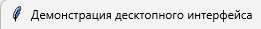

---

#### Меню

Под заголовком часто располагается **меню (Menu)**. Это горизонтальная панель со списком категорий действий, таких как **Файл**, **Правка**, **Вид**. При нажатии на пункт меню открывается выпадающий список с конкретными командами. Меню обеспечивает доступ ко всем основным функциям программы в структурированном виде.

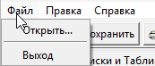

---

#### Панель инструментов

Ниже меню может находиться **панель инструментов (Toolbar)**. Панель инструментов содержит набор кнопок с иконками, дублирующих наиболее часто используемые команды из меню. Использование иконок ускоряет работу, позволяя выполнять действия одним кликом без поиска в глубине меню. Панели инструментов могут быть плавающими или закрепленными по краям окна.

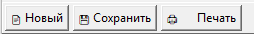

---

#### Область контента

Центральная часть окна называется **областью контента (Content Area)**. Здесь отображается основная информация: текст документа, изображение, таблица данных или форма ввода. Область контента занимает все свободное пространство между верхними панелями и нижними элементами интерфейса.

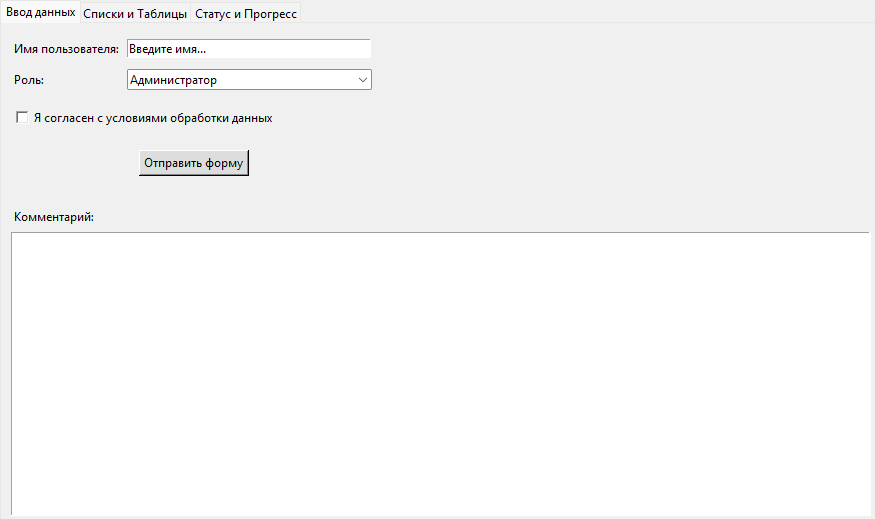

---

#### Строка состояния

В нижней части окна часто размещается **строка состояния (Status Bar)**. Строка состояния отображает справочную информацию о текущем режиме работы, координатах курсора, прогрессе выполнения операции или сообщения об ошибках. Она носит информационный характер и редко содержит элементы управления.

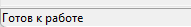
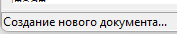

---

#### Полоса прокрутки

Если содержимое области контента не помещается в видимую часть окна, появляются **полосы прокрутки (Scrollbars)**. Вертикальная полоса находится справа, горизонтальная — снизу. Полосы прокрутки позволяют перемещать видимую область относительно всего содержимого. Пользователь перетаскивает ползунок или нажимает на стрелки для навигации по документу.

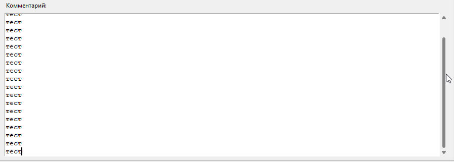

---

#### Вкладки

Современные интерфейсы активно используют **вкладки (Tabs)**. Вкладки позволяют группировать различные документы или настройки в одном окне. Переключение между вкладками меняет содержимое центральной области, не создавая новых окон. Это экономит место на экране и упорядочивает работу с множеством открытых файлов.

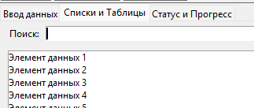

---

### Элементы управления и ввод данных

Интерфейс приложения строится из набора стандартных **элементов управления (Widgets или Controls)**. Каждый элемент имеет четкое назначение и реагирует на действия пользователя.

---

#### Label

**Label (Метка)** — простейший элемент для отображения статического текста. Метки используются для подписей полей ввода, заголовков разделов или пояснений. Текст в метке недоступен для редактирования пользователем.

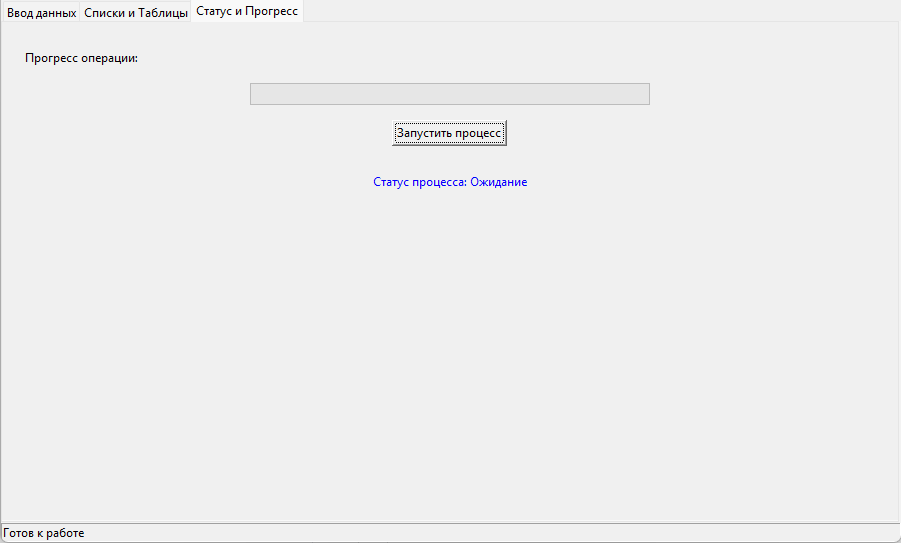

---

#### TextBox

**TextBox (Поле ввода)** предназначено для ввода текста пользователем. Поле может быть однострочным (для имени, пароля) или многострочным (для заметок, кода). При вводе текста программа получает событие изменения содержимого и может реагировать на него мгновенно или по факту потери фокуса.

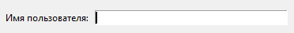

---

#### Button

**Button (Кнопка)** инициирует действие при нажатии. Кнопка имеет визуальное состояние: обычное, нажатое, наведенное курсором и неактивное. Нажатие кнопки отправляет команду в логику приложения для выполнения конкретной функции.

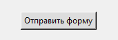

---

#### ComboBox

**ComboBox (Выпадающий список)** сочетает поле ввода и список вариантов. Пользователь может выбрать готовый вариант из списка или ввести свое значение, если это разрешено настройками. Этот элемент экономит место, скрывая список до момента взаимодействия.

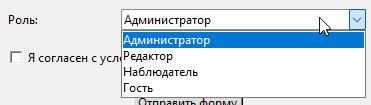

---

#### ListBox

**ListBox (Список)** отображает перечень элементов для выбора. Список поддерживает выбор одного или нескольких пунктов. 

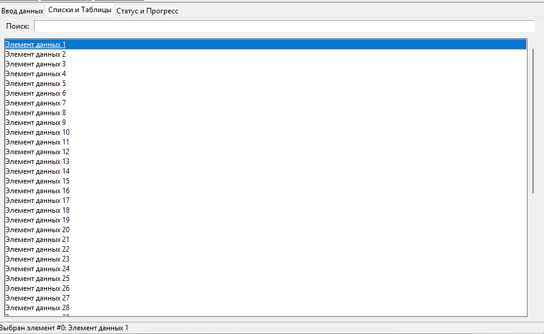

---

#### DataGrid

**DataGrid (Таблица)** представляет данные в виде строк и столбцов. Таблицы позволяют сортировать данные, изменять размер колонок и редактировать ячейки напрямую.

---

#### Checkbox

**Checkbox (Флажок)** позволяет включить или выключить опцию. Состояние флажка бинарное: отмечено или не отмечено. 

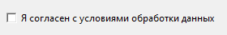

---

#### Progress bar

**Progress bar (Индикатор прогресса)** визуализирует длительность операции. Полоса заполняется пропорционально выполненной работе, давая пользователю понимание времени ожидания.

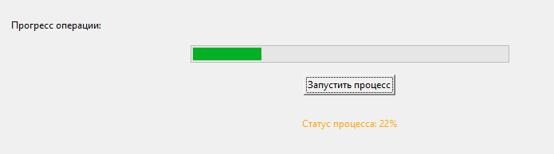

---

#### Search Box

**Поле поиска (Search Box)** специализировано для фильтрации данных. При вводе символов приложение автоматически обновляет отображаемый список, оставляя только совпадающие элементы.

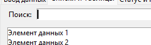

---

### Диалоговые окна и всплывающие элементы

**Диалоговое окно** — это специальное окно, которое блокирует работу с основным интерфейсом до получения ответа от пользователя. 

Диалоги используются для подтверждения критических действий (удаление файла), настройки параметров или выбора файла через стандартный проводник. Модальные диалоги требуют обязательного ответа, немодальные позволяют переключаться между окнами.

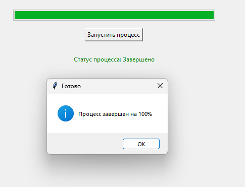

**Всплывающие окна (Popups)** включают **подсказки (Tooltips)**, **контекстные меню** и **уведомления**. 

**Подсказка** появляется при наведении курсора на элемент и кратко объясняет его функцию. 

**Контекстное меню** вызывается правой кнопкой мыши и предлагает действия, релевантные текущему объекту под курсором. 

**Уведомления** информируют о завершении фоновых задач без прерывания работы.

---

### Отрисовка и рендеринг

Процесс отображения элементов на экране называется **рендерингом**. Операционная система предоставляет приложению поверхность для рисования.

Библиотеки интерфейса (такие как WinAPI, WPF, Qt, Electron) преобразуют код программы в последовательность графических примитивов: линий, прямоугольников, текста и изображений.

**Отрисовка** происходит поэтапно:
- Сначала рассчитывается макет (Layout): размеры и положение каждого элемента с учетом границ окна и свойств вложенности. 
- Затем формируется дерево визуальных объектов. Графический движок проходит по этому дереву и отправляет команды видеокарте или процессору для рисования пикселей.

При изменении размера окна или обновлении данных система помечает измененные области как требующие **перерисовки (Invalidation)**. Основной цикл программы затем вызывает метод отрисовки только для этих областей, что оптимизирует производительность. Границы окна определяют **clipping region** — область, за пределы которой рисунок не выйдет.

---

### События, обработка и основной цикл

Работа десктопного приложения базируется на **событийно-ориентированной модели**. Программа не выполняет код линейно от начала до конца, а ожидает наступления событий. 

**Событие** — это сигнал о действии: нажатие клавиши, движение мыши, клик, изменение размера окна, таймер.

**Координаты мыши** отслеживаются операционной системой постоянно. При движении курсора система генерирует событие перемещения с координатами **X** и **Y** относительно левого верхнего угла окна или экрана. Приложение получает эти координаты и определяет, над каким элементом управления находится **курсор**. Это позволяет менять вид кнопки при наведении или выделять элемент списка.

**Регистрация клика мыши** происходит при нажатии и отпускании кнопки манипулятора. Система проверяет, не переместился ли курсор слишком сильно между нажатием и отпусканием. Если условие выполнено, генерируется событие **Click**. 

**Обработчик события (Event Handler)** — это функция в коде, которая выполняется в ответ на это действие. Разработчик связывает кнопку с функцией, и при клике запускается нужный алгоритм.

**Ввод текста** генерирует серию событий: 
- нажатие клавиши (KeyDown), 
- появление символа (KeyPress),
- отпускание клавиши (KeyUp). 

**Поле ввода** перехватывает эти события, обновляет внутреннее хранилище текста и инициирует событие изменения содержимого (TextChanged), уведомляя остальные части программы о новых данных.

Сердцем приложения является **основной цикл (Main Loop)** или **цикл сообщений (Message Loop)**. Этот бесконечный цикл работает пока приложение запущено. На каждой итерации цикл запрашивает у операционной системы новые сообщения из очереди событий. Если очередь пуста, цикл переходит в режим ожидания, экономя ресурсы процессора. При получении сообщения цикл определяет тип события и вызывает соответствующий обработчик.

Без основного цикла приложение не сможет реагировать на действия пользователя. Окно зависнет, перестанет перерисовываться и операционная система пометит его как **Не отвечает**. Завершение работы программы означает выход из этого цикла.

**Кнопка закрытия окна** и **команда выхода** отправляют сообщение о завершении работы. Обработчик этого сообщения выполняет сохранение данных, освобождение ресурсов и останавливает основной цикл. После остановки цикла процесс приложения завершается операционной системой. Кнопки управления окном (свернуть, развернуть) отправляют сообщения об изменении состояния окна, на которые цикл реагирует изменением геометрии и перерисовкой интерфейса.

**Разрешение окна** определяет количество пикселей по горизонтали и вертикали, доступных для отрисовки. Приложение получает уведомление об изменении разрешения и пересчитывает макет всех элементов, чтобы они корректно вписались в новые границы. Адаптивный интерфейс динамически меняет расположение панелей и скрытие второстепенных элементов при уменьшении размера окна.

Таким образом, десктопное приложение представляет собой сложную систему взаимодействия между кодом, операционной системой и пользователем, где каждый визуальный элемент связан с логикой обработки событий через непрерывный цикл обмена сообщениями.

---

## Пример десктопного приложения на Python

Настоятельно рекомендую ознакомиться со главой, посвящённой созданию десктопных приложений на Python - <a href="/encyclopedia/5-languages/5-02-python/32">5.02. Графика и игры.</a>

Если же вы не знаете язык Python, вам лучше предварительно ознакомиться с этим языком.

Ниже - пример того самого приложения, которое демонстрировалось в текущей главе, полноценное окно, демонстрирующее работу всех описанных ранее компонентов: меню, панелей инструментов, вкладок, полей ввода, списков и индикаторов.

Скопируйте этот код в файл с расширением `.py`, например `demo_app.py`, и запустите его через терминал или командную строку.

```Python

import tkinter as tk

from tkinter import ttk, messagebox, filedialog, scrolledtext
from datetime import datetime

class DesktopAppDemo:
    def __init__(self, root):
        self.root = root
        self.root.title("Демонстрация десктопного интерфейса")
        self.root.geometry("900x600")

        # --- 1. Меню (Menu) ---
        menubar = tk.Menu(root)
        root.config(menu=menubar)

        # Пункт Файл
        file_menu = tk.Menu(menubar, tearoff=0)
        menubar.add_cascade(label="Файл", menu=file_menu)
        file_menu.add_command(label="Открыть...", command=self.open_file)
        file_menu.add_separator()
        file_menu.add_command(label="Выход", command=root.quit)

        # Пункт Правка
        edit_menu = tk.Menu(menubar, tearoff=0)
        menubar.add_cascade(label="Правка", menu=edit_menu)
        edit_menu.add_command(label="Копировать", accelerator="Ctrl+C")
        edit_menu.add_command(label="Вставить", accelerator="Ctrl+V")

        # Пункт Справка
        help_menu = tk.Menu(menubar, tearoff=0)
        menubar.add_cascade(label="Справка", menu=help_menu)
        help_menu.add_command(label="О программе", command=self.show_about)

        # --- 2. Панель инструментов (Toolbar) ---
        toolbar = tk.Frame(root, bd=1, relief=tk.RAISED)
        toolbar.pack(side=tk.TOP, fill=tk.X)

        btn_new = tk.Button(toolbar, text="📄 Новый", command=self.new_action)
        btn_new.pack(side=tk.LEFT, padx=2, pady=2)

        btn_save = tk.Button(toolbar, text="💾 Сохранить", command=self.save_action)
        btn_save.pack(side=tk.LEFT, padx=2, pady=2)

        btn_print = tk.Button(toolbar, text="🖨️ Печать", command=self.print_action)
        btn_print.pack(side=tk.LEFT, padx=2, pady=2)

        # --- 3. Вкладки (Tabs) ---
        tab_control = ttk.Notebook(root)
        tab_control.pack(expand=1, fill="both")

        # Вкладка 1: Элементы ввода
        tab_input = ttk.Frame(tab_control)
        tab_control.add(tab_input, text='Ввод данных')
        self.create_input_tab(tab_input)

        # Вкладка 2: Списки и таблицы
        tab_lists = ttk.Frame(tab_control)
        tab_control.add(tab_lists, text='Списки и Таблицы')
        self.create_list_tab(tab_lists)

        # Вкладка 3: Индикаторы и статус
        tab_status = ttk.Frame(tab_control)
        tab_control.add(tab_status, text='Статус и Прогресс')
        self.create_status_tab(tab_status)

        # --- 4. Строка состояния (Status Bar) ---
        self.status_var = tk.StringVar()
        self.status_var.set("Готов к работе")
        statusbar = tk.Label(root, textvariable=self.status_var, bd=1, relief=tk.SUNKEN, anchor=tk.W)
        statusbar.pack(side=tk.BOTTOM, fill=tk.X)

        # Контекстное меню для основного окна
        self.context_menu = tk.Menu(root, tearoff=0)
        self.context_menu.add_command(label="Обновить данные", command=self.refresh_data)
        self.context_menu.add_separator()
        self.context_menu.add_command(label="Настройки", command=self.show_settings)
        
        root.bind("<Button-3>", self.show_context_menu)

    def create_input_tab(self, parent):
        # Label и TextBox
        frame_top = tk.Frame(parent, padx=10, pady=10)
        frame_top.pack(fill=tk.X)

        lbl_name = tk.Label(frame_top, text="Имя пользователя:")
        lbl_name.grid(row=0, column=0, sticky=tk.W, pady=5)

        self.entry_name = tk.Entry(frame_top, width=40)
        self.entry_name.grid(row=0, column=1, pady=5, padx=5)
        self.entry_name.insert(0, "Введите имя...")
        self.entry_name.bind("<FocusIn>", lambda e: self.on_entry_focus(e, "Введите имя..."))
        self.entry_name.bind("<FocusOut>", lambda e: self.on_entry_focus_out(e, "Введите имя..."))

        # ComboBox
        lbl_role = tk.Label(frame_top, text="Роль:")
        lbl_role.grid(row=1, column=0, sticky=tk.W, pady=5)

        roles = ["Администратор", "Редактор", "Наблюдатель", "Гость"]
        self.combo_role = ttk.Combobox(frame_top, values=roles, state="readonly", width=37)
        self.combo_role.current(0)
        self.combo_role.grid(row=1, column=1, pady=5, padx=5)
        self.combo_role.bind("<<ComboboxSelected>>", self.on_combo_select)

        # Checkbox
        self.check_agree = tk.BooleanVar()
        chk_agree = tk.Checkbutton(frame_top, text="Я согласен с условиями обработки данных", variable=self.check_agree, command=self.on_checkbox_change)
        chk_agree.grid(row=2, column=0, columnspan=2, sticky=tk.W, pady=10)

        # Кнопка действия
        btn_submit = tk.Button(frame_top, text="Отправить форму", command=self.submit_form, bg="#dddddd")
        btn_submit.grid(row=3, column=0, columnspan=2, pady=10)

        # Многострочное поле (ScrolledText как аналог TextBox с прокруткой)
        lbl_desc = tk.Label(parent, text="Комментарий:", anchor=tk.W)
        lbl_desc.pack(fill=tk.X, padx=10, pady=(10, 0))
        
        self.txt_comment = scrolledtext.ScrolledText(parent, height=8)
        self.txt_comment.pack(fill=tk.BOTH, expand=True, padx=10, pady=5)

    def create_list_tab(self, parent):
        # Поле поиска
        search_frame = tk.Frame(parent, padx=10, pady=5)
        search_frame.pack(fill=tk.X)
        
        lbl_search = tk.Label(search_frame, text="Поиск:")
        lbl_search.pack(side=tk.LEFT)
        
        self.entry_search = tk.Entry(search_frame)
        self.entry_search.pack(side=tk.LEFT, fill=tk.X, expand=True, padx=5)
        self.entry_search.bind("<KeyRelease>", self.filter_list)

        # ListBox
        list_frame = tk.Frame(parent, padx=10, pady=5)
        list_frame.pack(fill=tk.BOTH, expand=True)

        self.listbox = tk.Listbox(list_frame)
        scrollbar = tk.Scrollbar(list_frame, orient=tk.VERTICAL, command=self.listbox.yview)
        self.listbox.configure(yscrollcommand=scrollbar.set)

        self.listbox.pack(side=tk.LEFT, fill=tk.BOTH, expand=True)
        scrollbar.pack(side=tk.RIGHT, fill=tk.Y)

        # Заполнение списка данными
        sample_data = [f"Элемент данных {i}" for i in range(1, 51)]
        for item in sample_data:
            self.listbox.insert(tk.END, item)

        self.listbox.bind('<<ListboxSelect>>', self.on_list_select)

    def create_status_tab(self, parent):
        frame = tk.Frame(parent, padx=20, pady=20)
        frame.pack(fill=tk.BOTH, expand=True)

        lbl_progress = tk.Label(frame, text="Прогресс операции:")
        lbl_progress.pack(anchor=tk.W, pady=5)

        self.progress_bar = ttk.Progressbar(frame, orient=tk.HORIZONTAL, length=400, mode='determinate')
        self.progress_bar.pack(pady=10)

        btn_start = tk.Button(frame, text="Запустить процесс", command=self.start_process)
        btn_start.pack(pady=5)

        lbl_info = tk.Label(frame, text="Статус процесса: Ожидание", fg="blue")
        lbl_info.pack(pady=20)
        self.lbl_process_status = lbl_info

    # --- Обработчики событий (Event Handlers) ---

    def on_entry_focus(self, event, placeholder):
        if self.entry_name.get() == placeholder:
            self.entry_name.delete(0, tk.END)
            self.entry_name.config(fg="black")

    def on_entry_focus_out(self, event, placeholder):
        if not self.entry_name.get():
            self.entry_name.insert(0, placeholder)
            self.entry_name.config(fg="grey")

    def on_combo_select(self, event):
        selected = self.combo_role.get()
        self.status_var.set(f"Выбрана роль: {selected}")

    def on_checkbox_change(self):
        state = "принято" if self.check_agree.get() else "не принято"
        self.status_var.set(f"Согласие: {state}")

    def on_list_select(self, event):
        selection = self.listbox.curselection()
        if selection:
            index = selection[0]
            value = self.listbox.get(index)
            self.status_var.set(f"Выбран элемент #{index}: {value}")

    def filter_list(self, event):
        query = self.entry_search.get().lower()
        self.listbox.delete(0, tk.END)
        sample_data = [f"Элемент данных {i}" for i in range(1, 51)]
        for item in sample_data:
            if query in item.lower():
                self.listbox.insert(tk.END, item)

    def submit_form(self):
        name = self.entry_name.get()
        role = self.combo_role.get()
        comment = self.txt_comment.get("1.0", tk.END).strip()
        
        if name == "Введите имя..." or not name:
            messagebox.showwarning("Ошибка", "Пожалуйста, введите имя.")
            return

        msg = f"Форма отправлена!\nИмя: {name}\nРоль: {role}\nКомментарий: {comment[:20]}..."
        messagebox.showinfo("Успех", msg)
        self.status_var.set("Форма успешно отправлена")

    def start_process(self):
        self.lbl_process_status.config(text="Статус процесса: Выполняется...", fg="orange")
        self.progress_bar['value'] = 0
        self.run_progress(0)

    def run_progress(self, value):
        if value <= 100:
            self.progress_bar['value'] = value
            self.lbl_process_status.config(text=f"Статус процесса: {value}%")
            self.root.after(50, self.run_progress, value + 2)
        else:
            self.lbl_process_status.config(text="Статус процесса: Завершено", fg="green")
            self.status_var.set("Операция завершена")
            messagebox.showinfo("Готово", "Процесс завершен на 100%")

    def refresh_data(self):
        self.status_var.set("Данные обновлены")
        messagebox.showinfo("Обновление", "Списки и данные перезагружены.")

    def show_context_menu(self, event):
        try:
            self.context_menu.tk_popup(event.x_root, event.y_root)
        finally:
            self.context_menu.grab_release()

    def show_settings(self):
        messagebox.showinfo("Настройки", "Здесь могли бы быть настройки приложения.")

    def show_about(self):
        messagebox.showinfo("О программе", "Демонстрационное приложение\nВерсия 1.0\nИспользует Tkinter")

    def open_file(self):
        filename = filedialog.askopenfilename(title="Открыть файл", filetypes=[("Текстовые файлы", "*.txt"), ("Все файлы", "*.*")])
        if filename:
            self.status_var.set(f"Открыт файл: {filename}")

    def new_action(self):
        self.status_var.set("Создание нового документа...")
    
    def save_action(self):
        self.status_var.set("Сохранение изменений...")
        messagebox.showinfo("Сохранение", "Данные сохранены (эмуляция).")

    def print_action(self):
        self.status_var.set("Отправка на печать...")

# --- Основной цикл (Main Loop) ---
if __name__ == "__main__":
    root = tk.Tk()
    app = DesktopAppDemo(root)
    # Запуск цикла обработки событий
    root.mainloop()
```

---

### Инициализация и окно

Класс `DesktopAppDemo` принимает объект `root`, который является главным окном приложения. Метод `root.geometry` задает начальные размеры в пикселях. Метод `root.title` устанавливает текст в заголовке окна. Все дальнейшие элементы создаются внутри этого окна или внутри фреймов-контейнеров.

---

### Меню и панель инструментов

Объект `tk.Menu` создает горизонтальное меню в верхней части окна. Метод `add_cascade` связывает выпадающие списки с пунктами верхнего уровня. Пункты меню привязываются к функциям через параметр `command`.
Панель инструментов реализована через `tk.Frame`, прикрепленный к верхней стороне окна (`side=tk.TOP`). Кнопки внутри нее упакованы слева направо. Это дублирует функции меню для быстрого доступа.

---

### Вкладки и контейнеры

Библиотека `ttk` предоставляет более современные виджеты. `ttk.Notebook` создает область с вкладками. Каждая вкладка — это отдельный `Frame`, который добавляется в книгу через метод `add`. Внутри каждой вкладки размещаются свои уникальные элементы управления. Такая структура позволяет компактно разместить много функционала в одном окне.

---

### Элементы ввода

Поле `Entry` используется для однострочного ввода. Обработчики событий `<FocusIn>` и `<FocusOut>` реализуют поведение подсказки (placeholder): текст подсказки исчезает при клике и возвращается, если поле осталось пустым.
`ttk.Combobox` предоставляет выпадающий список. Атрибут `state="readonly"` запрещает ввод произвольного текста, оставляя только выбор из списка. Событие `<<ComboboxSelected>>` срабатывает при изменении выбора.
`Checkbutton` связан с переменной `BooleanVar`, что позволяет легко проверять состояние флажка в коде.
`scrolledtext.ScrolledText` представляет собой многострочное текстовое поле с автоматически добавленной полосой прокрутки.

---

### Списки и фильтрация

`Listbox` отображает перечень строк. Вертикальная полоса прокрутки `Scrollbar` связывается со списком через конфигурацию `yscrollcommand` и `command`, обеспечивая синхронную прокрутку.
Событие `<KeyRelease>` на поле поиска запускает функцию `filter_list` при каждом отпускании клавиши. Функция очищает список и заполняет его заново, оставляя только элементы, содержащие введенную подстроку. Это демонстрирует реактивность интерфейса на ввод данных.

---

### Индикаторы прогресса

`ttk.Progressbar` визуализирует длительность задачи. В режиме `determinate` значение устанавливается явно. Функция `run_progress` использует метод `root.after`, чтобы запланировать следующий шаг обновления через 50 миллисекунд. Это имитирует длительную операцию без блокировки основного цикла программы. Если использовать обычный цикл `while`, интерфейс зависнет до завершения работы.

---

### Контекстное меню и события мыши

Метод `bind("<Button-3>", ...)` регистрирует нажатие правой кнопки мыши на главном окне. При этом вызывается функция `show_context_menu`, которая отображает всплывающее меню `tk.Menu` в координатах курсора (`event.x_root`, `event.y_root`).

---

### Основной цикл

В конце скрипта создается экземпляр главного окна `tk.Tk()` и запускается метод `root.mainloop()`. Эта команда передает управление операционной системе. Система начинает непрерывно опрашивать очередь событий: движения мыши, нажатия клавиш, таймеры перерисовки. Пока этот цикл работает, окно остается открытым и реагирует на действия. Закрытие окна пользователем прерывает цикл, и программа завершает работу.

---

### Частые ошибки

| Симптом | Причина |
|---------|---------|
| UI "зависает" | Долгая работа в UI-потоке |
| Окно не закрывается | Не обработано событие закрытия |
| Двойной mainloop | Второй вызов `mainloop()` блокирует логику |

---

### Что попробовать

1. Симулятор окна на этой странице (`DesktopWindowPlay`).
2. [112.md](./112.md) — вынести тяжёлую задачу из UI-потока.
3. [Electron](./114.md) или [Tkinter](/encyclopedia/5-languages/5-02-python/3111) — выбрать стек.

{/* sidebar-collections */}

---

## В подборках

Статья входит в тематические маршруты из меню **Подборки** и блока "С чего начать?" на главной. Соседние шаги того же маршрута:

**Цифровая грамотность** — [Основы информационной безопасности — о разделе](/encyclopedia/2-system-network/2-08-osnovy-informatsionnoy-bezopasnosti/intro), [Интернет-культура — о разделе](/encyclopedia/9-spinoff/9-10-internet-kultura/intro), [Государственное регулирование интернета](/encyclopedia/2-system-network/2-03-set-i-internet/91), [Основы бизнеса для IT-специалиста](/encyclopedia/1-basics/1-29-gosudarstvo-i-biznes/112), [Государство и цифровая экономика](/encyclopedia/1-basics/1-29-gosudarstvo-i-biznes/1), [Потребительская грамотность в цифровой среде](/encyclopedia/1-basics/1-28-marketing-i-rasprostranenie/3).

**Офисная грамотность** — [Устройство и надёжность паролей](/encyclopedia/2-system-network/2-08-osnovy-informatsionnoy-bezopasnosti/114), [Настройка Windows](/encyclopedia/1-basics/1-12-sovety-dlya-novichka/11), [Цифровые формы и анкеты](/encyclopedia/1-basics/1-22-kommunikatsiya-i-obschenie/6), [Электронная почта](/encyclopedia/1-basics/1-22-kommunikatsiya-i-obschenie/3), [Текст — о разделе](/encyclopedia/1-basics/1-15-tekst/intro), [Документация](/encyclopedia/7-project/7-08-tehnicheskoe-pismo/1001).

**Архитектура и проектирование ПО** — [Архитектура выполнения — о разделе](/encyclopedia/4-code-dev/4-06-arhitektura-vypolneniya/intro), [Проектирование и архитектура — о разделе](/encyclopedia/7-project/7-06-proektirovanie-i-arhitektura/intro), [Основы интеграционного взаимодействия — о разделе](/encyclopedia/2-system-network/2-09-osnovy-integratsionnogo-vzaimodeystviya/intro), [Паттерны проектирования — о разделе](/encyclopedia/7-project/7-06-proektirovanie-i-arhitektura/design-patterns/intro), [Аутентификация и авторизация](/encyclopedia/2-system-network/2-08-osnovy-informatsionnoy-bezopasnosti/111), [Проектирование — о разделе](/encyclopedia/7-project/7-06-proektirovanie-i-arhitektura/design/intro).

{/* /sidebar-collections */}

---
