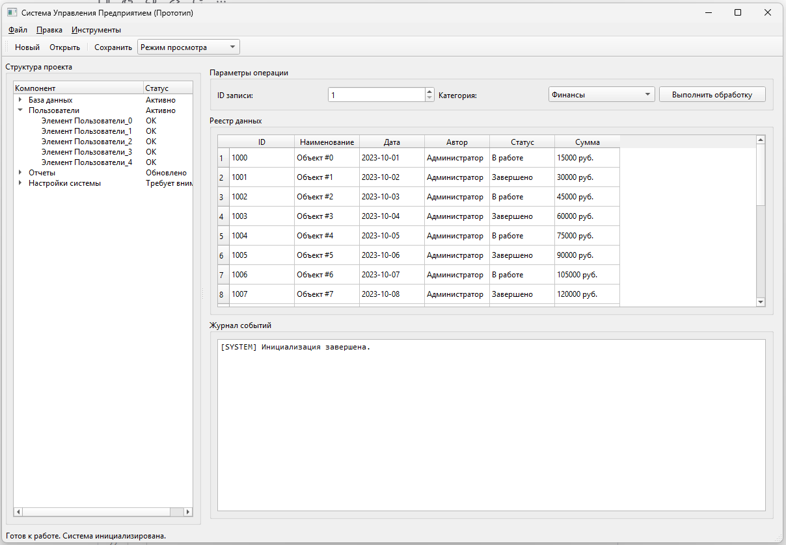
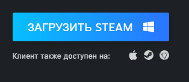
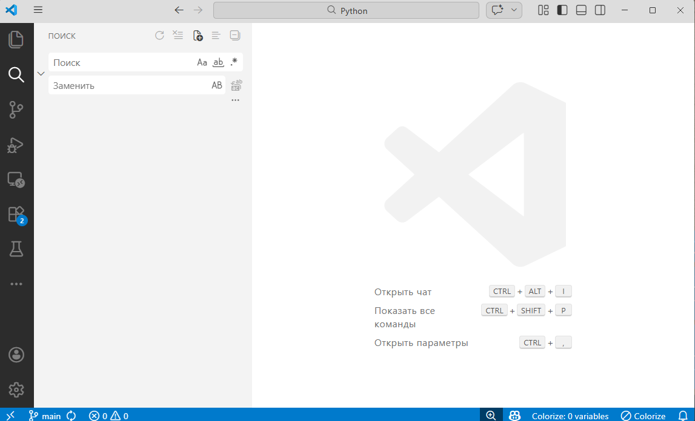

# Разработка приложений для настольных операционных систем

  ОБЯЗАТЕЛЬНО
  ДЛЯ НОВИЧКОВ

Разработчику
Архитектору
Инженеру

---

## Разработка приложений для настольных операционных систем

### Десктопные ОС - платформы и способы распространения

Обзор **платформ, распространения и гибридных режимов** — после [архитектуры](./1.md) и перед выбором стека ([Electron](./114.md), [Windows](./116.md)). Не заменяет практику по конкретному фреймворку.

---

### Что такое десктопные приложения?

**Десктопные приложения** — это класс программного обеспечения, предназначенных для установки и выполнения непосредственно на локальном компьютере пользователя. 

В отличие от веб-приложений, функционирующих внутри браузера и зависящих от сетевой инфраструктуры, и мобильных приложений, ориентированных на ограниченные по ресурсам и взаимодействию устройства, десктопные приложения опираются на полную вычислительную мощность и аппаратные возможности настольной или мобильной станции. 

С исторической точки зрения, десктопное ПО стало доминирующей формой программирования с момента массового распространения персональных компьютеров в 1980-х годах и остаётся ключевой парадигмой в разработке высокопроизводительного, автономного и сложного программного обеспечения — от профессиональных редакторов и САПР до систем управления базами данных, интегрированных сред разработки и специализированных инструментов моделирования.

---

### Десктоп  

Термин *"десктоп"* изначально описывал физическое устройство — настольный компьютер, в противоположность портативным вычислительным системам. Однако в контексте программной инженерии он приобрёл более широкое значение, включающее в себя программную модель, архитектурные особенности и принципы взаимодействия с операционной системой. 

Десктопное приложение — это композитная сущность, объединяющая код, ресурсы, метаданные, конфигурации и, зачастую, механизмы обновления, диагностики и интеграции с другими компонентами системы. 

Его жизненный цикл управляется как пользователем, так и операционной средой в рамках строго определённых контрактов: права доступа, изоляция процессов, работа с реестром или конфигурационными файлами, взаимодействие с [драйверами](https://learn.microsoft.com/ru-ru/windows-hardware/drivers/gettingstarted/what-is-a-driver-) и сервисами. Кратко о роли драйверов для прикладного разработчика — в [Архитектуре десктопных приложений](./1.md#drayvery-i-dostup) и в [главе про Windows](./116.md#drayvery-obzor).

---

### Локальность

Центральной характеристикой десктопного приложения является его **локальность**. 

Приложение размещается на диске пользователя, загружается в оперативную память процессом, порождённым ядром ОС, и исполняется с использованием нативных или управляемых инструкций процессора. 

Оно получает прямой или опосредованный доступ к физическим и виртуальным ресурсам: 
- к файловой системе (в рамках предоставленных привилегий), 
- к периферийным устройствам через драйверы, 
- к графическому ускорителю, 
- к звуковой подсистеме, 
- к сетевым интерфейсам, 
- к системным буферам (например, буферу обмена),
- к механизмам межпроцессного взаимодействия. 

Такая степень интеграции с хост-системой обеспечивает высокую производительность и гибкость, но одновременно повышает требования к стабильности, безопасности и совместимости. 

Ошибка в десктопном приложении может привести к его собственному краху, и — в редких случаях — к нестабильности всей операционной среды, особенно если приложение работает в привилегированном режиме или взаимодействует с ядром напрямую.

---

### Толстый клиент и тонкий клиент

Архитектурно десктопные приложения традиционно реализуются в виде **толстых клиентов** (*thick* или *fat client*). 

Эта модель подразумевает, что основная часть логики приложения — бизнес-правила, алгоритмы обработки данных, визуализация, управление состоянием — находится на стороне **клиента**. 

Сервер, если он присутствует, выполняет вспомогательные функции: хранение данных, аутентификация, синхронизация, резервное копирование. 

Такая архитектура обеспечивает автономность: пользователь может продолжать работу даже при отсутствии сетевого соединения, а отклик интерфейса остаётся мгновенным, поскольку не зависит от задержек передачи данных. 

В противовес этому, **тонкий клиент** (*thin client*) выносит почти всю логику на сервер, оставляя на устройстве пользователя лишь лёгкий интерпрейтер, способный отображать полученные инструкции (например, HTML/CSS/JS в браузере). 

Десктопные приложения редко бывают чисто тонкими клиентами; однако всё чаще встречаются **гибридные модели**, сочетающие локальные вычисления с облачной синхронизацией и обработкой. 

Примером служит редактор кода Visual Studio Code: ядро приложения, интерфейс и базовые операции работают локально, но расширения, управление зависимостями, CI/CD-интеграция, синхронизация настроек — это уже облачные сервисы. Такой подход сохраняет преимущества десктопа (скорость, доступ к ресурсам), но добавляет удобство централизованного управления и расширяемости.

---

### Платформы и портирование

Одной из ключевых проблем в разработке десктопного ПО является **платформенная зависимость**. 

Каждая операционная система — Windows, macOS, Linux (и его дистрибутивы с разными окружениями рабочего стола: GNOME, KDE, XFCE и др.) — предоставляет собственный набор системных вызовов, графических библиотек, правил установки и управления приложениями, а также соглашений по пользовательскому интерфейсу. 

Приложение, написанное с использованием WinAPI, не запустится на macOS без полной перезаписи низкоуровневых слоёв; код, опирающийся на Cocoa, несовместим с X11 и Wayland. Для преодоления этой разобщённости применяются два основных подхода: *портирование* и *мультиплатформенность*.

**Портирование** — это ручной или частично автоматизированный процесс переноса приложения с одной целевой платформы на другую. Он включает в себя замену системно-зависимых API-вызовов (например, чтение файла через `CreateFile` в Windows → `open` в POSIX), переработку графического интерфейса в соответствии с гайдлайнами целевой ОС (Human Interface Guidelines для macOS, Fluent Проектирование Система для Windows, GNOME Human Interface Guidelines), адаптацию формата пакетов (EXE/MSI → DMG/PKG → DEB/RPM/Flatpak/Snap), а также тестирование на соответствие политикам безопасности и производительности. 

Портирование трудоёмко, требует глубокого понимания обеих платформ и зачастую сопровождается снижением качества: приложение может выглядеть "чужим" в новой среде, теряя интеграцию с системными сервисами (уведомлениями, панелью задач, темами оформления).

**Мультиплатформенность**, напротив, закладывается на этапе проектирования. Она достигается через использование абстракций — промежуточных слоёв, скрывающих различия между ОС. Наиболее удачные мультиплатформенные решения строятся на трёх принципах:  
1. **Единый язык и среда выполнения** — например, Java с её виртуальной машиной (JVM), или .NET с CLR/Mono/.NET Runtime. Код компилируется в промежуточное представление (байт-код или IL), а интерпретация/дальнейшая компиляция в машинный код осуществляется локальной виртуальной машиной.  
2. **Кроссплатформенные графические фреймворки**, такие как Qt, GTK, Electron, Avalonia, которые инкапсулируют нативные графические API и предоставляют единый программный интерфейс. При этом Qt, например, может использовать нативные виджеты (через QPA — Qt Platform Abstraction), обеспечивая высокую степень интеграции, тогда как Electron — построенный на Chromium и Node.js — создаёт собственный рендеринг-стек, что упрощает разработку, но увеличивает потребление памяти.  
3. **Компиляция под целевые архитектуры** — как в случае Rust, Go или C++ с CMake, где исходный код собирается нативно для каждой платформы, но логика остаётся единой благодаря условной компиляции и абстрактным интерфейсам.

Важно различать *мультиплатформенность* и *кроссплатформенность*. Термин *кроссплатформенный* чаще применяется к инструментам и языкам, позволяющим писать код один раз и запускать его везде ("write once, run anywhere"). *Мультиплатформенный* подчёркивает наличие нескольких отдельных сборок под разные ОС, даже если исходный код един. На практике граница размыта, но концептуально первый подход стремится к максимальной унификации, второй — к максимальной адаптации.

---

## Классификация десктопных приложений по типу взаимодействия и архитектуре

Десктопные приложения неоднородны по своей природе. Их можно классифицировать по нескольким ортогональным признакам: способу представления пользовательского интерфейса, режиму работы, роли в системе, степени автономности. Наиболее фундаментальное деление — на **консольные**, **графические** и **фоновые** приложения.

---

### Консольные

**Консольные приложения** — это программы, ввод и вывод которых осуществляются через текстовый терминал (Command Prompt, PowerShell, Terminal, консоль Linux). 

Они взаимодействуют с пользователем посредством потоков ввода-вывода: `stdin`, `stdout`, `stderr`. Такие приложения не зависят от графической подсистемы и могут запускаться в средах без GUI (например, на серверах или в режиме восстановления). 

Несмотря на кажущуюся архаичность, консоль остаётся мощным инструментом: большинство утилит сборки (`make`, `dotnet`, `npm`, `cargo`, `gradle`), пакетных менеджеров (`apt`, `dnf`, `winget`, `brew`), инструментов анализа (`grep`, `jq`, `awk`, `ffmpeg` в режиме CLI), а также скриптов автоматизации — это консольные приложения. 

Их преимущества: минимальные накладные расходы, простота интеграции в конвейеры обработки данных (pipelines), чёткая стандартизация интерфейса (аргументы командной строки, коды возврата, текстовый вывод), лёгкость тестирования и документирования. 

Консольное приложение может быть одноразовым (скрипт), долгоживущим (интерактивная оболочка, REPL) или служебным (демон, запущенный в фоне, но пишущий логи в терминал).

---

### Графические

**Графические приложения** — доминирующий класс десктопного ПО. Они используют оконную систему операционной среды для построения визуального интерфейса, управляемого мышью, клавиатурой, сенсорным вводом или другими HID-устройствами. 

Графическое приложение строится вокруг понятия *окна* — прямоугольной области экрана, выделенной процессу ОС для отрисовки содержимого. Окно управляется диспетчером окон (window manager) и имеет стандартные элементы: заголовок, кнопки управления (свернуть, развернуть, закрыть), границы для изменения размера. 

Внутри окна размещаются *элементы управления* (controls, widgets): кнопки, поля ввода, списки, таблицы, панели инструментов, меню. Взаимодействие с пользователем организуется по событийной модели: ОС генерирует события (нажатие клавиши, клик мыши, изменение размера окна), которые передаются приложению через очередь сообщений и обрабатываются соответствующими обработчиками.  

Графические приложения, в свою очередь, подразделяются на несколько подтипов:  
- **Однооконные приложения** — классическая модель, где основной интерфейс представлен одним главным окном (например, Notepad, Calculator). Внутри могут быть вкладки или панели, но логически это единый контекст.  
- **Многооконные приложения** — приложение создаёт несколько независимых окон, каждое из которых может представлять отдельный документ или задачу (например, браузер с множеством вкладок в отдельных окнах, или старые версии Adobe Photoshop). Это требует сложной логики управления состоянием и взаимосвязью между окнами.  
- **MDI-приложения** (*Multiple Document Interface*) — устаревшая, но всё ещё встречающаяся модель, где дочерние окна вложены внутрь одного родительского. Пример: старые версии Microsoft Office (до ленточного интерфейса). MDI упрощает управление набором документов в рамках одного процесса, но нарушает принципы современного дизайна, где каждое окно должно быть независимым сущностным объектом.  
- **Системно-трейные приложения** (*tray applications*, *menu bar apps*) — приложения, не имеющие основного окна при старте, но размещающие иконку в системной области уведомлений (Windows System Tray) или строке меню (macOS Menu Bar). Они активируются по клику и могут показывать всплывающие окна, меню или мини-интерфейсы. Часто используются для мониторинга (сетевая активность, загрузка CPU), фоновых операций (синхронизация, обновления) или быстрого доступа к функциям (калькулятор, переводчик).  
- **Полноэкранные приложения** — захватывают всё пространство экрана, отключая стандартные элементы ОС (панель задач, меню). Это характерно для игр, видеоплееров в режиме просмотра, киосковых решений и VR-приложений. Управление фокусом, вводом и выходом из полноэкранного режима требует особой внимательности, особенно при многомониторных конфигурациях.

---

### Фоновые

**Фоновые приложения** (системные службы, демоны) — это процессы, запускаемые автоматически при старте системы или по расписанию, не имеющие пользовательского интерфейса или имеющие его лишь в ограниченной форме. 

В Windows они реализуются как *Windows Services*, в Unix-подобных системах — как *daemons*. Их задачи: мониторинг оборудования, обработка сетевых запросов, синхронизация данных, обновление индексов поиска, управление принтерами. 

Такие приложения работают с пониженными приоритетами, логируют свою активность, часто взаимодействуют с другими процессами через сокеты, именованные каналы или D-Bus, и должны быть максимально устойчивыми к сбоям, так как их остановка может повлиять на стабильность всей системы.

---

### Гибридные

Отдельно выделяются **гибридные приложения**, сочетающие признаки нескольких типов. Например, редактор кода может запускаться как графическое приложение, но поддерживать работу в headless-режиме через CLI для CI/CD; или приложение для видеоконференций — основное окно, панель управления в трее и фоновый сервис для обработки аудио/видео даже при свёрнутом интерфейсе.

---

## Распространение, установка и обновление десктопных приложений

Доставка десктопного приложения пользователю — нетривиальная задача, охватывающая технические, правовые и маркетинговые аспекты. В отличие от веб-приложений, где развёртывание сводится к обновлению кода на сервере, десктопное ПО требует явного действия со стороны пользователя: загрузки, установки, потенциально — настройки. 

Этот процесс называется **дистрибуцией**.

Традиционно дистрибуция осуществлялась через **установщики** (*installers*): исполняемые файлы, автоматизирующие развёртывание приложения. Примеры: MSI (Windows Installer), Inno Setup, NSIS, InstallShield. Установщик решает следующие задачи:  
- Распаковка файлов в целевые директории (обычно `Program Files`, `Applications`, `/opt`, `/usr/local`).  
- Регистрация приложения в системе (создание записей в реестре Windows, `.desktop`-файлов в Linux, plist-файлов в macOS).  
- Настройка прав доступа и зависимостей (проверка наличия .NET Runtime, Java, Visual C++ Redistributable, библиотек GTK/Qt).  
- Создание ярлыков на рабочем столе и в меню "Пуск".  
- Запуск постустановочных скриптов (инициализация БД, генерация конфигураций).  

Однако установщики не стандартизированы между ОС, их сложно обновлять, они могут оставлять "мусор" при удалении, а ручная загрузка с сайта повышает риски фишинга и подмены. В ответ на эти проблемы появились **пакетные менеджеры** и **цифровые магазины приложений**.

Пакетные менеджеры (`apt`, `yum`, `pacman`, `brew`, `winget`, `scoop`) предоставляют централизованный каталог подписанных пакетов. Пакет — это архив с метаданными (зависимостями, версией, лицензией), контролируемый репозиторием. Преимущества: автоматическое разрешение зависимостей, атомарная установка/удаление, интеграция с системой обновлений, проверка целостности через цифровые подписи. В Linux экосистема пакетов доминирует; в Windows и macOS процесс идёт медленнее, но `winget` и `brew` набирают популярность.

Параллельно развиваются форматы **универсальных пакетов**, не привязанных к дистрибутиву:  
- **Flatpak** — использует sandboxing через Bubblewrap и предоставляет runtime (набор общих библиотек — Freedesktop runtime, GNOME runtime), что гарантирует совместимость и изоляцию. Приложение Flatpak видит только свой sandbox и явно объявленные разрешения (доступ к камере, домашней директории и т.п.).  
- **Snap** — технология Canonical, похожая на Flatpak, но с собственной инфраструктурой (`snapd` демон) и более строгим sandboxing’ом.  
- **AppImage** — "запускаемый образ": один исполняемый файл, содержащий всё необходимое (включая зависимости), который можно запустить без установки. Идеален для portable-версий, но не интегрируется с системой (не создаёт ярлыков автоматически, не участвует в обновлениях ОС).

Цифровые магазины (Microsoft Store, Mac App Store, Snap Store, Flathub) добавляют к пакетной модели дополнительные слои: модерацию, монетизацию (платные приложения, подписки, in-app покупки), аналитику, механизмы обновления "по воздуху", а также юридические рамки (требования к конфиденциальности, политике данных, совместимости). Публикация в магазине требует соблюдения строгих гайдлайнов: например, приложения в Microsoft Store должны использовать MSIX-пакеты и проходить сертификацию на соответствие политике безопасности и пользовательского опыта.

**Обновление** десктопных приложений может происходить несколькими путями:  
1. Через пакетный менеджер (автоматически при обновлении системы).  
2. Через встроенный механизм обновлений (например, Squirrel для .NET, Sparkle для macOS, собственные HTTP-загрузчики). Такие системы проверяют наличие новой версии, скачивают дельта-обновления или полные сборки, применяют их без перезапуска (hot update) или с перезапуском.  
3. Через магазин приложений (фоновое обновление по расписанию).  

Архитектурно обновление требует разделения кода на *стабильное ядро* (не изменяющееся между версиями) и *модульные компоненты* (которые можно заменять). Особенно критично это для приложений с длительным временем жизни процесса (например, почтовые клиенты), где полная перезагрузка неприемлема.

---

## Онлайн, офлайн и гибридные режимы работы

Десктопное приложение не обязано быть полностью автономным — современные требования к синхронизации, совместной работе и облачным сервисам делают сетевое взаимодействие неотъемлемой частью многих проектов. 

В зависимости от степени зависимости от сетевого соединения выделяют три основных режима функционирования: 
- **офлайн**, 
- **онлайн**, 
- **гибридный**.

---

### Офлайн

**Офлайн-приложения** — классическая модель, при которой вся логика и данные размещаются локально. 

Примеры: текстовые редакторы (Notepad++, Sublime Text), графические редакторы (GIMP, Krita в базовом режиме), компиляторы, утилиты архивации, игры с одиночным сюжетом. 

Такие приложения не требуют интернета ни для запуска, ни для основных операций. Их преимущества: мгновенный отклик, отсутствие задержек, независимость от качества соединения, повышенная безопасность (данные не покидают устройство), минимальные требования к инфраструктуре. Однако офлайн-модель накладывает ограничения: невозможность синхронизации между устройствами, отсутствие централизованного бэкапа, сложность обновления контента (например, справочников, карт), отсутствие совместного редактирования. 

Архитектурно такие приложения строятся вокруг локального хранилища: файловых баз (SQLite, LevelDB), структурированных конфигурационных файлов (JSON, XML, YAML), или прямой работы с файловой системой.

---

### Онлайн

**Онлайн-приложения** (в десктопном контексте) — это клиенты, требующие постоянного или регулярного подключения к серверу для выполнения ключевых функций. 

Чисто онлайн десктопное приложение встречается редко: чаще это клиенты к облачным сервисам, где локально реализован лишь интерфейс и базовая кэш-логика, а вся обработка происходит на стороне сервера. 

Примеры: клиенты мессенджеров (Slack, Discord), облачных IDE (JetBrains Fleet, GitHub Codespaces Desktop), SaaS-клиенты для CRM/ERP. 

Такие приложения используют HTTP/HTTPS, WebSocket, gRPC для обмена данными, реализуют аутентификацию (OAuth 2.0, JWT), шифрование трафика (TLS), а также механизмы реконнекта и очередей отправки при потере связи. 

Критическими требованиями становятся: устойчивость к сетевым сбоям, корректная обработка таймаутов, визуальная обратная связь о состоянии соединения, а также защита от утечек данных при передаче.

---

### Гибрид

**Гибридный режим** — наиболее распространённая и сбалансированная модель в современной разработке. Приложение сохраняет полную работоспособность в офлайн-режиме, но при наличии соединения активирует дополнительные возможности: синхронизацию, обновление данных, облачное резервное копирование, совместную работу, аналитику. 

Реализация гибридности требует сложной архитектуры на стороне клиента:  
- **Локальное хранилище как источник истины** — все операции сначала применяются к локальной БД (часто SQLite с ORM вроде Entity Framework Core или Room), что гарантирует немедленный отклик.  
- **Очередь операций** — изменения, требующие синхронизации, помещаются в упорядоченную очередь (например, в таблицу `sync_queue`).  
- **Фоновый синхронизатор** — отдельный поток или сервис, периодически проверяющий наличие соединения и отправляющий операции на сервер. При успехе запись помечается как синхронизированная и удаляется из очереди; при ошибке — повторяется с экспоненциальной задержкой.  
- **Разрешение конфликтов** — когда одни и те же данные изменяются как локально, так и на сервере, требуется стратегия разрешения: "последний выигрывает", "локальный приоритет", "ручное разрешение пользователем", или применение алгоритмов типа Operational Transformation (OT) или Conflict-free Replicated Data Types (CRDTs) для совместного редактирования в реальном времени (как в Google Docs).  
- **Кэширование с инвалидацией** — статические ресурсы (изображения, шрифты, справочники) кэшируются локально с привязкой к версии; сервер управляет инвалидацией через ETag, Cache-Control или явные команды.

Типичный пример гибридного приложения — редактор заметок (например, Obsidian с плагином синхронизации или Notion Desktop). 

Пользователь создаёт и редактирует заметки офлайн, изменения записываются в локальную БД; при подключении к Wi-Fi фоновый процесс отправляет изменения на сервер и забирает обновления от других устройств. При этом пользовательский интерфейс не блокируется, а индикатор синхронизации показывает текущее состояние.

Важно проектировать интерфейс с учётом возможного перехода между режимами: не следует блокировать интерфейс "загрузочным колесом" при отсутствии интернета, если операция может быть выполнена локально. 

Вместо этого — чёткая визуальная индикация статуса (например, иконка облака с галочкой/крестиком), отложенные уведомления об ошибках синхронизации, и возможность повторной отправки.

---

## Правила публикации и юридические аспекты

Распространение десктопного приложения сопряжено с рядом обязательств, выходящих за рамки технической реализации. Юридическая корректность — условие допуска к рынку и защиты от претензий.

**Цифровая подпись кода** — обязательная практика для установщиков и исполняемых файлов в большинстве ОС. Подпись подтверждает подлинность источника (publisher identity) и целостность кода (отсутствие модификаций после подписания). В Windows используется Authenticode (на основе сертификатов от доверенных удостоверяющих центров: Sectigo, DigiCert); в macOS — Apple Developer ID; в Linux — GPG-подписи репозиториев. Без подписи ОС блокируют запуск приложения или выводят агрессивные предупреждения безопасности, что резко снижает конверсию. Получение сертификата требует верификации личности/организации и регулярного обновления.

**Лицензирование** определяет права пользователей и ответственность разработчика. В десктопной среде распространены:  
- **Проприетарные лицензии** — закрытый исходный код, ограничения на копирование, модификацию, обратную разработку. Часто сопровождаются EULA (End User License Agreement), которую пользователь принимает при установке.  
- **Открытые лицензии** (GPL, MIT, Apache 2.0) — разрешают изучение, модификацию и распространение, но с разными условиями: GPL требует открытия производных работ, MIT — почти без ограничений. Выбор лицензии влияет на возможность коммерциализации и интеграции в корпоративные продукты.  
- **Freemium и shareware** — бесплатная базовая версия с ограничениями и платные функции/расширения. Требует чёткого разделения функциональности и механизма активации (лицензионные ключи, привязка к аккаунту).

**Соответствие стандартам конфиденциальности** стало критически важным после вступления в силу GDPR, CCPA, а также российских требований (ФЗ-152). Приложение, собирающее персональные данные (имя, email, IP, поведенческие метрики), обязано:  
- Предоставлять пользователю политику конфиденциальности в понятной форме.  
- Получать явное согласие (opt-in) на сбор и обработку.  
- Обеспечивать права на доступ, исправление, удаление и переносимость данных.  
- Минимизировать объём собираемых данных (принцип Данные minimisation).  
- Шифровать данные при хранении и передаче.  
- Вести реестр операций по обработке данных (для организаций).

**Сертификация ПО** требуется в регулируемых отраслях: медицина (FDA, CE), финансы (PCI DSS), государственные закупки (требования к ГОСТ Р, ФСТЭК). Сертификация включает аудит кода, тестирование на уязвимости, проверку документации, оценку процессов разработки. Это длительный и дорогостоящий процесс, но без него невозможно выйти на соответствующие рынки.

**Публикация в цифровых магазинах** накладывает дополнительные требования:  
- Microsoft Store: приложение должно быть упаковано в MSIX, проходить автоматическую и ручную проверку на вредоносность, соответствие политике контента, стабильность и производительность. Запрещены несанкционированные сетевые подключения, сбор данных без согласия, обход системных ограничений.  
- Mac App Store: обязательное использование App Sandbox, ограничения на доступ к файловой системе, запрет на загрузку исполняемого кода во время выполнения (JIT-компиляция разрешена только для WebKit), строгая модерация контента.  
- Flathub/Snap Store: соответствие правилам сообщества, корректное описание разрешений, отсутствие проприетарных компонентов без явного указания.

Нарушение этих правил ведёт к отклонению публикации или последующему удалению приложения. Поэтому проектирование должно учитывать требования платформы с самого начала — например, избегать глобальных перехватчиков ввода в приложениях для Mac App Store или не использовать сторонние установщики в Microsoft Store.

---

### Частые ошибки

| Ошибка | Последствие |
|--------|-------------|
| Один установщик на все ОС | Разные подписи и пакеты для Win/macOS/Linux |
| Сбор PII без политики | Отклонение Store / GDPR |
| Только онлайн-режим | Плохой UX при обрыве сети |
| Игнор DPI | Размытый UI на 4K |

---

### Что попробовать

1. Сравните [офлайн и гибрид](./112.md) на своём pet-проекте.
2. Windows: [116](./116.md) + [Store](./117.md).
3. Кроссплатформа: [Qt](/encyclopedia/5-languages/5-06-cpp/2731) или [MAUI](/encyclopedia/5-languages/5-05-csharp/4513).

---

### Частые ошибки

| Ошибка | Последствие |
|--------|-------------|
| Один установщик на все ОС | Разные подписи и пакеты для Win/macOS/Linux |
| Сбор PII без политики | Отклонение Store / GDPR |
| Только онлайн-режим | Плохой UX при обрыве сети |
| Игнор DPI | Размытый UI на 4K |

---

### Что попробовать

1. Сравните [офлайн и гибрид](./112.md) на своём pet-проекте.
2. Windows: [116](./116.md) + [Store](./117.md).
3. Кроссплатформа: [Qt](/encyclopedia/5-languages/5-06-cpp/2731) или [MAUI](/encyclopedia/5-languages/5-05-csharp/4513).

---
---

<!-- http-basics-link -->
:::tip Основа по протоколу
Базовый разбор HTTP и HTTPS находится в отдельной статье — [HTTP как основа веб-интеграций](/encyclopedia/2-system-network/2-09-osnovy-integratsionnogo-vzaimodeystviya/118).
:::

