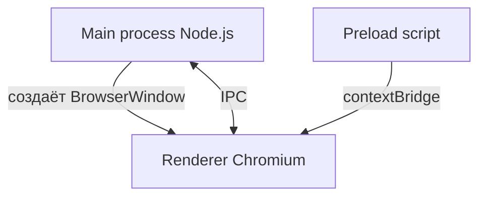

# Electron

<div class="article-tags">
  <span class="tag tag-required">ОБЯЗАТЕЛЬНО</span>
  <span class="tag tag-beginner">ДЛЯ НОВИЧКОВ</span>
</div>

<span class="complexity-badge">Разработчику</span>
<span class="complexity-badge">Архитектору</span>
<span class="complexity-badge">Инженеру</span>

---

## Electron

### Где применяют Electron

**Electron** объединяет **Chromium** (отрисовка UI) и **Node.js** (доступ к ОС). На нём работают VS Code, Slack, Discord и множество внутренних утилит. Если вы знаете [React](/encyclopedia/5-languages/5-01-javascript/27) или [Vue](/encyclopedia/5-languages/5-01-javascript/28), интерфейс пишется теми же технологиями.

Сравнение с Tauri и нативными UI: [Особенности разработки десктопных приложений](./112.md). WebView без полного Chromium: [WebView](./113.md). Node на сервере: [Node.js](/encyclopedia/5-languages/5-01-javascript/26).

---

## Архитектура процессов



| Процесс | Роль |
|---------|------|
| **Main** | `main.js` — окна, меню, tray, диалоги файлов, auto-update |
| **Renderer** | HTML/CSS/JS — то, что видит пользователь (как вкладка браузера) |
| **Preload** | Мост: безопасно экспортирует API в renderer через `contextBridge` |

<div class="callout callout--warning">
  <div class="callout-title">Безопасность</div>
  В renderer не включайте <code>nodeIntegration: true</code> без крайней необходимости. Используйте <code>contextIsolation: true</code> и preload.
</div>

---

## Минимальный проект

```bash
mkdir my-electron-app && cd my-electron-app
npm init -y
npm install electron --save-dev
```

`package.json`:

```json
{
  "name": "my-electron-app",
  "main": "main.js",
  "scripts": {
    "start": "electron ."
  }
}
```

`main.js`:

```javascript
const { app, BrowserWindow } = require('electron');
const path = require('path');

function createWindow() {
  const win = new BrowserWindow({
    width: 800,
    height: 600,
    webPreferences: {
      preload: path.join(__dirname, 'preload.js'),
      contextIsolation: true,
      nodeIntegration: false,
    },
  });

  win.loadFile('index.html');
}

app.whenReady().then(createWindow);

app.on('window-all-closed', () => {
  if (process.platform !== 'darwin') app.quit();
});
```

`preload.js`:

```javascript
const { contextBridge, ipcRenderer } = require('electron');

contextBridge.exposeInMainWorld('api', {
  ping: () => ipcRenderer.invoke('ping'),
});
```

`main.js` — обработчик IPC (добавьте перед `createWindow`):

```javascript
const { ipcMain } = require('electron');
ipcMain.handle('ping', () => 'pong from main');
```

`index.html` + `renderer.js`:

```html
<!DOCTYPE html>
<html lang="ru">
<head>
  <meta charset="UTF-8">
  <title>Electron</title>
</head>
<body>
  <h1>Electron работает</h1>
  <button id="btn">Проверить IPC</button>
  <p id="out"></p>
  <script src="renderer.js"></script>
</body>
</html>
```

```javascript
document.getElementById('btn').addEventListener('click', async () => {
  const msg = await window.api.ping();
  document.getElementById('out').textContent = msg;
});
```

```bash
npm start
```

---

## Типичные задачи main-процесса

```javascript
const { dialog, shell } = require('electron');

// Открыть файл
const { canceled, filePaths } = await dialog.showOpenDialog({
  properties: ['openFile'],
});

// Открыть ссылку в системном браузере
await shell.openExternal('https://example.com');
```

---

## Сборка установщика

Популярный инструмент — **electron-builder**:

```bash
npm install -D electron-builder
```

В `package.json` добавьте секцию `build` (платформы, иконки, `appId`) и скрипт `"dist": "electron-builder"`.

Подпись кода (Windows/macOS) обязательна для доверия пользователей и стора — тема для отдельного production-гайда.

---

## Electron и Tauri
| | Electron | Tauri |
|---|----------|-------|
| UI | Встроенный Chromium | Системный WebView |
| Логика | JavaScript (Node) | Rust + JS |
| Размер дистрибутива | Больше | Меньше |
| Зрелость экосистемы | Очень высокая | Растёт |

Подробнее — таблица в [112.md](./112.md).

---

### Частые ошибки

| Симптом | Причина |
|---------|---------|
| Белый экран | Неверный `loadFile` / путь к `index.html` |
| `require is not defined` в renderer | `nodeIntegration` выключен — используйте preload + `contextBridge` |
| IPC не доходит | Разные каналы в `ipcMain` и `ipcRenderer` |
| Огромный установщик | В bundle попал весь `node_modules` — настройте `files` в electron-builder |

---

### Что попробовать

1. `ipcMain.handle('ping')` + `ipcRenderer.invoke('ping')` — запрос-ответ.
2. Меню приложения через `Menu.buildFromTemplate`.
3. Сравните размер дистрибутива с [Tauri](./112.md#electron-vs-tauri) (таблица в 112).

---

### Частые ошибки

| Симптом | Причина |
|---------|---------|
| Белый экран | Неверный `loadFile` / путь к `index.html` |
| `require is not defined` в renderer | `nodeIntegration` выключен — используйте preload + `contextBridge` |
| IPC не доходит | Разные каналы в `ipcMain` и `ipcRenderer` |
| Огромный установщик | В bundle попал весь `node_modules` — настройте `files` в electron-builder |

---

### Что попробовать

1. `ipcMain.handle('ping')` + `ipcRenderer.invoke('ping')` — запрос-ответ.
2. Меню приложения через `Menu.buildFromTemplate`.
3. Сравните размер дистрибутива с [Tauri](./112.md#electron-vs-tauri) (таблица в 112).

---

## Связанные материалы

- [Применение JavaScript в вебе и за его пределами](/encyclopedia/5-languages/5-01-javascript/14)
- [Первая программа на Node.js](/encyclopedia/5-languages/5-01-javascript/262)
- [React Native / Expo](/encyclopedia/4-code-dev/4-12-mobilnye-prilozheniya/intro) — мобильный аналог "JS везде"

---