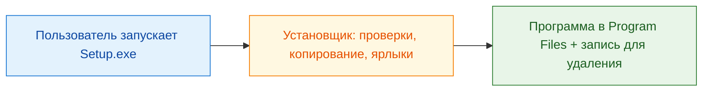
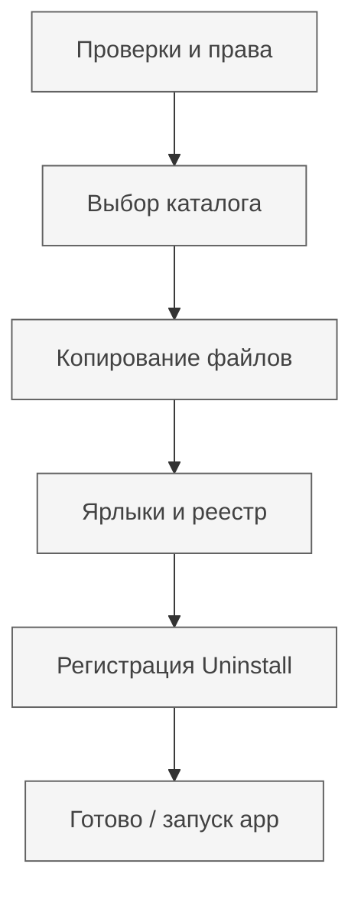

import ExternalCodeEmbed from '@site/src/components/ExternalCodeEmbed';


import ExternalPlayEmbed from '@site/src/components/ExternalPlayEmbed';


# Как сделать установщик

<div class="article-tags">
  <span class="tag tag-required">ОБЯЗАТЕЛЬНО</span>
  <span class="tag tag-beginner">ДЛЯ НОВИЧКОВ</span>
</div>

<span class="complexity-badge">Разработчику</span>

Готовая программа редко состоит из одного `.exe`. Обычно нужны папка с файлами, ярлык, запись об установке и возможность удалить всё без ручной охоты по `Program Files`. **Установщик** автоматизирует этот сценарий: пользователь запускает один файл — и через минуту может работать.

<ExternalPlayEmbed example="basics/installer-wizard-play" title="Мастер установки" minHeight={480} />

См. также: [Исполняемые файлы](/encyclopedia/1-basics/1-20-ispolnyaemye-fayly-i-arhivy/1) (в т.ч. MSI и установочные пакеты), [Архивы и установочные пакеты](/encyclopedia/1-basics/1-20-ispolnyaemye-fayly-i-arhivy/2), [Распространение десктопных приложений](./111.md), [Microsoft Store и MSIX](./117.md), [Electron — сборка установщика](./114.md).

---

## Содержание

- [Что такое установщик](#что-такое-установщик)
- [Архитектура: что обязан делать установщик](#архитектура-что-обязан-делать-установщик)
- [Inno Setup](#inno-setup)
- [Скрипт на PowerShell](#скрипт-на-powershell)
- [Скрипт на Python и PyInstaller](#скрипт-на-python-и-pyinstaller)
- [Установщик на C# (WinForms / WPF)](#установщик-на-c-winforms--wpf)
- [Сравнение подходов](#сравнение-подходов)
- [Чек-лист перед релизом](#чек-лист-перед-релизом)

---

## Что такое установщик

**Установочный файл** (часто `Setup.exe`, `MyApp-1.0.0-installer.exe`) — программа, которая **разворачивает** ваше приложение на компьютере пользователя. Внутри неё обычно лежит сжатый набор файлов (как в архиве) и **логика** — куда копировать, что проверить, что записать в систему.

**Установочный пакет** — более широкое понятие — сам дистрибутив плюс метаданные (версия, зависимости, права). Примеры форматов пакетов без "своего" GUI: `.msi` (Windows Installer), `.deb` / `.rpm` (Linux), `.msix` (Store). Примеры **собственного мастера установки** — Inno Setup, NSIS, WiX, скрипт на PowerShell/Python, приложение на C#.

Главная цель для пользователя и разработчика одна: **быстро и предсказуемо** получить рабочую копию программы — без ручного копирования десятков файлов и без гадания "куда положить DLL".



### Как это выглядит для пользователя

1. Скачал один файл с сайта или получил по ссылке.
2. Запустил (Windows может спросить [права администратора](/encyclopedia/1-basics/1-035-bazovaya-informatika/207)).
3. Прошёл мастер: папка → компоненты → "Установить".
4. Появился ярлык; приложение запускается.
5. При необходимости — "Удалить программу" в параметрах Windows (если установщик зарегистрировал деинсталлятор).

### Что такое `setup.exe`

Имя **`setup.exe`** — устоявшееся соглашение, не отдельный формат. Это обычный PE-исполняемый файл ([исполняемые файлы](/encyclopedia/1-basics/1-20-ispolnyaemye-fayly-i-arhivy/1)), внутри которого может быть:

- оболочка **Inno Setup** / **NSIS** / **InstallShield**;
- bootstrap **Visual Studio** (`vs_setup.exe`);
- ваш скрипт, упакованный через **PyInstaller**;
- **MSI**, переименованный или обёрнутый в EXE (редко, но встречается).

Антивирусы и SmartScreen смотрят на **подпись издателя** и репутацию файла, а не на слово `setup` в имени.

<div class="callout callout--tip">
  <div class="callout-title">Отличие от "просто ZIP"</div>
  <div class="callout-body">
    Архив только распаковывает файлы. Установщик ещё проверяет ОС, создаёт ярлыки, пишет ключ в реестр для <strong>удаления</strong> и может поставить зависимости (runtime). Подробнее — в статье <a href="/encyclopedia/1-basics/1-20-ispolnyaemye-fayly-i-arhivy/2">"Архивы и установочные пакеты"</a>.
  </div>
</div>

---

## Архитектура: что обязан делать установщик

Минимальная **логика** любого приличного установщика:

| Этап | Задача |
|------|--------|
| **До установки** | Проверить ОС (64-bit?), свободное место, не занята ли ли уже другая версия |
| **Выбор пути** | Папка по умолчанию (`%ProgramFiles%\Vendor\App`) и возможность изменить |
| **Копирование** | Файлы приложения, ресурсы, конфиги по умолчанию |
| **Интеграция** | Ярлыки (меню "Пуск", при необходимости рабочий стол), ассоциации файлов |
| **Регистрация** | Запись в "Приложения и компоненты" — чтобы работало **удаление** |
| **После установки** | Опционально: запуск приложения, открытие README |
| **Деинсталлятор** | Скрипт или `unins000.exe`, который удаляет скопированное и чистит записи |



### Права администратора

Установка в `C:\Program Files` требует **повышения прав** (UAC). Если ставите только в профиль пользователя (`%LocalAppData%\Programs\MyApp`), админ часто не нужен — так делают многие "портативные" и Electron-сборки.

| Куда ставим | Типичные права |
|-------------|----------------|
| `Program Files` | Администратор |
| `%LocalAppData%` | Обычный пользователь |
| Запись в `HKLM` (машина) | Администратор |
| Запись в `HKCU` (текущий пользователь) | Обычный пользователь |

### Проверка папки

Перед копированием стоит убедиться:

- путь существует или его можно создать;
- на диске достаточно места;
- нет конфликта с запущенным процессом (файлы не заблокированы);
- при обновлении — корректно перезаписать или сначала остановить старую версию.

### Деинсталлятор

В Windows список "Установка и удаление программ" питается из реестра:

- `HKLM\Software\Microsoft\Windows\CurrentVersion\Uninstall\{GUID}` — для всех пользователей;
- `HKCU\Software\Microsoft\Windows\CurrentVersion\Uninstall\{GUID}` — только для текущего.

Ключевые поля — `DisplayName`, `UninstallString`, `InstallLocation`, `DisplayVersion`, `Publisher`.

Без этой записи пользователь будет удалять папку вручную — и часто оставит мусор в реестре и в `%AppData%`.

### Что ещё учесть

- **Зависимости**: .NET, VC++ Redistributable, WebView2 — либо включить в установщик, либо проверить и скачать ([self-contained](/encyclopedia/4-code-dev/4-11-desktopnye-prilozheniya/116) сборка .NET).
- **Обновления** — тот же GUID в Uninstall, инкремент версии, опция "удалить старую перед копированием".
- **Подпись кода**: Authenticode снижает предупреждения SmartScreen ([дистрибуция](./111.md)).
- **Тихая установка** — ключи `/SILENT`, `/VERYSILENT` (Inno), `/quiet` (MSI) — для IT и CI.

Публикация в Microsoft Store — отдельный путь через **MSIX**, без классического `setup.exe`: [Microsoft Store и публикация Windows-приложений](./117.md).

---

## Inno Setup

[Inno Setup](https://jrsoftware.org/isdl.php) — бесплатный установщик для Windows с декларативным скриптом `.iss` и визуальным мастером **Inno Setup Compiler**. Подходит, когда нужен привычный мастер "Далее → Далее → Готово" без написания GUI на C#.

**Плюсы:** быстрый старт, встроенное сжатие LZMA, деинсталлятор, локализация, тихий режим.  
**Минусы:** только Windows; сложная кастомная логика — через Pascal-скрипты в `[Code]`.

Минимальный пример `MyApp.iss`:


<ExternalCodeEmbed example="text/code-411-120-001" title="Inno Setup" minHeight={642} />


Сборка: положите результат `dotnet publish` или Release-сборку в папку `publish\`, откройте `.iss` в Inno Setup Compiler → **Compile**. На выходе — один `MyApp-1.0.0-setup.exe`.

Официальная документация и примеры — на [jrsoftware.org](https://jrsoftware.org/isinfo.php).

---

## Скрипт на PowerShell

Скриптовый установщик уместен для **внутренних утилит**, CI и админов: без GUI, зато прозрачная логика в репозитории. Запуск: правый клик → "Выполнить с PowerShell" или `powershell -ExecutionPolicy Bypass -File install.ps1`.

Структура проекта:

```text
installer/
  install.ps1
  payload/          ← сюда кладёте собранное приложение
    MyApp.exe
    appsettings.json
```

Пример `install.ps1` (упрощённо, без GUI):


<ExternalCodeEmbed example="powershell/code-411-120-002" title="Скрипт на PowerShell" minHeight={720} />


Ограничения: Execution Policy, предупреждения SmartScreen для неподписанных `.ps1`, слабее UX, чем у Inno. Для обучения и автоматизации — отличный первый шаг. См. [PowerShell в терминале](/encyclopedia/2-system-network/2-05-terminal/intro).

---

## Скрипт на Python и PyInstaller

Python удобен, когда установщик должен быть **кроссплатформенным** (Windows / macOS / Linux): одна логика на `pathlib` и `shutil`, разные пути по умолчанию.

Пример `installer.py` (консольный, без GUI):


<ExternalCodeEmbed example="python/code-411-120-003" title="Скрипт на Python и PyInstaller" minHeight={720} />


Рядом с скриптом — папка `payload/` с `MyApp.exe` или всей сборкой.

### Один файл для Windows: PyInstaller

Чтобы раздать пользователю **один** `.exe` без установленного Python:

```bash
pip install pyinstaller
pyinstaller --onefile --noconsole installer.py
```

- `--onefile` — всё в одном исполняемом файле (при старте распаковка во временную папку).
- `--noconsole` — без чёрного окна (для GUI-установщика; для отладки уберите флаг).

Артефакт: `dist/installer.exe`. Его можно положить на сайт как "портативный установщик". Для полноценного мастера с шагами позже тот же скрипт оборачивают в **tkinter** / **PyQt** или собирают Inno поверх папки `payload`.

Связь с упаковкой Python-приложений: раздел про PyInstaller в [Исполняемых файлах](/encyclopedia/1-basics/1-20-ispolnyaemye-fayly-i-arhivy/1).

---

## Установщик на C# (WinForms / WPF)

Когда нужен **свой** интерфейс (брендинг, лицензия, выбор компонентов, прогресс-бар с логом) — пишут отдельное desktop-приложение-установщик на .NET. Обычно это **WinForms** (быстрее для простого мастера) или **WPF** (гибче вёрстка). См. [WinForms](./115.md), [WPF](./119.md), [примеры в Lab](/lab/Примеры/1138).

Типичная архитектура:

1. **UI** — несколько страниц (`UserControl` / `Page`): приветствие → путь → прогресс → готово.
2. **InstallService** — копирование, проверки, запись в реестр (класс без привязки к UI).
3. **Rollback** — при ошибке на середине удалить уже скопированное.

Фрагмент сервиса установки (ядро логики):


<ExternalCodeEmbed example="csharp/code-411-120-004" title="Установщик на C# (WinForms / WPF)" minHeight={660} />


**Деинсталлятор** — отдельный маленький проект `Uninstall.exe` (или тот же код с флагом `--uninstall`), который читает `InstallLocation`, удаляет дерево файлов и ветку реестра.

Сборка release:

```bash
dotnet publish installer/Installer.csproj -c Release -r win-x64 --self-contained false
```

Для распространения без установленного .NET на машине пользователя добавьте `--self-contained true` или положите [VC++ / .NET runtime](/encyclopedia/4-code-dev/4-11-desktopnye-prilozheniya/116) в Inno Setup.

WinForms-мастер — форма с `Button` "Далее", `TextBox` для пути (`FolderBrowserDialog`), `ProgressBar` + фоновый `Task.Run` для копирования (не блокировать UI — см. [Особенности разработки десктопных приложений](./112.md)).

---

### Повторное использование демо в других статьях

Тот же мастер можно вставить в гайды по установке IDE, runtime или первой программы — с другими текстами через props:

```mdx


<ExternalPlayEmbed example="basics/installer-wizard-play" title="Мастер установки" minHeight={480} playProps={{ appName: 'Установка Visual Studio', productName: 'Visual Studio Community', welcomeText: 'Мастер установит среду разработки и выбранные рабочие нагрузки.' }} />
```

Доступные props — `appName`, `productName`, `welcomeText`, `pathDescription`, `defaultPath`, `extraOptionsLabel`, `cardTitle`, `cardSubtitle`, `showCard` (если `false` — только окно мастера без обёртки карточки).

---

## Сравнение подходов

| Подход | Сложность | GUI | Кроссплатформа | Типичное применение |
|--------|-----------|-----|----------------|---------------------|
| **Inno Setup** | Низкая | Готовый мастер | Windows | Релизы Win32/.NET для сайта |
| **PowerShell** | Низкая | Нет (можно дописать) | В основном Windows | IT, внутренние tools |
| **Python + PyInstaller** | Средняя | По желанию (tkinter) | Да | Утилиты, прототипы |
| **C# WinForms/WPF** | Высокая | Полный контроль | Windows (.NET) | Бренд, сложные сценарии |
| **MSI / MSIX** | Средняя–высокая | Стандарт Windows | Windows | Корпорации, Store ([Microsoft Store и публикация Windows-приложений](./117.md)) |
| **electron-builder** | Средняя | Зависит от tool | Win/mac/Linux | Electron-приложения ([Electron](./114.md)) |

---

## Чек-лист перед релизом

- [ ] Установка на **чистой** VM / виртуалке без SDK
- [ ] Запуск приложения после установки и после **перезагрузки**
- [ ] **Удаление** через "Приложения" — папка и ярлыки исчезли
- [ ] Повторная установка поверх старой версии (обновление)
- [ ] Путь с пробелами и кириллицей в имени пользователя
- [ ] Подпись установщика (желательно для внешних пользователей)
- [ ] README: системные требования и что делать при ошибке

---

## Связанные материалы

- [Исполняемые файлы — установочные пакеты](/encyclopedia/1-basics/1-20-ispolnyaemye-fayly-i-arhivy/1#установочные-пакеты)
- [Архивы vs установочные пакеты](/encyclopedia/1-basics/1-20-ispolnyaemye-fayly-i-arhivy/2)
- [Глоссарий: Установщик](/glossary/У#установщик)
- [Распространение десктопных приложений](./111.md)
- [Разработка для Windows](./116.md)
- [Microsoft Store и MSIX](./117.md)
