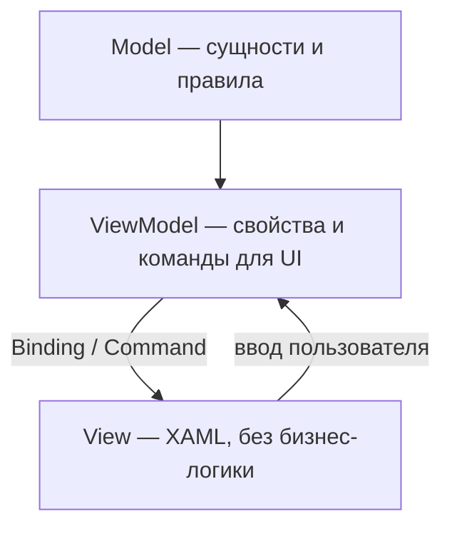

import ExternalCodeEmbed from '@site/src/components/ExternalCodeEmbed';


# Практикум WPF — основы MVVM

<div class="article-tags">
  <span class="tag tag-required">ОБЯЗАТЕЛЬНО</span>
  <span class="tag tag-beginner">ДЛЯ НОВИЧКОВ</span>
</div>

<span class="complexity-badge">Разработчику</span>
<span class="complexity-badge">Архитектору</span>

> **Практикум, шаг 2 из 6.** Разделяем данные, логику представления и XAML. Теория паттернов в [Особенности разработки десктопных приложений](../112.md#mvvm); локальный пример — [Первая форма WPF — XAML, стили и шаблоны](../119.md). Базовые окна без MVVM — [Lab — WinForms и WPF](/lab/Примеры/1138).

---

## Три роли MVVM



| Слой | TaskDesk | Запрещено |
|------|----------|-----------|
| **Model** | `TaskItem`, статусы, валидация заголовка | Ссылки на `Button`, `MessageBox` |
| **ViewModel** | `TaskListViewModel`, списки, `AddTaskCommand`, вызов `ITaskApi` | Прямой `new HttpClient()` в каждой команде без DI |
| **View** | `TaskListView.xaml`, списки, поля | Расчёт бизнес-правил в `Click` |

View **не знает** о Model напрямую — только о свойствах ViewModel, удобных для отображения (`DisplayStatus`, `IsBusy`).

---

## Model — данные и правила


<ExternalCodeEmbed example="csharp/code-411-wpf-praktikum-2-001" title="Model — данные и правила" minHeight={318} />


Model живёт в **`TaskDesk.Core`** — его подключают и API, и клиент (DTO можно маппить отдельно).

---

## ViewModel — INotifyPropertyChanged

UI обновляется, когда ViewModel сообщает об изменении свойства:


<ExternalCodeEmbed example="csharp/code-411-wpf-praktikum-2-002" title="ViewModel — INotifyPropertyChanged" minHeight={534} />


**ObservableCollection&lt;T&gt;** сам уведомляет список об добавлении и удалении — `ListBox` перерисовывается без ручного `Items.Refresh()`.

---

## Команды — ICommand вместо Click


<ExternalCodeEmbed example="csharp/code-411-wpf-praktikum-2-003" title="Команды — ICommand вместо Click" minHeight={390} />


В XAML:

```xml
<Button Content="Добавить задачу" Command="{Binding AddTaskCommand}"/>
```

Кнопка автоматически **неактивна**, когда `CanExecute` возвращает `false` (пустой заголовок).

---

## CommunityToolkit.Mvvm — меньше boilerplate

Пакет **`CommunityToolkit.Mvvm`** (официальный, MIT) генерирует код через source generators:

```powershell
dotnet add package CommunityToolkit.Mvvm
```


<ExternalCodeEmbed example="csharp/code-411-wpf-praktikum-2-004" title="CommunityToolkit.Mvvm — меньше boilerplate" minHeight={426} />


`[ObservableProperty]` создаёт свойство с уведомлениями; `[RelayCommand]` — асинхронную команду с `CanExecute`.

---

## Асинхронность и IsBusy

Сетевые вызовы в TaskDesk **не блокируют** UI:


<ExternalCodeEmbed example="csharp/code-411-wpf-praktikum-2-005" title="Асинхронность и IsBusy" minHeight={426} />


В View индикатор:

```xml
<ProgressBar IsIndeterminate="True" Height="4"
             Visibility="{Binding IsBusy, Converter={StaticResource BoolToVis}}"/>
```

---

## Сервисный слой — ITaskRepository

ViewModel не вызывает HTTP напрямую в финальной архитектуре — только интерфейс:

```csharp
public interface ITaskRepository
{
    Task<IReadOnlyList<TaskItem>> GetAllAsync(CancellationToken ct = default);
    Task<TaskItem> CreateAsync(TaskItem task, CancellationToken ct = default);
    Task UpdateAsync(TaskItem task, CancellationToken ct = default);
    Task DeleteAsync(Guid id, CancellationToken ct = default);
}
```

Реализации:

- **InMemoryTaskRepository** — для unit-тестов и офлайн-прототипа;
- **ApiTaskRepository** — `HttpClient` к TaskDesk.Api (шаг 4).

Так ViewModel тестируется с моком репозитория без окна и без сервера.

---

## View — только привязки


<ExternalCodeEmbed example="xml/code-411-wpf-praktikum-2-006" title="View — только привязки" minHeight={498} />


`DataContext` задаёт Prism при навигации (шаг 4) или вручную в `MainWindow`.

---

## Типичные ошибки MVVM

| Симптом | Причина | Решение |
|---------|---------|---------|
| UI не обновляется | Нет `INotifyPropertyChanged` | Toolkit или ручные уведомления |
| Кнопка всегда серая | `CanExecute` не пересчитывается | `RaiseCanExecuteChanged` при изменении полей |
| Дубликаты в списке | Добавление до ответа API | Ждать `CreateAsync`, один источник правды |
| Краш при старте | `DataContext` null | Регистрация VM в DI, проверка привязок в Output |

---

## Чек-лист шага 2

- [ ] Model без ссылок на WPF-сборки.
- [ ] ViewModel с командами и `ObservableCollection`.
- [ ] View без обработчиков `Click` с бизнес-логикой.
- [ ] Интерфейс репозитория для будущего API.

**Дальше:** [Сервер на ASP.NET Core Web API](./3).

---
