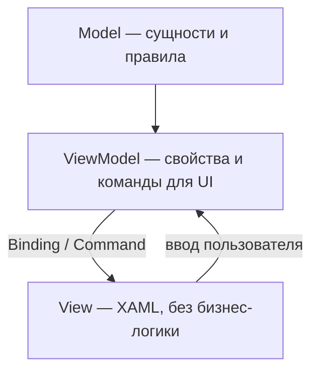

# Практикум WPF — основы MVVM

<div class="article-tags">
  <span class="tag tag-required">ОБЯЗАТЕЛЬНО</span>
  <span class="tag tag-beginner">ДЛЯ НОВИЧКОВ</span>
</div>

<span class="complexity-badge">Разработчику</span>
<span class="complexity-badge">Архитектору</span>

> **Практикум, шаг 2 из 6.** Разделяем данные, логику представления и XAML. Теория паттернов в [112.md](../112.md#mvvm); локальный пример — [119.md](../119.md). Базовые окна без MVVM — [Lab — WinForms и WPF](/lab/Примеры/1138).

---

## Три роли MVVM



| Слой | TaskDesk | Запрещено |
|------|----------|-----------|
| **Model** | `TaskItem`, статусы, валидация заголовка | Ссылки на `Button`, `MessageBox` |
| **ViewModel** | `TaskListViewModel`, списки, `AddTaskCommand`, вызов `ITaskApi` | Прямой `new HttpClient()` в каждой команде без DI |
| **View** | `TaskListView.xaml`, списки, поля | Расчёт бизнес-правил в `Click` |

View **не знает** о Model напрямую — только о свойствах ViewModel, удобных для отображения (`DisplayStatus`, `IsBusy`).

---

## Model — данные и правила

```csharp
namespace TaskDesk.Core.Models;

public enum TaskStatus { Todo, InProgress, Done }

public sealed class TaskItem
{
    public Guid Id { get; init; } = Guid.NewGuid();
    public required string Title { get; set; }
    public TaskStatus Status { get; set; } = TaskStatus.Todo;
    public DateTimeOffset CreatedAt { get; init; } = DateTimeOffset.UtcNow;

    public bool IsValid() =>
        !string.IsNullOrWhiteSpace(Title) && Title.Length <= 200;
}
```

Model живёт в **`TaskDesk.Core`** — его подключают и API, и клиент (DTO можно маппить отдельно).

---

## ViewModel — INotifyPropertyChanged

UI обновляется, когда ViewModel сообщает об изменении свойства:

```csharp
public class TaskListViewModel : INotifyPropertyChanged
{
    public event PropertyChangedEventHandler? PropertyChanged;

    private string _newTitle = "";
    public string NewTitle
    {
        get => _newTitle;
        set
        {
            if (_newTitle == value) return;
            _newTitle = value;
            PropertyChanged?.Invoke(this, new(nameof(NewTitle)));
            AddTaskCommand.RaiseCanExecuteChanged();
        }
    }

    public ObservableCollection<TaskItemViewModel> Tasks { get; } = new();
    public RelayCommand AddTaskCommand { get; }

    public TaskListViewModel(ITaskRepository repository)
    {
        _repository = repository;
        AddTaskCommand = new RelayCommand(ExecuteAdd, CanAdd);
    }
}
```

**ObservableCollection&lt;T&gt;** сам уведомляет список об добавлении и удалении — `ListBox` перерисовывается без ручного `Items.Refresh()`.

---

## Команды — ICommand вместо Click

```csharp
public sealed class RelayCommand : ICommand
{
    private readonly Action _execute;
    private readonly Func<bool>? _canExecute;

    public RelayCommand(Action execute, Func<bool>? canExecute = null)
    {
        _execute = execute;
        _canExecute = canExecute;
    }

    public bool CanExecute(object? parameter) => _canExecute?.Invoke() ?? true;
    public void Execute(object? parameter) => _execute();
    public event EventHandler? CanExecuteChanged;

    public void RaiseCanExecuteChanged() =>
        CanExecuteChanged?.Invoke(this, EventArgs.Empty);
}
```

В XAML:

```xml
<Button Content="Добавить задачу" Command="{Binding AddTaskCommand}"/>
```

Кнопка автоматически **неактивна**, когда `CanExecute` возвращает `false` (пустой заголовок).

---

## CommunityToolkit.Mvvm — меньше boilerplate

Пакет **`CommunityToolkit.Mvvm`** (официальный, MIT) генерирует код через source generators:

```powershell
dotnet add package CommunityToolkit.Mvvm
```

```csharp
public partial class TaskListViewModel : ObservableObject
{
    private readonly ITaskRepository _repository;

    [ObservableProperty]
    private string _newTitle = "";

    public ObservableCollection<TaskItemViewModel> Tasks { get; } = new();

    [RelayCommand(CanExecute = nameof(CanAddTask))]
    private async Task AddTaskAsync()
    {
        var item = new TaskItem { Title = NewTitle.Trim() };
        await _repository.CreateAsync(item);
        Tasks.Add(TaskItemViewModel.FromModel(item));
        NewTitle = "";
    }

    private bool CanAddTask() => !string.IsNullOrWhiteSpace(NewTitle);
}
```

`[ObservableProperty]` создаёт свойство с уведомлениями; `[RelayCommand]` — асинхронную команду с `CanExecute`.

---

## Асинхронность и IsBusy

Сетевые вызовы в TaskDesk **не блокируют** UI:

```csharp
[ObservableProperty]
private bool _isBusy;

[RelayCommand]
private async Task LoadTasksAsync()
{
    if (IsBusy) return;
    IsBusy = true;
    try
    {
        var items = await _repository.GetAllAsync();
        Tasks.Clear();
        foreach (var t in items)
            Tasks.Add(TaskItemViewModel.FromModel(t));
    }
    finally
    {
        IsBusy = false;
    }
}
```

В View индикатор:

```xml
<ProgressBar IsIndeterminate="True" Height="4"
             Visibility="{Binding IsBusy, Converter={StaticResource BoolToVis}}"/>
```

---

## Сервисный слой — ITaskRepository

ViewModel не вызывает HTTP напрямую в финальной архитектуре — только интерфейс:

```csharp
public interface ITaskRepository
{
    Task<IReadOnlyList<TaskItem>> GetAllAsync(CancellationToken ct = default);
    Task<TaskItem> CreateAsync(TaskItem task, CancellationToken ct = default);
    Task UpdateAsync(TaskItem task, CancellationToken ct = default);
    Task DeleteAsync(Guid id, CancellationToken ct = default);
}
```

Реализации:

- **InMemoryTaskRepository** — для unit-тестов и офлайн-прототипа;
- **ApiTaskRepository** — `HttpClient` к TaskDesk.Api (шаг 4).

Так ViewModel тестируется с моком репозитория без окна и без сервера.

---

## View — только привязки

```xml
<UserControl x:Class="TaskDesk.Client.Views.TaskListView"
             xmlns="http://schemas.microsoft.com/winfx/2006/xaml/presentation"
             xmlns:x="http://schemas.microsoft.com/winfx/2006/xaml">
  <Grid Margin="16">
    <Grid.RowDefinitions>
      <RowDefinition Height="Auto"/>
      <RowDefinition Height="*"/>
    </Grid.RowDefinitions>
    <StackPanel Orientation="Horizontal" Margin="0,0,0,12">
      <TextBox Width="280" Text="{Binding NewTitle, UpdateSourceTrigger=PropertyChanged}"/>
      <Button Margin="8,0,0,0" Content="Добавить" Command="{Binding AddTaskCommand}"/>
    </StackPanel>
    <ListBox Grid.Row="1" ItemsSource="{Binding Tasks}">
      <ListBox.ItemTemplate>
        <DataTemplate>
          <StackPanel>
            <TextBlock Text="{Binding Title}" FontWeight="SemiBold"/>
            <TextBlock Text="{Binding StatusLabel}" Opacity="0.7"/>
          </StackPanel>
        </DataTemplate>
      </ListBox.ItemTemplate>
    </ListBox>
  </Grid>
</UserControl>
```

`DataContext` задаёт Prism при навигации (шаг 4) или вручную в `MainWindow`.

---

## Типичные ошибки MVVM

| Симптом | Причина | Решение |
|---------|---------|---------|
| UI не обновляется | Нет `INotifyPropertyChanged` | Toolkit или ручные уведомления |
| Кнопка всегда серая | `CanExecute` не пересчитывается | `RaiseCanExecuteChanged` при изменении полей |
| Дубликаты в списке | Добавление до ответа API | Ждать `CreateAsync`, один источник правды |
| Краш при старте | `DataContext` null | Регистрация VM в DI, проверка привязок в Output |

---

## Чек-лист шага 2

- [ ] Model без ссылок на WPF-сборки.
- [ ] ViewModel с командами и `ObservableCollection`.
- [ ] View без обработчиков `Click` с бизнес-логикой.
- [ ] Интерфейс репозитория для будущего API.

**Дальше:** [Сервер на ASP.NET Core Web API](./3).

---
