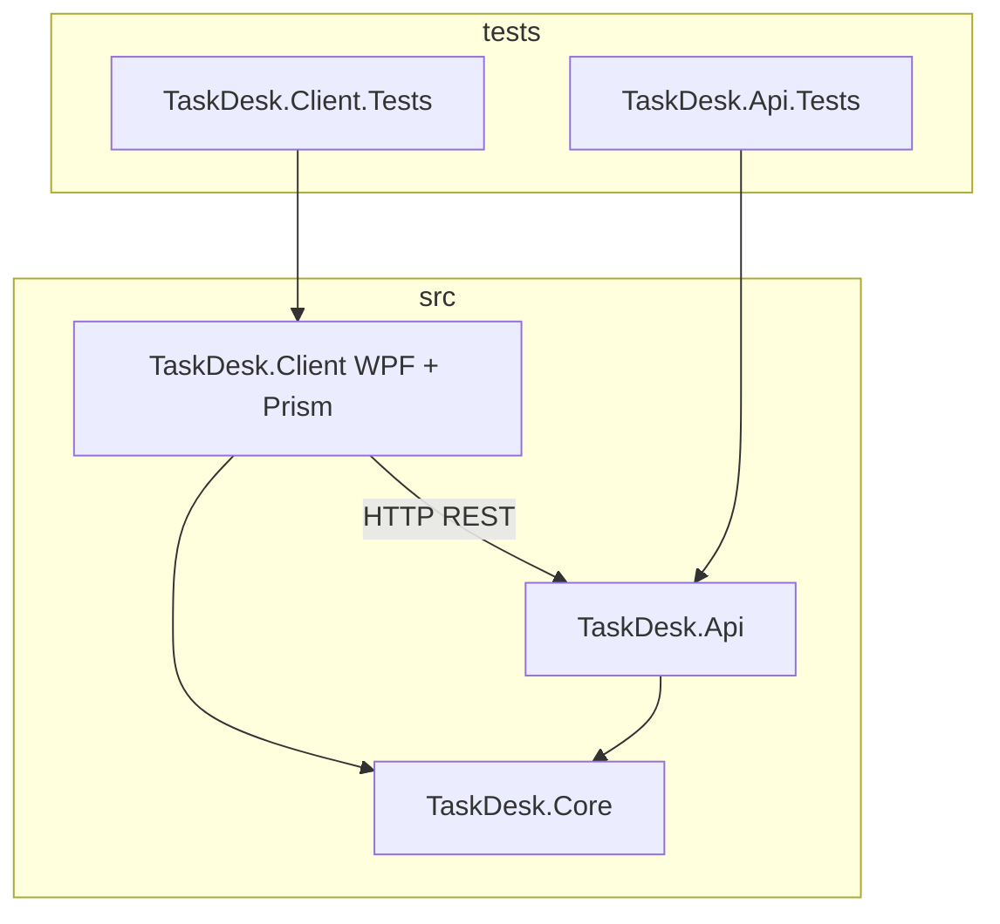

# Практикум WPF — итоговый проект TaskDesk

<div class="article-tags">
  <span class="tag tag-required">ОБЯЗАТЕЛЬНО</span>
  <span class="tag tag-beginner">ДЛЯ НОВИЧКОВ</span>
</div>

<span class="complexity-badge">Разработчику</span>
<span class="complexity-badge">Архитектору</span>

> **Практикум, шаг 6 из 6.** Сводим [WPF и XAML](./1), [MVVM](./2), [API](./3), [Prism](./4) и [тесты](./5) в один репозиторий **TaskDesk**.

---

## Целевая архитектура



| Проект | Тип | Назначение |
|--------|-----|------------|
| **TaskDesk.Core** | Class Library | `TaskItem`, DTO, `ITaskRepository` (интерфейс клиента) |
| **TaskDesk.Api** | ASP.NET Core Web API | REST, `ITaskStore`, Swagger |
| **TaskDesk.Client** | WPF + Prism | Shell, регионы, `ApiTaskRepository` |
| **TaskDesk.Api.Tests** | xUnit | `WebApplicationFactory` |
| **TaskDesk.Client.Tests** | xUnit + Moq | ViewModel |

---

## Финальная структура репозитория

```
TaskDesk/
├── TaskDesk.sln
├── README.md
├── src/
│   ├── TaskDesk.Core/
│   │   ├── Models/TaskItem.cs
│   │   └── Contracts/TaskDto.cs
│   ├── TaskDesk.Api/
│   │   ├── Program.cs
│   │   ├── Controllers/TasksController.cs
│   │   └── Services/InMemoryTaskStore.cs
│   └── TaskDesk.Client/
│       ├── App.xaml.cs
│       ├── appsettings.json
│       ├── Views/ShellWindow.xaml, TaskListView.xaml
│       ├── ViewModels/
│       └── Services/ApiTaskRepository.cs
└── tests/
    ├── TaskDesk.Api.Tests/
    └── TaskDesk.Client.Tests/
```

---

## Сборка solution одной командой

```powershell
dotnet new sln -n TaskDesk
dotnet sln add src/TaskDesk.Core/TaskDesk.Core.csproj
dotnet sln add src/TaskDesk.Api/TaskDesk.Api.csproj
dotnet sln add src/TaskDesk.Client/TaskDesk.Client.csproj
dotnet sln add tests/TaskDesk.Api.Tests/TaskDesk.Api.Tests.csproj
dotnet sln add tests/TaskDesk.Client.Tests/TaskDesk.Client.Tests.csproj
```

Проверка:

```powershell
dotnet build
dotnet test
```

---

## Сценарий демонстрации (5 минут)

1. Запустить API: `dotnet run --project src/TaskDesk.Api --urls http://localhost:5100`.
2. Открыть Swagger — убедиться, что `GET /api/v1/tasks` отвечает `[]`.
3. Запустить клиент: `dotnet run --project src/TaskDesk.Client`.
4. Добавить задачу "Подготовить отчёт" — она появляется в списке.
5. Обновить Swagger — та же задача в JSON.
6. Остановить API — в клиенте видно сообщение об ошибке сети.
7. Запустить API снова — кнопка "Обновить" / повторная навигация подтягивает данные.

---

## Критерии готовности "итогового проекта"

| Критерий | Выполнено, если |
|----------|-----------------|
| Клиент-сервер | Клиент **не** хранит список только в памяти после перезапуска API |
| MVVM | Нет бизнес-логики в `*.xaml.cs` Views |
| Prism | Регистрация VM и View через `RegisterForNavigation`, DI для репозитория |
| REST | CRUD по `/api/v1/tasks`, JSON через System.Text.Json |
| Тесты | `dotnet test` ≥ 4 осмысленных теста (API + VM) |
| Конфигурация | URL API в `appsettings.json`, не захардкожен в десяти местах |

---

## Типичные сбои при интеграции

| Симптом | Причина | Решение |
|---------|---------|---------|
| `Connection refused` | API не запущен | Старт Api на 5100, проверка `BaseUrl` |
| Пустой список после добавления | POST OK, GET другой store | Singleton `ITaskStore`, один экземпляр |
| Десериализация падает | camelCase vs PascalCase | `JsonSerializerOptions.PropertyNamingPolicy = JsonNamingPolicy.CamelCase` на сервере и клиенте |
| Prism не находит View | Имя навигации | `nameof(TaskListView)` совпадает с классом |
| Дубликаты при двойном клике | Нет `IsBusy` | Блокировка команды на время `await` |

---

## Расширения после базового TaskDesk

Выберите 1–2 пункта для портфолио:

1. **SQLite + EF Core** на API вместо in-memory ([Приложение с S3, PostgreSQL и ASP.NET Core Web API](/encyclopedia/5-languages/5-05-csharp/453)).
2. **JWT** — login в клиенте, защищённые эндпоинты ([Identity — JWT, cookie и MVC](/encyclopedia/5-languages/5-05-csharp/4515)).
3. **Второй регион Prism** — master/detail (список + карточка задачи).
4. **Фильтр по статусу** — ComboBox в View, query `?status=` на API.
5. **Публикация** — `dotnet publish` клиента self-contained + MSI ([Microsoft Store и публикация Windows-приложений](../117.md)).
6. **Интеграция с OrderDesk** — тот же REST-подход, что в [практикуме REST](/encyclopedia/8-infra-security/8-08-praktikum-rest-i-websocket/intro).

---

## Связь с материалами энциклопедии

| Вы изучили | Куда углубиться |
|------------|-----------------|
| WPF UI | [Справочник по WPF — элементы UI](../1192.md), [Первая форма WPF — XAML, стили и шаблоны](../119.md) |
| Потоки, память | [Особенности разработки десктопных приложений](../112.md) |
| Clean Architecture API | [Clean Architecture на ASP.NET Core](/encyclopedia/7-project/7-06-proektirovanie-i-arhitektura/design/2143) |
| MAUI (кроссплатформа) | [.NET MAUI — первая программа](/encyclopedia/5-languages/5-05-csharp/4513) |
| Electron (веб в десктопе) | [Первая программа Electron с React](../118.md) |

---

## Чек-лист самопроверки по практикуму

- [ ] Могу объяснить роли Model, View, ViewModel на примере TaskDesk.
- [ ] Могу добавить новый REST-эндпоинт и вызвать его из `ApiTaskRepository`.
- [ ] Понимаю, зачем Prism регистрирует View в регионе.
- [ ] Написал unit-тест ViewModel с Moq без запуска окна.
- [ ] Прогнал CRUD в Postman или Swagger.

Поздравляем — у вас **полноценное клиент-серверное десктоп-приложение** на стеке WPF + Prism + ASP.NET Core.

---

## Назад к оглавлению

[Практикум WPF и клиент-сервер — о разделе](./intro)

---
