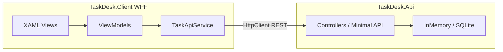

import DocCardList from '@theme/DocCardList';

# О разделе

Здесь — **сквозной практикум** для разработчика на C#, который хочет собрать **полноценное клиент-серверное десктоп-приложение** на Windows. Вы пройдёте путь от первого окна WPF до REST API, клиента на **Prism**, автотестов и итогового проекта **TaskDesk**.

Базовый одиночный WPF без сети уже разобран в [119.md](../119.md). Этот маршрут **продолжает** ту линию и добавляет сервер, DI, навигацию по регионам и проверку качества.

---

## Сценарий TaskDesk

**TaskDesk** — учебный менеджер задач для небольшой команды:

| Компонент | Стек | Роль |
|-----------|------|------|
| **TaskDesk.Api** | ASP.NET Core 8, Web API | CRUD задач, фильтры, JSON по REST |
| **TaskDesk.Client** | WPF + Prism + MVVM | Окно со списком, формой и статусом подключения к API |
| **TaskDesk.Core** | Class Library | Общие DTO и контракты между клиентом и сервером |

Синхронная связь — **HTTP/JSON** (`GET/POST/PUT/DELETE` на `/api/v1/tasks`). Клиент хранит состояние UI в ViewModel, данные — на сервере.

---

## Маршрут по шагам

| Шаг | Статья | Содержание |
|-----|--------|------------|
| 1 | [WPF и XAML — введение](./1) | Платформа, дерево элементов, привязки, связь с [119](../119) |
| 2 | [Основы MVVM](./2) | Model, View, ViewModel, `ICommand`, `INotifyPropertyChanged`, CommunityToolkit |
| 3 | [Сервер на ASP.NET Core Web API](./3) | REST, контроллеры, DTO, Swagger, CORS для десктоп-клиента |
| 4 | [Клиент WPF на Prism](./4) | Регионы, навигация, DI, `HttpClient`, обработка ошибок сети |
| 5 | [Тестирование запросов и unit-тесты](./5) | Postman, `WebApplicationFactory`, xUnit + Moq для ViewModel и API |
| 6 | [Итоговый проект TaskDesk](./6) | Solution из трёх проектов, чек-лист сборки, типичные сбои |

---

## Что понадобится

- Windows 10/11 и [.NET SDK 8+](https://dotnet.microsoft.com/download)
- Visual Studio 2022 (рабочая нагрузка «Разработка классических приложений .NET») или VS Code + C# Dev Kit
- [Postman](https://www.postman.com/downloads/) или встроенный Swagger UI
- Базовое знакомство с [C#](/encyclopedia/5-languages/5-05-csharp/intro) и [HTTP](/encyclopedia/2-system-network/2-09-osnovy-integratsionnogo-vzaimodeystviya/118)

  
С чего начать, если WPF впервые

  Сначала пройдите [119.md](../119.md) (локальные заметки без сервера), затем вернитесь сюда. Параллельно держите открытым [справочник XAML](/encyclopedia/3-data-markup/3-04-konfiguratsii-i-dannye/6) и [116.md](../116.md) — карту стеков Windows.

---

## Как учиться по разделу

1. Прочитайте [шаг 1](./1) и [шаг 2](./2), соберите минимальное окно с ViewModel.
2. Поднимите API по [шагу 3](./3) и проверьте эндпоинты в Swagger или Postman.
3. Создайте клиент Prism по [шагу 4](./4), укажите базовый URL API в `appsettings.json`.
4. Закройте цикл тестами из [шага 5](./5).
5. Сверьте итоговую структуру с [шагом 6](./6) и чек-листом самопроверки.

<DocCardList />

---

## Связь с теорией

| Тема | Материалы энциклопедии |
|------|------------------------|
| WPF, DirectX, выбор стека | [116.md](../116.md), [платформа .NET UI](/encyclopedia/5-languages/5-04-platforma-dotnet/13) |
| MVVM, потоки UI | [112.md](../112.md) |
| REST, JSON | [REST](/encyclopedia/8-infra-security/8-05-mikroservisy-i-integratsiya/1151), [4511](/encyclopedia/5-languages/5-05-csharp/4511) |
| Архитектурные паттерны | [design-patterns MVVM](/encyclopedia/7-project/7-06-proektirovanie-i-arhitektura/design-patterns/113) |
| Элементы WPF | [1192.md](../1192.md) |

---
