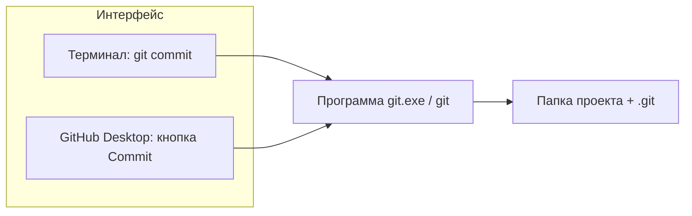
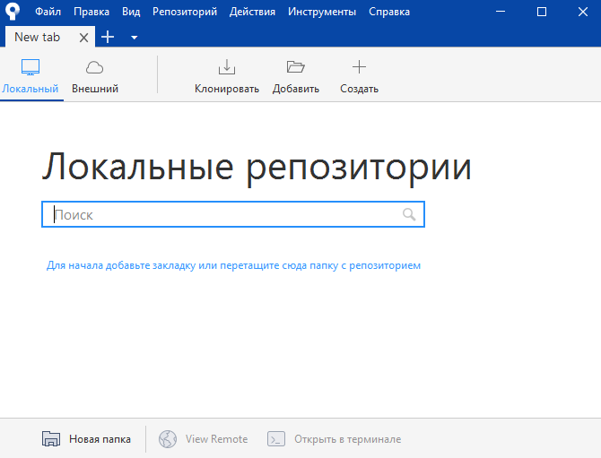
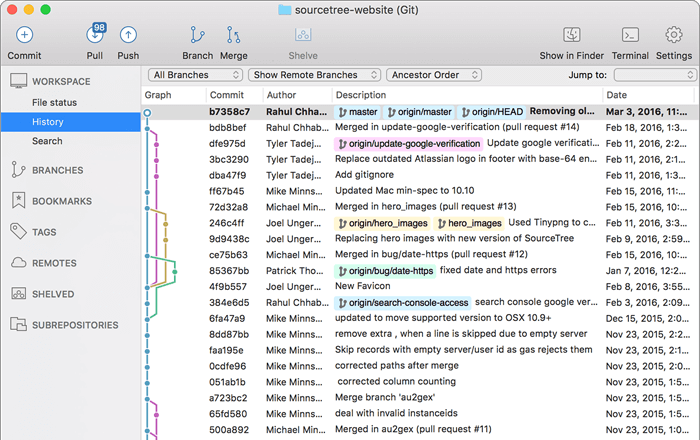
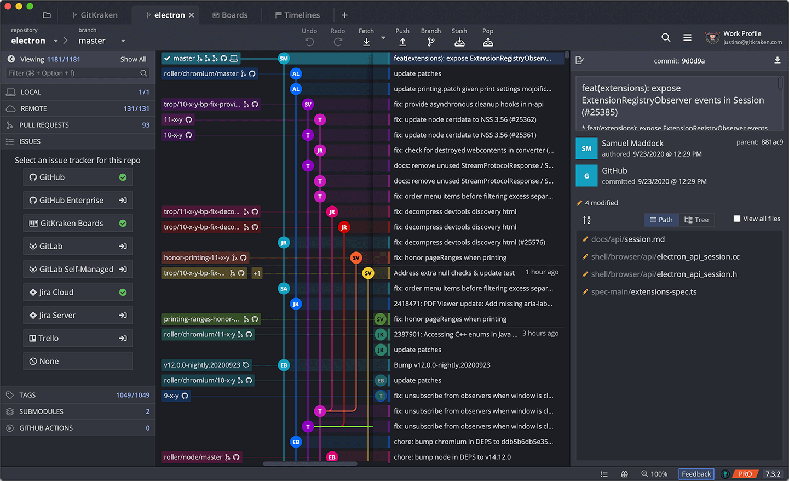
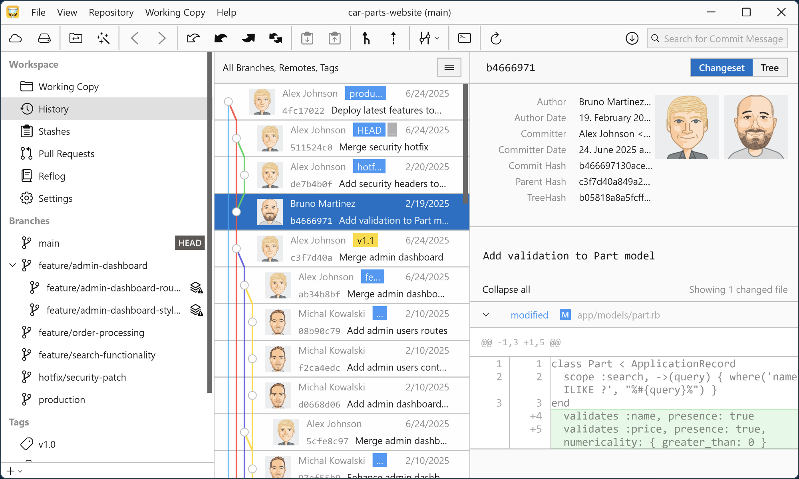
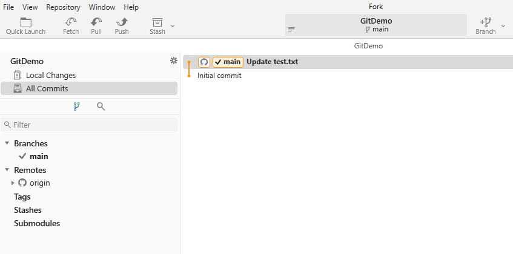
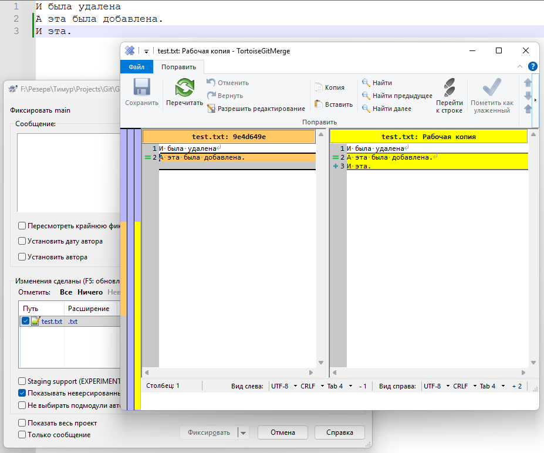
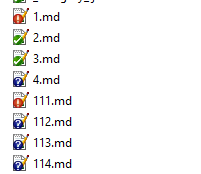

# Установка и настройка Git

<div class="article-tags">
  <span class="tag tag-required">ОБЯЗАТЕЛЬНО</span>
  <span class="tag tag-beginner">ДЛЯ НОВИЧКОВ</span>
</div>

<span class="complexity-badge">Разработчику</span>
<span class="complexity-badge">Архитектору</span>
<span class="complexity-badge">Инженеру</span>

---

В [первой главе раздела](./1) вы познакомились с идеей Git и с **GitHub Desktop**. Здесь — установка **самого Git**, настройка окружения, разница между консолью и графическими клиентами и пошаговые сценарии: клонирование, новый репозиторий, коммит, отправка на GitHub.

Следующий шаг после настройки — ежедневные команды в [«Как работать с Git»](./112).

---

## Git, хостинг и клиенты — не одно и то же

| Понятие | Что это | Примеры |
|---------|---------|---------|
| **Git** | Программа контроля версий на вашем ПК. Хранит историю в папке `.git` | Устанавливается с [git-scm.com](https://git-scm.com/) |
| **Git-хостинг** | Сайт с удалёнными репозиториями | [GitHub](https://github.com), GitLab, Bitbucket |
| **Git-клиент** | Оболочка: рисует кнопки и вызывает Git за вас | GitHub Desktop, Fork, терминал + `git` |

**GitHub Desktop** — клиент и удобный вход в GitHub. **Это не замена установки Git**, если вы хотите пользоваться командой `git` в PowerShell, VS Code или CI на своей машине.

**Fork** в этой статье — два разных смысла:

- **[Fork](https://git-fork.com/)** — отдельное desktop-приложение (клиент), см. [ниже](#fork-клиент).
- **Fork репозитория** на GitHub — ваша копия чужого проекта для pull request; тема [ветвления и слияния](./113).

---

## Командная строка и графический клиент

Одна и та же история коммитов. Меняется только **способ отдать команды** движку Git.



| | Терминал (`git …`) | Графический клиент |
|---|-------------------|-------------------|
| Как выглядит | Текстовые команды | Кнопки, списки файлов, граф веток |
| Кому удобно | Скрипты, серверы, курсы, CI локально | Быстрый старт, обзор изменений глазами |
| Что нужно на ПК | Git в **PATH** (см. ниже) | Установленный клиент; часто **отдельно** нужен Git (зависит от программы) |
| Под капотом | Прямой вызов `git` | Тот же `git`, часто из встроенной копии |

Для курса достаточно связки **GitHub Desktop** + **терминал** после правильной установки Git. Остальные клиенты ниже — обзор на выбор.

---

## Почему в терминале «git» может не работать

После установки **только** GitHub Desktop в PowerShell или cmd часто бывает так:

```text
'git' is not recognized as an internal or external command
```

Причина: система ищет программу `git.exe` в каталогах из переменной окружения **PATH**. **GitHub Desktop PATH не расширяет** — он запускает свою встроенную копию Git только внутри приложения.

Варианты:

1. **Рекомендуется** — поставить [Git for Windows](https://git-scm.com/download/win) и на шаге установки включить доступ из командной строки (см. [пошаговую установку](#установка-git-for-windows)).
2. **Вручную** — добавить в PATH папку с `git.exe`, если Git уже есть (например, после Git for Windows или встроенный Git из другого клиента). См. [добавление PATH вручную](#добавить-git-в-path-вручную-windows).

Проверка в **новом** окне терминала (старое не подхватывает PATH до перезапуска):

```bash
git --version
```

Ожидаемый ответ похож на `git version 2.47.0.windows.1`. Пустой вывод или ошибка — Git в PATH нет.

<div class="callout callout--warning">
  <div class="callout-title">Git Bash ≠ PowerShell</div>

  <div class="callout-body">
  Установщик Git for Windows ставит <strong>Git Bash</strong> — там <code>git</code> обычно уже работает. В <strong>PowerShell</strong> и <strong>cmd</strong> команда появится только если при установке выбрали пункт про PATH или добавили путь вручную.
</div>
  </div>


---

## Установка Git for Windows

1. Скачайте установщик: [git-scm.com/download/win](https://git-scm.com/download/win).
2. Запустите `.exe` от имени обычного пользователя (админ не обязателен).
3. На шаге **Adjusting your PATH environment** выберите один из вариантов:
   - **Git from the command line and also from 3rd-party software** — `git` доступен в cmd, PowerShell и IDE (**рекомендуется** для обучения);
   - *Git Bash only* — только в Git Bash, в PowerShell команды не будет;
   - *Use Git and optional Unix tools from the Command Prompt* — расширенный PATH с Unix-утилитами (осторожно: может пересечься с другими программами).
4. Остальные шаги мастера можно оставить по умолчанию (редактор, окончания строк `LF`/`CRLF` — для курса не критично на старте).
5. Завершите установку и **закройте все открытые терминалы**, затем откройте новый PowerShell.

Проверка:

```powershell
git --version
where.exe git
```

`where.exe git` покажет путь к `git.exe`, например `C:\Program Files\Git\cmd\git.exe`.

---

### macOS и Linux

```bash
# macOS (Homebrew)
brew install git

# Debian / Ubuntu
sudo apt update && sudo apt install git
```

Проверка: `git --version`. На macOS иногда стоит старая системная версия — для курса лучше версия из Homebrew или с [git-scm.com](https://git-scm.com/download/mac).

---

### Добавить Git в PATH вручную (Windows)

Если Git установлен, но терминал его не видит:

1. Найдите `git.exe` — типичные пути:
   - `C:\Program Files\Git\cmd\`
   - `C:\Program Files (x86)\Git\cmd\`
2. **Параметры Windows** → **Система** → **О системе** → **Дополнительные параметры системы** → **Переменные среды**.
3. В **Переменные среды пользователя** (или системные, если нужно всем) выберите **Path** → **Изменить** → **Создать** → вставьте путь к папке **`cmd`** (где лежит `git.exe`), не к корню `Git`.
4. **ОК** во всех окнах, перезапустите терминал и VS Code.

<div class="callout callout--info">
  <div class="callout-title">GitHub Desktop и Git</div>

  <div class="callout-body">
  Desktop может работать без отдельного установщика, потому что использует <strong>свою</strong> копию Git. Для уроков с <code>git status</code> в PowerShell и для статей с CI всё равно ставьте <strong>Git for Windows</strong> с пунктом про command line.
</div>
  </div>


---

## Настройка Git — имя, email, ветка по умолчанию

Git подписывает коммиты **именем и email**. Настройте один раз до первого коммита (подойдут и локальные проекты без GitHub):

```bash
git config --global user.name "Иван Иванов"
git config --global user.email "ivan@example.com"
git config --global init.defaultBranch main
git config --list --global
```

| Уровень | Файл | Когда использовать |
|---------|------|-------------------|
| **Локальный** | `.git/config` в проекте | Другой email только для одного репозитория (работа / личное) |
| **Глобальный** | `~/.gitconfig` (Windows: `%USERPROFILE%\.gitconfig`) | Все репозитории пользователя |
| **Системный** | `/etc/gitconfig` | Для всех пользователей ПК (редко, нужны права админа) |

При чтении настройки Git смотрит: **локальный → глобальный → системный**; используется первое найденное значение.

**GitHub Desktop:** **File → Options → Git** (на Mac: **Preferences → Git**) — те же поля Name и Email, Desktop записывает их в глобальный `git config`.

Email для GitHub лучше совпадать с адресом аккаунта или быть добавленным в [Emails](https://github.com/settings/emails), иначе коммиты не привяжутся к профилю на сайте.

---

## Пошаговый алгоритм — с чего начать

### Сценарий A — только GitHub Desktop (без терминала)

| Шаг | Действие |
|-----|----------|
| 1 | Скачать [GitHub Desktop](https://desktop.github.com/), установить, войти в аккаунт GitHub |
| 2 | **File → Options → Git** — указать имя и email |
| 3a | **File → Clone repository** — URL с GitHub → выбрать папку на диске |
| 3b | **File → Add local repository** — указать папку, где уже есть `.git` |
| 3c | **File → New repository** — имя, путь (например `C:\Projects\MySite`), создать |
| 4 | Править файлы в редакторе; в Desktop вкладка **Changes** — отметить файлы, **Summary**, **Commit** |
| 5 | **Publish repository** (первый раз) или **Push origin** — отправить на GitHub |

Публикация сайта на Pages — [лабораторный кейс](/lab/Кейсы/3).

---

### Сценарий B — терминал (после установки Git в PATH)

**Клонировать существующий репозиторий с GitHub:**

```bash
cd C:\Projects
git clone https://github.com/USER/repo-name.git
cd repo-name
git status
```

**Новый проект с нуля и отправка на GitHub:**

```bash
mkdir C:\Projects\my-app
cd C:\Projects\my-app
git init
git config user.name "Иван Иванов"    # если не задано --global
git config user.email "ivan@example.com"

echo "# my-app" > README.md
git add README.md
git commit -m "Initial commit"

git remote add origin https://github.com/USER/my-app.git
git branch -M main
git push -u origin main
```

**Подключить уже существующую папку с кодом (ещё без Git):**

```bash
cd C:\Projects\existing-folder
git init
git add .
git commit -m "Первый коммит: существующий код"

git remote add origin https://github.com/USER/existing-folder.git
git push -u origin main
```

На GitHub репозиторий `existing-folder` нужно **создать заранее** (пустой, без README), либо использовать `gh repo create` / Desktop **Publish**.

**Ежедневный цикл:**

```bash
# правки в файлах
git status
git add file1.txt file2.css    # или git add .
git commit -m "Описание изменений"
git push
```

Подробнее про staged, `git diff` и конфликты — в [главе 112](./112).

---

### Сценарий C — Desktop и терминал вместе

Частая схема: репозиторий добавлен в **GitHub Desktop**, коммиты иногда в Desktop, иногда в VS Code / PowerShell. Главное — одна папка, один `.git`; настройки `user.name` / `user.email` общие через `git config`.

---

## Git-клиенты — обзор

Все перечисленные программы **не заменяют** понимание Git: они показывают статус файлов, историю и кнопки «Commit / Push», а запись в `.git` выполняет та же программа `git`.

| Клиент | ОС | Нужен отдельный Git? | Сильная сторона |
|--------|-----|----------------------|-----------------|
| [GitHub Desktop](#github-desktop) | Windows, macOS | встроенный для GUI; для PATH — [Git for Windows](#установка-git-for-windows) | Простой старт, GitHub |
| [Sourcetree](#sourcetree) | Windows, macOS | да, ищет при первом запуске | Граф коммитов, Bitbucket |
| [GitKraken](#gitkraken) | Win, macOS, Linux | да | Красивый граф, drag-and-drop |
| [Tower](#tower) | macOS, Windows | да | Скорость, платный |
| [Fork](#fork-клиент) | Windows, macOS | да | Быстрый нативный UI |
| [SmartGit](#smartgit) | Win, macOS, Linux | да | Подмодули, команды |
| [Gitnuro](#gitnuro) | Windows, macOS | да | Минимализм |
| [TortoiseGit](#tortoisegit) | Windows | да | Контекстное меню проводника |
| [Working Copy](#working-copy) | iOS / iPadOS | на устройстве | Git с телефона |

---

### GitHub Desktop

Официальный клиент GitHub для **Windows и macOS**. Закрывает типовой цикл: клонирование, ветки, коммит, push/pull, просмотр diff, разрешение простых конфликтов.


| Элемент интерфейса | Назначение |
|--------------------|------------|
| Список репозиториев слева | Переключение между проектами |
| **Changes** | Изменённые файлы; галочки — что войдёт в коммит |
| **Summary / Description** | Сообщение коммита |
| **Commit to main** | Локальный снимок (аналог `git commit`) |
| **Push origin** | Отправка на GitHub (`git push`) |
| Выпадающий список веток | `git checkout` / создание ветки |
| История по центру | `git log`, просмотр патча |

**Установка:** [desktop.github.com](https://desktop.github.com/) → вход через GitHub → **Clone**, **Add** или **New repository**.

**Ограничение для обучения:** команды `git` в PowerShell после одного Desktop [могут не работать](#почему-в-терминале-git-может-не-работать) — поставьте Git for Windows отдельно.

---

### Sourcetree

Бесплатный клиент **Atlassian** для Git и Mercurial. Удобен, когда нужен **наглядный граф** коммитов и веток и работа с Bitbucket, GitHub, GitLab.



При первом запуске Sourcetree **ищет установленный Git** — без Git for Windows установка неполная.



Три зоны окна: репозитории и ветки, список изменённых файлов, **граф истории**. Коммит — через staged-файлы и кнопку Commit; push/pull — на панели инструментов.

---

### GitKraken

Кроссплатформенный клиент (**Windows, macOS, Linux**) на Electron. Интеграции с GitHub, GitLab, Bitbucket, Azure DevOps. Бесплатная лицензия — для **публичных** репозиториев; приватные и коммерция — платно.



**Stage All → Commit** — аналог `git add` + `git commit`. Слияние веток — перетаскиванием на графе. Для удалённого сервера настраивают SSH-ключи или токены в настройках аккаунта.

---

### Tower

Коммерческий клиент (**macOS, Windows**) с упором на скорость и клавиатурные сокращения. Пробный период ~30 дней. Подходит опытным пользователям с большими репозиториями.



---

### Working Copy

**Мобильный** Git-клиент для **iOS и iPadOS**: клонирование, коммиты, ветки, синхронизация с GitHub/GitLab. Удобен для правок и просмотра на планшете; полноценная разработка по-прежнему чаще на ПК.

Working Copy не заменяет desktop-клиент, а дополняет его в поездках.

---

### Fork (клиент)

**Fork** — независимый desktop-клиент для **Windows и macOS** с нативным интерфейсом (без Electron). Акцент на скорости отклика и удобном графе веток; хорошо тянет крупные репозитории.



Установка с [git-fork.com](https://git-fork.com/). Требует установленный Git в системе. По операциям близок к GitKraken/Sourcetree: stage, commit, merge, interactive rebase в GUI.

Не путать с **fork репозитория** на GitHub — копией чужого проекта у себя в аккаунте.

---

### SmartGit

Клиент **syntevo** для **Windows, macOS, Linux**: подмодули, интеграции с трекерами задач, продвинутые сценарии для команд. Бесплатная лицензия — некоммерческое использование; коммерция — платная.

---

### Gitnuro

Легковесный клиент с **минималистичным** интерфейсом (**Windows, macOS**). Быстрый запуск, базовый набор без перегруза панелями — альтернатива тяжёлым Electron-приложениям.

---

### TortoiseGit

Интеграция Git в **Проводник Windows**: правый клик по папке и файлам, оверлеи иконок (изменён, добавлен, конфликт).



| Действие в меню | Аналог в терминале |
|-----------------|-------------------|
| **Git Create repository here** | `git init` |
| **Git Clone…** | `git clone` |
| **Git Commit** | `git commit` |
| **TortoiseGit → Push** | `git push` |

После установки иногда нужна **перезагрузка проводника** или сеанса Windows.



Оверлеи: зелёная галочка — без изменений, красный восклицательный знак — изменён, синий «?» — не в Git. Конфликты слияния — диалог выбора «моя / чужая / обе» версии фрагмента.

---

## Чек-лист «готов к работе»

1. `git --version` в PowerShell (или выбранном терминале) отвечает версией.
2. `git config --global user.name` и `user.email` заданы.
3. `init.defaultBranch` = `main` (по желанию, но удобно для GitHub).
4. GitHub Desktop установлен и авторизован **или** настроен SSH/HTTPS для `git push`.
5. Пройден один полный цикл: clone/init → правка → commit → push.

Дальше — [Как работать с Git](./112), типовые ошибки — [1141](./1141), публикация статики — [GitHub Pages](/lab/Кейсы/3).

<div class="callout callout--tip">
  <div class="callout-title">После настройки Git</div>

  <div class="callout-body">
  Статический сайт или портфолио можно опубликовать через <code>git push</code> на GitHub Pages (HTTPS/SSH, ветки, workflow) — [лабораторный кейс «Размещение своего сайта с GitHub Pages»](/lab/Кейсы/3).
</div>
  </div>


---
