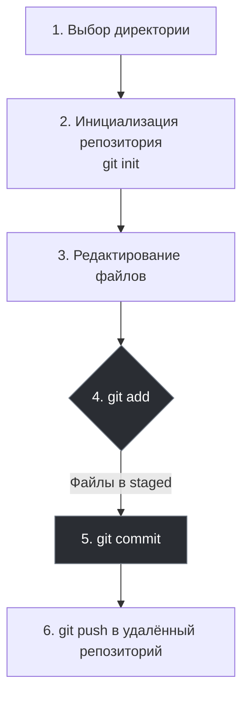

import GitEmulator from '@site/src/components/GitEmulator.jsx';


# Как работать с Git?

<div class="article-tags">
  <span class="tag tag-required">ОБЯЗАТЕЛЬНО</span>
  <span class="tag tag-beginner">ДЛЯ НОВИЧКОВ</span>
</div>

<span class="complexity-badge">Разработчику</span>
<span class="complexity-badge">Архитектору</span>
<span class="complexity-badge">Инженеру</span>

## Как работать с Git?

Работа с Git строится по определённому алгоритму:



<GitEmulator />

### Три области — рабочая копия, индекс, коммиты

Git разделяет состояние проекта на три уровня:

| Область | Где хранится | Посмотреть | Изменить |
|---------|--------------|------------|----------|
| Рабочая копия | файлы в папке проекта | `git status`, `git diff` | редактор, `git restore <file>` |
| Индекс (staging) | `.git/index` | `git diff --staged` | `git add`, `git restore --staged` |
| Репозиторий (HEAD) | объекты в `.git/objects` | `git log`, `git show` | `git commit` |

Коммит — это **снимок всех отслеживаемых файлов**, подготовленных в индексе, а не «сохранение по одному файлу».

### Тот же сценарий, что в первой главе — через CLI

Повторим путь из главы про GitHub Desktop, но в терминале (после [установки Git](/encyclopedia/4-code-dev/4-13-osnovy-raboty-s-git/111)):

```bash
mkdir my-demo && cd my-demo
git init
echo "Hello" > test.txt
git status          # untracked: test.txt
git add test.txt
git status          # staged: test.txt
git commit -m "Первый коммит"
```

Если репозиторий уже создан на GitHub, привяжите remote и отправьте ветку (имя `main` задаётся при `git config init.defaultBranch main`):

```bash
git remote add origin https://github.com/USER/my-demo.git
git branch -M main
git push -u origin main
```

Флаг `-u` запоминает связь: дальше достаточно `git push` и `git pull` из этой ветки.

### 1. Выбор директории

Выбираем *директорию* - папку, где находится проект.

### 2. Инициализация

Инициализируем *репозиторий* - говорим Git, что эта папка теперь будет под его контролем. Репозиторий на нашем компьютере будет **локальным**, а на сервере (в облаке) - **удалённым**.

### 3. Изменение и работа

Изменяем файлы (собственно, работаем).

Git умеет отслеживать состояние каждого файла в проекте, и файлы могут быть в одном из следующих состояний:
	- *Неотслеживаемый (untracked)*, когда файл существует, но Git не знает о нём. Это может быть новый созданный файл, не добавленный в индекс;
	- *Модифицированный (modified)*, это изменённый файл с момента последнего коммита, но ещё не добавленный в индекс. Git знает, что он изменился, но мы ещё не решили, включать ли его в следующий коммит;
	- *Индексированный (staged)* — изменения подготовлены к коммиту (`git add`, `git restore --staged`):

```bash
git add test.txt
git restore --staged test.txt
```
	- *Зафиксированный (committed)*, когда изменения попали в коммит и сохранены в истории проекта.

### 4. Индекс

Добавляем файлы в **индекс (Stage)** - выбираем, какие именно изменения мы хотим сохранить. Git не автоматически отслеживает все изменения. Нужно явно сказать ему: «Я хочу сохранить эти файлы» — сначала добавляя их в индекс (stage), а затем делая коммит. К примеру, если мы изменили три файла - test.html, test.js и test.css, но хотим отправить изменения только двух файлов - test.html, test.js. Тогда мы только их и добавляем в индекс, промежуточную зону, куда мы складываем те изменения, которые хотим зафиксировать в следующем коммите.

### Выборочный stage и просмотр последнего коммита

Иногда в одном файле смешаны две задачи. Команда `git add -p` (patch) предлагает по очереди фрагменты diff и спрашивает, включать ли их в индекс:

```bash
git add -p src/utils.ts
git diff --staged          # что попадёт в следующий коммит
git commit -m "Часть 1: валидация"
# оставшиеся правки останутся modified — снова add -p или git add
```

Забыли файл в только что созданном коммите (ещё без `push`):

```bash
git add пропущенный.ts
git commit --amend --no-edit
```

Посмотреть, что вошло в последний коммит:

```bash
git show HEAD --stat
git show HEAD              # полный diff
```

| Отменить… | Команда |
|-----------|---------|
| Правки в файле (не в индексе) | `git restore путь/к/файлу` |
| Только из индекса | `git restore --staged путь/к/файлу` |
| Последний коммит, правки оставить staged | `git reset --soft HEAD~1` |

Развернутые сценарии (stash, неверная ветка, отклонённый push) — в главе [Типовые ситуации с Git](/encyclopedia/4-code-dev/4-13-osnovy-raboty-s-git/1141).

### 5. Коммит

Делаем **коммит** - фиксируем изменения с описанием того, что мы сделали. Коммит — это моментальная «фотография» состояния проекта в определённый момент времени. К этой «фотографии» мы добавляем подпись (сообщение), указав, к примеру «Исправил баг с кнопкой запуска». Это поможет нам через месяц, чтобы вспомнить, зачем сделан именно этот коммит.

### 6. Fetch, pull и push

**Push** — отправка локальных коммитов на удалённый репозиторий. **Fetch** — скачать коммиты с сервера, не меняя рабочие файлы. **Pull** — fetch + слияние в текущую ветку.

Можно запомнить: **push** — отдать на сервер, **fetch** — только метаданные, **pull** — забрать и влить.

```bash
git fetch origin
git pull origin main
git push origin main
```


---
