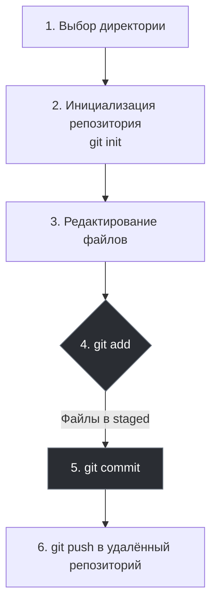
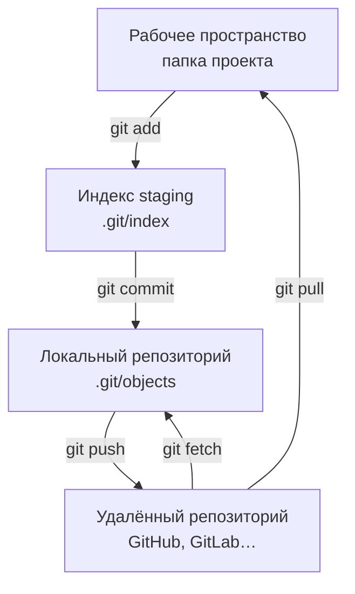

import GitEmulator from '@site/src/components/GitEmulator.jsx';


# Как работать с Git?

<div class="article-tags">
  <span class="tag tag-required">ОБЯЗАТЕЛЬНО</span>
  <span class="tag tag-beginner">ДЛЯ НОВИЧКОВ</span>
</div>

<span class="complexity-badge">Разработчику</span>
<span class="complexity-badge">Архитектору</span>
<span class="complexity-badge">Инженеру</span>

<div class="callout callout--info">
  <div class="callout-title">Где вы в разделе про Git</div>

  <div class="callout-body">
  Перед этой главой — [Установка и настройка Git](./111). Дальше — [Ветвление и слияние](./113), [Рекомендации в команде](./114), справочник по симптомам — [Типовые ситуации](./1141). Карта раздела — [о разделе 4.13](./intro). <code>push</code>, <code>pull</code>, ветки и остальные команды из ежедневного цикла — в [12 команд на каждый день](./115#12-komand). Практика выкладки после <code>push</code> — [кейс GitHub Pages](/lab/Кейсы/3).
</div>
  </div>


---

## Как работать с Git?

Git в повседневной работе — это не «запомнить сто команд», а **повторяемый цикл**: правки в файлах → осознанный выбор, что войдёт в снимок → коммит с понятным сообщением → обмен с удалённым репозиторием. Ниже — тот же цикл, что вы уже видели в GitHub Desktop, но с терминалом и с пояснением **четырёх уровней** — от папки проекта до GitHub ([схема цепочки команд](#git-workflow-chain)).

Работа с Git строится по определённому алгоритму:



<GitEmulator />

---

<span id="git-workflow-chain"></span>

### Четыре уровня — от папки проекта до GitHub

Проект на диске, индекс, локальная история и копия на сервере — **разные «этажи»**. Команды Git переносят изменения между ними. `git push` отправляет ваши коммиты на GitHub (или другой хостинг). `git pull` подтягивает обновления с сервера **и сразу обновляет** файлы в папке проекта. `git fetch` тоже забирает новое с сервера, но **не трогает** рабочие файлы — только локальную историю.

| Уровень | Где это | Смысл |
|---------|---------|-------|
| Рабочее пространство | папка проекта (`src/`, `README.md`…) | правите файлы в редакторе |
| Индекс (staging) | `.git/index` | черновик следующего коммита — что войдёт в снимок |
| Локальный репозиторий | `.git/objects`, ветки в `.git/refs` | сохранённая история на вашем ПК |
| Удалённый репозиторий | GitHub, GitLab, `origin` на сервере | общая копия для команды и CI |

**Отправить изменения «вверх»** (к команде):

| Команда | Откуда → куда | Зачем |
|---------|---------------|-------|
| `git add` | рабочее пространство → индекс | подготовить правки к сохранению |
| `git commit` | индекс → локальный репозиторий | зафиксировать снимок с сообщением |
| `git push` | локальный репозиторий → удалённый | передать коммиты на сервер; коллеги и пайплайны увидят ветку |

**Получить изменения «вниз»** (с сервера):

| Команда | Откуда → куда | Зачем |
|---------|---------------|-------|
| `git fetch` | удалённый → только локальный репозиторий | узнать, что появилось на GitHub, **без** правки файлов в проекте |
| `git pull` | удалённый → рабочее пространство | подтянуть обновления и влить их в текущую ветку (`fetch` + слияние) |



<div class="callout callout--tip">
  <div class="callout-title">Как не перепутать fetch и pull</div>

  <div class="callout-body">
  <p><code>fetch</code> — «скачать новости с сервера, файлы в IDE пока не трогать». <code>pull</code> — «скачать и сразу влить в мою ветку и рабочую копию». Если не уверены, что придёт с сервера, сначала <code>git fetch origin</code>, посмотрите <code>git log HEAD..origin/main</code>, затем осознанно <code>merge</code> или <code>rebase</code> — см. <a href="#6-fetch-pull-i-push">ниже</a>.</p>
</div>
  </div>


Локально Git ещё разделяет **рабочую копию**, **индекс** и **HEAD** — удобно смотреть через `git status` и `git diff`:

| Область | Где хранится | Посмотреть | Изменить |
|---------|--------------|------------|----------|
| Рабочая копия | файлы в папке проекта | `git status`, `git diff` | редактор, `git restore <file>` |
| Индекс (staging) | `.git/index` | `git diff --staged` | `git add`, `git restore --staged` |
| Репозиторий (HEAD) | объекты в `.git/objects` | `git log`, `git show` | `git commit` |

Коммит — это **снимок всех отслеживаемых файлов**, подготовленных в индексе, а не «сохранение по одному файлу».

---

### Ежедневный цикл разработчика

У большинства VCS схожий стереотип работы — отличия в командах, но логика одна:

| Шаг | Действие | В Git | Зачем |
|-----|----------|-------|-------|
| 1 | Получить проект | `git clone` / `git checkout` | Рабочая копия на диске |
| 2 | Обновить копию | `git pull` / `git fetch` + merge | Свести расхождение с общей версией, снизить риск конфликтов |
| 3 | Править файлы | редактор, IDE | Локально, без сети |
| 4 | Зафиксировать | `git add` → `git commit` | Сохранить снимок с сообщением «что и зачем» |
| 5 | Обменяться | `git push` | Передать коммиты команде или на CI — [шпаргалка](./115#12-komand) |

Пока коллеги вносят правки в общую ветку, ваша рабочая копия **устаревает** — расхождение растёт, выше шанс конфликта при слиянии. Поэтому `pull` (или `fetch` перед rebase) делают **регулярно**, а не только перед релизом. VCS может требовать обновления перед `commit`; в Git это политика команды и настройки сервера, а не жёсткое правило клиента.

Крупные задачи оформляют **веткой** — промежуточные коммиты живут там, пока фича не готова к merge в `main`. Подробнее — в [Ветвление и слияние](./113).

---

### Тот же сценарий, что в первой главе — через CLI

Повторим путь из главы про GitHub Desktop, но в терминале (после [установки Git](/encyclopedia/4-code-dev/4-13-osnovy-raboty-s-git/111)):

```bash
mkdir my-demo && cd my-demo
git init
echo "Hello" > test.txt
git status          # untracked: test.txt
git add test.txt
git status          # staged: test.txt
git commit -m "Первый коммит"
```

Если репозиторий уже создан на GitHub, привяжите remote и отправьте ветку (имя `main` задаётся при `git config init.defaultBranch main`):

```bash
git remote add origin https://github.com/USER/my-demo.git
git branch -M main
git push -u origin main
```

Флаг `-u` запоминает связь: дальше достаточно `git push` и `git pull` из этой ветки.

---

### 1. Выбор директории

Выбираем *директорию* - папку, где находится проект.

Обычно это корень проекта (там же, где `package.json`, `.sln`, `pyproject.toml` или хотя бы `README`). Git хранит историю **для всей папки и подпапок** внутри неё; не стоит инициализировать репозиторий в `C:\Users\...` — только в каталоге одного продукта. Если клонировали чужой проект с GitHub, этот шаг уже сделан: папка клона и есть рабочая копия.

---

### 2. Инициализация

Инициализируем *репозиторий* - говорим Git, что эта папка теперь будет под его контролем. Репозиторий на нашем компьютере будет **локальным**, а на сервере (в облаке) - **удалённым**.

Команда [`git init`](./115#12-komand) создаёт скрытую папку `.git` — в ней объекты, ветки, настройки. Пока вы не сделали `git add` и `git commit`, истории коммитов ещё нет, но Git уже «ведёт» каталог. Удалённый репозиторий (GitHub/GitLab) появляется позже: `git remote add origin …` привязывает имя `origin` к URL на сервере. Один локальный клон может иметь несколько remote (например, `origin` и форк `upstream`) — это тема [ветвления](./113).

---

### 3. Изменение и работа

Изменяем файлы (собственно, работаем).

Git умеет отслеживать состояние каждого файла в проекте. Файлы проходят через состояния:

- **Неотслеживаемый (untracked)** — файл есть на диске, Git о нём ещё не ведёт учёт (новый файл, не попавший в репозиторий).
- **Модифицированный (modified)** — Git знает файл, вы его изменили после последнего коммита, но в индекс изменения ещё не попали.
- **Индексированный (staged)** — вы явно отметили версию для следующего коммита (`git add`, отмена из индекса — `git restore --staged`):

```bash
git add test.txt
git restore --staged test.txt
```

- **Зафиксированный (committed)** — снимок сохранён в истории; рабочая копия может снова уйти в modified, если вы продолжите правки.

<div class="callout callout--tip">
  <div class="callout-title">Как читать <code>git status</code></div>

  <div class="callout-body">
  Блок <strong>Changes to be committed</strong> — staged (попадёт в следующий <code>commit</code>). <strong>Changes not staged</strong> — modified, но не в индексе. <strong>Untracked files</strong> — Git ещё не отслеживает. Цвета и формулировки зависят от терминала; смысл всегда один.
</div>
  </div>


---

### 4. Индекс

Добавляем файлы в **индекс (Stage)** - выбираем, какие именно изменения мы хотим сохранить. Git не автоматически отслеживает все изменения. Нужно явно сказать ему: "Я хочу сохранить эти файлы" — сначала добавляя их в индекс (stage), а затем делая коммит. К примеру, если мы изменили три файла - test.html, test.js и test.css, но хотим отправить изменения только двух файлов - test.html, test.js. Тогда мы только их и добавляем в индекс, промежуточную зону, куда мы складываем те изменения, которые хотим зафиксировать в следующем коммите.

---

### Выборочный stage и просмотр последнего коммита

Иногда в одном файле смешаны две задачи. Команда `git add -p` (patch) предлагает по очереди фрагменты diff и спрашивает, включать ли их в индекс:

```bash
git add -p src/utils.ts
git diff --staged          # что попадёт в следующий коммит
git commit -m "Часть 1: валидация"
# оставшиеся правки останутся modified — снова add -p или git add
```

Забыли файл в только что созданном коммите (ещё без `push`):

```bash
git add пропущенный.ts
git commit --amend --no-edit
```

Посмотреть, что вошло в последний коммит:

```bash
git show HEAD --stat
git show HEAD              # полный diff
```

| Отменить… | Команда |
|-----------|---------|
| Правки в файле (не в индексе) | `git restore путь/к/файлу` |
| Только из индекса | `git restore --staged путь/к/файлу` |
| Последний коммит, правки оставить staged | `git reset --soft HEAD~1` |

Развернутые сценарии (stash, неверная ветка, отклонённый push) — в главе [Типовые ситуации с Git](/encyclopedia/4-code-dev/4-13-osnovy-raboty-s-git/1141).

---

### 5. Коммит

Делаем **коммит** - фиксируем изменения с описанием того, что мы сделали. Коммит — это моментальная "фотография" состояния проекта в определённый момент времени. К этой "фотографии" мы добавляем подпись (сообщение), указав, к примеру "Исправил баг с кнопкой запуска". Это поможет нам через месяц, чтобы вспомнить, зачем сделан именно этот коммит.

<span id="daty-kommita"></span>

#### Даты коммита — author и committer

Помимо сообщения Git сохраняет **две** метки времени (см. [портфолио и календарь GitHub](/encyclopedia/1-basics/1-26-karera-v-it-i-mify/7#daty-kommita-i-github) — зачем это важно для профиля):

| Поле | Кто задаёт | Типичный смысл |
|------|------------|----------------|
| Author date | автор правок | когда изменение сделано |
| Committer date | тот, кто записал коммит в историю | момент `commit`, rebase, cherry-pick |

По умолчанию обе даты совпадают с моментом `git commit`. Явно задать author date:

```bash
git commit -m "docs: README" --date="2024-04-20T12:00:00"
```

Чтобы author и committer совпали (миграция, перенос зеркала):

```bash
export GIT_AUTHOR_DATE="2024-04-20T12:00:00"
export GIT_COMMITTER_DATE="2024-04-20T12:00:00"
git commit -m "docs: README"
```

Посмотреть обе даты в логе:

```bash
git log --format=fuller -1
```

Переписать даты у коммитов, которые уже на сервере, можно только изменением истории (`rebase`, `filter-repo`) с новыми хешами; на общих ветках это согласуют с командой. Подмена дат ради «зелёного» календаря на GitHub не даёт навыков и рискована на собеседовании — см. карьерный разбор по ссылке выше.

---

<span id="6-fetch-pull-i-push"></span>

### 6. Fetch, pull и push

Схема четырёх уровней и направлений команд — [выше](#git-workflow-chain). Здесь — те же три команды с примерами в терминале.

**Push** — отправка локальных коммитов на удалённый репозиторий. **Fetch** — скачать коммиты с сервера, не меняя рабочие файлы. **Pull** — `fetch` + слияние в текущую ветку (файлы в проекте обновляются). Таблица «12 команд» — в [шпаргалке](./115#12-komand).

```bash
git fetch origin
git pull origin main
git push origin main
```

---

### Когда и зачем делать `git fetch`

`git fetch` обновляет удалённые ссылки (например, `origin/main`, `origin/feature-x`), но **не трогает** ваши файлы и индекс. Это безопасный "шаг проверки обстановки" перед merge/rebase.

Практический сценарий перед интеграцией:

```bash
git fetch origin
git log --oneline --decorate --graph --all -15
git switch feature/my-task
git merge origin/main
# или: git rebase origin/main
```

Что полезно запомнить:

- `git fetch origin` — получить обновления с конкретного remote;

  Скачиваются коммиты и обновляются ссылки вроде `origin/main`, но ваши файлы в рабочей копии **не меняются**. Удобно «подглядеть», что появилось на сервере, перед merge.

- `git fetch --all --prune` — обновить все remotes и убрать удалённые на сервере ветки из `refs/remotes/*`;

  После переименования или удаления ветки на GitHub локальные `origin/feature-old` могут висеть мёртвым грузом — `--prune` их убирает.

- после `fetch` сравнивайте `HEAD` и `origin/ваша-ветка`, чтобы понимать, что именно придёт при pull/push.

  Команда `git log HEAD..origin/main` показывает коммиты, которые вы **ещё не влили**; `git log origin/main..HEAD` — что уйдёт на сервер при `push`.

Типичная ошибка новичка — сразу делать `pull`, не понимая, что он ещё и сливает изменения. Если не уверены, сначала `fetch`, потом осознанно `merge` или `rebase`.

---

### Ежедневный цикл в команде (типовой день)

Схема повторяется изо дня в день, когда ветка уже создана и remote настроен:

```bash
git switch feature/TASK-123-short-title
git pull --rebase origin main          # подтянуть общую ветку (регламент команды может отличаться)
# ... правки в IDE ...
git status
git add src/ tests/
git commit -m "TASK-123: валидация email при регистрации"
git push origin feature/TASK-123-short-title
```

На GitHub/GitLab открываете **pull request** или **merge request** — ревью, CI, слияние. Подробно про ветки, конфликты и PR — в [Ветвление и слияние](./113); сравнение **merge** и **rebase** при подтягивании `main` — в [том же разделе](./113#merge-i-rebase). Про сообщения коммитов и процесс — в [Рекомендации в команде](./114).

| Ситуация | Что сделать |
|----------|-------------|
| Забыли `pull` перед работой | `git fetch`, затем `merge`/`rebase` по правилам команды |
| `push` отклонён (non-fast-forward) | Сначала интегрировать удалённые коммиты, потом снова `push` — см. [Типовые ситуации](./1141) |
| Нужно спрятать незакоммиченное | `git stash push -m "WIP: TASK-123"` |
| Случайно правили не в той ветке | [перенос в другую ветку](./1141) |

Опасные команды (`reset --hard`, `push --force`) — только по регламенту; см. [стоп-лист](/encyclopedia/8-infra-security/8-03-zabota-o-kode-i-dannyh/101).

---

### Сообщение коммита — зачем оно важно

Коммит — не только снимок файлов, но и **запись для будущего вас и ревьюера**. Минимально полезный шаблон:

```
TASK-123: кратко что сделано

Почему: ограничение API / баг из тикета.
Как проверить: запустить тест X, открыть /register.
```

Соглашения в команде могут требовать номер задачи, тип (`fix:`, `feat:`) или язык — уточняйте у лида. Разбор стиля — в [Рекомендации в команде](./114).

---

### Локальный репозиторий и `.gitignore`

Перед первым `git add` проверьте, что в коммит не попадут артефакты сборки и секреты. Шаблоны под стек — в [`.gitignore` — полное руководство](./116) (раздел 4.13). Секрет, уже попавший в историю, **нельзя** «просто удалить файлом» — см. [Типовые ситуации — секрет в Git](./1141).

---

## Ветки и запросы на слияние

Когда базовый цикл `add` → `commit` → `push` освоен, следующий обязательный слой — **ветки** и **pull request / merge request** на сервере: так команда видит изменения до слияния в общую ветку. Пошагово, с примерами команд и разбором конфликтов — в статье [Ветвление и слияние в Git](/encyclopedia/4-code-dev/4-13-osnovy-raboty-s-git/113). Жёстко регламентированные схемы веток (GitFlow, релизы) — в [разделе 8.03](/encyclopedia/8-infra-security/8-03-zabota-o-kode-i-dannyh/1111).

---

### Куда читать дальше

| Тема | Статья |
|------|--------|
| 12 команд — карманный набор | [115 — шпаргалка](./115#12-komand) |
| Установка, `user.name`, клиенты | [111 — Установка и настройка](./111) |
| Ветки, PR, конфликты | [113 — Ветвление](./113) |
| Ошибки и восстановление | [1141 — Типовые ситуации](./1141) |
| Внутреннее устройство Git | [8.03 — Архитектура Git](/encyclopedia/8-infra-security/8-03-zabota-o-kode-i-dannyh/111) |
| Процесс разработки с Git в команде | [Процесс разработки ПО](/encyclopedia/4-code-dev/4-14-razrabotka-i-otladka/1) |
| Интерактивный тренажёр | [Learn Git Branching](https://learngitbranching.js.org/?locale=ru_RU) |

---
