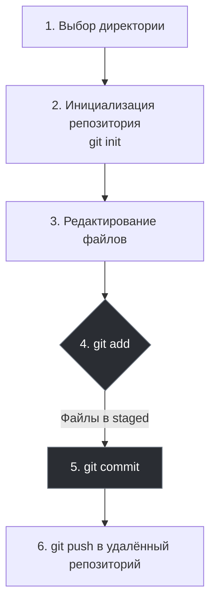
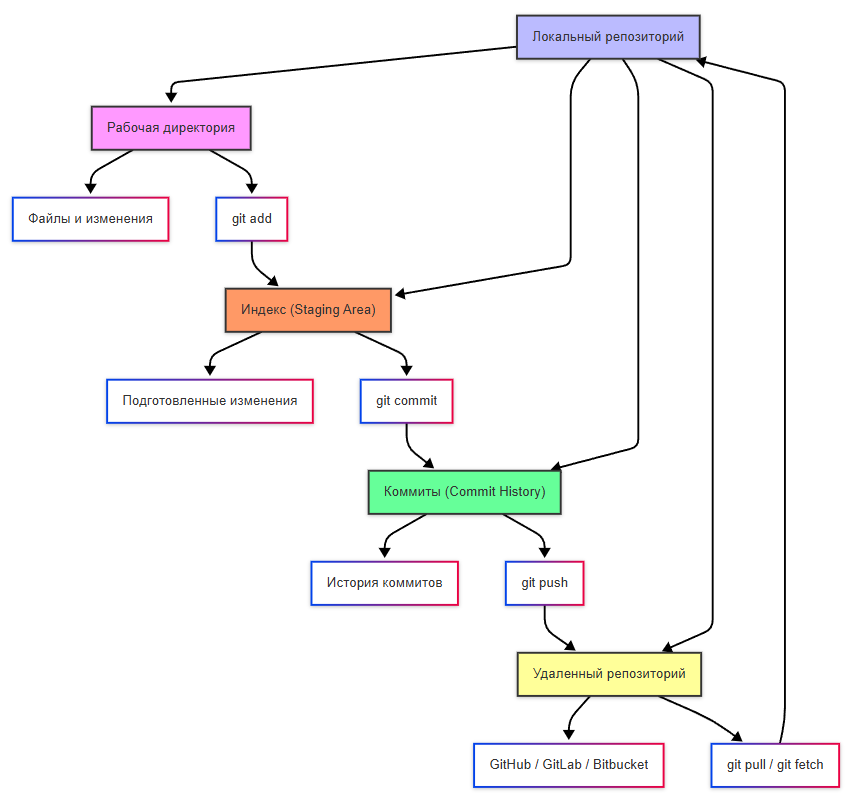

import GitEmulator from '@site/src/components/GitEmulator.jsx';

# Как работать с Git?

  ОБЯЗАТЕЛЬНО
  ДЛЯ НОВИЧКОВ

Разработчику
Архитектору
Инженеру

## Как работать с Git?

Работа с Git строится по определённому алгоритму:

<GitEmulator />

### 1. Выбор директории

Выбираем *директорию* - папку, где находится проект.

### 2. Инициализация

Инициализируем *репозиторий* - говорим Git, что эта папка теперь будет под его контролем. Репозиторий на нашем компьютере будет **локальным**, а на сервере (в облаке) - **удалённым**.

### 3. Изменение и работа

Изменяем файлы (собственно, работаем).

Git умеет отслеживать состояние каждого файла в проекте, и файлы могут быть в одном из следующих состояний:
	- *Неотслеживаемый (untracked)*, когда файл существует, но Git не знает о нём. Это может быть новый созданный файл, не добавленный в индекс;
	- *Модифицированный (modified)*, это изменённый файл с момента последнего коммита, но ещё не добавленный в индекс. Git знает, что он изменился, но мы ещё не решили, включать ли его в следующий коммит;
	- *Индексированный (staged)*, когда файл изменён и мы явно сказали Git, что хотим включить изменения в следующий коммит. Для этого используется команда `git add`;
	- *Зафиксированный (commited)*, когда файл был добавлен в индекс и «закоммичен», изменения сохранены в истории проекта.

### 4. Индекс

Добавляем файлы в **индекс (Stage)** - выбираем, какие именно изменения мы хотим сохранить. Git не автоматически отслеживает все изменения. Нужно явно сказать ему: «Я хочу сохранить эти файлы» — сначала добавляя их в индекс (stage), а затем делая коммит. К примеру, если мы изменили три файла - test.html, test.js и test.css, но хотим отправить изменения только двух файлов - test.html, test.js. Тогда мы только их и добавляем в индекс, промежуточную зону, куда мы складываем те изменения, которые хотим зафиксировать в следующем коммите.

### 5. Коммит

Делаем **коммит** - фиксируем изменения с описанием того, что мы сделали. Коммит — это моментальная «фотография» состояния проекта в определённый момент времени. К этой «фотографии» мы добавляем подпись (сообщение), указав, к примеру «Исправил баг с кнопкой запуска». Это поможет нам через месяц, чтобы вспомнить, зачем сделан именно этот коммит.

### 6. PUSH и PULL

Пушим в удалённый репозиторий, отправляя наши изменения на сервер.

**Push** — отправка своего коммита на удалённый репозиторий. То есть, локальные коммиты будут доступны другим только после push.

**Pull** — «вытягивание», когда забираем изменения других разработчиков из удалённого репозитория к себе. Например, коллега добавил новый модуль — выполняем pull и изменения появятся у нас локально.

Можно запомнить так, что push - загрузка на сервер, pull - скачивание с сервера.

---