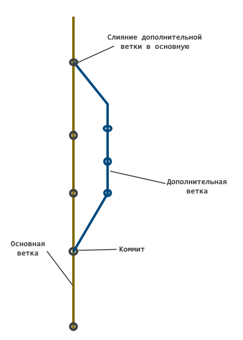
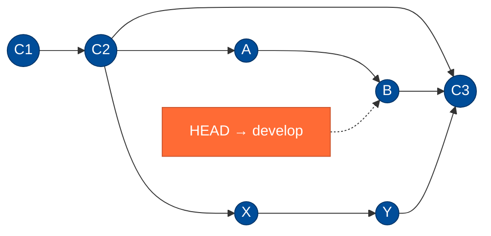
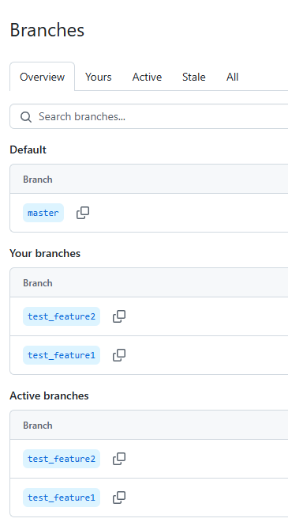
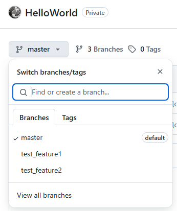
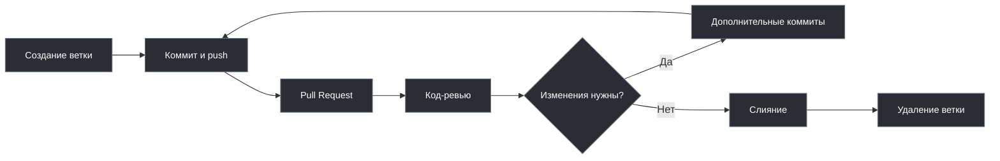
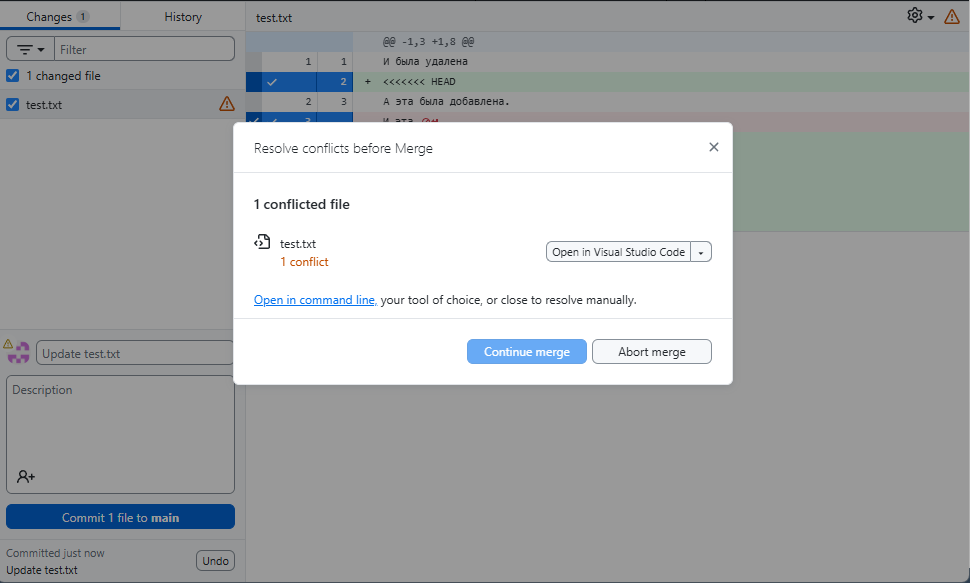
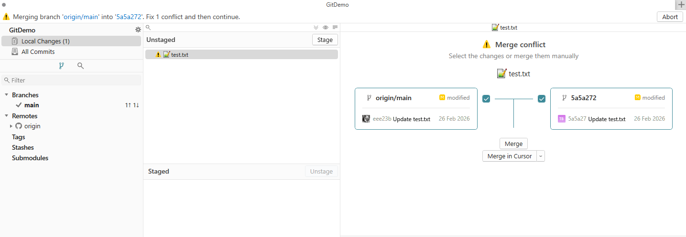
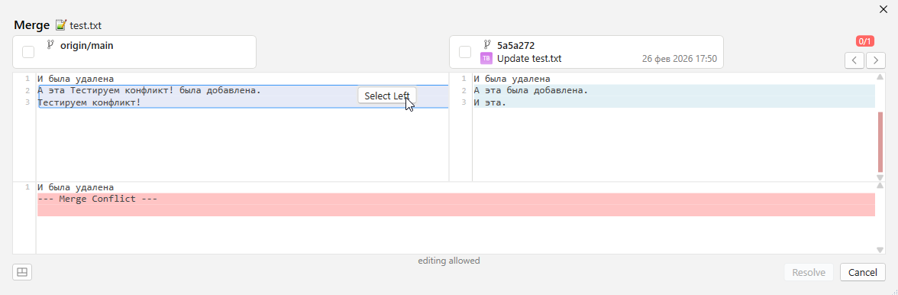

import GitBranchMergePlay from '@site/src/components/GitBranchMergePlay.jsx';

# Ветвление и слияние в Git

<div class="article-tags">
  <span class="tag tag-required">ОБЯЗАТЕЛЬНО</span>
  <span class="tag tag-beginner">ДЛЯ НОВИЧКОВ</span>
</div>

<span class="complexity-badge">Разработчику</span>
<span class="complexity-badge">Архитектору</span>
<span class="complexity-badge">Инженеру</span>


## Ветки и слияния

### Основы ветвистого хранения

Git использует *систему веток*, позволяющую работать над разными частями проекта параллельно, не мешая основной работе. Представим, что у нас есть стабильная версия - «чистовик». Разумеется, лучше не рисковать и не экспериментировать в ней, поэтому создадим новую ветку, в которой можем править код, делать коммиты, не влияя на основную версию проекта. Когда новая функция будет готова, можно *объединить (merge)* ветку новой фичи с основной веткой. И таких «дополнительных веток» может быть сколько угодно.

**Ветки** позволяют работать над несколькими задачами одновременно, изолировать экспериментальные изменения, легко тестировать и проверять новые идеи без риска сломать рабочую версию.

<GitBranchMergePlay />



Переключение на определённую ветку называется **checkout**. Ветка является просто последовательностью коммитов, поэтому переключаясь, мы сообщаем, что коммиты будут отправляться именно в эту ветку. На практике это работает так, что мы начинаем с какой-то определённой ветки, которую мы клонировали или создали. Потом мы можем создать ветку (клиенты позволяют выполнять checkout на новую ветку сразу после её создания), и переключиться на неё. После переключения на дополнительную ветку, все изменения будут учитываться для коммитов именно в неё, не трогая основную.

Git использует указатель на ветку - **HEAD**. 

Глянем визуально:



На схеме: `main` идёт C1→C2→C3; от C2 ответвляются `develop` (A→B) и `feature` (X→Y); обе линии сходятся в merge-коммите C3 на `main`. Оранжевый **HEAD** показывает, что сейчас вы на ветке `develop` (на коммите B).

Здесь можно увидеть последовательность коммитов в ветках *main*, *develop*, *feature*. Можно запутаться, не так ли? А веток может быть несколько тысяч! На схеме выше указаны коммиты как синие кружки. Активный HEAD (где мы сейчас) обозначен оранжевым узлом. Как можно заметить, коммиты связаны - поэтому важен полный контроль над состоянием системы. Если вы случайно отправите тестовые изменения на основную ветку - приложение может поломаться.

Ветку можно создать локально, а при отправке коммита ветка будет создана автоматически и на сервере. Тогда, к примеру, на GitHub будет выглядеть так:



На сервере, через специальный интерфейс, можно найти свой репозиторий, скопировать ссылку на него, изучить его ветки и увидеть коммиты, перейдя к ним.

Ветки могут удаляться, упорядочиваться в папки, переименовываться и сливаться друг с другом.

Ветка по умолчанию (Default) в новых репозиториях обычно называется `main` (в старых проектах ещё встречается `master`).

Удалённый репозиторий по умолчанию называется **origin** — это имя remote, а не ветка:

```bash
git push origin main
git fetch origin
git pull origin main
```



На любой репозиторий можно перейти по ссылке, и если он публичный, то авторизации не потребуется, однако приватный требует предоставления прав конкретным пользователям (в компании это выполняют администраторы).

Чтобы увидеть состояние файлов в репозитории, нужно выбрать ветку (сначала открывается Default), для этого можно использовать поиск по веткам.

Ветки могут получать свои теги, чтобы искать по ним, к примеру для багов один тег, для фич другой.

---

## Слияния веток и конфликты

### Слияния


**Merge** - специальная команда для слияния веток, которая позволяет как раз объединить изменения дополнительной ветки с основной. Однако, если Git обнаружит, что некоторые изменения не получается автоматически однозначно «объединить», то возникнет **конфликт слияния**. Чтобы разрешить конфликт слияния, требуется вмешательство пользователя, который скажет, оставить новую версию или старую. Если всё оказалось сложнее, то придётся вернуться к правке файла и учесть ошибки.

И разумеется, если рядовые программисты в компании будут сливать всё в основную ветку без контроля, то будет хаос, ведь код может содержать орфографические, стилистические, логические ошибки, не учитывать чужих изменений, противоречить стандартам проекта или нужно обсудить некоторые моменты перед слиянием. 

Для порядка используется специальный механизм - **pull request (пул-реквест, запрос на слияние)**, когда рядовые пользователи отправляют запрос на слияние своей ветки с основной веткой. Администратор, DevOps или старший программист изучает изменения на наличие проблем и конфликтов, а также проверяет корректность написания кода (код-ревью, code review) и оставляет свои замечания. После исправления замечаний, он принимает запрос, и только после этого происходит слияние.

```
Создание ветки → Коммит и пуш → Pull Request → Код-ревью → Слияние
```



Во многих командах к code review добавляют автоматические проверки (сборка, тесты) перед слиянием PR — это часть практики CI/CD. Подробнее см. раздел [DevOps и CI/CD](/encyclopedia/8-infra-security/8-04-devops-ci-cd/intro).

### Вклад в чужой репозиторий (форк)

На GitHub, GitLab и аналогах **форк** — копия репозитория в вашем аккаунте. Вы клонируете **свой** форк, а оригинал подключаете как `upstream`:

```bash
git clone git@github.com:ВАШ-ЛОГИН/project.git
cd project
git remote add upstream https://github.com/ОРИГИНАЛ/project.git
git fetch upstream
```

Перед новой задачей обновите базу из оригинала (`git merge upstream/main` или `git rebase upstream/main` — как принято в проекте), работайте в ветке `feature/...`, пушьте в **origin** (форк) и открывайте Pull Request в upstream. Пошаговые сценарии при ошибках — в [типовых ситуациях](/encyclopedia/4-code-dev/4-13-osnovy-raboty-s-git/1141#форк-и-синхронизация-с-upstream).

### Merge и rebase при обновлении feature-ветки

Перед `push` feature-ветку обычно подтягивают к актуальному `main`:

| Способ | Команда (упрощённо) | История | Когда уместно |
|--------|---------------------|---------|----------------|
| **Merge** | `git merge origin/main` | Появляется merge-коммит | Команда не переписывает историю |
| **Rebase** | `git rebase origin/main` | Линейная цепочка ваших коммитов | Личная ветка, в команде принят rebase |

После **rebase** уже запушенной ветки на сервер уходит переписанная история — нужен `git push --force-with-lease` (только для **вашей** ветки и по правилам команды). Отменить неудачный rebase: `git rebase --abort`. Конфликты при rebase разрешают так же, как при merge (`add` → `git rebase --continue`). Карточки: [конфликт при rebase](/encyclopedia/4-code-dev/4-13-osnovy-raboty-s-git/1141#конфликт-при-rebase), [rebase без force push](/encyclopedia/4-code-dev/4-13-osnovy-raboty-s-git/1141#rebase-без-force-push-на-remote).

---

### Решение конфликтов

**Конфликт слияния** — ситуация в системе контроля версий, при которой Git не может автоматически объединить изменения из двух разных веток. Такая ситуация возникает, когда в одной и той же строке одного файла были внесены разные правки в разных ветках или когда один участник редактирует файл, а другой удаляет его. Git останавливает процесс слияния и требует вмешательства пользователя для принятия окончательного решения о содержимом файла.

Автоматическое слияние работает без проблем, **если изменения затрагивают разные части кода** — разные строки, разные файлы или непересекающиеся блоки. 

Однако при пересечении изменений система теряет возможность однозначно определить, *какую версию сохранить*. В таких случаях Git помечает конфликтующие участки специальными маркерами и передаёт решение человеку.

Конфликты слияния появляются в следующих типичных сценариях:

- Два разработчика одновременно редактируют одну и ту же строку в одном файле в разных ветках.
- Один участник добавляет или изменяет содержимое файла, а другой удаляет этот файл полностью.
- Изменения касаются соседних строк, и алгоритм трёхстороннего слияния не может точно определить контекст.
- Происходит длительное параллельное развитие нескольких веток без регулярной синхронизации с основной веткой.

Чем дольше ветки развиваются независимо, тем выше вероятность появления сложных конфликтов. Регулярная интеграция изменений из основной ветки в рабочие ветки снижает риск возникновения трудноразрешимых ситуаций.


Когда Git обнаруживает конфликт, он вставляет в файл специальные маркеры:

```
<<<<<<< HEAD
Ваша версия (текущая ветка)
=======
Версия из вливаемой ветки
>>>>>>> имя-ветки
```

Фрагмент между `<<<<<<< HEAD` и `=======` представляет текущее состояние файла в активной ветке. Часть между `=======` и `>>>>>>> имя-ветки` содержит изменения из ветки, которую пытаются влить. Эти маркеры остаются в файле до тех пор, пока пользователь не отредактирует содержимое и не удалит их вручную.



Git не принимает решение за пользователя. Он лишь указывает на точки несовместимости и ожидает осознанного выбора: оставить изменения из текущей ветки, принять изменения из целевой ветки или создать новую комбинацию, объединяющую оба варианта.

**Разрешение в терминале (кратко):**

```bash
git merge feature/login    # при конфликте Git остановится
# правим файлы: удаляем маркеры <<<<<<<, =======, >>>>>>>
git add path/to/file.txt
git commit                 # завершить merge
# отменить начатый merge:
git merge --abort
```

Любой конфликт слияния требует внимательного изучения и ручного разрешения. Автоматическое принятие одной из сторон почти всегда приводит к потере важных изменений или нарушению логики программы. Эффективное разрешение конфликта включает несколько этапов:

1. **Анализ контекста** — понимание, зачем были внесены изменения в обеих ветках.
2. **Оценка последствий** — определение, какие изменения критичны для функциональности.
3. **Консультация с авторами** — если изменения внесены разными людьми, важно связаться с автором чужой ветки для уточнения намерений.
4. **Создание корректного финального состояния** — ручное редактирование файла с учётом всех требований.
5. **Тестирование результата** — проверка работоспособности кода после разрешения конфликта.

Мерж должен делать тот, кто модифицировал код. Если политики доступа запрещают разработчикам выполнять слияние, используются альтернативные подходы: перебазирование (`rebase`) или выборочное применение коммитов (`cherry-pick`).

Если конфликт слишком сложен для немедленного разрешения, отмените слияние:

```bash
git merge --abort
```

Ветка и рабочая копия вернутся к состоянию до `git merge`.

Отмена слияния не влияет на историю коммитов и не приводит к потере данных. Она просто сбрасывает рабочую директорию и индекс в состояние до начала операции `merge`.



Хотя разрешение конфликтов возможно через любой текстовый редактор, специализированные инструменты значительно упрощают процесс:

- **Графические клиенты Git** — GitHub Desktop, Sourcetree, Fork и другие предоставляют визуальные панели сравнения, позволяющие одним кликом выбрать нужную версию или объединить фрагменты.
- **Интегрированные среды разработки** — Visual Studio, IntelliJ IDEA, VS Code включают встроенные средства разрешения конфликтов с подсветкой различий и удобным интерфейсом выбора.
- **Специализированные мерж-тулы** — KDiff3, Meld, P4Merge показывают три версии файла одновременно: базовую (общего предка), текущую и входящую, что помогает точнее понять природу изменений.

Эти инструменты не принимают решение вместо пользователя, но делают процесс анализа и выбора максимально наглядным и безопасным.



Для конфликтов, вызванных конкурирующими изменениями в строках, GitHub предоставляет встроенный редактор конфликтов прямо в интерфейсе запроса на вытягивание. Пользователь может просмотреть конфликтующие участки, выбрать нужные фрагменты и создать коммит разрешения без выхода в локальную среду.

Если конфликт связан с удалением файлов или другими нетривиальными случаями, разрешение необходимо выполнять локально. После исправления конфликта изменения отправляются в ветку, и GitHub автоматически разблокирует кнопку слияния.

Ошибки при разрешении конфликтов особенно опасны, потому что:

- Слияние имеет несколько родительских коммитов, и история изменений становится сложной для анализа.
- Отмена неудачного слияния требует дополнительных операций и может повлечь потерю данных.
- Конфликты часто возникают при работе с чужим кодом, и разработчик может не знать контекста чужих изменений.

Поэтому время, потраченное на изучение процесса слияния и освоение инструментов разрешения конфликтов, окупается многократно. Тщательный подход к каждому конфликту предотвращает регрессии, сохраняет целостность кодовой базы и укрепляет доверие внутри команды.


---
