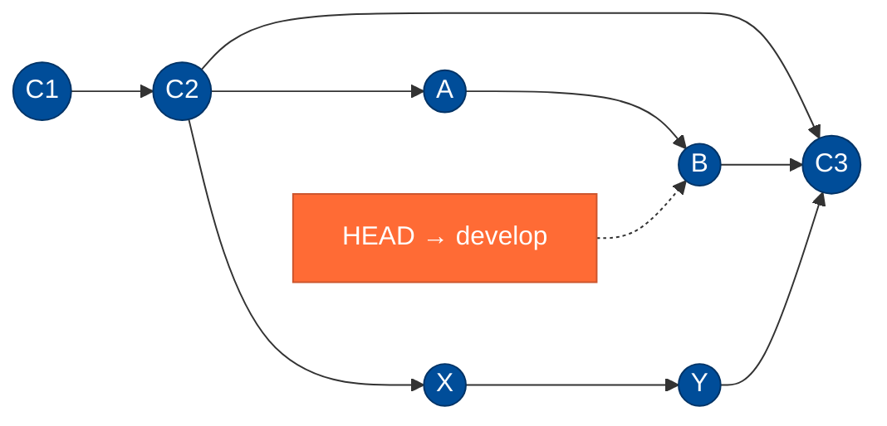
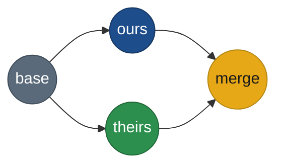
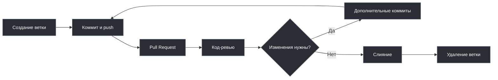
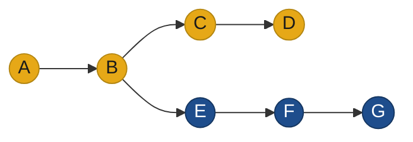
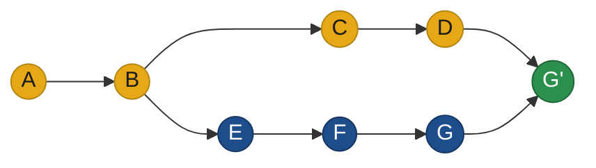
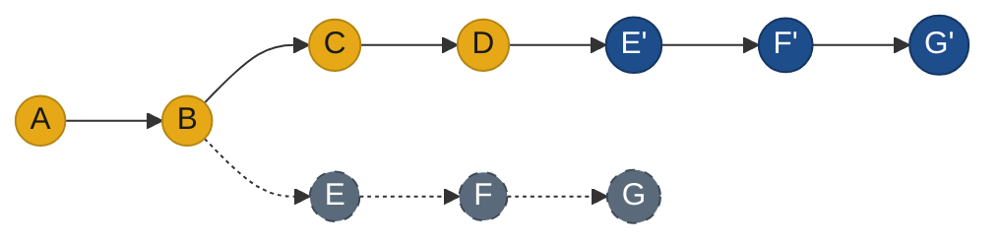

import ExternalPlayEmbed from '@site/src/components/ExternalPlayEmbed';


# Ветвление и слияние в Git

<div class="article-tags">
  <span class="tag tag-required">ОБЯЗАТЕЛЬНО</span>
  <span class="tag tag-beginner">ДЛЯ НОВИЧКОВ</span>
</div>

<span class="complexity-badge">Разработчику</span>
<span class="complexity-badge">Архитектору</span>
<span class="complexity-badge">Инженеру</span>

<div class="callout callout--tip">
  <div class="callout-title">Связь с разделом 8</div>

  <div class="callout-body">
  Здесь — **практика веток и запросов на слияние** для ежедневной разработки.

  Команды `branch`, `switch`/`checkout`, `merge`, `push` — в [12 команд на каждый день](./115#12-komand).

  Пошаговые примеры ветки для задания и разрешения конфликта merge — [лабораторная шпаргалка](/lab/Примеры/1123#ветка-фичи-для-задания-или-функции).

  Устройство репозитория, протоколы, packfile и расширенный набор команд — в [разделе 8.03 «Забота о коде и данных»](/encyclopedia/8-infra-security/8-03-zabota-o-kode-i-dannyh/intro) ([архитектура Git](/encyclopedia/8-infra-security/8-03-zabota-o-kode-i-dannyh/111), [GitFlow](/encyclopedia/8-infra-security/8-03-zabota-o-kode-i-dannyh/1111)).
</div>
  </div>


---

## Ветки и слияния

### Основы ветвистого хранения

Git использует *систему веток*, позволяющую работать над разными частями проекта параллельно, не мешая основной работе. Представим, что у нас есть стабильная версия - "чистовик". Разумеется, лучше не рисковать и не экспериментировать в ней, поэтому создадим новую ветку, в которой можем править код, делать коммиты, не влияя на основную версию проекта. Когда новая функция будет готова, можно *объединить (merge)* ветку новой фичи с основной веткой. И таких "дополнительных веток" может быть сколько угодно.

**Ветки** позволяют работать над несколькими задачами одновременно, изолировать экспериментальные изменения, легко тестировать и проверять новые идеи без риска сломать рабочую версию.

<ExternalPlayEmbed example="code-dev/git-branch-merge-play" title="Git — ветки и merge" minHeight={480} />


Переключение на определённую ветку называется **checkout** (в современном Git то же делают через **`git switch`** — см. [шпаргалку](./115#12-komand)). Ветка является просто последовательностью коммитов, поэтому переключаясь, мы сообщаем, что коммиты будут отправляться именно в эту ветку. На практике это работает так, что мы начинаем с какой-то определённой ветки, которую мы клонировали или создали. Потом мы можем создать ветку (клиенты позволяют выполнять checkout на новую ветку сразу после её создания), и переключиться на неё. После переключения на дополнительную ветку, все изменения будут учитываться для коммитов именно в неё, не трогая основную.

Git использует указатель на ветку - **HEAD**. 

Глянем визуально:



На схеме: `main` идёт C1→C2→C3; от C2 ответвляются `develop` (A→B) и `feature` (X→Y); обе линии сходятся в merge-коммите C3 на `main`. Оранжевый **HEAD** показывает, что сейчас вы на ветке `develop` (на коммите B).

Здесь можно увидеть последовательность коммитов в ветках *main*, *develop*, *feature*. Можно запутаться, не так ли? А веток может быть несколько тысяч! На схеме выше указаны коммиты как синие кружки. Активный HEAD (где мы сейчас) обозначен оранжевым узлом. Как можно заметить, коммиты связаны - поэтому важен полный контроль над состоянием системы. Если вы случайно отправите тестовые изменения на основную ветку - приложение может поломаться.

Ветку можно создать локально, а при отправке коммита ветка будет создана автоматически и на сервере. Тогда, к примеру, на GitHub будет выглядеть так:


На сервере, через специальный интерфейс, можно найти свой репозиторий, скопировать ссылку на него, изучить его ветки и увидеть коммиты, перейдя к ним.

Ветки могут удаляться, упорядочиваться в папки, переименовываться и сливаться друг с другом.

Ветка по умолчанию (Default) в новых репозиториях обычно называется `main` (в старых проектах ещё встречается `master`).

Удалённый репозиторий по умолчанию называется **origin** — это имя remote, а не ветка:

```bash
git push origin main
git fetch origin
git pull origin main
```


На любой репозиторий можно перейти по ссылке, и если он публичный, то авторизации не потребуется, однако приватный требует предоставления прав конкретным пользователям (в компании это выполняют администраторы).

Чтобы увидеть состояние файлов в репозитории, нужно выбрать ветку (сначала открывается Default), для этого можно использовать поиск по веткам.

Ветки могут получать свои теги, чтобы искать по ним, к примеру для багов один тег, для фич другой.

### Теги и версии проекта

**Тег** (*tag*) — символическое имя снимка репозитория: «состояние проекта на момент релиза». Номер ревизии (`r1234` в SVN) или хэш коммита (`a1b2c3d`) мало говорят о смысле изменений; тег `v2.3.1` связывает набор файлов с выпуском, который можно воспроизвести и передать заказчику. В Git тег указывает на конкретный коммит и **не меняется** — это основа **baseline** в [управлении конфигурацией](/encyclopedia/7-project/7-13-ekonomika-proizvodstva-po/3).

```bash
git tag v1.0.0
git push origin v1.0.0
```

---

## Слияния веток и конфликты

### Слияния

Три операции в VCS чаще всего приводят к **объединению** независимых правок:

1. **Обновление рабочей копии** (`git pull`, merge с `origin/main`) — чужие изменения вливаются в вашу локальную версию.
2. **Фиксация** (`git commit` после pull с расхождением) — ваши локальные правки сливаются с тем, что уже на сервере.
3. **Слияние веток** (`git merge feature`) — линии разработки сходятся в одну.

Во всех случаях схема одна: была **базовая** версия (общий предок), затем в «оригинале» и в «копии» правили независимо — система должна собрать итог **без потери данных**. Если правки только с одной стороны, достаточно перенести изменения. Если с обеих — включается алгоритм слияния.

Для **текстовых** файлов (исходный код) Git сравнивает строки построчно (как утилита `diff`): непересекающиеся изменения объединяются автоматически; одна и та же строка, изменённая дважды, даёт **конфликт**. **Бинарные** файлы (изображения, `.docx`, скомпилированные артефакты) автоматически не сливаются — нужен ручной выбор версии или **блокировка** файла на время правки (стратегия «заблокированного извлечения» в старых централизованных VCS; в Git блокировки на сервере нет, для дизайн-макетов иногда используют Git LFS и договорённости в команде).

**Merge** — команда для слияния веток: объединяет изменения дополнительной ветки с основной. Если Git не может однозначно слить пересекающиеся правки, возникает **конфликт слияния** — операция останавливается до решения разработчика (оставить свою версию, чужую или собрать комбинацию вручную).

<span id="trehstoronnee-sliyanie"></span>

### Fast-forward и трёхстороннее слияние

Git различает два частых исхода `git merge`:

| Тип | Когда срабатывает | Что видно в истории |
|-----|-------------------|---------------------|
| **Fast-forward** | Ваша ветка — прямой предок вливаемой (или наоборот при `pull`) | Новый merge-коммит **не** создаётся: указатель ветки просто «перепрыгивает» вперёд |
| **Трёхстороннее слияние** (*three-way merge*) | Обе ветки ушли от **общего предка** и обе получили свои коммиты | Появляется **merge-коммит** с **двумя родителями** |

При трёхстороннем слиянии Git сравнивает три снимка файла:

- **base** — общий предок (последний коммит, от которого разошлись ветки);
- **ours** — версия в **текущей** ветке (куда вливаем);
- **theirs** — версия из **вливаемой** ветки.

Непересекающиеся правки в разных строках объединяются автоматически. Если одна и та же строка изменена с двух сторон — нужен ручной выбор (см. [ниже](#решение-конфликтов)).



Тот же механизм работает при **`git pull`**, если на сервере и у вас разошлась история: `pull` делает `fetch`, затем merge (или rebase — по настройке). Сначала безопасно посмотреть новое с сервера — `git fetch`, затем осознанно влить — в [главе 112](./112#6-fetch-pull-i-push).

И разумеется, если рядовые программисты в компании будут сливать всё в основную ветку без контроля, то будет хаос, ведь код может содержать орфографические, стилистические, логические ошибки, не учитывать чужих изменений, противоречить стандартам проекта или нужно обсудить некоторые моменты перед слиянием. 

Для порядка используется специальный механизм - **pull request (пул-реквест, запрос на слияние)**, когда рядовые пользователи отправляют запрос на слияние своей ветки с основной веткой. Администратор, DevOps или старший программист изучает изменения на наличие проблем и конфликтов, а также проверяет корректность написания кода (код-ревью, code review) и оставляет свои замечания. После исправления замечаний, он принимает запрос, и только после этого происходит слияние.

```
Создание ветки → Коммит и пуш → Pull Request → Код-ревью → Слияние
```

---

### Pull request и merge request — одна идея, разные названия

**Pull request (PR)** в GitHub, **merge request (MR)** в GitLab, **pull request** в Azure DevOps и **pull request** в Bitbucket Cloud — это запись на сервере: «влейте ветку *источник* в ветку *назначение*». Сервер показывает diff, запускает проверки (CI), собирает обсуждение и ревью; кнопка «Merge» выполняет на сервере то же слияние, что вы делали бы локально командой `git merge` (иногда через squash или rebase — по политике репозитория).

**Мини-пример (один разработчик, ветка под задачу):**

1. Обновить базу и ответвиться от согласованной ветки (часто `main` или `develop`):

```bash
   git fetch origin
   git switch main && git pull
   git switch -c feature/TICKET-42-login-form
```

2. Сделать коммиты и отправить ветку на сервер:

```bash
   git push -u origin feature/TICKET-42-login-form
```

3. В веб-интерфейсе открыть **New pull request** (GitHub) или **New merge request** (GitLab), указать *base* (куда вливаем) и *compare* / *source* (что вливаем), добавить описание и ревьюеров.

4. После ревью и зелёных проверок — **Merge** на сервере; локально забрать результат:

```bash
   git switch main
   git pull
   git branch -d feature/TICKET-42-login-form   # локально, если ветка больше не нужна
```

Когда в команде несколько долгоживущих веток (`develop`, `release/*`, `hotfix/*`) и жёсткий релизный цикл — см. [модель GitFlow](/encyclopedia/8-infra-security/8-03-zabota-o-kode-i-dannyh/1111). Повседневные команды и параметры — в [командах Git для разработки](/encyclopedia/8-infra-security/8-03-zabota-o-kode-i-dannyh/114).



Во многих командах к code review добавляют автоматические проверки (сборка, тесты) перед слиянием PR — это часть практики CI/CD. Подробнее см. раздел [DevOps и CI/CD](/encyclopedia/8-infra-security/8-04-devops-ci-cd/intro); готовые workflow YAML — [GitHub Actions — CI/CD рецепты](/lab/Примеры/1134).

---

### Вклад в чужой репозиторий (форк)

На GitHub, GitLab и аналогах **форк** — копия репозитория в вашем аккаунте. Вы клонируете **свой** форк, а оригинал подключаете как `upstream`:

```bash
git clone git@github.com:ВАШ-ЛОГИН/project.git
cd project
git remote add upstream https://github.com/ОРИГИНАЛ/project.git
git fetch upstream
```

Перед новой задачей обновите базу из оригинала (`git merge upstream/main` или `git rebase upstream/main` — как принято в проекте), работайте в ветке `feature/...`, пушьте в **origin** (форк) и открывайте Pull Request в upstream. Пошаговые сценарии при ошибках — в [типовых ситуациях](/encyclopedia/4-code-dev/4-13-osnovy-raboty-s-git/1141#форк-и-синхронизация-с-upstream).

---

<span id="merge-i-rebase"></span>

### Git merge и git rebase — как объединяют ветки

Когда **main** ушла вперёд, а вы работаете в **feature**, интеграцию делают двумя способами. Оба переносят ваши правки к актуальной базе, но по-разному меняют **историю коммитов**.

#### Исходная картина

Типичная ситуация: общая ветка (`main`) содержит коммиты **A → B → C → D**; от **B** ответвилась feature с **E → F → G**. Пока вы писали фичу, в `main` появились **C** и **D**.



#### После git merge

`git merge main` (стоя на feature) или слияние feature в `main` через pull request создаёт **merge-коммит** с **двумя родителями**: один — конец `main` (**D**), второй — конец feature (**G**). Вся прошлая история **сохраняется** — видно, где ветки расходились и где сошлись.



На схеме **G'** — merge-коммит: он объединяет концы обеих линий, не удаляя коммиты **E**, **F**, **G**.

#### После git rebase

`git rebase main` **переписывает** коммиты feature: Git по очереди «проигрывает» патчи **E**, **F**, **G** поверх текущего конца `main` (**D**). Получаются **новые** коммиты **E'**, **F'**, **G'** с другими хешами; старые **E–G** остаются в `reflog`, но больше не входят в линию ветки. История на feature становится **линейной**: **A → B → C → D → E' → F' → G'**.



Rebase **не добавляет** merge-коммит — он **переносит** вашу работу на новую базу. Содержимое файлов в итоге то же, что после аккуратного merge, но граф коммитов другой.

<div class="callout callout--info">
  <div class="callout-title">Кратко</div>

  <div class="callout-body">
  **Merge** сохраняет полную картину ветвления и добавляет точку слияния. **Rebase** выстраивает коммиты в одну линию, как будто фичу начали от актуального `main`; история feature при этом пересоздаётся.
  </div>
</div>

#### Когда merge, когда rebase

| | **Merge** | **Rebase** |
|---|-----------|------------|
| История | Ветвление и merge-коммиты видны | Линейная цепочка на feature |
| Хеши ваших коммитов | Не меняются | Меняются (E → E', …) |
| Риск для команды | Ниже на shared-ветках | Переписывание опубликованной истории |
| Типичное применение | Слияние в `main`, общие ветки | Обновить **свою** feature перед PR |

На **общих** ветках (`main`, `develop`, `release/*`) историю обычно **не переписывают** — только merge (часто через PR на сервере). На **личной** feature перед ревью часто делают `git rebase origin/main`, чтобы ревьюеру было проще читать diff без лишних merge-коммитов. Политику фиксируют в [рекомендациях команды](./114); команды и флаги merge/rebase — в [шпаргалке](./115).

#### Команды при обновлении feature-ветки

Перед `push` feature-ветку обычно подтягивают к актуальному `main`:

| Способ | Команда (упрощённо) | История | Когда уместно |
|--------|---------------------|---------|----------------|
| **Merge** | `git merge origin/main` | Появляется merge-коммит | Команда не переписывает историю |
| **Rebase** | `git rebase origin/main` | Линейная цепочка ваших коммитов | Личная ветка, в команде принят rebase |

После **rebase** уже запушенной ветки на сервер уходит переписанная история — нужен `git push --force-with-lease` (только для **вашей** ветки и по правилам команды). Отменить неудачный rebase: `git rebase --abort`. Конфликты при rebase разрешают так же, как при merge (`add` → `git rebase --continue`). Карточки: [конфликт при rebase](/encyclopedia/4-code-dev/4-13-osnovy-raboty-s-git/1141#конфликт-при-rebase), [rebase без force push](/encyclopedia/4-code-dev/4-13-osnovy-raboty-s-git/1141#rebase-без-force-push-на-remote).

#### Этапы интерактивного rebase

На feature-ветке команда `git rebase main` по сути **переигрывает** ваши коммиты поверх актуального `main`. Удобно держать в голове цепочку:

1. Git находит общий предок feature и `main`.
2. Временно «снимает» ваши коммиты с ветки (рабочая копия приводится к состоянию `main`).
3. По одному применяет патчи ваших коммитов (появляются новые хеши **E'**, **F'**, …).
4. При конфликте останавливается — вы правите файлы, `git add`, `git rebase --continue` (или `--abort`).
5. В конце указатель feature указывает на линейную цепочку поверх `main`.

Подробные схемы merge и rebase — [выше](#merge-i-rebase).

<div class="callout callout--danger">
  <div class="callout-title">Золотое правило rebase</div>

  <div class="callout-body">
  **Не переписывайте историю веток, которыми уже пользуются другие** (`main`, `develop`, общая `release/*`).

  Rebase уместен на **личной** feature до merge.

  Если ветка уже на сервере и с неё работают коллеги — согласуйте force-push или используйте merge / `git revert`.

  Опасные команды — в [стоп-листе 8.03](/encyclopedia/8-infra-security/8-03-zabota-o-kode-i-dannyh/101).
</div>
  </div>


---

<span id="reshenie-konfliktov"></span>

### Решение конфликтов

**Конфликт слияния** — ситуация в системе контроля версий, при которой Git не может автоматически объединить изменения из двух разных веток. Такая ситуация возникает, когда в одной и той же строке одного файла были внесены разные правки в разных ветках или когда один участник редактирует файл, а другой удаляет его. Git останавливает процесс слияния и требует вмешательства пользователя для принятия окончательного решения о содержимом файла.

Автоматическое слияние работает без проблем, **если изменения затрагивают разные части кода** — разные строки, разные файлы или непересекающиеся блоки. 

Однако при пересечении изменений система теряет возможность однозначно определить, *какую версию сохранить*. В таких случаях Git помечает конфликтующие участки специальными маркерами и передаёт решение человеку.

Конфликты слияния появляются в следующих типичных сценариях:

- Два разработчика одновременно редактируют одну и ту же строку в одном файле в разных ветках.
- Один участник добавляет или изменяет содержимое файла, а другой удаляет этот файл полностью.
- Изменения касаются соседних строк, и алгоритм трёхстороннего слияния не может точно определить контекст.
- Происходит длительное параллельное развитие нескольких веток без регулярной синхронизации с основной веткой.

Чем дольше ветки развиваются независимо, тем выше вероятность появления сложных конфликтов. Регулярная интеграция изменений из основной ветки в рабочие ветки снижает риск возникновения трудноразрешимых ситуаций.


Когда Git обнаруживает конфликт, он вставляет в файл специальные маркеры:

```
<<<<<<< HEAD
Ваша версия (текущая ветка)
=======
Версия из вливаемой ветки
>>>>>>> имя-ветки
```

Фрагмент между `&lt;&lt;&lt;&lt;&lt;&lt;< HEAD` и `=======` представляет текущее состояние файла в активной ветке. Часть между `=======` и `&gt;&gt;&gt;&gt;&gt;&gt;> имя-ветки` содержит изменения из ветки, которую пытаются влить. Эти маркеры остаются в файле до тех пор, пока пользователь не отредактирует содержимое и не удалит их вручную.


Git не принимает решение за пользователя. Он лишь указывает на точки несовместимости и ожидает осознанного выбора: оставить изменения из текущей ветки, принять изменения из целевой ветки или создать новую комбинацию, объединяющую оба варианта.

**Разрешение в терминале (кратко):**

```bash
git merge feature/login    # при конфликте Git остановится
# правим файлы — удаляем маркеры <<<<<<<, =======, >>>>>>>
git add path/to/file.txt
git commit                 # завершить merge
# отменить начатый merge —
git merge --abort
```

Любой конфликт слияния требует внимательного изучения и ручного разрешения. Автоматическое принятие одной из сторон почти всегда приводит к потере важных изменений или нарушению логики программы. Эффективное разрешение конфликта включает несколько этапов:

1. **Анализ контекста** — понимание, зачем были внесены изменения в обеих ветках.
2. **Оценка последствий** — определение, какие изменения критичны для функциональности.
3. **Консультация с авторами** — если изменения внесены разными людьми, важно связаться с автором чужой ветки для уточнения намерений.
4. **Создание корректного финального состояния** — ручное редактирование файла с учётом всех требований.
5. **Тестирование результата** — проверка работоспособности кода после разрешения конфликта.

Мерж должен делать тот, кто модифицировал код. Если политики доступа запрещают разработчикам выполнять слияние, используются альтернативные подходы: перебазирование (`rebase`) или выборочное применение коммитов (`cherry-pick`).

Если конфликт слишком сложен для немедленного разрешения, отмените слияние:

```bash
git merge --abort
```

Ветка и рабочая копия вернутся к состоянию до `git merge`.

Отмена слияния не влияет на историю коммитов и не приводит к потере данных. Она просто сбрасывает рабочую директорию и индекс в состояние до начала операции `merge`.


Хотя разрешение конфликтов возможно через любой текстовый редактор, специализированные инструменты значительно упрощают процесс:

- **Графические клиенты Git** — GitHub Desktop, Sourcetree, Fork и другие предоставляют визуальные панели сравнения, позволяющие одним кликом выбрать нужную версию или объединить фрагменты.
- **Интегрированные среды разработки** — Visual Studio, IntelliJ IDEA, VS Code включают встроенные средства разрешения конфликтов с подсветкой различий и удобным интерфейсом выбора.
- **Специализированные мерж-тулы** — KDiff3, Meld, P4Merge показывают три версии файла одновременно: базовую (общего предка), текущую и входящую, что помогает точнее понять природу изменений.

Эти инструменты не принимают решение вместо пользователя, но делают процесс анализа и выбора максимально наглядным и безопасным.


Для конфликтов, вызванных конкурирующими изменениями в строках, GitHub предоставляет встроенный редактор конфликтов прямо в интерфейсе запроса на вытягивание. Пользователь может просмотреть конфликтующие участки, выбрать нужные фрагменты и создать коммит разрешения без выхода в локальную среду.

Если конфликт связан с удалением файлов или другими нетривиальными случаями, разрешение необходимо выполнять локально. После исправления конфликта изменения отправляются в ветку, и GitHub автоматически разблокирует кнопку слияния.

Ошибки при разрешении конфликтов особенно опасны, потому что:

- Слияние имеет несколько родительских коммитов, и история изменений становится сложной для анализа.
- Отмена неудачного слияния требует дополнительных операций и может повлечь потерю данных.
- Конфликты часто возникают при работе с чужим кодом, и разработчик может не знать контекста чужих изменений.

Поэтому время, потраченное на изучение процесса слияния и освоение инструментов разрешения конфликтов, окупается многократно. Тщательный подход к каждому конфликту предотвращает регрессии, сохраняет целостность кодовой базы и укрепляет доверие внутри команды.


---
