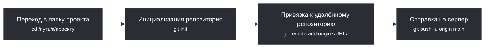
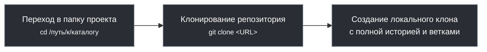
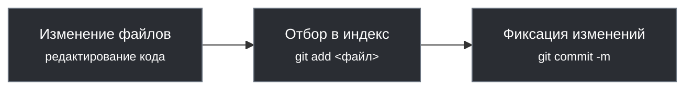
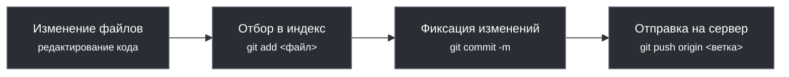

# Рекомендации по использованию Git в команде

<div class="article-tags">
  <span class="tag tag-required">ОБЯЗАТЕЛЬНО</span>
  <span class="tag tag-beginner">ДЛЯ НОВИЧКОВ</span>
</div>

<span class="complexity-badge">Разработчику</span>
<span class="complexity-badge">Архитектору</span>
<span class="complexity-badge">Инженеру</span>


## Основные рекомендации

### Создание

Чтобы создать свой новый репозиторий, нужно его инициализировать, запустим `git init` в папке - тогда будет создана папка `.git` со всеми служебными данными.

Создание репозитория (с нуля):
```
Переход в папку → Инициализация репозитория → Отправка на сервер
```


### Несколько репозиториев

Чтобы работать с удалённым репозиторием, нужно зарегистрироваться на площадке - для личной разработки лучше пользоваться GitHub, регистрация там простая, есть свой клиент с удобным графическим интерфейсом, а также интеграция с различными IDE.

### Аутентификация

Рабочие, корпоративные сервера устанавливают и настривают свои репозитории и хранилища, на базе GitLab, Azure и прочих инструментов. При устройстве на работу разработчикам, как правило, предоставляется доступ к такому репозиторию с правами на клонирование, создание своих веток и изменение в них.

Система аутентификации включает в себя логин/пароль, SSH-ключи (для общения без постоянного ввода логина и пароля) и токены (PAT - Personal Access Tokens).

### Клонирование

Чтобы приступить к работе с готовым репозиторием, его нужно клонировать себе, скопировав HTTPS или SSH ссылку и выполнив команду `git clone` `<ссылка>`. Если это рабочий репозиторий или приватный, Git потребует указать данные для входа, иначе будет ошибка авторизации. Если репозиторий открытый (публичный), то после выполнения команды просто начнутся копироваться файлы.

Клонирование готового репозитория:
```
Переход в папку → Клонирование репозитория → Создание локального клона
```


### .git

После инициализации или клонирования репозитория, создаётся скрытая папка .git, которая и будет содержать в себе всё, что нужно для работы программы. Это служебная папка, потому она и скрыта. Если вы хотите переместить или скопировать папку с репозиторием в другом месте (например, на другой диск) с сохранением всех свойств и связей Git, то важно не забыть скопировать и эту скрытую папку .git.


В проекте могут быть файлы, которые нежелательны для публикации, к примеру, содержащие пароли, ключи, токены или служебные лишние данные. Такие файлы и папки можно отдельно указать как игнорируемые, добавив их в список в файле .gitignore, который создаётся в корне рабочего каталога.


Чтобы начать работу в репозитории, можно открыть Git Bash или открыть командную строку в рабочем каталоге. Клиенты с графическим интерфейсом позволяют выбрать папку (открыть репозиторий). Любой клиент Git будет искать в текущей папке соответствующий подкаталог .git и читать всё, что там есть.

### PULL

Перед началом работы по внесению изменений всегда нужно выполнять pull, чтобы скачать последние изменения файлов в папке.
Получение свежих изменений (сделанных другими):
```
Переход в папку → Пул (pull) → Обновление файлов
```


### Локальность изменений

Когда изменения производятся в репозитории, они всегда сначала сохраняются в локальном репозитории и не передаются сразу в удалённый. То есть, можно работать с множеством изменений и коммитов локально, потом приводить всё в порядок и только потом отправлять в удалённый репозиторий.

Локальное сохранение изменений:
```
Изменение → Отбор в индекс → Коммит
```

Индекс является промежуточной зоной, которая используется для того, чтобы Git учёл изменения. Добавляя в индекс, мы как бы отмечаем, что «эти изменения важные, фиксирую». Если же изменения нас не устраивают (к примеру, ошибочные или генерированные), то мы можем отменять их, возвращая исходное состояние файлов. Это и есть процесса отбора изменений в индекс (staging).

После того, как мы убедились, что изменения достойны отправки в удалённый репозиторий, нужно выполнять команду push, чтобы коммит отправился на сервер. Только в таком случае другие пользователи увидят изменения.

Отправка изменений на сервер:
```
Изменение → Отбор в индекс → Коммит → Пуш (push)
```


### Удаление

Если файлы удаляются при подгрузке изменений, то они удаляются не в корзину. Восстановить их можно только через механизмы Git, к примеру, отменив коммит или вернув файл физически. Если вы удалили файл, который был в удалённом репозитории, и отправите свой «снимок» через push, то этот файл удалится для всех. Если так случилось, и произойдёт revert (отмена) или reset (сброс) до определённого состояния (до удаления), тогда файл будет восстановлен ровно в том же исходном виде. Удалённые файлы тоже нужно добавлять в индекс.
```
Удалённые данные традиционно красные, а добавленные - зелёные.
```

### Ветки

Чтобы не испортить всем разработку, используется подход с ветками. Имеется единая ветка main или master с готовым рабочим продуктом, ветка develop (или какая-то иная) для разработки, и для каждой правки, функции, задачи создаются дополнительные ветки, которые хранят свои соответствующие изменения. Потом все эти изменения из веток сливаются в единую ветку разработки (develop), которая тестируется и после успешных испытаний сливается в main, как готовый релизный продукт.

### Информация в коммите

Каждый коммит включает в себя следующую информацию:
	- снимок всех отслеживаемых файлов в репозитории на момент фиксации;
	- ссылка на родительский коммит;
	- сообщение, описывающее изменения в коммите.

**Как писать сообщение:** первая строка — кратко, что сделано («Добавить валидацию email»), без точки в конце; при необходимости пустая строка и тело — зачем и что затронуто. Плохие примеры: `fix`, `update`, `asdf`. Хороший: `Исправить падение формы при пустом поле email`.

### Файл `.gitignore`

В корне проекта создаётся `.gitignore` — список путей, которые Git **не предлагает** добавлять в коммит (сборки, кэш IDE, секреты). Типичные строки: `node_modules/`, `*.log`, `.env`. Шаблон для секретов — `.env.example` без паролей. Если файл уже попал в индекс, его нужно убрать из отслеживания: `git rm --cached .env`, затем закоммитить.

---

## Восстановление данных

Самая страшная ситуация для новичка — это всё когда его действиями всё испорчено. Что-то удалил, изменил, затёр изменения, или вызвал ошибку. Разумеется, тут как повезёт, может быть, коллеги просто поддержат и помогут решить проблему, а может быть, придётся выслушать много очень нехороших слов в свой адрес, а то и вовсе это рабочее место станет последним в IT. Страшно?

Представим себе ситуацию, когда мы усердствовали над кодом, сделали пару коммитов, отправили их на удалённый репозиторий, а потом поняли, что всё это было зря, ведь работа велась не в той ветке, отправили лишнее или вообще случайно удалили файл. Что делать?

Вот для таких ситуаций нужно помнить, что Git не просто система контроля, но и архив изменений, который позволяется откатываться назад, восстанавливать и исправлять ошибки, даже если они уже были отправлены.

---

### Выбор нужной ветки и клонирование/вытягивание

Перед тем как восстанавливать данные, важно убедиться, что мы работаем с правильной веткой. Чтобы проверить, какие ветки есть локально и удалённо, нужно выполнить команду «git branch -a» или изучить внимательно интерфейс графического клиента. Если нужная ветка ещё не загружена, но существует на сервере, её можно привязать к удалённой ветке:
```
git checkout -b имя_ветки origin/имя_ветки
```
Не стесняйтесь в начале работы уточнять у коллег, в какой ветке работать, как вообще принято работать с Git в компании. Лучше сначала задать глупые вопросы, чем потом подвергать всех рискам.

Как только убедились в нужной ветке, нужно всегда сначала получить все последние изменения из основной ветки (куда все разработчики всё «сливают»), и слить основную ветку в свою. Не свою в основную, а именно в нашу, рабочую. 

Это работает так:

Вася и Петя получили задачи с утра и приступили. Вася в обед уже закончил, запушил и слил изменения с основной веткой. Петя приступил к работе с утра, но закончил вечером, однако, когда он запушил свои изменения, он не учёл изменения Васи и они были удалены.

Чтобы такого не было, Петя перед push должен был **подтянуть свежий `main` в свою ветку** и разрешить конфликты локально:

```bash
git fetch origin
git switch feature-petya
git merge origin/main
# или: git rebase origin/main
git push origin feature-petya
```

Тогда изменения Васи попадут в историю Пети до отправки на сервер. Перед коммитом полезно смотреть `git status` и `git diff --staged`: нет ли случайных удалений чужих файлов.

---

### Отмена коммита

Бывает, что когда мы делаем коммит и пушим его, потом понимаем «Ой, забыл добавить один файл» или «Упс, закоммитил что-то лишнее».
Если коммит ещё не был отправлен (локальный), то можно просто отредактировать коммит. В консоли это «git commit --amend», изменение последнего коммита.

Если коммит уже был отправлен, то можно сделать откат на один коммит - «git revert HEAD», это создаёт новый коммит, который отменяет изменения предыдущего. Это безопасный способ, потому что он не перезаписывает историю, и его можно использовать даже в общих ветках.

HEAD — это указатель на текущий коммит (обычно последний коммит текущей ветки), словно Git сообщает «Я сейчас здесь». Поэтому, при переключении между ветками, HEAD указывает на последний коммит другой ветки.

**Detached HEAD** — состояние, когда `HEAD` указывает **на коммит напрямую**, а не на ветку (например, после `git switch --detach abc1234` или просмотра старого коммита). Новые коммиты в этом режиме не продвигают ни одну ветку; если переключиться на другую ветку без сохранения, они могут стать недоступными. Чтобы зафиксировать работу: `git switch -c temp-fix` (создать ветку от текущего коммита). Вернуться на ветку: `git switch main`.

Проверить, куда указывает `HEAD`:

```bash
git rev-parse HEAD
cat .git/HEAD
```

Команда `git reset --soft HEAD~1` перемещает ветку на один коммит назад, но сохраняет изменения в индексе.

Команда `git reset --hard HEAD~1` отменяет последний коммит **и** сбрасывает рабочую копию — несохранённые правки будут потеряны.

Команда `git restore --source=HEAD~2 -- file.txt` (или `git checkout HEAD~2 -- file.txt`) восстанавливает версию файла из коммита двумя шагами назад.

Самый простой способ выйти из detached HEAD — переключиться на ветку: `git switch main`.

---

### Восстановление файла из конкретного коммита

Представим, что мы случайно удалили файл или внесли изменения, которые всё сломали, но мы знаем, что в каком-то старом коммите файл был рабочим.

Сначала нужно посмотреть историю коммитов (в консоли git log), найти хэш нужного коммита (например, abc1234), и восстановить файл из этого коммита:
```
git checkout abc1234 -- путь/к/файлу
```
Это скопирует файл из указанного коммита в рабочий каталог и мы сможем его просмотреть или закоммитить как исправление.

Если же вручную «вернуть» файл в директорию без использования инструментов Git, то это учтётся как новые изменения для текущей ветки, и потребуется новый коммит и пуш.

---

### Восстановление удалённых коммитов

Иногда бывает, что коммиты удаляются, используя reset, или ветка удаляется вовсе. Но Git сразу не удаляет данные, он лишь делает их недоступными через обычные команды. Чтобы найти потерянные коммиты, нужно использовать git reflog. Это журнал всех действий, которые мы выполняли в Git. Можно так найти нужный коммит, и создать новую ветку, начиная с этого коммита через хэш, либо можно просто вернуть файл из коммита по способу выше.

---


## Практика


Хотите попрактиковаться?

Поскольку код мы уже изучили и вы наверняка что-то написали для себя, попробуйте установить себе Git, создать репозиторий на GitHub и залить свой проект, потом клонировать его, что-то изменить и закоммитить в новой ветке.

Кроме такой практики, есть возможность использовать классные тренажёры, например LearnGitBranching:

https://learngitbranching.js.org/?locale=ru_RU

Рекомендую попробовать, это своего рода песочница, где можно использовать команды, решать задачки и ознакомиться с возможностями Git.

Для удобства, даже сделаем шпаргалку:

| Команда | Описание |
|-----|---------|
|git init	|Инициализирует новый репозиторий Git в текущем каталоге.
|git push	|Отправляет локальные изменения в удалённый репозиторий.
|git branch	|Список веток; `git branch имя` — создать ветку (переключение: `git switch имя`).
|git merge	|Сливает указанную ветку в текущую ветку.
|git add	|Подготавливает изменения в текущем каталоге и подкаталогах.
|git pull	|Извлекает изменения из удалённого репозитория и объединяет их с локальным репозиторием.
|git fetch	|Извлекает последние данные из удалённого репозитория, но не интегрирует их в рабочие файлы.
|git status	|Отображает состояние репозитория, включая любые несохранённые изменения.
|git commit	|Сохраняет подготовленные изменения с сообщением о коммите.
|git remote	|Добавляет удалённый репозиторий, просматривает его и переименовывает.
|git checkout	|Переключается на указанную ветку.
|git reset	|Сбрасывает текущую ветку до указанного коммита.

На практике проще использовать чит-листы, к примеру такой:

https://cheatsheets.zip/git

Git принёс мне много боли, заставляя ошибаться вновь и вновь, поэтому я желаю вам успехов в изучении этой технологии!

---
