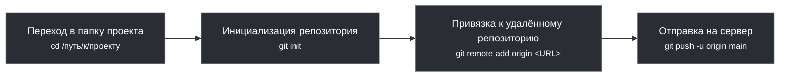
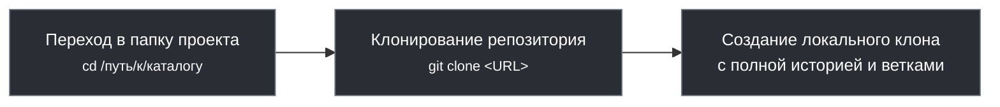
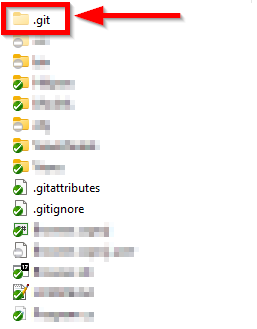
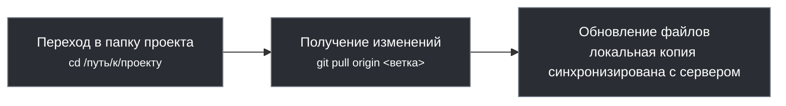
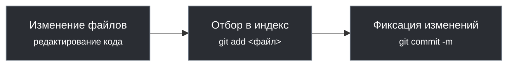
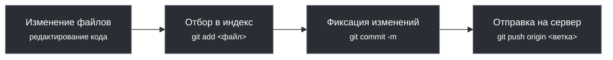

# Рекомендации по использованию Git в команде

<div class="article-tags">
  <span class="tag tag-required">ОБЯЗАТЕЛЬНО</span>
  <span class="tag tag-beginner">ДЛЯ НОВИЧКОВ</span>
</div>

<span class="complexity-badge">Разработчику</span>
<span class="complexity-badge">Архитектору</span>
<span class="complexity-badge">Инженеру</span>


---

## Основные рекомендации

### Создание

Чтобы создать новый репозиторий, инициализируйте Git в каталоге проекта:

```bash
git init
```

Будет создана папка `.git` со служебными данными. Остальные команды ежедневного цикла — в [12 команд на каждый день](./115#12-komand). Сценарии `init` → push и ветка под задачу с разбором строк — [лаборатория Git](/lab/Примеры/1123).

Создание репозитория (с нуля):
```
Переход в папку → Инициализация репозитория → Отправка на сервер
```


---

### Несколько репозиториев

Чтобы работать с удалённым репозиторием, нужно зарегистрироваться на площадке - для личной разработки лучше пользоваться GitHub, регистрация там простая, есть свой клиент с удобным графическим интерфейсом, а также интеграция с различными IDE.

---

### Аутентификация

Рабочие, корпоративные сервера устанавливают и настривают свои репозитории и хранилища, на базе GitLab, Azure и прочих инструментов. При устройстве на работу разработчикам, как правило, предоставляется доступ к такому репозиторию с правами на клонирование, создание своих веток и изменение в них.

Система аутентификации включает в себя логин/пароль, SSH-ключи (для общения без постоянного ввода логина и пароля) и токены (PAT - Personal Access Tokens).

---

### Клонирование

Скопируйте HTTPS или SSH URL репозитория и клонируйте:

```bash
git clone <URL>
```

Для приватного репозитория Git запросит учётные данные; для публичного файлы начнут копироваться сразу.

Клонирование готового репозитория:
```
Переход в папку → Клонирование репозитория → Создание локального клона
```


---

### .git

После инициализации или клонирования репозитория, создаётся скрытая папка .git, которая и будет содержать в себе всё, что нужно для работы программы. Это служебная папка, потому она и скрыта. Если вы хотите переместить или скопировать папку с репозиторием в другом месте (например, на другой диск) с сохранением всех свойств и связей Git, то важно не забыть скопировать и эту скрытую папку .git.



В проекте могут быть файлы, которые нежелательны для публикации, к примеру, содержащие пароли, ключи, токены или служебные лишние данные. Такие файлы и папки можно отдельно указать как игнорируемые, добавив их в список в файле .gitignore, который создаётся в корне рабочего каталога.


Чтобы начать работу в репозитории, можно открыть Git Bash или открыть командную строку в рабочем каталоге. Клиенты с графическим интерфейсом позволяют выбрать папку (открыть репозиторий). Любой клиент Git будет искать в текущей папке соответствующий подкаталог .git и читать всё, что там есть.

---

### PULL

<div class="callout callout--info">
  <div class="callout-title">Где это в общей схеме Git</div>

  <div class="callout-body">
  <p><code>pull</code> тянет изменения с удалённого репозитория до рабочей папки; <code>push</code> отправляет локальные коммиты на сервер. Четыре уровня и все стрелки — в <a href="/encyclopedia/4-code-dev/4-13-osnovy-raboty-s-git/112#git-workflow-chain">главе про ежедневный workflow</a>.</p>
</div>
  </div>


Перед началом работы подтяните свежие изменения:

```bash
git pull origin main
```
Получение свежих изменений (сделанных другими):
```
Переход в папку → Пул (pull) → Обновление файлов
```


---

### Локальность изменений

Когда изменения производятся в репозитории, они всегда сначала сохраняются в локальном репозитории и не передаются сразу в удалённый. То есть, можно работать с множеством изменений и коммитов локально, потом приводить всё в порядок и только потом отправлять в удалённый репозиторий.

Локальное сохранение изменений:
```
Изменение → Отбор в индекс → Коммит
```

Индекс является промежуточной зоной, которая используется для того, чтобы Git учёл изменения. Добавляя в индекс, мы как бы отмечаем, что "эти изменения важные, фиксирую". Если же изменения нас не устраивают (к примеру, ошибочные или генерированные), то мы можем отменять их, возвращая исходное состояние файлов. Это и есть процесса отбора изменений в индекс (staging).

После того, как мы убедились, что изменения достойны отправки в удалённый репозиторий, нужно выполнять команду push, чтобы коммит отправился на сервер. Только в таком случае другие пользователи увидят изменения.

Отправка изменений на сервер:
```
Изменение → Отбор в индекс → Коммит → Пуш (push)
```


---

### Удаление

Если файлы удаляются при подгрузке изменений, то они удаляются не в корзину. Восстановить их можно только через механизмы Git, к примеру, отменив коммит или вернув файл физически. Если вы удалили файл, который был в удалённом репозитории, и отправите свой "снимок" через push, то этот файл удалится для всех. Если так случилось, и произойдёт revert (отмена) или reset (сброс) до определённого состояния (до удаления), тогда файл будет восстановлен ровно в том же исходном виде. Удалённые файлы тоже нужно добавлять в индекс.
```
Удалённые данные традиционно красные, а добавленные - зелёные.
```

---

### Ветки

Чтобы не испортить всем разработку, используется подход с ветками. Имеется единая ветка main или master с готовым рабочим продуктом, ветка develop (или какая-то иная) для разработки, и для каждой правки, функции, задачи создаются дополнительные ветки, которые хранят свои соответствующие изменения. Потом все эти изменения из веток сливаются в единую ветку разработки (develop), которая тестируется и после успешных испытаний сливается в main, как готовый релизный продукт.

Практика командной линии, **pull request / merge request**, конфликты и форки — в отдельной статье [Ветвление и слияние в Git](/encyclopedia/4-code-dev/4-13-osnovy-raboty-s-git/113). Если в компании закреплены долгоживущие ветки `release/*`, `hotfix/*` и строгий релизный процесс — см. [модель GitFlow](/encyclopedia/8-infra-security/8-03-zabota-o-kode-i-dannyh/1111) и обзор [архитектуры Git](/encyclopedia/8-infra-security/8-03-zabota-o-kode-i-dannyh/111) в разделе 8.03.

Общие принципы VCS, которые стоит закрепить в регламенте команды:

1. Тестовые и демо-сборки — **только из репозитория** (не из незакоммиченных локальных правок).
2. **`main` всегда собирается**; незавершённое — в feature-ветках.
3. Крупные задачи — отдельная ветка, merge после ревью.
4. Релизы — **тег** (`v2.3.1`); baseline для поставки не переписывают.

**Теги** связывают коммит с версией продукта для заказчика и CI — см. также [управление конфигурацией](/encyclopedia/7-project/7-13-ekonomika-proizvodstva-po/3).

---

### Информация в коммите

Каждый коммит включает в себя следующую информацию:
	- снимок всех отслеживаемых файлов в репозитории на момент фиксации;
	- ссылка на родительский коммит;
	- сообщение, описывающее изменения в коммите.

**Как писать сообщение:** первая строка — кратко, что сделано ("Добавить валидацию email"), без точки в конце; при необходимости пустая строка и тело — зачем и что затронуто. Плохие примеры: `fix`, `update`, `asdf`. Хороший: `Исправить падение формы при пустом поле email`.

---

### Файл `.gitignore`

Подробный разбор синтаксиса, обязательных паттернов и шаблонов под разные языки — в отдельной статье: [`.gitignore` — полное руководство](/encyclopedia/4-code-dev/4-13-osnovy-raboty-s-git/116). Кратко: файл в корне проекта; типичные строки — `node_modules/`, `*.log`, `.env`; шаблон для секретов — `.env.example`. Если файл уже попал в индекс: `git rm --cached .env`, затем закоммитить.

---

## Восстановление данных

Ошибки с Git случаются у всех: неверная ветка, лишний коммит, жёсткий сброс, отклонённый `push`. Git хранит историю и локальный журнал `reflog`, поэтому в большинстве случаев состояние можно вернуть — особенно если действовать по шагам, а не нажимать подряд "опасные" команды.

<div class="callout callout--warning">
  <div class="callout-title">Опасные команды Git</div>

  <div class="callout-body">
  <p>После ошибки — сначала <code>git reflog</code>, без подряд <code>gc --prune</code>. Что ломает историю и как не усугубить — <a href="/encyclopedia/8-infra-security/8-03-zabota-o-kode-i-dannyh/101">Опасные скрипты</a>.</p>
</div>
  </div>


**Полный справочник по симптомам** (десятки сценариев с командами и зонами риска): [Типовые ситуации с Git](/encyclopedia/4-code-dev/4-13-osnovy-raboty-s-git/1141). Ниже — базовые приёмы, которые стоит знать до углубления.

Перед любым исправлением:

```bash
git status
git log --oneline -10
# если "пропало" после reset / удаления ветки —
git reflog -20
```

---

### Выбор нужной ветки и клонирование/вытягивание

Перед тем как восстанавливать данные, важно убедиться, что мы работаем с правильной веткой. Список веток (локальных и удалённых) или графический клиент:

```bash
git branch -a
```

Если нужная ветка есть на сервере, но ещё не локально:

```bash
git switch -c имя_ветки origin/имя_ветки
```
Не стесняйтесь в начале работы уточнять у коллег, в какой ветке работать, как вообще принято работать с Git в компании. Лучше сначала задать глупые вопросы, чем потом подвергать всех рискам.

Как только убедились в нужной ветке, нужно всегда сначала получить все последние изменения из основной ветки (куда все разработчики всё "сливают"), и слить основную ветку в свою. Не свою в основную, а именно в нашу, рабочую. 

Это работает так:

Вася и Петя получили задачи с утра и приступили. Вася в обед уже закончил, запушил и слил изменения с основной веткой. Петя приступил к работе с утра, но закончил вечером, однако, когда он запушил свои изменения, он не учёл изменения Васи и они были удалены.

Чтобы такого не было, Петя перед push должен был **подтянуть свежий `main` в свою ветку** и разрешить конфликты локально:

```bash
git fetch origin
git switch feature-petya
git merge origin/main
# или — git rebase origin/main
git push origin feature-petya
```

Тогда изменения Васи попадут в историю Пети до отправки на сервер. Перед коммитом:

```bash
git status
git diff --staged
```

---

### Отмена коммита

Бывает, что после коммита понимают "забыл добавить файл" или "закоммитил лишнее".

Локальный коммит (ещё не отправлен):

```bash
git add забытый-файл.ts
git commit --amend --no-edit    # дописать файл без смены сообщения
# или — git commit --amend       # изменить и сообщение
```

Уже отправлен на **общую** ветку (`main`, `develop`) — безопасный откат новым коммитом:

```bash
git revert HEAD
git push origin main
```

На **своей** feature после `amend` / `rebase` может понадобиться `git push --force-with-lease` — см. [карточку про отклонённый push](/encyclopedia/4-code-dev/4-13-osnovy-raboty-s-git/1141#push-отклонён-non-fast-forward).

HEAD — это указатель на текущий коммит (обычно последний коммит текущей ветки), словно Git сообщает "Я сейчас здесь". Поэтому, при переключении между ветками, HEAD указывает на последний коммит другой ветки.

**Detached HEAD** — состояние, когда `HEAD` указывает **на коммит напрямую**, а не на ветку (например, после `git switch --detach abc1234` или просмотра старого коммита). Новые коммиты в этом режиме не продвигают ни одну ветку; если переключиться на другую ветку без сохранения, они могут стать недоступными. Чтобы зафиксировать работу: `git switch -c temp-fix` (создать ветку от текущего коммита). Вернуться на ветку: `git switch main`.

Проверить, куда указывает `HEAD`:

```bash
git rev-parse HEAD
cat .git/HEAD
```

Отмена последнего коммита:

```bash
git reset --soft HEAD~1
git reset --hard HEAD~1
```

Восстановление файла из более раннего коммита:

```bash
git restore --source=HEAD~2 -- file.txt
```

Самый простой способ выйти из detached HEAD:

```bash
git switch main
```

---

### Восстановление файла из конкретного коммита

Представим, что мы случайно удалили файл или внесли изменения, которые всё сломали, но мы знаем, что в каком-то старом коммите файл был рабочим.

Сначала посмотрите историю и восстановите файл из нужного коммита:

```bash
git log --oneline -- путь/к/файлу
git restore --source=abc1234 -- путь/к/файлу
git add путь/к/файлу
git commit -m "Восстановить файл из abc1234"
```
Это скопирует файл из указанного коммита в рабочий каталог и мы сможем его просмотреть или закоммитить как исправление.

Если же вручную "вернуть" файл в директорию без использования инструментов Git, то это учтётся как новые изменения для текущей ветки, и потребуется новый коммит и пуш.

---

### Восстановление удалённых коммитов

После `git reset --hard` или случайного удаления ветки коммиты часто видны в `reflog`:

```bash
git reflog
# пример строки — e4f5g6h HEAD@{1}: commit: Важная работа
git reset --hard e4f5g6h
# или — git branch recovery e4f5g6h && git switch recovery
```

`reflog` хранится **только на этом клоне**; после нового `git clone` старых записей не будет.

---

### Push отклонён

Если `git push` пишет `non-fast-forward`, на сервере есть коммиты, которых нет у вас. Сначала `git fetch origin`, затем `merge` или `rebase` с `origin/ваша-ветка`, потом снова `push`. Подробно — в [типовых ситуациях](/encyclopedia/4-code-dev/4-13-osnovy-raboty-s-git/1141#push-отклонён-non-fast-forward).

---

## Практика


Хотите попрактиковаться?

Поскольку код мы уже изучили и вы наверняка что-то написали для себя, попробуйте установить себе Git, создать репозиторий на GitHub и залить свой проект, потом клонировать его, что-то изменить и закоммитить в новой ветке.

Кроме такой практики, есть возможность использовать классные тренажёры, например LearnGitBranching:

https://learngitbranching.js.org/?locale=ru_RU

Рекомендую попробовать, это своего рода песочница, где можно использовать команды, решать задачки и ознакомиться с возможностями Git.

Для удобства, даже сделаем шпаргалку:

| Команда | Описание |
|-----|---------|
|git init	|Инициализирует новый репозиторий Git в текущем каталоге.
|git push	|Отправляет локальные изменения в удалённый репозиторий.
|git branch	|Список веток; `git branch имя` — создать ветку (переключение: `git switch имя`).
|git merge	|Сливает указанную ветку в текущую ветку.
|git add	|Подготавливает изменения в текущем каталоге и подкаталогах.
|git pull	|Извлекает изменения из удалённого репозитория и объединяет их с локальным репозиторием.
|git fetch	|Извлекает последние данные из удалённого репозитория, но не интегрирует их в рабочие файлы.
|git status	|Отображает состояние репозитория, включая любые несохранённые изменения.
|git commit	|Сохраняет подготовленные изменения с сообщением о коммите.
|git remote	|Добавляет удалённый репозиторий, просматривает его и переименовывает.
|git checkout	|Переключается на указанную ветку.
|git reset	|Сбрасывает текущую ветку до указанного коммита.

На практике проще использовать чит-листы, к примеру такой:

https://cheatsheets.zip/git

Git принёс мне много боли, заставляя ошибаться вновь и вновь, поэтому я желаю вам успехов в изучении этой технологии!

---

{/* http-basics-link  */}
<div class="callout callout--tip">
  <div class="callout-title">Основа по протоколу</div>

  <div class="callout-body">
  Базовый разбор HTTP и HTTPS находится в отдельной статье — [HTTP как основа веб-интеграций](/encyclopedia/2-system-network/2-09-osnovy-integratsionnogo-vzaimodeystviya/118).
</div>
  </div>


