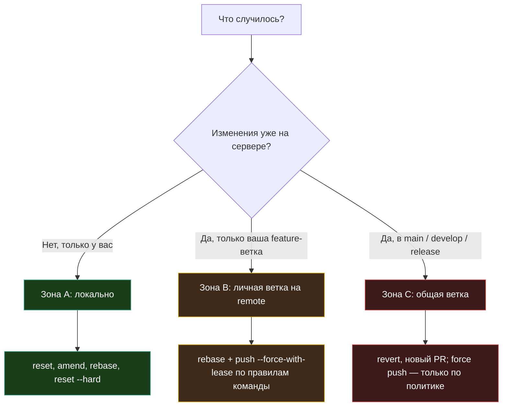

# Типовые ситуации с Git

<div class="article-tags">
  <span class="tag tag-required">ОБЯЗАТЕЛЬНО</span>
  <span class="tag tag-beginner">ДЛЯ НОВИЧКОВ</span>
</div>

<span class="complexity-badge">Разработчику</span>
<span class="complexity-badge">Архитектору</span>
<span class="complexity-badge">Инженеру</span>

Эта глава — **практический справочник по симптомам**: «случилось X → сначала проверь Y → сделай Z». Теория команд, объектная модель и продвинутые темы — в [шпаргалке](/encyclopedia/4-code-dev/4-13-osnovy-raboty-s-git/115); базовый цикл и три зоны — в [«Как работать с Git»](/encyclopedia/4-code-dev/4-13-osnovy-raboty-s-git/112); команда и PR — в [рекомендациях](/encyclopedia/4-code-dev/4-13-osnovy-raboty-s-git/114); секреты и `.gitignore` — в [отдельном руководстве](/encyclopedia/4-code-dev/4-13-osnovy-raboty-s-git/116).

Тренажёр для отработки веток: [Learn Git Branching](https://learngitbranching.js.org/?locale=ru_RU).

---

## Как пользоваться главой

1. Найдите **симптом** (сообщение в терминале, ощущение «всё пропало»).
2. Выполните **минимальную диагностику** (блок ниже).
3. Определите **зону риска** — от этого зависит, можно ли переписывать историю.
4. Следуйте шагам карточки. При сомнении на общей ветке (`main`, `develop`) — согласуйте действия с командой.

### Минимальная диагностика (всегда)

```bash
git status
git log --oneline -10
```

Если пропали коммиты, сбросили ветку или удалили branch — добавьте:

```bash
git reflog -20
```

`reflog` — локальный журнал движения `HEAD` и веток. Записи живут ограниченное время и **не синхронизируются** с сервером: после свежего `git clone` старых записей не будет.

### Зоны риска



| Зона | Смысл | Типичные инструменты |
|------|--------|----------------------|
| **A** — только локально | История на сервере не тронута | `reset`, `amend`, `restore`, `stash`, `reflog` |
| **B** — ваша ветка на remote | Переписывание затронет только ваших ревьюеров | `rebase`, `push --force-with-lease` |
| **C** — общая ветка | Переписывание истории ломает коллег | `revert`, hotfix-ветка, согласование с maintainer |

<div class="callout callout--tip">
  <div class="callout-title">Перед паникой</div>
  Git редко уничтожает данные мгновенно: коммиты остаются в объектной базе, пока их не соберёт сборщик мусора. <code>reflog</code> — главный инструмент «я нажал не то».
</div>

---

## Индекс ситуаций

| Симптом | Карточка |
|---------|----------|
| Забыл файл в последнем коммите | [Дополнить последний коммит](#дополнить-или-исправить-последний-коммит) |
| Опечатка в сообщении коммита | [Дополнить последний коммит](#дополнить-или-исправить-последний-коммит) |
| В коммит попало лишнее / хочу разбить коммиты | [Разделить изменения](#разделить-изменения-на-несколько-коммитов) |
| Нужна только часть файла в коммите | [Выборочный stage](#выборочный-stage-часть-файла) |
| Отменить правки в файле / в индексе | [Таблица отмены](#отмена-изменений-рабочая-копия-индекс-коммит) |
| Срочно переключить ветку, работа не готова | [Stash](#временно-спрятать-правки-stash) |
| Закоммитил в `main`, нужна feature-ветка | [Коммит не в той ветке](#закоммитил-в-main-нужна-отдельная-ветка) |
| Работал в чужой ветке | [Неверная ветка](#изменения-в-неверной-ветке) |
| `push` отклонён (non-fast-forward) | [Push отклонён](#push-отклонён-non-fast-forward) |
| `pull` не из той ветки / не в ту ветку | [Неверный pull](#pull-из-неправильной-ветки) |
| Локально лишние коммиты, на сервере другая история | [Сброс к origin](#сбросить-локальную-ветку-к-серверу) |
| После `reset --hard` пропали файлы | [Восстановление после hard reset](#после-git-reset---hard) |
| Удалили ветку, коммиты нужны | [Удалённая ветка](#удалена-локальная-ветка) |
| Случайный merge в feature / на сервере | [Отмена merge](#отменить-слияние-merge) |
| Конфликт при `rebase` | [Rebase и конфликты](#конфликт-при-rebase) |
| Сделал rebase, не хочу force push | [Rebase без force push](#rebase-без-force-push-на-remote) |
| Секрет или `.env` в коммите | [Секреты в истории](#секрет-или-конфиденциальный-файл-в-git) |
| Неверный URL `origin` | [Исправить remote](#неверный-url-удалённого-репозитория) |
| Ветка на сервере удалена, локальные «висят» | [Устаревшие ветки](#устаревшие-ссылки-на-remote-ветки) |
| Windows: смена регистра в имени файла | [Регистр имени файла](#смена-регистра-имени-файла-windows) |
| Вклад в чужой open-source репозиторий | [Форк и upstream](#форк-и-синхронизация-с-upstream) |
| «Вчера работало, сегодня сломано» — найти коммит | [Bisect](#найти-коммит-который-всё-сломал-bisect) |
| Перенести один коммит в другую ветку | [Cherry-pick](#перенести-один-коммит-cherry-pick) |
| «Не понимаю, что наделал» | [Общий алгоритм](#не-понимаю-что-произошло) |

---

## Работа с индексом и коммитами

### Дополнить или исправить последний коммит

**Симптом:** после `git commit` вспомнили про файл, опечатку в сообщении или мелкую правку.

**Зона:** A (если коммит ещё не `push`) или B/C (если уже на сервере — `amend` + force; на общих ветках лучше новый коммит).

```bash
# забытый файл
git add забытый.ts
git commit --amend --no-edit

# новое сообщение
git commit --amend -m "Исправить валидацию email в форме регистрации"
```

Проверка:

```bash
git show HEAD --stat
```

Если коммит **уже отправлен** в общую ветку — используйте обычный новый коммит или `revert`, а не `amend`. Для **своей** feature после согласования с командой:

```bash
git push --force-with-lease origin имя-ветки
```

`--force-with-lease` откажется пушить, если на сервере появились чужие коммиты с момента вашего последнего `fetch`.

---

### Выборочный stage (часть файла)

**Симптом:** в одном файле два логических изменения, нужны два коммита.

```bash
git add -p путь/к/файлу
```

Интерактивный режим предложит для каждого фрагмента (hunk): `y` — в индекс, `n` — пропустить, `s` — разбить hunk, `e` — править вручную.

Для **нового** файла, где нужна только часть строк:

```bash
git add -N новый-файл.ts   # intent to add
git add -p новый-файл.ts
```

Проверка перед коммитом:

```bash
git diff --staged
git commit -m "Только первая часть задачи"
# оставшиеся правки останутся в рабочей копии
```

Подробнее про три зоны — в [главе про workflow](/encyclopedia/4-code-dev/4-13-osnovy-raboty-s-git/112#выборочный-stage-и-просмотр-последнего-коммита).

---

### Разделить изменения на несколько коммитов

**Симптом:** один коммит или один `git add` смешали несколько задач.

**Ещё не коммитили**, всё в индексе:

```bash
git reset -p HEAD    # убрать из индекса выбранные hunks
git commit -m "Первая логическая часть"
git add -p ...
git commit -m "Вторая часть"
```

**Уже один коммит**, не отправлен:

```bash
git reset --soft HEAD~1   # коммит исчезает, правки остаются в индексе
git reset -p HEAD         # убрать лишнее из индекса
git commit -m "Часть 1"
git add ...
git commit -m "Часть 2"
```

**Несколько коммитов** — интерактивный rebase (зона A/B):

```bash
git rebase -i HEAD~3
```

В редакторе: `pick` — оставить, `squash` / `fixup` — объединить с предыдущим, `edit` — остановиться и изменить коммит. Подробности — в [шпаргалке, rebase -i](/encyclopedia/4-code-dev/4-13-osnovy-raboty-s-git/115).

---

### Отмена изменений: рабочая копия, индекс, коммит

| Цель | Команда | Что останется |
|------|---------|----------------|
| Отменить правки в файле (ещё не в индексе) | `git restore путь/к/файлу` | Версия из последнего коммита |
| Убрать файл из индекса, правки в файле сохранить | `git restore --staged путь/к/файлу` | Modified в рабочей копии |
| Отменить последний коммит, правки в индексе | `git reset --soft HEAD~1` | Staged |
| Отменить последний коммит, правки в файлах | `git reset --mixed HEAD~1` (по умолчанию) | Modified |
| Отменить коммит и все правки в tracked-файлах | `git reset --hard HEAD~1` | Чистая копия как в коммите-родителе |
| Удалить неотслеживаемые файлы и папки | `git clean -fd` (сначала `-n` — dry run) | — |

<div class="callout callout--warning">
  <div class="callout-title">Осторожно с --hard и clean</div>
  <p>Неотслеживаемые файлы <code>reset --hard</code> не трогает; для них — <code>git clean</code>. Оба действия необратимы без <code>reflog</code> / резервной копии. Стоп-лист и порядок спасения — <a href="/encyclopedia/8-infra-security/8-03-zabota-o-kode-i-dannyh/101">Опасные скрипты</a>.</p>
</div>

---

## Ветки и переключение

### Временно спрятать правки (stash)

**Симптом:** нужно срочно переключиться на `main` или другую ветку, коммитить полуфабрикат рано.

```bash
git stash push -m "WIP: форма оплаты"
git switch main
# ... срочная правка ...
git switch feature-oplata
git stash list
git stash pop    # применить и удалить запись
# или: git stash apply   # применить, запись останется
```

С неотслеживаемыми файлами:

```bash
git stash push -u -m "включая новые файлы"
```

Долгие «кладбища» в `stash list` усложняют жизнь — для задачи на несколько дней лучше отдельная ветка `wip/...`.

---

### Изменения в неверной ветке

#### Правки ещё не закоммичены

```bash
git stash push -m "перенос на feature-x"
git switch feature-x
git stash pop
```

#### Уже есть коммиты, ветка не отправлена

```bash
# вы на wrong-branch, коммиты нужны в feature-x
git switch -c feature-x          # ветка с коммитами остаётся
git switch wrong-branch
git reset --hard origin/wrong-branch   # или на коммит, где ветка должна быть
git switch feature-x
```

Если `wrong-branch` уже на сервере — согласуйте с командой; часто проще cherry-pick:

```bash
git switch feature-x
git cherry-pick <hash1> <hash2>
git switch wrong-branch
git reset --hard origin/wrong-branch
```

---

### Закоммитил в `main`, нужна отдельная ветка

**Симптом:** несколько коммитов в `main`, `push` ещё не было (зона A).

```bash
git switch -c feature/моя-задача    # указатель ветки уходит с main, коммиты сохраняются
git switch main
git reset --hard origin/main        # локальный main = сервер
git switch feature/моя-задача
git push -u origin feature/моя-задача
```

Если **уже запушили в `main`** (зона C) — откат через `revert` или отдельный PR от maintainer; самостоятельный `reset` + force на `main` недопустим в большинстве команд.

---

## Синхронизация с сервером

### Push отклонён (non-fast-forward)

**Симптом:**

```text
! [rejected] feature-x -> feature-x (non-fast-forward)
```

На сервере есть коммиты, которых нет у вас (часто кто-то запушил в ту же ветку или вы делали `rebase` / `amend`).

```bash
git fetch origin
git status
git log --oneline HEAD..origin/feature-x   # что пришло с сервера
```

**Обновить свою feature-ветку** (выберите политику команды):

```bash
# вариант 1: merge (без переписывания истории)
git merge origin/feature-x

# вариант 2: rebase (линейная история)
git rebase origin/feature-x
```

Затем:

```bash
git push origin feature-x
```

Если **вы** переписали историю (`rebase`, `amend`) и ветка только ваша:

```bash
git push --force-with-lease origin feature-x
```

<div class="callout callout--tip">
  <div class="callout-title">Никогда на общую ветку без согласования</div>
  <code>git push --force</code> в <code>main</code> / <code>develop</code> ломает работу всей команды. Используйте <code>revert</code> или процесс hotfix.
</div>

---

### Rebase без force push на remote

**Симптом:** сделали `git rebase origin/main` на ветке, которая уже была на сервере, и хотите избежать force push.

Влейте обратно merge-коммитом (история будет с merge, зато без force):

```bash
git switch feature-x
git merge origin/feature-x   # после rebase remote может расходиться — обсудите с командой
```

На практике после публичного rebase обычно всё же `push --force-with-lease` на **личную** ветку; уточните правила в [рекомендациях для команды](/encyclopedia/4-code-dev/4-13-osnovy-raboty-s-git/114).

---

### Устаревшие ссылки на remote-ветки

**Симптом:** на GitHub ветку удалили после merge, локально она ещё в `git branch -a`.

```bash
git fetch --prune
git branch -vv | grep ': gone]'    # локальные, у которых upstream исчез
git branch -d имя-ветки            # -D если не смержена и вы уверены
```

---

### Pull из неправильной ветки

**Симптом:** выполнили `git pull origin чужая-ветка`, находясь на `main` или на своей feature, и внезапно подтянулись чужие коммиты. В `git status` может быть «ahead/behind» или лишние файлы.

**Зона:** обычно A (если ещё не `push`); если уже отправили merge на сервер — зона C, нужен `revert` или помощь команды.

Сначала **не делайте новый push**, пока не разберётесь.

#### Fast-forward pull (самый частый случай)

`reflog` покажет, где была ветка до pull:

```bash
git reflog
```

Пример:

```text
ab7555f HEAD@{0}: pull origin wrong-branch: Fast-forward
c5bc55a HEAD@{1}: checkout: moving to main
```

Вернуть ветку на состояние до pull:

```bash
git reset --hard c5bc55a
# или: git reset --hard HEAD@{1}
```

#### Pull создал merge-коммит

Если слияние **ещё не завершили** (конфликты):

```bash
git merge --abort
```

Если merge-коммит **уже создан**, но не отправлен:

```bash
git reflog
git reset --hard HEAD@{1}    # на коммит до merge
```

Проверка:

```bash
git log --oneline -5
git status
```

**Профилактика:** явно указывайте ветку и remote: `git pull origin main` только на `main`; на feature — `git fetch origin` и `git merge origin/main` (или rebase), стоя на своей ветке.

---

### Сбросить локальную ветку к серверу

**Симптом:** `git status` пишет `Your branch is ahead of 'origin/feature-x' by N commits`, а эти коммиты нужно выбросить и совпасть с тем, что на GitHub.

**Зона:** A для неотправленных коммитов; если коммиты уже на remote — это другая задача (revert / force).

Убедитесь, что лишние коммиты **не нужны** (или сохраните в запасную ветку):

```bash
git branch backup-before-reset HEAD
git fetch origin
git reset --hard origin/feature-x
```

Локальная ветка станет точной копией удалённой. Неотслеживаемые файлы `reset --hard` не удаляет — при необходимости `git clean -fd` (сначала `git clean -n`).

---

### Неверный URL удалённого репозитория

```bash
git remote -v
git remote set-url origin https://github.com/org/правильный-repo.git
git fetch origin
```

Если склонировали **чужой** репозиторий целиком — проще удалить папку и `git clone` снова с правильным URL.

---

## Слияние, rebase, конфликты

### Отменить слияние (merge)

**Слияние ещё идёт** (конфликты, не завершили):

```bash
git merge --abort
```

**Merge-коммит уже создан**, не отправлен:

```bash
git reset --hard HEAD~1
```

**Merge уже на сервере** (зона C):

```bash
git log --oneline -5    # найти hash merge-коммита
git revert -m 1 <hash-merge-коммита>
git push origin main
```

`-m 1` указывает, какого родителя считать «основной линией» (обычно первая родительская ветка — та, на которой вы стояли при merge).

Конфликты при обычном merge — в [главе про ветвление](/encyclopedia/4-code-dev/4-13-osnovy-raboty-s-git/113#решение-конфликтов).

---

### Конфликт при rebase

**Симптом:** во время `git rebase origin/main` Git остановился с конфликтом.

```bash
# правим файлы, убираем маркеры <<<<<<< ======= >>>>>>>
git add исправленные-файлы
git rebase --continue
```

Отменить весь rebase:

```bash
git rebase --abort
```

Отличие от merge: при rebase вы «переигрываете» свои коммиты поверх новой базы; каждый конфликтный коммит может потребовать отдельного `add` + `continue`.

Перед rebase на shared-ветке убедитесь, что команда допускает переписывание истории feature-веток.

---

## Потеря данных и восстановление

### После `git reset --hard`

**Симптом:** файлы и коммиты «исчезли» после жёсткого сброса.

```bash
git reflog
```

Пример вывода:

```text
a1b2c3d HEAD@{0}: reset: moving to HEAD~3
e4f5g6h HEAD@{1}: commit: Важная работа
```

Вернуть ветку на состояние до сброса:

```bash
git reset --hard e4f5g6h
# или: git reset --hard HEAD@{1}
```

Перед экспериментами на незнакомых командах:

```bash
git branch backup-$(date +%Y%m%d) HEAD
```

---

### Удалена локальная ветка

```bash
git reflog
git branch восстановление e4f5g6h
git switch восстановление
```

Если ветка была на сервере:

```bash
git fetch origin
git switch -c feature-x origin/feature-x
```

---

### Восстановить один файл из старого коммита

```bash
git log --oneline -- путь/к/файлу
git restore --source=abc1234 -- путь/к/файлу
git add путь/к/файлу
git commit -m "Вернуть рабочую версию config из abc1234"
```

---

### Detached HEAD

**Симптом:** `git status` сообщает detached HEAD, вы смотрели старый коммит.

Сохранить работу в ветку:

```bash
git switch -c temp-save
```

Вернуться без новых коммитов:

```bash
git switch main
```

Подробнее — в [рекомендациях](/encyclopedia/4-code-dev/4-13-osnovy-raboty-s-git/114#отмена-коммита).

---

## Безопасность и open source

### Секрет или конфиденциальный файл в Git

**Сразу:**

1. **Ротировать** пароль, ключ, токен (старый считать скомпрометированным).
2. Убедиться, что путь в `.gitignore` (см. [руководство по `.gitignore`](/encyclopedia/4-code-dev/4-13-osnovy-raboty-s-git/116)).

**Ещё не push:**

```bash
git rm --cached .env
git commit -m "Убрать .env из отслеживания"
```

**Уже на сервере** — одного коммита мало: секрет остаётся в истории. Нужны `git filter-repo` (или поддержка платформы), уведомление команды, ротация ключей. Краткий чек-лист — в [116, раздел «файл уже попал в Git»](/encyclopedia/4-code-dev/4-13-osnovy-raboty-s-git/116#файл-уже-попал-в-git).

---

### Форк и синхронизация с upstream

**Симптом:** вносите вклад в чужой репозиторий на GitHub; ваш форк отстаёт от оригинала.

```bash
git clone git@github.com:ВАШ-ЛОГИН/repo.git
cd repo
git remote add upstream https://github.com/ОРИГИНАЛ/repo.git
git fetch upstream
git switch -c feature/issue-42
# ... коммиты ...
git push -u origin feature/issue-42
```

Перед новой задачей обновить `main` в форке:

```bash
git switch main
git fetch upstream
git merge upstream/main
git push origin main
```

Для feature-ветки часто:

```bash
git switch feature/issue-42
git rebase upstream/main
git push --force-with-lease origin feature/issue-42
```

На GitHub откройте Pull Request из форка в оригинальный репозиторий. Схема PR — в [ветвлении и слиянии](/encyclopedia/4-code-dev/4-13-osnovy-raboty-s-git/113).

---

## Отладка истории

### Найти коммит, который всё сломал (bisect)

**Симптом:** в `main` (или в релизной метке) что-то перестало работать; между «точно хорошей» и «точно плохой» версией — десятки коммитов, вручную искать долго.

**`git bisect`** делит диапазон пополам: Git переключает репозиторий на средний коммит, вы проверяете (тест, запуск приложения) и отвечаете `good` или `bad`, пока не останется один коммит-виновник.

**Перед стартом** — чистое дерево или stash:

```bash
git status
git stash push -m "bisect WIP"   # при необходимости
```

**Ручной режим** (подходит новичкам):

```bash
git bisect start
git bisect bad                 # текущий HEAD сломан
git bisect good v1.0.0         # тег или hash, где всё работало
```

Git перейдёт на коммит посередине. Проверьте поведение, затем:

```bash
git bisect good    # на этом коммите всё ок
# или
git bisect bad     # здесь уже сломано
```

Повторяйте, пока Git не напечатает hash первого плохого коммита. Завершение:

```bash
git bisect reset
git stash pop      # если откладывали правки
```

**Автоматический режим** — если есть скрипт с кодом выхода 0 (успех) / не-0 (ошибка):

```bash
git bisect start HEAD v1.0.0
git bisect run npm test
git bisect reset
```

На «мелком» клоне (`git clone --depth 1`) bisect может не найти старые коммиты — нужна полная история или углубление shallow-клона (см. [шпаргалку, bisect](/encyclopedia/4-code-dev/4-13-osnovy-raboty-s-git/115)).

<div class="callout callout--tip">
  <div class="callout-title">Bisect и бинарный поиск</div>
  Сто коммитов — порядка семи шагов проверки вместо ста. Именно поэтому bisect любят в CI и при регрессиях после релиза.
</div>

---

### Перенести один коммит (cherry-pick)

**Симптом:** нужен **один** коммит из другой ветки (исправление с `hotfix`, коммит, случайно сделанный не в той ветке), без полного merge.

```bash
git switch целевая-ветка
git cherry-pick abc1234
```

При конфликте — правите файлы, затем:

```bash
git add .
git cherry-pick --continue
```

Отмена:

```bash
git cherry-pick --abort
```

Несколько коммитов подряд (без коммита A, с B включительно):

```bash
git cherry-pick A..B
```

Подробнее — [шпаргалка, cherry-pick](/encyclopedia/4-code-dev/4-13-osnovy-raboty-s-git/115).

---

## Платформа и мелочи

### Смена регистра имени файла (Windows)

NTFS часто не различает `File.txt` и `file.txt`. Двухшаговый rename через Git:

```bash
git mv File.txt temp-name.txt
git mv temp-name.txt file.txt
git commit -m "Привести имя файла к нижнему регистру"
```

На macOS с нечувствительной FS — тот же приём.

---

### Игнорировать локальные правки в отслеживаемом файле

**Симптом:** в репозитории `appsettings.json`, локально меняете URL, Git постоянно показывает modified.

```bash
git update-index --skip-worktree appsettings.json
# отменить: git update-index --no-skip-worktree appsettings.json
```

Для командного шаблона лучше `appsettings.Development.json` в `.gitignore` и `.example` в репозитории.

---

## Не понимаю, что произошло

1. `git status` — merge/rebase в процессе? конфликты?
2. `git log --oneline --graph -15` — куда смотрит ветка.
3. `git reflog -20` — что делали последние шаги.
4. Определить зону риска (таблица в начале главы).
5. Сохранить текущее состояние:

```bash
git branch rescue-$(date +%H%M) HEAD
git stash push -u -m "rescue before fix"
```

6. Найти карточку в [индексе](#индекс-ситуаций) или спросить коллегу, показав вывод `status` и `reflog`.

<div class="callout callout--tip">
  <div class="callout-title">Когда звать на помощь</div>
  Зона C (main/develop), секреты в remote, <code>filter-repo</code>, сбой CI после force push — лучше сразу подключить тимлида или DevOps.
</div>

---

## Связанные материалы

| Тема | Где читать |
|------|------------|
| Базовый цикл, `add -p`, просмотр коммита | [112 — Как работать с Git](/encyclopedia/4-code-dev/4-13-osnovy-raboty-s-git/112) |
| PR, конфликты merge, инструменты | [113 — Ветвление и слияние](/encyclopedia/4-code-dev/4-13-osnovy-raboty-s-git/113) |
| Культура команды, detached HEAD, краткое восстановление | [114 — Рекомендации](/encyclopedia/4-code-dev/4-13-osnovy-raboty-s-git/114) |
| Объектная модель, bisect (справочник), worktree, filter-repo | [115 — Шпаргалка](/encyclopedia/4-code-dev/4-13-osnovy-raboty-s-git/115) |
| Секреты, `.gitignore`, утечки | [116 — .gitignore](/encyclopedia/4-code-dev/4-13-osnovy-raboty-s-git/116) |

---
