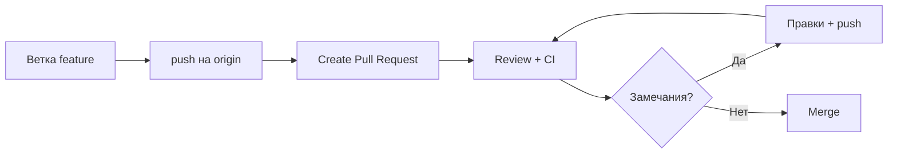

# Код-ревью и pull request

<div class="article-tags">
  <span class="tag tag-required">ОБЯЗАТЕЛЬНО</span>
  <span class="tag tag-beginner">ДЛЯ НОВИЧКОВ</span>
</div>

<span class="complexity-badge">Разработчику</span>
<span class="complexity-badge">Архитектору</span>

---

## Pull request и код-ревью

**Pull request (PR)** — на GitHub (на GitLab — **merge request**, MR) — официальный запрос: "влейте мои коммиты из ветки **feature** в ветку **main**". Сервер показывает **diff** (построчное сравнение изменений), запускает **CI** (Continuous Integration — автоматические тесты и линтер), собирает **комментарии** ревьюеров.

**Code review (код-ревью)** — проверка изменений другим человеком: логика, стиль, безопасность, тесты. Вторая пара глаз ловит опечатки и архитектурные ошибки до продакшена.

Базовые ветки и merge — [Ветвление и слияние](./113.md). Ниже — практика PR от первого коммита до merge.



---

## Пошагово — первый PR

### 1. Ветка для задачи

Не коммитьте в `main` напрямую. Создайте ветку:

```bash
git checkout -b feature/add-readme
# или: git switch -c feature/add-readme
```

Имена вроде `feature/...`, `fix/...`, `docs/...` помогают команде ориентироваться — [Рекомендации в команде](./114.md).

### 2. Изменения и коммит

```bash
# ... правите файлы ...
git add .
git commit -m "docs: добавить раздел установки в README"
```

Сообщение коммита описывает **что** изменилось и **зачем**, а не одно слово "fix" без контекста.

### 3. Push на удалённый сервер

```bash
git push -u origin feature/add-readme
```

Первый push создаёт ветку на GitHub. **origin** — имя **remote** (удалённого репозитория), это не имя ветки:


### 4. Create Pull Request

В веб-интерфейсе GitHub:

1. Откройте репозиторий → часто появится жёлтая плашка **Compare & pull request**.
2. **Base** — куда вливаем (обычно `main`).
3. **Compare** — ваша ветка `feature/add-readme`.
4. Заголовок и описание PR:
   - что сделано;
   - как проверить;
   - ссылка на задачу (Jira, issue).
5. **Create pull request**.

Схема веток на сервере — как в [ветвлении](./113.md):


Выбор ветки в интерфейсе:


---

## Этапы после создания PR

| Этап | Что происходит |
|------|----------------|
| **Review** | Коллеги смотрят diff, оставляют комментарии к строкам |
| **CI** | GitHub Actions (или аналог) собирает проект и гоняет тесты |
| **Исправления** | Вы правите локально, `git commit`, `git push` — **PR обновляется сам** |
| **Approve** | Ревьюер нажимает "Approve" (если так принято в команде) |
| **Merge** | Кнопка Merge pull request — код попадает в `main` |
| **Cleanup** | Удалить ветку `feature/...` на сервере (GitHub предложит) |

Конфликты с `main`, пока вы работали — см. ниже и [типовые ситуации](./1141.md).

---

## Как читать diff

**Diff** — построчное сравнение "было → стало":

- строки с **`+`** (зелёные) — добавлено;
- **`−`** (красные) — удалено;
- контекст без знака — неизменённые соседи.

Смотрите не только синтаксис, но и:

- **логику** — все ветки `if`, граничные случаи;
- **имена** — понятны ли переменным и методам;
- **дублирование** — можно ли проще (DRY — Don't Repeat Yourself);
- **тесты** — есть ли проверка нового поведения — [Тестирование для разработчика](/encyclopedia/4-code-dev/4-14-razrabotka-i-otladka/1117);
- **секреты** — нет ли ключей и паролей в diff ([`.gitignore`](./116.md)).

Крупный PR (больше 400 строк) трудно ревьюить — дробите на несколько.

---

## Комментарии и как отвечать

Ревьюер может:

- оставить **общий** комментарий к PR;
- привязать **inline**-комментарий к конкретной строке diff.

**Автор PR:**

1. Прочитайте замечание без спешки.
2. Если согласны — исправьте, ответьте "исправил в коммите abc123" или Resolve conversation.
3. Если не согласны — **вежливо аргументируйте** ("здесь O(n) критично, потому что…"), не спорьте ради ego.
4. Вопрос "не понял" — нормален; уточните у ревьюера.

Тон: ревью **кода**, не личности. "Этот метод лучше вынести" — ок; "ты плохо пишешь" — не ок.

---

## Конфликты при merge

**Конфликт** — одна и та же строка изменена и в `main`, и в вашей ветке. Git не может слить автоматически.

Типичный путь:

```bash
git checkout feature/add-readme
git fetch origin
git merge origin/main
# или: git rebase origin/main — как принято в команде
```

В файлах появятся маркеры:

```
<<<<<<< HEAD
ваша версия
=======
версия из main
>>>>>>> origin/main
```

Выберите итоговый текст, удалите маркеры, `git add`, `git commit`, `git push`. PR обновится.

Разбор merge и rebase — [Ветвление и слияние — merge и rebase](./113.md#merge-i-rebase). Конфликт на картинке — [image-20 / image-21 / image-22](./113.md) в той же статье. Lab — [Git — шпаргалка](/lab/Примеры/1123#git-merge--конфликт-слияния).

---

## Первый PR на своём репозитории

Допустим, у вас свой репозиторий на GitHub:

1. Клонируйте, создайте ветку `docs/fix-typo`.
2. Исправьте опечатку в README, commit, push.
3. Откройте PR в `main` **сами себе** — посмотрите diff и вкладку **Files changed**.
4. Нажмите **Merge** — увидите merge-коммит в истории.

Так безопасно потренироваться до командного репозитория.

---

## Шаблон описания PR

```markdown
## Что сделано
- Добавлен endpoint POST /api/tasks
- Валидация пустого title

## Как проверить
1. npm run dev
2. curl -X POST http://localhost:3000/api/tasks -H "Content-Type: application/json" -d '{"title":"test"}'
3. Ожидание: 201 и JSON с id

## Связанные задачи
- JIRA-1234 / Fixes #56

## Скриншоты (если UI)
[приложить]
```

Ревьюеру не нужно угадывать — [типовые задачи](./101.md).

---

## Чек-лист автора PR

- [ ] Ветка актуальна относительно `main` (merge/rebase)
- [ ] Локально проходят тесты — [1117](/encyclopedia/4-code-dev/4-14-razrabotka-i-otladka/1117)
- [ ] Нет секретов и `.env` в diff — [116 .gitignore](./116.md)
- [ ] PR не больше ~400 строк (или объяснение, почему больше)
- [ ] Описание PR заполнено
- [ ] Self-review diff просмотрен **до** запроса review

---

## Чек-лист ревьюера

- [ ] Понятна **цель** изменения
- [ ] Логика и граничные случаи
- [ ] Имена и читаемость
- [ ] Тесты на новое поведение
- [ ] Безопасность (SQL, XSS, секреты) — [2.08 ИБ](/encyclopedia/2-system-network/2-08-osnovy-informatsionnoy-bezopasnosti/intro)
- [ ] Нет лишнего scope (рефакторинг "заодно" без договорённости)

Тон комментария — конкретный и уважительный.

---

## Примеры комментариев

**Хорошо:**

- "Здесь при `title=""` вернётся 500; лучше 400 и сообщение валидации — см. `validate_task`."
- "Можно вынести повтор в `formatUserName()` — но необязательно в этом PR."

**Плохо:**

- "переделай"
- "не нравится"

**На вопрос автора:**

- "Не понял, зачем второй запрос к БД — можно пояснить?"

---

## Draft PR

**Draft pull request** — черновик: код виден команде, merge заблокирован. Удобно:

- рано получить направление;
- показать WIP (work in progress);
- прогнать CI на половине работы.

В GitHub: Create PR → dropdown → **Create draft pull request**. Когда готово — **Ready for review**.

---

## Запрос ревью (Request review)

После создания PR нажмите **Reviewers** → выберите коллег. В некоторых репо срабатывает **CODEOWNERS** — автоматически тегает владельцев папки.

Пока CI красный, ревью часто откладывают — сначала почините pipeline — [1134 Actions](/lab/Примеры/1134).

---

## Статусы CI на PR

| Значок | Смысл |
|--------|--------|
| ✓ зелёный | тесты/линтер прошли |
| ✗ красный | упала сборка или тест |
| ● жёлтый | выполняется |
| — серый | проверка не настроена |

Клик по Details → лог упавшего job.

---

## Способы merge

| Способ | История Git | Когда |
|--------|-------------|--------|
| **Merge commit** | merge-коммит с двумя родителями | сохранить полную историю ветки |
| **Squash merge** | один коммит в `main` | много мелких "fix" в ветке |
| **Rebase merge** | линейная история без merge-коммита | чистый log (если принято в команде) |

Команда выбирает политику в [114 рекомендации](./114.md). Squash удобен новичку — один аккуратный коммит в `main`.

---

## Protected branches

**Protected branch** — ветка (обычно `main`), куда **нельзя** push напрямую:

- только через PR;
- нужен approve;
- CI должен быть зелёным.

Настраивает maintainer в Settings → Branches.

---

## Работа с fork

Open source: вы не имеете прав на чужой репозиторий.

1. **Fork** — копия репо в ваш аккаунт.
2. Clone **своего** fork.
3. Ветка, commit, push в **свой** origin.
4. PR из fork → upstream `main`.

Upstream — оригинальный репозиторий. Подробнее — [113 ветвление](./113.md).

---

## После merge

- Удалите ветку на сервере (GitHub предложит).
- Локально: `git checkout main && git pull && git branch -d feature/...`
- Закройте задачу в Jira/issue.

---

## Связанные темы

- [Рекомендации в команде](./114.md) — процесс, conventional commits.
- [DevOps CI/CD](/encyclopedia/8-infra-security/8-04-devops-ci-cd/intro) — проверки на PR.
- [Профессиональные практики](/encyclopedia/4-code-dev/4-14-razrabotka-i-otladka/11) — культура разработки.
- [Как читать чужой код](/encyclopedia/4-code-dev/4-14-razrabotka-i-otladka/1118) — навык для ревьюера.

---
