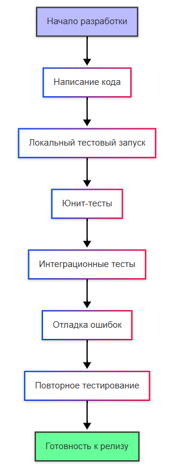
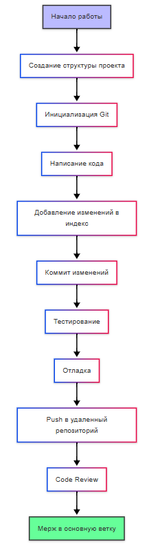
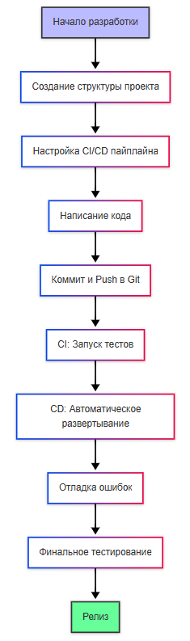

---
title: Процесс разработки программного обеспечения
tags: [beginner, advanced, required, engineer, developer, architector]
description: Процесс создания и исправления программ. Этапы разработки.
---

# Процесс разработки программного обеспечения

<div class="article-tags">
  <span class="tag tag-required">ОБЯЗАТЕЛЬНО</span>
  <span class="tag tag-beginner">ДЛЯ НОВИЧКОВ</span>
  <span class="tag tag-advanced">НЕ ДЛЯ НОВИЧКОВ</span>
  <span class="tag tag-inprogress">В РАЗРАБОТКЕ</span>
</div>
<span class="complexity-badge">Разработчику</span>
<span class="complexity-badge">Архитектору</span>
<span class="complexity-badge">Инженеру</span>


## Процесс разработки программного обеспечения

Обычно в разработку включают много всего - от анализа требований и проектирования до тестирования, развёртывания. Но по факту под разработкой понимать лучше именно само кодирование - написание программного кода на выбранных языках программирования и интеграция различных компонентов.

Сейчас порог довольно высокий, и разрабатывать довольно сложно. Усложняет всё необходимость знания практик, методологий, подходов, принципов и прочих ньюансов. Именно в этом сложность.

---

### Принципы разработки

Есть принципы проектирования, паттерны проектирования, архитектурные паттерны, методологии, подходы проектирования, и всё это - разные вещи. А каких же принципов придерживаться разработчику?

Ну, если не заучивать, то обеспечивать читаемость, надежность, учитывать область видимости, и стараться держать код оптимальным.

Можно собирать миллионы всяких условий и правил, но в общем, как-то так:

- Если используете нейросеть, то проверяйте и переписывайте код. Сама по себе идея "подсказки" от ИИ-агентов хороша, но на практике всегда всё криво. Будьте внимательны;
- Если публикуете код, отправляете куда-то, скриншотите или шлёте нейросети, обязательно убирайте всё конфиденциальное - API-ключи, пути, идентификаторы, персональные и коммерческие данные;
- Не полагайтесь на автоматику, всегда перепроверяйте;
- Сначала проектируйте решение, затем приступайте;
- Не ленитесь поискать решение прежде, чем делать самим;
- Наименования сущностей, классов, переменных и прочих элементов кода должны передавать свою суть наиболее доходчиво, чтобы любой другой разработчик мог сразу понять смысл;
- Следуйте принятым в проекте соглашениям по форматированию;
- Повторяющийся код выносите в отдельные методы или классы - это DRY (Don't Repeat Yourself);
- Перепроверьте свой код ещё раз (работает всегда!);
- Внимательно сверить реализацию с задачей - проверить каждое слово, пункт, поле, формулировки, числа, и прочее;
- Проверяйте, не затираются ли чужие доработки;
- По возможности, максимально декомпозируйте методы, чтобы было проще отлаживать;
- Проверяйте на наличие орфографических ошибок;
- Добавляйте комментарии (и XML-документацию), описания и атрибуты к каждому классу, методу, свойству и полю, чтобы другим было понятно;
- Отделяйте элементы друг от друга пустыми строками - условные конструкции (if, else, for, while), методы, атрибуты, поля, свойства и прочее.

- Правильно:
```
элемент1

элемент2

элемент3
```
- Неправильно:
```
элемент1
элемент2
элемент3
```

- Старайтесь избегать литералов и не оставлять фиксированных значений в коде;
- Сортируйте код в логические блоки:
```
здесь объявляем переменные

здесь объявляем функции

здесь вызываем функции и работаем
```
- Убирайте потенциальные полезные вещи, которые сейчас не нужны. Никаких "на будущее" (это YAGNI);
- Добавляйте валидацию для всех значений, которые поступают извне (интеграционное получение данных, ввод пользователя);
- **S**OLID. Принцип единственной ответственности (SRP): класс делает только одну задачу;
- S**O**LID. Принцип открытости/закрытости (OCP): классы открыты для расширения, закрыты для изменения;
- SO**L**ID. Принцип подстановки Барбары Лисков (LSP): объекты могут быть заменены их подтипами без нарушения программы;
- SOL**I**D. Принцип разделения интерфейса (ISP): клиенты не зависят от методов, которые они не используют;
- SOLI**D**. Принцип инверсии зависимостей (DIP): зависит от абстракций, а не от конкретных реализаций;
- KISS. Нет избыточного ООП и излишней логики, если можно сделать проще;
- Избегать частых аллокаций в критических участках (например, создание объектов в цикле);
- На этапе написания кода - используйте отладочные сообщения, трассировки, комментарии и инструменты для дебага . Но перед отправкой коммита - уберите их.
- Код не должен содержать закомментированного мусора - ненужные методы, блоки кода, всё это нужно убирать;
- Функции и методы называть лучше глаголом, обозначающим основной смысл функции, к примеру GetДанные для получения данных;
- Проверяйте, чтобы среди английских символов (латиницы) не спрятались кириллические символы (к примеру, "с", "K", "Н", "Т", "М" и так далее);
- Когда формируете SQL-запросы, используйте только те данные, которые нужны в работе - не запрашивайте все таблицы целиком;
- Предпочитайте декларативный стиль императивному, где это упрощает понимание;
- Все публичные методы должны выполнять проверку входных параметров (в том числе `null`, диапазоны, форматы);
- Для внутренних (private/internal) методов проверки допустимо опускать, если гарантируется корректность вызова из контекста;
-  Не подавляйте исключения без явной необходимости: `catch {}` без логгирования или восстановления состояния;
- Критически важные компоненты должны быть покрыты модульными и интеграционными тестами (TDD/BDD по уместности);
- Уязвимости ввода (например, SQL-injection, XSS, SSRF) должны устраняться на уровне архитектуры: параметризованные запросы, экранирование, валидация, allowlist-подход;
- Исключения — для *исключительных* ситуаций, а не для управления потоком выполнения (т.е. не использовать `try-catch` вместо `if`). Не стоит оборачивать каждый блок кода в `try-catch`: это снижает читаемость, скрывает реальные проблемы и усложняет отладку;
- Избегайте исключений, которые можно предотвратить проверкой (например, `NullReferenceException`, `IndexOutOfRangeException`);
- В распределённых системах исключения должны корректно сериализоваться и содержать контекст (trace ID, operation ID), но не конфиденциальные данные;
- По умолчанию используйте наиболее строгий уровень доступа, `private` для полей и вспомогательных методов, `internal` для компонентов, используемых только внутри сборки, `protected` — только если явно требуется расширение в подклассах;
- Не расширяйте доступность ради «удобства тестирования» — вместо этого применяйте инверсию зависимостей и DI-контейнеры;
- Объявляйте локальные переменные ближе к месту первого использования и в наименьшей возможной области видимости;
- Предпочитайте неизменяемые типы.

---

## Процесс разработки

Процесс разработки начинается с получения задания. Но в каждой компании могут быть свои особенности и правила, а также проекты могут быть как простыми, так и сложными, поэтому схем можно выделить четыре:

Общий процесс


Первая схема представляет общий процесс разработки, начиная с подготовки проекта и заканчивая завершением. Он логичен, хотя новичку юнит-тесту могут быть не знакомы.

Акцент на тестирование



Вторая схема показывает процесс с фокусом на тестировании и отладке, что особенно важно для обеспечения качества кода. Здесь, помимо юнит-тестов, добавляется также интеграционное тестирование и отображён важный момент - тестирование не всегда идеально, ошибки найдутся и будут подлежать исправлению, а исправляет их разработчик.

Использование Git



Третья схема показывает процесс разработки с учётом использования системы контроля версий (Git), это стандартная практика в современной разработке. Важный момент здесь - коммиты, использование локального и удалённого репозитория и конечно код-ревью.

Использование CI/CD



Четвёртая схема учитывает современные практики CI/CD (непрерывная интеграция и доставка). Здесь тестирование и развёртывание автоматизированы. Это более сложная тема, особенности которой будем изучать позже.

---

### Что такое разработка?

**Разработка программного обеспечения** — это сложный и многогранный процесс, требующий не только технических навыков, но и грамотной организации, планирования и коммуникации. На практике может быть что угодно, абсолютно всевозможные комбинации подходов, принципов, паттернов, методологий и парадигм. Но всё же в большинстве организаций придерживаются какой-то определённой стратегии развития, особенно в сфере корпоративного ПО и финтеха.

Давайте рассмотрим основные этапы разработки.

---

#### Получение задания


Любая разработка начинается с задачи. Это может быть запрос от заказчика, идея собственного проекта или поручение внутри команды. Первый и один из самых важных шагов — правильно понять, что именно требуется сделать:
	- уточните требования - задавайте вопросы, нужно исключить двусмысленность;
	- определите цели - чего хочет заказчик? какова основная функция?
	- собрать контекст - узнайте, какие ограничения существуют.

Не стесняйтесь спрашивать у коллег (особенно аналитиков этой задачи), ведь иногда задание может быть расплывчатым или даже противоречивым. В таких случаях необходимо провести предварительный анализ и согласование условий до начала проектирования и реализации. И если аналитик уже анализировал, это не значит, что разработчику не нужен анализ!

К примеру, вам поручили изменить логику работы какого-то бизнес-процесса. На первый взгляд всё хорошо - документация с анализом, детально расписано в каких элементах потребуются изменения и даже какими они должны быть. Кажется, что можно даже сразу приступить к реализации, но вот в процессе разработки (скажем, через шесть часов), на одном из элементов стало заметно, что требуемая задача нереализуема, так как была допущена ошибка проектирования задачи. Да, решать это придётся через коллег - старшие разработчики, общение с аналитиком, отмена, продление или изменение задачи.

А если бы вы даже и не заметили ошибку, просто сделали бы как указано в документации, задача пошла в тестирование, и только на этом этапе обнаружили проблему - и вас будут дёргать на исправление «бага», и вы в процессе правки заметите, что задача изначально была некорректно поставлена.

Можно было сэкономить затраченную кучу времени, всего лишь перед разработкой уделив немного времени на то, чтобы пробежаться по всем сущностям и затрагиваемым элементам, и убедиться, что задача реализуема и учла все подводные камни.

---

#### Стратегия разработки и оценка затрат на разработку

После того как задача понята, наступает время стратегического планирования. Этот этап определяет дальнейший ход действий и помогает ответить на три ключевых вопроса:
	- Сколько времени потребуется на реализацию?
	- Какие ресурсы (люди, инструменты, технологии) будут задействованы?
	- Какой бюджет необходим?

И если вы рядовой разработчик, для которого вопросы бюджета явно вне компетенции, то остаются два вопроса - ресурсы и время.

Первичный анализ должен показать, какие технологии используются, чья компетенция затрагивается, какие могут быть риски и проблемы. Вот здесь может быть два варианта развития событий.

В первом варианте вас могут спросить о том, сколько времени потребуется, и есть ли вопросы. Это хороший вариант, и если есть возможность попросить немного времени (скажем, четыре часа) на анализ задачи, то замечательно - просите, берите, анализируйте, запишите себе все возникшие вопросы и задавайте их. Это подойдёт, когда на ежедневных совещаниях (скажем, на спринтах) или в хаотичной разработке есть прямой контакт с командой и возможность всё обсудить. И за эти четыре часа нужно понять, что и где вам придётся править, и сколько примерно вам потребуется времени. При оценке времени нужно брать резервное время - от часа до дня, чтобы не упираться в дедлайны, если что-то пойдёт не по плану.

Второй вариант более строгий, когда вам просто дают задачу, и время на неё уже определено. К примеру, техлид определил самостоятельно, получив ответы на все вопросы, проанализировал и назначил уже готовую задачу. Здесь будет документация, чёткая задача и выделенное время, поэтому важно не спешить бежать её исполнять, всё также нужно проанализировать, но в чуть более ускоренном темпе. В идеале, созвониться с постановщиком задачи и попросить объяснить задачу, если есть такая возможность.

Для ответа на вопросы обычно используют методы оценки трудозатрат (к примеру, деление задач на подзадачи и оценка каждой части), анализ рисков (выявление потенциальных проблем и их влияния на сроки и бюджет), и учитывается выбранная модель жизненного цикла разработки (водопад, Agile). 

Здесь главное — точная оценка на ранних этапах позволяет избежать недоразумений и перерасхода ресурсов позже.

---

#### Предварительное планирование

Организация процесса — залог успешной реализации любого проекта, как в циклах задач, так и в конкретных задачах. Даже самые талантливые и опытные разработчики могут потерпеть неудачу, если работа плохо спланирована или не контролируется. Конечно, здесь важно, чтобы роли и обязанности в команде были распределены, постановка задач выполнялась с помощью систем управления проектами, планирование этапов было корректным, проводились регулярные встречи для контроля процесса. И конечно гибкость, ведь план должен учитывать возможные изменения и адаптацию под новые условия.

Но не всё зависит от самого разработчика, ведь он лишь часть команды, а не управляющий, поэтому сначала нужно адаптироваться, изучить все регламенты и потом только приступать. Обычно к проектам допускают только после прохождения какого-то базового обучения и череды знакомств. Разработчику потребуются разве что хард-скиллы, технические навыки со знанием алгоритмов, структур данных, опыта работы, понимания протоколов, API, паттернов. Начинающему же будут давать более простые задачи, так что сложность задачи лежит на лидах.

После получения задачи, определения затрат, начинается «горячая фаза» разработки. Если перед разработкой вы проанализировали и записали себе свой план разработки, то работа пойдёт чуть быстрее. А если не записали - пора записать (кроме случаев, когда у вас уже есть идеальная документация, но это нереально). Аналитики и лиды не углубляются в тонкости реализации - какие функции вызывать, как называть переменные, как выполнять запросы в базу и тому подобное. Поэтому тут бремя лежит на разработчике.

Даже небольшое проектирование перед началом кодирования помогает избежать хаоса, повысить читаемость кода и облегчить дальнейшее сопровождение. Нужно определить данные, логику, интерфейс, способы обмена данными, поток движения информации внутри системы. 

Сначала напишите себе крупные этапы работы - допустим «Создать класс слушатель», «Создать класс для логики». Потом разбейте эти этапы на задачи, декомпозировав их - алгоритмическим языком распишите, что должны иметь классы, какие свойства/поля, методы, переменные. В таком «мини-проекте» определите им имена. Можете всё расписывать в обычном текстовом редакторе и создавать отдельные файлы для каждой задачи, которую вам поручают. В некоторых компаниях можно встретить даже требования для подготовки специальных документов с планом разработки (это полезно, когда сотрудник уволился или в отпуске, и при разборе проблем нужно понять, чем он руководствовался, что он делал и как планировал).
Кто-то предпочитает так не расписывать и сразу приступить, мыслить творчески в самом процессе, но я бы рекомендовал придерживаться чёткости и порядка хотя бы на первых порах. В дальнейшем мышление структурируется и только тогда будете готовы рваться сразу в бой. А документация поможет не забыть о том, что изменено (хотя Git и так сообщит изменения), какие были названия у сущностей и элементов, и позволит избежать проблем.

---

#### Процесс написания кода

Это центральный этап разработки. Тут всё просто — сделайте код:
	- Читаемым (чтобы другие разработчики могли понять вашу логику);
	- Поддерживаемым (чтобы добавление новых функций не ломало голову);
	- Тестируемым (код должен быть разделен на модули, готовые к проверке, если это применимо в вашем случае).

Соблюдение стандартов кодирования, написание комментариев и документирование функций значительно облегчает жизнь всем участникам проекта. В рамках принятых регламентов, конечно.

Собственно, прежде чем приступить к написанию кода, нужно проверять, готовы ли нужные инструменты и окружение - IDE, текстовый редактор, системы сборки и зависимости, доступ к серверам, базам данных, внешним API. Правильно настроенная рабочая среда экономит время и снижает количество «не работает у меня» ситуаций.

Важно понимать, что разработчик пишет код быстро, а большую часть времени выясняет, почему оно не работает, или правит ошибки. Ошибка — неизбежная часть разработки. Особенно часто они возникают на ранних этапах, поэтому бояться их не нужно, воспринимать как возможность научиться их исправлению. 

Читайте сообщения об ошибках, пользуйтесь отладкой и логированием для поиска проблем. Главное — сохранять терпение и систематически подходить к исправлению ошибок. Вы можете завершить работу, сдать её, но вам прилетит ошибка от тестировщиков и придётся вернуться к этому шагу, чтобы поправить баги.

Не забудьте про резервное копирование! Потерянный код или повреждённые данные могут свести на нет недели работы, регулярно делайте резервные копии, коммиты изменений в Git, чтобы спастись от потерь.

---

#### Сдача разработки

Когда план реализован и разработка завершена, то здесь важно учесть ещё один момент — время и ресурсы, выделенные на разработку, включают не только разработку. Сюда входит и предварительное тестирование силами самого разработчика (если это возможно), подготовка и проверка юнит-тестов, рефакторинг, отладка, исправление найденных ошибок.

Перепроверили? Перепроверьте ещё раз. Семь раз отмерь, один раз отрежь. Не торопясь, сначала прочитайте свой код, и убедитесь в его корректности, аккуратности и соответствии регламентам. Потом попробуйте проверить, работает ли он (ведь кому нужен нерабочий код?), протестируйте, а если у вас есть возможность работать со своей локальной копией репозитория, то это как раз возможность для теста.

И только когда вы убедились, что всё работает как надо, а также чисто и (по вашему мнению) готово, то заливайте изменения на сервер, делайте пулл-реквесты, словом, сдавайте задачу. Здесь можно столкнуться ещё с одной задачей - подготовкой документации, к примеру, описание разработчика или отчёт. Если вы документировали на этапе планирования, то отчеты пишутся легко, так как всё было по плану.

---