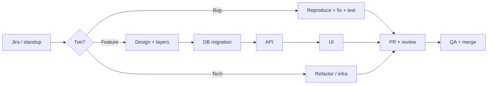

# Типовые задачи разработчика — справочник-шпаргалка

  ОБЯЗАТЕЛЬНО
  ДЛЯ НОВИЧКОВ

Разработчику
Тестировщику
Аналитику
Инженеру

---

## Содержание

1. [Кто даёт задачи разработчикам](#кто-даёт-задачи-разработчикам)
2. [Пример — как задача приходит из Jira](#пример-как-задача-приходит-из-jira)
3. [Справочник типовых задач](#справочник-типовых-задач)
   - [Зависимости, библиотеки и окружение](#зависимости-библиотеки-и-окружение)
   - [Развёртывание и инфраструктура](#развёртывание-и-инфраструктура)
   - [Git, ревью и поставка изменений](#git-ревью-и-поставка-изменений)
   - [Баги, ошибки и отладка](#баги-ошибки-и-отладка)
   - [База данных и SQL](#база-данных-и-sql)
   - [Backend, API и интеграции](#backend-api-и-интеграции)
   - [Frontend, UI и вёрстка](#frontend-ui-и-вёрстка)
   - [Формы, валидация и бизнес-логика на экране](#формы-валидация-и-бизнес-логика-на-экране)
   - [Безопасность и конфиденциальные данные](#безопасность-и-конфиденциальные-данные)
   - [Тестирование и качество](#тестирование-и-качество)
   - [Производительность и масштабирование](#производительность-и-масштабирование)
   - [Асинхронность, события и планировщики](#асинхронность-события-и-планировщики)
   - [Локализация, темы и доступность](#локализация-темы-и-доступность)
   - [Low-code, BPMN и корпоративные платформы](#low-code-bpmn-и-корпоративные-платформы)
   - [ИИ, LLM и внешние API](#ии-llm-и-внешние-api)
   - [Мобильная разработка](#мобильная-разработка)
   - [Аналитика, отчёты и данные](#аналитика-отчёты-и-данные)
   - [DevOps, CI/CD и облако](#devops-cicd-и-облако)

---

## Кто даёт задачи разработчикам

Почти всегда у задачи есть **источник**, **формат** и **ожидаемый результат**. Обычно в компании есть определённый план развития - такой план утверждается руководством, а задача проектирования развития и разработки ложится на плечи старших и опытных руководителей - архитекторов, менеджеров, лидов.

Задачи декомпозируются - одна крупная глобальная задача разделяется на несколько этапов, а каждый этап дробится на более мелкие.

Например, если продукт разрабатывается "с нуля":
1. Сделать ядро.
2. Сделать модуль А.
3. Сделать модуль Б.
4. Интегрировать модуль А с ядром.
5. Интегрировать модуль Б с ядром.
6. Внедрить.

И каждая задача включает в себя свои этапы - анализ, проектирование, разработка, тестирование. Анализируют и проектируют как раз аналитики, разрабатывают разработчики, тестируют тестировщики - тут очевидно.

Дальше, когда основной продукт уже есть, может быть развитие:
1. Разработать новый функционал А.
2. Разработать новый функционал Б.
3. Разработать новый функционал В.

И в каждом этапе уже будут всё те же знакомые анализ, проектирование, разработка, тестирование.

Вам, как разработчику, может попасть как старт проекта, так и какой-то из его этапов, например, это уже какой-нибудь десятитысячный функционал для старого проекта. Но смысл примерно один - кто-то уже проверил, оценил, и подготовил вам задачу.

Кто же?

---

### Бизнес-аналитик (BA)

Бизнес-аналитику не нужны сложные технические детали, как правило. Им ставят задачи другие - например, увеличить продажи, уменьшить нагрузку на сотрудников, ускорить процессы. Они уже самостоятельно, по своим специальным методикам, собирают потребности, определяют проблему и теоретические решения.

Он может ошибаться, может не знать внутренности продукта, его код, архитектуру и логику, это не его профиль. Поэтому общаться с ним нужно чуть проще - обычно это будут делать менеджеры, системные аналитики или старшие разработчики.

Бизнес-аналитик переводит язык бизнеса ("нам нужно быстрее закрывать заявки") в требования к системе.

Обычно приносит user story, описание процесса "как сейчас / как должно быть", макеты в Figma или скриншоты, таблицы полей, правила расчётов, ссылки на регламенты.

**Часто звучит так**

"Добавить статус заявки", "Вывести отчёт по менеджерам", "Сделать обязательным поле ИНН для юрлиц".

**На что смотреть**

Бизнес-формулировка часто обходит граничные случаи ("а если заявка уже закрыта?"). Уточняйте до начала кодирования.

Когда бизнес даст всё что нужно команде разработки, скорее всего за материалы сядет системный аналитик, и уже на основе изученного, составит более детальный документ с задачей и описанием, как раз для разработки.

Может быть так, что задача поступит напрямую от бизнеса - разное бывает. Порой разработчику зададут вопрос как раз потому что он знает детали - с ним будут советоваться при планировании, определят вектор развития, и если разработчик скажет, например, "ерунда, я это к вечеру исправлю" - то и задача появится сразу, типа "ок, тогда правь, потом сообщи по готовности".

**Материалы**

[Роль бизнес-аналитика в проекте](/encyclopedia/7-project/7-04-analitika/113), [Взаимодействие аналитика с командой](/encyclopedia/7-project/7-04-analitika/127).

---

### Системный аналитик (SA)

Как раз системный аналитик уже находится в команде разработки, посвящён в технические детали, знает архитектуру и при этом разбирается в бизнесе.

Он может не разбираться в коде, но технически имеет более глубокие знания, в отличие от бизнес-аналитика, и занимает промежуточное звено - он и в бизнесе разбирается, понимает логику и задачи, и в технических решениях - знает, какие технологии используются, как всё устроено.

Часто аналитиков много, даже больше, чем разработчиков, а старшие менеджеры и архитекторы распределяют по системным аналитикам задачи - кто-то отвечает за одну часть, кто-то за другую - например, это могут быть:
- карточки и дизайн;
- базы данных и объекты;
- бизнес-процессы;
- функциональные элементы;
- интеграции с другими системами.

Обычно аналитик готовит специальную документацию, где описывает **как** система должна работать технически — интеграции, контракты API, поля, таблицы, связи, схемы БД, последовательности вызовов, нефункциональные требования.

Обычно приносит спецификации REST/SOAP, диаграммы последовательности, ER-диаграммы, описание полей сообщений JSON/XML, требования к производительности и отказоустойчивости.

**Часто звучит так**

"Реализовать метод POST /orders по приложенной схеме", "Добавить поле в таблицу orders и прокинуть в ORM", "Обработать callback от платёжного шлюза".

**На что смотреть**

Спецификация может расходиться с реальным поведением внешней системы. Проверяйте на тестовом контуре.

**Материалы**

[Роль системного аналитика в разработке](/encyclopedia/7-project/7-04-analitika/114), [Справочник по нотации BPMN 2.0](/encyclopedia/7-project/7-04-analitika/129).

---

### Техлид (Tech Lead) / ведущий разработчик

В любой крупной команде есть кто-то старший и опытный, к которому можно обратиться для решения самых сложных технических вопросов. Обычно команды делят по группам, и каждой группой кто-то руководит - его называют лид (lead).

Бывают тимлиды (team lead), которые сосредоточены на работе команды, и техлиды (tech lead), которые отвечают за реализацию, стабильность, надёжность разрабатываемых командой решений.

Техлид задаёт техническое направление, разбивает эпики, ревьюит архитектурные решения, иногда сам ставит задачи по рефакторингу, долгу и инфраструктуре.

Именно он как старший разработчик будет проверять ваш код перед тем, как соединить его с основным решением.

Обычно приносит технические задачи с чётким критерием готовности — "Вынести общий модуль авторизации", "Обновить версию фреймворка", "Покрыть сервис X unit-тестами".

**Часто звучит так**

"Разделить God-class", "Добавить индекс на orders.created_at", "Настроить Dockerfile для staging".

**На что смотреть**

Задача может предполагать знание внутренней архитектуры. Если непонятно "почему так", спросите до реализации альтернативы.

**Материалы**

[Проектирование и архитектура — о разделе](/encyclopedia/7-project/7-06-proektirovanie-i-arhitektura/intro), [Парадигмы и уровни абстракции](/encyclopedia/4-code-dev/4-07-paradigmy-i-urovni-abstraktsii/intro).

---

### Тимлид (Team Lead)

Тимлид не всегда технический специалист, а порой может быть и вовсем одним из разработчиков или аналитиков. Тут уже важнее софт-скиллы и коммуникация, но всё же любая команда имеет перед собой поставленную общую цель, в основном ради достижения которой тимлид и может формировать и ставить задачи.

Это организация команды, приоритеты спринта, распределение задач, эскалация блокеров. ТЗ часто готовят аналитики; тимлид **назначает** исполнителя и следит за сроками.

Иногда это может быть разрешение конфликтов, поддержание рабочего состояния, онбординг новичков, объяснения и поддержка.

Обычно приносит "Возьми PROJ-1234 в текущий спринт", "Сначала баг с продакшена, потом фича", "Согласуй оценку с QA".

**Часто звучит так**

переназначение приоритета, напоминание о дедлайне, просьба помочь коллеге с code review.

**На что смотреть**

Устная просьба "сделай к вечеру" требует тикета — попросите завести карточку, чтобы задачу можно было принять по процессу.

**Материалы**

[Scrum — о разделе](/encyclopedia/7-project/7-14-scrum/intro), [Scrum — команда и Scrum Master](/encyclopedia/7-project/7-14-scrum/3).

---

### Тестировщик (QA / SDET)

Находит дефекты, проверяет сценарии, иногда пишет автотесты и воспроизводит баги для разработчика.

Обычно приносит баг-репорты со шагами воспроизведения, скриншоты, логи, ожидаемое и фактическое состояние, ссылки на тест-кейсы.

Иногда аналитики выполняют обязанности тестировщиков (логично, когда ты ставишь задачу и ты же проверяешь), но в крупных командах такого нет, и тестировщики живут отдельной командой.

Тестировщики потому и любят свою работу, потому что порой им не особо важна бизнес-логика, если она не является их текущей задачей. Они определяют, что проверять, собирают тест-кейс, а после проверки, если что-то не работает, просто формируют задачу, которая и прилетит разработчику.

Если всё организовано и регламентировано хорошо, то задача на исправление багов или доработки прилетит в порядке очерёдности, отдельно.

Если же команда молодая или неорганизованная, то тестировщики напишут напрямую разработчику, и это может выглядеть как скриншот с ошибкой и комментарий "не работает, исправляй". Так что будьте готовы к разному.

**Часто звучит так**

"При сохранении заказа с пустым email возвращается 500, нужно сообщение об ошибке", "На Safari кнопка 'Оплатить' не видна".

**На что смотреть**

Размытые формулировки вроде "не работает" требуют шагов воспроизведения. Верните тикет на дополнение.

**Материалы**

[Тестирование программного обеспечения — о разделе](/encyclopedia/7-project/7-05-testirovanie/intro), [Последовательность этапов тестирования](/encyclopedia/7-project/7-05-testirovanie/116).

---

### Менеджер проекта / Product Owner (PO)

Менеджер - это руководитель, и в основном он планирует, согласует, решает и организует. Так что если вдруг возникла необходимость в срочной задаче, он может вызвать, к примеру, на совещании, прямо дать задачу, и указать сроки.

Менеджерам, как правило, на детали плевать. Им важно:
- сколько понадобится времени;
- сколько понадобится людей;
- когда можно идти дальше.

И это нормально - им точно не стоит в мелочах разъяснять о проблемах, сложностях, особенностях. Кратко и чётко.

Самое важное - если нет ясности, попросите время на определение такой ясности. Например, возьмите пару часов на анализ, изучение, примерный поиск решение, и приходите уже с пониманием. Если понимания всё ещё нет - сообщите, просите ещё времени и людей.

Приоритет продукта, scope релиза, согласование с заказчиком. PO формулирует **ценность** продукта, PM — **сроки и риски** проекта.

Обычно приносит эпики, roadmap, "must have к релизу 15.06", изменение приоритетов.

**Часто звучит так**

"Отложить отчёт, срочно — интеграция с CRM", "Нужна демо-версия к показу инвесторам".

**На что смотреть**

Смена scope в середине спринта требует явного решения — зафиксируйте, что выбрасывается из спринта.

**Материалы**

[Scrum — потери, фокус и готово](/encyclopedia/7-project/7-14-scrum/5).

---

### Другие источники

| Источник | Примеры задач |
|----------|----------------|
| Поддержка (L2/L3) | Инцидент на проде, восстановление данных |
| DevOps / SRE | Настроить пайплайн, поднять стенд |
| Архитектор | Утвердить схему интеграции, запретить антипаттерн |
| Смежная команда | "Нам нужен webhook при смене статуса" |
| Сам разработчик | Техдолг, улучшение README, рефакторинг после review |

---

## Как задача приходит из Jira

Ниже — **условный пример** карточки из Jira Software в продуктовой команде. Поля могут называться иначе (Azure DevOps, YouTrack, Redmine), смысл тот же.

### Карточка в Jira

| Поле | Значение |
|------|----------|
| **Ключ** | SHOP-2847 |
| **Тип** | Story |
| **Название** | Автоматически показывать количество товаров в корзине в шапке сайта |
| **Статус** | To Do → In Progress → Code Review → QA → Done |
| **Исполнитель** | (назначают на планировании или тимлид) |
| **Приоритет** | Medium |
| **Спринт** | Sprint 24 (12–26 июня) |
| **Epic** | SHOP-2800 "Улучшение checkout" |
| **Компонент** | Frontend, Backend |
| **Метки** | cart, header, api |

> Как пользователь интернет-магазина, я хочу видеть актуальное число позиций в корзине в шапке на всех страницах, чтобы не переходить в корзину ради проверки.
>
> **Критерии приёмки**

> 1. В шапке отображается badge с числом уникальных позиций (считаются позиции, quantity не суммируется).
> 2. После добавления товара число обновляется без перезагрузки страницы.
> 3. Неавторизованный пользователь — корзина из localStorage/session; авторизованный — с сервера.
> 4. При ошибке API показываем "—" или скрываем badge; страница остаётся рабочей.
>
> **Макет** ссылка на Figma (frame Header v3).
>
> **API** GET /api/v1/cart/summary — описание в Confluence "Cart API v1", раздел 3.2.
>
> **Зависимости** блокируется задачей SHOP-2840 (эндпоинт summary на бэкенде).

**Вложения**

скриншот текущей шапки, PDF макета.

Связи

- **blocks** SHOP-2840 (Backend — эндпоинт cart/summary)
- **relates to** SHOP-2100 (Общий компонент Header)

Комментарии в процессе

1. *QA:* "Уточните — если quantity=5 у одной позиции, badge показывает 1 или 5?" → *BA:* "1 — количество позиций".
2. *Tech Lead:* "На фронте использовать существующий CartContext, один общий fetch".
3. *Developer:* "SHOP-2840 ещё на review, работаю с mock до merge".

---

### Как разработчик читает такую карточку

1. **Проверить блокеры** можно ли начать до SHOP-2840 (mock, feature flag, контракт из Confluence).
2. **Уточнить неоднозначности** до кодирования (badge — позиции или штуки; в примере уже уточнили в комментарии).
3. **Оценить слои** — БД (если нужна), API, фронт, тесты — здесь затронуты Backend + Frontend.
4. **Взять в работу** статус → In Progress, ветка `feature/SHOP-2847-cart-badge` или по правилам команды.
5. **По готовности** PR с ключом SHOP-2847 в названии, линк на Jira, ревью, QA по критериям приёмки.

**Материалы**

[Как работать с Git](/encyclopedia/4-code-dev/4-13-osnovy-raboty-s-git/112), [Ветвление и слияние](/encyclopedia/4-code-dev/4-13-osnovy-raboty-s-git/113), [Процесс разработки ПО](./1).

---

## Справочник типовых задач

В каждом пункте — формулировка из тикета, стек, порядок работы, риски и ссылки на материалы энциклопедии.

---

### Зависимости, библиотеки и окружение

#### Подключить библиотеку и настроить зависимости

**Формулировка в тикете**

"Добавить библиотеку X для парсинга PDF / отправки HTTP / работы с датами", "Обновить версию пакета Y".

**Стек**

любой стек — NuGet (.NET), pip/poetry (Python), Maven/Gradle (Java/Kotlin), npm/pnpm/yarn (Node.js), Cargo (Rust), Composer (PHP), RubyGems.

Порядок работы

1. Найти официальное имя пакета и совместимую версию с вашим runtime и остальными зависимостями.
2. Добавить запись в манифест проекта (или выполнить команду установки, которая обновит манифест).
3. Установить зависимости локально, убедиться, что lock-файл (если принят в команде) обновлён и закоммичен.
4. Импортировать/подключить библиотеку в нужном модуле, вызвать API по документации.
5. Проверить лицензию и размер transitive-зависимостей; прогнать сборку и smoke-тест.

**Риски**

конфликт версий, breaking changes при major-обновлении, пакеты с низкой поддержкой.

**Материалы**

[Манифесты зависимостей](/encyclopedia/4-code-dev/4-04-proekt-i-freymvorki/103), [Зависимости — о разделе](/encyclopedia/4-code-dev/4-09-zavisimosti/intro), [Проект и фреймворки — о разделе](/encyclopedia/4-code-dev/4-04-proekt-i-freymvorki/intro).

#### Вынести литералы в конфигурацию и константы

**Формулировка в тикете**

"Вынести URL API из кода", "Вынести таймауты в appsettings / .env".

**Стек**

везде; особенно backend, микросервисы, мобильные клиенты.

Порядок работы

1. Составить список литералов, которые меняются между окружениями (dev/stage/prod).
2. Перенести их в конфиг-файлы, переменные окружения или секрет-хранилище.
3. Оставить в коде только имена ключей и разумные defaults для локальной разработки.
4. Обновить `.env.example` и README; убедиться, что секреты не попали в Git.

**Риски**

[Опасные скрипты и утечки](/encyclopedia/8-infra-security/8-03-zabota-o-kode-i-dannyh/101).

**Материалы**

[Манифесты зависимостей — Dockerfile и конфиги](/encyclopedia/4-code-dev/4-04-proekt-i-freymvorki/103), [README для разработчика](./117).

#### Настроить локальное окружение разработчика

**Формулировка в тикете**

"Поднять проект у себя на машине", "Onboarding — что установить".

**Стек**

первый день в команде; любой репозиторий.

Порядок работы

1. Клонировать репозиторий; прочитать README и CONTRIBUTING.
2. Установить runtime (Node, JDK, .NET SDK, Python), IDE, Docker при необходимости.
3. Скопировать конфиг из шаблона; запросить доступы к БД и API keys у команды.
4. Установить зависимости; выполнить миграции БД; запустить приложение.
5. Прогнать тесты; убедиться, что dev-сервер открывается в браузере или API отвечает.

**Материалы**

[Терминал — о разделе](/encyclopedia/2-system-network/2-05-terminal/intro), [Запуск и перезапуск приложений](/encyclopedia/1-basics/1-035-bazovaya-informatika/208), [Структура кодовой базы](./116).

---

### Развёртывание и инфраструктура

#### Развернуть систему на тестовом сервере

**Формулировка в тикете**

"Поднять стенд QA", "Развернуть ветку feature/X на test", "Настроить demo для заказчика".

**Стек**

веб-приложения, API, микросервисы; on-prem и облако.

Порядок работы

1. Получить доступ к серверу или облачному окружению (SSH, панель, kubectl).
2. Клонировать нужную ветку из Git или использовать CI-артефакт сборки.
3. Настроить переменные окружения и конфиги под test (БД, URL соседних сервисов).
4. Установить зависимости / собрать образ / выполнить миграции БД.
5. Запустить процесс (systemd, Docker Compose, Kubernetes deployment); проверить health-check.
6. Пробросить порты, настроить reverse proxy (nginx) и TLS при необходимости.
7. Передать URL QA и краткую инструкцию по тестовым учёткам.

**Риски**

test-данные не должны быть копией продакшена с персональными данными; версия БД и приложения должны совпадать с ожиданиями QA.

**Материалы**

[Системное администрирование — о разделе](/encyclopedia/2-system-network/2-06-sistemnoe-administrirovanie/intro), [Docker](/encyclopedia/8-infra-security/8-06-konteynerizatsiya-i-orkestratsiya/111), [Работа с Docker](/encyclopedia/8-infra-security/8-06-konteynerizatsiya-i-orkestratsiya/114).

#### Подготовить Dockerfile для приложения

**Формулировка в тикете**

"Контейнеризировать сервис", "Добавить Dockerfile в репозиторий".

**Стек**

Node, Python, Java, Go, .NET — любой сервис для Docker/Kubernetes.

Порядок работы

1. Выбрать базовый образ (slim/alpine vs полный — trade-off размер/совместимость).
2. Описать этапы — установка зависимостей, сборка, финальный runtime-образ (multi-stage).
3. Задать рабочую директорию, EXPOSE порта, CMD/ENTRYPOINT.
4. Не класть секреты в образ; использовать env at runtime.
5. Собрать локально, запустить, проверить health; опционально — docker-compose для связки с БД.

**Материалы**

[Dockerfile](/encyclopedia/8-infra-security/8-06-konteynerizatsiya-i-orkestratsiya/116), [Безопасность в Docker](/encyclopedia/8-infra-security/8-07-informatsionnaya-bezopasnost/125).

---

### Git, ревью и поставка изменений

#### Проверить изменения и отправить их в Git, оформить PR

**Формулировка в тикете**

"Залить фичу на review", "Создать pull request в main".

**Стек**

любая командная разработка.

Порядок работы

1. Убедиться, что код собирается и тесты проходят локально.
2. Просмотреть diff — убедиться, что нет лишних файлов, секретов, отладочного мусора.
3. `git add` только нужные файлы; commit с понятным сообщением (часто с ключом Jira).
4. Push ветки на remote; создать PR/MR с описанием, скриншотами UI, ссылкой на задачу.
5. Пройти code review, исправить замечания, дождаться CI (зелёный pipeline).
6. Merge по правилам команды (squash/rebase/merge commit).

**Материалы**

[Как работать с Git](/encyclopedia/4-code-dev/4-13-osnovy-raboty-s-git/112), [Ветвление и слияние](/encyclopedia/4-code-dev/4-13-osnovy-raboty-s-git/113), [Рекомендации в команде](/encyclopedia/4-code-dev/4-13-osnovy-raboty-s-git/114), [Git — шпаргалка сценариев](/lab/Примеры/1123).

#### Точечно откатить проблемные изменения из коммита

**Формулировка в тикете**

"Откатить только файл X", "Убрать случайно закоммиченный конфиг", "Revert коммита без потери остального".

**Стек**

после ошибочного commit, после неудачного merge.

Порядок работы

1. Если commit **ещё не в общей ветке** — amend или reset (осторожно с `--hard`).
2. Если уже в remote — `git revert` для коммита или новый commit, отменяющий изменения.
3. Для одного файла — checkout версии из нужного commit или `git restore`.
4. Согласовать с командой при force-push; использовать reflog для восстановления.

**Риски**

[Опасные команды Git](/encyclopedia/8-infra-security/8-03-zabota-o-kode-i-dannyh/101), [Типовые ситуации с Git](/encyclopedia/4-code-dev/4-13-osnovy-raboty-s-git/1141).

---

### Баги, ошибки и отладка

#### Анализ и исправление бага на странице (frontend)

**Формулировка в тикете**

"Кнопка не кликается", "Вёрстка поехала на мобильном", "Данные не обновляются после сохранения".

**Стек**

React, Vue, Angular, Svelte, plain JS; иногда desktop (Electron, WPF WebView).

Категории багов

| Категория | Симптомы | Типичная причина |
|-----------|----------|------------------|
| DOM / вёрстка | Наложение, обрезание, неверный размер | CSS, flex/grid, media queries |
| Состояние UI | Старые данные на экране | Не обновлён state/store, stale cache |
| Сеть | Пустой список, вечный spinner | 4xx/5xx, CORS, неверный URL |
| JS runtime | Белый экран, ошибка в консоли | undefined, async race, typo |
| Роутинг | 404, неверная страница | Path, guard, base href |
| Доступность | Фокус, клавиатура | tabIndex, aria, overlay |
| Браузер/OS | Только Safari / только IE legacy | prefixes, polyfills |

Порядок работы

1. Воспроизвести по шагам из баг-репорта; зафиксировать браузер и размер экрана.
2. Открыть DevTools — Console (ошибки), Network (запросы), Elements (DOM/CSS).
3. Локализовать слой — UI, API, данные.
4. Исправить; добавить регрессионный тест или чек-лист для QA.
5. Приложить скрин "до/после" в PR.

**Материалы**

[DevTools в браузере — справочник](./1116), [Отладка](./111), [JavaScript — о разделе](/encyclopedia/5-languages/5-01-javascript/intro).

#### Исправление бага на backend

**Формулировка в тикете**

"500 при POST /orders", "Timeout при большом файле", "Дублируются записи".

Категории

| Категория | Симптомы | Типичная причина |
|-----------|----------|------------------|
| Исключения | 500, stack trace в логах | null, необработанное исключение |
| Валидация | 400 без понятного текста | Нет проверки входа |
| БД | Deadlock, constraint violation | Транзакции, race, неверная схема |
| Интеграция | Intermittent failures | Таймаут, retry, idempotency |
| Конфигурация | "На prod не работает" | Env, feature flag |
| Производительность | Медленный ответ | N+1 запросов, нет индекса |

**Порядок работы**

воспроизвести → логи + correlation id → breakpoint или structured logging → fix → unit/integration test.

**Материалы**

[Настройка логирования](./1111), [Типичные ошибки новичков](./1115), [ORM — о разделе](/encyclopedia/4-code-dev/4-10-orm-i-rabota-s-dannymi/intro).

#### Проверить, почему у пользователя ошибка / исключение

**Формулировка в тикете**

"У клиента вылетает приложение", "Скинул скрин ошибки", "В Sentry прилетел alert".

Порядок работы

1. Собрать данные — версия приложения, ОС, время, user id (без лишних ПДн), stack trace, steps to reproduce.
2. Найти событие в Sentry/логах/Kibana по fingerprint или request id.
3. Сопоставить с недавними деплоями и конфигами.
4. Воспроизвести локально или на стенде с тем же окружением.
5. Hotfix или patch release по severity.

**Материалы**

[Отладка](./111), [Настройка логирования](./1111).

#### Вернуть испорченные данные

**Формулировка в тикете**

"После скрипта миграции сломались цены", "Случайно удалили записи", "Нужен rollback данных".

Порядок работы

1. **Остановить** дальнейшее повреждение (отключить job, feature flag off).
2. Оценить масштаб — сколько строк, какие таблицы, есть ли backup/PITR.
3. Восстановить из backup на отдельный инстанс → выборочный restore или SQL UPDATE из снимка.
4. Если backup нет — reverse migration, ручная правка по audit log (если велся).
5. Post-mortem — выяснить, почему не было backup-теста; добавить транзакцию и dry-run.

**Риски**

на проде сначала согласовать с DBA; тестировать скрипт на копии.

**Материалы**

[SQL — о разделе](/encyclopedia/3-data-markup/3-07-sql/intro), [Проектирование БД](/encyclopedia/7-project/7-06-proektirovanie-i-arhitektura/design/116).

---

### База данных и SQL

#### Добавить индекс для таблицы

**Формулировка в тикете**

"Ускорить отчёт по orders за период", "Slow query log показывает full scan".

**Стек**

PostgreSQL, MySQL, SQL Server, Oracle, SQLite.

Порядок работы

1. Получить план запроса (EXPLAIN) до и понять фильтры/JOIN/ORDER BY.
2. Выбрать колонки индекса (equality → range); рассмотреть составной индекс.
3. Создать индекс на staging; замерить; на prod — в окно обслуживания для больших таблиц.
4. Проверить, не деградировали INSERT/UPDATE.

**Материалы**

[Сложные индексы](/encyclopedia/3-data-markup/3-07-sql/884), [Продвинутая оптимизация PostgreSQL](/encyclopedia/8-infra-security/8-11-praktikum-postgresql/2).

#### Создать представление (VIEW) для частых запросов с JOIN

**Формулировка в тикете**

"Вынести сложный JOIN в view для отчётов", "Упростить доступ аналитикам".

**Порядок работы**

согласовать колонки → CREATE VIEW → права доступа → использовать в приложении или BI → документировать семантику (1:1 vs агрегация).

**Материалы**

[Представления (VIEW)](/encyclopedia/3-data-markup/3-07-sql/8).

#### Добавить триггер и вызов процедуры/функции

**Формулировка в тикете**

"При INSERT в orders писать audit", "Синхронизировать summary-таблицу".

**Порядок работы**

определить событие (BEFORE/AFTER) → написать процедуру → создать trigger → тест на rollback-транзакции → мониторинг производительности.

**Риски**

триггеры усложняют отладку; часто логику переносят в application layer.

**Материалы**

[Хранимые процедуры и триггеры](/encyclopedia/3-data-markup/3-07-sql/88).

#### Создать связанные таблицы и промежуточную (many-to-many)

**Формулировка в тикете**

"Связать товары и теги", "Пользователь — многие роли".

**Порядок работы**

ER-диagram → таблицы + FK → junction table с составным PK или surrogate id → миграция → ORM mapping → CRUD API и UI.

**Материалы**

[Проектирование баз данных](/encyclopedia/7-project/7-06-proektirovanie-i-arhitektura/design/116), [ORM — о разделе](/encyclopedia/4-code-dev/4-10-orm-i-rabota-s-dannymi/intro).

#### Оптимизировать большой запрос в базу

**Формулировка в тикете**

"Отчёт выполняется 40 секунд", "Таймаут на дашборде".

**Порядок работы**

EXPLAIN ANALYZE → индексы → переписать JOIN/подзапросы → денormalize/materialized view → кэш → пагинация по страницам.

**Материалы**

[Продвинутая оптимизация PostgreSQL](/encyclopedia/8-infra-security/8-11-praktikum-postgresql/2), [Пагинация в API](/encyclopedia/2-system-network/2-09-osnovy-integratsionnogo-vzaimodeystviya/131).

#### Добавить новое поле на карточке (БД + ORM + UI)

**Формулировка в тикете**

"Поле 'Комментарий менеджера' на карточке заказа", "Новый атрибут товара в каталоге".

Порядок работы

1. Миграция БД — колонка, тип, NULL/NOT NULL, default, индекс при необходимости.
2. Модель ORM / entity / DTO — новое свойство.
3. API — сериализация, валидация, версионирование контракта при breaking change.
4. Frontend — поле на форме, отображение в списке, локализация label.
5. Обратная совместимость — старые клиенты без поля; миграция данных при необходимости.

**Материалы**

[ORM — о разделе](/encyclopedia/4-code-dev/4-10-orm-i-rabota-s-dannymi/intro), [Проверка и валидация](./118).

#### Добавить статусы (состояния) для сущности

**Формулировка в тикете**

"Статусы товара — В наличии, Нет в наличии, Архив", "Workflow заявки".

Порядок работы

1. Справочник statuses (id, code, name, sort_order) или enum в БД.
2. FK status_id в основной таблице; правила переходов (state machine) в коде или отдельной таблице.
3. ORM + API фильтр по статусу.
4. UI — badge цвета, фильтры списка, права "кто может перевести в Архив".

**Материалы**

[Проектирование БД](/encyclopedia/7-project/7-06-proektirovanie-i-arhitektura/design/116), [BPMN — справочник](/encyclopedia/7-project/7-04-analitika/129).

---

### Backend, API и интеграции

#### Написать веб-сервис REST API с SQL и авторизацией

**Формулировка в тикете**

"CRUD для сущности Product", "API для мобильного приложения с JWT".

**Стек**

Spring Boot, ASP.NET Core, FastAPI/Django, Express/NestJS, Laravel, Go gin/echo.

Порядок работы

1. Спроектировать ресурсы, методы, коды ответов, схему ошибок.
2. Слой доступа к данным (ORM/repository); миграции.
3. Middleware — authentication, authorization, logging, CORS.
4. Реализовать endpoints; валидация входа; pagination для списков.
5. OpenAPI/Swagger документ; Postman collection для QA.
6. Тесты — unit сервиса + integration с test DB.

**Материалы**

[Практикум REST и WebSocket — о разделе](/encyclopedia/8-infra-security/8-08-praktikum-rest-i-websocket/intro), [Тестирование и анализ API](/encyclopedia/7-project/7-05-testirovanie/2), [JWT и OAuth2](/encyclopedia/5-languages/5-03-java/274), [Identity — JWT, cookie](/encyclopedia/5-languages/5-05-csharp/4515), [Веб-разработка и REST на Python](/encyclopedia/5-languages/5-02-python/34).

#### Сделать форму и POST-запрос на адрес

**Формулировка в тикете**

"Отправка формы регистрации", "POST multipart для загрузки файла".

**Порядок работы**

HTML form или fetch/axios → CSRF token при cookie-auth → backend parser → validate → persist → redirect или JSON response.

**Материалы**

[HTML — формы](/encyclopedia/3-data-markup/3-09-html/intro), [Проверка и валидация](./118).

#### Извлечь данные из публичного API и разложить в БД

**Формулировка в тикете**

"Синхронизировать курсы валют", "Импорт каталога поставщика раз в ночь".

**Порядок работы**

изучить rate limits → client с retry → map JSON to entities → upsert по ключу → scheduler/cron → мониторинг ошибок.

**Материалы**

[JSON](/encyclopedia/3-data-markup/3-04-konfiguratsii-i-dannye/3), [Polling, SSE, Webhook](/encyclopedia/2-system-network/2-04-kak-rabotayut-sayty-i-veb-sayty/129).

#### Реализовать обработку глубоковложенного JSON

**Формулировка в тикете**

"Парсить ответ ERP с вложенными order.lines.discounts", "Маппинг в flat таблицы".

**Порядок работы**

JSON Schema или OpenAPI → defensive parsing (optional fields) → DTO layers → validation → transform → тесты на реальных sample files.

**Материалы**

[JSON](/encyclopedia/3-data-markup/3-04-konfiguratsii-i-dannye/3), [JSONB в PostgreSQL](/encyclopedia/8-infra-security/8-11-praktikum-postgresql/4).

#### Реализовать обработку глубоковложенного XML

**Формулировка в тикете**

"Интеграция с legacy SOAP", "Импорт XML выгрузки 1С".

**Порядок работы**

XSD если есть → SAX/DOM/stream parser → namespace awareness → validation → idempotent import.

**Материалы**

[Справочник по XML](/encyclopedia/3-data-markup/3-04-konfiguratsii-i-dannye/211), [XML DOM](/encyclopedia/3-data-markup/3-04-konfiguratsii-i-dannye/215).

#### Разработать проверку с валидацией входящих данных из внешней системы

**Формулировка в тикете**

"Webhook от банка — проверить подпись и поля", "EDI сообщение".

**Порядок работы**

whitelist полей → типы и диапазоны → business rules → reject с понятным кодом → audit log сырых payload (без секретов).

**Материалы**

[Проверка и валидация](./118), [Pydantic](/encyclopedia/5-languages/5-02-python/41).

#### Реализовать отправку Email с шаблоном

**Формулировка в тикете**

"Письмо при регистрации", "Уведомление менеджеру о новой заявке".

**Порядок работы**

шаблон (HTML + text fallback) → SMTP или API (SendGrid, SES) → queue для надёжности → unsubscribe где нужно → тест на spam score.

**Материалы**

[Email-рассылка как распределённая система](/encyclopedia/7-project/7-06-proektirovanie-i-arhitektura/144), [Электронная почта](/encyclopedia/1-basics/1-22-kommunikatsiya-i-obschenie/3).

#### Сделать веб-хук в событийно-ориентированной системе

**Формулировка в тикете**

"При оплате вызвать URL партнёра", "Подписаться на события GitHub".

**Порядок работы**

contract event payload → HMAC signature → retry with backoff → idempotency key → dead letter queue.

**Материалы**

[Polling, SSE, Webhook](/encyclopedia/2-system-network/2-04-kak-rabotayut-sayty-i-veb-sayty/129), [Микросервисы и интеграция](/encyclopedia/8-infra-security/8-05-mikroservisy-i-integratsiya/101).

#### Подключить приложение к OpenAI / Gemini / локальной LLM

**Формулировка в тикете**

"Чат-бот поддержки", "Суммаризация текста заявки", "RAG по базе знаний".

**Порядок работы**

API key в secrets → выбор модели и лимитов токенов → prompt template → обработка ошибок/rate limit → логирование без ПДн → fallback.

**Материалы**

[Генерация кода — ChatGPT, Gemini](/encyclopedia/6-ai/6-04-modeli-i-instrumenty/117), [Трансформеры и NLP — о разделе](/encyclopedia/6-ai/6-09-transformery-i-nlp/intro), [MLOps и LLM-стек](/encyclopedia/6-ai/6-08-agentops/2).

---

### Frontend, UI и вёрстка

#### Создать страницы по маршруту в веб-приложении

**Формулировка в тикете**

"Страница /settings/profile", "Вложенный роут /orders/:id".

**Стек**

React Router, Vue Router, Angular Router, Next.js App Router, ASP.NET MVC routes.

**Порядок работы**

зарегистрировать route → компонент страницы → layout → guards (auth) → lazy import при большом бандле → 404 и breadcrumbs.

**Материалы**

[Веб-сайты и веб-приложения — о разделе](/encyclopedia/2-system-network/2-04-kak-rabotayut-sayty-i-veb-sayty/intro), [JavaScript — о разделе](/encyclopedia/5-languages/5-01-javascript/intro).

#### Добавить новую кнопку с модальным окном и вызовом API

**Формулировка в тикете**

"Кнопка 'Удалить' с подтверждением", "Оформить заказ → modal → POST".

**Порядок работы**

UI button → modal/dialog component → текст предупреждения → disable during request → API call → toast success/error → закрыть modal и обновить список.

**Материалы**

[HTML/CSS](/encyclopedia/3-data-markup/3-10-css/intro), [DevTools](./1116).

#### Добавить поиск с полем и фильтрацией

**Формулировка в тикете**

"Поиск по названию товара", "Фильтры — категория, цена, статус".

**Порядок работы**

input + debounce → query params в URL → backend filter/pagination → empty state → accessibility (label, aria).

**Материалы**

[Пагинация в API](/encyclopedia/2-system-network/2-09-osnovy-integratsionnogo-vzaimodeystviya/131).

#### Добавить пагинацию для списка

**Формулировка в тикете**

"По 20 элементов на странице", "Infinite scroll в мобильном каталоге".

**Порядок работы**

offset/limit или cursor-based → UI controls → total count → сохранить deep link на страницу 3.

**Материалы**

[Пагинация в API](/encyclopedia/2-system-network/2-09-osnovy-integratsionnogo-vzaimodeystviya/131), [Паттерн Iterator — пагинация](/encyclopedia/7-project/7-06-proektirovanie-i-arhitektura/design-patterns/123).

#### Добавить ленивую загрузку данных (lazy loading)

**Формулировка в тикете**

"Подгружать карточки при скролле", "Lazy load модуля админки".

**Порядок работы**

code splitting (dynamic import) для JS; intersection observer для данных; skeleton UI; отмена запроса при unmount.

**Материалы**

[Паттерн Proxy — lazy loading](/encyclopedia/7-project/7-06-proektirovanie-i-arhitektura/design-patterns/128), [Асинхронность — о разделе](/encyclopedia/4-code-dev/4-05-asinhronnost/intro).

#### Выровнять элементы на странице (например, три столбца)

**Формулировка в тикете**

"Карточки товаров в 3 колонки на desktop, 1 на mobile".

**Порядок работы**

CSS Grid или Flexbox → breakpoints → gap и equal height → проверка в DevTools device mode.

**Материалы**

[CSS — о разделе](/encyclopedia/3-data-markup/3-10-css/intro), [DevTools — Elements](./1116).

#### Создать и настроить вкладку на интерфейсе

**Формулировка в тикете**

"Tabs — Общее / История / Файлы на карточке клиента".

**Порядок работы**

tab component → lazy load content per tab → URL hash или query для deep link → keyboard navigation.

#### Добавить группировку полей на странице

**Формулировка в тикете**

"Секции 'Реквизиты' и 'Доставка' на форме заказа".

**Порядок работы**

fieldset/section headers → collapsible groups → logical tab order → validation messages per group.

#### Добавить новое действие в меню

**Формулировка в тикете**

"Пункт 'Экспорт' в контекстном меню", "Sidebar — раздел 'Аналитика'".

**Порядок работы**

RBAC — показывать только allowed → icon + label → route или handler → analytics event optional.

#### Добавить фильтр для поля на карточке

**Формулировка в тикете**

"Dropdown бренда на карточке товара", "Multiselect тегов".

**Порядок работы**

источник данных (справочник) → bind к модели → cascade filters если зависимы → persist в query string.

---

### Формы, валидация и бизнес-логика на экране

#### Автоматическое заполнение поля вычислением (сумма двух полей)

**Формулировка в тикете**

"Итого = цена × количество", "Сумма НДС отображается автоматически".

**Порядок работы**

reactive binding или computed property → пересчёт on change → округление и locale → readonly vs editable total → server-side duplicate validation.

**Материалы**

[Проверка и валидация](./118).

#### Автоматическое отображение значения из БД (count по фильтру)

**Формулировка в тикете**

"Показать число открытых задач пользователя", "Badge непрочитанных".

**Порядок работы**

API endpoint aggregate → cache short TTL → polling или websocket для live → loading/error states.

#### Сделать поле обязательным

**Формулировка в тикете**

"Email required", "Сохранение только при заполненной дате".

**Порядок работы**

client validation (UX) + server validation (security) → понятное сообщение → aria-invalid → DB NOT NULL согласован с UI.

**Материалы**

[Проверка и валидация](./118).

#### Условие видимости элемента от значения другого поля

**Формулировка в тикете**

"Показать поле 'ИНН' при типе Юрлицо", "Блок доставки для физлица".

**Порядок работы**

rule engine или простые if → clear hidden field values → server must ignore/reject inconsistent combos.

#### Условие доступности элемента от роли пользователя

**Формулировка в тикете**

"Кнопка 'Удалить' только для admin", "Раздел 'Зарплаты' для HR".

**Порядок работы**

RBAC/ABAC claims → hide vs disable (проверка прав на сервере обязательна) → audit sensitive actions.

**Материалы**

[Аутентификация и авторизация](/encyclopedia/2-system-network/2-08-osnovy-informatsionnoy-bezopasnosti/111).

#### Реализовать бизнес-процесс обработки заявки

**Формулировка в тикете**

"Маршрут — создание → согласование → исполнение → закрытие", "SLA и эскалация".

Два подхода

| Подход | Когда | Что делает разработчик |
|--------|-------|------------------------|
| Low-code / BPM | Camunda, ELMA, 1C, Power Automate | Настраивает диаграмму BPMN, скрипты в узлах, интеграции |
| Code-first | Свой продукт, микросервисы | State machine в коде, таблица transitions, очереди задач |

**Порядок работы**

модель состояний → кто и какие переходы → уведомления → история аудита → отчёты по SLA.

**Материалы**

[BPMN 2.0 — справочник](/encyclopedia/7-project/7-04-analitika/129), [Low-code и No-code](/encyclopedia/8-infra-security/8-02-low-code-no-code/1).

---

### Безопасность и конфиденциальные данные

#### Добавить шифрование поля (например, пароль в БД)

**Формулировка в тикете**

"Хранить password hash", "Зашифровать номер паспорта at rest".

**Порядок работы**

пароли — только salted hash (bcrypt/Argon2), не reversible; чувствительные поля — AES + KMS; никогда не логировать секреты.

**Материалы**

[Устройство и надёжность паролей](/encyclopedia/2-system-network/2-08-osnovy-informatsionnoy-bezopasnosti/114), [Методы защиты данных](/encyclopedia/8-infra-security/8-03-zabota-o-kode-i-dannyh/117).

---

### Тестирование и качество

#### Написать тесты для имеющегося кода

**Формулировка в тикете**

"Покрыть сервис расчёта скидок", "Regression test на баг SHOP-123".

**Порядок работы**

выбрать уровень (unit/integration/e2e) → arrange-act-assert → mock внешние зависимости → CI gate.

**Материалы**

[Тестирование ПО — о разделе](/encyclopedia/7-project/7-05-testirovanie/intro), [JUnit 5](/encyclopedia/5-languages/5-03-java/291), [Vitest и Testing Library](/encyclopedia/5-languages/5-01-javascript/33), [PHPUnit](/encyclopedia/5-languages/5-07-php/145), [Автоматизация тестирования](/encyclopedia/7-project/7-05-testirovanie/115).

---

### Производительность и масштабирование

Задачи из этой группы часто приходят после профилирования или жалоб пользователей. Общий алгоритм — **измерить → найти bottleneck → исправить → измерить снова**.

| Задача | Краткий маршрут |
|--------|-----------------|
| Медленная страница | DevTools Performance, bundle size, lazy load |
| Медленный API | profiling, N+1, cache, index |
| Большой отчёт | pagination, materialized view, async export |
| Память растёт | heap dump, утечки, [сборка мусора](/encyclopedia/4-code-dev/4-15-sborka-musora/1) |

**Материалы**

[Нагрузочное тестирование](/encyclopedia/7-project/7-05-testirovanie/122), [DevTools — Performance](./1116).

---

### Асинхронность, события и планировщики

#### Сделать запрос асинхронным

**Формулировка в тикете**

"Сохранение без блокировки UI", "Parallel fetch трёх справочников".

**Порядок работы**

async/await или promises → loading state → error boundary → cancel on navigate.

**Материалы**

[Асинхронность — о разделе](/encyclopedia/4-code-dev/4-05-asinhronnost/intro), [Асинхронность в JavaScript](/encyclopedia/4-code-dev/4-05-asinhronnost/1).

#### Добавить автоматический запуск по cron

**Формулировка в тикете**

"Раз в ночь синхронизировать склад", "Очистка temp файлов".

**Порядок работы**

cron expression → job idempotent → lock чтобы не дублировать → alert on failure → лог duration.

**Материалы**

[Системное администрирование](/encyclopedia/2-system-network/2-06-sistemnoe-administrirovanie/intro).

---

### Локализация, темы и доступность

#### Настроить локализацию (i18n)

**Формулировка в тикете**

"Добавить английский язык", "Формат даты ru_RU".

**Порядок работы**

ключи строк в resource files → plural rules → date/number/currency locale → fallback language → QA на RTL если нужно.

**Материалы**

[Поддержка локализации в Windows](/encyclopedia/2-system-network/2-01-operatsionnaya-sistema/412).

#### Добавить тему оформления (светлая / тёмная)

**Формулировка в тикете**

"Dark mode toggle", "Корпоративная тема бренда".

**Порядок работы**

CSS variables / design tokens → prefers-color-scheme → persist user choice → contrast check → icons and images for both themes.

**Материалы**

[CSS — о разделе](/encyclopedia/3-data-markup/3-10-css/intro), [Персонализация и предпочтения](/encyclopedia/2-system-network/2-04-kak-rabotayut-sayty-i-veb-sayty/119).

---

### Low-code, BPMN и корпоративные платформы

**Формулировка в тикете**

"Настроить процесс в Camunda", "Форма в Power Apps", "Расширение на 1С".

**Порядок работы**

понять границу platform vs custom code → BPMN/формы в designer → delegate Java/C# handlers где нужна логика → тест на staging → документация для поддержки.

**Материалы**

[Low-code и No-code](/encyclopedia/8-infra-security/8-02-low-code-no-code/1), [BPMN 2.0](/encyclopedia/7-project/7-04-analitika/129).

---

### ИИ, LLM и внешние API

См. также пункт [Подключить OpenAI / Gemini / локальную LLM](#подключить-приложение-к-openai--gemini--локальной-llm) выше.

Дополнительные типовые задачи:

| Задача | Суть |
|--------|------|
| RAG по документам компании | Chunking, embeddings, vector DB, prompt с контекстом |
| Классификация обращений | Fine-tune или zero-shot, human review loop |
| Copilot в IDE | Промпты, review, [вайб-кодинг](/encyclopedia/6-ai/6-07-vayb-koding-i-neurokontent/1) |
| Модерация контента | API moderation + appeal workflow |

**Материалы**

[AgentOps и MLOps — о разделе](/encyclopedia/6-ai/6-08-agentops/intro), [Prompt engineering — библиотека](/lab/Примеры/1150).

---

### Мобильная разработка

| Задача | Обычные шаги |
|--------|--------------|
| Новый экран в приложении | Route/navigation → ViewModel/state → API → offline cache |
| Push-уведомление | FCM/APNs token → backend trigger → deep link |
| Публикация в Store | signing, screenshots, privacy policy, review guidelines |
| Адаптация под планшет | layouts, size classes |

**Материалы**

[Мобильные приложения — о разделе](/encyclopedia/4-code-dev/4-12-mobilnye-prilozheniya/intro).

---

### Аналитика, отчёты и данные

| Задача | Обычные шаги |
|--------|--------------|
| SQL-отчёт для бизнеса | Уточнить grain и период → VIEW или BI dataset → access control |
| Дашборд в Power BI / Metabase | Подключение к replica → меры и измерения → refresh schedule |
| ETL pipeline | Extract → transform → load → data quality checks |
| Feature flags / A/B | SDK flag → metrics → statistical significance |

**Материалы**

[SQL для аналитики](/encyclopedia/7-project/7-04-analitika/1122), [Power BI](/encyclopedia/3-data-markup/3-11-analiz-dannyh/43), [Продуктовая аналитика](/encyclopedia/7-project/7-04-analitika/1123).

---

### DevOps, CI/CD и облако

| Задача | Обычные шаги |
|--------|--------------|
| CI — сборка и тесты на PR | GitHub Actions / GitLab CI → lint → test → artifact |
| CD — деплой на staging | pipeline promote → smoke test → notify |
| Secrets в CI | vault, masked variables, не в логах |
| Kubernetes rollout | deployment manifest → probes → rolling update |
| Мониторинг | metrics, alerts, on-call runbook |

**Материалы**

[CI для тестов и деплоя](/lab/Примеры/1134), [Docker и Kubernetes](/encyclopedia/8-infra-security/8-06-konteynerizatsiya-i-orkestratsiya/117), [Кибербезопасность — о разделе](/encyclopedia/8-infra-security/8-07-informatsionnaya-bezopasnost/intro).

---

## Дополнительные сценарии (по областям из TaskLearn и практики)

Ниже — ещё задачи, которые часто встречаются в карьере разработчика. Формат сжатый; детали — в linked разделах энциклопедии и в [TaskLearn — Explore](https://tasklearn.app/explore).

### Software Engineering (общая разработка)

| Задача | Краткий маршрут |
|--------|-----------------|
| Рефакторинг legacy модуля | Characterization tests → маленькие PR → [SOLID](/encyclopedia/4-code-dev/4-07-paradigmy-i-urovni-abstraktsii/113) |
| Code review чужого PR | Читаемость, безопасность, тесты, scope |
| Обновление major версии фреймворка | Changelog, deprecations, codemods, regression |
| Feature flag | Config service → gradual rollout → remove flag |
| Документировать API | OpenAPI, examples, error codes |
| On-call инцидент | Triage → mitigate → root cause → postmortem |

### Data / Analytics (для разработчика данных)

| Задача | Краткий маршрут |
|--------|-----------------|
| Починить "битый" pipeline | Lineage → failed step logs → re-run from checkpoint |
| Добавить колонку в warehouse | Migration → backfill → downstream views |
| Data quality rule | Assert not null, referential integrity, anomaly alert |

### UI/UX (реализация макета)

| Задача | Краткий маршрут |
|--------|-----------------|
| Вёрстка по Figma | Inspect spacing/colors → components → responsive |
| Design system | Tokens, Button/Input variants, Storybook |
| Анимация перехода | CSS transition / motion lib → reduced-motion |

### Cybersecurity (задачи dev)

| Задача | Краткий маршрут |
|--------|-----------------|
| Исправить XSS | Escape output, CSP, sanitize HTML |
| SQL injection | Parameterized queries, ORM правильно |
| Dependency CVE | Scan (Dependabot) → bump → test |
| OWASP Top 10 review | Checklist по релизу |

**Материалы**

[Забота о коде и данных](/encyclopedia/8-infra-security/8-03-zabota-o-kode-i-dannyh/intro).

### Cloud & DevOps

| Задача | Краткий маршрут |
|--------|-----------------|
| S3 bucket для uploads | IAM policy, CORS, presigned URLs |
| Terraform модуль | IaC review → plan → apply staging first |
| Auto-scaling | Metrics threshold → load test validate |

### Management / процесс (что просят с разработчиков)

| Задача | Краткий маршрут |
|--------|-----------------|
| Оценка story points | Decompose → сравнение с похожими → риски |
| Daily standup | Вчера / сегодня / блокеры — честно |
| Demo спринта | Happy path + edge case + known issues |
| Техдолг в backlog | Описать impact, не "приберёмся когда-нибудь" |

---

## Быстрый указатель "формулировка → раздел справочника"

| Если в задаче звучит… | Смотрите раздел |
|------------------------|-----------------|
| NuGet, pip, npm, Maven | [Зависимости](#зависимости-библиотеки-и-окружение) |
| Стенд, deploy, Docker | [Развёртывание](#развёртывание-и-инфраструктура) |
| PR, commit, revert | [Git](#git-ревью-и-поставка-изменений) |
| Баг, 500, stack trace | [Баги и отладка](#баги-ошибки-и-отладка) |
| Миграция, индекс, VIEW, trigger | [База данных](#база-данных-и-sql) |
| REST, JWT, webhook, JSON | [Backend](#backend-api-и-интеграции) |
| Кнопка, modal, grid, роут | [Frontend](#frontend-ui-и-вёрстка) |
| Required, видимость, роли | [Формы и UI-логика](#формы-валидация-и-бизнес-логика-на-экране) |
| Hash пароля, encrypt | [Безопасность](#безопасность-и-конфиденциальные-данные) |
| Unit test, QA | [Тестирование](#тестирование-и-качество) |
| Медленно, optimize | [Производительность](#производительность-и-масштабирование) |
| async, cron, queue | [Асинхронность](#асинхронность-события-и-планировщики) |
| i18n, dark theme | [Локализация и темы](#локализация-темы-и-доступность) |
| BPMN, Camunda, low-code | [Low-code](#low-code-bpmn-и-корпоративные-платформы) |
| ChatGPT, RAG, LLM | [ИИ](#ии-llm-и-внешние-api) |
| iOS, Android, push | [Мобильная](#мобильная-разработка) |
| Отчёт, BI, ETL | [Аналитика](#аналитика-отчёты-и-данные) |
| CI/CD, K8s | [DevOps](#devops-cicd-и-облако) |

---

## Расширенный справочник — ещё типовые задачи

Ниже — дополнительные пункты в том же формате (задача, стек, шаги, материалы). Они часто приходят в enterprise, стартапах и pet-проектах.

### Работа с файлами и медиа

#### Загрузка файла пользователем

**Формулировка в тикете**

"Прикрепить скан договора к заявке", "Avatar upload в профиле".

**Стек**

multipart/form-data в REST; presigned URL в S3/MinIO; drag-and-drop на React/Vue.

**Порядок работы**

лимит размера и MIME whitelist → virus scan optional → storage path не угадываемый → metadata в БД → CDN URL для отдачи → удаление при удалении сущности.

**Материалы**

[Загрузка файлов и валидация в PHP](/encyclopedia/5-languages/5-07-php/162).

#### Генерация PDF / Excel отчёта

**Формулировка в тикете**

"Выгрузить счёт в PDF", "Экспорт списка заказов в xlsx".

**Порядок работы**

шаблон → server-side render → stream response → async job если файл большой → email со ссылкой на download.

### Кэширование и сессии

#### Добавить кэш для тяжёлого запроса

**Формулировка в тикете**

"Кэшировать справочник стран на 24 часа", "Redis для session cart".

**Порядок работы**

ключ cache (versioned) → TTL → invalidation при update → cache stampede protection → не кэшировать персональные данные без изоляции по user.

**Материалы**

[Архитектура выполнения — о разделе](/encyclopedia/4-code-dev/4-06-arhitektura-vypolneniya/intro).

#### Настроить сессию и cookie

**Формулировка в тикете**

"Remember me", "Session timeout 30 минут".

**Порядок работы**

HttpOnly, Secure, SameSite → server-side session store vs JWT trade-offs → logout clears token.

**Материалы**

[Аутентификация и авторизация](/encyclopedia/2-system-network/2-08-osnovy-informatsionnoy-bezopasnosti/111).

### Real-time и обмен сообщениями

#### WebSocket / SSE для live-обновлений

**Формулировка в тикете**

"Чат поддержки", "Live статус заказа на карте", "Уведомления без перезагрузки".

**Порядок работы**

выбор протокола (WS vs SSE) → auth на connect → heartbeat → reconnect → масштабирование через pub/sub (Redis).

**Материалы**

[Практикум REST и WebSocket — о разделе](/encyclopedia/8-infra-security/8-08-praktikum-rest-i-websocket/intro), [Polling, SSE, Webhook](/encyclopedia/2-system-network/2-04-kak-rabotayut-sayty-i-veb-sayty/129).

#### Очередь сообщений (RabbitMQ, Kafka)

**Формулировка в тикете**

"Обработать заказ асинхронно", "Рассылка 10k email без блокировки HTTP".

**Порядок работы**

producer → durable queue → consumer idempotent → DLQ → monitoring lag.

**Материалы**

[Микросервисы и интеграция](/encyclopedia/8-infra-security/8-05-mikroservisy-i-integratsiya/101).

### Десктоп и thick client

#### Новая форма или окно в desktop-приложении

**Формулировка в тикете**

"Диалог настроек в WPF", "Экран списка в WinForms", "Window в Electron".

**Порядок работы**

View + ViewModel (MVVM) или code-behind → binding к модели → validation → сохранение через API или local DB.

**Материалы**

[Десктопные приложения — о разделе](/encyclopedia/4-code-dev/4-11-desktopnye-prilozheniya/intro).

#### Автообновление desktop-клиента

**Формулировка в тикете**

"Проверять версию при старте", "Silent update через installer".

**Порядок работы**

version manifest → download delta → signature verify → restart prompt.

### Миграции и версионирование схемы

#### Написать миграцию БД

**Формулировка в тикете**

"Flyway V024__add_column_discount", "EF Core migration AddProductSku".

**Порядок работы**

forward migration script → test rollback strategy → run on staging → backup before prod → совместимость старого кода (expand-contract pattern).

**Материалы**

[SQL — о разделе](/encyclopedia/3-data-markup/3-07-sql/intro), [ORM — о разделе](/encyclopedia/4-code-dev/4-10-orm-i-rabota-s-dannymi/intro).

#### Seed / начальные данные

**Формулировка в тикете**

"Заполнить справочник валют", "Demo data для staging".

**Порядок работы**

idempotent insert → не дублировать при повторном запуске → отделить от prod migrations.

### Интеграция с ERP, CRM, 1С

**Формулировка в тикете**

"Выгрузка заказов в 1С", "Синхронизация контрагентов с CRM", "Обмен по Enterprise Service Bus".

**Порядок работы**

contract (XML/JSON/CSV) → mapping id ↔ external id → retry и reconciliation report → мониторинг расхождений → ручная сверка для finance.

**Материалы**

[Основы интеграционного взаимодействия](/encyclopedia/2-system-network/2-09-osnovy-integratsionnogo-vzaimodeystviya/intro), [Внедрение ERP — тесты](/encyclopedia/7-project/7-15-vnedrenie-erp-sistem/9).

### Доступность (a11y) и UX-полировка

| Задача | Обычные шаги |
|--------|--------------|
| Клавиатурная навигация | tab order, focus visible, skip link |
| Screen reader | semantic HTML, aria-label, live regions |
| Конtrast WCAG | проверка цветов light/dark theme |
| Skeleton / empty state | loading UX, "ничего не найдено" с действием |

**Материалы**

[HTML — о разделе](/encyclopedia/3-data-markup/3-09-html/intro).

### Наблюдаемость (observability)

| Задача | Обычные шаги |
|--------|--------------|
| Structured logging | correlation id, уровни, без ПДн |
| Metrics (Prometheus) | latency, error rate, business KPI |
| Distributed tracing | OpenTelemetry, span per HTTP/DB call |
| Health endpoint | /health live vs ready для K8s |

**Материалы**

[Настройка логирования](./1111).

### Работа с AI-ассистентом в задаче

**Формулировка в тикете**

"Сгенерировать boilerplate CRUD", "Объяснить legacy модуль", "Написать тест по описанию".

**Порядок работы**

дать контекст (стек, ограничения) без секретов → получить черновик → **обязательный** review и прогон тестов → merge только после понимания diff.

**Материалы**

[AI-ассистенты в разработке](./1113), [Вайб-кодинг](/encyclopedia/6-ai/6-07-vayb-koding-i-neurokontent/1), [Prompt engineering](/lab/Примеры/1150).

### Типовой "день разработчика" — как задачи сочетаются

Утром — приоритет из Jira; блокер обсуждаете с тимлидом; к вечеру — PR или явный статус "заблокирован SHOP-2840". Так справочник выше встраивается в реальный процесс из [Процесс разработки ПО](./1).

---

## Что делать, если задачи нет в справочнике

1. **Разбить** на слои — данные → API → UI → инфра → тесты.
2. **Найти ближайший** пункт выше и адаптировать шаги.
3. **Спросить** постановщика — критерии приёмки, макет, API contract, deadline, блокеры.
4. **Зафиксировать** решение в PR/README, чтобы следующий разработчик мог продолжить с той же точки.
5. **Дополнить** командную wiki — этот справочник живой; типовые повторяющиеся задачи стоит описывать у себя в проекте.

  
Связанный маршрут по разделу 4.14

  

  После ориентира по задачам — [Процесс разработки](./1) → [Отладка](./111) → [DevTools](./1116) → [Git — как работать](/encyclopedia/4-code-dev/4-13-osnovy-raboty-s-git/112) → [Пет-проекты](./114) для закрепления на практике.

  

---

{/* sidebar-collections */}

## В подборках

Статья входит в [тематические подборки](/about/collections). Соседние шаги маршрута **Первый коммит** и **База программиста**: [Процесс разработки ПО](./1), [Основы Git — о разделе](/encyclopedia/4-code-dev/4-13-osnovy-raboty-s-git/intro), [ORM — о разделе](/encyclopedia/4-code-dev/4-10-orm-i-rabota-s-dannymi/intro), [Scrum — о разделе](/encyclopedia/7-project/7-14-scrum/intro).

{/* /sidebar-collections */}

---
