import DebuggerEmulator from '@site/src/components/DebuggerEmulator.jsx';

# Отладка

<div class="article-tags">
  <span class="tag tag-required">ОБЯЗАТЕЛЬНО</span>
  <span class="tag tag-beginner">ДЛЯ НОВИЧКОВ</span>
</div>

<span class="complexity-badge">Разработчику</span>
<span class="complexity-badge">Архитектору</span>
<span class="complexity-badge">Инженеру</span>

## Отладка

### Что такое отладка?

**Отладка** – что-то вроде мини-тестирования. Главная задача этого процесса - выявить и устранить ошибки в коде. Это делается сначала путём проверки кода на наличие опечаток (в том числе с применением анализаторов кода), профилировщиками производительности и через специальные отладчики.

**Отладка** — процесс выявления, локализации и устранения дефектов в программном коде. Она включает в себя:
- визуальный анализ кода (в том числе при помощи статических анализаторов),
- проверку корректности поведения программы при выполнении (динамический анализ),
- диагностику отклонений от ожидаемого поведения,
- анализ состояния выполнения (значения переменных, стек вызовов, потоки, памяти),
- верификацию гипотез через повторное выполнение с контролируемыми входными данными.

---

### Что такое отладчик?

**Отладчик** – инструмент который помогает программисту находить и исправлять ошибки в коде путём присоединения к работающему приложению и проверки кода.

Современные IDE предоставляют мощные инструменты для отладки программ, включая компиляцию и запуск приложения с отладкой, присоединение к уже запущенному процессу и пошаговое выполнение кода, точки останова, просмотры переменных и стека вызовов.

**Дебаггинг (от англ. debugging )** — это процесс поиска и устранения ошибок в программном коде. Собственно, это и есть отладка (де-«баг», устранение багов). Это не просто механическая задача: дебаггинг требует логического мышления, внимательности и понимания того, как работает программа.

Анализируйте поведение программы, воспроизводите ошибки в контролируемой среде и используйте инструменты для отслеживания состояния приложения. Так вы постепенно сможете выявить источник проблемы. Когда устанавливаете точку останова, вы можете осмотреть значения переменных, отследить стек вызовов, проанализировать поток выполнения программы, проверить какие участки кода действительно выполняются.

<DebuggerEmulator />

---

### Общие принципы работы отладчика

Отладчик функционирует в связке с исполняемым процессом. Для обеспечения возможности отладки компилятор или среда выполнения должна генерировать дополнительную отладочную информацию:
- в .NET — PDB-файлы,
- в Java — `debuginfo` в class-файлах (`javac -g`),
- в C/C++ — отладочные символы в ELF/DWARF или PDB.

Режимы подключения отладчика:
1. **Запуск приложения с отладчиком** — IDE инициирует сборку с отладочными символами и запускает целевой процесс под управлением отладчика.
2. **Присоединение к уже запущенному процессу** — отладчик подключается к PID процесса, который уже выполняется (локально или удалённо).

Очень много интересного об отладке можно почитать на сайте Microsoft:

https://learn.microsoft.com/ru/visualstudio/debugger/?view=vs-2022

Отладчик получает состояние выполнения через взаимодействие с рантаймом (CLR для .NET, V8 для JS, JVM для Java, GDB/LLDB для нативного кода).

При остановке отладчик запрашивает:
-	 Текущий стековый фрейм (frame);
-	 Значения локальных переменных и параметров (из таблицы локалов в debug-символах и регистров/стека);
-	 Значения глобальных/статических переменных (из сегментов данных и метаданных);
-	 Состояние кучи для ссылочных типов (через объектные заголовки и типовые дескрипторы).

Отображение:
- Примитивы (int, bool, string) — напрямую;
- Объекты — как раскрывающиеся узлы (поля, свойства, индексаторы);
- Вычисляемые свойства (get) — по умолчанию не вычисляются (во избежание side effects), но могут быть принудительно вычислены в окне Watch.

---

### Вывод значений

Есть также и альтернативный вариант отладки, когда мы просто можем выводить значения в консоль или окно вывода. Создали переменную, записали значение - и вывод. Технически - это **логирование**.

Такой вариант не интерактивный, но в целом рабочий и простой.

В C# - `Console.WriteLine()`, в Python - `print()`, в JS - `console.log()`.

Это не требует остановки программы, работает в production (при наличии вывода), подходит для циклов/асинхронных сценариев.

Однако при таком варианте нельзя осмотреть состояние на месте — только предварительно записанные значения, избыток логов снижает производительность и затрудняет анализ, а также невозможно изменить ход выполнения в ответ на наблюдение (в отличие от отладчика).

Используйте логирование для длительных сценариев (background-задачи, сервисы), а отладчик — для локализации конкретных дефектов в контролируемой среде.

Окно вывода (терминал) в IDE - это интерфейс, отображающий:
- Стандартные потоки (`stdout`, `stderr`) запущенного процесса — то, что программа выводит через `Console.WriteLine`, `print`, `console.log`;
- Служебные сообщения отладчика: «`The program has exited with code 0`», «`Breakpoint hit`», «`Exception thrown`»;
- В некоторых IDE — лог компиляции, запуск отладчика (`dotnet run`, `node --inspect`), команды оболочки.

В Visual Studio:

- Output (View → Output) — служебные сообщения отладчика и инструментов;
- Terminal (View → Terminal) — встроенный терминал (cmd/PowerShell/bash), в котором можно запускать процессы вручную;
- Debug Console — консоль приложения во время сессии отладки (часто совмещена с Terminal при запуске внутри IDE).

При отладке важно различать:
— что выводит программа (ваш print),
— что выводит отладчик (системные события),
— что выводит оболочка (ошибки запуска, пути, переменные среды).

---

### Точки останова 🔴

**Точка останова (breakpoint)** — маркер в исходном коде, при достижении которого отладчик приостанавливает выполнение.

Основные типы:
- **Простая (unconditional)** — срабатывает всегда.
- **Условная (conditional)** — срабатывает при истинности заданного выражения.
- **Функциональная** — привязана к имени функции (не к строке), полезна при отсутствии исходного кода.
- **Логическая (logpoint)** — не прерывает выполнение, но выводит сообщение в лог (например, `f(x) = {x}`).
- **Точка данных (Данные breakpoint / watchpoint)** — срабатывает при изменении содержимого памяти (доступна в нативных отладчиках, например, для C++).

В Visual Studio точка отображается как:
- закрашенный красный кружок 🔴 — активна и разрешена,
- пустой/серый ⚪️ — неактивна, отключена или не может быть установлена (например, нет символов или код оптимизирован).

---

### Основные команды управления ходом выполнения

| Команда | Сочетание клавиш | Назначение |
|--------|------------------|-----------|
| **Step Into** | `F11` | Выполнить текущую инструкцию, войти в вызываемую функцию (если есть). |
| **Step Over** | `F10` | Выполнить текущую инструкцию, **не входя** в вызываемую функцию. |
| **Step Out** | `Shift+F11` | Выйти из текущей функции и остановиться на точке возврата. |
| **Run to Cursor** | `Ctrl+F10` | Запустить выполнение до строки, на которой находится курсор (устанавливает временную точку останова). |
| **Run to Click** | кнопка в редакторе | Аналогично Run to Cursor, но через UI-интеракцию (Visual Studio ≥2017). |
| **Restart** | `Ctrl+Shift+F5` | Перезапустить процесс с теми же параметрами, без выхода из сеанса отладки. |

> **Примечание**: В управляемом коде отладчик по умолчанию использует режим *Just My Code* — пропускает системные/сторонние библиотеки, чтобы сократить шум.

**Продолжить** (Continue, F5) - команда возобновляет выполнение приостановленного процесса до следующей точки останова, исключения или завершения программы. Отладчик отпускает управление потоку выполнения, не вмешиваясь до следующего события останова. Не путать с пошаговым выполнением: Продолжить может пройти через тысячи строк кода без остановки.

**Шаг с обходом** (Step Over, F10) выполняет текущую строку кода целиком, не прерываясь внутри вызываемых функций или методов.

Что значит **«обход»**? Это указание отладчику не входить в тело вызываемой функции (даже если исходный код доступен), а дождаться её возврата и остановиться на следующей строке в текущей области видимости. Пример: при выполнении `result = ProcessName(name);` — отладчик сразу перейдёт к строке после этой, минуя тело ProcessName. Полезно, когда интересует только результат вызова, а не его внутренняя логика.

**Шаг с заходом** (Step Into, F11) выполняет текущую строку и входит в первую вызываемую функцию/метод (если таковая есть), останавливаясь на её первой исполняемой строке.

Что значит **«заход»**? Отладчик переходит в контекст вызываемой функции, загружая её локальные переменные, параметры и стековый фрейм. Если в строке несколько вызовов (например, a(b(), c())), заход происходит в первую по порядку вычисления (в C#/Java — b()). Если функция не имеет отладочной информации или исключена из отладки (например, Just My Code), отладчик может проигнорировать заход и вести себя как Step Over. Используется, когда требуется проанализировать внутреннее поведение вызываемого кода.

**Шаг с выходом** (Step Out, Shift+F11) выполняет оставшуюся часть текущей функции до её return (или конца метода) и останавливается в точке возврата — то есть на той строке, где текущая функция была вызвана.

Что значит **«выход»**? Это принудительное завершение отладки внутри текущей функции, без пошагового прохождения оставшихся строк. Стек вызовов уменьшается на один фрейм. Полезно, если вы случайно вошли в функцию или поняли, что дальнейший анализ её тела не требуется.

---

### Анализ состояния выполнения

Когда отладчик приостановлен, доступны следующие средства инспекции:

#### 1. Подсказки (DataTips)
Наведение курсора на переменную в редакторе показывает её текущее значение и (при наличии) значение по умолчанию (например, `ToString()`). Объекты можно разворачивать для просмотра полей и свойств.

#### 2. Окна отладки
- **Auto** — переменные в текущей и предыдущей (в C++ — трёх предыдущих) строках.
- **Locals** — все переменные в текущей области видимости.
- **Watch** — пользовательские выражения для мониторинга (в т.ч. вызов методов, свойства, арифметика).
- **Call Stack** — стек вызовов: каждая запись — `метод + файл + строка`. Двойной клик перемещает контекст в соответствующую строку (без перезапуска).

#### 3. Просмотр исключений через Exception Helper
При возникновении необработанного исключения отладчик автоматически останавливается и показывает:
- тип исключения,
- сообщение,
- стек вызовов,
- значения переменных в контексте исключения,
- рекомендации по устранению (например, `NullReferenceException` указывает на null при вызове `Trim()`).

В Visual Studio Enterprise доступна интеграция с **Copilot**: при включённом AI можно вызвать анализ исключения через кнопку *Ask Copilot* — контекст уже подгружен.

---

### Анализ поведения

**Как анализировать поведение программы?**
	- Воспроизведите проблему - попробуйте повторить ситуацию, при которой возникает ошибка;
	- Изучите входные данные - убедитесь, что вы точно знаете, какие данные получает программа;
	- Проверьте выходной результат - сравните его с тем, что должно быть по логике;
	- Проверяйте, где происходит обработка данных;
	- Проверяйте, в какой момент поведение программы отклоняется от нормального;
	- Проверяйте зависимости от внешних факторов.

Как осмотреть значения переменных?
	- Логирование - добавляйте в код строки вроде console.log, чтбы выводить значение переменных в консоль;
	- Точки останова - используйте дебаггер, чтобы заморозить выполнение программы и проверить состояние всех переменных на конкретном участке;
	- Watch-переменные - некоторые IDE позволяют добавить переменные в специальный список наблюдения, чтобы следить за их изменениями в режиме реального времени.

Не ограничивайтесь только выводом значений — важно также понимать как эти значения влияют на дальнейшую логику программы.

**Стек вызовов (call stack)** — это список функций, которые были вызваны до текущего момента выполнения программы. Он показывает путь, по которому поток управления добрался до текущей строки кода. Следить за ним нужно, чтобы понимать, кто вызывал текущую функцию, увидеть, в каком порядке выполнялись функции и обнаружить возможные рекурсивные или бесконечные циклы вызовов.

Это хронологический список активных фреймов вызова — от текущей точки выполнения до точки входа в программу (Main, window.onload и т.п.).

Каждый элемент (фрейм):
- Содержит: имя метода, имя файла, номер строки;
- Может включать: параметры (если отладочные символы доступны), указатель инструкции (IP/EIP/RIP), регистры (в нативной отладке);
- Отображается в порядке: самый верхний — текущий фрейм; самый нижний — начальный.

Как читать:
- Дважды кликните по фрейму → отладчик переключит контекст: в окнах Locals, Watch, редакторе кода будет отображено состояние на момент входа в этот вызов;
- Серые/зачёркнутые фреймы — отсутствуют исходники или отключены Just My Code;
- Зелёный указатель — текущий активный фрейм.

Стек вызовов критичен для анализа исключений, рекурсии и асинхронных цепочек (async/await, Promise.then).

**Как отследить стек вызовов?**
	- В IDE нажмите на вкладку Call Stack  во время остановки на точке останова;
	- В браузере при JS-ошибках можно увидеть стек вызовов в консоли разработчика;
	- Можно добавлять трассировку вручную с помощью команд вроде stack trace (Java), Error.stack (JavaScript), traceback (Python).

**Поток выполнения** — это последовательность инструкций, которые выполняются программой. Анализ этого потока помогает понять, по какому пути проходит выполнение, особенно если есть условия (if/else), циклы, исключения или асинхронный код.

Чтобы его проверить, нужно выполнять пошаговое выполнение (step-by-step):
	- Step Over — выполнить текущую строку, не заходя внутрь вызываемых функций.
	- Step Into — зайти внутрь вызова функции.
	- Step Out — выйти из текущей функции.

Если ваш код содержит множество условий, используйте логику покрытия, чтобы убедиться, что вы действительно проверили все возможные ветви. Бывает, что определённые блоки кода никогда не выполняются — например, из-за ошибочных условий или недостижимого кода. Чтобы убедиться, что всё работает так, как задумано, используют инструменты покрытия кода.

---

### Контрольное значение

Контрольное значение (Watch, Pin DataTip, Conditional/Logpoint) -  это пользовательское выражение, которое отладчик вычисляет и отображает в отдельном окне или при наведении курсора.

Зачем нужно:
- Наблюдать за изменением значений без поиска их в Locals;
- Вычислять составные выражения (`i + j > 100`, `list.Count`, `obj?.Field`);
- Вызывать методы с побочными эффектами (осторожно!) — например, `list.ToArray()` для просмотра содержимого IEnumerable;
- Использовать в условных точках останова (`break if x == 5`) и logpoints (`log: "x = {x}"`).

Контрольные значения обновляются при каждой остановке и могут включать члены из всего доступного контекста (включая this, замыкания, лямбды — при поддержке рантаймом).


---

### Покрытие

**Логика покрытия (или покрытие кода, code coverage)** — это метрика, которая показывает, какой процент исходного кода программы был выполнен в процессе тестирования или запуска приложения. Цель этой метрики — помочь разработчикам понять, насколько хорошо протестировано их программное обеспечение. Покрытие следует понимать буквально - если у вас есть 100 строк кода, а во время тестов выполняется только 70 из них, то покрытие кода составляет 70%. Оставшиеся 30% не были затронуты тестами — возможно, там скрываются ошибки.

Code Coverage Tools:
	- Для Python — coverage.py
	- Для JavaScript — Istanbul / nyc
	- Для Java — JaCoCo
	- Для .NET — dotCover

Эти инструменты запускают тесты и показывают, какие части кода были выполнены, а какие нет. Блоки кода окрашиваются в цвета (зеленый выполнился, красный не выполнился, желтый частично выполнился).

Используется для оценки качества тестирования, обнаружения «мёртвого» кода (который никогда не выполняется), улучшения тестов и снижения рисков. 

Бывают даже разные типы покрытия:
	- Покрытие строк (Line coverage, сколько строк было выполнено, выполнилась ли конкретная строка);
	- Покрытие функций (Function coverage, сколько функций было вызвано, была ли хоть раз вызвана функция);
	- Покрытие ветвлений (Branch coverage, сколько ветвей условий (if/else) было пройдено, прошли ли обе ветви);
	- Покрытие инструкций (Statement coverage, сколько операторов было выполнено, были ли выполнены все выражения внутри функции);
	- Покрытие путей (Path coverage, все возможные пути через код, проверяются все комбинации вложенных if).

На практике чаще всего используют line coverage и branch coverage, так как они дают хороший баланс между полнотой анализа и сложностью.

Процесс работы системы покрытия кода обычно выглядит так:
	- Перед запуском тестов система модифицирует (или отслеживает) ваш код, чтобы знать, какие строки и ветки были выполнены.
	- Во время выполнения программа «сообщает» системе покрытия, какие части она задействовала.
	- После завершения создаётся отчёт в виде графиков, таблиц или цветовых подсветок в IDE, где видно, какие части кода были выполнены, а какие нет.

Когда вы сталкиваетесь с замедлением работы, неожиданными задержками, то как раз для таких случаев и применяют отладку и диагностику проблемы. Это может быть что угодно, как внутренняя нагрузка, так и внешняя. Под внутренней понимаем всё, что в коде и можно исправить, а внешней является железо, среда, ОС, сеть и всё что «вне» кода.

---

## Отладка в Visual Studio Code

### Подготовка

Давайте начнём со следующего:

1. Создайте новый файл, к примеру, `test.py`.
2. Откройте этот файл в Visual Studio Code.
3. Добавьте туда скрипт:

```python
def test(name):
    age = 13
    fulltext = f"Hello, I am {name}, my age is {age}"
    print(fulltext)

name = input("Say my name: ")
test(name)
```

### Точка останова 🔴

Как мы видим, у нас здесь простое объявление функции `test(name)`, которая выводит текст. На 6-й строке мы объявляем переменную `name` которая будет иметь значение, введённое пользователем в терминале (так работает `input()`. Давайте попробуем отладить такой простой код.

Поставим точку останова 🔴 на 6-й строке - для этого наведём курсор мыши и щёлкнем чуть левее номера строки, когда увидим красный круг:

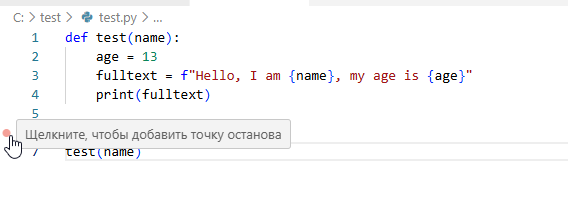

Красная точка 🔴 - это и есть точка останова. Она тоже имеет параметры, которые можно настраивать, для этого можно нажать по ней правой кнопкой мыши и выбрать "Изменить Точка останова...":

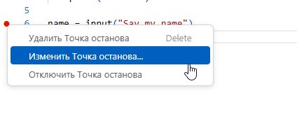

При этом появляется строка, где можно указать выражение. Если указанное выражение будет равно true, то код установится.

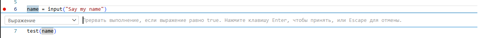

Но мы не будем устанавливать ничего - так как нам нужно, чтобы точка работала всегда. Закроем меню (нажав Escape).

Теперь нажмём F5 или запустим код через кнопку запуска на интерфейсе.

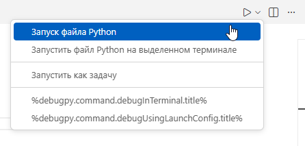

После запуска мы сразу увидим в терминале "Say my name:" - там нужно будет написать что-нибудь. К примеру, я напишу "Timur" и нажму Enter:

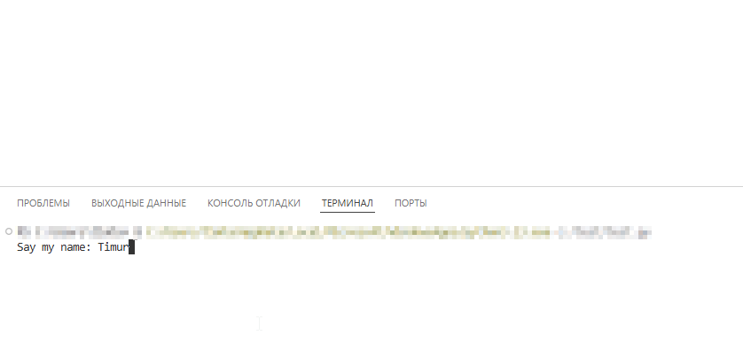

Так программа запустилась сразу. А как запустить отладку?

### Запуск в режиме отладки

Для этого мы ищём на интерфейсе кнопку "Запуск и отладка" либо просто нажимаем F5. Это более продвинутый запуск, с глубокими возможностями исследования хода выполнения. Поскольку мы поставили точку останова, то код остановится именно там.

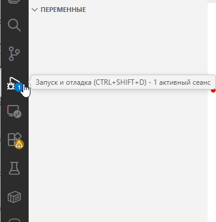

После запуска в режиме отладки (кстати, если откроется окно с выбором обработчика - выбирайте Python Debugger) мы увидим более продвинутый интерфейс:

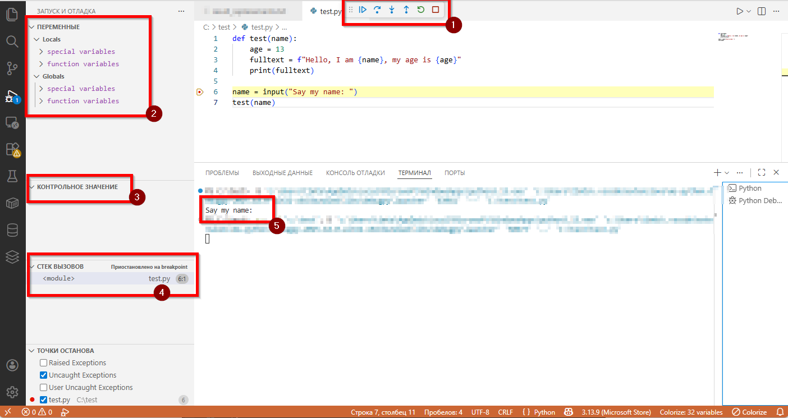

Здесь мы видим:
1. Панель управления ходом выполнения. Здесь есть кнопки:
- Продолжить (F5);
- Шаг с обходом (F10);
- Шаг с заходом (F11);
- Шаг с выходом (Shift+F11);
- Перезапустить (Ctrl+Shift+F5);
- Остановить (Shift+F5).

2. Панель с данными. Там мы видим, что есть "Переменные", которые разделены на Locals и Globals.

3. Контрольное значение.

4. Стек вызовов.

5. Само выполнение программы - текст в терминале "Say my name: ".

### Анализ

Попробуем снова ввести Timur и нажмём Enter. После этого мы заметим, что в function variables появилась переменная `name = 'Timur'`, и она отобразится сразу в окне с кодом на 7-й строке.

После этого нажмём на шаг с заходом, и увидим, что мы попали в функцию:

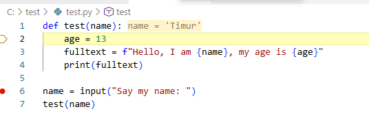

Так можно погружаться внутрь функций и выполнять код построчно, проверяя стек вызовов, значения переменных и параметров. Например, наша функция test(name) была вызвана и в неё передали значение "Timur", это мы и видим. Теперь идём пошагово по каждой строке, нажимая снова и снова на кнопку "Шаг с обходом".

На четвертой строке с выводом fulltext мы видим, уже итог:

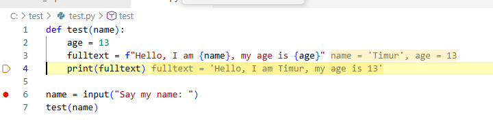

Попробуйте исследовать всё, что видите на интерфейсе - так и происходит изучение работы программы. Порой необходимо проверить, всё ли корректно работает, корректно записывается и вызывается - вы буквально идёте построчно в поиске проблем.

---

## Отладка в браузере

Отладка JavaScript/TypeScript в браузере осуществляется с помощью встроенных средств разработчика (DevTools). Эта практика особенно актуальна при веб-разработке, поскольку позволяет исследовать поведение кода в реальном времени, включая DOM-взаимодействия, сетевые запросы и асинхронные операции.

---

### Подготовка

1. Откройте Visual Studio Code и создайте новый HTML-файл, например `debug.html`, со следующим содержимым:

```html
<!DOCTYPE html>
<html lang="ru">
<head>
  <meta charset="UTF-8">
  <title>Debug Practice</title>
</head>
<body>
  <button id="clickme">Нажми меня</button>
  <p id="output"></p>

  <script>
    function sayHello(name) {
      const age = 25;
      const message = `Привет, ${name}! Тебе ${age} лет.`;
      document.getElementById('output').textContent = message;
      return message;
    }

    document.getElementById('clickme').addEventListener('click', () => {
      const name = prompt('Как вас зовут?');
      if (name) {
        sayHello(name);
      }
    });
  </script>
</body>
</html>
```

2. Откройте этот файл в браузере (например, через `Open with Live Server` в VS Code или просто перетащите файл в окно браузера).

---

### Запуск DevTools и точка останова

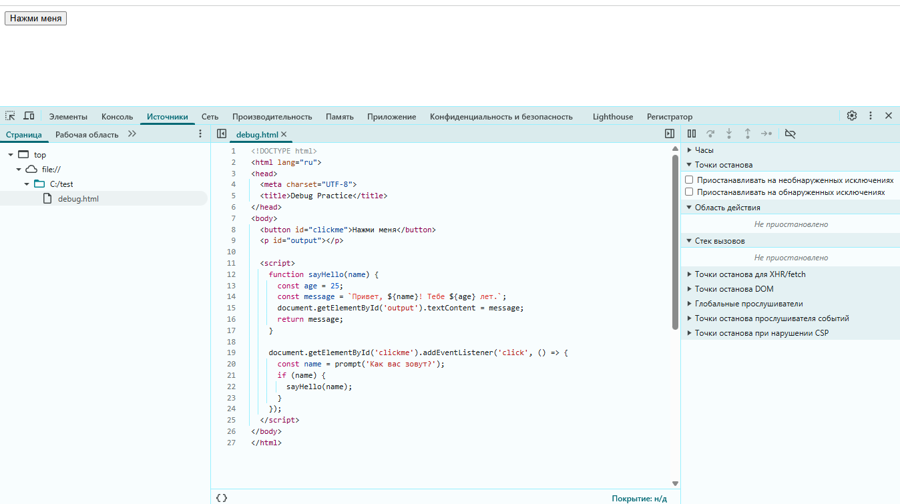

1. В браузере (Chrome/Edge) нажмите `F12` или `Ctrl+Shift+I`, чтобы открыть DevTools.
2. Перейдите на вкладку **Sources** (Источники).
3. Слева отобразится дерево ресурсов. Раскройте `top` → `localhost:5500` (или `file://`) и выберите `debug.html`.
4. В открывшемся редакторе найдите тело скрипта. Найдите строку с вызовом `sayHello(name);`.
5. Щёлкните по номеру строки слева от `sayHello(name);`. Появится синяя метка — это **точка останова**.

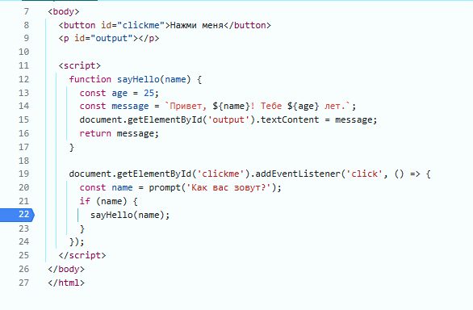

> **Примечание**: можно также поставить точку останова внутри функции `sayHello` — это позволит осмотреть стек вызовов и локальные переменные в момент входа.

6. Вернитесь на вкладку страницы и нажмите кнопку *Нажми меня*. При появлении `prompt()` введите имя (например, *Тимур*) и подтвердите.

7. Исполнение приостановится на точке останова. В DevTools откроется панель с текущим контекстом:
   - `1` — **Call Stack** (текущий стек вызовов: `onclick → <anonymous>`);
   - `2` — **Scope** (локальные переменные: `name = 'Тимур'`);
   - `3` — **Watch**, **Breakpoints**, **XHR/fetch Breakpoints** при необходимости.
   - `4` - **Панель управления**, содержащая те самые Step Into, Step Over.
   
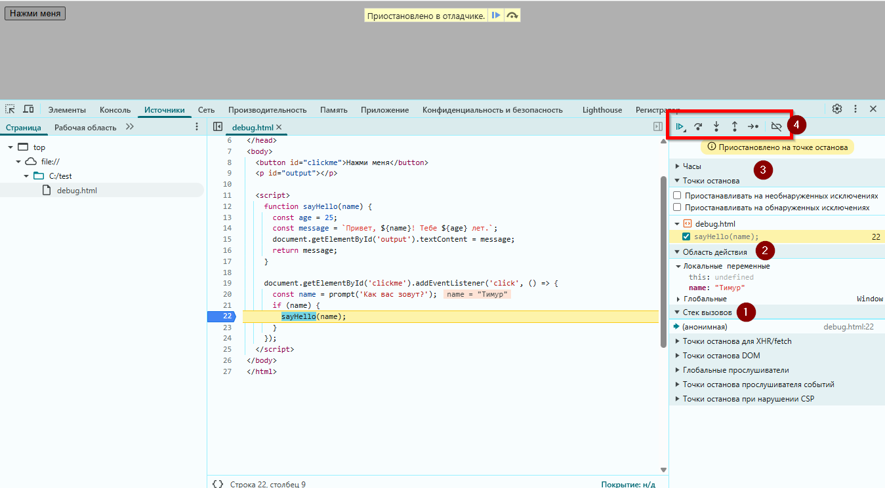

---

### Пошаговое выполнение

- Нажмите **Step Into** (кнопка со стрелкой вправо и точкой; `F11`), чтобы войти в функцию `sayHello`.
- Теперь вы находитесь внутри функции: переменные `age`, `message` ещё не вычислены.
- Нажмите **Step Over** (`F10`) несколько раз:  
  — `age = 25` → появляется в **Local Scope**;  
  — `message = ...` → значение вычисляется и также отображается.
- Последняя строка (`textContent = message`) изменит DOM. Перейдите на вкладку **Elements**, чтобы увидеть обновление `<p id="output">`.

---

### Полезные инструменты в DevTools

- **Console**: можно вычислять произвольные выражения в текущем контексте (например, `name.toUpperCase()`).

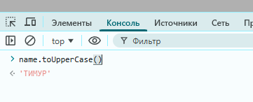

- **Watch Expressions**: добавьте `document.getElementById('output').textContent` — значение будет обновляться при каждом шаге.
- **Conditional breakpoints**: ПКМ по номеру строки → *Add conditional breakpoint* → введите, например, `name === 'Timur'`.

Такая отладка помогает отследить асинхронные эффекты, проблемы с DOM, race-conditions и неожиданное поведение внешних библиотек.

При работе через браузер можно использовать DevTools на полную, например, если вы знаете, как называется нужный вам скрипт, вы можете нажимать Ctrl+P в источниках и искать нужный файл.

---

### Структурированное логирование в DevTools

При отладке сложных сценариев в браузере стандартный вывод через `console.log()` может быстро терять читаемость, особенно при работе с массивами объектов или асинхронными цепочками. Современные DevTools предоставляют встроенные методы для улучшения представления данных в консоли.

#### Табличный вывод

Метод `console.table()` отображает массивы объектов в виде интерактивной таблицы. Каждое поле объекта становится колонкой, а элементы — строками. Пример:

```javascript
const bugs = [
  { id: 1, title: "CSS не грузится", status: "open" },
  { id: 2, title: "API 500", status: "fixed" },
  { id: 3, title: "Кнопка не реагирует", status: "open" }
];

console.table(bugs);
```

В DevTools такая таблица поддерживает сортировку по колонкам и позволяет быстро оценить содержимое коллекций, особенно при анализе API-ответов или состояний приложения.

#### Стилизованные сообщения

Для выделения важных событий можно применять CSS-стили к сообщениям консоли с помощью спецификатора `%c`:

```javascript
console.log(
  "%cCRITICAL BUG DETECTED",
  "font-size: 18px; font-weight: bold; color: red;"
);
```

Этот приём помогает визуально отделить критические этапы выполнения от обычного потока логов и удобен при временной диагностике.

#### Группировка сообщений

Для структурирования последовательностей операций используется группировка:

```javascript
console.group("User Load Flow");
console.log("Запрос данных пользователя");
console.log("Запрос ролей");
console.groupEnd();
```

Группы сворачиваются и разворачиваются в интерфейсе консоли, что упрощает навигацию по многоуровневым логам, особенно в асинхронных или событийно-ориентированных сценариях.

## Присоединение к процессу в Visual Studio

Отладка посредством **присоединения к уже запущенному процессу** особенно полезна для:
- служб Windows (Windows Service),
- веб-приложений, запущенных в IIS (не IIS Express),
- long-running процессов (например, background-сервисы на .NET),
- случаев, когда инициация отладки с самого начала невозможна (например, ошибка возникает через час работы).

Рассмотрим пример с простым консольным приложением на C#, которое запускается вне Visual Studio.

---

### Подготовка проекта

1. В Visual Studio создайте новое консольное приложение (.NET 6+ или .NET Framework).
2. Замените содержимое `Program.cs` на:

```csharp
using Система;
using Система.Threading;

class Program
{
	static void Main()
	{
		Console.WriteLine("Приложение запущено. Ожидание 30 секунд перед стартом...");
		Thread.Sleep(30_000);

		var name = "Тимур";
		var result = ProcessName(name);
		Console.WriteLine($"Результат: {result}");
		Console.WriteLine("Готово. Нажмите Enter для выхода.");
		Console.ReadLine();
	}

	static string ProcessName(string input)
	{
		// Точка для отладки
		var clean = input?.Trim();
		var upper = clean?.ToUpperInvariant();
		return $"[ОБРАБОТАНО] {upper}";
	}
}
```

---

3. Выполните сборку в **Debug**-конфигурации (`Ctrl+Shift+B`).
   Убедитесь, что сгенерирован `*.pdb`-файл рядом с исполняемым (`bin\Debug\netX\YourApp.pdb`).
   
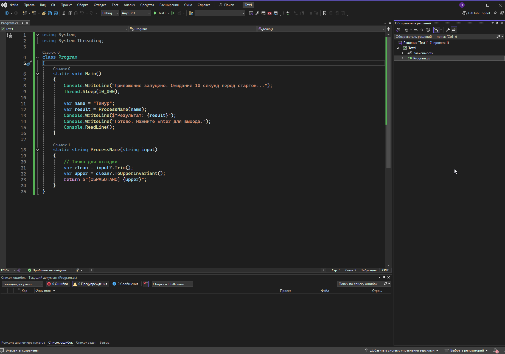

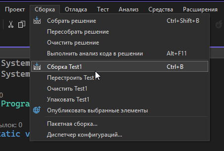

У меня, например, приложение называется `Test1.exe` - около него как раз лежит `Test1.pdb`.

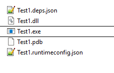

---

### Запуск вне отладчика

1. В проводнике перейдите в папку `bin\Debug\netX`.
2. Запустите `.exe`-файл двойным кликом.

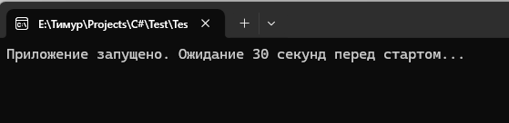

> Программа запустится в консоли, выведет сообщение и будет спать 30 секунд.

---

### Присоединение отладчика

1. Вернитесь в Visual Studio, где открыт тот же проект.
2. В меню выберите: **Отладка → Присоединиться к процессу…** (`Ctrl+Alt+P`).

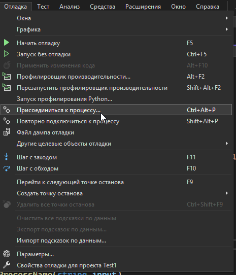

---

3. В открывшемся окне:
   - В поле с доступными процессами найдите ваш `.exe` по имени (например, `DebugAttachDemo.exe`).
   - Убедитесь, что в колонке *Type* указано `Managed (.NET 6+, .NET Core)` или аналогичное (не *Automatic* в случае смешанного кода).
   - Выделите процесс и нажмите **Присоединить**.

   > Если процесс не отображается, поставьте галочку *Показать процессы для всех пользователей*.
   
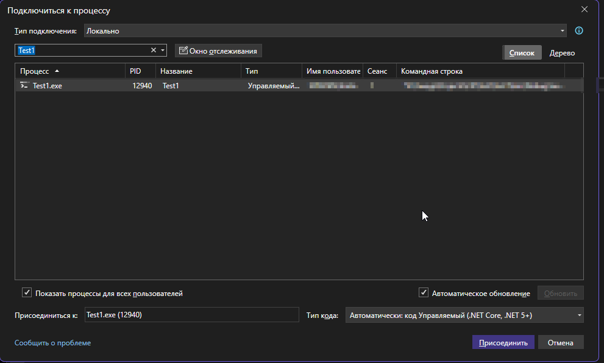

---

4. После подключения:
   - Вернитесь в редактор `Program.cs`.
   - Установите **точку останова** 🔴 на строке `var clean = input?.Trim();` внутри `ProcessName`.
   - Дождитесь, когда пройдут 30 секунд, и приложение дойдёт до вызова `ProcessName`.
   
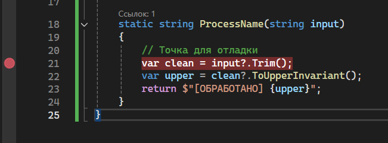

---

5. При достижении точки останова выполнение приостановится. Вы увидите:

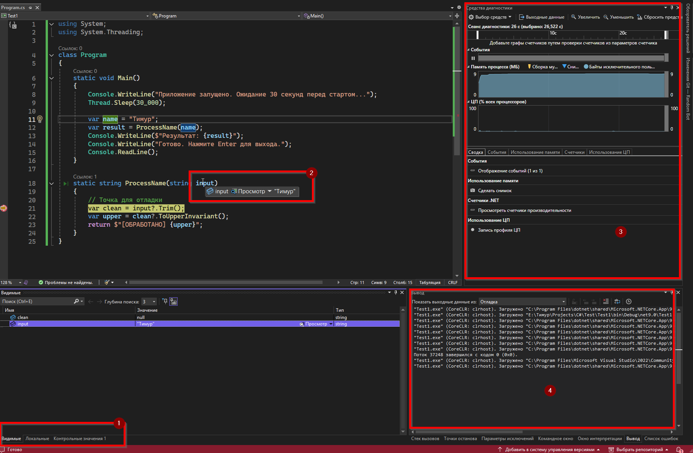

- 1 - Окно с локальными и видимыми значениями.
- 2 - При наведении на переменные или параметры - их значения.
- 3 - Средства диагностики, которые отображают технические подробности.
- 4 - Окно вывода.

В окне **Локальные**: `input = "Тимур"`, затем `clean`, `upper` по мере шагов.
В **Стеке вызовов** (к которому можно перейти через вкладку окна вывода): `ProcessName(String) → Main()` со ссылками на исходники.
В **Потоках**: основной поток (`Main Thread`), состояние — *Break*.

6. Используйте команды `Step Over` / `Step Into`, как при обычной отладке.

---

### Особенности и ограничения

- **Загрузка символов**: если `pdb` отсутствует или не загружен, точка останова будет помечена восклицательным знаком и не сработает. Проверить можно в **Модулях** (`Отладка → Окна → Модули`) — колонка *Статус символов*.

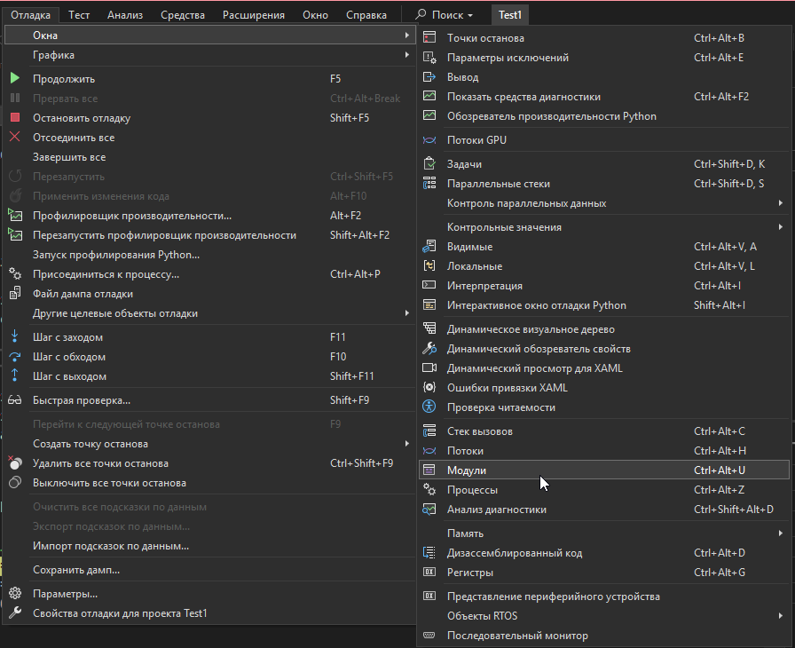

- **Оптимизация**: если сборка выполнена в `Release`, JIT-оптимизация может переупорядочить или удалить код — точка останова может сработать не на той строке или вовсе пропуститься. Решение: отключить оптимизацию в *Project Properties → Build → Advanced → Debug Info = full, Optimize code = false*.
- **Remote debugging**: Visual Studio поддерживает присоединение к удалённым процессам через *Remote Tools for Visual Studio*.

Присоединение к процессу позволяет анализировать живые системы без их перезапуска, что критично для production-диагностики и устранения редких, трудновоспроизводимых ошибок.

---