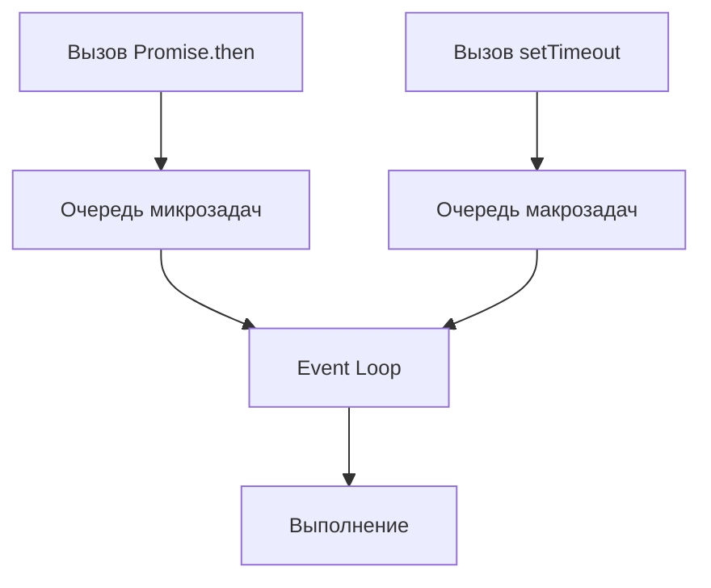

# Основы веб-разработки и типичные оплошности

<div class="article-tags">
  <span class="tag tag-required">ОБЯЗАТЕЛЬНО</span>
  <span class="tag tag-beginner">ДЛЯ НОВИЧКОВ</span>
</div>

<span class="complexity-badge">Разработчику</span>
<span class="complexity-badge">Архитектору</span>
<span class="complexity-badge">Инженеру</span>

---

## Основы веб-разработки и типичные оплошности

Веб-разработка охватывает широкий спектр дисциплин: от вёрстки и стилизации до серверной логики и инфраструктуры. Начинающие специалисты сталкиваются с множеством подводных камней. Опыт приходит через анализ чужих и собственных ошибок. Изучение типичных оплошностей ускоряет профессиональный рост и помогает писать чистый, поддерживаемый код.

---

## Семантика и разметка

### Структурные оплошности HTML

**Div-soup (div-суп)** — создание разметки исключительно через вложенные теги `div`. Такой подход игнорирует семантику. Семантические теги `header`, `nav`, `main`, `article`, `section`, `aside`, `footer` придают документу смысл, улучшают индексацию поисковыми системами и обеспечивают корректную работу программ чтения с экрана.

**Ошибочное применение тегов `a` и `button`**. Ссылка `a` предназначена для навигации и изменения URL. Кнопка `button` выполняет действия на странице. Применение конструкции `a href="#"` с JS-обработчиком ломает навигацию с клавиатуры и контекстное меню.

**Пропуск уровней заголовков**. Заголовки `h1`, `h2`, `h3` образуют логическое дерево документа. Использование тегов `h*` исключительно для увеличения размера шрифта нарушает иерархию. Поисковые роботы и скринридеры опираются на эту структуру.

**Отсутствие атрибута `alt`**. Информативные картинки требуют осмысленного описания. Декоративные изображения получают пустой атрибут `alt=""`. Скринридеры зачитывают имя файла (например, `IMG_2847.jpg`) при отсутствии текстового описания.

**Применение тега `br` для отступов**. Тег `br` служит для переноса строк в стихах, адресах или поэмах. Вертикальные отступы создаются через CSS-свойства `margin` и `padding`.

```html
<!-- Ошибочный вариант -->
<div class="header">
  <div class="title">Заголовок</div>
  <div class="menu">
    <a href="#" onclick="doSomething()">Кликни</a>
  </div>
</div>

<!-- Корректный вариант -->
<header>
  <h1>Заголовок</h1>
  <nav>
    <button type="button" onclick="doSomething()">Кликни</button>
  </nav>
</header>
```

Разбор:
- `header` и `nav` задают семантическую структуру;
- `h1` обозначает главный заголовок;
- `button` корректно обрабатывает действия и поддерживает фокус с клавиатуры.

---

## Каскадные таблицы стилей

### Оплошности стилизации

**Злоупотребление модификатором `!important`**. Данный маркер свидетельствует о проблемах со специфичностью или спешке. Частое применение делает переопределение стилей крайне затруднительным, требуя ещё более сильных правил с `!important`.

**Инлайновые стили `style="..."`**. Смешивание структуры и представления блокирует переиспользование кода и препятствует работе псевдоклассов `:hover`, `:focus`.

**Магические числа**. Значения `width: 347px; top: 13px;` требуют объяснения их происхождения. CSS-переменные, именованные константы и комментарии решают эту проблему, делая код понятным.

**Хаотичный `z-index`**. Бессистемное увеличение значений `z-index: 99999` игнорирует контекст стекирования (stacking context). Архитектурные подходы, шкалы `z-index` и CSS-переменные для слоёв упорядочивают наложение элементов.

**Абсолютные единицы измерения**. Игнорирование относительных единиц `rem`, `em`, `%`, `vh`, `vw` и медиа-запросов делает интерфейс жёстким. Адаптивный дизайн требует гибких значений.

**Дублирование свойств**. Копирование блоков CSS устраняется применением препроцессоров, CSS-переменных или utility-классов.

```css
:root {
  --z-index-modal: 1000;
  --z-index-dropdown: 500;
  --spacing-md: 16px;
}

.modal {
  z-index: var(--z-index-modal);
  padding: var(--spacing-md);
}
```

Пояснения:
- `:root` задаёт глобальные CSS-переменные;
- `--z-index-modal` и `--z-index-dropdown` управляют слоями наложения;
- `--spacing-md` стандартизирует отступы.

---

## Логика и скрипты

### Заблуждения в JavaScript

**Устаревшее объявление переменных через `var`**. Ключевое слово `var` обладает функциональной областью видимости и поднимается (hoisting), что вызывает скрытые ошибки. `const` служит стандартом по умолчанию, `let` применяется при потребности в переприсвоении.

**Нестрогое сравнение `==`**. Оператор `==` выполняет приведение типов (`0 == ""` даёт `true`), что служит источником трудноуловимых ошибок. Строгое сравнение `===` гарантирует точность и предсказуемость.

**Игнорирование обработки ошибок**. Пропуск `try/catch`, отсутствие проверки `response.ok` у `fetch`, промисы без `.catch()` приводят к скрытым сбоям (silent failures).

**Прямая мутация DOM в цикле**. Операции `element.innerHTML += ...` или последовательные `appendChild` вызывают reflow на каждой итерации. Сборка фрагмента через `DocumentFragment` или массив строк с последующей вставкой оптимизирует процесс.

**Глобальные переменные**. Засорение глобальной области видимости вызывает конфликты имён и утечки памяти. Модульная структура изолирует переменные.

**Callback hell**. Вложенные колбэки ухудшают читаемость. Promise и async/await предоставляют линейный и понятный синтаксис.

```javascript
// Ошибочный подход
var data = fetchData();
if (data == "") {
  document.body.innerHTML += "<div>Пусто</div>";
}

// Корректный подход
const data = await fetchData();
if (data === "") {
  const fragment = document.createDocumentFragment();
  const div = document.createElement("div");
  div.textContent = "Пусто";
  fragment.appendChild(div);
  document.body.appendChild(fragment);
}
```

Разбор:
- `const` заменяет `var`;
- `===` обеспечивает строгое сравнение;
- `DocumentFragment` минимизирует обращения к DOM;
- `textContent` защищает от XSS-инъекций.

---

## Асинхронные операции

### Работа с циклом событий

**Пропуск `await` внутри `async`**. Функция с маркером `async` требует `await` для корректного ожидания промиса. Возврат промиса напрямую ломает логику выполнения и порядок операций.

**Смешивание `then` и `async/await`**. Комбинирование подходов в одном файле снижает читаемость кода. Единый стиль упрощает поддержку.

**Путаница в Event Loop**. Ожидание мгновенного выполнения `setTimeout(fn, 0)` игнорирует механику цикла событий. Разделение микрозадач (Promise) и макрозадач (setTimeout, setInterval) объясняет порядок выполнения.

**Ошибочные попытки обхода CORS на клиенте**. Проблема CORS решается настройкой сервера или применением прокси на этапе разработки. Клиентский код бессилен против политик безопасности браузера.



Схема демонстрирует приоритет микрозадач над макрозадачами в цикле событий.

---

## Производительность

### Оптимизация ресурсов

**Блокирующий рендеринг**. Скрипты в `<head>` без атрибутов `defer` или `async` останавливают парсинг HTML. Браузер ожидает загрузки и выполнения JS перед отрисовкой страницы.

**Тяжёлые изображения**. Загрузка PNG 4000x3000 px для превью 200x150 px расходует трафик. Форматы WebP, AVIF, ленивая загрузка (lazy loading) и `srcset` оптимизируют вес страницы.

**Монолитные бандлы**. Загрузка одного огромного JS-файла замедляет старт. Динамический импорт `import()` разделяет код на логические части (code splitting).

**Утечки памяти**. Забытые `setInterval`, `addEventListener` при размонтировании компонентов и замыкания на большие объекты удерживают память. Очистка ресурсов при уничтожении компонента обязательна.

**Блокировка главного потока**. Парсинг больших JSON и сложные вычисления останавливают отрисовку интерфейса. Web Workers берут на себя фоновые вычисления, сохраняя плавность UI.

| Проблема | Решение |
| :--- | :--- |
| Блокирующий JS | Атрибуты `defer` и `async` |
| Тяжёлые картинки | Форматы WebP, AVIF, `srcset` |
| Огромный бандл | Динамический `import()` |
| Блокировка UI | Web Workers |

---

## Информационная безопасность

### Уязвимости клиентского кода

**XSS-уязвимости через `innerHTML`**. Вставка пользовательского ввода без санитизации позволяет выполнять произвольный JS-код. `textContent`, React-рендеринг или библиотека DOMPurify гарантируют безопасность.

**Секреты в клиентском коде**. API-ключи, токены и пароли в JS-файлах видны через DevTools. Секретные данные хранятся исключительно на бэкенде.

**Открытый протокол HTTP**. Отсутствие шифрования канала делает уязвимыми сессии, куки и пользовательские данные. HTTPS гарантирует защиту трафика.

**Устаревшие зависимости**. Регулярный аудит и обновление пакетов:

```bash
npm audit
npm audit fix
```

```javascript
// Уязвимый код
userDiv.innerHTML = userInput;

// Безопасный код
userDiv.textContent = userInput;
```

Метод `textContent` интерпретирует данные как текст, исключая выполнение скрытых скриптов.

---

## Доступность интерфейсов

### Инклюзивный дизайн

**Кликабельные `div` без семантики**. Элемент `div` с обработчиком клика требует атрибутов `role="button"`, `tabindex="0"` и обработчиков `Enter`/`Space` для поддержки клавиатуры.

**Низкий контраст**. Текст, сливающийся с фоном, нарушает стандарты WCAG AA. Проверка контрастности гарантирует читаемость для пользователей с особенностями зрения.

**Пропуск `aria-*` атрибутов**. Кастомные виджеты (модальные окна, табы, аккордеоны) требуют `aria-expanded`, `aria-selected`, `aria-controls`. Эти атрибуты сообщают скринридерам о состоянии элементов.

**Потеря фокуса**. После открытия модального окна фокус переводится на него, а после закрытия возвращается на триггер-элемент. Управление фокусом сохраняет логику навигации.

---

## Архитектура приложения

### Организация кодовой базы

**God-объекты и God-компоненты**. Файлы на 2000+ строк нарушают принцип единой ответственности (SRP). Декомпозиция разделяет логику на управляемые модули.

**Смешивание слоёв**. Бизнес-логика в UI-компонентах, SQL-запросы в контроллерах и HTML-генерация в моделях нарушают архитектуру. Разделение слоёв упрощает тестирование и поддержку.

**Дублирование кода**. Три одинаковые формы заменяются одной переиспользуемой с параметрами. Преждевременная абстракция (создание универсального компонента для одного случая) также ведёт к усложнению. Баланс между дублированием и абстракцией приходит с опытом.

**Отсутствие типизации**. В проектах объёмом больше 5–10 файлов отсутствие TypeScript приводит к ошибкам регрессии, выявляемым только в runtime. Статическая типизация ловит ошибки на этапе компиляции.

---

## Инструменты и инфраструктура

### Контроль версий и пакеты

**Прямые коммиты в `main`**. Отсутствие git-flow или feature-branches делает код в production нестабильным. Ветвление изолирует эксперименты и новые функции.

**Бессмысленные commit-сообщения**. Текст `fix`, `update`, `wip` заменяется конвенциональными коммитами (`feat:`, `fix:`, `docs:`) по стандарту Conventional Commits. История изменений становится прозрачной.

**Пропуск `.gitignore`**. Коммит `node_modules`, `.env`, IDE-конфигов и сборочных артефактов захламляет репозиторий. Файл `.gitignore` фильтрует лишние файлы.

**Игнорирование lock-файлов**. Отсутствие `package-lock.json` или `yarn.lock` приводит к установке разных версий зависимостей у участников команды. Lock-файлы фиксируют точные версии пакетов.

---

## Обработка информации

### Валидация и хранение

**`localStorage` как база данных**. Хранение больших структур и состояния приложения в `localStorage` блокирует главный поток из-за синхронной работы и лимита в 5–10 МБ. IndexedDB или серверное хранение подходят для больших объёмов.

**Слепое доверие данным**. Данные с клиента или из API требуют валидации на всех слоях (Zod, Yup, class-validator). Проверка типов и форматов защищает от сбоев.

**Парсинг без обработки ошибок**. Вызов `JSON.parse()` на непроверенных данных без `try/catch` обрушивает приложение при невалидном payload. Обработка исключений сохраняет стабильность.

```typescript

import { z } from "zod";

const UserSchema = z.object({
  id: z.number(),
  name: z.string(),
});

try {
  const raw_data = '{"id": 1, "name": "Алиса"}';
  const parsed_data = JSON.parse(raw_data);
  const user = UserSchema.parse(parsed_data);
  console.log(user.name);
} catch (error) {
  console.error("Сбой парсинга или валидации:", error);
}
```

Разбор:
- `z.object` описывает ожидаемую структуру;
- `JSON.parse` преобразует строку в объект;
- `UserSchema.parse` проверяет соответствие схеме;
- `try/catch` перехватывает любые сбои.

---
---

{/* http-basics-link  */}
<div class="callout callout--tip">
  <div class="callout-title">Основа по протоколу</div>
  Базовый разбор HTTP и HTTPS находится в отдельной статье — [HTTP как основа веб-интеграций](/encyclopedia/2-system-network/2-09-osnovy-integratsionnogo-vzaimodeystviya/118).
</div>

